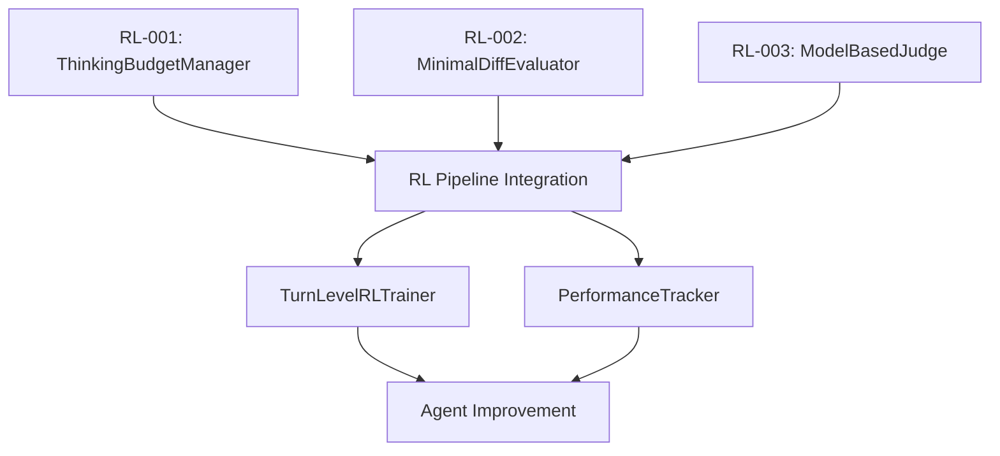

<!-- a67a784b-a971-4f43-8a0f-102e3297388e 7380e03d-20e0-469c-973e-1df2b4a995f2 -->
# CAWS-Compliant RL System Implementation Plan

## Overview

Implement missing RL components to enable self-improving agent capabilities while maintaining CAWS quality standards. Build incrementally with validation gates at each phase.

## Critical Path Components

### Phase 1: Foundation - Working Specs & Architecture (Week 1)

**Goal**: Create validated working specs for all missing RL components

**Tasks**:

1. **Create RL-001 Working Spec**: ThinkingBudgetManager

   - Define acceptance criteria (token allocation by complexity)
   - Set performance budgets (allocation <50ms)
   - Define contracts (TypeScript interfaces)
   - Map to main spec acceptance V2-RL-001

2. **Create RL-002 Working Spec**: MinimalDiffEvaluator

   - Define acceptance criteria (AST diff analysis, minimality scoring)
   - Set performance budgets (diff analysis <200ms)
   - Define contracts (evaluation interfaces)
   - Map to main spec acceptance V2-RL-002

3. **Create RL-003 Working Spec**: ModelBasedJudge

   - Define acceptance criteria (confidence scoring, subjective evaluation)
   - Set performance budgets (judgment <500ms)
   - Define contracts (judge interfaces)
   - Map to main spec acceptance V2-RL-004

4. **Validate All Specs**: Run `caws validate` on each spec

**Validation Gate**: All 3 specs must pass CAWS validation before proceeding

---

### Phase 2: ThinkingBudgetManager Implementation (Week 1-2)

**Goal**: Implement adaptive token allocation for RL training

**File Structure**:

```
src/thinking/
├── ThinkingBudgetManager.ts
├── TaskComplexityAnalyzer.ts
├── BudgetAllocator.ts
├── types/
│   └── thinking-budget.ts
└── __tests__/
    ├── thinking-budget-manager.test.ts
    └── budget-allocation.test.ts
```

**Implementation Requirements**:

- Token allocation: trivial ≤500, standard ≤2000, complex ≤8000
- Complexity assessment based on task surface
- Budget tracking and enforcement
- Overflow protection (hard ceilings)

**Testing Requirements** (Tier 2):

- Branch coverage: ≥80%
- Unit tests for all allocation logic
- Edge cases: budget exhaustion, complexity miscalculation
- Integration with task types

**Acceptance Validation**:

- ✅ Allocates correct tokens per complexity level
- ✅ Prevents budget exhaustion
- ✅ Tracks usage accurately
- ✅ Performance: allocation <50ms

---

### Phase 3: MinimalDiffEvaluator Implementation (Week 2-3)

**Goal**: Implement AST-based diff analysis for reward calculation

**File Structure**:

```
src/evaluation/
├── MinimalDiffEvaluator.ts
├── ASTDiffAnalyzer.ts
├── ScaffoldingDetector.ts
├── types/
│   └── evaluation.ts
└── __tests__/
    ├── minimal-diff-evaluator.test.ts
    └── ast-diff-analyzer.test.ts
```

**Implementation Requirements**:

- AST parsing for code diffs
- Similarity scoring (0.1-1.0)
- Scaffolding penalty detection
- Minimality factor calculation

**Testing Requirements** (Tier 2):

- Branch coverage: ≥80%
- Test with real code diffs
- Edge cases: empty diffs, massive changes
- Validate reward multiplication

**Acceptance Validation**:

- ✅ Calculates minimality factor (0.1-1.0)
- ✅ Detects scaffolding accurately
- ✅ AST similarity matches expectations
- ✅ Performance: analysis <200ms

---

### Phase 4: ModelBasedJudge Implementation (Week 3-4)

**Goal**: Implement LLM-as-judge for subjective evaluation

**File Structure**:

```
src/evaluation/
├── ModelBasedJudge.ts
├── ConfidenceScorer.ts
├── EvaluationCriteria.ts
├── types/
│   └── judge.ts
└── __tests__/
    ├── model-based-judge.test.ts
    └── confidence-scorer.test.ts
```

**Implementation Requirements**:

- LLM integration for judgment
- Confidence scoring (0-1)
- Multi-criteria assessment (faithfulness, relevance, minimality, safety)
- Prompt engineering for consistent judgments

**Testing Requirements** (Tier 2):

- Branch coverage: ≥80%
- Mock LLM for deterministic tests
- Test all evaluation criteria
- Validate confidence scoring

**Acceptance Validation**:

- ✅ Provides confidence-scored assessments
- ✅ Evaluates all 4 criteria
- ✅ Consistent results with same inputs
- ✅ Performance: judgment <500ms

---

### Phase 5: Integration & RL Pipeline (Week 4-5)

**Goal**: Integrate all RL components into working pipeline

**Tasks**:

1. **Connect to PerformanceTracker**:

   - Hook thinking budget into task execution
   - Record budget usage in performance data

2. **Connect to TurnLevelRLTrainer**:

   - Feed minimal-diff scores into reward calculation
   - Apply model-based judgments to evaluation

3. **Integration Testing**:

   - End-to-end RL training flow
   - Validate data flows correctly
   - Test with real benchmark data

**Testing Requirements** (Tier 2):

- Integration tests with real components
- E2E smoke tests for RL pipeline
- Performance validation under load

**Acceptance Validation**:

- ✅ Budget manager allocates during training
- ✅ Evaluator scores applied to rewards
- ✅ Judge assessments influence training
- ✅ Full pipeline processes 100+ tasks

---

### Phase 6: Quality & CAWS Compliance (Week 5-6)

**Goal**: Ensure all components meet CAWS Tier 2 requirements

**Quality Gates**:

1. **Test Coverage**: ≥80% branch coverage for all RL components
2. **Mutation Testing**: ≥50% mutation score (when unblocked)
3. **Performance**: All components meet P95 budgets
4. **Security**: Input validation, tenant isolation
5. **Documentation**: Complete API docs, architecture docs

**Tasks**:

- Run full test suite
- Generate coverage reports
- Run performance benchmarks
- Security audit
- Update documentation

**Validation Gate**: All quality gates must pass before production deployment

---

## Component Dependencies



## Risk Mitigation

**High Risk Areas**:

1. **AST Parsing Complexity**: Start with simple TypeScript/JavaScript support
2. **LLM Judge Consistency**: Use deterministic prompt engineering + temperature=0
3. **Performance Overhead**: Profile early, optimize critical paths
4. **Integration Coupling**: Use clear interfaces, minimize dependencies

**Mitigation Strategies**:

- Implement incrementally with validation gates
- Test each component in isolation first
- Mock dependencies for unit tests
- Monitor performance continuously

## Success Criteria

**Minimum Viable RL System**:

- ✅ Budget manager allocates tokens correctly
- ✅ Evaluator scores diffs with AST analysis
- ✅ Judge provides subjective assessments
- ✅ All components integrate successfully
- ✅ End-to-end RL training works with benchmark data
- ✅ Meets CAWS Tier 2 quality standards

**Production Readiness**:

- ✅ Test coverage ≥80% across all RL components
- ✅ Performance budgets met
- ✅ Security controls implemented
- ✅ Documentation complete
- ✅ Integration with arbiter orchestration

## Timeline Summary

- **Week 1**: Working specs + ThinkingBudgetManager start
- **Week 2**: ThinkingBudgetManager complete + MinimalDiffEvaluator start
- **Week 3**: MinimalDiffEvaluator complete + ModelBasedJudge start
- **Week 4**: ModelBasedJudge complete + Integration start
- **Week 5**: Integration complete + Quality assurance
- **Week 6**: Final validation + Production readiness

**Total Estimated Effort**: 6 weeks for CAWS-compliant RL system

## Next Immediate Actions

1. Create RL-001 working spec (1 day)
2. Create RL-002 working spec (1 day)
3. Create RL-003 working spec (1 day)
4. Validate all specs with CAWS tools
5. Begin ThinkingBudgetManager implementation

### To-dos

- [ ] Create RL-001 working spec for ThinkingBudgetManager with acceptance criteria, contracts, and performance budgets
- [ ] Create RL-002 working spec for MinimalDiffEvaluator with AST diff requirements and minimality scoring
- [ ] Create RL-003 working spec for ModelBasedJudge with confidence scoring and multi-criteria evaluation
- [ ] Validate all three RL working specs using caws validate tool
- [ ] Implement ThinkingBudgetManager with token allocation logic and complexity analysis
- [ ] Write comprehensive tests for ThinkingBudgetManager (≥80% coverage)
- [ ] Implement MinimalDiffEvaluator with AST parsing and similarity scoring
- [ ] Write comprehensive tests for MinimalDiffEvaluator (≥80% coverage)
- [ ] Implement ModelBasedJudge with LLM integration and confidence scoring
- [ ] Write comprehensive tests for ModelBasedJudge (≥80% coverage)
- [ ] Integrate all RL components into TurnLevelRLTrainer and PerformanceTracker
- [ ] Create end-to-end integration tests for complete RL pipeline
- [ ] Validate all RL components meet CAWS Tier 2 requirements (coverage, performance, security)