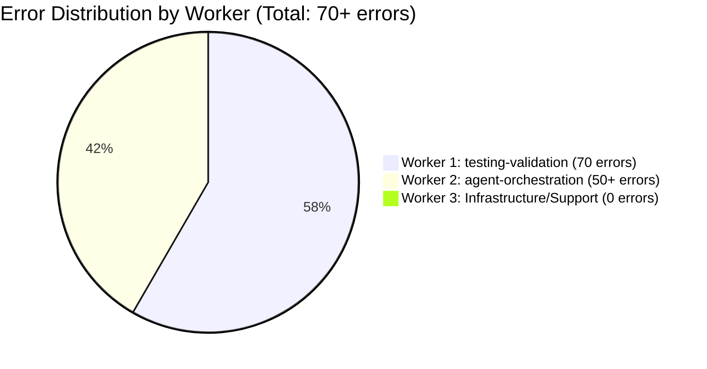
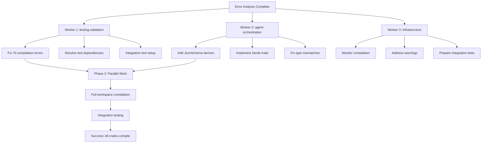
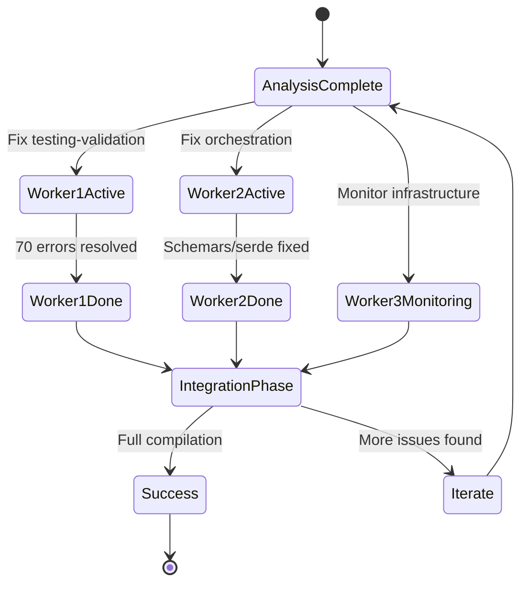
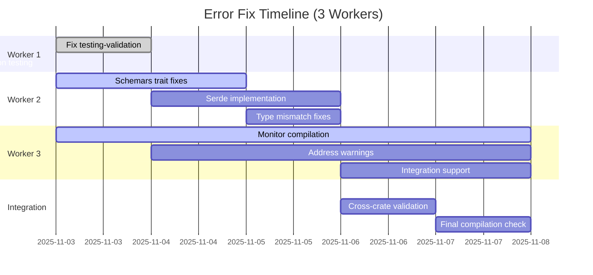

# Error Distribution Visualization

## 📊 Summary Statistics

| Worker | Primary Crate | Error Count | Focus Area | Est. Time |
|--------|---------------|-------------|------------|-----------|
| **1** | testing-validation | 70 | Test Infrastructure | 1-2 days |
| **2** | agent-orchestration | 50+ | Schema/Traits | 3-4 days |
| **3** | Multiple | 0 | Monitoring/Support | 2-3 days |

**Total Estimated Timeline:** 4-5 days for full resolution
