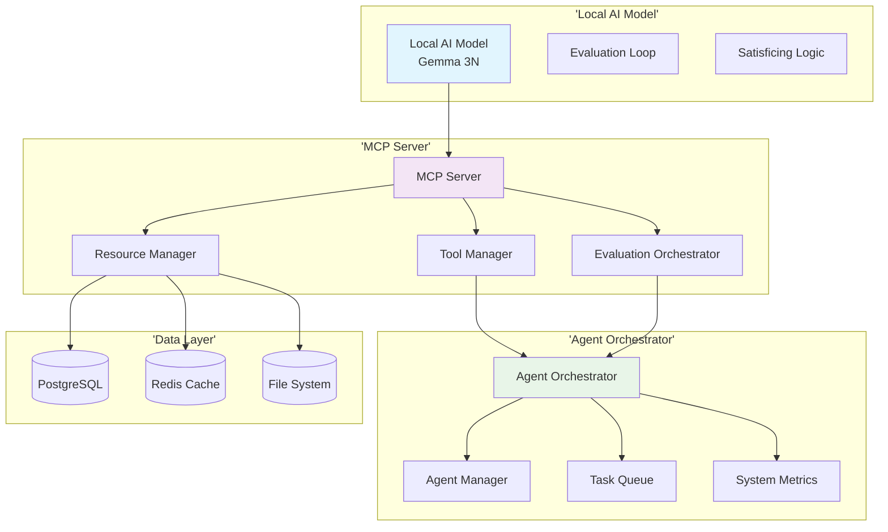
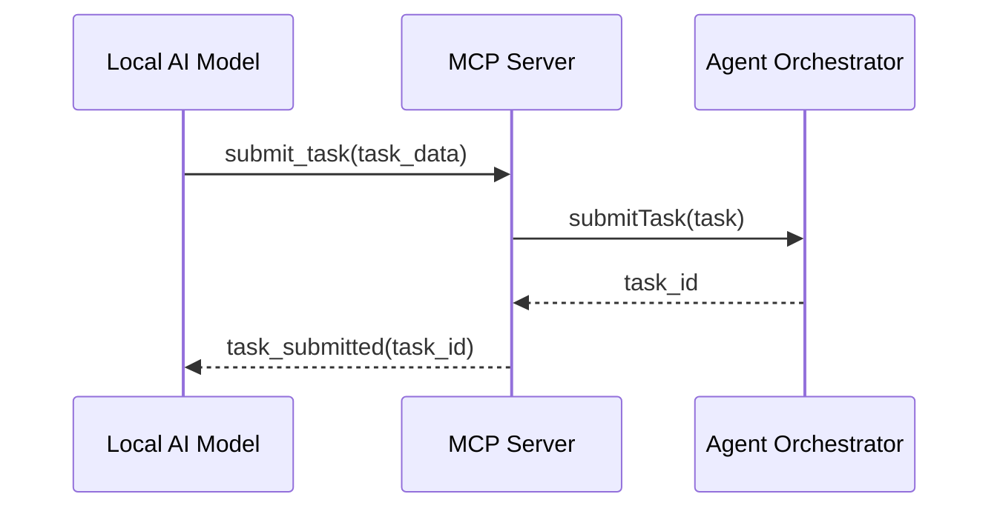
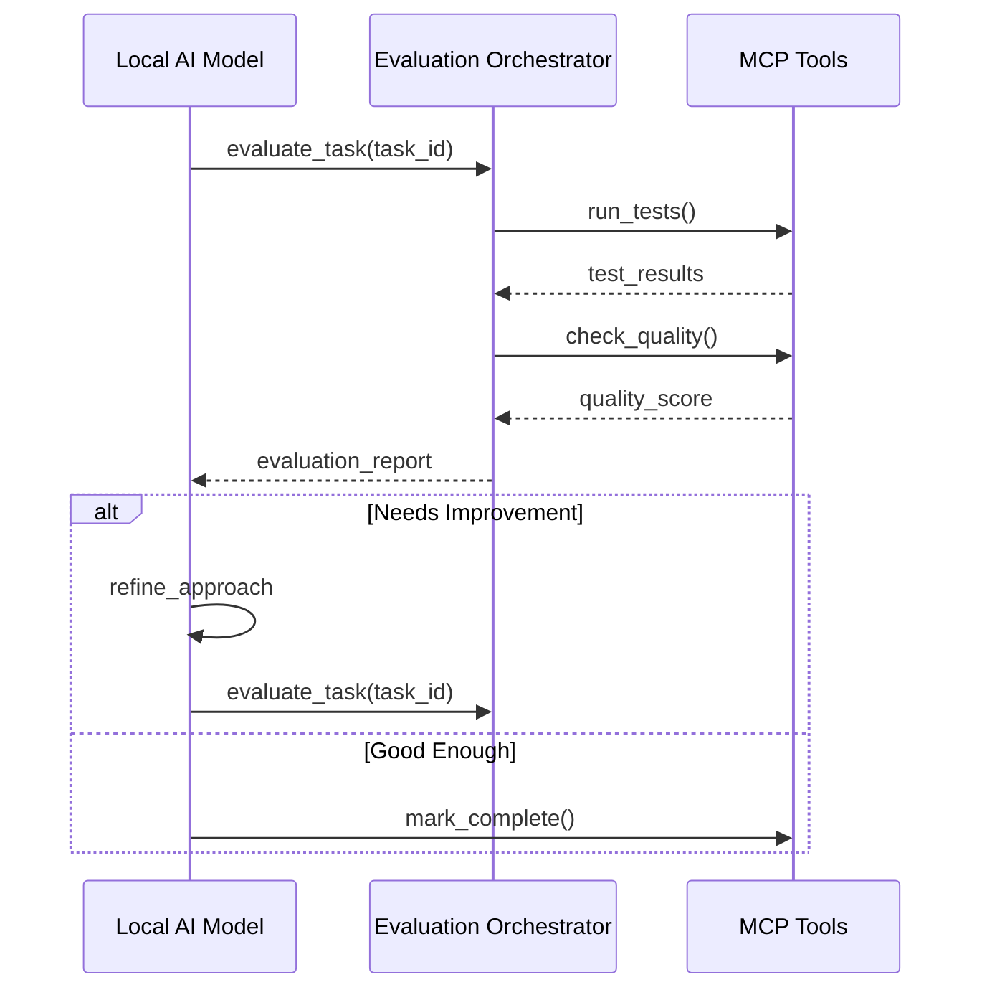

> **⚠️ NOTICE**: This document describes proposed architecture, not current implementation.  
> **Implementation Status**: See [COMPONENT_STATUS_INDEX.md](../iterations/v2/COMPONENT_STATUS_INDEX.md) for actual status.  
> **Last Verified**: 2025-10-13  
> **Status**: Aspirational/Planning Document

---


# MCP Integration for Agent Agency

## Overview

The Model Context Protocol (MCP) integration transforms the Agent Agency from a basic orchestration platform into an autonomous, self-improving system capable of continuous reasoning and validation. This integration enables local AI models (like Gemma) to operate autonomously with built-in evaluation loops, satisficing logic, and comprehensive tool access.

## System Architecture

### Core Components



## Key Features

### 1. Autonomous Agent Operation
- **Self-Prompting Loops**: Agents can iterate on tasks with built-in evaluation and improvement cycles
- **Satisficing Logic**: Prevents endless optimization by enforcing 'good enough' thresholds
- **Continuous Reasoning**: Agents evaluate their own performance and adjust strategies autonomously

### 2. Comprehensive Tool Ecosystem
- **Agent Orchestration**: Register, manage, and coordinate agents through MCP tools
- **Task Management**: Submit, monitor, and evaluate task execution
- **System Monitoring**: Real-time access to agent health and performance metrics
- **Memory Access**: Query agent experiences, capabilities, and relationship history

### 3. Built-in Evaluation Framework
- **Multi-Modal Evaluation**: Text, code, and design token validation
- **Automated Testing**: Integration with existing test suites and linting tools
- **Performance Gates**: Mandatory quality checks with configurable thresholds
- **Iteration Control**: Limits on refinement cycles to prevent over-optimization

### 4. Resource Management
- **Agent Knowledge Base**: Access to agent experiences, capabilities, and relationships
- **Task History**: Complete audit trail of task executions and outcomes
- **System Metrics**: Real-time monitoring of agent health and performance
- **Configuration Access**: Dynamic access to system configuration and policies

## Technology Stack

### Core Technologies

#### MCP Protocol
- **@modelcontextprotocol/sdk**: Official MCP server implementation
- **Stdio Transport**: Standard input/output communication with local models
- **JSON-RPC 2.0**: Robust message passing protocol

#### Local AI Integration
- **Gemma 3N**: Lightweight model for resource-constrained environments
- **Ollama Integration**: Local model hosting and management
- **CLI Interface**: Command-line interaction for autonomous operation

#### Application Layer
- **TypeScript/Node.js**: Core application framework
- **Fastify**: High-performance web framework for REST API
- **GraphQL**: Flexible query language for complex data access

### Dependencies

```json
{
  'dependencies': {
    '@modelcontextprotocol/sdk': '^0.6.0',
    '@fastify/cors': '^9.0.0',
    'pg': '^8.16.3',
    'redis': '^4.6.0',
    'ollama': '^0.6.0',
    'graphql': '^16.11.0',
    'ws': '^8.18.3'
  }
}
```

## MCP Resource Types

### Agent Resources
- **agent://{agentId}**: Individual agent details and status
- **agents://list**: Complete list of registered agents
- **agents://capabilities/{agentId}**: Agent capabilities and proficiency levels
- **agents://relationships/{agentId}**: Agent relationship network

### Task Resources
- **task://{taskId}**: Individual task details and status
- **tasks://queue**: Current task queue and pending tasks
- **tasks://history/{agentId}**: Task execution history for specific agent
- **tasks://metrics**: Task performance and success metrics

### System Resources
- **system://metrics**: Real-time system health and performance
- **system://config**: Current system configuration
- **system://logs**: Recent system activity logs
- **system://health**: Agent health status overview

### Memory Resources
- **memory://experiences/{agentId}**: Agent experience history
- **memory://conversations/{agentId}**: Agent conversation memory
- **memory://capabilities/{agentId}**: Agent capability evolution
- **memory://relationships**: Cross-agent relationship network

## MCP Tool Categories

### Agent Management Tools
- **register_agent**: Register new agent with capabilities and metadata
- **update_agent**: Update agent status, capabilities, or metadata
- **get_agent**: Retrieve detailed agent information
- **list_agents**: Get all registered agents with filtering options

### Task Management Tools
- **submit_task**: Submit new task for execution
- **get_task**: Retrieve task details and status
- **cancel_task**: Cancel pending or running task
- **retry_task**: Retry failed task with new parameters

### Evaluation Tools
- **evaluate_text**: Evaluate text transformation quality
- **evaluate_code**: Run code tests and linting
- **evaluate_design**: Validate design token compliance
- **run_evaluation_loop**: Execute complete evaluation cycle

### System Tools
- **get_metrics**: Retrieve current system metrics
- **health_check**: Perform system health assessment
- **clear_cache**: Clear system caches and temporary data
- **backup_data**: Create system data backup

## Autonomous Operation Flow

### 1. Task Reception


### 2. Self-Evaluation Loop


### 3. Satisficing Decision Making
```typescript
interface SatisficingConfig {
  minScore: number;           // Minimum acceptable score (0.85)
  mandatoryGates: string[];   // Required checks (['tests-pass', 'lint-clean'])
  maxIterations: number;      // Maximum refinement cycles (3)
  minDeltaToContinue: number; // Minimum improvement needed (0.02)
  noChangeBudget: number;     // Plateau tolerance (1)
}

function shouldContinueEvaluating(
  currentScore: number,
  previousScore: number,
  iteration: number,
  config: SatisficingConfig
): boolean {
  // Check iteration limit
  if (iteration >= config.maxIterations) return false;

  // Check minimum score achieved
  if (currentScore >= config.minScore) return false;

  // Check improvement threshold
  const improvement = currentScore - previousScore;
  if (improvement < config.minDeltaToContinue) return false;

  return true;
}
```

## Implementation Phases

### Phase 1: MCP Server Foundation (Weeks 1-2)

#### Week 1: Core Infrastructure
- [ ] Set up MCP server with basic handlers
- [ ] Implement resource and tool registries
- [ ] Create evaluation orchestrator skeleton
- [ ] Establish communication protocols

#### Week 2: Basic Resources and Tools
- [ ] Implement core resource handlers
- [ ] Create basic tool implementations
- [ ] Add evaluation framework integration
- [ ] Test MCP server connectivity

### Phase 2: Autonomous Operation (Weeks 3-4)

#### Week 3: Evaluation Loops
- [ ] Implement satisficing logic
- [ ] Create evaluation report generation
- [ ] Add iteration control mechanisms
- [ ] Integrate with agent orchestrator

#### Week 4: Self-Improvement Cycles
- [ ] Implement self-prompting capabilities
- [ ] Add continuous evaluation loops
- [ ] Create performance tracking
- [ ] Test autonomous operation

### Phase 3: Advanced Features (Weeks 5-6)

#### Week 5: Memory Integration
- [ ] Integrate agent memory system
- [ ] Add context-aware evaluation
- [ ] Implement learning from experience
- [ ] Create memory-based tool recommendations

#### Week 6: Performance Optimization
- [ ] Optimize MCP communication
- [ ] Add caching and performance monitoring
- [ ] Implement concurrent evaluation
- [ ] Comprehensive testing and validation

## Usage Examples

### Basic Agent Registration
```typescript
// Through MCP tool
const result = await mcp.callTool('register_agent', {
  name: 'Data Processor',
  type: 'worker',
  capabilities: ['process', 'analyze'],
  metadata: { version: '1.0.0' }
});

console.log(`Agent registered: ${result.agentId}`);
```

### Autonomous Task Execution
```typescript
// AI model uses MCP to work autonomously
async function executeTaskAutonomously(taskData: TaskData) {
  // Submit task
  const taskResult = await mcp.callTool('submit_task', taskData);

  // Evaluation loop
  let iteration = 0;
  let score = 0;

  while (shouldContinueEvaluating(score, iteration)) {
    // Evaluate current result
    const evaluation = await mcp.callTool('evaluate_code', {
      taskId: taskResult.taskId,
      iteration: iteration + 1
    });

    score = evaluation.score;

    if (evaluation.status === 'pass') {
      break;
    }

    // Refine approach and retry
    iteration++;
  }

  return { taskId: taskResult.taskId, finalScore: score };
}
```

### Resource Access
```typescript
// Access agent memory
const agentMemory = await mcp.readResource('memory://experiences/agent_123');
const capabilities = await mcp.readResource('agents://capabilities/agent_123');

// Get system metrics
const metrics = await mcp.readResource('system://metrics');
const health = await mcp.readResource('system://health');
```

## Configuration

### MCP Server Configuration
```typescript
interface MCPServerConfig {
  orchestrator: AgentOrchestrator;
  evaluationConfig?: {
    minScore: number;
    mandatoryGates: string[];
    iterationPolicy: {
      maxIterations: number;
      minDeltaToContinue: number;
      noChangeBudget: number;
    };
  };
  cache?: {
    enabled: boolean;
    ttl: number;
  };
  logging?: {
    level: 'debug' | 'info' | 'warn' | 'error';
    format: 'json' | 'text';
  };
}
```

### Evaluation Acceptance Criteria
```json
{
  'minScore': 0.85,
  'mandatoryGates': ['tests-pass', 'lint-clean', 'typecheck-ok'],
  'iterationPolicy': {
    'maxIterations': 3,
    'minDeltaToContinue': 0.02,
    'noChangeBudget': 1
  }
}
```

## Performance Considerations

### Latency Optimization
- **Caching Strategy**: Cache frequently accessed resources and evaluation results
- **Batch Operations**: Group multiple evaluations into single operations
- **Async Processing**: Non-blocking evaluation loops and tool execution
- **Connection Pooling**: Efficient database connection management

### Scalability
- **Horizontal Scaling**: Support multiple MCP server instances
- **Load Balancing**: Distribute evaluation requests across workers
- **Resource Limits**: Configurable concurrency and memory limits
- **Monitoring**: Comprehensive performance tracking and alerting

### Resource Management
- **Memory Management**: Efficient cleanup of evaluation artifacts
- **File System**: Proper temporary file management and cleanup
- **Database Optimization**: Indexed queries and connection pooling
- **Cache Invalidation**: Smart cache invalidation strategies

## Security and Reliability

### Access Control
- **Tool Permissions**: Granular permissions for MCP tool access
- **Resource Filtering**: Controlled access to sensitive resources
- **Authentication**: Secure MCP server authentication
- **Audit Logging**: Complete audit trail of all operations

### Error Handling
- **Graceful Degradation**: Continue operation when non-critical components fail
- **Circuit Breakers**: Prevent cascade failures in evaluation loops
- **Retry Logic**: Intelligent retry mechanisms for transient failures
- **Fallback Strategies**: Alternative evaluation methods when primary fails

## Testing Strategy

### Unit Tests
- MCP protocol compliance
- Tool and resource handler logic
- Evaluation algorithm correctness
- Error handling and edge cases

### Integration Tests
- End-to-end MCP communication
- Agent orchestrator integration
- Memory system integration
- Evaluation loop execution

### Performance Tests
- Concurrent evaluation loads
- Resource access latency
- Memory usage under load
- Scalability testing

## Monitoring and Observability

### Key Metrics
- **MCP Request Latency**: Response time for MCP operations
- **Evaluation Success Rate**: Percentage of successful evaluations
- **Tool Usage Patterns**: Most frequently used tools and resources
- **System Resource Usage**: CPU, memory, and disk utilization

### Logging
- **Structured Logging**: JSON-formatted logs for all operations
- **Evaluation Traces**: Complete traces of evaluation loops
- **Error Tracking**: Detailed error logging with context
- **Performance Monitoring**: Response time and throughput metrics

## Future Enhancements

### Advanced Features
- **Multi-Modal Evaluation**: Support for images, audio, and video evaluation
- **Federated Learning**: Cross-system learning and model improvement
- **Real-Time Collaboration**: Multi-agent collaborative evaluation
- **Explainable Decisions**: Detailed reasoning for evaluation decisions

### Integration Opportunities
- **External Tool Integration**: Support for additional MCP-compatible tools
- **Cloud Model Fallback**: Hybrid local-cloud model operation
- **Advanced Reasoning**: Integration with symbolic reasoning systems
- **Custom Evaluation Metrics**: User-defined evaluation criteria

## Success Metrics

### System Performance
- **MCP Response Time**: < 100ms for 95% of requests
- **Evaluation Accuracy**: > 80% correlation with human judgment
- **Autonomous Completion Rate**: > 70% of tasks completed without human intervention
- **System Reliability**: > 99.5% uptime

### Agent Performance
- **Task Success Rate**: Improvement through autonomous operation
- **Evaluation Quality**: Consistency and accuracy of self-evaluation
- **Learning Rate**: Speed of capability improvement
- **Coordination Efficiency**: Reduction in coordination overhead

## Conclusion

The MCP integration represents a significant advancement in agent autonomy, enabling local AI models to operate with sophisticated reasoning, continuous evaluation, and self-improvement capabilities. By providing a comprehensive tool ecosystem and built-in validation framework, this system transforms the Agent Agency from a basic orchestration platform into a truly autonomous, self-governing multi-agent system.

The phased implementation approach ensures that core autonomous capabilities are delivered early while allowing for iterative enhancement and optimization. The integration maintains compatibility with existing systems while adding powerful new capabilities for intelligent agent operation.

This MCP integration positions Agent Agency as a cutting-edge platform for autonomous agent orchestration, capable of supporting complex, long-running workflows that continuously improve through self-evaluation and learning.
