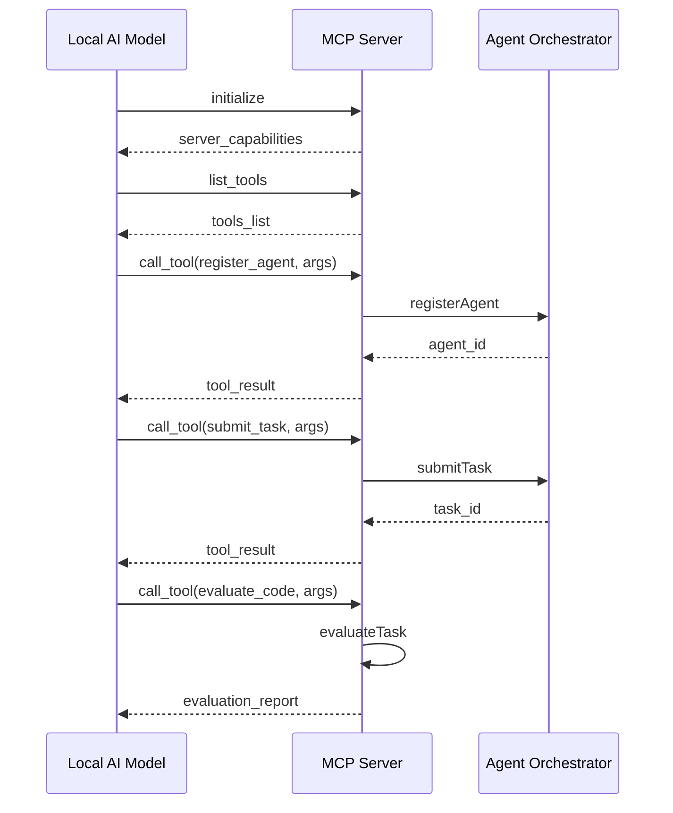

# MCP Integration - Technical Architecture

## Architecture Overview

The MCP integration for Agent Agency is built on a modular, protocol-compliant architecture that enables autonomous agent operation with built-in reasoning and validation. The system extends the existing Agent Agency platform with MCP server capabilities, evaluation orchestration, and comprehensive tool ecosystems.

## System Components

### 1. MCP Server Layer

#### AgentAgencyMCPServer

```typescript
/**
 * Main MCP server implementation for Agent Agency
 * @author @darianrosebrook
 */
export class AgentAgencyMCPServer {
  private readonly server: Server;
  private readonly logger: Logger;
  private readonly resourceManager: MCPResourceManager;
  private readonly toolManager: MCPToolManager;
  private readonly evaluationOrchestrator: EvaluationOrchestrator;
  private readonly orchestrator: AgentOrchestrator;

  constructor(config: MCPServerConfig) {
    this.server = new Server(
      {
        name: 'agent-agency-mcp',
        version: '1.0.0',
      },
      {
        capabilities: {
          resources: {},
          tools: {},
        },
      }
    );

    this.resourceManager = new MCPResourceManager(
      this.orchestrator,
      this.logger
    );
    this.toolManager = new MCPToolManager(this.orchestrator, this.logger);
    this.evaluationOrchestrator = new EvaluationOrchestrator(
      config.evaluationConfig ?? this.getDefaultEvaluationConfig(),
      this.logger
    );

    this.setupHandlers();
  }

  private setupHandlers(): void {
    // Resource handlers
    this.server.setRequestHandler(ListResourcesRequestSchema, async () => {
      return this.resourceManager.listResources();
    });

    this.server.setRequestHandler(
      ReadResourceRequestSchema,
      async (request) => {
        return this.resourceManager.readResource(request.params.uri);
      }
    );

    // Tool handlers
    this.server.setRequestHandler(ListToolsRequestSchema, async () => {
      return this.toolManager.listTools();
    });

    this.server.setRequestHandler(CallToolRequestSchema, async (request) => {
      return this.toolManager.executeTool(
        request.params.name,
        request.params.arguments
      );
    });
  }

  async start(): Promise<void> {
    const transport = new StdioServerTransport();
    await this.server.connect(transport);
    this.logger.info('MCP Server started successfully');
  }
}
```

#### MCPResourceManager

```typescript
/**
 * Manages MCP resource access and retrieval
 * @author @darianrosebrook
 */
export class MCPResourceManager {
  constructor(
    private orchestrator: AgentOrchestrator,
    private logger: Logger
  ) {}

  async listResources(): Promise<ListResourcesResult> {
    const resources: Resource[] = [
      // Agent resources
      ...this.getAgentResources(),
      // Task resources
      ...this.getTaskResources(),
      // System resources
      ...this.getSystemResources(),
      // Memory resources (if available)
      ...this.getMemoryResources(),
    ];

    return { resources };
  }

  async readResource(uri: string): Promise<ReadResourceResult> {
    const [scheme, type, ...pathParts] = uri.split('/');

    switch (scheme) {
      case 'agent:':
        return this.handleAgentResource(type, pathParts);
      case 'task:':
        return this.handleTaskResource(type, pathParts);
      case 'system:':
        return this.handleSystemResource(type, pathParts);
      case 'memory:':
        return this.handleMemoryResource(type, pathParts);
      default:
        throw new Error(`Unknown resource scheme: ${scheme}`);
    }
  }
}
```

#### MCPToolManager

```typescript
/**
 * Manages MCP tool registration and execution
 * @author @darianrosebrook
 */
export class MCPToolManager {
  constructor(
    private orchestrator: AgentOrchestrator,
    private logger: Logger
  ) {}

  async listTools(): Promise<ListToolsResult> {
    const tools: Tool[] = [
      // Agent management tools
      {
        name: 'register_agent',
        description: 'Register a new agent with the orchestrator',
        inputSchema: {
          type: 'object',
          properties: {
            name: { type: 'string' },
            type: {
              type: 'string',
              enum: ['orchestrator', 'worker', 'monitor', 'coordinator'],
            },
            capabilities: { type: 'array', items: { type: 'string' } },
            metadata: { type: 'object' },
          },
          required: ['name', 'type', 'capabilities'],
        },
      },
      // Task management tools
      {
        name: 'submit_task',
        description: 'Submit a new task for execution',
        inputSchema: {
          type: 'object',
          properties: {
            agentId: { type: 'string' },
            type: {
              type: 'string',
              enum: ['process', 'analyze', 'coordinate', 'monitor'],
            },
            payload: { type: 'object' },
          },
          required: ['agentId', 'type', 'payload'],
        },
      },
      // Evaluation tools
      {
        name: 'evaluate_code',
        description: 'Evaluate code quality and run tests',
        inputSchema: {
          type: 'object',
          properties: {
            taskId: { type: 'string' },
            projectDir: { type: 'string' },
            scripts: { type: 'object' },
          },
          required: ['taskId'],
        },
      },
    ];

    return { tools };
  }

  async executeTool(name: string, args: any): Promise<CallToolResult> {
    try {
      const result = await this.executeToolInternal(name, args);
      return {
        content: [{ type: 'text', text: JSON.stringify(result, null, 2) }],
      };
    } catch (error) {
      this.logger.error(`Tool execution failed: ${name}`, error);
      return {
        content: [{ type: 'text', text: `Error: ${error.message}` }],
        isError: true,
      };
    }
  }
}
```

### 2. Evaluation Orchestrator

#### EvaluationOrchestrator

```typescript
/**
 * Orchestrates autonomous evaluation loops with satisficing logic
 * @author @darianrosebrook
 */
export class EvaluationOrchestrator {
  constructor(private config: EvaluationConfig, private logger: Logger) {}

  async evaluateTask(
    taskId: string,
    taskType: TaskType,
    artifactPath: string,
    iteration: number
  ): Promise<EvaluationReport> {
    const evaluator = this.getEvaluatorForTask(taskType);
    const report = await evaluator.evaluate({
      taskId,
      artifactPath,
      iterations: iteration,
      acceptance: {
        minScore: this.config.minScore,
        mandatoryGates: this.config.mandatoryGates,
      },
    });

    return this.enhanceReportWithSatisficing(report, iteration);
  }

  private enhanceReportWithSatisficing(
    report: EvaluationReport,
    iteration: number
  ): EvaluationReport {
    const { maxIterations, minDeltaToContinue, noChangeBudget } =
      this.config.iterationPolicy;

    // Check iteration limits
    if (iteration >= maxIterations) {
      report.stopReason = 'max-iterations';
      report.status = 'fail';
    }

    // Check satisficing conditions
    if (
      report.score >= this.config.minScore &&
      report.thresholdsMissed.length === 0
    ) {
      report.stopReason = 'satisficed';
      report.status = 'pass';
    }

    return report;
  }

  private getEvaluatorForTask(taskType: TaskType): Evaluator {
    switch (taskType) {
      case 'code':
        return new CodeEvaluator();
      case 'text':
        return new TextEvaluator();
      case 'design':
        return new DesignEvaluator();
      default:
        throw new Error(`No evaluator for task type: ${taskType}`);
    }
  }
}
```

#### CodeEvaluator Implementation

```typescript
/**
 * Evaluates code quality with tests and linting
 * @author @darianrosebrook
 */
export class CodeEvaluator implements Evaluator {
  async evaluate(params: EvaluationParams): Promise<EvaluationReport> {
    const { taskId, artifactPath, iterations, acceptance } = params;

    const results: Record<string, { code: number; out: string }> = {};
    const criteria: EvalCriterion[] = [];

    // Run tests
    results.tests = await this.runScript('npm run test --silent');

    // Run linting
    results.lint = await this.runScript('npm run lint --silent');

    // Run type checking
    results.typecheck = await this.runScript('npm run typecheck --silent');

    // Create evaluation criteria
    criteria.push(
      this.createGateCriterion(
        'tests-pass',
        'Unit tests pass',
        0.4,
        results.tests
      )
    );
    criteria.push(
      this.createGateCriterion(
        'lint-clean',
        'Linting passes',
        0.25,
        results.lint
      )
    );
    criteria.push(
      this.createGateCriterion(
        'types-ok',
        'Type checking passes',
        0.25,
        results.typecheck
      )
    );

    const score = criteria.reduce((s, c) => s + c.score * c.weight, 0);

    // Determine thresholds
    const thresholdsMissed: string[] = [];
    const thresholdsMet: string[] = [];

    for (const gate of acceptance.mandatoryGates) {
      const crit = criteria.find((c) => c.id === gate);
      if (crit) {
        (crit.passed ? thresholdsMet : thresholdsMissed).push(gate);
      }
    }

    const passCore =
      score >= acceptance.minScore && thresholdsMissed.length === 0;

    return {
      taskId,
      artifactPaths: [artifactPath],
      status: passCore ? 'pass' : 'iterate',
      score: Number(score.toFixed(3)),
      thresholdsMet,
      thresholdsMissed,
      criteria,
      iterations,
      stopReason: passCore ? 'satisficed' : undefined,
      nextActions: passCore ? [] : ['Fix failing gates and re-run evaluation'],
      timestamp: new Date().toISOString(),
      logs: Object.values(results).map((r) => r.out),
    };
  }

  private async runScript(
    command: string
  ): Promise<{ code: number; out: string }> {
    return new Promise((resolve) => {
      const [cmd, ...args] = command.split(' ');
      const child = spawn(cmd, args, { cwd: process.cwd() });

      let stdout = '';
      let stderr = '';

      child.stdout?.on('data', (data) => {
        stdout += data.toString();
      });
      child.stderr?.on('data', (data) => {
        stderr += data.toString();
      });

      child.on('close', (code) => {
        resolve({
          code: code ?? 1,
          out: stdout + stderr,
        });
      });
    });
  }

  private createGateCriterion(
    id: string,
    description: string,
    weight: number,
    result?: { code: number; out: string }
  ): EvalCriterion {
    if (!result) {
      return {
        id,
        description: `${description} (skipped)`,
        weight,
        passed: true,
        score: 1,
      };
    }

    const passed = result.code === 0;
    return {
      id,
      description,
      weight,
      passed,
      score: passed ? 1 : 0,
      notes: passed ? undefined : this.truncateOutput(result.out),
    };
  }

  private truncateOutput(output: string, maxLength: number = 1200): string {
    return output.length > maxLength
      ? output.slice(0, maxLength) + ' …[truncated]'
      : output;
  }
}
```

#### TextEvaluator Implementation

```typescript
/**
 * Evaluates text transformation quality
 * @author @darianrosebrook
 */
export class TextEvaluator implements Evaluator {
  async evaluate(params: EvaluationParams): Promise<EvaluationReport> {
    const { taskId, artifactPath, iterations, acceptance, config } = params;
    const text = fs.readFileSync(artifactPath, 'utf8').trim();

    const criteria: EvalCriterion[] = [];

    // Length constraints
    const withinMax = config?.maxChars ? text.length <= config.maxChars : true;
    const withinMin = config?.minChars ? text.length >= config.minChars : true;
    criteria.push({
      id: 'length-band',
      description: 'Text length within target bounds',
      weight: 0.15,
      passed: withinMax && withinMin,
      score: withinMax && withinMin ? 1 : 0,
      notes: `len=${text.length}`,
    });

    // Banned phrases
    const bannedHits =
      config?.bannedPhrases?.filter((p) =>
        text.toLowerCase().includes(p.toLowerCase())
      ) ?? [];
    criteria.push({
      id: 'no-banned-phrases',
      description: 'Avoid banned phrases',
      weight: 0.15,
      passed: bannedHits.length === 0,
      score: bannedHits.length === 0 ? 1 : 0,
      notes: bannedHits.length ? `hits=${bannedHits.join(', ')}` : undefined,
    });

    // Required phrases
    const missingReq =
      config?.requiredPhrases?.filter(
        (p) => !text.toLowerCase().includes(p.toLowerCase())
      ) ?? [];
    criteria.push({
      id: 'required-phrases',
      description: 'Include required phrases',
      weight: 0.15,
      passed: missingReq.length === 0,
      score: missingReq.length === 0 ? 1 : 0,
      notes: missingReq.length ? `missing=${missingReq.join(', ')}` : undefined,
    });

    // Readability (optional)
    let readabilityPass = true;
    let grade = 0;
    if (config?.readingGradeMax) {
      grade = this.calculateFleschKincaid(text);
      readabilityPass = grade <= config.readingGradeMax;
    }
    criteria.push({
      id: 'readability',
      description: 'Reading grade at or below max',
      weight: 0.1,
      passed: readabilityPass,
      score: readabilityPass ? 1 : 0,
      notes: `grade≈${grade.toFixed(1)}`,
    });

    // Style heuristics
    const hasContractions = /n't|'re|'s|'d|'ll|'ve|'m\b/.test(text);
    const stylePass = config?.style === 'formal' ? !hasContractions : true;
    criteria.push({
      id: 'style-heuristic',
      description: `Style conforms (${config?.style || 'neutral'})`,
      weight: 0.1,
      passed: stylePass,
      score: stylePass ? 1 : 0,
      notes: `contractions=${hasContractions}`,
    });

    // Structure
    const paras = text.split(/\n{2,}/g).length;
    const structurePass = paras >= 1;
    criteria.push({
      id: 'structure',
      description: 'Basic structure present (≥1 paragraph)',
      weight: 0.1,
      passed: structurePass,
      score: structurePass ? 1 : 0,
      notes: `paragraphs=${paras}`,
    });

    const score = criteria.reduce((s, c) => s + c.score * c.weight, 0);

    const thresholdsMissed: string[] = [];
    const thresholdsMet: string[] = [];

    for (const gate of acceptance.mandatoryGates) {
      const crit = criteria.find((c) => c.id === gate);
      if (crit) {
        (crit.passed ? thresholdsMet : thresholdsMissed).push(gate);
      }
    }

    const passCore =
      score >= acceptance.minScore && thresholdsMissed.length === 0;

    return {
      taskId,
      artifactPaths: [artifactPath],
      status: passCore ? 'pass' : 'iterate',
      score: Number(score.toFixed(3)),
      thresholdsMet,
      thresholdsMissed,
      criteria,
      iterations,
      stopReason: passCore ? 'satisficed' : undefined,
      nextActions: passCore ? [] : ['Tighten style or fix gates, then re-run'],
      timestamp: new Date().toISOString(),
      logs: [],
    };
  }

  private calculateFleschKincaid(text: string): number {
    const sentences = Math.max(1, text.match(/[.!?]+/g)?.length ?? 1);
    const words = Math.max(1, text.trim().split(/\s+/g).length);
    const syllables = Math.max(
      1,
      text.match(/[aeiouy]+/gi)?.length ?? Math.ceil(words * 1.3)
    );

    // Flesch-Kincaid Grade Level
    return 0.39 * (words / sentences) + 11.8 * (syllables / words) - 15.59;
  }
}
```

### 3. Resource Implementations

#### Agent Resources

```typescript
export class AgentResourceHandler {
  async handleResource(
    type: string,
    pathParts: string[]
  ): Promise<ReadResourceResult> {
    switch (type) {
      case 'list':
        return this.listAgents();
      case 'capabilities':
        return this.getAgentCapabilities(pathParts[0]);
      case 'relationships':
        return this.getAgentRelationships(pathParts[0]);
      default:
        // Individual agent
        return this.getAgent(pathParts[0]);
    }
  }

  private async listAgents(): Promise<ReadResourceResult> {
    // Implementation for listing all agents
    const agents = await this.orchestrator.getAllAgents();
    return {
      contents: [
        {
          uri: 'agents://list',
          mimeType: 'application/json',
          text: JSON.stringify(agents, null, 2),
        },
      ],
    };
  }

  private async getAgent(agentId: string): Promise<ReadResourceResult> {
    const agent = await this.orchestrator.getAgent(agentId);
    if (!agent) {
      throw new Error(`Agent not found: ${agentId}`);
    }

    return {
      contents: [
        {
          uri: `agent://${agentId}`,
          mimeType: 'application/json',
          text: JSON.stringify(agent, null, 2),
        },
      ],
    };
  }
}
```

#### Task Resources

```typescript
export class TaskResourceHandler {
  async handleResource(
    type: string,
    pathParts: string[]
  ): Promise<ReadResourceResult> {
    switch (type) {
      case 'queue':
        return this.getTaskQueue();
      case 'history':
        return this.getTaskHistory(pathParts[0]);
      default:
        // Individual task
        return this.getTask(pathParts[0]);
    }
  }

  private async getTaskQueue(): Promise<ReadResourceResult> {
    const tasks = await this.orchestrator.getPendingTasks();
    return {
      contents: [
        {
          uri: 'tasks://queue',
          mimeType: 'application/json',
          text: JSON.stringify(tasks, null, 2),
        },
      ],
    };
  }

  private async getTaskHistory(agentId: string): Promise<ReadResourceResult> {
    const history = await this.orchestrator.getAgentTaskHistory(agentId);
    return {
      contents: [
        {
          uri: `tasks://history/${agentId}`,
          mimeType: 'application/json',
          text: JSON.stringify(history, null, 2),
        },
      ],
    };
  }
}
```

#### System Resources

```typescript
export class SystemResourceHandler {
  async handleResource(
    type: string,
    pathParts: string[]
  ): Promise<ReadResourceResult> {
    switch (type) {
      case 'metrics':
        return this.getSystemMetrics();
      case 'config':
        return this.getSystemConfig();
      case 'health':
        return this.getSystemHealth();
      case 'logs':
        return this.getRecentLogs();
      default:
        throw new Error(`Unknown system resource: ${type}`);
    }
  }

  private async getSystemMetrics(): Promise<ReadResourceResult> {
    const metrics = this.orchestrator.getSystemMetrics();
    return {
      contents: [
        {
          uri: 'system://metrics',
          mimeType: 'application/json',
          text: JSON.stringify(metrics, null, 2),
        },
      ],
    };
  }

  private async getSystemHealth(): Promise<ReadResourceResult> {
    const health = await this.orchestrator.performHealthCheck();
    return {
      contents: [
        {
          uri: 'system://health',
          mimeType: 'application/json',
          text: JSON.stringify(health, null, 2),
        },
      ],
    };
  }
}
```

### 4. Tool Implementations

#### Agent Management Tools

```typescript
export class AgentManagementTools {
  async registerAgent(args: {
    name: string;
    type: AgentType;
    capabilities: string[];
    metadata?: Record<string, unknown>;
  }): Promise<AgentRegistrationResult> {
    const agentId = await this.orchestrator.registerAgent({
      name: args.name,
      type: args.type,
      status: 'idle',
      capabilities: args.capabilities,
      metadata: args.metadata || {},
    });

    const agent = await this.orchestrator.getAgent(agentId);
    return { agentId, agent };
  }

  async updateAgent(args: {
    agentId: string;
    updates: Partial<Agent>;
  }): Promise<AgentUpdateResult> {
    const agent = await this.orchestrator.getAgent(args.agentId);
    if (!agent) {
      throw new Error(`Agent not found: ${args.agentId}`);
    }

    const updatedAgent = { ...agent, ...args.updates, updatedAt: new Date() };
    await this.orchestrator.updateAgent(updatedAgent);

    return { agent: updatedAgent };
  }

  async getAgent(args: { agentId: string }): Promise<Agent> {
    const agent = await this.orchestrator.getAgent(args.agentId);
    if (!agent) {
      throw new Error(`Agent not found: ${args.agentId}`);
    }
    return agent;
  }
}
```

#### Task Management Tools

```typescript
export class TaskManagementTools {
  async submitTask(args: {
    agentId: string;
    type: TaskType;
    payload: Record<string, unknown>;
  }): Promise<TaskSubmissionResult> {
    // Validate agent exists
    const agent = await this.orchestrator.getAgent(args.agentId);
    if (!agent) {
      throw new Error(`Agent not found: ${args.agentId}`);
    }

    // Validate agent capabilities
    if (!agent.capabilities.includes(args.type)) {
      throw new Error(
        `Agent ${args.agentId} does not have capability: ${args.type}`
      );
    }

    const taskId = await this.orchestrator.submitTask({
      agentId: args.agentId,
      type: args.type,
      payload: args.payload,
    });

    const task = await this.orchestrator.getTask(taskId);
    return { taskId, task };
  }

  async getTask(args: { taskId: string }): Promise<Task> {
    const task = await this.orchestrator.getTask(args.taskId);
    if (!task) {
      throw new Error(`Task not found: ${args.taskId}`);
    }
    return task;
  }

  async cancelTask(args: { taskId: string }): Promise<TaskCancellationResult> {
    const task = await this.orchestrator.getTask(args.taskId);
    if (!task) {
      throw new Error(`Task not found: ${args.taskId}`);
    }

    if (task.status === 'completed' || task.status === 'failed') {
      throw new Error(`Cannot cancel task in status: ${task.status}`);
    }

    await this.orchestrator.cancelTask(args.taskId);
    const updatedTask = await this.orchestrator.getTask(args.taskId);

    return { task: updatedTask };
  }
}
```

#### Evaluation Tools

```typescript
export class EvaluationTools {
  constructor(
    private evaluationOrchestrator: EvaluationOrchestrator,
    private logger: Logger
  ) {}

  async evaluateCode(args: {
    taskId: string;
    projectDir?: string;
    scripts?: {
      test?: string;
      lint?: string;
      typecheck?: string;
      a11y?: string;
    };
    iteration?: number;
  }): Promise<EvaluationReport> {
    const iteration = args.iteration || 1;
    const projectDir = args.projectDir || process.cwd();

    return this.evaluationOrchestrator.evaluateTask(
      args.taskId,
      'code',
      projectDir,
      iteration
    );
  }

  async evaluateText(args: {
    taskId: string;
    artifactPath: string;
    config?: TextEvaluationConfig;
    iteration?: number;
  }): Promise<EvaluationReport> {
    const iteration = args.iteration || 1;

    return this.evaluationOrchestrator.evaluateTask(
      args.taskId,
      'text',
      args.artifactPath,
      iteration
    );
  }

  async runEvaluationLoop(args: {
    taskId: string;
    taskType: TaskType;
    artifactPath: string;
    maxIterations?: number;
    config?: TaskEvaluationConfig;
  }): Promise<EvaluationLoopResult> {
    const maxIterations = args.maxIterations || 3;
    const reports: EvaluationReport[] = [];

    for (let i = 1; i <= maxIterations; i++) {
      const report = await this.evaluationOrchestrator.evaluateTask(
        args.taskId,
        args.taskType,
        args.artifactPath,
        i
      );

      reports.push(report);

      // Check if we should stop
      if (report.status === 'pass' || report.stopReason) {
        break;
      }
    }

    const finalReport = reports[reports.length - 1];
    const successful = finalReport.status === 'pass';

    return {
      taskId: args.taskId,
      reports,
      finalReport,
      successful,
      iterationsCompleted: reports.length,
    };
  }
}
```

### 5. Configuration and Types

#### MCP Configuration

```typescript
export interface MCPServerConfig {
  orchestrator: AgentOrchestrator;
  evaluationConfig?: {
    minScore: number;
    mandatoryGates: string[];
    iterationPolicy: {
      maxIterations: number;
      minDeltaToContinue: number;
      noChangeBudget: number;
    };
  };
  cache?: {
    enabled: boolean;
    ttl: number;
    maxSize: number;
  };
  logging?: {
    level: 'debug' | 'info' | 'warn' | 'error';
    format: 'json' | 'text';
    enableRequestLogging: boolean;
  };
  security?: {
    enableToolPermissions: boolean;
    allowedTools: string[];
    enableResourceFiltering: boolean;
    allowedResourceSchemes: string[];
  };
}
```

#### Evaluation Types

```typescript
export interface EvaluationConfig {
  minScore: number;
  mandatoryGates: string[];
  iterationPolicy: {
    maxIterations: number;
    minDeltaToContinue: number;
    noChangeBudget: number;
  };
}

export interface EvaluationReport {
  taskId: string;
  artifactPaths: string[];
  status: 'pass' | 'iterate' | 'fail';
  score: number;
  thresholdsMet: string[];
  thresholdsMissed: string[];
  criteria: EvalCriterion[];
  iterations: number;
  stopReason?:
    | 'satisficed'
    | 'max-iterations'
    | 'quality-ceiling'
    | 'failed-gates';
  nextActions?: string[];
  logs?: string[];
  timestamp: string;
}

export interface EvalCriterion {
  id: string;
  description: string;
  weight: number;
  passed: boolean;
  score: number;
  notes?: string;
}

export interface TaskEvaluationConfig {
  text?: TextEvaluationConfig;
  code?: CodeEvaluationConfig;
  design?: DesignEvaluationConfig;
}

export interface TextEvaluationConfig {
  style?: 'concise' | 'formal' | 'neutral';
  maxChars?: number;
  minChars?: number;
  bannedPhrases?: string[];
  requiredPhrases?: string[];
  readingGradeMax?: number;
}
```

## Communication Protocols

### MCP Message Flow



### Error Handling

```typescript
export class MCPError extends Error {
  constructor(
    message: string,
    public code: string,
    public details?: Record<string, unknown>
  ) {
    super(message);
    this.name = 'MCPError';
  }
}

export class MCPErrorHandler {
  static handleToolError(error: Error, toolName: string): CallToolResult {
    if (error instanceof MCPError) {
      return {
        content: [
          {
            type: 'text',
            text: JSON.stringify(
              {
                error: error.message,
                code: error.code,
                details: error.details,
              },
              null,
              2
            ),
          },
        ],
        isError: true,
      };
    }

    return {
      content: [
        {
          type: 'text',
          text: `Tool execution failed: ${toolName}\n${error.message}`,
        },
      ],
      isError: true,
    };
  }
}
```

## Performance Optimization

### Caching Strategy

```typescript
export class MCPResourceCache {
  constructor(private redis: Redis, private ttl: number = 300) {}

  async get<T>(key: string): Promise<T | null> {
    const cached = await this.redis.get(`mcp:resource:${key}`);
    return cached ? JSON.parse(cached) : null;
  }

  async set<T>(key: string, value: T): Promise<void> {
    await this.redis.setex(
      `mcp:resource:${key}`,
      this.ttl,
      JSON.stringify(value)
    );
  }

  async invalidate(pattern: string): Promise<void> {
    const keys = await this.redis.keys(`mcp:resource:${pattern}`);
    if (keys.length > 0) {
      await this.redis.del(keys);
    }
  }
}
```

### Connection Pooling

```typescript
export class DatabaseConnectionPool {
  private pool: Pool;

  constructor(config: DatabaseConfig) {
    this.pool = new Pool({
      host: config.host,
      port: config.port,
      database: config.database,
      user: config.user,
      password: config.password,
      max: config.maxConnections || 20,
      idleTimeoutMillis: config.idleTimeout || 30000,
      connectionTimeoutMillis: config.connectionTimeout || 2000,
    });

    this.pool.on('error', (err) => {
      console.error('Unexpected database error:', err);
    });
  }

  async query<T>(text: string, params?: unknown[]): Promise<QueryResult<T>> {
    const client = await this.pool.connect();
    try {
      return await client.query(text, params);
    } finally {
      client.release();
    }
  }
}
```

## Security Implementation

### Tool Permissions

```typescript
export class MCPToolPermissions {
  constructor(private config: SecurityConfig) {}

  canExecuteTool(toolName: string, context?: RequestContext): boolean {
    if (!this.config.enableToolPermissions) return true;

    return this.config.allowedTools.includes(toolName);
  }

  filterToolList(tools: Tool[], context?: RequestContext): Tool[] {
    if (!this.config.enableToolPermissions) return tools;

    return tools.filter((tool) => this.canExecuteTool(tool.name, context));
  }
}
```

### Resource Filtering

```typescript
export class MCPResourceFilter {
  constructor(private config: SecurityConfig) {}

  canAccessResource(uri: string, context?: RequestContext): boolean {
    if (!this.config.enableResourceFiltering) return true;

    const scheme = uri.split('://')[0];
    return this.config.allowedResourceSchemes.includes(scheme);
  }

  filterResourceList(
    resources: Resource[],
    context?: RequestContext
  ): Resource[] {
    if (!this.config.enableResourceFiltering) return resources;

    return resources.filter((resource) =>
      this.canAccessResource(resource.uri, context)
    );
  }
}
```

## Monitoring and Observability

### Metrics Collection

```typescript
export class MCPMetricsCollector {
  private metrics: Map<string, number> = new Map();

  incrementCounter(name: string, value: number = 1): void {
    const current = this.metrics.get(name) || 0;
    this.metrics.set(name, current + value);
  }

  recordLatency(name: string, duration: number): void {
    // Record latency metrics
    this.metrics.set(`${name}_latency`, duration);
  }

  getMetrics(): Record<string, number> {
    return Object.fromEntries(this.metrics);
  }

  // MCP-specific metrics
  recordToolExecution(
    toolName: string,
    success: boolean,
    duration: number
  ): void {
    this.incrementCounter(`tool_${toolName}_executions`);
    if (success) {
      this.incrementCounter(`tool_${toolName}_successes`);
    } else {
      this.incrementCounter(`tool_${toolName}_failures`);
    }
    this.recordLatency(`tool_${toolName}`, duration);
  }

  recordResourceAccess(
    resourceUri: string,
    success: boolean,
    duration: number
  ): void {
    this.incrementCounter('resource_access_total');
    if (success) {
      this.incrementCounter('resource_access_success');
    }
    this.recordLatency('resource_access', duration);
  }
}
```

### Logging Integration

```typescript
export class MCPLogger {
  constructor(private config: LoggingConfig) {}

  logRequest(request: MCPRequest, response?: MCPResponse, error?: Error): void {
    if (!this.config.enableRequestLogging) return;

    const logEntry = {
      timestamp: new Date().toISOString(),
      request: {
        method: request.method,
        id: request.id,
        params: this.sanitizeParams(request.params),
      },
      response: response
        ? {
            id: response.id,
            result: this.sanitizeResult(response.result),
          }
        : undefined,
      error: error
        ? {
            message: error.message,
            code: error.code,
          }
        : undefined,
      duration: response?.duration || 0,
    };

    if (this.config.format === 'json') {
      console.log(JSON.stringify(logEntry));
    } else {
      console.log(
        `[${logEntry.timestamp}] ${request.method} ${request.id} - ${
          response ? 'OK' : 'ERROR'
        }`
      );
    }
  }

  private sanitizeParams(params: any): any {
    // Remove sensitive information from request parameters
    if (params && typeof params === 'object') {
      const sanitized = { ...params };
      // Remove or mask sensitive fields
      return sanitized;
    }
    return params;
  }

  private sanitizeResult(result: any): any {
    // Remove sensitive information from response results
    return result;
  }
}
```

This technical architecture provides a comprehensive, scalable, and secure foundation for MCP integration with the Agent Agency platform, enabling autonomous agent operation with sophisticated reasoning and validation capabilities.
