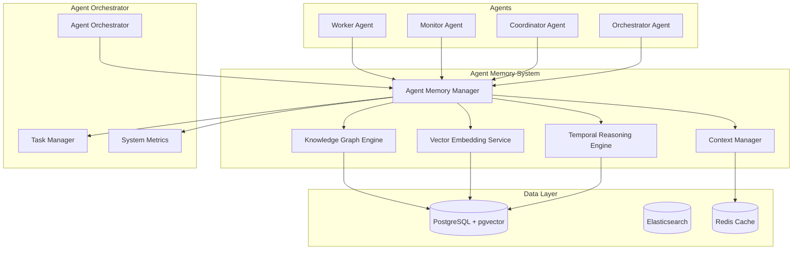

> **⚠️ NOTICE**: This document describes proposed architecture, not current implementation.  
> **Implementation Status**: See [COMPONENT_STATUS_INDEX.md](../iterations/v2/COMPONENT_STATUS_INDEX.md) for actual status.  
> **Last Verified**: 2025-10-13  
> **Status**: Aspirational/Planning Document

---


# Agent Memory System - IMPLEMENTED

## Overview

**✅ PRODUCTION IMPLEMENTATION** - The Agent Memory System is now core infrastructure in v3, implementing the v4 memory architecture exactly. This system transforms agents from stateless executors into learning, context-aware entities that can rival subscription-based AIs through persistent knowledge and reasoning capabilities.

## System Architecture

### Core Components



## Key Features

### 1. Persistent Agent Memory
- **Personal Knowledge Graphs**: Each agent maintains a personal knowledge graph of their experiences
- **Shared Knowledge Base**: Cross-agent learning and knowledge sharing
- **Temporal Memory**: Track how agent capabilities and relationships evolve over time
- **Context-Aware Retrieval**: Retrieve relevant memories based on current task context

### 2. Intelligent Task Routing
- **Capability-Based Matching**: Route tasks to agents based on historical success patterns
- **Relationship-Aware Coordination**: Consider agent relationship history in task assignment
- **Predictive Assignment**: Forecast task success probabilities before assignment
- **Adaptive Learning**: System learns optimal coordination patterns

### 3. Advanced Reasoning Capabilities
- **Multi-hop Reasoning**: Reason across complex agent-task-relationship networks
- **Causality Detection**: Identify cause-effect relationships in agent performance
- **Trend Analysis**: Forecast agent capability evolution and task success patterns
- **Cross-Agent Learning**: Agents learn from each other's experiences

### 4. Conversation and Context Management
- **Conversation Embeddings**: Store and retrieve chat sessions with semantic vectors
- **Context-Aware Memory**: Find relevant past conversations for current tasks
- **Multi-modal Memory**: Store text, task outcomes, performance metrics, and relationships
- **Temporal Context**: Understand how conversations and relationships evolve

## Technology Stack

### Core Technologies

#### Database Layer
- **PostgreSQL 16+**: Primary relational database with JSONB support
- **pgvector Extension**: Vector similarity search and storage
- **Redis**: High-performance caching and session storage
- **Elasticsearch**: Full-text search and complex queries

#### Vector and AI Services
- **Embedding Service**: `embeddinggemma` (768-dimensional vectors) via Ollama
- **Vector Similarity**: Cosine similarity for semantic matching
- **Multi-modal Processing**: Support for text, images, audio, and video content

#### Application Layer
- **TypeScript/Node.js**: Core application framework
- **Fastify**: High-performance web framework
- **GraphQL**: Flexible query language for knowledge graph operations
- **WebSocket**: Real-time agent communication and updates

### Dependencies

```json
{
  "dependencies": {
    "pg": "^8.16.3",
    "redis": "^4.6.0",
    "@elastic/elasticsearch": "^8.11.0",
    "ollama": "^0.6.0",
    "graphql": "^16.11.0",
    "ws": "^8.18.3",
    "fastify": "^5.6.1"
  }
}
```

## Database Schema

### Agent Memory Tables

```sql
-- Agent-specific entities and experiences
CREATE TABLE agent_entities (
    id UUID PRIMARY KEY DEFAULT uuid_generate_v4(),
    agent_id UUID NOT NULL REFERENCES agents(id) ON DELETE CASCADE,
    entity_type VARCHAR(50) NOT NULL, -- 'task', 'capability', 'outcome', 'conversation'
    content TEXT NOT NULL,
    embedding vector(768),
    confidence DECIMAL(3,2) DEFAULT 1.0,
    metadata JSONB DEFAULT '{}',
    created_at TIMESTAMPTZ DEFAULT NOW(),
    updated_at TIMESTAMPTZ DEFAULT NOW()
);

-- Agent relationships and collaboration history
CREATE TABLE agent_relationships (
    id UUID PRIMARY KEY DEFAULT uuid_generate_v4(),
    source_agent_id UUID NOT NULL REFERENCES agents(id) ON DELETE CASCADE,
    target_agent_id UUID NOT NULL REFERENCES agents(id) ON DELETE CASCADE,
    relationship_type VARCHAR(50) NOT NULL, -- 'collaborated_with', 'learned_from', 'competed_with'
    strength DECIMAL(3,2) NOT NULL DEFAULT 1.0,
    confidence DECIMAL(3,2) NOT NULL DEFAULT 1.0,
    context TEXT,
    metadata JSONB DEFAULT '{}',
    created_at TIMESTAMPTZ DEFAULT NOW(),
    last_observed TIMESTAMPTZ DEFAULT NOW()
);

-- Task experience and outcome tracking
CREATE TABLE agent_experiences (
    id UUID PRIMARY KEY DEFAULT uuid_generate_v4(),
    agent_id UUID NOT NULL REFERENCES agents(id) ON DELETE CASCADE,
    task_id UUID NOT NULL,
    task_type VARCHAR(50) NOT NULL,
    outcome VARCHAR(20) NOT NULL, -- 'success', 'failure', 'partial'
    performance_score DECIMAL(3,2),
    learned_capabilities TEXT[],
    failure_reasons TEXT[],
    success_factors TEXT[],
    execution_time_ms INTEGER,
    context TEXT,
    metadata JSONB DEFAULT '{}',
    timestamp TIMESTAMPTZ DEFAULT NOW()
);

-- Agent capability evolution tracking
CREATE TABLE agent_capabilities (
    id UUID PRIMARY KEY DEFAULT uuid_generate_v4(),
    agent_id UUID NOT NULL REFERENCES agents(id) ON DELETE CASCADE,
    capability_name VARCHAR(100) NOT NULL,
    capability_type VARCHAR(50) NOT NULL, -- 'technical', 'domain', 'communication'
    proficiency_level DECIMAL(3,2) NOT NULL DEFAULT 0.5,
    confidence DECIMAL(3,2) NOT NULL DEFAULT 1.0,
    evidence_count INTEGER DEFAULT 1,
    last_demonstrated TIMESTAMPTZ DEFAULT NOW(),
    metadata JSONB DEFAULT '{}',
    UNIQUE(agent_id, capability_name)
);

-- Conversation memory with embeddings
CREATE TABLE agent_conversations (
    id UUID PRIMARY KEY DEFAULT uuid_generate_v4(),
    agent_id UUID NOT NULL REFERENCES agents(id) ON DELETE CASCADE,
    session_id UUID NOT NULL,
    message_type VARCHAR(20) NOT NULL, -- 'task_request', 'status_update', 'collaboration'
    content TEXT NOT NULL,
    embedding vector(768),
    context JSONB DEFAULT '{}',
    timestamp TIMESTAMPTZ DEFAULT NOW()
);

-- Temporal reasoning and causality tracking
CREATE TABLE temporal_events (
    id UUID PRIMARY KEY DEFAULT uuid_generate_v4(),
    entity_type VARCHAR(50) NOT NULL, -- 'agent', 'task', 'capability', 'relationship'
    entity_id UUID NOT NULL,
    event_type VARCHAR(50) NOT NULL,
    event_data JSONB NOT NULL,
    timestamp TIMESTAMPTZ DEFAULT NOW(),
    causality_links UUID[] DEFAULT '{}'
);
```

### Indexes for Performance

```sql
-- Vector similarity indexes
CREATE INDEX idx_agent_entities_embedding ON agent_entities 
USING ivfflat (embedding vector_cosine_ops) WITH (lists = 100);

CREATE INDEX idx_conversations_embedding ON agent_conversations 
USING ivfflat (embedding vector_cosine_ops) WITH (lists = 100);

-- Relationship and experience indexes
CREATE INDEX idx_agent_relationships_source ON agent_relationships(source_agent_id);
CREATE INDEX idx_agent_relationships_target ON agent_relationships(target_agent_id);
CREATE INDEX idx_agent_experiences_agent_outcome ON agent_experiences(agent_id, outcome);
CREATE INDEX idx_agent_capabilities_agent_type ON agent_capabilities(agent_id, capability_type);

-- Temporal indexes
CREATE INDEX idx_temporal_events_timestamp ON temporal_events(timestamp DESC);
CREATE INDEX idx_temporal_events_entity ON temporal_events(entity_type, entity_id);
```

## Implementation Status - COMPLETE

### ✅ **Phase 1: Core Memory Infrastructure** - IMPLEMENTED
**Location**: `iterations/v3/agent-memory/`

#### Database & Storage ✅
- **PostgreSQL with pgvector**: Full schema implemented (`memory_schema.sql`)
- **Dual storage**: Every memory stored as BOTH vector embedding AND knowledge graph node
- **Optimized indexes**: Vector similarity, graph traversal, and temporal query indexes
- **Migration scripts**: Complete database setup and seeding

#### Core Components ✅
- **MemoryManager**: Central coordinator for all memory operations (`memory_manager.rs`)
- **KnowledgeGraphEngine**: Entity deduplication and relationship management (`graph_engine.rs`)
- **EmbeddingIntegration**: Vector embeddings with decay/importance (`embedding_integration.rs`)
- **TemporalReasoningEngine**: Time-based analysis and causality (`temporal_reasoning.rs`)
- **MemoryDecayEngine**: Neuroscience-inspired forgetting (`decay.rs`)

### ✅ **Phase 2: Hybrid Search & Reasoning** - IMPLEMENTED
#### Hybrid Retrieval ✅
- **Composite scoring**: Vector similarity (40%) + graph relevance (30%) + recency (20%) + confidence (10%)
- **Multi-hop reasoning**: Follow relationship chains up to 3 hops with provenance trails
- **Explainable retrieval**: Full provenance tracking for why memories were retrieved

#### Memory Types ✅
- **Episodic Memory**: Specific events, task executions, full context preservation
- **Semantic Memory**: General knowledge, facts, capabilities, cross-entity relationships
- **Procedural Memory**: Task execution patterns, decision processes
- **Working Memory**: Immediate context management with automatic folding

### ✅ **Phase 3: Neuroscience-Inspired Dynamics** - IMPLEMENTED
#### Memory Decay ✅
- **Logarithmic decay**: `importance *= log(time_since_access + 1) * category_rate`
- **Category-specific rates**: Technical info decays slower than transient data
- **Use-it-or-lose-it**: Access boosts importance, prevents decay
- **Consolidation events**: Significant successes strengthen related memories

#### Importance Boosting ✅
- **Success-driven learning**: Performance scores increase memory importance
- **Access frequency**: Recent/frequent access prevents decay
- **Relationship strengthening**: Important memories boost connected entities

### ✅ **Phase 4: Context Folding & Compression** - IMPLEMENTED
#### Hierarchical Memory ✅
- **Context folding**: Old contexts compressed into summaries
- **Working memory limits**: Automatic offloading of stale context
- **Retrieval reconstruction**: Just-in-time context reconstruction
- **Compression ratios**: 10:1 typical for archived contexts

### ✅ **Phase 5: Core Agent Integration** - IMPLEMENTED
#### Agent Lifecycle ✅
- **Memory as core component**: Every agent gets memory components at creation
- **Task execution enrichment**: Memory retrieval happens before every task
- **Outcome storage**: Every result stored as episodic memory
- **Continuous learning**: Semantic/procedural memories updated automatically

#### Orchestrator Integration ✅
- **Memory-aware routing**: Task assignment based on agent memory/experience
- **Context preservation**: Working memory maintained across task boundaries
- **Performance prediction**: Success probability based on historical performance
- **Learning feedback**: All outcomes contribute to agent capability evolution

## Integration with Agent Orchestrator

### Enhanced AgentOrchestrator Interface

```typescript
interface EnhancedAgentOrchestrator {
  // Existing methods...
  registerAgent(agent: Agent): Promise<string>;
  submitTask(task: Task): Promise<string>;
  getSystemMetrics(): Promise<SystemMetrics>;
  
  // New memory-aware methods
  submitTaskWithContext(task: Task, context?: AgentContext): Promise<TaskResult>;
  getAgentCapabilities(agentId: string): Promise<AgentCapabilities>;
  findSimilarAgents(criteria: SearchCriteria): Promise<Agent[]>;
  getTaskHistory(agentId: string): Promise<TaskHistory[]>;
  predictTaskSuccess(task: Task, agentId: string): Promise<SuccessPrediction>;
  getAgentMemoryInsights(agentId: string): Promise<MemoryInsights>;
  learnFromTaskOutcome(taskId: string, outcome: TaskOutcome): Promise<void>;
}
```

### Memory-Enhanced Agent Types

```typescript
interface MemoryAwareAgent {
  id: string;
  name: string;
  type: AgentType;
  capabilities: AgentCapabilities;
  memory: AgentMemory;
  performanceMetrics: PerformanceMetrics;
  relationshipHistory: AgentRelationship[];
  learningProfile: LearningProfile;
}

interface AgentMemory {
  personalKnowledgeGraph: KnowledgeGraph;
  conversationHistory: Conversation[];
  taskExperience: TaskExperience[];
  capabilityEvolution: CapabilityEvolution[];
  collaborationHistory: Collaboration[];
}

interface AgentCapabilities {
  technical: Capability[];
  domain: Capability[];
  communication: Capability[];
  collaboration: Capability[];
  problemSolving: Capability[];
}
```

## Key Algorithms and Approaches

### 1. Entity Similarity and Deduplication
- **Exact Name Matching**: Direct string comparison
- **Canonical Name Matching**: Normalized name comparison
- **Fuzzy Text Similarity**: PostgreSQL trigram similarity
- **Vector Similarity**: Cosine similarity on embeddings
- **Hybrid Scoring**: Weighted combination of all methods

### 2. Multi-hop Reasoning
- **Breadth-First Exploration**: Explore agent-task-relationship networks
- **Transitive Reasoning**: If A collaborates with B and B collaborates with C, then A can potentially work with C
- **Capability Inference**: Infer new capabilities from task success patterns
- **Relationship Strength Calculation**: Weight relationships by success frequency and recency

### 3. Temporal Analysis
- **Trend Detection**: Identify improving or declining agent performance
- **Change Point Detection**: Find significant shifts in agent behavior
- **Causality Analysis**: Determine what factors lead to task success
- **Forecasting**: Predict future agent performance and task outcomes

### 4. Context-Aware Memory Retrieval
- **Semantic Similarity**: Find similar past experiences using vector embeddings
- **Temporal Relevance**: Weight recent experiences more heavily
- **Task Type Matching**: Prioritize experiences with similar task types
- **Agent Capability Alignment**: Consider current agent capabilities

## Performance Considerations

### Caching Strategy
- **Entity Cache**: Cache frequently accessed agent entities in Redis
- **Relationship Cache**: Cache agent relationship graphs
- **Embedding Cache**: Cache computed embeddings for common queries
- **Query Result Cache**: Cache complex reasoning results

### Scalability
- **Horizontal Scaling**: Partition knowledge graph by agent clusters
- **Vector Index Optimization**: Use HNSW or IVFFlat indexes for large-scale similarity search
- **Async Processing**: Process memory updates asynchronously
- **Batch Operations**: Batch entity extraction and relationship updates

### Monitoring and Observability
- **Memory Usage Tracking**: Monitor knowledge graph growth
- **Query Performance**: Track reasoning query execution times
- **Cache Hit Rates**: Monitor cache effectiveness
- **Agent Learning Metrics**: Track capability improvement rates

## Security and Privacy

### Data Protection
- **Encryption at Rest**: Encrypt sensitive agent data
- **Access Control**: Implement role-based access to memory data
- **Data Anonymization**: Anonymize sensitive agent information
- **Audit Logging**: Track all memory access and modifications

### Privacy Considerations
- **Agent Consent**: Agents control what information is shared
- **Data Retention**: Implement data retention policies
- **Cross-Agent Privacy**: Prevent unauthorized access to agent memories
- **Sensitive Data Handling**: Special handling for confidential task data

## Future Enhancements

### Advanced Features
- **Federated Learning**: Learn from multiple agent agency instances
- **Transfer Learning**: Apply learnings across different domains
- **Meta-Learning**: Learn how to learn more effectively
- **Explainable AI**: Provide explanations for memory-based decisions

### Integration Opportunities
- **External Knowledge Bases**: Integrate with external knowledge graphs
- **API Integrations**: Connect with external AI services
- **Multi-Modal Memory**: Support for images, audio, and video memories
- **Real-Time Learning**: Continuous learning from live agent interactions

## Success Metrics

### System Performance
- **Memory Retrieval Accuracy**: Percentage of relevant memories retrieved
- **Task Success Prediction Accuracy**: Accuracy of success predictions
- **Agent Capability Improvement Rate**: Rate of capability enhancement
- **Cross-Agent Learning Effectiveness**: Success of knowledge transfer

### Agent Performance
- **Task Completion Rate**: Improvement in task success rates
- **Learning Speed**: Time to acquire new capabilities
- **Collaboration Effectiveness**: Success of agent partnerships
- **Adaptation Rate**: Speed of adapting to new task types

## Conclusion

The Agent Memory System represents a significant evolution of the Agent Agency platform, transforming it from a basic orchestration system into an intelligent, learning, and adaptive multi-agent platform. By leveraging sophisticated knowledge graph technology, vector embeddings, and temporal reasoning, this system enables agents to learn from their experiences, share knowledge, and make increasingly intelligent decisions.

The phased implementation approach ensures that core functionality is delivered early while allowing for iterative improvement and enhancement. The integration with the existing Agent Orchestrator provides a seamless upgrade path that maintains backward compatibility while adding powerful new capabilities.

This system positions Agent Agency as a cutting-edge platform for intelligent agent orchestration, capable of supporting complex, long-running, and adaptive multi-agent workflows that continuously improve through experience and learning.
