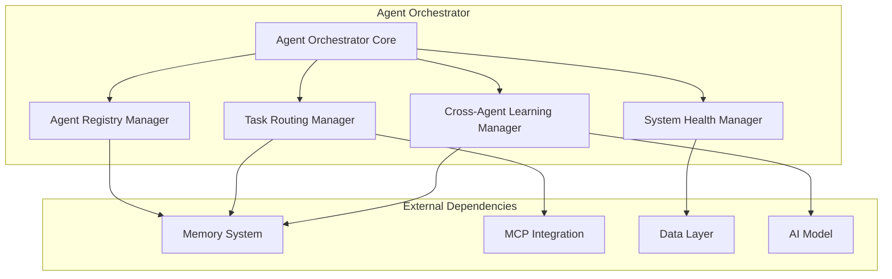

> **⚠️ NOTICE**: This document describes proposed architecture, not current implementation.  
> **Implementation Status**: See [COMPONENT_STATUS_INDEX.md](../iterations/v2/COMPONENT_STATUS_INDEX.md) for actual status.  
> **Last Verified**: 2025-10-13  
> **Status**: Aspirational/Planning Document

---


# Agent Orchestrator

The Agent Orchestrator serves as the central hub of the Agent Agency platform, providing intelligent coordination, memory-aware task routing, and comprehensive system management for autonomous software agents.

## Overview

The Agent Orchestrator is the core component that manages the lifecycle of agents, routes tasks intelligently based on agent capabilities and historical performance, and maintains system-wide coordination. It integrates deeply with the Agent Memory System to provide context-aware decision making and learning capabilities.

## Key Features

### **Memory-Aware Agent Management**

- **Capability Profiling**: Tracks and learns from agent performance across different task types
- **Historical Analysis**: Leverages past experiences to optimize future task assignments
- **Adaptive Routing**: Dynamically adjusts task routing based on agent learning and capability evolution
- **Performance Prediction**: Estimates success probability for task-agent combinations

### **Intelligent Task Coordination**

- **Context-Aware Routing**: Uses memory and context to route tasks to optimal agents
- **Load Balancing**: Distributes workload while considering agent capabilities and current load
- **Priority Management**: Handles task priorities with intelligent queuing strategies
- **Dependency Resolution**: Manages complex task dependencies and execution order

### **System Health Monitoring**

- **Real-Time Metrics**: Tracks system performance, agent health, and resource utilization
- **Predictive Monitoring**: Identifies potential issues before they impact system performance
- **Automated Recovery**: Implements self-healing mechanisms for common failure scenarios
- **Performance Analytics**: Provides insights into system efficiency and optimization opportunities

### **Cross-Agent Learning**

- **Experience Sharing**: Enables agents to learn from each other's successes and failures
- **Capability Evolution**: Tracks how agent capabilities improve over time
- **Best Practice Propagation**: Distributes successful patterns across the agent ecosystem
- **Collective Intelligence**: Leverages the combined knowledge of all agents

## Architecture



## Core Components

### **Agent Registry Manager**

- **Registration**: Handles agent onboarding with capability assessment
- **Capability Tracking**: Maintains detailed profiles of agent skills and performance
- **Status Monitoring**: Tracks agent availability, health, and current workload
- **Lifecycle Management**: Manages agent startup, shutdown, and recovery

### **Task Routing Manager**

- **Intelligent Routing**: Uses memory and ML to route tasks optimally
- **Load Balancing**: Distributes tasks while maintaining system efficiency
- **Priority Handling**: Manages task priorities and execution order
- **Dependency Management**: Resolves complex task dependencies

### **System Health Manager**

- **Real-Time Monitoring**: Tracks system metrics and agent health
- **Performance Analytics**: Analyzes system performance and identifies bottlenecks
- **Automated Recovery**: Implements self-healing for common failure scenarios
- **Alert Management**: Provides intelligent alerting and notification systems

### **Cross-Agent Learning Manager**

- **Experience Aggregation**: Collects and processes learning experiences from all agents
- **Knowledge Distribution**: Shares insights and best practices across agents
- **Capability Evolution**: Tracks and facilitates agent capability improvements
- **Collective Intelligence**: Builds system-wide intelligence from individual agent learning

## API Interface

### **Agent Management**

```typescript
// Register a new agent with memory-aware capabilities
async registerAgent(agent: AgentRegistration): Promise<AgentProfile>

// Update agent capabilities based on performance
async updateAgentCapabilities(agentId: string, capabilities: CapabilityUpdate): Promise<void>

// Get agent performance history and predictions
async getAgentInsights(agentId: string): Promise<AgentInsights>

// Find similar agents for collaboration
async findSimilarAgents(agentId: string, criteria: SimilarityCriteria): Promise<AgentMatch[]>
```

### **Task Management**

```typescript
// Submit task with context-aware routing
async submitTask(task: TaskSubmission, context?: TaskContext): Promise<TaskAssignment>

// Get intelligent task routing suggestions
async getRoutingSuggestions(task: Task): Promise<RoutingSuggestion[]>

// Update task status with learning integration
async updateTaskStatus(taskId: string, status: TaskStatus, outcome: TaskOutcome): Promise<void>
```

### **System Monitoring**

```typescript
// Get comprehensive system health metrics
async getSystemHealth(): Promise<SystemHealthMetrics>

// Get performance analytics and trends
async getPerformanceAnalytics(timeRange: TimeRange): Promise<PerformanceAnalytics>

// Get cross-agent learning insights
async getLearningInsights(): Promise<LearningInsights>
```

## Configuration

### **Core Settings**

```typescript
interface OrchestratorConfig {
  // Memory integration
  memorySystem: {
    enabled: boolean;
    learningRate: number;
    historyRetentionDays: number;
  };

  // Task routing
  routing: {
    algorithm: "memory-aware" | "capability-based" | "load-balanced";
    maxRetries: number;
    timeoutMs: number;
  };

  // System monitoring
  monitoring: {
    healthCheckInterval: number;
    metricsRetentionDays: number;
    alertThresholds: AlertThresholds;
  };

  // Cross-agent learning
  learning: {
    enabled: boolean;
    experienceSharingEnabled: boolean;
    capabilityEvolutionEnabled: boolean;
  };
}
```

## Integration Points

### **Memory System Integration**

- **Experience Storage**: Stores agent performance data and learning experiences
- **Capability Profiles**: Maintains detailed agent capability information
- **Historical Analysis**: Leverages past data for intelligent routing decisions
- **Learning Feedback**: Provides feedback loop for continuous improvement

### **MCP Integration**

- **Tool Discovery**: Discovers and manages available tools and resources
- **Resource Management**: Coordinates access to shared resources
- **Evaluation Integration**: Provides autonomous evaluation capabilities
- **Protocol Compliance**: Ensures adherence to MCP standards

### **Data Layer Integration**

- **Persistent Storage**: Stores orchestrator state and configuration
- **Performance Metrics**: Tracks and stores system performance data
- **Learning Data**: Manages cross-agent learning and experience data
- **Audit Logging**: Maintains comprehensive audit trails

## Performance Characteristics

### **Scalability**

- **Agent Capacity**: Supports 1000+ concurrent agents
- **Task Throughput**: Handles 10,000+ tasks per minute
- **Memory Efficiency**: Optimized for minimal memory footprint
- **Horizontal Scaling**: Designed for distributed deployment

### **Reliability**

- **High Availability**: 99.9% uptime target
- **Fault Tolerance**: Graceful handling of agent failures
- **Self-Healing**: Automatic recovery from common failure scenarios
- **Data Consistency**: ACID compliance for critical operations

### **Performance Metrics**

- **Task Routing Latency**: < 50ms average response time
- **Memory Query Performance**: < 100ms for complex capability matching
- **System Health Checks**: < 10ms per agent health check
- **Learning Processing**: Real-time capability evolution updates

## Security Considerations

### **Access Control**

- **Agent Authentication**: Secure agent registration and authentication
- **Task Authorization**: Fine-grained task execution permissions
- **Resource Protection**: Secure access to shared resources and tools
- **Audit Logging**: Comprehensive logging for security monitoring

### **Data Protection**

- **Encryption**: End-to-end encryption for sensitive data
- **Privacy**: Agent capability data protection and anonymization
- **Compliance**: GDPR and SOC 2 compliance considerations
- **Backup Security**: Secure backup and recovery procedures

## Monitoring and Observability

### **Metrics**

- **System Performance**: Task throughput, latency, error rates
- **Agent Health**: Availability, performance, capability evolution
- **Learning Metrics**: Experience sharing, capability improvement rates
- **Resource Utilization**: CPU, memory, network, storage usage

### **Logging**

- **Structured Logging**: JSON-formatted logs with correlation IDs
- **Audit Trails**: Complete audit trails for all operations
- **Error Tracking**: Detailed error logging with context
- **Performance Logging**: Detailed performance metrics and timing

### **Alerting**

- **System Health**: Automated alerts for system health issues
- **Performance Degradation**: Alerts for performance threshold breaches
- **Agent Failures**: Alerts for agent failures and recovery needs
- **Learning Anomalies**: Alerts for unusual learning patterns

## Development and Testing

### **Development Guidelines**

- **Type Safety**: Comprehensive TypeScript implementation
- **Error Handling**: Robust error handling with graceful degradation
- **Performance**: Optimized for high-throughput scenarios
- **Maintainability**: Clean, documented, and testable code

### **Testing Strategy**

- **Unit Tests**: Comprehensive unit test coverage (>90%)
- **Integration Tests**: End-to-end integration testing
- **Performance Tests**: Load testing and performance benchmarking
- **Chaos Testing**: Failure scenario testing and resilience validation

## Future Enhancements

### **Planned Features**

- **Federated Learning**: Cross-instance learning and knowledge sharing
- **Advanced ML**: Machine learning models for predictive routing
- **Multi-Modal Support**: Support for different types of agents and tasks
- **Real-Time Adaptation**: Dynamic system reconfiguration based on load

### **Research Areas**

- **Autonomous Coordination**: Self-organizing agent coordination patterns
- **Emergent Behavior**: Understanding and leveraging emergent system behaviors
- **Adaptive Algorithms**: Self-improving routing and coordination algorithms
- **Quantum Computing**: Exploration of quantum computing for optimization

---

**Author**: @darianrosebrook  
**Last Updated**: 2024  
**Version**: 1.0.0
