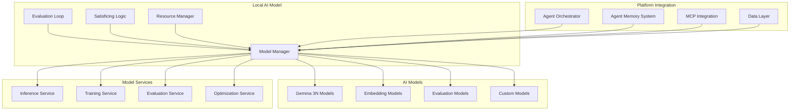

# Local AI Model

The Local AI Model component provides local AI model management, evaluation capabilities, and satisficing logic for the Agent Agency platform, enabling efficient and autonomous AI operations without external dependencies.

## Overview

The Local AI Model component serves as the AI foundation for the Agent Agency platform, providing local model hosting, evaluation frameworks, and decision-making logic. It combines the Gemma 3N model with sophisticated evaluation loops and satisficing algorithms to enable intelligent, self-improving agent behavior.

## Key Features

### **Local Model Management**

- **Gemma 3N Integration**: Full integration with Google's Gemma 3N model family
- **Local Hosting**: Complete local model execution without external API dependencies
- **Model Optimization**: Optimized model loading, caching, and inference
- **Resource Management**: Efficient GPU/CPU resource allocation and management

### **Evaluation Loop**

- **Continuous Evaluation**: Real-time evaluation of agent performance and decisions
- **Feedback Integration**: Incorporation of evaluation results into learning cycles
- **Performance Metrics**: Comprehensive performance tracking and analysis
- **Adaptive Thresholds**: Dynamic adjustment of performance thresholds

### **Satisficing Logic**

- **Bounded Rationality**: Implementation of satisficing decision-making algorithms
- **Resource-Aware Decisions**: Decision-making that considers computational resources
- **Acceptable Solutions**: Finding "good enough" solutions within constraints
- **Efficiency Optimization**: Balancing quality and computational cost

### **Model Capabilities**

- **Multi-Modal Processing**: Support for text, structured data, and future multi-modal inputs
- **Contextual Reasoning**: Advanced contextual understanding and reasoning
- **Learning Adaptation**: Continuous learning and model adaptation
- **Ethical Alignment**: Built-in ethical considerations and safety measures

## Architecture



## Core Components

### **Model Manager**

The central coordinator for AI model operations, providing unified access to different models and capabilities.

**Key Responsibilities:**

- **Model Lifecycle**: Manages model loading, unloading, and lifecycle
- **Resource Allocation**: Allocates computational resources to models
- **Performance Monitoring**: Monitors model performance and resource usage
- **Model Switching**: Handles dynamic model switching and optimization

**API Interface:**

```typescript
interface ModelManager {
  // Model lifecycle
  loadModel(modelConfig: ModelConfig): Promise<ModelInstance>;
  unloadModel(modelId: string): Promise<void>;
  getModelStatus(modelId: string): Promise<ModelStatus>;

  // Inference operations
  runInference(
    modelId: string,
    input: InferenceInput
  ): Promise<InferenceResult>;
  runBatchInference(
    modelId: string,
    inputs: InferenceInput[]
  ): Promise<InferenceResult[]>;

  // Model management
  optimizeModel(
    modelId: string,
    optimizationConfig: OptimizationConfig
  ): Promise<OptimizationResult>;
  updateModel(modelId: string, updateConfig: ModelUpdate): Promise<void>;

  // Resource management
  allocateResources(
    modelId: string,
    resources: ResourceRequirements
  ): Promise<ResourceAllocation>;
  monitorResources(): Promise<ResourceUsage[]>;
}
```

### **Evaluation Loop**

Provides continuous evaluation and feedback mechanisms for agent and model performance.

**Key Responsibilities:**

- **Performance Evaluation**: Evaluates agent decisions and model outputs
- **Feedback Collection**: Collects feedback from various sources
- **Learning Integration**: Integrates evaluation results into learning processes
- **Threshold Management**: Manages and adjusts performance thresholds

**Core Features:**

- **Multi-Criteria Evaluation**: Evaluates performance across multiple dimensions
- **Real-Time Feedback**: Provides immediate feedback for decision-making
- **Historical Analysis**: Analyzes performance trends over time
- **Adaptive Learning**: Adjusts evaluation criteria based on context

**API Interface:**

```typescript
interface EvaluationLoop {
  // Evaluation execution
  evaluatePerformance(
    entityId: string,
    evaluationCriteria: EvaluationCriteria
  ): Promise<EvaluationResult>;
  evaluateDecision(
    decision: Decision,
    context: EvaluationContext
  ): Promise<DecisionEvaluation>;

  // Feedback integration
  collectFeedback(feedback: FeedbackData): Promise<void>;
  processFeedbackBatch(
    feedbacks: FeedbackData[]
  ): Promise<FeedbackProcessingResult>;

  // Learning integration
  generateLearningSignal(evaluation: EvaluationResult): Promise<LearningSignal>;
  updateEvaluationCriteria(newCriteria: EvaluationCriteria): Promise<void>;

  // Threshold management
  adjustThresholds(
    performanceData: PerformanceData
  ): Promise<ThresholdAdjustment>;
  getCurrentThresholds(): Promise<EvaluationThresholds>;
}
```

### **Satisficing Logic**

Implements satisficing decision-making algorithms for resource-efficient problem solving.

**Key Responsibilities:**

- **Solution Evaluation**: Evaluates solutions against satisficing criteria
- **Resource Optimization**: Optimizes decision-making for computational efficiency
- **Acceptable Bounds**: Defines acceptable solution bounds and constraints
- **Trade-off Analysis**: Analyzes trade-offs between quality and resources

**Core Features:**

- **Aspiration Levels**: Dynamic adjustment of aspiration levels
- **Search Strategies**: Efficient search strategies for satisficing solutions
- **Constraint Handling**: Handling of hard and soft constraints
- **Multi-Objective Optimization**: Balancing multiple competing objectives

**API Interface:**

```typescript
interface SatisficingLogic {
  // Satisficing operations
  findSatisficingSolution(
    problem: ProblemDefinition,
    criteria: SatisficingCriteria
  ): Promise<SatisficingSolution>;
  evaluateSolution(
    solution: Solution,
    criteria: SatisficingCriteria
  ): Promise<SolutionEvaluation>;

  // Aspiration management
  setAspirationLevels(levels: AspirationLevels): Promise<void>;
  adjustAspirationLevels(
    performance: PerformanceData
  ): Promise<AspirationAdjustment>;

  // Constraint handling
  defineConstraints(constraints: ConstraintDefinition[]): Promise<void>;
  checkConstraintSatisfaction(
    solution: Solution,
    constraints: ConstraintDefinition[]
  ): Promise<ConstraintSatisfaction>;

  // Multi-objective balancing
  balanceObjectives(
    objectives: ObjectiveDefinition[],
    weights: number[]
  ): Promise<BalancedSolution>;
  analyzeTradeoffs(
    objectives: ObjectiveDefinition[]
  ): Promise<TradeoffAnalysis>;
}
```

### **Resource Manager**

Manages computational resources for AI model operations.

**Key Responsibilities:**

- **Resource Allocation**: Allocates CPU, GPU, and memory resources
- **Load Balancing**: Balances load across available computational resources
- **Resource Monitoring**: Monitors resource usage and availability
- **Optimization**: Optimizes resource utilization for performance

**Core Features:**

- **Hardware Detection**: Automatic detection of available hardware resources
- **Dynamic Allocation**: Dynamic resource allocation based on workload
- **Resource Pools**: Management of resource pools and quotas
- **Performance Optimization**: Optimization for specific hardware configurations

## Model Capabilities

### **Gemma 3N Models**

The Gemma 3N model family provides the core AI capabilities for the platform.

**Key Features:**

- **Lightweight Architecture**: Optimized for local execution and efficiency
- **Multi-Task Learning**: Support for multiple AI tasks and modalities
- **Contextual Understanding**: Advanced contextual comprehension
- **Ethical Alignment**: Built-in safety and ethical considerations

**Supported Tasks:**

- **Text Generation**: High-quality text generation and completion
- **Question Answering**: Accurate and contextual question answering
- **Classification**: Text and data classification tasks
- **Summarization**: Intelligent text summarization
- **Code Generation**: Programming language code generation

### **Embedding Models**

Specialized models for generating vector embeddings.

**Key Features:**

- **Semantic Embeddings**: High-quality semantic vector representations
- **Context Preservation**: Preservation of contextual information in embeddings
- **Similarity Search**: Optimized for similarity and semantic search
- **Multi-Language Support**: Support for multiple languages and domains

### **Evaluation Models**

Models specialized for evaluation and assessment tasks.

**Key Features:**

- **Performance Assessment**: Accurate performance evaluation and scoring
- **Quality Metrics**: Comprehensive quality assessment metrics
- **Bias Detection**: Detection of bias and fairness issues
- **Robustness Testing**: Testing model robustness and reliability

## Configuration

### **AI Model Configuration**

```typescript
interface AIModelConfig {
  // Model configuration
  models: {
    gemma3n: {
      modelPath: string;
      modelSize: "2b" | "7b" | "14b";
      quantization: "4bit" | "8bit" | "16bit";
      contextWindow: number;
    };
    embedding: {
      modelName: string;
      dimension: number;
      poolingStrategy: "mean" | "cls" | "max";
    };
    evaluation: {
      modelName: string;
      evaluationTypes: EvaluationType[];
    };
  };

  // Resource configuration
  resources: {
    gpu: {
      enabled: boolean;
      deviceId: number;
      memoryLimit: string;
    };
    cpu: {
      threads: number;
      memoryLimit: string;
    };
    optimization: {
      batchSize: number;
      parallelRequests: number;
    };
  };

  // Evaluation configuration
  evaluation: {
    loop: {
      enabled: boolean;
      interval: number;
      criteria: EvaluationCriteria;
    };
    satisficing: {
      enabled: boolean;
      aspirationLevels: AspirationLevels;
      constraints: ConstraintDefinition[];
    };
  };

  // Performance configuration
  performance: {
    caching: {
      enabled: boolean;
      maxCacheSize: string;
      ttl: number;
    };
    monitoring: {
      enabled: boolean;
      metricsInterval: number;
    };
  };
}
```

## Performance Characteristics

### **Model Performance**

- **Inference Latency**: < 100ms for Gemma 3N 2B model on modern hardware
- **Throughput**: 100+ inferences per second for batch operations
- **Memory Usage**: Optimized memory usage with quantization support
- **Resource Efficiency**: Efficient resource utilization across different hardware

### **Evaluation Performance**

- **Real-Time Evaluation**: < 50ms evaluation time for most operations
- **Continuous Processing**: Continuous evaluation without performance impact
- **Scalable Feedback**: Handles high-volume feedback processing
- **Adaptive Learning**: Real-time adaptation to performance changes

### **Satisficing Performance**

- **Solution Finding**: Fast satisficing solution identification
- **Resource Optimization**: Minimal computational overhead
- **Constraint Handling**: Efficient constraint satisfaction checking
- **Multi-Objective Balancing**: Optimal trade-off analysis

## Data Models

### **Model Operations**

```typescript
interface InferenceInput {
  prompt?: string;
  context?: Record<string, any>;
  parameters?: InferenceParameters;
  metadata?: Record<string, any>;
}

interface InferenceResult {
  output: string;
  confidence?: number;
  metadata: {
    model: string;
    latency: number;
    tokens: number;
  };
}

interface EvaluationResult {
  entityId: string;
  criteria: EvaluationCriteria;
  scores: Record<string, number>;
  feedback: string[];
  recommendations: string[];
  timestamp: Date;
}

interface SatisficingSolution {
  solution: any;
  satisfactionScore: number;
  resourceUsage: ResourceUsage;
  constraintsSatisfied: boolean;
  metadata: Record<string, any>;
}
```

### **Configuration Models**

```typescript
interface ModelConfig {
  name: string;
  type: ModelType;
  path: string;
  parameters: Record<string, any>;
  optimization: ModelOptimization;
}

interface EvaluationCriteria {
  metrics: MetricDefinition[];
  thresholds: Record<string, number>;
  weights: Record<string, number>;
  context?: Record<string, any>;
}

interface SatisficingCriteria {
  aspirationLevels: Record<string, number>;
  constraints: ConstraintDefinition[];
  objectives: ObjectiveDefinition[];
  tolerance: number;
}
```

## Security and Safety

### **Model Safety**

- **Input Validation**: Comprehensive input validation and sanitization
- **Output Filtering**: Content filtering and safety checks on outputs
- **Bias Mitigation**: Active bias detection and mitigation strategies
- **Ethical Guidelines**: Adherence to ethical AI principles

### **Resource Security**

- **Access Control**: Secure access to computational resources
- **Isolation**: Model execution isolation and sandboxing
- **Monitoring**: Continuous monitoring of resource usage and anomalies
- **Audit Logging**: Comprehensive audit trails for all operations

## Monitoring and Observability

### **Metrics**

- **Model Metrics**: Inference latency, throughput, error rates
- **Evaluation Metrics**: Evaluation accuracy, feedback processing rates
- **Resource Metrics**: CPU/GPU usage, memory consumption, efficiency
- **Performance Metrics**: Overall system performance and optimization

### **Logging**

- **Inference Logging**: Detailed logging of model inferences and results
- **Evaluation Logging**: Comprehensive evaluation and feedback logging
- **Error Logging**: Detailed error logging with context and debugging information
- **Performance Logging**: Performance metrics and optimization logging

### **Alerting**

- **Model Alerts**: Alerts for model performance degradation or failures
- **Resource Alerts**: Alerts for resource exhaustion or allocation issues
- **Evaluation Alerts**: Alerts for evaluation anomalies or threshold breaches
- **Security Alerts**: Alerts for security violations or suspicious activities

## Development and Testing

### **Development Guidelines**

- **Model Versioning**: Proper versioning and management of model artifacts
- **Performance Testing**: Comprehensive performance testing and benchmarking
- **Safety Testing**: Rigorous safety and bias testing protocols
- **Documentation**: Detailed documentation of model capabilities and limitations

### **Testing Strategy**

- **Unit Tests**: Model operation and component unit tests
- **Integration Tests**: Full AI model integration testing
- **Performance Tests**: Load testing and performance benchmarking
- **Safety Tests**: Comprehensive safety and bias testing

## Future Enhancements

### **Planned Features**

- **Multi-Modal Models**: Support for vision, audio, and multi-modal inputs
- **Federated Learning**: Federated learning across distributed instances
- **Model Customization**: Custom model training and fine-tuning capabilities
- **Advanced Reasoning**: Enhanced reasoning and problem-solving capabilities

### **Research Areas**

- **Quantum AI**: Exploration of quantum computing for AI acceleration
- **Neuromorphic Computing**: Brain-inspired computing architectures
- **Explainable AI**: Advanced explainability and interpretability features
- **Autonomous Learning**: Self-improving and self-evolving AI systems

---

**Author**: @darianrosebrook  
**Last Updated**: 2024  
**Version**: 1.0.0
