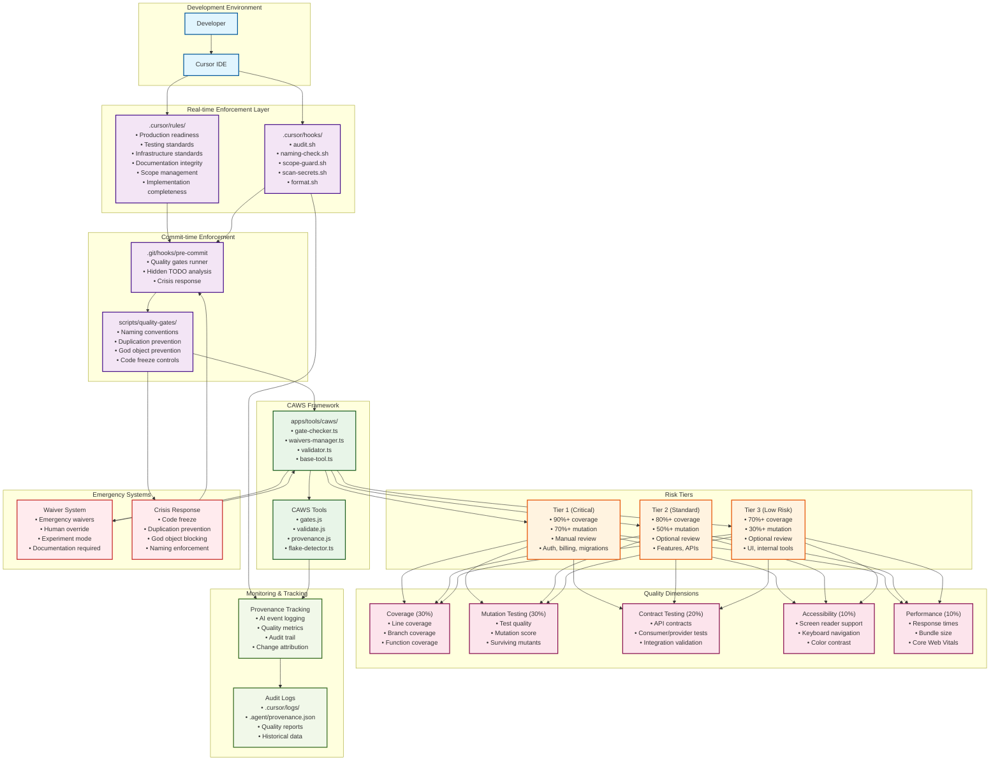

# Quality Gates System Architecture Diagram

## Key Integration Points

### 1. Real-time Development Flow
- **Developer** writes code in **Cursor IDE**
- **Cursor Rules** provide immediate guidance and warnings
- **Cursor Hooks** enforce naming conventions, scope, and security

### 2. Commit-time Validation
- **Pre-commit Hook** runs comprehensive quality gates
- **Quality Gates Collection** enforces crisis response measures
- **CAWS Framework** provides tier-based assessment

### 3. Risk-based Quality Requirements
- **Tier 1**: Critical systems with highest requirements
- **Tier 2**: Standard features with moderate requirements
- **Tier 3**: Low-risk components with minimal requirements

### 4. Emergency Procedures
- **Waiver System** allows emergency bypasses with documentation
- **Crisis Response** prevents further codebase degradation
- **Human Override** enables manual approval for exceptional cases

### 5. Comprehensive Monitoring
- **Provenance Tracking** logs all AI interactions and quality metrics
- **Audit Logs** provide complete change history and attribution
- **Quality Reports** track trends and identify issues

## Enforcement Hierarchy

1. **Real-time** (Cursor Rules + Hooks) - Immediate feedback
2. **Commit-time** (Pre-commit + Quality Gates) - Blocking enforcement
3. **Assessment** (CAWS Framework) - Comprehensive evaluation
4. **Emergency** (Waivers + Crisis Response) - Controlled bypasses
5. **Monitoring** (Provenance + Audit) - Historical tracking

This multi-layered architecture ensures quality is enforced at every stage of development while providing emergency procedures for critical situations.
