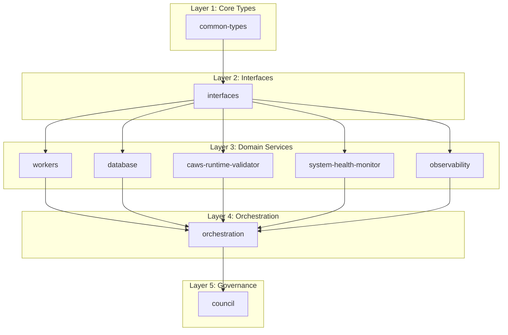

# Dependency Graph Analysis

## Current Dependency Issues

### Circular Dependencies (Potential)
- **`workers` ↔ `orchestration`**: Workers depends on orchestration types, orchestration depends on workers execution
- **`council` ↔ `orchestration`**: Council coordinates with orchestration, orchestration uses council for decisions
- **`apple-silicon` ↔ `observability`**: Apple Silicon reports metrics to observability, observability configures Apple Silicon

### Tight Coupling Issues
- **`council`** → 8+ crates (high coupling)
- **`orchestration`** → 6+ crates (high coupling)  
- **`apple-silicon`** → 5+ crates (complex dependency graph)

## Proposed Dependency Layers

### Layer 1: Core Types (No Dependencies)
```
common-types/
├── TaskDescriptor
├── ExecutionResult  
├── WorkingSpec
├── AgencyError
└── Configuration types
```

### Layer 2: Interfaces (Depends on Core Types)
```
interfaces/
├── TaskExecutor trait
├── Storage trait
├── Validator trait
├── HealthCheck trait
└── MetricsBackend trait
```

### Layer 3: Domain Services (Depends on Interfaces)
```
domain-services/
├── workers/ (implements TaskExecutor)
├── database/ (implements Storage)
├── caws-runtime-validator/ (implements Validator)
├── system-health-monitor/ (implements HealthCheck)
└── observability/ (implements MetricsBackend)
```

### Layer 4: Orchestration (Depends on Domain Services)
```
orchestration/
├── Uses workers for execution
├── Uses database for persistence
├── Uses caws-runtime-validator for validation
└── Uses observability for monitoring
```

### Layer 5: Governance (Depends on Orchestration)
```
council/
├── Coordinates orchestration
├── Makes decisions based on orchestration results
└── Provides governance for the entire system
```

## Dependency Cleanup Strategy

### Phase 1: Extract Common Types
1. **Create `common-types` crate**
2. **Move shared types** from domain crates
3. **Update imports** across codebase
4. **Remove circular dependencies**

### Phase 2: Define Interfaces
1. **Create `interfaces` crate**
2. **Extract trait definitions** from implementations
3. **Update implementations** to use traits
4. **Remove direct dependencies** between domain crates

### Phase 3: Reorganize Domain Services
1. **Group related functionality** into focused crates
2. **Remove cross-dependencies** between domain crates
3. **Use dependency injection** for external dependencies
4. **Implement proper abstractions**

### Phase 4: Clean Orchestration Layer
1. **Make orchestration** depend only on interfaces
2. **Use dependency injection** for concrete implementations
3. **Remove direct dependencies** on domain crates
4. **Implement proper error handling**

## Specific Refactoring Actions

### 1. Break workers ↔ orchestration cycle
```rust
// BEFORE: Direct dependency
// workers/src/autonomous_executor.rs
use crate::orchestration::planning::types::{WorkingSpec, ExecutionArtifacts};

// AFTER: Interface-based dependency
// workers/src/autonomous_executor.rs
use common_types::{WorkingSpec, ExecutionArtifacts};
use interfaces::TaskExecutor;
```

### 2. Extract council dependencies
```rust
// BEFORE: Council depends on multiple crates
// council/src/coordinator.rs
use agent_agency_workers::TaskExecutor;
use agent_agency_orchestration::Orchestrator;

// AFTER: Council depends only on interfaces
// council/src/coordinator.rs
use interfaces::{TaskExecutor, Orchestrator};
```

### 3. Simplify apple-silicon dependencies
```rust
// BEFORE: Complex dependency graph
// apple-silicon/src/lib.rs
use agent_agency_observability::MetricsBackend;
use agent_agency_database::DatabaseClient;

// AFTER: Interface-based dependencies
// apple-silicon/src/lib.rs
use interfaces::{MetricsBackend, Storage};
```

## Dependency Graph Visualization



## Success Criteria

### Dependency Metrics
- **Zero circular dependencies**
- **Maximum 3 dependency layers**
- **No crate depends on >5 other crates**
- **Clear separation of concerns**

### Architecture Quality
- **Interface-based dependencies**
- **Dependency injection** for external services
- **Proper abstraction layers**
- **Testable components**

### Maintainability
- **Easy to add new implementations**
- **Simple to mock dependencies**
- **Clear module boundaries**
- **Reduced coupling**

