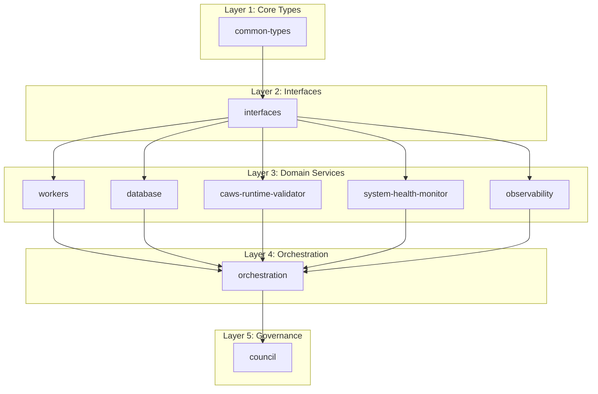

# Architectural Improvements Report

## Current Architecture Issues

### 1. Monolithic God Objects
- **8 files >3,000 LOC** (severe god objects)
- **18 files >2,000 LOC** (critical god objects)
- **68 files >1,000 LOC** (god object threshold)
- **Total impact**: High maintenance burden, difficult testing, unclear responsibilities

### 2. Duplication and Overlap
- **AutonomousExecutor**: 2 implementations with overlapping responsibilities
- **CAWS Validation**: 4+ different implementations across crates
- **Error Types**: Inconsistent naming and multiple error hierarchies
- **Configuration**: Scattered config patterns across crates

### 3. Tight Coupling
- **`council`** → 8+ crates (high coupling)
- **`orchestration`** → 6+ crates (high coupling)
- **`apple-silicon`** → 5+ crates (complex dependency graph)
- **Circular dependencies** between major components

### 4. Missing Abstractions
- **No common storage interface** (multiple storage implementations)
- **No common executor interface** (multiple execution patterns)
- **No common validator interface** (multiple validation approaches)
- **No common error hierarchy** (scattered error types)

## Proposed Architectural Improvements

### 1. Layered Architecture

#### Layer 1: Core Types (No Dependencies)
```rust
// common-types crate
pub mod types {
    pub struct TaskDescriptor { /* ... */ }
    pub struct ExecutionResult { /* ... */ }
    pub struct WorkingSpec { /* ... */ }
    pub struct AgencyError { /* ... */ }
}

pub mod config {
    pub struct AgencyConfig { /* ... */ }
    pub struct DatabaseConfig { /* ... */ }
    pub struct WorkersConfig { /* ... */ }
}
```

#### Layer 2: Interfaces (Depends on Core Types)
```rust
// interfaces crate
pub trait TaskExecutor: Send + Sync {
    async fn execute(&self, task: Task) -> Result<ExecutionResult>;
    async fn cancel(&self, task_id: Uuid) -> Result<()>;
    fn status(&self, task_id: Uuid) -> ExecutionStatus;
}

pub trait Storage: Send + Sync {
    async fn save(&self, key: &str, value: &[u8]) -> Result<()>;
    async fn load(&self, key: &str) -> Result<Vec<u8>>;
    async fn delete(&self, key: &str) -> Result<()>;
}

pub trait Validator: Send + Sync {
    async fn validate(&self, spec: &WorkingSpec) -> Result<ValidationResult>;
    fn validation_rules(&self) -> Vec<Rule>;
}

pub trait HealthCheck: Send + Sync {
    async fn check(&self) -> HealthCheckResult;
    fn name(&self) -> &str;
    fn criticality(&self) -> Criticality;
}
```

#### Layer 3: Domain Services (Depends on Interfaces)
```rust
// workers crate (implements TaskExecutor)
pub struct WorkersExecutor {
    manager: WorkerPoolManager,
    router: TaskRouter,
    config: WorkersConfig,
}

impl TaskExecutor for WorkersExecutor {
    async fn execute(&self, task: Task) -> Result<ExecutionResult> {
        // Implementation
    }
}

// database crate (implements Storage)
pub struct DatabaseStorage {
    client: DatabaseClient,
    config: DatabaseConfig,
}

impl Storage for DatabaseStorage {
    async fn save(&self, key: &str, value: &[u8]) -> Result<()> {
        // Implementation
    }
}
```

#### Layer 4: Orchestration (Depends on Domain Services)
```rust
// orchestration crate
pub struct Orchestrator {
    executor: Arc<dyn TaskExecutor>,
    storage: Arc<dyn Storage>,
    validator: Arc<dyn Validator>,
    health_checker: Arc<dyn HealthCheck>,
}

impl Orchestrator {
    pub fn new(
        executor: Arc<dyn TaskExecutor>,
        storage: Arc<dyn Storage>,
        validator: Arc<dyn Validator>,
        health_checker: Arc<dyn HealthCheck>,
    ) -> Self {
        Self { executor, storage, validator, health_checker }
    }
}
```

#### Layer 5: Governance (Depends on Orchestration)
```rust
// council crate
pub struct Council {
    orchestrator: Arc<Orchestrator>,
    judges: Vec<Box<dyn Judge>>,
    consensus: ConsensusEngine,
}

impl Council {
    pub fn new(orchestrator: Arc<Orchestrator>) -> Self {
        // Implementation
    }
}
```

### 2. Dependency Injection

#### Configuration-Based Injection
```rust
// config/agency.yaml
database:
  type: postgres
  host: localhost
  port: 5432
  database: agency

workers:
  type: workers
  max_concurrent: 10
  timeout_seconds: 300

validation:
  type: caws-runtime-validator
  strict_mode: true
  budget_checks: true

// config/mod.rs
pub fn load_config() -> Result<AgencyConfig> {
    let mut config = Config::new();
    config.merge(File::with_name("config/agency"))?;
    config.merge(Environment::with_prefix("AGENCY"))?;
    config.try_into()
}

pub fn create_orchestrator(config: &AgencyConfig) -> Result<Orchestrator> {
    let executor = create_executor(&config.workers)?;
    let storage = create_storage(&config.database)?;
    let validator = create_validator(&config.validation)?;
    let health_checker = create_health_checker(&config.health)?;
    
    Ok(Orchestrator::new(executor, storage, validator, health_checker))
}
```

#### Factory Pattern
```rust
// factories/mod.rs
pub struct ComponentFactory {
    config: AgencyConfig,
}

impl ComponentFactory {
    pub fn create_executor(&self) -> Result<Arc<dyn TaskExecutor>> {
        match self.config.workers.r#type.as_str() {
            "workers" => Ok(Arc::new(WorkersExecutor::new(&self.config.workers)?)),
            "orchestration" => Ok(Arc::new(OrchestrationExecutor::new(&self.config.workers)?)),
            _ => Err(anyhow!("Unknown executor type: {}", self.config.workers.r#type)),
        }
    }
    
    pub fn create_storage(&self) -> Result<Arc<dyn Storage>> {
        match self.config.database.r#type.as_str() {
            "postgres" => Ok(Arc::new(PostgresStorage::new(&self.config.database)?)),
            "redis" => Ok(Arc::new(RedisStorage::new(&self.config.database)?)),
            _ => Err(anyhow!("Unknown storage type: {}", self.config.database.r#type)),
        }
    }
}
```

### 3. Error Hierarchy Unification

#### Common Error Types
```rust
// common-error crate
#[derive(Debug, thiserror::Error)]
pub enum AgencyError {
    #[error("Council error: {0}")]
    Council(#[from] CouncilError),
    
    #[error("Orchestration error: {0}")]
    Orchestration(#[from] OrchestrationError),
    
    #[error("Worker error: {0}")]
    Worker(#[from] WorkerError),
    
    #[error("Database error: {0}")]
    Database(#[from] DatabaseError),
    
    #[error("Validation error: {0}")]
    Validation(#[from] ValidationError),
    
    #[error("Configuration error: {0}")]
    Configuration(#[from] ConfigurationError),
}

// Module-specific errors
#[derive(Debug, thiserror::Error)]
pub enum CouncilError {
    #[error("Judge unavailable: {judge_id}")]
    JudgeUnavailable { judge_id: String },
    
    #[error("Consensus timeout after {timeout_seconds}s")]
    ConsensusTimeout { timeout_seconds: u64 },
    
    #[error("Invalid verdict: {reason}")]
    InvalidVerdict { reason: String },
}

#[derive(Debug, thiserror::Error)]
pub enum OrchestrationError {
    #[error("Task execution failed: {task_id}")]
    TaskExecutionFailed { task_id: Uuid },
    
    #[error("Orchestration timeout after {timeout_seconds}s")]
    OrchestrationTimeout { timeout_seconds: u64 },
    
    #[error("Invalid task specification: {reason}")]
    InvalidTaskSpec { reason: String },
}
```

### 4. Configuration Centralization

#### Unified Configuration
```rust
// config/mod.rs
#[derive(Debug, Clone, serde::Deserialize)]
pub struct AgencyConfig {
    pub database: DatabaseConfig,
    pub workers: WorkersConfig,
    pub council: CouncilConfig,
    pub orchestration: OrchestrationConfig,
    pub observability: ObservabilityConfig,
    pub security: SecurityConfig,
}

#[derive(Debug, Clone, serde::Deserialize)]
pub struct DatabaseConfig {
    pub r#type: String,
    pub host: String,
    pub port: u16,
    pub database: String,
    pub username: String,
    pub password: String,
    pub max_connections: u32,
    pub connection_timeout: u64,
}

#[derive(Debug, Clone, serde::Deserialize)]
pub struct WorkersConfig {
    pub r#type: String,
    pub max_concurrent: usize,
    pub timeout_seconds: u64,
    pub health_check_interval: u64,
    pub caws_compliance_enabled: bool,
}
```

#### Environment-Based Loading
```rust
// config/loader.rs
pub fn load_config() -> Result<AgencyConfig> {
    let mut config = Config::new();
    
    // Default values
    config.merge(File::with_name("config/default"))?;
    
    // Environment overrides
    config.merge(Environment::with_prefix("AGENCY"))?;
    
    // Runtime overrides
    config.merge(Environment::with_prefix("AGENCY_OVERRIDE"))?;
    
    config.try_into()
}

pub fn validate_config(config: &AgencyConfig) -> Result<()> {
    // Validate database configuration
    if config.database.host.is_empty() {
        return Err(anyhow!("Database host cannot be empty"));
    }
    
    // Validate workers configuration
    if config.workers.max_concurrent == 0 {
        return Err(anyhow!("Max concurrent workers must be > 0"));
    }
    
    // Validate council configuration
    if config.council.consensus_timeout == 0 {
        return Err(anyhow!("Consensus timeout must be > 0"));
    }
    
    Ok(())
}
```

### 5. Module Boundary Cleanup

#### Dependency Graph Cleanup


#### Circular Dependency Resolution
```rust
// BEFORE: Circular dependency
// workers/src/autonomous_executor.rs
use crate::orchestration::planning::types::{WorkingSpec, ExecutionArtifacts};

// orchestration/src/planning/agent.rs
use agent_agency_workers::TaskExecutor;

// AFTER: Interface-based dependency
// workers/src/autonomous_executor.rs
use common_types::{WorkingSpec, ExecutionArtifacts};
use interfaces::TaskExecutor;

// orchestration/src/planning/agent.rs
use interfaces::TaskExecutor;
```

## Implementation Roadmap

### Phase 1: Core Infrastructure (Week 1-2)
1. **Create `common-types` crate** with shared types
2. **Create `interfaces` crate** with trait definitions
3. **Create `common-error` crate** with unified error hierarchy
4. **Create `config` crate** with centralized configuration

### Phase 2: Domain Service Refactoring (Week 2-3)
1. **Refactor `workers` crate** to implement `TaskExecutor` trait
2. **Refactor `database` crate** to implement `Storage` trait
3. **Refactor `caws-runtime-validator` crate** to implement `Validator` trait
4. **Refactor `system-health-monitor` crate** to implement `HealthCheck` trait

### Phase 3: Orchestration Layer (Week 3-4)
1. **Refactor `orchestration` crate** to use dependency injection
2. **Remove direct dependencies** on domain crates
3. **Implement factory pattern** for component creation
4. **Add configuration-based** component selection

### Phase 4: Governance Layer (Week 4-5)
1. **Refactor `council` crate** to depend only on orchestration
2. **Remove direct dependencies** on domain crates
3. **Implement proper error handling** with unified error types
4. **Add comprehensive testing** for all layers

## Success Criteria

### Architecture Quality
- **Clear dependency layers** (no cycles)
- **Interface-based dependencies** (no concrete dependencies)
- **Single responsibility** per module
- **Proper abstraction levels**

### Maintainability
- **Easy to add new implementations**
- **Simple to mock dependencies**
- **Clear module boundaries**
- **Reduced coupling**

### Testability
- **Unit tests** for each module
- **Integration tests** for module interactions
- **Mock implementations** for external dependencies
- **Test coverage >70%** for all modules

### Performance
- **No performance regressions**
- **Efficient dependency injection**
- **Proper resource management**
- **Scalable architecture**
