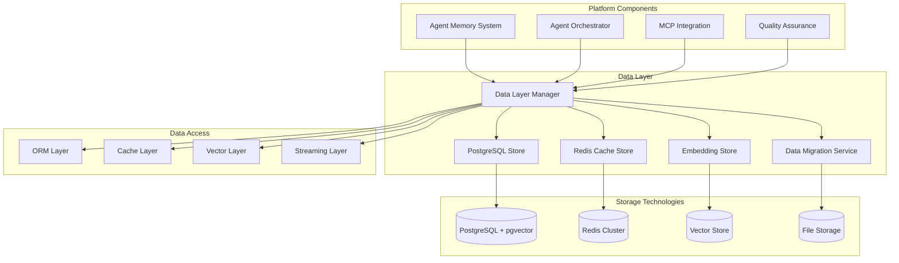

> **⚠️ NOTICE**: This document describes proposed architecture, not current implementation.  
> **Implementation Status**: See [COMPONENT_STATUS_INDEX.md](../iterations/v2/COMPONENT_STATUS_INDEX.md) for actual status.  
> **Last Verified**: 2025-10-13  
> **Status**: Aspirational/Planning Document

---


# Data Layer

The Data Layer provides persistent storage, caching, and data management capabilities for the Agent Agency platform, supporting high-performance operations for agent memory, task management, and system state.

## Overview

The Data Layer serves as the foundation for data persistence and access across the Agent Agency platform. It combines relational storage with vector capabilities, high-performance caching, and specialized embedding storage to meet the diverse needs of an intelligent multi-agent system.

## Key Features

### **Multi-Store Architecture**
- **Relational Storage**: PostgreSQL with pgvector for structured data and vector similarity
- **High-Performance Caching**: Redis for session data, frequently accessed information, and real-time operations
- **Specialized Storage**: Optimized storage for vector embeddings and semantic data
- **Hybrid Approach**: Combines the strengths of different storage technologies

### **Vector Database Capabilities**
- **Vector Similarity Search**: Efficient similarity search using pgvector extension
- **Embedding Storage**: Optimized storage for high-dimensional vector embeddings
- **Index Optimization**: Specialized indexes for vector operations (IVFFlat, HNSW)
- **Batch Operations**: Support for bulk embedding storage and retrieval

### **Caching and Performance**
- **Multi-Level Caching**: Application-level, database-level, and distributed caching
- **Cache Invalidation**: Intelligent cache invalidation strategies
- **Session Management**: Session storage and management for agent interactions
- **Real-Time Data**: Support for real-time data updates and streaming

### **Data Consistency and Reliability**
- **ACID Transactions**: Full ACID compliance for critical operations
- **Replication**: Data replication for high availability and disaster recovery
- **Backup and Recovery**: Comprehensive backup and recovery procedures
- **Data Integrity**: Constraints, validation, and consistency checks

## Architecture



## Core Components

### **Data Layer Manager**
The central coordinator for all data operations, providing unified access to different storage technologies.

**Key Responsibilities:**
- **Data Routing**: Routes data operations to appropriate storage systems
- **Connection Management**: Manages connections to all data stores
- **Transaction Coordination**: Coordinates transactions across multiple stores
- **Performance Optimization**: Optimizes data access patterns and caching

**API Interface:**
```typescript
interface DataLayerManager {
  // Connection management
  connect(): Promise<void>;
  disconnect(): Promise<void>;
  healthCheck(): Promise<HealthStatus>;
  
  // Data operations
  executeQuery(query: DataQuery): Promise<QueryResult>;
  executeTransaction(operations: DataOperation[]): Promise<TransactionResult>;
  
  // Cache operations
  getCached(key: string): Promise<any>;
  setCached(key: string, value: any, ttl?: number): Promise<void>;
  invalidateCache(pattern: string): Promise<void>;
  
  // Vector operations
  storeEmbeddings(embeddings: Embedding[]): Promise<void>;
  searchEmbeddings(query: VectorEmbedding, limit: number): Promise<SimilarityResult[]>;
}
```

### **PostgreSQL Store**
Manages relational data storage with vector capabilities using PostgreSQL and pgvector.

**Key Responsibilities:**
- **Schema Management**: Manages database schemas and migrations
- **Relational Operations**: Handles structured data operations
- **Vector Operations**: Manages vector embeddings and similarity search
- **Query Optimization**: Optimizes complex queries with indexes

**Core Features:**
- **pgvector Integration**: Full support for vector operations and similarity search
- **Advanced Indexing**: IVFFlat, HNSW, and custom indexes for performance
- **JSON Support**: Native JSON and JSONB support for flexible data structures
- **Full-Text Search**: PostgreSQL full-text search capabilities

**Database Schema:**
```sql
-- Core agent and task data
CREATE TABLE agents (
  id UUID PRIMARY KEY DEFAULT gen_random_uuid(),
  name VARCHAR(255) NOT NULL,
  type VARCHAR(100) NOT NULL,
  capabilities JSONB NOT NULL DEFAULT '{}',
  status VARCHAR(50) DEFAULT 'active',
  created_at TIMESTAMP DEFAULT NOW(),
  updated_at TIMESTAMP DEFAULT NOW()
);

CREATE TABLE tasks (
  id UUID PRIMARY KEY DEFAULT gen_random_uuid(),
  agent_id UUID REFERENCES agents(id),
  type VARCHAR(100) NOT NULL,
  status VARCHAR(50) DEFAULT 'pending',
  priority INTEGER DEFAULT 1,
  data JSONB NOT NULL DEFAULT '{}',
  result JSONB,
  created_at TIMESTAMP DEFAULT NOW(),
  updated_at TIMESTAMP DEFAULT NOW()
);

-- Vector embeddings for semantic search
CREATE TABLE embeddings (
  id UUID PRIMARY KEY DEFAULT gen_random_uuid(),
  entity_type VARCHAR(100) NOT NULL,
  entity_id UUID NOT NULL,
  embedding VECTOR(768),
  metadata JSONB DEFAULT '{}',
  created_at TIMESTAMP DEFAULT NOW()
);

-- Indexes for performance
CREATE INDEX idx_tasks_agent_status ON tasks (agent_id, status);
CREATE INDEX idx_embeddings_entity ON embeddings (entity_type, entity_id);
CREATE INDEX idx_embeddings_vector ON embeddings USING ivfflat (embedding vector_cosine_ops) WITH (lists = 100);
```

### **Redis Cache Store**
Provides high-performance caching and session management using Redis.

**Key Responsibilities:**
- **Session Management**: Manages agent sessions and authentication
- **Cache Operations**: High-performance key-value caching
- **Pub/Sub**: Real-time messaging and notifications
- **Distributed Locks**: Distributed locking for concurrent operations

**Core Features:**
- **Multiple Data Types**: Strings, hashes, lists, sets, sorted sets
- **TTL Support**: Automatic expiration of cached data
- **Pub/Sub Channels**: Real-time communication channels
- **Lua Scripting**: Server-side scripting for complex operations

**Key Use Cases:**
```typescript
// Session management
await redis.set(`session:${agentId}`, sessionData, 'EX', 3600);

// Cache frequently accessed data
await redis.set(`agent:${agentId}:capabilities`, capabilities, 'EX', 1800);

// Real-time notifications
await redis.publish('agent:status', { agentId, status: 'online' });

// Distributed locks
const lock = await redis.set(`lock:${resourceId}`, 'locked', 'NX', 'EX', 30);
```

### **Embedding Store**
Specialized storage optimized for vector embeddings and semantic operations.

**Key Responsibilities:**
- **Embedding Storage**: Efficient storage of high-dimensional vectors
- **Similarity Search**: Fast approximate nearest neighbor search
- **Batch Operations**: Bulk embedding operations
- **Index Management**: Maintenance of vector indexes

**Core Features:**
- **Multiple Index Types**: IVFFlat, HNSW for different performance characteristics
- **Distance Metrics**: Cosine, Euclidean, Manhattan distance calculations
- **Quantization**: Vector quantization for memory efficiency
- **Streaming**: Support for streaming embedding operations

**API Interface:**
```typescript
interface EmbeddingStore {
  // Embedding operations
  storeEmbedding(embedding: Embedding): Promise<EmbeddingId>;
  storeEmbeddings(embeddings: Embedding[]): Promise<EmbeddingId[]>;
  retrieveEmbedding(embeddingId: EmbeddingId): Promise<Embedding>;
  
  // Similarity search
  findSimilar(queryEmbedding: VectorEmbedding, limit: number): Promise<SimilarityResult[]>;
  findSimilarWithMetadata(query: SimilarityQuery): Promise<SimilarityResultWithMetadata[]>;
  
  // Index management
  createIndex(indexConfig: IndexConfig): Promise<IndexId>;
  updateIndex(indexId: IndexId, operations: IndexOperation[]): Promise<void>;
  optimizeIndex(indexId: IndexId): Promise<OptimizationResult>;
  
  // Batch operations
  batchStore(embeddings: Embedding[]): Promise<BatchResult>;
  batchSearch(queries: SimilarityQuery[]): Promise<BatchSimilarityResult>;
}
```

### **Data Migration Service**
Manages database schema changes, data migrations, and version control.

**Key Responsibilities:**
- **Schema Migrations**: Manages database schema evolution
- **Data Migrations**: Handles data transformations and updates
- **Version Control**: Tracks database schema versions
- **Rollback Support**: Provides rollback capabilities for migrations

**Core Features:**
- **Migration Scripts**: Versioned migration scripts with dependencies
- **Dry Run Support**: Test migrations before applying to production
- **Incremental Updates**: Support for incremental data updates
- **Backup Integration**: Automatic backups before migrations

## Data Models

### **Core Data Models**
```typescript
interface Agent {
  id: string;
  name: string;
  type: string;
  capabilities: Record<string, any>;
  status: 'active' | 'inactive' | 'maintenance';
  createdAt: Date;
  updatedAt: Date;
}

interface Task {
  id: string;
  agentId: string;
  type: string;
  status: 'pending' | 'running' | 'completed' | 'failed';
  priority: number;
  data: Record<string, any>;
  result?: Record<string, any>;
  error?: string;
  createdAt: Date;
  updatedAt: Date;
}

interface Embedding {
  id: string;
  entityType: string;
  entityId: string;
  vector: number[];
  metadata: Record<string, any>;
  createdAt: Date;
}
```

### **Cache Models**
```typescript
interface CacheEntry {
  key: string;
  value: any;
  ttl?: number;
  tags?: string[];
  createdAt: Date;
}

interface Session {
  id: string;
  agentId: string;
  data: Record<string, any>;
  expiresAt: Date;
  createdAt: Date;
}
```

### **Vector Search Models**
```typescript
interface SimilarityQuery {
  embedding: number[];
  limit: number;
  threshold?: number;
  filter?: Record<string, any>;
}

interface SimilarityResult {
  id: string;
  score: number;
  embedding: number[];
  metadata?: Record<string, any>;
}
```

## Configuration

### **Data Layer Configuration**
```typescript
interface DataLayerConfig {
  // PostgreSQL configuration
  postgresql: {
    host: string;
    port: number;
    database: string;
    username: string;
    password: string;
    ssl: boolean;
    poolSize: number;
    maxRetries: number;
  };
  
  // Redis configuration
  redis: {
    host: string;
    port: number;
    password?: string;
    db: number;
    cluster: boolean;
    sentinel?: RedisSentinelConfig;
  };
  
  // Vector store configuration
  vector: {
    dimension: number;
    indexType: 'ivfflat' | 'hnsw';
    distanceMetric: 'cosine' | 'euclidean' | 'manhattan';
    quantization: boolean;
  };
  
  // Caching configuration
  cache: {
    defaultTtl: number;
    maxMemory: string;
    evictionPolicy: 'lru' | 'lfu' | 'random';
    compression: boolean;
  };
  
  // Migration configuration
  migration: {
    directory: string;
    tableName: string;
    dryRun: boolean;
    backupBeforeMigration: boolean;
  };
}
```

## Performance Characteristics

### **Scalability**
- **Concurrent Connections**: Supports 1000+ concurrent database connections
- **Vector Operations**: Handles millions of vector similarity searches per day
- **Cache Throughput**: 100,000+ cache operations per second
- **Data Volume**: Scales to terabytes of structured and vector data

### **Performance Metrics**
- **Query Latency**: < 10ms for simple queries, < 100ms for complex joins
- **Vector Search**: < 50ms for similarity search with 1M+ vectors
- **Cache Hit Rate**: > 95% cache hit rate for optimized workloads
- **Transaction Throughput**: 10,000+ transactions per second

### **Storage Efficiency**
- **Vector Compression**: 50-80% reduction in vector storage size
- **Index Optimization**: Optimized indexes for query performance
- **Data Compression**: Automatic compression for large datasets
- **Archival**: Automatic archival of historical data

## Security and Compliance

### **Data Security**
- **Encryption**: End-to-end encryption for data at rest and in transit
- **Access Control**: Role-based access control for database operations
- **Audit Logging**: Comprehensive audit trails for all data operations
- **Data Masking**: Sensitive data masking and anonymization

### **Compliance**
- **GDPR**: Data protection and privacy compliance
- **SOC 2**: Security and availability controls
- **Data Residency**: Support for data residency requirements
- **Retention Policies**: Configurable data retention and deletion policies

## Monitoring and Observability

### **Metrics**
- **Database Metrics**: Query performance, connection pool usage, slow queries
- **Cache Metrics**: Hit rates, eviction rates, memory usage
- **Vector Metrics**: Search performance, index quality, storage efficiency
- **System Metrics**: CPU, memory, disk I/O, network usage

### **Logging**
- **Query Logging**: Detailed logging of database queries and performance
- **Error Logging**: Comprehensive error logging with context and stack traces
- **Audit Logging**: Security and compliance audit logging
- **Performance Logging**: Performance metrics and bottleneck identification

### **Alerting**
- **Performance Alerts**: Alerts for query performance degradation
- **Capacity Alerts**: Alerts for storage and connection pool capacity issues
- **Security Alerts**: Alerts for security violations and suspicious activities
- **Availability Alerts**: Alerts for database and cache availability issues

## Backup and Recovery

### **Backup Strategies**
- **Full Backups**: Regular full database backups
- **Incremental Backups**: Incremental backups for efficient recovery
- **Point-in-Time Recovery**: Support for point-in-time recovery
- **Vector Data Backups**: Specialized backups for vector embeddings

### **Recovery Procedures**
- **Automated Recovery**: Automated failover and recovery procedures
- **Manual Recovery**: Manual recovery procedures for complex scenarios
- **Data Validation**: Post-recovery data validation and integrity checks
- **Business Continuity**: Disaster recovery and business continuity planning

## Development and Testing

### **Development Guidelines**
- **Schema Design**: Normalized schema design with performance considerations
- **Query Optimization**: Efficient query design and index usage
- **Migration Safety**: Safe migration practices with rollback capabilities
- **Data Integrity**: Data validation and integrity constraints

### **Testing Strategy**
- **Unit Tests**: Database operation and caching unit tests
- **Integration Tests**: Full data layer integration testing
- **Performance Tests**: Load testing and performance benchmarking
- **Migration Tests**: Migration testing with rollback verification

## Future Enhancements

### **Planned Features**
- **Distributed Databases**: Support for distributed PostgreSQL and Redis clusters
- **Advanced Analytics**: Built-in analytics and reporting capabilities
- **Multi-Region Support**: Global data distribution and replication
- **Real-Time Analytics**: Real-time data processing and analytics

### **Research Areas**
- **Quantum Databases**: Exploration of quantum computing for database operations
- **AI-Optimized Storage**: Storage systems optimized for AI and ML workloads
- **Blockchain Integration**: Immutable audit trails using blockchain technology
- **Edge Computing**: Edge-optimized data storage and processing

---

**Author**: @darianrosebrook  
**Last Updated**: 2024  
**Version**: 1.0.0
