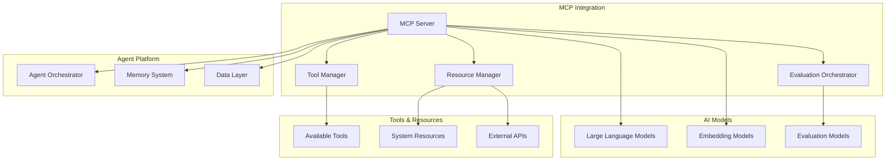

# MCP Integration

The MCP (Model Context Protocol) Integration provides autonomous AI reasoning, evaluation, and tool access capabilities for the Agent Agency platform, enabling sophisticated AI model interactions and autonomous decision-making.

## Overview

The MCP Integration serves as the bridge between the Agent Agency platform and AI models, providing standardized protocols for tool access, resource management, and autonomous evaluation. It enables agents to interact with AI models in a structured, secure, and efficient manner while maintaining full autonomy and reasoning capabilities.

## Key Features

### **Autonomous AI Reasoning**

- **Model Context Management**: Manages context and state across AI model interactions
- **Reasoning Orchestration**: Coordinates complex reasoning tasks across multiple AI models
- **Decision Making**: Enables autonomous decision-making with AI model support
- **Context Preservation**: Maintains context across multiple reasoning sessions

### **Tool and Resource Management**

- **Dynamic Tool Discovery**: Automatically discovers and manages available tools
- **Resource Coordination**: Coordinates access to shared resources and tools
- **Tool Lifecycle Management**: Manages tool registration, updates, and deprecation
- **Resource Optimization**: Optimizes resource utilization across agents

### **Autonomous Evaluation**

- **Performance Assessment**: Evaluates agent and system performance autonomously
- **Quality Metrics**: Tracks and analyzes quality metrics across the platform
- **Continuous Improvement**: Enables continuous system improvement through evaluation
- **Benchmarking**: Provides benchmarking capabilities for performance comparison

### **Protocol Compliance**

- **MCP Standards**: Full compliance with Model Context Protocol standards
- **Interoperability**: Ensures compatibility with MCP-compliant tools and models
- **Security**: Implements security best practices for AI model interactions
- **Scalability**: Designed for scalable AI model integration

## Architecture



## Core Components

### **MCP Server**

The central MCP protocol server that manages all AI model interactions and protocol compliance.

**Key Responsibilities:**

- **Protocol Management**: Implements and maintains MCP protocol compliance
- **Request Routing**: Routes requests to appropriate AI models and tools
- **Context Management**: Manages context and state across AI interactions
- **Security Enforcement**: Enforces security policies and access controls

**API Interface:**

```typescript
interface MCPServer {
  // Protocol management
  initializeServer(config: MCPServerConfig): Promise<void>;
  startServer(port: number): Promise<void>;
  stopServer(): Promise<void>;

  // Request handling
  handleRequest(request: MCPRequest): Promise<MCPResponse>;
  handleStreamingRequest(
    request: MCPStreamingRequest
  ): Promise<MCPStreamingResponse>;

  // Context management
  createContext(contextData: ContextData): Promise<ContextId>;
  updateContext(contextId: ContextId, updates: ContextUpdate): Promise<void>;
  getContext(contextId: ContextId): Promise<ContextData>;

  // Security
  authenticateRequest(request: MCPRequest): Promise<AuthenticationResult>;
  authorizeAccess(
    resource: ResourceId,
    agentId: string
  ): Promise<AuthorizationResult>;
}
```

### **Resource Manager**

Manages access to system resources, external APIs, and shared services.

**Key Responsibilities:**

- **Resource Discovery**: Discovers available resources and capabilities
- **Access Control**: Manages resource access permissions and quotas
- **Resource Monitoring**: Monitors resource usage and availability
- **Load Balancing**: Distributes resource usage across available instances

**Core Features:**

- **Resource Types**: APIs, databases, file systems, compute resources, external services
- **Access Patterns**: Read-only, read-write, streaming, batch processing
- **Quota Management**: Resource quotas and usage limits
- **Health Monitoring**: Resource health and availability monitoring

**API Interface:**

```typescript
interface ResourceManager {
  // Resource discovery
  discoverResources(): Promise<Resource[]>;
  registerResource(resource: ResourceDefinition): Promise<ResourceId>;
  unregisterResource(resourceId: ResourceId): Promise<void>;

  // Access management
  requestResourceAccess(
    resourceId: ResourceId,
    agentId: string
  ): Promise<ResourceAccess>;
  releaseResourceAccess(accessId: AccessId): Promise<void>;
  checkResourceAvailability(
    resourceId: ResourceId
  ): Promise<ResourceAvailability>;

  // Resource monitoring
  getResourceMetrics(resourceId: ResourceId): Promise<ResourceMetrics>;
  getResourceUsage(agentId: string): Promise<ResourceUsage[]>;
  monitorResourceHealth(): Promise<ResourceHealthStatus[]>;
}
```

### **Tool Manager**

Manages the lifecycle and access to available tools and capabilities.

**Key Responsibilities:**

- **Tool Discovery**: Discovers and catalogs available tools
- **Tool Registration**: Registers new tools and capabilities
- **Tool Execution**: Executes tools with proper context and security
- **Tool Monitoring**: Monitors tool usage and performance

**Core Features:**

- **Tool Categories**: Agent management, task management, evaluation, system monitoring
- **Tool Types**: Synchronous, asynchronous, streaming, batch processing
- **Security**: Tool execution sandboxing and access controls
- **Performance**: Tool performance monitoring and optimization

**API Interface:**

```typescript
interface ToolManager {
  // Tool management
  registerTool(tool: ToolDefinition): Promise<ToolId>;
  unregisterTool(toolId: ToolId): Promise<void>;
  updateTool(toolId: ToolId, updates: ToolUpdate): Promise<void>;

  // Tool execution
  executeTool(
    toolId: ToolId,
    parameters: ToolParameters,
    context: ExecutionContext
  ): Promise<ToolResult>;
  executeToolStreaming(
    toolId: ToolId,
    parameters: ToolParameters,
    context: ExecutionContext
  ): Promise<ToolStreamingResult>;

  // Tool discovery
  findTools(criteria: ToolSearchCriteria): Promise<ToolMatch[]>;
  getToolCapabilities(toolId: ToolId): Promise<ToolCapabilities>;
  getToolDocumentation(toolId: ToolId): Promise<ToolDocumentation>;

  // Tool monitoring
  getToolMetrics(toolId: ToolId): Promise<ToolMetrics>;
  getToolUsage(agentId: string): Promise<ToolUsage[]>;
  monitorToolHealth(): Promise<ToolHealthStatus[]>;
}
```

### **Evaluation Orchestrator**

Provides autonomous evaluation capabilities for agents, tasks, and system performance.

**Key Responsibilities:**

- **Performance Evaluation**: Evaluates agent and system performance
- **Quality Assessment**: Assesses quality metrics and outcomes
- **Benchmarking**: Provides benchmarking and comparison capabilities
- **Continuous Improvement**: Enables continuous system improvement

**Core Features:**

- **Evaluation Types**: Performance, quality, compliance, efficiency
- **Evaluation Methods**: Automated, semi-automated, manual, hybrid
- **Metrics**: Quantitative and qualitative evaluation metrics
- **Reporting**: Comprehensive evaluation reports and insights

**API Interface:**

```typescript
interface EvaluationOrchestrator {
  // Evaluation execution
  evaluateAgent(
    agentId: string,
    evaluationCriteria: EvaluationCriteria
  ): Promise<EvaluationResult>;
  evaluateTask(
    taskId: string,
    evaluationCriteria: EvaluationCriteria
  ): Promise<EvaluationResult>;
  evaluateSystem(
    evaluationCriteria: EvaluationCriteria
  ): Promise<SystemEvaluationResult>;

  // Benchmarking
  benchmarkPerformance(
    benchmarkConfig: BenchmarkConfig
  ): Promise<BenchmarkResult>;
  comparePerformance(
    comparisonConfig: ComparisonConfig
  ): Promise<ComparisonResult>;

  // Continuous evaluation
  startContinuousEvaluation(
    config: ContinuousEvaluationConfig
  ): Promise<EvaluationId>;
  stopContinuousEvaluation(evaluationId: EvaluationId): Promise<void>;
  getContinuousEvaluationResults(
    evaluationId: EvaluationId
  ): Promise<ContinuousEvaluationResults>;

  // Evaluation insights
  getEvaluationInsights(timeRange: TimeRange): Promise<EvaluationInsights>;
  generateEvaluationReport(
    reportConfig: ReportConfig
  ): Promise<EvaluationReport>;
}
```

## Tool Categories

### **Agent Management Tools**

Tools for managing agent lifecycle, capabilities, and performance.

```typescript
interface AgentManagementTools {
  // Agent lifecycle
  registerAgent(agent: AgentDefinition): Promise<AgentId>;
  unregisterAgent(agentId: AgentId): Promise<void>;
  updateAgentCapabilities(
    agentId: AgentId,
    capabilities: CapabilityUpdate
  ): Promise<void>;

  // Agent monitoring
  getAgentStatus(agentId: AgentId): Promise<AgentStatus>;
  getAgentMetrics(agentId: AgentId): Promise<AgentMetrics>;
  monitorAgentHealth(agentId: AgentId): Promise<HealthStatus>;

  // Agent coordination
  findSimilarAgents(
    agentId: AgentId,
    criteria: SimilarityCriteria
  ): Promise<AgentMatch[]>;
  coordinateAgents(
    agentIds: AgentId[],
    coordinationConfig: CoordinationConfig
  ): Promise<CoordinationResult>;
}
```

### **Task Management Tools**

Tools for managing task lifecycle, routing, and execution.

```typescript
interface TaskManagementTools {
  // Task lifecycle
  submitTask(task: TaskDefinition): Promise<TaskId>;
  updateTaskStatus(taskId: TaskId, status: TaskStatus): Promise<void>;
  cancelTask(taskId: TaskId): Promise<void>;

  // Task routing
  findOptimalAgent(task: TaskDefinition): Promise<AgentRecommendation>;
  routeTask(
    taskId: TaskId,
    routingConfig: RoutingConfig
  ): Promise<RoutingResult>;

  // Task monitoring
  getTaskStatus(taskId: TaskId): Promise<TaskStatus>;
  getTaskMetrics(taskId: TaskId): Promise<TaskMetrics>;
  monitorTaskExecution(taskId: TaskId): Promise<ExecutionStatus>;
}
```

### **Evaluation Tools**

Tools for evaluating performance, quality, and outcomes.

```typescript
interface EvaluationTools {
  // Performance evaluation
  evaluatePerformance(
    entityId: string,
    evaluationConfig: PerformanceEvaluationConfig
  ): Promise<PerformanceEvaluationResult>;
  benchmarkPerformance(
    benchmarkConfig: BenchmarkConfig
  ): Promise<BenchmarkResult>;

  // Quality assessment
  assessQuality(
    entityId: string,
    qualityCriteria: QualityCriteria
  ): Promise<QualityAssessmentResult>;
  compareQuality(
    comparisonConfig: QualityComparisonConfig
  ): Promise<QualityComparisonResult>;

  // Outcome analysis
  analyzeOutcomes(
    entityId: string,
    analysisConfig: OutcomeAnalysisConfig
  ): Promise<OutcomeAnalysisResult>;
  predictOutcomes(
    scenario: Scenario,
    predictionConfig: OutcomePredictionConfig
  ): Promise<OutcomePrediction>;
}
```

### **System Monitoring Tools**

Tools for monitoring system health, performance, and resource utilization.

```typescript
interface SystemMonitoringTools {
  // System health
  getSystemHealth(): Promise<SystemHealthStatus>;
  monitorSystemMetrics(): Promise<SystemMetrics>;
  detectAnomalies(
    anomalyConfig: AnomalyDetectionConfig
  ): Promise<AnomalyDetectionResult>;

  // Resource monitoring
  getResourceUtilization(): Promise<ResourceUtilization>;
  monitorResourceHealth(): Promise<ResourceHealthStatus[]>;
  optimizeResourceUsage(
    optimizationConfig: ResourceOptimizationConfig
  ): Promise<OptimizationResult>;

  // Performance monitoring
  getPerformanceMetrics(): Promise<PerformanceMetrics>;
  analyzePerformanceTrends(
    timeRange: TimeRange
  ): Promise<PerformanceTrendAnalysis>;
  generatePerformanceReport(
    reportConfig: PerformanceReportConfig
  ): Promise<PerformanceReport>;
}
```

## Data Models

### **MCP Protocol Models**

```typescript
interface MCPRequest {
  id: string;
  method: string;
  params: Record<string, any>;
  context?: ContextData;
  metadata?: RequestMetadata;
}

interface MCPResponse {
  id: string;
  result?: any;
  error?: MCPError;
  metadata?: ResponseMetadata;
}

interface MCPStreamingResponse {
  id: string;
  type: "data" | "error" | "end";
  data?: any;
  error?: MCPError;
}
```

### **Resource Models**

```typescript
interface Resource {
  id: ResourceId;
  name: string;
  type: ResourceType;
  capabilities: ResourceCapabilities;
  accessPattern: AccessPattern;
  quota: ResourceQuota;
  health: ResourceHealth;
  metadata: ResourceMetadata;
}

interface ResourceAccess {
  id: AccessId;
  resourceId: ResourceId;
  agentId: string;
  permissions: Permission[];
  quota: QuotaUsage;
  expiresAt?: Date;
}
```

### **Tool Models**

```typescript
interface Tool {
  id: ToolId;
  name: string;
  category: ToolCategory;
  description: string;
  parameters: ToolParameter[];
  returns: ToolReturnType;
  security: ToolSecurity;
  performance: ToolPerformance;
}

interface ToolExecution {
  id: ExecutionId;
  toolId: ToolId;
  agentId: string;
  parameters: ToolParameters;
  context: ExecutionContext;
  result: ToolResult;
  metrics: ExecutionMetrics;
}
```

### **Evaluation Models**

```typescript
interface EvaluationResult {
  id: EvaluationId;
  entityId: string;
  entityType: EntityType;
  criteria: EvaluationCriteria;
  scores: EvaluationScores;
  insights: EvaluationInsights;
  recommendations: Recommendation[];
  timestamp: Date;
}

interface BenchmarkResult {
  id: BenchmarkId;
  benchmarkType: BenchmarkType;
  results: BenchmarkScores;
  comparison: BenchmarkComparison;
  insights: BenchmarkInsights;
  timestamp: Date;
}
```

## Configuration

### **MCP Server Configuration**

```typescript
interface MCPServerConfig {
  // Server settings
  server: {
    port: number;
    host: string;
    ssl: boolean;
    maxConnections: number;
    timeout: number;
  };

  // AI model configuration
  models: {
    llm: {
      provider: string;
      model: string;
      apiKey: string;
      baseUrl?: string;
    };
    embedding: {
      provider: string;
      model: string;
      apiKey: string;
      baseUrl?: string;
    };
  };

  // Security configuration
  security: {
    authentication: {
      enabled: boolean;
      method: "token" | "certificate" | "oauth";
      config: AuthenticationConfig;
    };
    authorization: {
      enabled: boolean;
      rbac: boolean;
      policies: AuthorizationPolicy[];
    };
  };

  // Performance configuration
  performance: {
    caching: {
      enabled: boolean;
      ttl: number;
      maxSize: number;
    };
    rateLimit: {
      enabled: boolean;
      requestsPerMinute: number;
      burstLimit: number;
    };
  };
}
```

### **Tool Configuration**

```typescript
interface ToolConfig {
  // Tool registration
  tools: {
    autoDiscovery: boolean;
    allowedCategories: ToolCategory[];
    securityLevel: "strict" | "moderate" | "permissive";
  };

  // Tool execution
  execution: {
    timeout: number;
    maxConcurrency: number;
    sandboxing: boolean;
    resourceLimits: ResourceLimits;
  };

  // Tool monitoring
  monitoring: {
    enabled: boolean;
    metricsRetention: number;
    alertThresholds: AlertThreshold[];
  };
}
```

## Security and Compliance

### **Security Features**

- **Authentication**: Multi-factor authentication for AI model access
- **Authorization**: Role-based access control for tools and resources
- **Encryption**: End-to-end encryption for all AI model communications
- **Audit Logging**: Comprehensive audit trails for all operations

### **Compliance**

- **Data Privacy**: GDPR and CCPA compliance for data handling
- **Security Standards**: SOC 2 and ISO 27001 compliance
- **AI Ethics**: Responsible AI practices and bias detection
- **Regulatory**: Compliance with AI regulation frameworks

## Performance Characteristics

### **Scalability**

- **Concurrent Requests**: Supports 1000+ concurrent AI model requests
- **Tool Execution**: Handles 10,000+ tool executions per minute
- **Resource Management**: Efficient resource utilization and load balancing
- **Horizontal Scaling**: Designed for distributed deployment

### **Performance Metrics**

- **Request Latency**: < 100ms average response time
- **Tool Execution**: < 500ms average tool execution time
- **Resource Access**: < 50ms average resource access time
- **Evaluation Performance**: < 2s average evaluation time

## Monitoring and Observability

### **Metrics**

- **Request Metrics**: Request volume, latency, error rates
- **Tool Metrics**: Tool execution times, success rates, usage patterns
- **Resource Metrics**: Resource utilization, availability, performance
- **Evaluation Metrics**: Evaluation times, accuracy, coverage

### **Logging**

- **Request Logging**: Detailed logging of all MCP requests and responses
- **Tool Logging**: Tool execution logging with performance metrics
- **Security Logging**: Security events and access control logging
- **Error Logging**: Comprehensive error logging with context

### **Alerting**

- **Performance Alerts**: Alerts for performance degradation
- **Security Alerts**: Alerts for security violations and anomalies
- **Resource Alerts**: Alerts for resource availability and quota issues
- **System Health**: General system health and availability alerts

## Development and Testing

### **Development Guidelines**

- **Protocol Compliance**: Strict adherence to MCP protocol standards
- **Type Safety**: Comprehensive TypeScript implementation
- **Error Handling**: Robust error handling with graceful degradation
- **Performance**: Optimized for high-throughput scenarios

### **Testing Strategy**

- **Unit Tests**: Comprehensive unit test coverage (>90%)
- **Integration Tests**: AI model and tool integration testing
- **Protocol Tests**: MCP protocol compliance testing
- **Performance Tests**: Load testing and performance benchmarking

## Future Enhancements

### **Planned Features**

- **Multi-Model Support**: Support for multiple AI model providers
- **Advanced Security**: Enhanced security features and compliance
- **Real-Time Processing**: Stream processing for real-time AI interactions
- **Federated Learning**: Cross-instance learning and knowledge sharing

### **Research Areas**

- **AI Safety**: Advanced AI safety and alignment research
- **Autonomous Reasoning**: Self-improving reasoning capabilities
- **Multi-Modal AI**: Support for multi-modal AI interactions
- **Quantum AI**: Exploration of quantum computing for AI optimization

---

**Author**: @darianrosebrook  
**Last Updated**: 2024  
**Version**: 1.0.0
