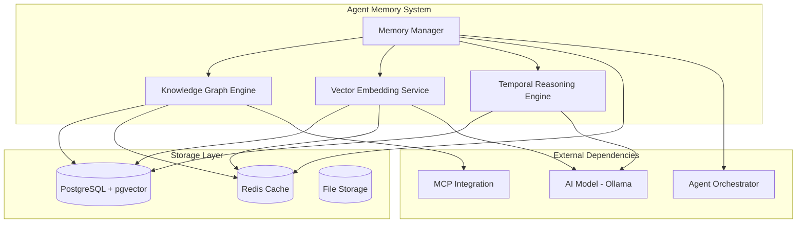

> **⚠️ NOTICE**: This document describes proposed architecture, not current implementation.  
> **Implementation Status**: See [COMPONENT_STATUS_INDEX.md](../iterations/v2/COMPONENT_STATUS_INDEX.md) for actual status.  
> **Last Verified**: 2025-10-13  
> **Status**: Aspirational/Planning Document

---


# Agent Memory System

The Agent Memory System provides persistent, intelligent memory capabilities for the Agent Agency platform, enabling agents to learn from experiences, build knowledge graphs, and make context-aware decisions through advanced vector embeddings and temporal reasoning.

## Overview

The Agent Memory System is a sophisticated memory architecture that combines knowledge graphs, vector embeddings, and temporal reasoning to create a comprehensive memory ecosystem. It enables agents to store, retrieve, and learn from experiences while maintaining context and building collective intelligence across the entire agent ecosystem.

## Key Features

### **Persistent Memory Storage**
- **Experience Persistence**: Long-term storage of agent experiences and outcomes
- **Knowledge Graph**: Structured representation of entities, relationships, and concepts
- **Vector Embeddings**: Semantic similarity search and context-aware retrieval
- **Temporal Reasoning**: Time-based analysis and causality detection

### **Multi-Tenant Architecture**
- **Tenant Isolation**: Secure project-specific memory spaces with controlled sharing
- **Context Offloading**: Efficient management of LLM context windows and long-term memory
- **Hybrid RAG**: Combined knowledge graph and vector embedding retrieval
- **Federated Learning**: Privacy-preserving cross-project intelligence sharing
- **Collective Intelligence**: Higher-order learning across the entire agent ecosystem

### **Intelligent Memory Retrieval**
- **Context-Aware Search**: Retrieves relevant memories based on current context
- **Semantic Similarity**: Finds similar experiences using vector similarity
- **Multi-Modal Memory**: Supports text, structured data, and future multi-modal content
- **Temporal Queries**: Time-based memory queries and trend analysis

### **Learning and Adaptation**
- **Experience Learning**: Agents learn from task outcomes and performance data
- **Capability Evolution**: Tracks and evolves agent capabilities over time
- **Cross-Agent Learning**: Knowledge sharing between agents
- **Predictive Analytics**: Uses memory to predict outcomes and optimize decisions

### **Advanced Reasoning**
- **Multi-Hop Reasoning**: Complex reasoning across multiple knowledge graph relationships
- **Causality Detection**: Identifies cause-effect relationships in agent experiences
- **Trend Analysis**: Analyzes patterns and trends in agent performance
- **Change Point Detection**: Identifies significant changes in agent behavior

### **Context Offloading & RAG**
- **Context Quarantine**: Isolated sub-task contexts to prevent information interference
- **Strategic Offloading**: Intelligent decisions about what context to persist vs. summarize
- **Hybrid Retrieval**: Combines structured (graph) and unstructured (vector) search
- **Context Reconstruction**: Efficient retrieval and reconstruction of offloaded context

## Architecture



## Core Components

### **Memory Manager**
The central coordinator for all memory operations, providing a unified interface for memory storage, retrieval, and management.

**Key Responsibilities:**
- **Memory Lifecycle**: Manages memory creation, updates, and cleanup
- **Access Control**: Ensures secure and authorized memory access
- **Performance Optimization**: Implements caching and optimization strategies
- **Integration Coordination**: Coordinates with other system components

**API Interface:**
```typescript
interface MemoryManager {
  // Core memory operations
  storeExperience(experience: AgentExperience): Promise<MemoryId>;
  retrieveMemory(memoryId: MemoryId): Promise<AgentExperience>;
  searchMemories(query: MemoryQuery): Promise<MemorySearchResult[]>;
  
  // Context-aware operations
  getContextualMemories(context: TaskContext): Promise<ContextualMemory[]>;
  updateMemoryContext(memoryId: MemoryId, context: MemoryContext): Promise<void>;
  
  // Learning operations
  learnFromOutcome(experience: ExperienceOutcome): Promise<void>;
  getLearningInsights(agentId: string): Promise<LearningInsights>;
}
```

### **Knowledge Graph Engine**
Manages the knowledge graph structure, entity relationships, and graph-based reasoning capabilities.

**Key Responsibilities:**
- **Entity Management**: Creates, updates, and manages knowledge graph entities
- **Relationship Modeling**: Defines and maintains relationships between entities
- **Graph Traversal**: Provides efficient graph traversal and query capabilities
- **Entity Deduplication**: Merges similar entities and maintains graph consistency

**Core Features:**
- **Entity Types**: Agent capabilities, task types, outcomes, contexts, tools, resources
- **Relationship Types**: performs, requires, enables, conflicts_with, improves, learns_from
- **Graph Operations**: Breadth-first search, shortest path, centrality analysis
- **Semantic Enrichment**: Automatic entity extraction and relationship discovery

**API Interface:**
```typescript
interface KnowledgeGraphEngine {
  // Entity operations
  createEntity(entity: GraphEntity): Promise<EntityId>;
  updateEntity(entityId: EntityId, updates: EntityUpdate): Promise<void>;
  findSimilarEntities(entity: GraphEntity, threshold: number): Promise<EntityMatch[]>;
  
  // Relationship operations
  createRelationship(relationship: GraphRelationship): Promise<RelationshipId>;
  updateRelationship(relId: RelationshipId, updates: RelationshipUpdate): Promise<void>;
  findRelationships(entityId: EntityId, type?: RelationshipType): Promise<GraphRelationship[]>;
  
  // Graph traversal
  traverseGraph(startEntity: EntityId, traversalOptions: TraversalOptions): Promise<TraversalResult>;
  findShortestPath(from: EntityId, to: EntityId): Promise<PathResult>;
  
  // Reasoning
  performMultiHopReasoning(query: ReasoningQuery): Promise<ReasoningResult>;
  detectCausality(entityId: EntityId): Promise<CausalityResult>;
}
```

### **Vector Embedding Service**
Handles vector embeddings for semantic similarity search and context-aware memory retrieval.

**Key Responsibilities:**
- **Embedding Generation**: Creates vector embeddings for text and structured data
- **Similarity Search**: Performs efficient vector similarity searches
- **Context Encoding**: Encodes context information into vector representations
- **Embedding Management**: Manages embedding storage and indexing

**Core Features:**
- **Model Integration**: Uses Ollama with embedding models (embeddinggemma)
- **Multi-Modal Support**: Text embeddings with future support for other modalities
- **Batch Processing**: Efficient batch embedding generation
- **Caching**: Intelligent caching of frequently used embeddings

**API Interface:**
```typescript
interface VectorEmbeddingService {
  // Embedding generation
  generateEmbedding(text: string): Promise<VectorEmbedding>;
  generateBatchEmbeddings(texts: string[]): Promise<VectorEmbedding[]>;
  generateContextEmbedding(context: TaskContext): Promise<VectorEmbedding>;
  
  // Similarity search
  findSimilarEmbeddings(query: VectorEmbedding, limit: number): Promise<SimilarityResult[]>;
  semanticSearch(query: string, limit: number): Promise<SemanticSearchResult[]>;
  
  // Embedding management
  storeEmbedding(embedding: VectorEmbedding, metadata: EmbeddingMetadata): Promise<EmbeddingId>;
  retrieveEmbedding(embeddingId: EmbeddingId): Promise<VectorEmbedding>;
  updateEmbedding(embeddingId: EmbeddingId, updates: EmbeddingUpdate): Promise<void>;
}
```

### **Temporal Reasoning Engine**
Provides advanced temporal analysis capabilities for understanding time-based patterns and causality.

**Key Responsibilities:**
- **Temporal Analysis**: Analyzes time-based patterns in agent experiences
- **Causality Detection**: Identifies cause-effect relationships over time
- **Trend Analysis**: Detects and analyzes trends in agent performance
- **Change Point Detection**: Identifies significant changes in behavior patterns

**Core Features:**
- **Time Series Analysis**: Analyzes performance metrics over time
- **Causality Inference**: Uses temporal patterns to infer causality
- **Trend Forecasting**: Predicts future trends based on historical data
- **Anomaly Detection**: Identifies unusual patterns or behaviors

**API Interface:**
```typescript
interface TemporalReasoningEngine {
  // Temporal analysis
  analyzeTemporalPatterns(entityId: EntityId, timeRange: TimeRange): Promise<TemporalAnalysis>;
  detectTrends(metric: PerformanceMetric, timeRange: TimeRange): Promise<TrendResult>;
  
  // Causality detection
  detectCausality(cause: EntityId, effect: EntityId): Promise<CausalityResult>;
  findCausalChains(startEntity: EntityId, depth: number): Promise<CausalChain[]>;
  
  // Change detection
  detectChangePoints(entityId: EntityId, metric: PerformanceMetric): Promise<ChangePoint[]>;
  analyzeBehaviorChanges(agentId: string, timeRange: TimeRange): Promise<BehaviorChangeAnalysis>;
  
  // Forecasting
  forecastTrends(metric: PerformanceMetric, horizon: TimeHorizon): Promise<ForecastResult>;
  predictOutcomes(scenario: Scenario, timeRange: TimeRange): Promise<OutcomePrediction>;
}
```

## Data Models

### **Agent Experience**
```typescript
interface AgentExperience {
  id: MemoryId;
  agentId: string;
  taskId: string;
  context: TaskContext;
  input: TaskInput;
  output: TaskOutput;
  outcome: ExperienceOutcome;
  timestamp: Date;
  metadata: ExperienceMetadata;
  embedding?: VectorEmbedding;
}

interface ExperienceOutcome {
  success: boolean;
  performance: PerformanceMetrics;
  learning: LearningInsights;
  feedback: AgentFeedback;
  improvements: CapabilityImprovement[];
}
```

### **Knowledge Graph Entities**
```typescript
interface GraphEntity {
  id: EntityId;
  type: EntityType;
  name: string;
  description?: string;
  properties: Record<string, any>;
  embedding: VectorEmbedding;
  createdAt: Date;
  updatedAt: Date;
}

interface GraphRelationship {
  id: RelationshipId;
  sourceEntity: EntityId;
  targetEntity: EntityId;
  type: RelationshipType;
  properties: Record<string, any>;
  strength: number;
  confidence: number;
  createdAt: Date;
  updatedAt: Date;
}
```

### **Memory Queries**
```typescript
interface MemoryQuery {
  type: 'semantic' | 'temporal' | 'contextual' | 'capability';
  query: string;
  filters?: QueryFilters;
  limit?: number;
  timeRange?: TimeRange;
  context?: TaskContext;
}

interface ContextualMemory {
  memory: AgentExperience;
  relevanceScore: number;
  contextMatch: ContextMatch;
  reasoningPath: ReasoningPath;
}
```

## Database Schema

### **Core Tables**
```sql
-- Agent experiences and outcomes
CREATE TABLE agent_experiences (
  id UUID PRIMARY KEY DEFAULT gen_random_uuid(),
  agent_id VARCHAR(255) NOT NULL,
  task_id VARCHAR(255) NOT NULL,
  context JSONB NOT NULL,
  input JSONB NOT NULL,
  output JSONB NOT NULL,
  outcome JSONB NOT NULL,
  embedding VECTOR(768),
  created_at TIMESTAMP DEFAULT NOW(),
  updated_at TIMESTAMP DEFAULT NOW()
);

-- Knowledge graph entities
CREATE TABLE knowledge_graph_entities (
  id UUID PRIMARY KEY DEFAULT gen_random_uuid(),
  type entity_type NOT NULL,
  name VARCHAR(500) NOT NULL,
  description TEXT,
  properties JSONB,
  embedding VECTOR(768),
  created_at TIMESTAMP DEFAULT NOW(),
  updated_at TIMESTAMP DEFAULT NOW()
);

-- Knowledge graph relationships
CREATE TABLE knowledge_graph_relationships (
  id UUID PRIMARY KEY DEFAULT gen_random_uuid(),
  source_entity UUID REFERENCES knowledge_graph_entities(id),
  target_entity UUID REFERENCES knowledge_graph_entities(id),
  type relationship_type NOT NULL,
  properties JSONB,
  strength FLOAT DEFAULT 1.0,
  confidence FLOAT DEFAULT 1.0,
  created_at TIMESTAMP DEFAULT NOW(),
  updated_at TIMESTAMP DEFAULT NOW()
);

-- Temporal analysis results
CREATE TABLE temporal_analysis (
  id UUID PRIMARY KEY DEFAULT gen_random_uuid(),
  entity_id UUID NOT NULL,
  analysis_type temporal_analysis_type NOT NULL,
  results JSONB NOT NULL,
  time_range TSRANGE NOT NULL,
  created_at TIMESTAMP DEFAULT NOW()
);
```

### **Indexes**
```sql
-- Vector similarity indexes
CREATE INDEX idx_experiences_embedding ON agent_experiences 
USING ivfflat (embedding vector_cosine_ops) WITH (lists = 100);

CREATE INDEX idx_entities_embedding ON knowledge_graph_entities 
USING ivfflat (embedding vector_cosine_ops) WITH (lists = 100);

-- Performance indexes
CREATE INDEX idx_experiences_agent_time ON agent_experiences (agent_id, created_at);
CREATE INDEX idx_relationships_source ON knowledge_graph_relationships (source_entity);
CREATE INDEX idx_relationships_target ON knowledge_graph_relationships (target_entity);
CREATE INDEX idx_temporal_entity_time ON temporal_analysis (entity_id, time_range);
```

## Configuration

### **Memory System Configuration**
```typescript
interface MemorySystemConfig {
  // Database configuration
  database: {
    host: string;
    port: number;
    database: string;
    username: string;
    password: string;
    ssl: boolean;
    poolSize: number;
  };
  
  // Vector embedding configuration
  embeddings: {
    model: string;
    dimension: number;
    batchSize: number;
    cacheSize: number;
  };
  
  // Knowledge graph configuration
  knowledgeGraph: {
    maxEntities: number;
    maxRelationships: number;
    similarityThreshold: number;
    deduplicationEnabled: boolean;
  };
  
  // Temporal reasoning configuration
  temporal: {
    analysisWindow: string;
    trendDetectionEnabled: boolean;
    causalityEnabled: boolean;
    forecastingEnabled: boolean;
  };
  
  // Performance configuration
  performance: {
    cacheEnabled: boolean;
    cacheSize: number;
    batchProcessingEnabled: boolean;
    asyncProcessing: boolean;
  };
}
```

## Performance Characteristics

### **Scalability**
- **Memory Capacity**: Supports millions of agent experiences
- **Graph Size**: Handles knowledge graphs with 100,000+ entities
- **Query Performance**: Sub-100ms response times for complex queries
- **Concurrent Access**: Supports 1000+ concurrent memory operations

### **Storage Efficiency**
- **Vector Compression**: Optimized vector storage with compression
- **Graph Optimization**: Efficient graph storage and traversal
- **Index Optimization**: Strategic indexing for performance
- **Data Archival**: Automatic archival of old data

### **Performance Metrics**
- **Embedding Generation**: < 50ms per embedding
- **Similarity Search**: < 100ms for complex queries
- **Graph Traversal**: < 200ms for multi-hop reasoning
- **Temporal Analysis**: < 500ms for trend analysis

## Integration Points

### **Agent Orchestrator Integration**
- **Experience Storage**: Stores agent task experiences and outcomes
- **Capability Profiling**: Maintains detailed agent capability information
- **Routing Optimization**: Provides memory-based routing suggestions
- **Performance Tracking**: Tracks and analyzes agent performance over time

### **MCP Integration**
- **Tool Memory**: Stores information about tool usage and effectiveness
- **Resource Tracking**: Tracks resource utilization and availability
- **Evaluation Results**: Stores evaluation outcomes and learning insights
- **Protocol Compliance**: Maintains MCP-specific memory structures

### **AI Model Integration**
- **Embedding Generation**: Uses local AI models for embedding creation
- **Semantic Analysis**: Leverages AI models for semantic understanding
- **Pattern Recognition**: Uses AI for pattern detection and analysis
- **Learning Enhancement**: Enhances learning through AI-powered insights

## Security and Privacy

### **Data Protection**
- **Encryption**: End-to-end encryption for sensitive memory data
- **Access Control**: Role-based access control for memory operations
- **Data Anonymization**: Anonymization of sensitive agent data
- **Audit Logging**: Comprehensive audit trails for memory operations

### **Privacy Considerations**
- **Agent Isolation**: Memory isolation between different agent instances
- **Data Minimization**: Storage of only necessary memory data
- **Retention Policies**: Configurable data retention and cleanup
- **Compliance**: GDPR and SOC 2 compliance considerations

## Monitoring and Observability

### **Metrics**
- **Memory Operations**: Read/write operations, cache hit rates
- **Performance**: Query response times, embedding generation times
- **Storage**: Database size, vector index performance
- **Learning**: Experience processing rates, capability evolution

### **Logging**
- **Memory Operations**: Detailed logging of all memory operations
- **Performance**: Performance metrics and timing information
- **Errors**: Comprehensive error logging with context
- **Learning**: Learning process and outcome logging

### **Alerting**
- **Performance Degradation**: Alerts for performance threshold breaches
- **Storage Issues**: Alerts for storage capacity and performance issues
- **Learning Anomalies**: Alerts for unusual learning patterns
- **System Health**: General system health and availability alerts

## Development and Testing

### **Development Guidelines**
- **Type Safety**: Comprehensive TypeScript implementation
- **Error Handling**: Robust error handling with graceful degradation
- **Performance**: Optimized for high-throughput scenarios
- **Maintainability**: Clean, documented, and testable code

### **Testing Strategy**
- **Unit Tests**: Comprehensive unit test coverage (>90%)
- **Integration Tests**: Database and AI model integration testing
- **Performance Tests**: Load testing and performance benchmarking
- **Memory Tests**: Memory consistency and data integrity testing

## Related Documentation

- **[Multi-Tenancy & Context Offloading](multi-tenancy.md)**: Comprehensive guide to multi-tenant architecture, context offloading mechanisms, and federated learning
- **[Technical Architecture](technical-architecture.md)**: Detailed technical implementation and code architecture
- **[Implementation Roadmap](implementation-roadmap.md)**: Development timeline and planned features

## Future Enhancements

### **Planned Features**
- **Multi-Modal Memory**: Support for images, audio, and video memory
- **Advanced Federated Learning**: Enhanced privacy-preserving cross-tenant learning algorithms
- **Real-Time Processing**: Stream processing for real-time memory updates
- **Autonomous Knowledge Sharing**: AI-driven decisions about inter-project knowledge sharing

### **Research Areas**
- **Neuromorphic Computing**: Exploration of brain-inspired memory architectures
- **Quantum Memory**: Quantum computing for memory optimization
- **Autonomous Learning**: Self-improving memory systems with meta-learning
- **Collective Intelligence**: Advanced multi-agent, multi-tenant learning algorithms
- **Context Evolution**: Understanding how context changes over project lifecycles
- **Knowledge Crystallization**: Converting tacit knowledge to explicit, shareable forms

---

**Author**: @darianrosebrook  
**Last Updated**: 2024  
**Version**: 1.0.0
