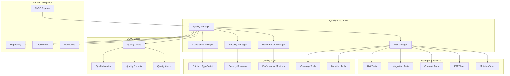

# Quality Assurance

The Quality Assurance component provides comprehensive testing, linting, and compliance verification for the Agent Agency platform, ensuring engineering-grade quality through automated CAWS (Coding Agent Workflow System) standards.

## Overview

The Quality Assurance component serves as the gatekeeper for code quality, performance, and compliance in the Agent Agency platform. It implements CAWS v1.0 standards with automated testing, mutation analysis, contract verification, and continuous quality monitoring to ensure reliable, maintainable, and high-performance agent systems.

## Key Features

### **CAWS Compliance**

- **Engineering Standards**: Full compliance with CAWS v1.0 development practices
- **Automated Gates**: Automated quality gates preventing deployment of non-compliant code
- **Risk Assessment**: Tier-based quality requirements (Tier 1: highest rigor, Tier 3: balanced approach)
- **Provenance Tracking**: Complete audit trail of all changes and quality checks

### **Comprehensive Testing**

- **Unit Testing**: Isolated testing of individual components and functions
- **Integration Testing**: End-to-end testing of component interactions
- **Contract Testing**: API contract verification and consumer/provider testing
- **Mutation Testing**: Code robustness verification through mutation analysis

### **Performance Validation**

- **Load Testing**: Performance testing under various load conditions
- **Benchmarking**: Performance benchmarking against established standards
- **Resource Monitoring**: Monitoring of computational resource usage
- **Scalability Testing**: Verification of system scalability characteristics

### **Security and Compliance**

- **Security Scanning**: Automated security vulnerability detection
- **Dependency Analysis**: Security and license compliance of dependencies
- **Code Quality**: Static analysis and code quality verification
- **Audit Compliance**: Regulatory and organizational compliance verification

## Architecture



## Core Components

### **Quality Manager**

The central coordinator for all quality assurance operations, orchestrating testing, compliance, and gate enforcement.

**Key Responsibilities:**

- **Quality Orchestration**: Coordinates all quality assurance activities
- **Gate Management**: Manages quality gates and approval workflows
- **Reporting**: Generates comprehensive quality reports and metrics
- **Integration**: Integrates with CI/CD pipelines and development workflows

**API Interface:**

```typescript
interface QualityManager {
  // Quality orchestration
  runQualityChecks(project: ProjectConfig): Promise<QualityResult>;
  runQualityGates(changes: CodeChanges, tier: RiskTier): Promise<GateResult>;

  // Gate management
  defineGate(gateConfig: GateConfig): Promise<GateId>;
  updateGate(gateId: GateId, updates: GateUpdate): Promise<void>;
  evaluateGate(gateId: GateId, results: QualityResult): Promise<GateEvaluation>;

  // Reporting
  generateReport(reportConfig: ReportConfig): Promise<QualityReport>;
  getQualityMetrics(timeRange: TimeRange): Promise<QualityMetrics>;
  exportResults(format: ExportFormat): Promise<ExportedResults>;
}
```

### **Test Manager**

Manages all testing activities including unit, integration, contract, and mutation testing.

**Key Responsibilities:**

- **Test Execution**: Executes all types of automated tests
- **Test Orchestration**: Coordinates complex test scenarios and dependencies
- **Coverage Analysis**: Analyzes test coverage and identifies gaps
- **Mutation Testing**: Performs mutation testing for robustness verification

**Core Features:**

- **Parallel Execution**: Parallel test execution for faster feedback
- **Flaky Test Detection**: Detection and quarantine of unreliable tests
- **Test Impact Analysis**: Analysis of which tests are affected by code changes
- **Historical Analysis**: Tracking of test results over time

**API Interface:**

```typescript
interface TestManager {
  // Test execution
  runUnitTests(testConfig: TestConfig): Promise<TestResult>;
  runIntegrationTests(testConfig: TestConfig): Promise<TestResult>;
  runContractTests(testConfig: TestConfig): Promise<TestResult>;
  runMutationTests(testConfig: TestConfig): Promise<MutationResult>;

  // Test management
  discoverTests(pattern: TestPattern): Promise<TestSuite[]>;
  scheduleTests(
    testSuite: TestSuite,
    schedule: TestSchedule
  ): Promise<TestExecution>;
  cancelTests(executionId: TestExecutionId): Promise<void>;

  // Coverage and analysis
  analyzeCoverage(results: TestResult[]): Promise<CoverageAnalysis>;
  detectFlakyTests(
    results: TestResult[],
    threshold: number
  ): Promise<FlakyTest[]>;
  analyzeTestImpact(changes: CodeChanges): Promise<TestImpact>;

  // Mutation testing
  generateMutants(codebase: Codebase): Promise<Mutant[]>;
  runMutationAnalysis(
    mutants: Mutant[],
    tests: TestSuite
  ): Promise<MutationAnalysis>;
}
```

### **Compliance Manager**

Ensures compliance with CAWS standards, coding guidelines, and organizational policies.

**Key Responsibilities:**

- **Standards Enforcement**: Enforces coding standards and best practices
- **CAWS Compliance**: Verifies compliance with CAWS v1.0 requirements
- **Policy Enforcement**: Enforces organizational security and quality policies
- **Audit Preparation**: Prepares for internal and external audits

**Core Features:**

- **Rule Engines**: Configurable rule engines for different compliance requirements
- **Automated Fixes**: Automatic fixing of common compliance violations
- **Documentation**: Generation of compliance documentation and evidence
- **Continuous Monitoring**: Continuous monitoring of compliance status

**API Interface:**

```typescript
interface ComplianceManager {
  // Compliance checking
  checkCompliance(
    codebase: Codebase,
    standards: ComplianceStandard[]
  ): Promise<ComplianceResult>;
  checkCAWSCompliance(
    project: ProjectConfig,
    tier: RiskTier
  ): Promise<CAWSCompliance>;

  // Standards management
  defineStandard(standard: ComplianceStandard): Promise<StandardId>;
  updateStandard(
    standardId: StandardId,
    updates: StandardUpdate
  ): Promise<void>;
  validateStandard(standard: ComplianceStandard): Promise<ValidationResult>;

  // Automated fixes
  suggestFixes(violations: ComplianceViolation[]): Promise<FixSuggestion[]>;
  applyFixes(fixes: FixSuggestion[]): Promise<FixResult>;

  // Documentation
  generateComplianceReport(
    standard: ComplianceStandard
  ): Promise<ComplianceReport>;
  exportComplianceEvidence(format: ExportFormat): Promise<ComplianceEvidence>;
}
```

### **Performance Manager**

Manages performance testing, benchmarking, and optimization verification.

**Key Responsibilities:**

- **Performance Testing**: Executes performance tests and benchmarks
- **Resource Monitoring**: Monitors system resources during testing
- **Bottleneck Analysis**: Identifies performance bottlenecks and issues
- **Optimization Verification**: Verifies performance optimizations

**Core Features:**

- **Load Simulation**: Realistic load simulation and stress testing
- **Performance Profiling**: Detailed performance profiling and analysis
- **Regression Detection**: Detection of performance regressions
- **Capacity Planning**: Performance-based capacity planning

**API Interface:**

```typescript
interface PerformanceManager {
  // Performance testing
  runLoadTest(testConfig: LoadTestConfig): Promise<LoadTestResult>;
  runBenchmark(benchmarkConfig: BenchmarkConfig): Promise<BenchmarkResult>;
  runStressTest(stressConfig: StressTestConfig): Promise<StressTestResult>;

  // Performance analysis
  analyzePerformance(
    results: PerformanceResult[]
  ): Promise<PerformanceAnalysis>;
  identifyBottlenecks(results: PerformanceResult[]): Promise<Bottleneck[]>;
  detectRegressions(
    baseline: PerformanceBaseline,
    current: PerformanceResult
  ): Promise<Regression[]>;

  // Resource monitoring
  monitorResources(testExecution: TestExecution): Promise<ResourceMetrics[]>;
  analyzeResourceUsage(metrics: ResourceMetrics[]): Promise<ResourceAnalysis>;

  // Optimization
  suggestOptimizations(
    analysis: PerformanceAnalysis
  ): Promise<OptimizationSuggestion[]>;
  verifyOptimizations(
    optimizations: Optimization[],
    baseline: PerformanceBaseline
  ): Promise<VerificationResult>;
}
```

### **Security Manager**

Manages security scanning, vulnerability assessment, and security compliance.

**Key Responsibilities:**

- **Security Scanning**: Automated security vulnerability scanning
- **Dependency Analysis**: Analysis of third-party dependencies for security issues
- **Code Security**: Security-focused static analysis of code
- **Compliance Verification**: Verification of security compliance requirements

**Core Features:**

- **Vulnerability Databases**: Integration with vulnerability databases (CVE, etc.)
- **Risk Assessment**: Automated risk assessment and prioritization
- **Remediation Guidance**: Guidance for vulnerability remediation
- **Security Monitoring**: Continuous security monitoring and alerting

**API Interface:**

```typescript
interface SecurityManager {
  // Security scanning
  scanCodebase(codebase: Codebase): Promise<SecurityScanResult>;
  scanDependencies(dependencies: Dependency[]): Promise<DependencyScanResult>;
  scanInfrastructure(
    config: InfrastructureConfig
  ): Promise<InfrastructureScanResult>;

  // Vulnerability management
  assessVulnerabilities(findings: SecurityFinding[]): Promise<RiskAssessment>;
  prioritizeVulnerabilities(
    assessment: RiskAssessment
  ): Promise<PrioritizedVulnerabilities>;

  // Compliance
  checkSecurityCompliance(
    requirements: SecurityRequirement[]
  ): Promise<ComplianceResult>;
  generateSecurityReport(
    scanResult: SecurityScanResult
  ): Promise<SecurityReport>;

  // Remediation
  suggestRemediations(
    findings: SecurityFinding[]
  ): Promise<RemediationSuggestion[]>;
  trackRemediationProgress(
    remediations: Remediation[]
  ): Promise<RemediationProgress>;
}
```

## CAWS Compliance Framework

### **Risk Tier Requirements**

```typescript
interface CAWSTierRequirements {
  tier1: {
    // Core/critical path
    minBranchCoverage: 0.9;
    minMutationScore: 0.7;
    requiresContractTests: true;
    requiresManualReview: true;
    maxFilesPerPR: 40;
    maxLOCPerPR: 1500;
    chaosTests: true;
  };

  tier2: {
    // Common features
    minBranchCoverage: 0.8;
    minMutationScore: 0.5;
    requiresContractTests: true;
    maxFilesPerPR: 25;
    maxLOCPerPR: 1000;
    e2eSmokeRequired: true;
  };

  tier3: {
    // Low risk
    minBranchCoverage: 0.7;
    minMutationScore: 0.3;
    requiresContractTests: false;
    maxFilesPerPR: 15;
    maxLOCPerPR: 600;
    integrationHappyPath: true;
  };
}
```

### **Quality Gates**

- **Naming Gate**: Prevents shadow files and duplicate naming patterns
- **Scope Gate**: Ensures changes are within defined scope boundaries
- **Budget Gate**: Enforces file count and line-of-code limits
- **Static Gate**: Type checking, linting, and dependency policy compliance
- **Unit Gate**: Branch coverage and deterministic test requirements
- **Mutation Gate**: Mutation score requirements by risk tier
- **Contract Gate**: Consumer/provider contract test verification
- **Integration Gate**: Real database/container testing requirements
- **E2E Gate**: Critical path smoke testing and accessibility compliance
- **Performance Gate**: Budget verification for API latency and LCP
- **Provenance Gate**: SBOM generation and attestation validation

## Data Models

### **Quality Results**

```typescript
interface QualityResult {
  projectId: string;
  timestamp: Date;
  tier: RiskTier;
  results: {
    unit: TestResult;
    integration: TestResult;
    contract: ContractResult;
    mutation: MutationResult;
    performance: PerformanceResult;
    security: SecurityResult;
    compliance: ComplianceResult;
  };
  gates: GateResult[];
  overallScore: number;
  recommendations: string[];
}

interface GateResult {
  gateName: string;
  status: "passed" | "failed" | "warning";
  score: number;
  violations: Violation[];
  evidence: Evidence[];
  timestamp: Date;
}
```

### **Test Results**

```typescript
interface TestResult {
  suite: string;
  tests: number;
  passed: number;
  failed: number;
  skipped: number;
  duration: number;
  coverage: CoverageMetrics;
  failures: TestFailure[];
  flaky: TestFlaky[];
}

interface MutationResult {
  mutants: number;
  killed: number;
  survived: number;
  score: number;
  details: MutantDetail[];
}

interface ContractResult {
  consumerTests: number;
  providerTests: number;
  passed: number;
  failed: number;
  compatibility: boolean;
}
```

## Configuration

### **Quality Assurance Configuration**

```typescript
interface QualityConfig {
  // CAWS configuration
  caws: {
    enabled: boolean;
    tier: RiskTier;
    strictMode: boolean;
    provenance: boolean;
  };

  // Testing configuration
  testing: {
    unit: {
      framework: "jest" | "vitest";
      coverage: CoverageConfig;
      timeout: number;
    };
    integration: {
      containers: ContainerConfig[];
      databases: DatabaseConfig[];
      timeout: number;
    };
    contract: {
      pact: PactConfig;
      wiremock: WireMockConfig;
    };
    mutation: {
      tool: "stryker" | "mutmut";
      threshold: number;
      timeout: number;
    };
  };

  // Quality gates
  gates: {
    enabled: boolean;
    failOnWarning: boolean;
    customGates: CustomGate[];
  };

  // Reporting
  reporting: {
    formats: ReportFormat[];
    destinations: ReportDestination[];
    retention: number;
  };

  // CI/CD integration
  ci: {
    provider: "github" | "gitlab" | "jenkins";
    parallelJobs: number;
    cacheStrategy: CacheStrategy;
  };
}
```

## Performance Characteristics

### **Testing Performance**

- **Unit Test Execution**: < 30 seconds for typical test suites
- **Integration Test Execution**: < 5 minutes with containerized dependencies
- **Mutation Test Execution**: < 10 minutes for comprehensive analysis
- **Contract Test Execution**: < 2 minutes for API contract verification

### **Quality Gate Performance**

- **Static Analysis**: < 1 minute for code quality checks
- **Security Scanning**: < 3 minutes for vulnerability assessment
- **Performance Testing**: < 5 minutes for benchmark execution
- **Compliance Checking**: < 2 minutes for standards verification

### **Scalability**

- **Concurrent Testing**: Support for 100+ parallel test executions
- **Large Codebases**: Efficient handling of codebases with 100,000+ lines
- **Distributed Execution**: Support for distributed test execution
- **Resource Optimization**: Optimized resource usage for CI/CD environments

## Monitoring and Observability

### **Metrics**

- **Test Metrics**: Test execution times, pass rates, coverage percentages
- **Quality Metrics**: Gate pass rates, violation counts, compliance scores
- **Performance Metrics**: Benchmark results, resource usage, bottleneck identification
- **Security Metrics**: Vulnerability counts, risk scores, remediation rates

### **Logging**

- **Test Logging**: Detailed test execution logs with failure analysis
- **Gate Logging**: Quality gate evaluation logs with violation details
- **Security Logging**: Security scan results and vulnerability details
- **Performance Logging**: Performance test results and analysis

### **Alerting**

- **Test Failure Alerts**: Alerts for test suite failures and regressions
- **Quality Gate Alerts**: Alerts for gate failures and quality degradation
- **Security Alerts**: Alerts for security vulnerabilities and compliance issues
- **Performance Alerts**: Alerts for performance regressions and bottlenecks

## Development and Testing

### **Development Guidelines**

- **Test-Driven Development**: TDD practices for all new features
- **Quality Gates**: All code must pass quality gates before merging
- **Documentation**: Comprehensive documentation of quality requirements
- **Continuous Improvement**: Regular review and improvement of quality processes

### **Testing Strategy**

- **Self-Testing**: Quality assurance system tests itself
- **Integration Testing**: Full CI/CD pipeline testing
- **Performance Testing**: Quality system performance testing
- **Chaos Testing**: Fault injection and resilience testing

## Future Enhancements

### **Planned Features**

- **AI-Powered Testing**: Machine learning for test case generation and optimization
- **Advanced Analytics**: Predictive analytics for quality and performance trends
- **Automated Remediation**: AI-powered automatic fixing of quality issues
- **Distributed Quality**: Quality assurance across distributed systems

### **Research Areas**

- **Quality Prediction**: ML models for predicting code quality and defect rates
- **Test Optimization**: Advanced algorithms for test suite optimization
- **Continuous Quality**: Real-time quality monitoring and improvement
- **Quality Automation**: Fully automated quality assurance pipelines

---

**Author**: @darianrosebrook  
**Last Updated**: 2024  
**Version**: 1.0.0
