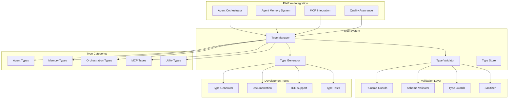

# Type System

The Type System provides comprehensive TypeScript type definitions, validation, and type safety guarantees across the Agent Agency platform, ensuring runtime reliability and development-time correctness for complex agent orchestration scenarios.

## Overview

The Type System serves as the foundation for type safety and correctness in the Agent Agency platform. It provides extensive TypeScript definitions, runtime validation, and type guards that ensure reliable operation of agents, memory systems, and orchestration components through compile-time and runtime type checking.

## Key Features

### **Comprehensive Type Definitions**
- **Agent Types**: Complete type definitions for all agent types and capabilities
- **Memory Types**: Structured types for memory entities, experiences, and graph relationships
- **Orchestration Types**: Types for task routing, coordination, and system management
- **MCP Types**: Protocol-compliant types for Model Context Protocol integration

### **Runtime Type Validation**
- **Schema Validation**: Runtime validation against defined schemas
- **Type Guards**: TypeScript type guards for runtime type checking
- **Data Sanitization**: Automatic data validation and sanitization
- **Error Prevention**: Prevention of type-related runtime errors

### **Type Safety Extensions**
- **Memory Extensions**: Type-safe memory operations and queries
- **Agent Extensions**: Type-safe agent registration and communication
- **Orchestration Extensions**: Type-safe task routing and coordination
- **Integration Extensions**: Type-safe external system integrations

### **Development Tools**
- **Type Generation**: Automatic generation of types from schemas and APIs
- **Type Checking**: Comprehensive TypeScript configuration and checking
- **IDE Support**: Enhanced IDE support with accurate type information
- **Documentation**: Auto-generated documentation from type definitions

## Architecture



## Core Components

### **Type Manager**
The central coordinator for all type system operations, managing type definitions, validation, and generation.

**Key Responsibilities:**
- **Type Registry**: Maintains registry of all type definitions
- **Type Resolution**: Resolves type dependencies and relationships
- **Type Validation**: Coordinates runtime and compile-time type validation
- **Type Evolution**: Manages type versioning and evolution

**API Interface:**
```typescript
interface TypeManager {
  // Type registry
  registerType(typeDefinition: TypeDefinition): Promise<TypeId>;
  unregisterType(typeId: TypeId): Promise<void>;
  getTypeDefinition(typeId: TypeId): Promise<TypeDefinition>;
  
  // Type resolution
  resolveType(typeReference: TypeReference): Promise<ResolvedType>;
  getTypeDependencies(typeId: TypeId): Promise<TypeDependency[]>;
  validateTypeCompatibility(sourceType: TypeId, targetType: TypeId): Promise<TypeCompatibility>;
  
  // Type validation
  validateData(data: any, typeId: TypeId): Promise<ValidationResult>;
  validateDataBatch(data: any[], typeId: TypeId): Promise<ValidationResult[]>;
  
  // Type evolution
  createTypeVersion(typeId: TypeId, changes: TypeChanges): Promise<TypeVersion>;
  migrateData(data: any, fromVersion: TypeVersion, toVersion: TypeVersion): Promise<any>;
}
```

### **Type Validator**
Provides runtime and compile-time type validation capabilities.

**Key Responsibilities:**
- **Runtime Validation**: Validates data at runtime against type definitions
- **Type Guards**: Provides TypeScript type guards for runtime checking
- **Schema Validation**: Validates against JSON schemas and custom validators
- **Error Reporting**: Provides detailed validation error reporting

**Core Features:**
- **Custom Validators**: Extensible validation framework with custom validators
- **Validation Pipelines**: Configurable validation pipelines for different scenarios
- **Error Localization**: Localized error messages and validation feedback
- **Performance Optimization**: Optimized validation for high-throughput scenarios

**API Interface:**
```typescript
interface TypeValidator {
  // Runtime validation
  validate(value: any, typeDefinition: TypeDefinition): ValidationResult;
  validateAsync(value: any, typeDefinition: TypeDefinition): Promise<ValidationResult>;
  
  // Type guards
  isType(value: any, typeId: string): value is any;
  assertType(value: any, typeId: string): asserts value;
  
  // Schema validation
  validateSchema(data: any, schema: JSONSchema): SchemaValidationResult;
  validateSchemaAsync(data: any, schema: JSONSchema): Promise<SchemaValidationResult>;
  
  // Batch validation
  validateBatch(values: any[], typeDefinition: TypeDefinition): ValidationResult[];
  validateBatchAsync(values: any[], typeDefinition: TypeDefinition): Promise<ValidationResult[]>;
}
```

### **Type Generator**
Automatically generates TypeScript types from various sources including schemas, APIs, and data models.

**Key Responsibilities:**
- **Schema Generation**: Generates types from JSON schemas and OpenAPI specifications
- **API Generation**: Generates types from REST and GraphQL API definitions
- **Data Model Generation**: Generates types from database schemas and data models
- **Documentation**: Generates documentation from type definitions

**Core Features:**
- **Multiple Sources**: Support for OpenAPI, GraphQL, JSON Schema, and database schemas
- **Type Optimization**: Optimizes generated types for performance and usability
- **IDE Integration**: Generates types optimized for IDE support
- **Version Management**: Manages type versions and compatibility

**API Interface:**
```typescript
interface TypeGenerator {
  // Schema generation
  generateFromOpenAPI(spec: OpenAPISpec): Promise<TypeDefinition[]>;
  generateFromGraphQL(schema: GraphQLSchema): Promise<TypeDefinition[]>;
  generateFromJSONSchema(schema: JSONSchema): Promise<TypeDefinition>;
  
  // Database generation
  generateFromDatabaseSchema(schema: DatabaseSchema): Promise<TypeDefinition[]>;
  generateFromEntityModel(model: EntityModel): Promise<TypeDefinition>;
  
  // Type optimization
  optimizeTypes(types: TypeDefinition[]): Promise<OptimizedTypes>;
  mergeTypes(types: TypeDefinition[]): Promise<MergedType>;
  
  // Documentation
  generateDocumentation(types: TypeDefinition[]): Promise<TypeDocumentation>;
  exportTypes(types: TypeDefinition[], format: ExportFormat): Promise<ExportedTypes>;
}
```

### **Type Store**
Manages persistent storage and retrieval of type definitions and metadata.

**Key Responsibilities:**
- **Type Persistence**: Stores type definitions and metadata persistently
- **Type Retrieval**: Efficient retrieval of type definitions and dependencies
- **Version Management**: Manages type versions and compatibility
- **Type Search**: Search and discovery of type definitions

**Core Features:**
- **Version Control**: Git-like versioning for type definitions
- **Dependency Tracking**: Tracks dependencies between types
- **Search and Discovery**: Full-text search and type discovery
- **Caching**: High-performance caching of frequently used types

## Type Categories

### **Agent Types**
Comprehensive type definitions for agent lifecycle and capabilities.

```typescript
interface Agent {
  id: string;
  name: string;
  type: AgentType;
  capabilities: AgentCapability[];
  status: AgentStatus;
  metadata: AgentMetadata;
  createdAt: Date;
  updatedAt: Date;
}

interface AgentCapability {
  name: string;
  version: string;
  parameters: Record<string, any>;
  constraints: CapabilityConstraint[];
}

interface AgentRegistration {
  agent: Agent;
  capabilities: AgentCapability[];
  constraints: AgentConstraint[];
  metadata: Record<string, any>;
}
```

### **Memory Types**
Structured types for memory operations and knowledge representation.

```typescript
interface MemoryEntity {
  id: string;
  type: MemoryEntityType;
  content: any;
  embedding?: number[];
  metadata: MemoryMetadata;
  createdAt: Date;
  updatedAt: Date;
}

interface KnowledgeGraph {
  entities: MemoryEntity[];
  relationships: KnowledgeRelationship[];
  metadata: GraphMetadata;
}

interface KnowledgeRelationship {
  id: string;
  sourceEntity: string;
  targetEntity: string;
  type: RelationshipType;
  properties: Record<string, any>;
  confidence: number;
}

interface MemoryQuery {
  type: QueryType;
  filters: QueryFilter[];
  limit?: number;
  includeEmbeddings?: boolean;
}
```

### **Orchestration Types**
Types for task orchestration and system coordination.

```typescript
interface Task {
  id: string;
  type: TaskType;
  agentId?: string;
  status: TaskStatus;
  priority: TaskPriority;
  data: Record<string, any>;
  constraints: TaskConstraint[];
  metadata: TaskMetadata;
  createdAt: Date;
  updatedAt: Date;
}

interface TaskAssignment {
  taskId: string;
  agentId: string;
  assignedAt: Date;
  expectedCompletion: Date;
  priority: TaskPriority;
  constraints: TaskConstraint[];
}

interface OrchestrationEvent {
  id: string;
  type: OrchestrationEventType;
  source: string;
  data: Record<string, any>;
  timestamp: Date;
  correlationId: string;
}
```

### **MCP Types**
Protocol-compliant types for Model Context Protocol integration.

```typescript
interface MCPRequest {
  id: string;
  method: string;
  params: Record<string, any>;
  context?: MCPContext;
  metadata?: RequestMetadata;
}

interface MCPResponse {
  id: string;
  result?: any;
  error?: MCPError;
  metadata?: ResponseMetadata;
}

interface MCPTool {
  name: string;
  description: string;
  inputSchema: JSONSchema;
  outputSchema: JSONSchema;
  metadata: ToolMetadata;
}

interface MCPResource {
  uri: string;
  name: string;
  description: string;
  mimeType: string;
  metadata: ResourceMetadata;
}
```

## Type Validation

### **Runtime Validation**
```typescript
// Type guard example
function isAgent(value: any): value is Agent {
  return (
    typeof value === 'object' &&
    typeof value.id === 'string' &&
    typeof value.name === 'string' &&
    Object.values(AgentType).includes(value.type) &&
    Array.isArray(value.capabilities) &&
    Object.values(AgentStatus).includes(value.status)
  );
}

// Schema validation
const agentSchema: JSONSchema = {
  type: 'object',
  required: ['id', 'name', 'type', 'capabilities', 'status'],
  properties: {
    id: { type: 'string' },
    name: { type: 'string' },
    type: { enum: Object.values(AgentType) },
    capabilities: {
      type: 'array',
      items: { $ref: '#/definitions/capability' }
    },
    status: { enum: Object.values(AgentStatus) }
  },
  definitions: {
    capability: {
      type: 'object',
      required: ['name', 'version'],
      properties: {
        name: { type: 'string' },
        version: { type: 'string' },
        parameters: { type: 'object' }
      }
    }
  }
};
```

### **Custom Validators**
```typescript
interface CustomValidator {
  name: string;
  validate: (value: any, context?: ValidationContext) => ValidationResult;
  sanitize?: (value: any) => any;
}

// Example custom validator
const agentCapabilityValidator: CustomValidator = {
  name: 'agentCapability',
  validate: (value: any) => {
    if (!isAgentCapability(value)) {
      return {
        valid: false,
        errors: [{ message: 'Invalid agent capability structure' }]
      };
    }
    return { valid: true };
  },
  sanitize: (value: any) => ({
    ...value,
    name: value.name?.trim(),
    version: value.version?.trim()
  })
};
```

## Configuration

### **Type System Configuration**
```typescript
interface TypeSystemConfig {
  // Type validation
  validation: {
    enabled: boolean;
    strictMode: boolean;
    customValidators: CustomValidator[];
    errorHandling: ErrorHandlingStrategy;
  };
  
  // Type generation
  generation: {
    sources: TypeSource[];
    outputDirectory: string;
    generateDocumentation: boolean;
    optimizeTypes: boolean;
  };
  
  // Type storage
  storage: {
    backend: 'memory' | 'file' | 'database';
    cacheEnabled: boolean;
    cacheSize: number;
    persistenceEnabled: boolean;
  };
  
  // Runtime configuration
  runtime: {
    typeCheckingEnabled: boolean;
    validationEnabled: boolean;
    performanceMonitoring: boolean;
    debugMode: boolean;
  };
  
  // Development tools
  development: {
    ideSupport: boolean;
    typeChecking: TypeScriptConfig;
    documentation: DocumentationConfig;
    testing: TypeTestConfig;
  };
}
```

## Performance Characteristics

### **Type Validation Performance**
- **Simple Validation**: < 1ms for basic type validation
- **Complex Validation**: < 10ms for nested object validation
- **Schema Validation**: < 50ms for comprehensive schema validation
- **Batch Validation**: Linear scaling with input size

### **Type Generation Performance**
- **Schema Generation**: < 5 seconds for typical API schemas
- **Type Optimization**: < 2 seconds for type optimization
- **Documentation Generation**: < 10 seconds for comprehensive documentation
- **Incremental Updates**: < 1 second for incremental type updates

### **Memory Usage**
- **Type Registry**: Minimal memory footprint (< 10MB for large type systems)
- **Runtime Validation**: Low overhead (< 5% performance impact)
- **Caching**: Efficient caching with configurable memory limits
- **Scalability**: Scales linearly with number of types

## Security and Safety

### **Type Safety**
- **Input Validation**: Comprehensive validation of all inputs
- **Type Sanitization**: Automatic sanitization of type-unsafe data
- **Access Control**: Type-based access control and authorization
- **Error Isolation**: Isolated error handling to prevent type-related crashes

### **Runtime Security**
- **Injection Prevention**: Prevention of type-based injection attacks
- **Data Integrity**: Validation of data integrity and consistency
- **Audit Logging**: Comprehensive logging of type operations
- **Rate Limiting**: Protection against type validation abuse

## Monitoring and Observability

### **Metrics**
- **Validation Metrics**: Validation success rates, error rates, performance
- **Type Metrics**: Type usage, generation statistics, version adoption
- **Performance Metrics**: Validation latency, memory usage, throughput
- **Error Metrics**: Type validation errors, schema violations

### **Logging**
- **Validation Logging**: Detailed validation logs with error context
- **Type Logging**: Type generation, registration, and usage logging
- **Error Logging**: Comprehensive error logging with stack traces
- **Audit Logging**: Security and compliance audit logging

### **Alerting**
- **Validation Alerts**: Alerts for validation failures and anomalies
- **Performance Alerts**: Alerts for performance degradation
- **Security Alerts**: Alerts for type-related security issues
- **System Alerts**: Alerts for type system health and availability

## Development and Testing

### **Development Guidelines**
- **Type-First Development**: Design with types first, implementation second
- **Type Documentation**: Comprehensive documentation of all type definitions
- **Type Testing**: Unit tests for type validation and guards
- **Type Evolution**: Careful management of type changes and migrations

### **Testing Strategy**
- **Type Tests**: Dedicated tests for type validation and guards
- **Integration Tests**: Tests for type system integration with components
- **Performance Tests**: Type system performance and scalability testing
- **Security Tests**: Type system security and vulnerability testing

## Future Enhancements

### **Planned Features**
- **Advanced Type Inference**: ML-powered type inference and generation
- **Dynamic Types**: Runtime type system with dynamic type creation
- **Type Federation**: Federated type systems across distributed components
- **Type Analytics**: Analytics and insights from type usage patterns

### **Research Areas**
- **Dependent Types**: Advanced type systems with dependent types
- **Refinement Types**: Types refined by logical predicates
- **Session Types**: Types for communication protocol specification
- **Type-Driven Development**: Type-driven development methodologies

---

**Author**: @darianrosebrook  
**Last Updated**: 2024  
**Version**: 1.0.0
