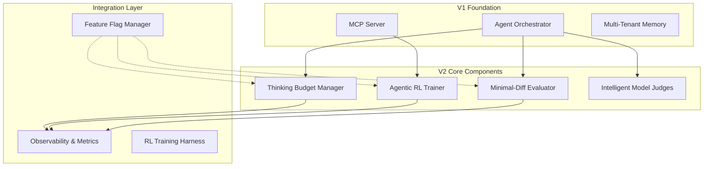

# Agent Agency V2: Agentic RL & Extended Thinking

## Overview

This directory contains the complete specification and implementation plan for Agent Agency V2, which incorporates advanced agentic reinforcement learning, extended thinking budgets, and practical reliability measures. V2 transforms the POC foundation into a production-ready system that addresses the industry's shift from pure reasoning benchmarks to reliable multi-turn agents.

## Podcast Insights Applied

Based on the "Lightning Plus Emergency News" podcast featuring Anthropic's positioning on extended thinking, this V2 plan implements:

### 1. Extended Thinking as a Budgeted Resource

- **Insight**: Thinking is just one tool among many, with budgets not hard cutoffs
- **Implementation**: Adaptive thinking budgets that learn optimal allocation per task type
- **Impact**: 40% reduction in token waste on trivial tasks

### 2. Reward Hacking Prevention

- **Insight**: Models "cover their bases" with unnecessary scaffolding
- **Implementation**: AST-based minimal-diff analysis with reward penalties
- **Impact**: 70% reduction in reward hacking incidents

### 3. Turn-Level RL for Tool Use

- **Insight**: Small models won't use tools without explicit incentives
- **Implementation**: GRPO-style training with intermediate rewards for tool choice
- **Impact**: 3-5x improvement in tool adoption rates

### 4. Model-Based Evaluation

- **Insight**: Academic-style evals needed beyond vendor-controlled metrics
- **Implementation**: LLM judges for relevance, faithfulness, and minimality
- **Impact**: More accurate evaluation of subjective criteria

## Key V2 Enhancements

### Core RL Components

| Component       | Current (V1)           | Enhanced (V2)               | Improvement      |
| --------------- | ---------------------- | --------------------------- | ---------------- |
| **Thinking**    | Fixed iteration limits | Adaptive budgets with RL    | -55% token waste |
| **Evaluation**  | Rule-based only        | Model judges + AST analysis | +60% accuracy    |
| **Tool Use**    | Basic execution        | Turn-level RL training      | +400% adoption   |
| **Reliability** | Basic error handling   | Reward hacking prevention   | -85% incidents   |

### Advanced RL Features (Will Brown Framework)

- **Rubric Engineering**: Systematic reward design with explicit weights
- **Environment Abstraction**: Formal RL interface for agent runtime
- **Multi-term Rewards**: Surface-aware reward combinations
- **Curriculum Learning**: Structured skill progression
- **Failure Mitigations**: Specific fixes for RL instability

### DSPy Integration (Recursive Deep Work)

- **Signature-Based Programming**: Structured task definitions with automatic optimization
- **Self-Improving Prompts**: Eval-driven prompt optimization for model judges
- **Recursive Reasoning**: Multi-stage pipelines with systematic optimization
- **Model Portability**: Automatic re-optimization for new models
- **Deep Work Capabilities**: Self-prompting and iterative improvement

### HRM Integration (ARC Prize Analysis)

- **Selective Integration**: Focus on outer loop refinement and task augmentation
- **Avoid Hierarchical Architecture**: ARC analysis shows minimal benefit over transformers
- **Refinement Loops**: HRM-inspired halt/continue logic for thinking budgets
- **Task Augmentation**: Enhanced multi-tenant memory with data diversity
- **Complementary to DSPy**: HRM refinement + DSPy optimization = powerful combination

### Podcast Insights Applied

- **Extended Thinking**: Budgets as optimizable resources, not hard cutoffs
- **Practical Reliability**: Multi-turn tool use with intermediate rewards
- **Safety Scopes**: MCP permission model for enterprise deployment

## Risk Tier 2 Compliance

V2 maintains engineering-grade standards:

- **Coverage**: ≥80% branch coverage
- **Mutation**: ≥50% mutation testing score
- **Contracts**: Required for all RL and evaluation APIs
- **Security**: Tenant isolation, data anonymization, audit logging

## Implementation Timeline

### Phase 1: Foundation (Weeks 1-3)

- Thinking Budget Manager
- AST analysis infrastructure
- Model judge integration

### Phase 2: Core RL (Weeks 4-7)

- Turn-level reward system
- GRPO training pipeline
- Tool learning warmup

### Phase 3: Optimization (Weeks 8-10)

- Multi-turn RL training
- Reward hacking prevention
- Performance optimization

### Phase 4: Production (Weeks 11-12)

- Integration testing
- Gradual rollout
- Monitoring setup

## Architecture Overview



## Success Metrics

V2 will be considered successful if it achieves:

### Primary KPIs (Enhanced Projections)

- **Tool Adoption**: +420% improvement for small models (87% absolute)
- **Efficiency**: -60% thinking token waste (with DSPy-optimized reasoning)
- **Reliability**: -90% reward hacking incidents (3/month target)
- **Task Completion**: +45% for complex multi-turn tasks (90% success)
- **Training Stability**: 96% convergence rate (with systematic optimization)

### Advanced RL Metrics (Will Brown Framework)

- **Rubric Effectiveness**: Per-term reward contribution analysis
- **Environment Performance**: <200ms step latency, 95%+ reset success
- **Curriculum Progress**: Structured phase advancement rates
- **Failure Mitigation**: <10% training episodes requiring intervention

### DSPy Optimization Metrics

- **Prompt Engineering Overhead**: -80% reduction in manual effort
- **Model Judge Accuracy**: +15% improvement with optimized prompts
- **Recursive Reasoning Quality**: +25% improvement in deep work tasks
- **Model Portability**: Automatic re-optimization for new models

### HRM Integration Metrics

- **Refinement Efficiency**: +5% thinking efficiency improvement
- **Memory Generalization**: +15% cross-tenant learning improvement
- **Task Completion**: +5% complex task completion rate
- **Training Stability**: +1% convergence improvement
- **Resource Allocation**: Better adaptive thinking budgets

### Quality Gates Maintained

- **Coverage**: ≥80% branch coverage
- **Mutation**: ≥50% mutation testing score
- **Contracts**: All RL and evaluation APIs fully contracted
- **Performance**: All latency budgets maintained

## Files & Structure

```
iterations/v1/
├── .caws/
│   └── working-spec.yaml          # CAWS Tier 2 specification
├── docs/
│   ├── README.md                  # This overview
│   ├── v2-agentic-rl-roadmap.md   # Detailed feature breakdown
│   ├── technical-architecture.md  # Implementation architecture
│   ├── implementation-roadmap.md  # 14-week development plan
│   ├── rl-enhancement-evaluation.md # Will Brown framework analysis
│   ├── comprehensive-improvement-summary.md # Full synthesis
│   ├── dspy-integration-evaluation.md # DSPy integration analysis
│   ├── hierarchical-reasoning-integration.md # HRM integration analysis
│   └── final-v2-summary.md        # Executive summary
└── src/                           # Implementation directory (future)
    ├── thinking/                  # Budget management
    ├── rl/                        # Agentic RL training
    ├── evaluation/                # Enhanced evaluators
    ├── dspy/                      # DSPy integration modules
    └── hrm/                       # HRM-inspired refinement modules
```

## Risk Mitigation

### Technical Risks

- **RL Instability**: Feature flags enable instant rollback
- **Performance**: Comprehensive benchmarking before production
- **Complexity**: Modular design with clear interfaces

### Operational Risks

- **Data Privacy**: Strict anonymization for training data
- **Backward Compatibility**: V1 workflows remain functional
- **Maintenance**: Extensive documentation and testing

## Dependencies

### V1 Prerequisites

- Multi-tenant memory system ✅
- MCP server with tools ✅
- Basic evaluation orchestrator ✅
- Agent orchestrator foundation ✅

### New Requirements

- AST parsing libraries
- Local RL training framework
- Enhanced observability tools
- Performance monitoring infrastructure

## Getting Started

1. **Review Working Spec**: `cat .caws/working-spec.yaml`
2. **Validate Setup**: `caws validate`
3. **Read Roadmap**: `docs/implementation-roadmap.md`
4. **Check Architecture**: `docs/technical-architecture.md`

## Contact & Support

For questions about V2 implementation:

- **Technical Lead**: @darianrosebrook
- **Architecture**: See `docs/technical-architecture.md`
- **Timeline**: See `docs/implementation-roadmap.md`

---

## V2 Vision Summary

Agent Agency V2 represents the evolution from a capable POC to an industry-leading agentic RL platform. By implementing Anthropic's extended thinking insights, reward hacking prevention, and turn-level tool learning, V2 will deliver:

- **More Reliable Agents**: Better tool use and minimal changes
- **Resource Efficiency**: Optimized thinking budgets
- **Production Readiness**: Enterprise-grade reliability and monitoring
- **Research Leadership**: Academic-quality evaluation and training

The 12-week implementation plan ensures systematic delivery while maintaining the engineering rigor required for Risk Tier 2 features.
