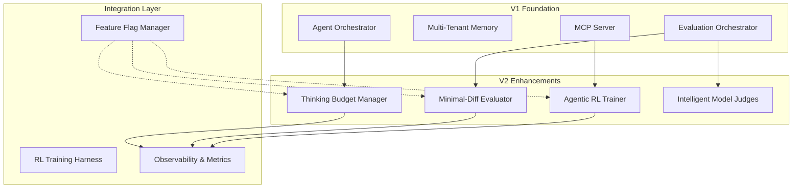

# Agent Agency V2: Technical Architecture

## Agentic RL & Extended Thinking Implementation

---

## System Architecture Overview

V2 builds on V1's foundation with three major enhancement pillars:

1. **Extended Thinking Budget Management** - Optimizes computational resources
2. **Reward Hacking Prevention** - Ensures minimal, targeted changes
3. **Turn-Level RL for Tool Use** - Improves multi-turn conversation quality



---

## 1. Extended Thinking Budget Management

### Component: `ThinkingBudgetManager`

**Purpose**: Dynamically allocate and monitor thinking tokens based on task complexity and progress.

**Key Interfaces**:

```typescript
interface ThinkingBudgetConfig {
  defaultBudgets: {
    trivial: 500;
    standard: 2000;
    complex: 8000;
  };
  escalationRules: BudgetEscalationRule[];
  monitoring: BudgetMonitoringConfig;
}

interface BudgetEscalationRule {
  trigger: "low-confidence" | "partial-success" | "verifier-rejection";
  additionalTokens: number;
  maxTotalBudget: number;
  cooldownPeriod: number;
}

class ThinkingBudgetManager {
  async allocateBudget(
    task: Task,
    context: TaskContext
  ): Promise<ThinkingBudget> {
    const complexity = await this.assessComplexity(task, context);
    const baseBudget = this.config.defaultBudgets[complexity];
    return this.createBudget(task.id, baseBudget);
  }

  async monitorAndEscalate(
    budget: ThinkingBudget,
    currentMetrics: EvaluationMetrics
  ): Promise<BudgetAction> {
    // Check escalation triggers
    // Return ADJUST, MAINTAIN, or EXHAUST
  }
}
```

**Integration Points**:

- **Agent Orchestrator**: Requests budget allocation for new tasks
- **Evaluation Orchestrator**: Reports token consumption and confidence levels
- **Observability**: Logs budget utilization and efficiency metrics

**Data Flow**:

```
Task Submission → Complexity Assessment → Budget Allocation → Evaluation Loop → Token Monitoring → Escalation Check → Completion/Extension
```

---

## 2. Reward Hacking Prevention System

### Component: `MinimalDiffEvaluator`

**Purpose**: AST-based analysis to penalize unnecessary scaffolding and reward truly minimal solutions.

**Architecture**:

```typescript
interface DiffAnalysis {
  astSimilarity: number; // 0-1, higher = more similar structure
  fileChanges: FileChange[];
  lineEfficiency: number; // changed lines / total lines
  scaffoldingScore: number; // 0-1, lower = less unnecessary code
  rewardMultiplier: number; // Final score adjustment
}

interface FileChange {
  path: string;
  changeType: "add" | "modify" | "delete";
  astDiff: ASTDelta;
  lineCount: number;
}

class MinimalDiffEvaluator {
  async analyzeDiff(
    before: CodebaseSnapshot,
    after: CodebaseSnapshot
  ): Promise<DiffAnalysis> {
    const astAnalysis = await this.compareASTs(before.ast, after.ast);
    const fileAnalysis = await this.analyzeFileChanges(
      before.files,
      after.files
    );
    const scaffolding = await this.detectScaffolding(after.code);

    return {
      astSimilarity: astAnalysis.similarity,
      fileChanges: fileAnalysis.changes,
      lineEfficiency: fileAnalysis.efficiency,
      scaffoldingScore: scaffolding.score,
      rewardMultiplier: this.computeRewardMultiplier(
        astAnalysis,
        fileAnalysis,
        scaffolding
      ),
    };
  }
}
```

**AST Analysis Engine**:

- Parse TypeScript/JavaScript with `@typescript-eslint/parser`
- Compute tree-edit distance using `node-diff` or similar
- Identify functional vs cosmetic changes

**Scaffolding Detection**:

- Heuristics for unnecessary abstractions
- Pattern matching for "defensive" code additions
- Statistical analysis of code complexity changes

**Integration**: Extends `CodeEvaluator` with additional criteria.

---

## 3. Turn-Level RL Training System

### Component: `AgenticRLTrainer`

**Purpose**: Train agents using GRPO-style reinforcement learning with turn-level credit assignment.

**Core Algorithm**: Group Relative Policy Optimization (GRPO) adapted for multi-turn conversations.

```typescript
interface TurnLevelTrajectory {
  conversationId: string;
  turns: TurnData[];
  finalOutcome: TaskOutcome;
  totalReward: number;
}

interface TurnData {
  turnNumber: number;
  state: ConversationState;
  action: AgentAction;
  reward: number;
  advantage: number;
  logProb: number;
}

class AgenticRLTrainer {
  async trainOnTrajectories(
    trajectories: TurnLevelTrajectory[]
  ): Promise<ModelUpdate> {
    // Group trajectories by outcome similarity
    const groups = this.groupTrajectories(trajectories);

    // Compute advantages using GRPO
    const advantages = await this.computeGroupAdvantages(groups);

    // Update policy network
    const policyUpdate = await this.updatePolicy(advantages);

    return policyUpdate;
  }

  private async computeTurnRewards(
    trajectory: TurnLevelTrajectory
  ): Promise<TurnData[]> {
    const turns: TurnData[] = [];

    for (const turn of trajectory.turns) {
      const informationGain = await this.judgeInformationGain(turn);
      const formatCorrectness = this.evaluateFormatCorrectness(turn);
      const progressContribution = await this.assessProgressContribution(
        turn,
        trajectory.finalOutcome
      );

      turn.reward =
        informationGain * 0.4 +
        formatCorrectness * 0.3 +
        progressContribution * 0.3;
      turns.push(turn);
    }

    return turns;
  }
}
```

**Training Pipeline**:

1. **Data Collection**: Log all multi-turn conversations with outcome labels
2. **Reward Computation**: Use model-based judges for information utility
3. **Advantage Calculation**: GRPO-style group comparisons
4. **Policy Updates**: Optimize for better tool choice and conversation flow

**Safety Measures**:

- Tenant data anonymization for training
- Gradient clipping to prevent training instability
- Validation on held-out conversation data

---

## 4. Intelligent Evaluation with Model Judges

### Component: `IntelligentEvaluationOrchestrator`

**Purpose**: Combine rule-based and model-based evaluation for comprehensive quality assessment.

**Judge Types**:

```typescript
type JudgeType =
  | "relevance"
  | "faithfulness"
  | "minimality"
  | "safety"
  | "creativity";

interface ModelJudge {
  type: JudgeType;
  model: "gemma:3n" | "local-llm";
  promptTemplate: string;
  responseSchema: JSONSchema;
  weight: number;
  confidenceThreshold: number;
}

class IntelligentEvaluator {
  private judges: Map<JudgeType, ModelJudge> = new Map();

  async evaluateWithJudges(
    artifact: Artifact,
    taskType: TaskType
  ): Promise<EvaluationReport> {
    const ruleBasedScore = await this.runRuleChecks(artifact, taskType);
    const modelJudgments = await this.collectModelJudgments(artifact, taskType);

    return this.combineScores(ruleBasedScore, modelJudgments);
  }

  private async collectModelJudgments(
    artifact: Artifact,
    taskType: TaskType
  ): Promise<ModelJudgment[]> {
    const relevantJudges = this.selectJudgesForTask(taskType);
    const judgments: ModelJudgment[] = [];

    for (const judge of relevantJudges) {
      const judgment = await this.queryModelJudge(judge, artifact);
      judgments.push(judgment);
    }

    return judgments;
  }
}
```

**Judge Selection Logic**:

- **Code Tasks**: faithfulness, minimality, safety
- **Text Tasks**: relevance, creativity, faithfulness
- **Design Tasks**: creativity, relevance, minimality

**Model Integration**: Uses existing MCP server to query local models for judgments.

---

## Data Architecture Extensions

### New Database Tables

```sql
-- Thinking budget tracking
CREATE TABLE thinking_budgets (
  task_id UUID PRIMARY KEY,
  allocated_tokens INTEGER NOT NULL,
  consumed_tokens INTEGER DEFAULT 0,
  efficiency DECIMAL(3,2),
  escalations JSONB,
  created_at TIMESTAMP DEFAULT NOW()
);

-- Turn-level RL training data
CREATE TABLE rl_trajectories (
  conversation_id UUID,
  turn_number INTEGER,
  state JSONB,
  action JSONB,
  reward DECIMAL(5,3),
  advantage DECIMAL(5,3),
  outcome_label VARCHAR(50),
  created_at TIMESTAMP DEFAULT NOW(),
  PRIMARY KEY (conversation_id, turn_number)
);

-- Minimal diff analysis
CREATE TABLE diff_analyses (
  task_id UUID PRIMARY KEY,
  ast_similarity DECIMAL(3,2),
  file_changes JSONB,
  line_efficiency DECIMAL(3,2),
  scaffolding_score DECIMAL(3,2),
  reward_multiplier DECIMAL(3,2)
);
```

### Observability Schema

```typescript
interface RLObservabilityMetrics {
  thinkingBudgetUtilization: Histogram;
  toolChoiceRewards: Counter;
  minimalDiffPenalties: Counter;
  trainingConvergence: Gauge;
  conversationQuality: Histogram;
}
```

---

## Feature Flag System

### Configuration Structure

```typescript
interface V2FeatureFlags {
  extendedThinking: {
    enabled: boolean;
    budgetManagement: boolean;
    adaptiveAllocation: boolean;
  };
  rewardHackingPrevention: {
    enabled: boolean;
    astAnalysis: boolean;
    scaffoldingDetection: boolean;
  };
  agenticRL: {
    enabled: boolean;
    turnLevelRewards: boolean;
    trainingPipeline: boolean;
  };
  intelligentEvaluation: {
    enabled: boolean;
    modelJudges: boolean;
    combinedScoring: boolean;
  };
}
```

**Rollback Strategy**:

- Individual feature flags for each enhancement
- Configuration validation to prevent invalid combinations
- Gradual rollout with A/B testing capabilities

---

## Performance Considerations

### Latency Budgets

- **Thinking Allocation**: <50ms
- **AST Diff Analysis**: <200ms
- **Model Judge Query**: <500ms (local inference)
- **RL Training Update**: <2s (async processing)

### Resource Optimization

- **Memory**: AST caching for repeated analyses
- **CPU**: Async processing for non-critical RL updates
- **Storage**: Compression for trajectory data
- **Network**: Local-only for model judge queries

### Scalability Planning

- Horizontal scaling for RL training workers
- Sharding strategy for trajectory data
- Caching layer for frequent AST analyses

---

## Testing Strategy

### Unit Tests

- Budget allocation algorithms
- AST diff computation
- Reward calculation functions
- Model judge integration

### Integration Tests

- End-to-end RL training pipeline
- Multi-turn conversation flows
- Evaluation orchestrator with all judges

### Performance Tests

- Thinking budget allocation under load
- AST analysis on large codebases
- RL training convergence time

### A/B Testing Framework

- Feature flag-based experimentation
- Metric collection and analysis
- Automated rollback on performance regression

---

## Migration Path from V1

### Phase 1: Infrastructure Setup

1. Deploy new database tables
2. Initialize feature flags (all disabled)
3. Deploy new service components

### Phase 2: Gradual Rollout

1. Enable thinking budget management for 10% of tasks
2. Add minimal-diff evaluation (non-blocking) for 25% of evaluations
3. Enable model judges for subjective criteria

### Phase 3: RL Training

1. Start collecting trajectory data (no training yet)
2. Validate data quality and anonymization
3. Begin supervised warm-up training

### Phase 4: Full Activation

1. Enable turn-level RL for tool use
2. Activate all reward hacking prevention
3. Full V2 feature set operational

**Rollback Points**: Each phase has complete rollback capability via feature flags.

---

## Risk Assessment & Mitigation

### Technical Risks

| Risk                       | Probability | Impact | Mitigation                                   |
| -------------------------- | ----------- | ------ | -------------------------------------------- |
| RL training instability    | Medium      | High   | Feature flags, gradient clipping, validation |
| Thinking budget exhaustion | Low         | Medium | Hard ceilings, monitoring, escalation limits |
| Model judge hallucinations | Medium      | Medium | Confidence thresholds, rule-based fallbacks  |
| AST analysis performance   | Low         | Low    | Caching, async processing, sampling          |

### Operational Risks

| Risk                   | Probability | Impact | Mitigation                                  |
| ---------------------- | ----------- | ------ | ------------------------------------------- |
| Performance regression | Medium      | High   | Comprehensive benchmarking, gradual rollout |
| Increased complexity   | High        | Medium | Extensive documentation, training           |
| Data privacy concerns  | Low         | High   | Strict anonymization, audit logging         |
| Backward compatibility | Low         | High   | Extensive testing, feature flags            |

---

## Success Criteria & Metrics

### Key Performance Indicators

- **Tool Adoption Rate**: Target +300% improvement
- **Thinking Efficiency**: -40% token waste
- **Reward Hacking Reduction**: -70% incidents
- **Task Completion**: +25% for complex tasks

### Observability Metrics

- Thinking token utilization histograms
- Tool choice reward distributions
- Minimal-diff penalty frequencies
- RL training convergence rates

### Quality Gates

- All V1 functionality preserved
- 80%+ test coverage on new features
- Performance budgets maintained
- No security regressions

---

_This technical architecture provides a comprehensive blueprint for implementing agentic RL and extended thinking capabilities while maintaining the reliability and performance characteristics required for production deployment._


