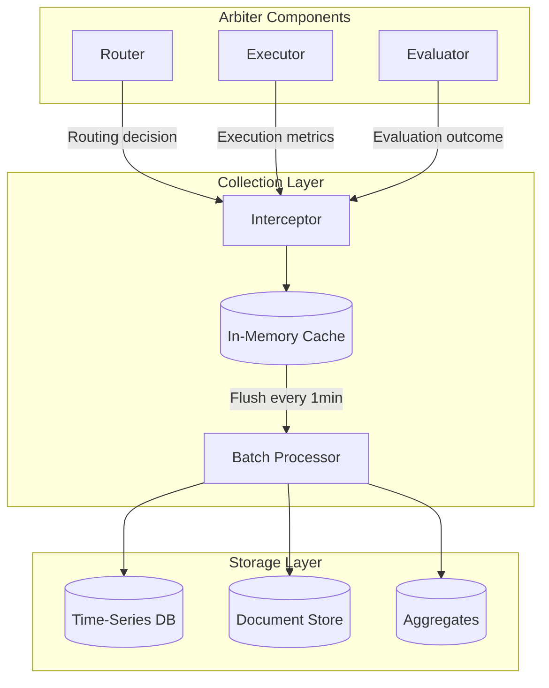

# Data Collection Strategy

**Author**: @darianrosebrook

---

## Executive Summary

The data collection strategy defines **what**, **when**, and **how** to capture performance data from the arbiter orchestrator to build high-quality benchmark datasets for RL training.

**Goal**: Maximize data quality and utility while minimizing collection overhead and privacy risk.

---

## What to Collect

### 1. Every Routing Decision (100% Coverage)

**Rationale**: Learn which routing strategies work best

**Data Points**:

- Task characteristics (type, complexity, requirements)
- Agent selection process (candidates, scores, final choice)
- Routing strategy used (multi-armed bandit, capability match, etc.)
- Confidence level and rationale

**Storage**: Lightweight, ~1KB per decision

**Use**: Improve routing algorithms, train routing models

### 2. Every Task Execution (100% Coverage)

**Rationale**: Measure agent performance and efficiency

**Data Points**:

- Success/failure outcome
- Latency and resource usage
- Tool calls and their effectiveness
- Token consumption breakdown

**Storage**: Medium, ~5KB per execution

**Use**: Agent performance tracking, multi-armed bandit updates, cost optimization

### 3. Every CAWS Evaluation (100% Coverage)

**Rationale**: Core RL training signal

**Data Points**:

- Quality gate results
- Rubric scores (format, tool, task, minimal, cost, safety)
- Minimal-diff metrics
- Turn-level rewards

**Storage**: Heavy, ~10-20KB per evaluation

**Use**: Primary RL training data, reward computation, agent improvement

### 4. Sampled Deep Analysis (10% of Tasks)

**Rationale**: Expensive deep analysis only where valuable

**Data Points**:

- Complete conversation history
- Detailed AST analysis
- Model judge reasoning
- Agent self-reflection

**Storage**: Very heavy, ~100-500KB per sample

**Use**: Qualitative analysis, training data validation, edge case identification

---

## When to Collect

### Real-Time Collection (Synchronous)

**Trigger**: Task execution lifecycle events

**Events**:

1. **Task Received**: Log initial context
2. **Routing Decided**: Log agent selection immediately
3. **Execution Started**: Log start timestamp
4. **Tool Called**: Log each tool invocation
5. **Execution Completed**: Log final metrics
6. **Evaluation Finished**: Log CAWS validation results

**Performance Target**: <50ms total overhead per task

**Implementation**:

```typescript
class RealTimeCollector {
  async onTaskReceived(task: Task): Promise<void> {
    await this.cache.set(`task:${task.id}:received`, {
      timestamp: new Date(),
      task: this.sanitize(task),
    });
  }

  async onRoutingDecided(
    taskId: string,
    decision: RoutingDecision
  ): Promise<void> {
    await this.cache.set(`task:${taskId}:routing`, decision);
  }

  async onExecutionComplete(
    taskId: string,
    metrics: ExecutionMetrics
  ): Promise<void> {
    await this.cache.set(`task:${taskId}:execution`, metrics);
  }

  async onEvaluationComplete(
    taskId: string,
    evaluation: EvaluationMetrics
  ): Promise<void> {
    // Combine all cached data
    const received = await this.cache.get(`task:${taskId}:received`);
    const routing = await this.cache.get(`task:${taskId}:routing`);
    const execution = await this.cache.get(`task:${taskId}:execution`);

    // Create complete data point
    const dataPoint: BenchmarkDataPoint = {
      id: taskId,
      timestamp: received.timestamp,
      task: received.task,
      routing,
      execution,
      evaluation,
      rlLabels: this.computeRLLabels(execution, evaluation),
      provenance: this.gatherProvenance(taskId),
    };

    // Flush to persistent storage
    await this.persistentStore.insert(dataPoint);

    // Clear cache
    await this.cache.deletePattern(`task:${taskId}:*`);
  }
}
```

### Batch Aggregation (Asynchronous)

**Frequency**: Every hour

**Process**:

1. Aggregate recent data points
2. Compute agent statistics
3. Update performance trends
4. Prepare RL training batches

**Performance Target**: Complete in <5 minutes

**Implementation**:

```typescript
class BatchAggregator {
  async runHourlyAggregation(): Promise<void> {
    const lastHour = {
      start: new Date(Date.now() - 3600000),
      end: new Date(),
    };

    // Get data from last hour
    const dataPoints = await this.store.query({
      timeRange: lastHour,
    });

    // Aggregate by agent
    for (const agent of this.uniqueAgents(dataPoints)) {
      const agentData = dataPoints.filter(
        (d) => d.routing.selectedAgent.id === agent
      );

      await this.agentStats.update(agent, {
        totalTasks: agentData.length,
        successRate: this.computeSuccessRate(agentData),
        avgQuality: this.computeAvgQuality(agentData),
        avgLatency: this.computeAvgLatency(agentData),
        timestamp: lastHour.end,
      });
    }

    // Check if enough data for RL export
    if (dataPoints.length >= 1000) {
      await this.prepareRLBatch(dataPoints);
    }
  }
}
```

---

## How to Collect

### Collection Architecture



### Interceptor Pattern

```typescript
/**
 * Non-invasive data collection using interceptors
 *
 * Wraps arbiter components without modifying core logic
 */
class DataCollectionInterceptor {
  wrapRouter(router: TaskRouter): TaskRouter {
    return new Proxy(router, {
      async apply(target, thisArg, args: [Task]) {
        const task = args[0];

        // Call original router
        const decision = await target.apply(thisArg, args);

        // Collect data (non-blocking)
        this.collector
          .logRoutingDecision(task.id, decision)
          .catch((err) => this.logger.warn("Data collection failed", err));

        return decision;
      },
    });
  }

  wrapEvaluator(evaluator: Evaluator): Evaluator {
    return new Proxy(evaluator, {
      async apply(target, thisArg, args: [TaskResult]) {
        const result = args[0];

        // Call original evaluator
        const evaluation = await target.apply(thisArg, args);

        // Collect data (non-blocking)
        this.collector
          .logEvaluation(result.taskId, evaluation)
          .catch((err) => this.logger.warn("Data collection failed", err));

        return evaluation;
      },
    });
  }
}
```

---

## Data Sampling Strategies

### Full Collection (Always)

- Routing decisions
- Success/failure outcomes
- Basic execution metrics
- CAWS compliance results

### Sampled Collection (Configurable)

**Detailed AST Analysis** (10% sample):

```typescript
if (Math.random() < 0.1) {
  const detailedAST = await this.astAnalyzer.deepAnalysis(result);
  dataPoint.detailedAnalysis = detailedAST;
}
```

**Model Judge Reasoning** (20% sample):

```typescript
if (this.shouldCollectJudgeReasoning(task)) {
  const judgeReasoning = await this.modelJudge.explainScore(result);
  dataPoint.judgeExplanation = judgeReasoning;
}
```

**Conversation History** (5% sample for complex tasks):

```typescript
if (task.complexity === "complex" && Math.random() < 0.05) {
  const fullHistory = await this.conversationLogger.getHistory(task.id);
  dataPoint.conversationHistory = fullHistory;
}
```

---

## Data Quality Assurance

### Collection-Time Validation

```typescript
class CollectionValidator {
  async validateBeforeInsert(
    dataPoint: BenchmarkDataPoint
  ): Promise<ValidationResult> {
    const errors: string[] = [];

    // Required fields check
    if (!dataPoint.task || !dataPoint.routing || !dataPoint.execution) {
      errors.push("Missing required sections");
    }

    // Bounds validation
    if (
      dataPoint.evaluation.overallScore < 0 ||
      dataPoint.evaluation.overallScore > 1
    ) {
      errors.push(
        `Invalid overall score: ${dataPoint.evaluation.overallScore}`
      );
    }

    // Privacy check
    if (await this.containsPII(dataPoint)) {
      errors.push("PII detected in data point");
    }

    // Consistency check
    if (
      dataPoint.execution.success &&
      dataPoint.evaluation.overallScore < 0.5
    ) {
      errors.push("Inconsistent: success=true but low quality score");
    }

    return {
      valid: errors.length === 0,
      errors,
      warnings: this.generateWarnings(dataPoint),
    };
  }
}
```

### Post-Collection Cleanup

```typescript
class DataCleaner {
  async cleanBatch(
    dataPoints: BenchmarkDataPoint[]
  ): Promise<BenchmarkDataPoint[]> {
    return dataPoints
      .filter((d) => d.execution.latencyMs > 0) // Remove invalid latencies
      .filter((d) => d.execution.tokensUsed > 0) // Remove zero-token tasks
      .filter((d) => !this.isOutlier(d)) // Remove statistical outliers
      .map((d) => this.normalizeFields(d)); // Normalize formats
  }

  private isOutlier(dataPoint: BenchmarkDataPoint): boolean {
    // Remove extreme outliers (>3 std dev)
    const latencyOutlier =
      dataPoint.execution.latencyMs > this.stats.latencyP99;
    const tokenOutlier = dataPoint.execution.tokensUsed > this.stats.tokensP99;

    return latencyOutlier || tokenOutlier;
  }
}
```

---

## Collection Performance Optimization

### Buffered Writes

```typescript
class BufferedCollector {
  private buffer: BenchmarkDataPoint[] = [];
  private bufferSize = 100;
  private flushInterval = 60000; // 1 minute

  async collect(dataPoint: BenchmarkDataPoint): Promise<void> {
    // Add to buffer
    this.buffer.push(dataPoint);

    // Flush if buffer full
    if (this.buffer.length >= this.bufferSize) {
      await this.flush();
    }
  }

  private async flush(): Promise<void> {
    if (this.buffer.length === 0) return;

    const batch = [...this.buffer];
    this.buffer = [];

    // Batch insert (much faster than individual inserts)
    await this.store.insertBatch(batch);
  }
}
```

### Async Collection

```typescript
// Never block task execution for data collection
async onTaskComplete(task: Task, result: TaskResult): Promise<void> {
  // Return immediately, collect in background
  this.backgroundQueue.enqueue(async () => {
    try {
      await this.collector.collect({
        task,
        result,
        timestamp: new Date()
      });
    } catch (error) {
      this.logger.warn("Data collection failed", error);
      // Don't throw - collection failures shouldn't break tasks
    }
  });
}
```

---

## Data Export for RL Training

### Export Criteria

```typescript
interface ExportCriteria {
  // Volume
  minDataPoints: number; // e.g., 5000
  maxDataPoints: number; // e.g., 50000

  // Quality
  minQualityScore: number; // e.g., 0.7
  requireCAWSCompliant: boolean;

  // Diversity
  taskTypes?: string[]; // Specific types or all
  complexityDistribution?: {
    trivial: number;
    standard: number;
    complex: number;
  };

  // Freshness
  timeRange: { start: Date; end: Date };
  preferRecent: boolean;

  // Privacy
  anonymize: boolean;
  addDifferentialPrivacyNoise: boolean;
}
```

### Export Process

```typescript
class RLBatchExporter {
  async exportBatch(criteria: ExportCriteria): Promise<RLTrainingBatch> {
    // 1. Query matching data
    const candidates = await this.store.query({
      qualityScore: { gte: criteria.minQualityScore },
      cawsCompliant: criteria.requireCAWSCompliant,
      rlExported: false,
      timeRange: criteria.timeRange,
    });

    // 2. Ensure diversity
    const balanced = await this.balanceDataset(candidates, criteria);

    // 3. Validate quality
    const validated = await this.qualityGates.validate(balanced);

    // 4. Anonymize
    const anonymized = await this.anonymizer.anonymize(validated);

    // 5. Create batch
    const batch: RLTrainingBatch = {
      id: this.generateBatchId(),
      dataPoints: anonymized,
      exportedAt: new Date(),
      metadata: {
        totalPoints: anonymized.length,
        qualityStats: this.computeStats(anonymized),
        taskTypeDistribution: this.computeDistribution(anonymized),
      },
    };

    // 6. Mark as exported
    await this.markExported(
      balanced.map((d) => d.id),
      batch.id
    );

    return batch;
  }
}
```

---

## Collection Monitoring

### Key Metrics

```typescript
interface CollectionMetrics {
  // Volume
  dataPointsCollectedToday: number;
  dataPointsPerHour: number;
  totalDataPoints: number;

  // Quality
  validationFailureRate: number; // Target: <5%
  privacyViolations: number; // Target: 0
  duplicateRate: number; // Target: <1%

  // Coverage
  agentsCovered: Set<string>; // Target: all registered
  taskTypesCovered: Set<string>; // Target: ≥5
  complexityDistribution: {
    trivial: number;
    standard: number;
    complex: number;
  };

  // Performance
  avgCollectionLatency: number; // Target: <50ms
  bufferFlushRate: number; // Per minute
  storageGrowthRate: number; // MB per day
}
```

### Alerts

```typescript
const collectionAlerts = [
  {
    name: "low-collection-rate",
    condition: (metrics) => metrics.dataPointsPerHour < 10,
    severity: "warning",
    action: "Check arbiter activity and collection pipeline",
  },
  {
    name: "high-validation-failure",
    condition: (metrics) => metrics.validationFailureRate > 0.1,
    severity: "error",
    action: "Review data schema and validation rules",
  },
  {
    name: "privacy-violation",
    condition: (metrics) => metrics.privacyViolations > 0,
    severity: "critical",
    action: "Halt collection and audit anonymization",
  },
];
```

---

## Data Balancing Strategies

### Prevent Imbalanced Datasets

**Problem**: Easy tasks may dominate dataset

**Solution**: Stratified sampling

```typescript
class DataBalancer {
  async balanceDataset(
    data: BenchmarkDataPoint[],
    targetDistribution: ComplexityDistribution
  ): Promise<BenchmarkDataPoint[]> {
    const byComplexity = {
      trivial: data.filter((d) => d.task.complexity === "trivial"),
      standard: data.filter((d) => d.task.complexity === "standard"),
      complex: data.filter((d) => d.task.complexity === "complex"),
    };

    // Sample from each category
    const balanced = [
      ...this.sample(byComplexity.trivial, targetDistribution.trivial),
      ...this.sample(byComplexity.standard, targetDistribution.standard),
      ...this.sample(byComplexity.complex, targetDistribution.complex),
    ];

    // Shuffle to prevent ordering bias
    return this.shuffle(balanced);
  }

  private sample(array: any[], count: number): any[] {
    if (array.length <= count) return array;

    // Reservoir sampling for unbiased selection
    const result = array.slice(0, count);
    for (let i = count; i < array.length; i++) {
      const j = Math.floor(Math.random() * (i + 1));
      if (j < count) {
        result[j] = array[i];
      }
    }

    return result;
  }
}
```

---

## Failure Handling

### Collection Failures

```typescript
class RobustCollector {
  async collectWithRetry(dataPoint: BenchmarkDataPoint): Promise<void> {
    const maxRetries = 3;
    let attempt = 0;

    while (attempt < maxRetries) {
      try {
        await this.store.insert(dataPoint);
        return;
      } catch (error) {
        attempt++;

        if (attempt >= maxRetries) {
          // Log to dead letter queue for manual review
          await this.deadLetterQueue.add(dataPoint, error);
          this.logger.error("Data collection failed after retries", {
            dataPointId: dataPoint.id,
            error,
          });
          return;
        }

        // Exponential backoff
        await this.sleep(Math.pow(2, attempt) * 1000);
      }
    }
  }
}
```

### Storage Failures

```typescript
// Fallback to local file if database unavailable
class FallbackCollector {
  async collectWithFallback(dataPoint: BenchmarkDataPoint): Promise<void> {
    try {
      await this.primaryStore.insert(dataPoint);
    } catch (error) {
      this.logger.warn("Primary storage failed, using fallback", error);

      // Write to local JSON file
      await this.fallbackFile.append(dataPoint);

      // Schedule for later import
      await this.importQueue.schedule(dataPoint.id);
    }
  }
}
```

---

## Success Criteria

**Collection Coverage**:

- ✅ ≥95% of task executions captured
- ✅ 100% of routing decisions logged
- ✅ ≥90% of evaluations recorded

**Data Quality**:

- ✅ <5% validation failures
- ✅ 0 privacy violations
- ✅ <1% duplicate rate

**Performance**:

- ✅ Collection overhead <50ms per task
- ✅ Storage growth <100MB per day
- ✅ No impact on task execution latency

**RL Readiness**:

- ✅ ≥5,000 quality data points within 30 days
- ✅ Batch export operational
- ✅ Data meets RL training requirements

---

**Systematic data collection transforms every task execution into a learning opportunity—building the foundation for continuous agent improvement.**
