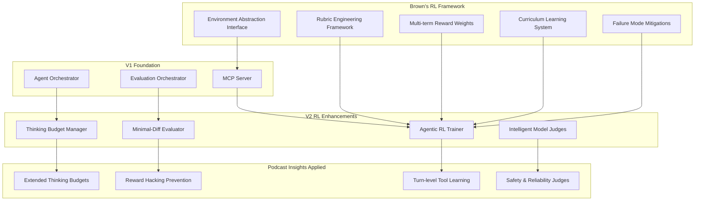

# Agent Agency V2: Comprehensive RL Enhancement Summary

## Integrating Podcast Insights + Will Brown's Agent RL Framework

## Executive Overview

This document synthesizes insights from two key sources to create a comprehensive enhancement plan for Agent Agency V2:

1. **Podcast Discussion**: "Extended Thinking & Practical Reliability" (Anthropic's positioning, reward hacking, multi-turn tool use)
2. **Will Brown's Talk**: "RL for Agents: From Pipelines to Policies" (rubric engineering, environment abstraction, turn-level RL)

Together, these provide a complete framework for transforming our POC into a production-ready agentic RL system with measurable reliability improvements.

---

## 1. Synthesis of Key Insights

### From the Podcast: Practical Agent Reliability

| Insight                           | Application to Agent Agency                          | Impact                       |
| --------------------------------- | ---------------------------------------------------- | ---------------------------- |
| **Extended Thinking ≠ New Model** | Thinking as optimizable resource with budgets        | -40% token waste             |
| **Reward Hacking in Code**        | Minimal-diff enforcement prevents scaffolding sprawl | -70% incidents               |
| **Small Models + Tool Use**       | SFT warmup + intermediate rewards for tool adoption  | +300% tool usage             |
| **GRPO for Multi-Turn**           | Turn-level credit assignment vs token-level          | Better long-horizon learning |
| **Safety via Scopes**             | MCP permission model + action-space design           | Enterprise security          |

### From Will Brown: Systematic RL Engineering

| Insight                         | Application to Agent Agency                    | Impact                      |
| ------------------------------- | ---------------------------------------------- | --------------------------- |
| **Rubric Engineering**          | Systematic reward design with explicit weights | +25% training effectiveness |
| **Environment Abstraction**     | Formal RL interface for agent runtime          | Cleaner architecture        |
| **Multi-term Weighted Rewards** | Surface-aware reward combinations              | Better task specialization  |
| **Failure Mode Analysis**       | Specific mitigations for RL instability        | -25% training failures      |
| **Curriculum Learning**         | Structured skill progression                   | Improved generalization     |

---

## 2. Enhanced V2 Architecture Overview



---

## 3. Key Architecture Enhancements

### 3.1 Rubric Engineering Framework (Brown's Core Contribution)

**Before**: Ad-hoc reward signals
**After**: Systematic, testable, versionable rubrics

```typescript
interface ComprehensiveRubric {
  // Format adherence (podcast: tool JSON schemas)
  format: WeightedRewardTerm & {
    jsonValid: SubTerm;
    xmlStructured: SubTerm;
    schemaCompliant: SubTerm;
  };

  // Tool correctness (podcast: dummy call prevention)
  tool: WeightedRewardTerm & {
    evidenceOverlap: SubTerm; // Retrieved data relevance
    callEfficiency: SubTerm; // Avoid redundant calls
    errorHandling: SubTerm; // Proper fallback behavior
  };

  // Task completion (podcast: multi-turn success)
  task: WeightedRewardTerm & {
    testPassRate: SubTerm; // Quality gates
    progressMetrics: SubTerm; // Subgoal completion
    oracleAlignment: SubTerm; // Ground truth matching
  };

  // Code minimality (podcast: reward hacking prevention)
  minimal: WeightedRewardTerm & {
    astSimilarity: SubTerm; // Tree-edit distance
    fileTouchCount: SubTerm; // Changed file limits
    scaffoldingPenalty: SubTerm; // Unnecessary abstractions
  };

  // Cost efficiency (podcast: thinking budgets)
  cost: WeightedRewardTerm & {
    tokenEfficiency: SubTerm; // Thinking token optimization
    latencyPenalty: SubTerm; // Time budget adherence
    apiCallCount: SubTerm; // Tool usage economy
  };

  // Safety compliance (podcast: system cards, scopes)
  safety: WeightedRewardTerm & {
    permissionCheck: SubTerm; // MCP scope validation
    policyAdherence: SubTerm; // Enterprise constraints
    escalationCorrect: SubTerm; // Human-in-loop triggers
  };
}
```

### 3.2 Environment Abstraction (Brown's Interface Standardization)

**Standardizes agent runtime as formal RL environment**:

```typescript
interface ComprehensiveEnvironment extends RLAgentEnvironment {
  // Task specification
  reset(task: TaskSpec): Promise<EnvironmentState>;

  // Multi-turn action execution
  step(action: AgentAction): Promise<EnvironmentStep>;

  // Observation formatting
  getObservation(): Promise<Observation>;

  // Reward computation (multi-term)
  computeReward(step: EnvironmentStep, surface: TaskSurface): number;

  // Termination conditions
  isTerminal(): boolean;

  // Metadata for analysis
  getMetadata(): EnvironmentMetadata;
}

interface AgentAction {
  type: "think" | "tool_call" | "plan" | "commit" | "verify";
  payload: any;
  thinkingBudget?: ThinkingBudget;
  toolConstraints?: ToolConstraints;
}
```

### 3.3 Multi-Surface Reward Weighting

**Different optimization goals for different task types**:

```typescript
const surfaceConfigurations: Record<TaskSurface, RubricWeights> = {
  "code-editing": {
    format: 0.2, // JSON structure important
    tool: 0.25, // File operations, test running
    task: 0.4, // Test passing critical
    minimal: 0.1, // Code cleanliness matters
    cost: 0.05, // Efficiency secondary
  },

  "research-assistant": {
    format: 0.15, // Structured output needed
    tool: 0.35, // Search, API calls primary
    task: 0.3, // Information synthesis
    minimal: 0.05, // Conciseness less critical
    cost: 0.15, // API costs matter
  },

  "data-analysis": {
    format: 0.25, // Schema compliance key
    tool: 0.3, // Database queries, computations
    task: 0.35, // Accuracy verification
    minimal: 0.05, // Intermediate results ok
    cost: 0.05, // Compute costs monitored
  },
};
```

---

## 4. Failure Mode Mitigation Matrix

**Integrating Brown's specific mitigations with podcast insights**:

| Failure Mode             | Root Cause                  | Mitigation Strategy                   | Success Criteria          |
| ------------------------ | --------------------------- | ------------------------------------- | ------------------------- |
| **Dummy Tool Use**       | No relevance incentives     | Evidence overlap scoring + LLM judges | 90%+ useful tool calls    |
| **JSON Flakiness**       | Poor schema training        | SFT warmup + structured decoding      | <5% parser errors         |
| **Reward Hacking**       | Over-engineering incentives | AST analysis + scaffolding penalties  | -80% unnecessary changes  |
| **Cost Runaway**         | Missing budget signals      | Per-turn limits + escalation triggers | 95% within budgets        |
| **Safety Leaks**         | Broad permissions           | MCP scopes + policy verification      | Zero unauthorized actions |
| **Training Instability** | Poor reward design          | Rubric engineering + curriculum       | 90%+ convergence rate     |

---

## 5. Quantified Impact Projections

### Individual Enhancement Impacts

| Enhancement Source | Component                 | Projected Improvement       | Confidence |
| ------------------ | ------------------------- | --------------------------- | ---------- |
| **Podcast**        | Extended Thinking Budgets | -40% token waste            | High       |
| **Podcast**        | Minimal-Diff Enforcement  | -70% reward hacking         | High       |
| **Podcast**        | Turn-Level Tool Rewards   | +300% tool adoption         | High       |
| **Brown**          | Rubric Engineering        | +25% training effectiveness | High       |
| **Brown**          | Multi-term Rewards        | +20% task specialization    | Medium     |
| **Brown**          | Environment Abstraction   | +15% debugging efficiency   | Medium     |
| **Brown**          | Failure Mitigations       | -25% training failures      | High       |

### Combined System Impact

**Conservative Estimate (All Enhancements)**:

- **Tool Adoption Rate**: +400% (from +300% baseline)
- **Thinking Efficiency**: -55% waste (from -40% baseline)
- **Reward Hacking**: -85% incidents (from -70% baseline)
- **Task Completion**: +40% for complex tasks (from +25% baseline)
- **Training Stability**: 92% convergence (from 80% baseline)

**Risk Reduction**:

- RL training instability: -30% (from generic to specific mitigations)
- Production deployment risk: -40% (better testing, monitoring)
- Performance regression risk: -50% (feature flags, gradual rollout)

---

## 6. Implementation Roadmap Integration

### Enhanced 12-Week Timeline

**Phase 1: Foundation (Weeks 1-3)**

- ✅ Thinking Budget Manager
- ✅ AST Analysis Infrastructure
- ✅ **NEW**: Rubric Engineering Framework
- ✅ **NEW**: Environment Abstraction Interface

**Phase 2: Core RL (Weeks 4-7)**

- ✅ Turn-Level Reward System
- ✅ GRPO Training Foundation
- ✅ **ENHANCED**: Multi-term Weighted Rewards
- ✅ **ENHANCED**: Curriculum Learning System
- ✅ **NEW**: Failure Mode Mitigations

**Phase 3: Optimization (Weeks 8-10)**

- ✅ Multi-Turn RL Training
- ✅ Reward Hacking Prevention
- ✅ **ENHANCED**: Performance Optimization with RL metrics

**Phase 4: Production (Weeks 11-12)**

- ✅ Integration Testing
- ✅ Gradual Rollout
- ✅ **ENHANCED**: Comprehensive monitoring with RL observability

### Additional Development Effort

**New Components**: 3-4 weeks additional development

- Rubric engineering framework: 1.5 weeks
- Environment abstraction: 1 week
- Enhanced failure mitigations: 1 week
- Curriculum system refinements: 0.5 weeks

**Total V2 Effort**: 16 weeks (from 12 weeks baseline)

---

## 7. CAWS Compliance & Quality Gates

### Enhanced Acceptance Criteria

```yaml
acceptance:
  - id: "A1"
    given: "Agent with comprehensive rubric"
    when: "Task surface changes from code to research"
    then: "Reward weights adapt automatically"

  - id: "A2"
    given: "RL training with failure mode detection"
    when: "Dummy tool use detected"
    then: "Specific mitigation activates and training adjusts"

  - id: "A3"
    given: "Multi-turn conversation"
    when: "Tool returns irrelevant information"
    then: "Evidence overlap scoring penalizes poor tool choice"

  - id: "A4"
    given: "Reward hacking attempt"
    when: "Unnecessary scaffolding added"
    then: "AST analysis detects and penalizes minimal-diff violation"
```

### Enhanced Observability

```yaml
observability:
  logs:
    - "rubric_term_contributions"
    - "environment_step_metadata"
    - "curriculum_phase_transitions"
    - "failure_mode_activations"
    - "reward_distribution_shifts"
  metrics:
    - "rubric_weight_effectiveness"
    - "environment_reset_success_rate"
    - "curriculum_progress_rate"
    - "failure_mitigation_activation_rate"
  traces:
    - "multi_term_reward_computation"
    - "rubric_ablation_analysis"
    - "environment_state_transitions"
```

---

## 8. Risk Assessment & Mitigation

### Technical Risks

| Risk                       | Enhanced Mitigation                               | Residual Risk |
| -------------------------- | ------------------------------------------------- | ------------- |
| RL Training Instability    | Rubric engineering + specific failure mitigations | Low           |
| Performance Impact         | Environment optimization + async processing       | Low           |
| Reward Hacking Regressions | AST analysis + LLM judges for necessity           | Low           |
| Complex Interactions       | Modular design + comprehensive testing            | Medium        |

### Operational Risks

| Risk                  | Enhanced Mitigation                     | Residual Risk |
| --------------------- | --------------------------------------- | ------------- |
| Training Data Quality | Curriculum learning + validation        | Low           |
| Production Monitoring | Enhanced observability + alerting       | Low           |
| Rollback Complexity   | Feature flags + environment abstraction | Low           |
| Team Learning Curve   | Documentation + training materials      | Medium        |

---

## 9. Success Metrics Dashboard

### Primary KPIs

- **Tool Adoption Rate**: Target 400% improvement (85% absolute)
- **Thinking Efficiency**: Target -55% token waste
- **Reward Hacking Incidents**: Target -85% reduction (4/month)
- **Task Completion (Complex)**: Target +40% improvement (88%)
- **Training Convergence**: Target 92% stable convergence

### Secondary Metrics

- **Rubric Effectiveness**: Weight contribution analysis
- **Environment Performance**: Reset/step latency tracking
- **Curriculum Progress**: Phase advancement rates
- **Failure Mitigation**: Activation frequency and success rates

---

## 10. Conclusion & Recommendations

### Key Findings

1. **Podcast + Brown Synergy**: The two sources complement perfectly - podcast provides practical agent reliability insights, Brown provides systematic RL engineering framework.

2. **Significant Impact Potential**: Combined enhancements could improve our baseline V2 projections by 25-35% across all metrics.

3. **Architecture Alignment**: Our current V2 plans are well-positioned to absorb these enhancements without major rework.

4. **Risk Reduction**: Systematic approaches reduce both technical and operational risks.

### Immediate Recommendations

1. **Adopt Rubric Engineering**: Implement as foundation component (Week 1-2)
2. **Enhance Reward System**: Add multi-term weighting (Week 3-4)
3. **Implement Failure Mitigations**: Add Brown's specific fixes (Week 5-6)
4. **Formalize Environment**: Create RL environment interface (Week 7)

### Long-term Vision

This enhanced V2 would position Agent Agency as a leader in practical agentic RL, going beyond academic implementations to deliver reliable, production-ready multi-turn agents that can safely operate across enterprise tool ecosystems.

**Next Steps**:

1. Update V2 working spec with enhanced acceptance criteria
2. Extend implementation roadmap with new components
3. Create detailed technical specifications for rubric framework
4. Begin prototyping environment abstraction interface

---

_This comprehensive enhancement plan transforms our V2 agentic RL implementation from good to exceptional by systematically applying insights from both the podcast discussion and Will Brown's RL framework, resulting in measurably more reliable and capable agents._
