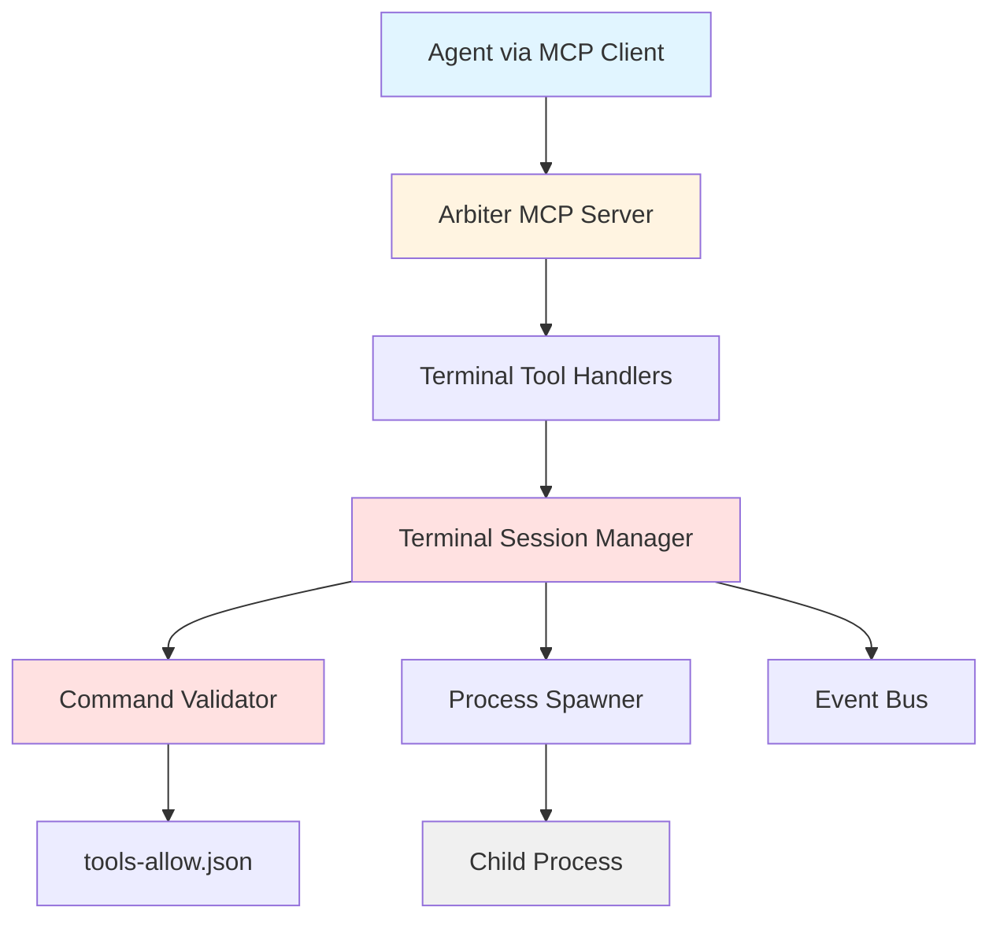

# MCP Terminal Access Layer

**Component ID**: INFRA-005  
**Status**: 📋 Spec Only  
**Risk Tier**: 1 (Critical - Command Execution)

## Overview

Provides secure terminal access for task runner agents via Model Context Protocol (MCP). Enables agents to create isolated terminal sessions, execute allowlisted commands, and manage command lifecycles with comprehensive security controls.

## Quick Links

- **[Working Spec](.caws/working-spec.yaml)** - Full CAWS specification
- **[Status Document](STATUS.md)** - Implementation status and progress
- **[API Contract](../../docs/contracts/mcp-terminal-tools.yaml)** - OpenAPI specification

## Purpose

Enable task runner agents to execute commands (tests, builds, deployments) through a secure, auditable terminal interface integrated with the existing MCP server infrastructure.

### Key Capabilities

- **Session Management**: Create isolated terminal sessions per task
- **Command Execution**: Execute allowlisted commands with timeout enforcement
- **Security Controls**: Command allowlist validation, output size limits
- **Audit Logging**: Comprehensive provenance tracking of all terminal operations
- **Resource Management**: Automatic cleanup and resource limits

## Architecture



## MCP Tools Provided

### 1. `terminal_create_session`

Creates a new isolated terminal session for a task.

**Input**:

```json
{
  "taskId": "TASK-001",
  "agentId": "agent-worker-1",
  "workingDirectory": "/workspace/iterations/v2",
  "environment": {
    "NODE_ENV": "test"
  }
}
```

**Output**:

```json
{
  "success": true,
  "sessionId": "term-TASK-001-1697123456789",
  "workingDirectory": "/workspace/iterations/v2",
  "createdAt": "2025-10-13T12:34:56Z"
}
```

### 2. `terminal_execute_command`

Executes a validated command in an existing session.

**Input**:

```json
{
  "sessionId": "term-TASK-001-1697123456789",
  "command": "npm",
  "args": ["test", "--coverage"],
  "timeout": 120000
}
```

**Output**:

```json
{
  "success": true,
  "exitCode": 0,
  "stdout": "All tests passed\n",
  "stderr": "",
  "duration": 5432
}
```

### 3. `terminal_close_session`

Closes a terminal session and cleans up resources.

**Input**:

```json
{
  "sessionId": "term-TASK-001-1697123456789"
}
```

**Output**:

```json
{
  "success": true,
  "message": "Session closed and resources freed"
}
```

### 4. `terminal_get_status`

Retrieves current status of a terminal session.

**Input**:

```json
{
  "sessionId": "term-TASK-001-1697123456789"
}
```

**Output**:

```json
{
  "success": true,
  "session": {
    "id": "term-TASK-001-1697123456789",
    "taskId": "TASK-001",
    "agentId": "agent-worker-1",
    "state": "idle",
    "workingDirectory": "/workspace/iterations/v2",
    "createdAt": "2025-10-13T12:34:56Z",
    "commandCount": 3
  }
}
```

## Security Model

### Command Allowlist

All commands must be present in `apps/tools/caws/tools-allow.json`:

```json
["node", "npm", "pnpm", "yarn", "git", "docker", "python", "pytest"]
```

**Validation Rules**:

- Command base name must be in allowlist
- No shell escape sequences allowed
- Arguments cannot contain shell metacharacters
- No environment variable injection

### Resource Limits

- **Max Concurrent Sessions**: 50 per orchestrator instance
- **Default Timeout**: 60 seconds
- **Max Timeout**: 300 seconds (5 minutes)
- **Max Output Size**: 1MB (truncated with warning)
- **Session Lifetime**: Tied to task lifecycle

### Audit Logging

Every terminal operation logged with:

- Session ID, task ID, agent ID
- Command executed (sanitized for security)
- Exit code, duration, timestamp
- Security violations (if any)

## Integration Examples

### Task Runner Integration

```typescript
// Task execution with terminal access
async executeTask(task: Task, agent: Agent): Promise<TaskResult> {
  const session = await terminalManager.createSession(
    task.id,
    agent.id,
    { workingDirectory: task.workingDir }
  );

  try {
    // Execute test suite
    const testResult = await terminalManager.executeCommand({
      sessionId: session.id,
      command: 'npm',
      args: ['test', '--coverage'],
      timeout: 120000
    });

    if (!testResult.success) {
      throw new Error(`Tests failed: ${testResult.stderr}`);
    }

    return { success: true, coverage: parsecoverage(testResult.stdout) };
  } finally {
    await terminalManager.closeSession(session.id);
  }
}
```

### Agent Workflow

```typescript
// Agent uses MCP tools to run commands
const createResult = await mcpClient.callTool("terminal_create_session", {
  taskId: "TASK-001",
  agentId: "agent-worker-1",
});

const sessionId = createResult.sessionId;

// Execute npm install
await mcpClient.callTool("terminal_execute_command", {
  sessionId,
  command: "npm",
  args: ["install"],
});

// Run tests
const testResult = await mcpClient.callTool("terminal_execute_command", {
  sessionId,
  command: "npm",
  args: ["test"],
});

// Cleanup
await mcpClient.callTool("terminal_close_session", { sessionId });
```

## Current Status

**Implementation Status**: 📋 Spec Only

**What's Complete**:

- ✅ CAWS working specification (100% validation score)
- ✅ Component status document
- ✅ OpenAPI contract definition
- ✅ Architecture design
- ✅ Security model defined

**What's Pending**:

- ⏳ Core implementation (TerminalSessionManager)
- ⏳ Command validation logic
- ⏳ MCP tool handlers
- ⏳ Unit tests (target: 90% coverage)
- ⏳ Integration tests
- ⏳ Security tests
- ⏳ Documentation

## Next Steps

1. **Security Review** - Approve architecture and security model
2. **Phase 1: Core Implementation** (12 hours)

   - Implement TerminalSessionManager
   - Implement CommandValidator
   - Basic process spawning

3. **Phase 2: MCP Integration** (8 hours)

   - Register tools with MCP server
   - Implement tool handlers
   - Event emission and logging

4. **Phase 3: Testing** (12 hours)

   - Unit tests (90%+ coverage)
   - Integration tests
   - Security tests
   - E2E workflow tests

5. **Phase 4: Documentation** (4 hours)
   - User guide
   - API documentation
   - Operations runbook

## Performance Targets

| Metric                     | Target | P95 Required |
| -------------------------- | ------ | ------------ |
| Session creation latency   | <100ms | Yes          |
| Command execution overhead | <500ms | Yes          |
| Session cleanup time       | <50ms  | Yes          |
| Max concurrent sessions    | 50     | N/A          |

## Testing Requirements

- **Unit Test Coverage**: ≥90%
- **Mutation Score**: ≥75%
- **Security Tests**: Zero violations
- **Soak Test**: 24h at 100 tasks/hour, no memory leaks

## Related Documentation

- [CAWS Working Spec](.caws/working-spec.yaml)
- [Status Document](STATUS.md)
- [MCP Tools Contract](../../docs/contracts/mcp-terminal-tools.yaml)
- [CAWS Agent Guide](../../docs/agents/full-guide.md)
- [MCP Integration README](../../docs/MCP/README.md)

## Contact

**Maintainer**: @darianrosebrook  
**Component Type**: Infrastructure  
**Risk Tier**: 1 (Critical)  
**Estimated Effort**: 3-4 days (32-40 hours)

---

**Note**: This component is in the specification phase. Implementation follows CAWS methodology with comprehensive testing, security review, and documentation requirements before deployment.
