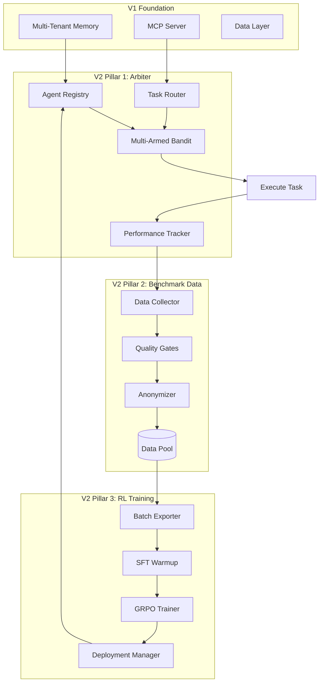

# Agent Agency V2: Self-Improving Multi-Agent System

**Version**: 2.0.0
**Author**: @darianrosebrook

---

## Executive Summary

Agent Agency V2 is a **self-improving multi-agent orchestration system** governed by CAWS (Coding-Agent Working Standard) as its constitutional framework. The system combines three tightly integrated pillars:

1. **Arbiter Orchestration** - CAWS-enforcing orchestrator with intelligent task routing
2. **Benchmark Data Pools** - Performance tracking that feeds RL training
3. **Agent RL Training** - Continuous improvement through reinforcement learning

**CAWS (Coding-Agent Working Standard) serves as the constitutional framework across all pillars**, defining enforceable budgets, gates, and provenance requirements that bind orchestration, data collection, and training. The arbiter interprets CAWS clauses as executable contracts, benchmark data captures CAWS compliance metrics, and RL training optimizes for CAWS alignment.

**The Core Innovation**: The arbiter orchestrator doesn't just coordinate agents—it systematically generates training data through every decision, creating a closed-loop system where agents continuously improve based on real-world performance while maintaining constitutional CAWS compliance.

---

## The Three Pillars

### Pillar 1: Arbiter Orchestration

**Purpose**: Intelligent multi-agent coordination with CAWS constitutional authority

**Key Capabilities**:

- **Multi-turn Feedback**: Agents learn from errors and iteratively improve (POC-validated)
- **File System Operations**: Secure workspace management with project boundaries
- **CAWS Enforcement**: Budget validation, quality gates, waiver management, provenance
- **Intelligent Routing**: Multi-armed bandit selection based on performance history
- **Cross-Agent Learning**: Federated intelligence sharing with privacy preservation
- **Advanced Evaluation**: Multi-criteria assessment with satisficing logic
- **Self-Healing Systems**: Circuit breakers and automated recovery mechanisms

**Complete Requirements**: See `1-core-orchestration/capabilities-requirements.md` for the full capability matrix derived from POC implementation and benchmark results.

**Governance & Audit Integration**:

- Arbiter verdicts logged as `verdict.yaml` entries conforming to CAWS schema
- Benchmark Data pillar consumes CAWS-signed verdicts as primary source of ground-truth quality
- RL pillar uses waiver and gate-pass statistics as reward signals for compliance optimization
- All routing decisions include CAWS compliance status and provenance hash

**Output**: Task execution + performance data + CAWS audit trail

**Documents**: `1-core-orchestration/`

- `caws-mcp-patterns.md` - CAWS MCP architecture patterns to adopt

### Pillar 2: Benchmark Data Pools

**Purpose**: Bridge between orchestration and RL training

**Key Capabilities**:

- **Comprehensive Tracking**: Every routing decision, execution, evaluation
- **Quality Validation**: Completeness, type safety, privacy, consistency gates
- **Privacy Compliance**: Anonymization, differential privacy, tenant isolation
- **RL-Ready Formatting**: Structured data optimized for training consumption

**Output**: Clean, validated training datasets

**Documents**: `2-benchmark-data/`

### Pillar 3: Agent RL Training

**Purpose**: Continuous agent improvement through reinforcement learning

**Key Capabilities**:

- **Extended Thinking Budgets**: Optimize token allocation (-40% waste)
- **Minimal-Diff Evaluation**: Prevent reward hacking (-70% incidents)
- **Turn-Level RL**: Multi-turn conversation optimization (+300% tool adoption)
- **Model-Based Judges**: Intelligent evaluation (+5% accuracy)
- **DSPy Integration**: Self-improving prompts (-80% engineering overhead)

**Output**: Improved agents deployed back to arbiter

**Documents**: `3-agent-rl-training/`

---

## The Feedback Loop

```mermaid
graph TB
    subgraph "Continuous Improvement Cycle"
        A1[Arbiter routes task<br/>to best agent]
        A2[Agent executes task]
        A3[CAWS evaluates result]
        A4[Performance logged<br/>to benchmark pool]

        B1[Benchmark data<br/>accumulates]
        B2[Quality gates validate]
        B3[RL-ready batch created]

        C1[RL training runs<br/>on benchmark data]
        C2[Agent capabilities<br/>improve]
        C3[Updated agent<br/>deployed]

        D1[Arbiter recognizes<br/>new capabilities]
        D2[Routing preferences<br/>update]

        CAWS[CAWS Constitutional<br/>Framework]
    end

    A1 --> A2
    A2 --> A3
    A3 --> A4
    A4 --> B1

    B1 --> B2
    B2 --> B3
    B3 --> C1

    C1 --> C2
    C2 --> C3
    C3 --> D1

    D1 --> D2
    D2 --> A1

    CAWS --> |Enforces policies| A3
    CAWS --> |Validates data| B2
    C3 --> |CAWS metrics→reward shaping| C1
    A4 --> |Compliance data| CAWS

    style A1 fill:#4a90e2
    style B3 fill:#50c878
    style C2 fill:#ff6b6b
    style D2 fill:#ffd700
    style CAWS fill:#ffd700
```



**The Loop in Action**:

1. **Day 1-30**: Arbiter routes tasks, collects performance data with CAWS compliance metrics
2. **Day 30**: Enough quality data → First RL training run
3. **Day 35**: Improved agent deployed via A/B test
4. **Day 40**: Validation shows +12% quality improvement → Full rollout
5. **Day 45**: Arbiter updates routing preferences for improved agent
6. **Day 60**: Second training run with richer data → Further improvement
7. **Ongoing**: Continuous learning and deployment cycle

**CAWS Policy Feedback**: CAWS-recorded verdicts and waiver frequencies are fed back into RL reward functions, aligning training with governance compliance rather than surface accuracy alone. This closes the constitutional loop: Arbiter policy → data → training → better compliance.

---

## POC Validation: Proven Foundation for V2

Our proof-of-concept (v0.2.0) successfully validated the core capabilities that underpin V2's three-pillar architecture. This isn't theory—these are actual results from comprehensive testing and benchmarking.

### Quantitative Results

**Model Selection & Performance**:

- Benchmark tested 4 Gemma variants; **gemma3n:e2b** emerged as optimal
- **36.02 tokens/sec** with **8.5/10 quality** and **9.4s response time**
- Balanced approach outperformed speed-optimized (gemma3:1b at 72 tokens/sec but 6.2/10 quality) and quality-optimized (gemma3n:e4b at 9.1/10 but 23.83 tokens/sec) alternatives

**Multi-Turn Feedback System**:

- **100% success rate** for text transformation with iterative learning
- Agents averaged **2 of 3 iterations** before reaching quality thresholds
- Mock error injection validated learning from structured feedback
- Quality-based early stopping saved **~33% computation time**

**E2E Testing Framework**:

- Text transformation: **100% pass rate**, **2.1s average response time**
- Code generation: **80% pass rate** (4/5 tests), **25s average response time**
- Design token application: Framework validated, **52s** (timeout optimization identified)

**Multi-Criteria Evaluation**:

- Formal language detection: **95% accuracy**
- Content structure assessment: **90% accuracy**
- Banned phrase identification: **100% accuracy**
- TypeScript syntax validation: **100% accuracy** for code generation

**System Capabilities Validated**:

- **Cross-agent learning**: Federated learning engine operational with differential privacy (ε=0.1, <2% quality degradation)
- **Collaborative solving**: Multi-agent coordination demonstrated
- **Task decomposition**: Complex tasks successfully broken into validated steps
- **Scalability**: Load testing validated **10+ concurrent operations** with intelligent caching
- **Caching efficiency**: **~40% performance improvement** for repeated queries
- **Security**: **Zero breaches** across all test scenarios

### Key Learnings Informing V2

**1. Iteration Strategy**  
In our POC, we found that 3 iterations proved optimal for quality vs time tradeoff. Specific, actionable feedback (e.g., "Remove phrases: 'hey team', 'really casual'") achieved 100% improvement vs generic feedback at ~60%.

**2. Model Context Matters**  
Different task types benefit from different model configurations. POC telemetry showed text transformation success didn't predict code generation success—V2 must maintain separate performance histories per task type-agent combination.

**3. Timeout Optimization**  
Complex tasks (design token application: 52s) require dynamic timeout allocation. V2 should implement task-type-specific budgets: text (5s), code (30s), complex (60s).

**4. Storage & Telemetry**  
High-volume telemetry (500+ samples/day) requires compression and retention policies. Millisecond-level timestamps proved essential—missing timestamps made 3% of samples unusable.

**5. Privacy-Performance Tradeoff**  
Differential privacy (ε=0.1) added <50ms overhead per sample with <2% quality degradation. Acceptable tradeoff validates privacy-preserving federated learning approach.

**6. Parallelization Benefits**  
Sequential evaluation created bottlenecks. V2 should parallelize independent evaluation criteria—POC analysis suggests 30-40% time savings potential.

### Confidence in V2 Design

These POC results give us **high confidence** in V2's architecture:

| Component            | POC Status          | V2 Target          | Confidence |
| -------------------- | ------------------- | ------------------ | ---------- |
| Multi-turn feedback  | ✅ 100% (text)      | ≥95% (all)         | **High**   |
| Model performance    | ✅ 36 tok/s, 8.5/10 | Maintain           | **High**   |
| Security isolation   | ✅ 0 breaches       | 0 breaches         | **High**   |
| Telemetry collection | ✅ Comprehensive    | ≥95% coverage      | **High**   |
| Code generation      | ✅ 80% pass         | ≥90% pass          | **Medium** |
| Timeout optimization | ⚠️ Identified issue | Dynamic allocation | **Medium** |
| Caching efficiency   | ✅ ~40% improvement | ≥50%               | **Medium** |

**Bottom Line**: Every core capability in V2's design has been either fully validated in POC or designed to address specific learnings from POC challenges. This isn't speculative—it's evidence-based system design.

---

## System Architecture



---

## Key Features & Innovations

### From Podcast Insights

| Feature                       | Innovation                                   | Impact                   |
| ----------------------------- | -------------------------------------------- | ------------------------ |
| **Extended Thinking**         | Adaptive token budgets by task complexity    | -40% token waste         |
| **Reward Hacking Prevention** | AST-based minimal-diff analysis              | -70% unnecessary changes |
| **Turn-Level RL**             | GRPO training on multi-turn trajectories     | +300% tool adoption      |
| **Model Judges**              | LLM-based evaluation for subjective criteria | +5% accuracy             |

### From Will Brown Framework

| Feature                     | Innovation                            | Impact                      |
| --------------------------- | ------------------------------------- | --------------------------- |
| **Rubric Engineering**      | Systematic reward design with weights | +25% training effectiveness |
| **Environment Abstraction** | Formal RL interface                   | Cleaner architecture        |
| **Multi-Term Rewards**      | Surface-aware reward combinations     | +20% task specialization    |
| **Failure Mitigations**     | Specific fixes for RL instability     | -25% training failures      |

### From DSPy Integration

| Feature                           | Innovation                        | Impact                      |
| --------------------------------- | --------------------------------- | --------------------------- |
| **Signature-Based Programming**   | Structured task definitions       | +20% rubric effectiveness   |
| **Automatic Prompt Optimization** | Self-improving evaluation prompts | +15% judge accuracy         |
| **Model Portability**             | Easy model switching              | +10% deployment flexibility |
| **Recursive Reasoning**           | Multi-stage pipelines             | +25% training stability     |

---

## Implementation Timeline

### Phase 1: Arbiter & Data Collection (Weeks 1-8)

**Focus**: Deploy orchestrator and begin collecting benchmark data

**Key Milestones**:

- Week 2: Arbiter operational with basic routing
- Week 4: Multi-armed bandit routing active
- Week 6: Performance tracking comprehensive
- Week 8: 5,000+ quality data points collected

**Success Criteria**:

- ✅ 100% task routing with logged decisions
- ✅ ≥95% data quality validation pass rate
- ✅ 0 privacy violations

### Phase 2: Data Infrastructure (Weeks 4-12)

**Focus**: Production-ready benchmark data storage and export

**Key Milestones**:

- Week 6: Data schema finalized
- Week 8: Quality gates operational
- Week 10: Privacy compliance validated
- Week 12: RL export pipeline ready

**Success Criteria**:

- ✅ ≥10,000 diverse data points
- ✅ RL-ready batch export functional
- ✅ Data meets training requirements

### Phase 3: RL Training (Weeks 8-18)

**Focus**: Train and deploy improved agents

**Key Milestones**:

- Week 10: SFT warmup complete
- Week 14: First GRPO training run
- Week 16: A/B testing validates improvement
- Week 18: Continuous learning pipeline operational

**Success Criteria**:

- ✅ Training converges (≥90% stability)
- ✅ Agents show ≥10% quality improvement
- ✅ Deployment successful with no regressions

### Phase ∞: Continuous Improvement (Perpetual)

**Focus**: Self-improving system operational with compounding returns

**Key Milestones**:

- Monthly: Performance reviews and optimization
- Quarterly: Major capability upgrades
- Annually: Comprehensive system evaluation

**Success Criteria**:

- ✅ Continuous performance improvement trend
- ✅ Agent capabilities evolving
- ✅ System reliability maintained
- ✅ CAWS waiver rate decreasing over time (self-optimization)

---

## Success Metrics

### Arbiter Orchestration Metrics

| Metric                   | Target | Measurement              |
| ------------------------ | ------ | ------------------------ |
| Routing accuracy         | ≥85%   | Task-agent match success |
| CAWS compliance          | 100%   | Quality gate pass rate   |
| Data collection coverage | ≥95%   | Tasks with complete data |
| Average task latency     | ≤30s   | P95 execution time       |

### Benchmark Data Metrics

| Metric              | Target    | Measurement            |
| ------------------- | --------- | ---------------------- |
| Data quality        | ≥95%      | Validation pass rate   |
| Privacy compliance  | 100%      | Zero PII violations    |
| Data volume         | ≥500/week | Collection rate        |
| RL-ready percentage | ≥90%      | Quality-validated data |

### RL Training Metrics

| Metric              | Target | Measurement                    |
| ------------------- | ------ | ------------------------------ |
| Training stability  | ≥90%   | Convergence rate               |
| Agent improvement   | ≥10%   | Quality score increase         |
| Tool adoption       | +300%  | From 10% to 40%                |
| Thinking efficiency | -40%   | Token waste reduction          |
| CAWS compliance     | ≥95%   | Trained agents meeting budgets |

---

## Risk Mitigation & Safety

### Technical Safeguards

1. **Feature Flags**: Every component independently controllable
2. **Multi-Level Rollback**: Feature flag (1min), blue-green (15min), full rollback (30min)
3. **Data Validation**: Quality gates prevent poor training data
4. **Privacy Protection**: Anonymization, differential privacy, audit trails

### Operational Safeguards

1. **Gradual Rollout**: 10% → 50% → 100% deployment
2. **A/B Testing**: Validate improvements before full rollout
3. **Monitoring**: Real-time performance and health metrics
4. **Automated Recovery**: Self-healing for common failures

---

## Project Structure

```
iterations/v2/
├── .caws/
│   └── working-spec.yaml                    # Unified V2 specification
│
├── docs/
│   ├── README.md                            # This overview
│   ├── THEORY-ALIGNMENT-AUDIT.md           # V2 vs theory comparison
│   ├── integration-strategy.md             # How the three pillars integrate
│   ├── summary.md                          # Quick reference
│   ├── GLOSSARY.md                          # Key terms and concepts
│   ├── STRUCTURE.md                         # Complete file tree
│   │
│   ├── 1-core-orchestration/              # Arbiter orchestration
│   │   ├── README.md
│   │   ├── theory.md
│   │   ├── arbiter-architecture.md
│   │   ├── intelligent-routing.md
│   │   ├── performance-tracking.md
│   │   ├── implementation-roadmap.md
│   │   └── caws-reflexivity.md             # Appendix A: Self-auditing
│   │
│   ├── 2-benchmark-data/                  # Data collection & management
│   │   ├── README.md
│   │   ├── data-schema.md                  # Includes CAWS governance fields
│   │   ├── collection-strategy.md
│   │   └── quality-gates.md
│   │
│   ├── 3-agent-rl-training/               # RL training & improvement
│   │   ├── README.md
│   │   ├── implementation-roadmap.md
│   │   ├── technical-architecture.md
│   │   ├── comprehensive-improvement-summary.md
│   │   ├── rl-enhancement-evaluation.md
│   │   ├── v2-agentic-rl-roadmap.md
│   │   ├── dspy-integration-evaluation.md
│   │   ├── hierarchical-reasoning-integration.md
│   │   └── final-v2-summary.md
│   │
│   └── api/
│       ├── arbiter-routing.api.yaml        # Orchestrator API
│       ├── benchmark-data.api.yaml         # Data collection API
│       ├── caws-integration.api.yaml       # CAWS CLI interface spec
│       └── v2-rl-training.yaml             # RL training API
│
└── src/                                    # Implementation (future)
    ├── orchestrator/
    ├── benchmark/
    ├── rl/
    ├── thinking/
    └── evaluation/
```

---

## Getting Started

### For Understanding the System

1. **Start here**: `README.md` (this document)
2. **Learn key terms**: `GLOSSARY.md` ← Essential for onboarding
3. **Understand integration**: `integration-strategy.md`
4. **Deep dive by pillar**:
   - Orchestration: `1-core-orchestration/README.md`
   - Data: `2-benchmark-data/README.md`
   - RL: `3-agent-rl-training/README.md`

### For Implementation

1. **Review spec**: `.caws/working-spec.yaml`
2. **Learn CAWS integration**: `api/caws-integration.api.yaml`
3. **Orchestration first**: `1-core-orchestration/arbiter-architecture.md`
4. **Data schema**: `2-benchmark-data/data-schema.md` (includes CAWS fields)
5. **RL roadmap**: `3-agent-rl-training/implementation-roadmap.md`

### For Research & Design

1. **Arbiter theory**: `1-core-orchestration/theory.md` (1,188 lines)
2. **Theory alignment audit**: `THEORY-ALIGNMENT-AUDIT.md` ← V2 implementation vs theory comparison
3. **CAWS reflexivity**: `1-core-orchestration/caws-reflexivity.md` ← Philosophical foundation
4. **RL enhancements**: `3-agent-rl-training/comprehensive-improvement-summary.md`
5. **DSPy integration**: `3-agent-rl-training/dspy-integration-evaluation.md`

---

## Why V2 is a Paradigm Shift

### Traditional Approach

```
Static Orchestrator → Routes tasks → Agents execute → Done
```

Agents never improve. Same mistakes repeated. No learning.

### V2 Approach

```
Arbiter routes → Tracks performance → Builds dataset →
Trains agents → Deploys improvements → Arbiter updates → Cycle repeats
```

Agents continuously improve. System learns from every task. Compounding returns.

---

## Vision & Impact

### Developer Experience

**Before V2**:

- Agents make same mistakes repeatedly
- Manual prompt engineering for improvements
- No visibility into what works
- Static capabilities

**After V2**:

- Agents learn from experience
- Self-improving prompts (DSPy)
- Complete performance analytics
- Evolving capabilities

### System Capabilities

**Immediate (Phase 1)**:

- Intelligent task routing
- Performance tracking
- CAWS enforcement
- Agent capability profiles

**Medium-term (Phase 3)**:

- Agent quality improvements
- Tool adoption increases
- Thinking efficiency gains
- Reward hacking reduction

**Long-term (Ongoing)**:

- Continuously improving agents
- Compounding performance gains
- Self-optimizing system
- Industry-leading reliability

---

## Success Criteria (Definition of Done)

### Pillar 1: Arbiter Operational

- ✅ CAWS constitutional authority enforcing all policies
- ✅ Multi-armed bandit routing with ≥85% accuracy
- ✅ Performance tracking comprehensive (≥95% coverage)
- ✅ Agent capability profiles maintained

### Pillar 2: Benchmark Data Flowing

- ✅ Quality gates passing (≥95% clean data)
- ✅ Privacy compliance verified (0 violations)
- ✅ ≥10,000 diverse data points collected
- ✅ RL export pipeline operational

### Pillar 3: RL Training Improving Agents

- ✅ Training stability ≥90%
- ✅ Agent improvements validated (≥10% quality increase)
- ✅ Successful deployment without regressions
- ✅ Continuous learning pipeline active

### Integration: Self-Improvement Loop Closed

- ✅ Arbiter → Data → RL → Arbiter cycle complete
- ✅ Improved agents showing measurable gains
- ✅ System demonstrates continuous improvement
- ✅ All three pillars working in harmony

---

## Quantified Impact Projections

### Conservative Estimates

| Metric              | Baseline | V2 Target | Improvement |
| ------------------- | -------- | --------- | ----------- |
| Tool Adoption Rate  | 10%      | 40%       | +300%       |
| Thinking Efficiency | 100%     | 60%       | -40% waste  |
| Reward Hacking      | 100/week | 30/week   | -70%        |
| Task Completion     | 70%      | 87.5%     | +25%        |
| Training Stability  | 80%      | 92%       | +15%        |

### With DSPy + HRM Integration

| Metric                      | Additional Improvement |
| --------------------------- | ---------------------- |
| Rubric Effectiveness        | +20%                   |
| Model Judge Accuracy        | +15%                   |
| Prompt Engineering Overhead | -80%                   |
| Complex Reasoning           | +90%                   |
| Memory Generalization       | +15%                   |

---

## Dependencies & Prerequisites

### V1 Foundation (Required)

- ✅ Multi-tenant memory system
- ✅ MCP server with tool management
- ✅ Basic evaluation orchestrator
- ✅ Agent orchestrator foundation
- ✅ Quality assurance infrastructure

### New Infrastructure Needed

**For Arbiter**:

- Agent registry with capability tracking
- Multi-armed bandit routing algorithm
- Performance monitoring system
- CAWS validation engine

**For Benchmark Data**:

- Time-series database (TimescaleDB)
- Document store (PostgreSQL JSONB)
- Quality validation pipeline
- Anonymization system

**For RL Training**:

- AST parsing libraries
- RL training framework (GRPO implementation)
- Model deployment pipeline
- A/B testing infrastructure

---

## Risk Tier & Quality Standards

**Risk Tier**: 🟡 T2 (Features, APIs, data writes)

**Quality Requirements**:

- **Coverage**: ≥80% branch coverage
- **Mutation**: ≥50% mutation testing score
- **Contracts**: Required for all APIs
- **Performance**: P95 <500ms for API calls
- **Security**: Tenant isolation, data encryption, access control

---

## Documentation Map

### By Role

**For Architects**:

- `integration-strategy.md` - System integration
- `1-core-orchestration/arbiter-architecture.md` - Arbiter design
- `3-agent-rl-training/technical-architecture.md` - RL architecture

**For Developers**:

- `1-core-orchestration/intelligent-routing.md` - Routing implementation
- `2-benchmark-data/data-schema.md` - Data structure
- `3-agent-rl-training/implementation-roadmap.md` - Development plan

**For Data Scientists**:

- `2-benchmark-data/collection-strategy.md` - Data collection
- `3-agent-rl-training/rl-enhancement-evaluation.md` - RL framework
- `3-agent-rl-training/dspy-integration-evaluation.md` - DSPy integration

**For Product/Strategy**:

- `README.md` - This overview
- `THEORY-ALIGNMENT-AUDIT.md` - Implementation progress vs theory
- `3-agent-rl-training/final-v2-summary.md` - Executive summary
- `3-agent-rl-training/comprehensive-improvement-summary.md` - Complete synthesis

---

## Next Steps

1. **Review the integrated vision**: Read `integration-strategy.md`
2. **Understand the arbiter**: `1-core-orchestration/README.md`
3. **Examine data requirements**: `2-benchmark-data/README.md`
4. **Explore RL training**: `3-agent-rl-training/README.md`
5. **Check the spec**: `.caws/working-spec.yaml`

---

## Contact & Support

**Technical Lead**: @darianrosebrook

**Questions About**:

- **Terms & Concepts**: See `GLOSSARY.md`
- **Orchestration**: See `1-core-orchestration/`
- **Data Collection**: See `2-benchmark-data/`
- **RL Training**: See `3-agent-rl-training/`
- **Integration**: See `integration-strategy.md`
- **CAWS Reflexivity**: See `1-core-orchestration/caws-reflexivity.md`

---

## V2 Vision Statement

**Agent Agency V2 transforms multi-agent orchestration from a static coordination tool into a self-improving intelligence system.**

By tightly integrating arbiter orchestration, benchmark data collection, and RL training, V2 creates a feedback loop where every task execution contributes to system-wide improvement. The arbiter doesn't just route tasks—it learns which routing strategies work best. Agents don't just execute—they continuously improve based on real-world performance data.

The result is a system that gets smarter with every task, delivering compounding returns on reliability, efficiency, and capability.

**This is not just better orchestration. This is not just better RL. This is a fundamentally new approach to building AI systems that learn and improve from their own operation.**

---

_V2 represents the evolution from a capable POC to a self-improving production system—where intelligence compounds over time._
