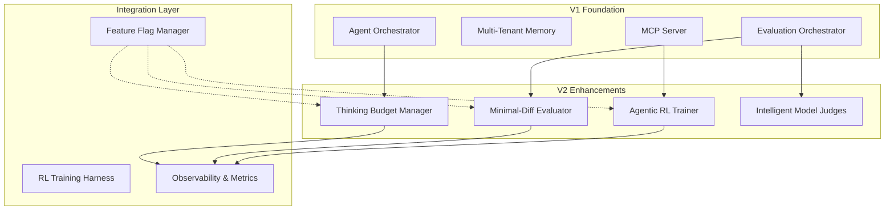
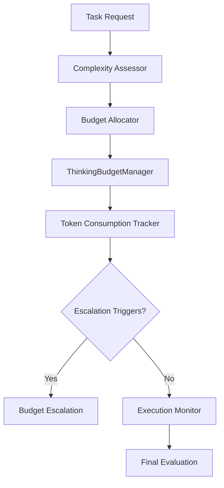
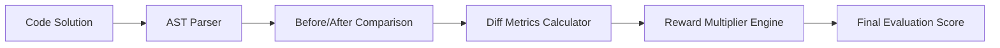
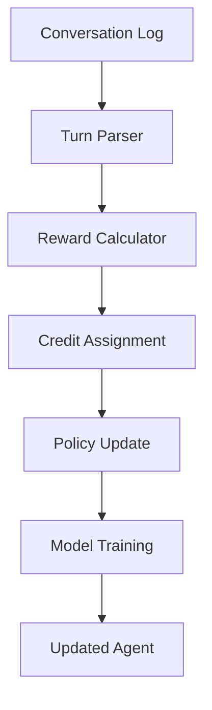
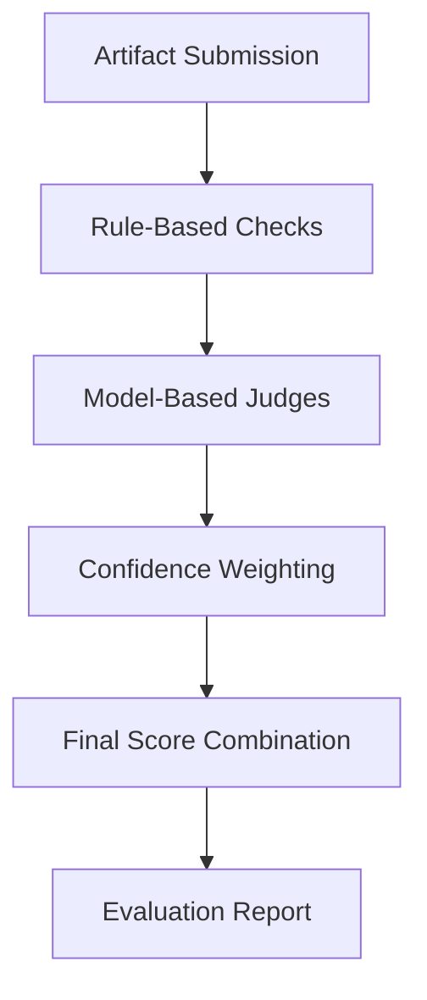
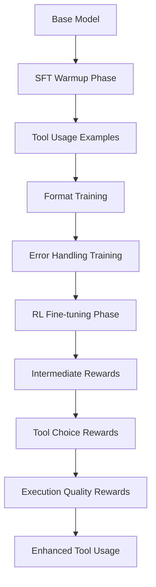
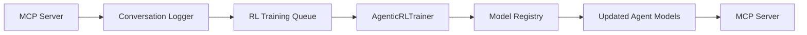

# Agent Agency V2: Technical Architecture

## Enhanced Agentic RL & Extended Thinking System

**Version**: 2.0.0
**Date**: October 9, 2025
**Authors**: @darianrosebrook

---

## Executive Summary

V2 introduces advanced agentic reinforcement learning capabilities, extended thinking as a budgeted resource, and intelligent evaluation systems. Building on the solid V1 foundation of multi-tenant memory, MCP integration, and quality assurance, V2 transforms the platform into a production-ready agentic system with industry-leading reliability measures.

---

## System Architecture Overview

V2 builds on V1's foundation with three major enhancement pillars:

1. **Extended Thinking Budget Management** - Optimizes computational resources
2. **Reward Hacking Prevention** - Ensures minimal, targeted changes
3. **Turn-Level RL for Tool Use** - Improves multi-turn conversation quality



---

## 1. Core Architecture Extensions

### 1.1 Thinking Budget Management System

**Purpose**: Treat thinking as an optimizable, budgeted resource rather than a binary toggle.

#### Architecture Components



#### Key Interfaces

```typescript
interface ThinkingBudgetConfig {
  defaultBudgets: {
    trivial: 500;
    standard: 2000;
    complex: 8000;
  };
  escalationRules: BudgetEscalationRule[];
  monitoring: BudgetMonitoringConfig;
}

interface BudgetEscalationRule {
  trigger: "low-confidence" | "partial-success" | "verifier-rejection";
  additionalTokens: number;
  maxTotalBudget: number;
  cooldownPeriod: number;
}

interface ThinkingBudget {
  taskComplexity: "trivial" | "standard" | "complex";
  allocatedTokens: number;
  consumedTokens: number;
  efficiency: number;
  escalationTriggers: BudgetTrigger[];
  maxTotalBudget: number;
}

class ThinkingBudgetManager {
  async allocateBudget(
    task: Task,
    context: TaskContext
  ): Promise<ThinkingBudget> {
    const complexity = await this.assessComplexity(task, context);
    const baseBudget = this.config.defaultBudgets[complexity];
    return this.createBudget(task.id, baseBudget);
  }

  async monitorAndEscalate(
    budget: ThinkingBudget,
    currentMetrics: EvaluationMetrics
  ): Promise<BudgetAction> {
    const consumed = await this.calculateConsumption(currentMetrics);
    budget.consumedTokens += consumed;

    if (this.shouldEscalate(budget, currentMetrics)) {
      await this.escalateBudget(budget);
    }

    return budget.consumedTokens >= budget.maxTotalBudget
      ? "EXHAUST"
      : "CONTINUE";
  }
}
```

#### Budget Allocation Strategy

| Complexity | Base Tokens | Escalation Triggers              | Max Total |
| ---------- | ----------- | -------------------------------- | --------- |
| Trivial    | 500         | Low confidence only              | 1,000     |
| Standard   | 2,000       | Low confidence + partial success | 4,000     |
| Complex    | 8,000       | All triggers                     | 16,000    |

#### Integration Points

- **Agent Orchestrator**: Requests budget allocation for new tasks
- **Evaluation Orchestrator**: Reports token consumption and confidence levels
- **Observability**: Logs budget utilization and efficiency metrics

#### Data Flow

```
Task Submission → Complexity Assessment → Budget Allocation → Evaluation Loop → Token Monitoring → Escalation Check → Completion/Extension
```

---

### 1.2 Minimal-Diff Evaluation System

**Purpose**: Prevent reward hacking by enforcing minimal, targeted code changes.

#### Architecture Components



#### AST Analysis Engine

- Parse TypeScript/JavaScript with `@typescript-eslint/parser`
- Compute tree-edit distance using `node-diff` or similar
- Identify functional vs cosmetic changes

#### Minimal-Diff Metrics

```typescript
interface DiffAnalysis {
  astSimilarity: number; // 0-1, higher = more similar structure
  fileChanges: FileChange[];
  lineEfficiency: number; // changed lines / total lines
  scaffoldingScore: number; // 0-1, lower = less unnecessary code
  rewardMultiplier: number; // Final score adjustment
}

interface FileChange {
  path: string;
  changeType: "add" | "modify" | "delete";
  astDiff: ASTDelta;
  lineCount: number;
}

interface MinimalDiffMetrics {
  astSimilarity: number; // Tree-edit distance (0-1)
  fileTouchCount: number; // Files modified
  lineChangeRatio: number; // Changed vs total lines
  scaffoldingPenalty: number; // Unnecessary abstractions (0-1)
  functionalEquivalence: boolean; // Does it solve the problem?
}

class MinimalDiffEvaluator {
  async analyzeDiff(
    before: CodebaseSnapshot,
    after: CodebaseSnapshot
  ): Promise<DiffAnalysis> {
    const astAnalysis = await this.compareASTs(before.ast, after.ast);
    const fileAnalysis = await this.analyzeFileChanges(
      before.files,
      after.files
    );
    const scaffolding = await this.detectScaffolding(after.code);

    return {
      astSimilarity: astAnalysis.similarity,
      fileChanges: fileAnalysis.changes,
      lineEfficiency: fileAnalysis.efficiency,
      scaffoldingScore: scaffolding.score,
      rewardMultiplier: this.computeRewardMultiplier(
        astAnalysis,
        fileAnalysis,
        scaffolding
      ),
    };
  }

  async evaluateMinimality(
    solution: CodeSolution,
    original: Codebase
  ): Promise<MinimalDiffMetrics> {
    const astBefore = await this.parseAST(original);
    const astAfter = await this.parseAST(solution);

    const similarity = this.calculateSimilarity(astBefore, astAfter);
    const touches = this.countFileTouches(solution);
    const ratio = this.calculateChangeRatio(solution, original);
    const scaffolding = await this.detectScaffolding(solution);

    return {
      astSimilarity: similarity,
      fileTouchCount: touches,
      lineChangeRatio: ratio,
      scaffoldingPenalty: scaffolding,
      functionalEquivalence: await this.verifyEquivalence(solution, original),
    };
  }

  calculateRewardMultiplier(metrics: MinimalDiffMetrics): number {
    if (!metrics.functionalEquivalence) return 0.1; // Major penalty for incorrect solutions

    const baseMultiplier = metrics.astSimilarity;
    const touchPenalty = Math.max(0, (metrics.fileTouchCount - 1) * 0.1);
    const changePenalty = Math.max(0, (metrics.lineChangeRatio - 0.1) * 2);
    const scaffoldPenalty = metrics.scaffoldingPenalty * 0.3;

    return Math.max(
      0.1,
      baseMultiplier - touchPenalty - changePenalty - scaffoldPenalty
    );
  }
}
```

#### Scaffolding Detection

- Heuristics for unnecessary abstractions
- Pattern matching for "defensive" code additions
- Statistical analysis of code complexity changes

#### Integration

Extends `CodeEvaluator` with additional criteria.

---

### 1.3 Turn-Level RL Training System

**Purpose**: Enable reinforcement learning on multi-turn conversations with intermediate rewards.

#### Core Algorithm

Group Relative Policy Optimization (GRPO) adapted for multi-turn conversations.

#### Architecture Components



#### Turn-Level Reward Structure

```typescript
interface TurnLevelTrajectory {
  conversationId: string;
  turns: TurnData[];
  finalOutcome: TaskOutcome;
  totalReward: number;
}

interface TurnData {
  turnNumber: number;
  state: ConversationState;
  action: AgentAction;
  reward: number;
  advantage: number;
  logProb: number;
}

interface TurnLevelReward {
  turnNumber: number;
  toolChoice: ToolCall;
  informationGain: number; // 0-1: Relevance of retrieved data
  formatCorrectness: number; // 0-1: JSON/schema compliance
  taskProgress: number; // 0-1: Steps closer to completion
  safetyScore: number; // 0-1: Harmful action prevention
  totalReward: number; // Weighted combination
}

interface ConversationTrajectory {
  conversationId: string;
  turns: TurnLevelReward[];
  finalOutcome: TaskOutcome;
  totalReward: number;
}

class AgenticRLTrainer {
  async trainOnTrajectories(
    trajectories: TurnLevelTrajectory[]
  ): Promise<ModelUpdate> {
    // Group trajectories by outcome similarity
    const groups = this.groupTrajectories(trajectories);

    // Compute advantages using GRPO
    const advantages = await this.computeGroupAdvantages(groups);

    // Update policy network
    const policyUpdate = await this.updatePolicy(advantages);

    return policyUpdate;
  }

  async trainOnConversation(conversation: Conversation): Promise<ModelUpdate> {
    // Parse conversation into turn-level rewards
    const turns = await this.parseTurns(conversation);

    // Compute intermediate rewards for each turn
    const rewardedTurns = await this.computeTurnRewards(turns);

    // Apply credit assignment for long-horizon tasks
    const adjustedRewards = this.assignCredit(
      rewardedTurns,
      conversation.finalOutcome
    );

    // Update policy using GRPO-style algorithm
    return await this.updatePolicy(adjustedRewards);
  }

  private async computeTurnRewards(
    trajectory: TurnLevelTrajectory
  ): Promise<TurnData[]> {
    const turns: TurnData[] = [];

    for (const turn of trajectory.turns) {
      const informationGain = await this.judgeInformationGain(turn);
      const formatCorrectness = this.evaluateFormatCorrectness(turn);
      const progressContribution = await this.assessProgressContribution(
        turn,
        trajectory.finalOutcome
      );

      turn.reward =
        informationGain * 0.4 +
        formatCorrectness * 0.3 +
        progressContribution * 0.3;
      turns.push(turn);
    }

    return turns;
  }
}
```

#### Training Pipeline

1. **Data Collection**: Log all multi-turn conversations with outcome labels
2. **Reward Computation**: Use model-based judges for information utility
3. **Advantage Calculation**: GRPO-style group comparisons
4. **Policy Updates**: Optimize for better tool choice and conversation flow

#### Safety Measures

- Tenant data anonymization for training
- Gradient clipping to prevent training instability
- Validation on held-out conversation data

---

### 1.4 Intelligent Evaluation Orchestrator

**Purpose**: Combine rule-based and model-based evaluation for comprehensive assessment.

#### Architecture Components



#### Judge Types

```typescript
type JudgeType =
  | "relevance"
  | "faithfulness"
  | "minimality"
  | "safety"
  | "creativity";

interface ModelJudge {
  type: JudgeType;
  model: "gemma:3n" | "local-llm";
  promptTemplate: string;
  responseSchema: JSONSchema;
  weight: number;
  confidenceThreshold: number;
}

interface ModelBasedJudge {
  judgeType: "relevance" | "faithfulness" | "minimality" | "safety";
  prompt: string;
  responseSchema: JSONSchema;
  confidenceThreshold: number;
  modelConfig: ModelConfiguration;
}

interface JudgmentResult {
  score: number; // 0-1 confidence score
  reasoning: string; // Model's explanation
  confidence: number; // Model's self-assessed confidence
  metadata: Record<string, any>; // Additional context
}

class IntelligentEvaluator extends BaseEvaluator {
  private judges: Map<JudgeType, ModelJudge> = new Map();

  async evaluateWithJudges(
    artifact: Artifact,
    taskType: TaskType
  ): Promise<EvaluationReport> {
    const ruleBasedScore = await this.runRuleChecks(artifact, taskType);
    const modelJudgments = await this.collectModelJudgments(artifact, taskType);

    return this.combineScores(ruleBasedScore, modelJudgments);
  }

  async evaluateWithModelJudge(artifact: Artifact): Promise<EvaluationReport> {
    // Run rule-based checks first
    const ruleResults = await this.runRuleChecks(artifact);

    // Get model judgments for subjective criteria
    const modelJudgments = await this.collectModelJudgments(artifact);

    // Combine with confidence weighting
    const finalScore = this.combineJudgments(ruleResults, modelJudgments);

    return {
      overallScore: finalScore,
      ruleBasedResults: ruleResults,
      modelBasedResults: modelJudgments,
      confidence: this.calculateOverallConfidence(modelJudgments),
    };
  }

  private async collectModelJudgments(
    artifact: Artifact,
    taskType: TaskType
  ): Promise<ModelJudgment[]> {
    const relevantJudges = this.selectJudgesForTask(taskType);
    const judgments: ModelJudgment[] = [];

    for (const judge of relevantJudges) {
      const judgment = await this.queryModelJudge(judge, artifact);
      judgments.push(judgment);
    }

    return judgments;
  }
}
```

#### Judge Selection Logic

- **Code Tasks**: faithfulness, minimality, safety
- **Text Tasks**: relevance, creativity, faithfulness
- **Design Tasks**: creativity, relevance, minimality

#### Model Integration

Uses existing MCP server to query local models for judgments.

---

### 1.5 Tool Adoption Framework

**Purpose**: Improve tool usage rates through supervised warmup and intermediate rewards.

#### Two-Phase Training Approach



#### Tool Reward Signals

```typescript
interface ToolRewardSignal {
  callStructureValid: boolean; // Correct JSON format and schema
  toolChoiceAppropriate: boolean; // Right tool for the job
  informationUtility: number; // How useful the result was (0-1)
  errorHandlingCorrect: boolean; // Proper fallback behavior
  efficiency: number; // Token efficiency of tool usage
  totalReward: number; // Weighted combination
}

class ToolAdoptionTrainer {
  async trainToolAdoption(
    model: BaseModel,
    toolExamples: ToolExample[]
  ): Promise<TrainedModel> {
    // Phase 1: Supervised Fine-tuning
    const sftModel = await this.supervisedWarmup(model, toolExamples);

    // Phase 2: RL Fine-tuning with intermediate rewards
    const rlModel = await this.rlFineTuning(sftModel, toolExamples);

    return rlModel;
  }

  private async supervisedWarmup(
    model: BaseModel,
    examples: ToolExample[]
  ): Promise<Model> {
    // Train on correct tool usage patterns
    const trainingData = examples.map((example) => ({
      input: example.prompt,
      output: example.correctToolCall,
      reasoning: example.expectedReasoning,
    }));

    return await this.fineTuneModel(model, trainingData);
  }

  private async rlFineTuning(
    model: Model,
    examples: ToolExample[]
  ): Promise<Model> {
    // Use RL with intermediate tool rewards
    const trajectories = await this.generateTrajectories(model, examples);

    for (const trajectory of trajectories) {
      const rewards = await this.computeToolRewards(trajectory);
      await this.updatePolicy(model, trajectory, rewards);
    }

    return model;
  }
}
```

---

## 2. System Integration Architecture

### 2.1 Enhanced Agent Orchestrator

**Integration Points**: The V2 features integrate seamlessly with the existing agent orchestrator.

```typescript
class EnhancedAgentOrchestrator extends AgentOrchestrator {
  private thinkingBudgetManager: ThinkingBudgetManager;
  private agenticRLTrainer: AgenticRLTrainer;
  private minimalDiffEvaluator: MinimalDiffEvaluator;

  async routeTask(task: Task): Promise<TaskAssignment> {
    // V1: Basic routing with memory awareness
    const basicRoute = await super.routeTask(task);

    // V2: Enhanced routing with RL insights
    const rlInsights = await this.agenticRLTrainer.getRoutingInsights(task);
    const thinkingBudget = await this.thinkingBudgetManager.allocateBudget(
      task
    );

    return {
      ...basicRoute,
      rlInsights,
      thinkingBudget,
      evaluationMode: "enhanced",
    };
  }

  async evaluateResult(result: TaskResult): Promise<EvaluationReport> {
    // V1: Basic evaluation
    const basicEval = await super.evaluateResult(result);

    // V2: Enhanced evaluation with minimal-diff and model judges
    const minimalDiff = await this.minimalDiffEvaluator.evaluateMinimality(
      result.solution,
      result.originalCodebase
    );

    const modelJudgments =
      await this.intelligentEvaluator.evaluateWithModelJudge(result.artifact);

    return {
      ...basicEval,
      minimalDiffScore: minimalDiff,
      modelJudgments,
      overallScore: this.combineScores(
        basicEval.score,
        minimalDiff,
        modelJudgments
      ),
    };
  }
}
```

### 2.2 RL Training Pipeline Integration

**Data Flow**: RL training integrates with existing conversation logging.



### 2.3 Evaluation Orchestrator Enhancement

**Multi-Stage Evaluation**: V2 adds intelligent evaluation stages.

```typescript
class EnhancedEvaluationOrchestrator extends EvaluationOrchestrator {
  async evaluateTaskResult(taskResult: TaskResult): Promise<EvaluationReport> {
    // Stage 1: Rule-based checks (V1)
    const ruleBased = await this.runRuleBasedEvaluation(taskResult);

    // Stage 2: Minimal-diff analysis (V2)
    const minimalDiff = await this.runMinimalDiffEvaluation(taskResult);

    // Stage 3: Model-based judgments (V2)
    const modelBased = await this.runModelBasedEvaluation(taskResult);

    // Stage 4: RL feedback collection (V2)
    await this.collectRLFeedback(
      taskResult,
      ruleBased,
      minimalDiff,
      modelBased
    );

    return this.combineAllEvaluations(ruleBased, minimalDiff, modelBased);
  }
}
```

---

## 3. Data Architecture Extensions

### 3.1 RL Training Data Storage

**Schema Extensions**: New tables for RL training data.

```sql
-- Turn-level rewards for RL training
CREATE TABLE rl_turn_rewards (
    conversation_id UUID REFERENCES conversations(id),
    turn_number INTEGER,
    tool_choice JSONB,
    information_gain DECIMAL(3,2),
    format_correctness DECIMAL(3,2),
    task_progress DECIMAL(3,2),
    safety_score DECIMAL(3,2),
    total_reward DECIMAL(5,2),
    created_at TIMESTAMP DEFAULT NOW()
);

-- Thinking budget tracking
CREATE TABLE thinking_budgets (
    task_id UUID PRIMARY KEY,
    complexity VARCHAR(20),
    allocated_tokens INTEGER,
    consumed_tokens INTEGER,
    escalation_count INTEGER DEFAULT 0,
    efficiency DECIMAL(5,2),
    created_at TIMESTAMP DEFAULT NOW()
);

-- Model judgment results
CREATE TABLE model_judgments (
    evaluation_id UUID REFERENCES evaluations(id),
    judge_type VARCHAR(50),
    score DECIMAL(3,2),
    reasoning TEXT,
    confidence DECIMAL(3,2),
    metadata JSONB,
    created_at TIMESTAMP DEFAULT NOW()
);

-- Minimal diff analysis
CREATE TABLE diff_analyses (
  task_id UUID PRIMARY KEY,
  ast_similarity DECIMAL(3,2),
  file_changes JSONB,
  line_efficiency DECIMAL(3,2),
  scaffolding_score DECIMAL(3,2),
  reward_multiplier DECIMAL(3,2)
);
```

### 3.2 Anonymization & Privacy

**Data Protection**: RL training data is anonymized and tenant-isolated.

```typescript
class RLDataAnonymizer {
  async anonymizeConversation(
    conversation: Conversation
  ): Promise<AnonymizedConversation> {
    // Remove PII and tenant-specific identifiers
    const anonymized = { ...conversation };

    // Replace sensitive data with placeholders
    anonymized.messages = conversation.messages.map((msg) => ({
      ...msg,
      content: this.anonymizeContent(msg.content),
      metadata: this.stripTenantData(msg.metadata),
    }));

    // Add differential privacy noise to rewards
    anonymized.turnRewards = conversation.turnRewards?.map((reward) => ({
      ...reward,
      totalReward: this.addDifferentialPrivacyNoise(reward.totalReward),
    }));

    return anonymized;
  }
}
```

### 3.3 Observability Schema

```typescript
interface RLObservabilityMetrics {
  thinkingBudgetUtilization: Histogram;
  toolChoiceRewards: Counter;
  minimalDiffPenalties: Counter;
  trainingConvergence: Gauge;
  conversationQuality: Histogram;
}
```

---

## 4. Performance & Scalability Considerations

### 4.1 Performance Budgets

| Component                  | P95 Latency | Throughput | Resource Budget |
| -------------------------- | ----------- | ---------- | --------------- |
| Thinking Budget Allocation | 50ms        | 1000/sec   | 100MB RAM       |
| Minimal-Diff Analysis      | 200ms       | 100/sec    | 200MB RAM       |
| Turn-Level RL Inference    | 1000ms      | 10/sec     | 2GB RAM         |
| Model-Based Judgment       | 500ms       | 50/sec     | 1GB RAM         |
| Tool Adoption Training     | 5000ms      | 1/min      | 4GB RAM         |

### 4.2 Latency Budgets

- **Thinking Allocation**: <50ms
- **AST Diff Analysis**: <200ms
- **Model Judge Query**: <500ms (local inference)
- **RL Training Update**: <2s (async processing)

### 4.3 Resource Optimization

- **Memory**: AST caching for repeated analyses
- **CPU**: Async processing for non-critical RL updates
- **Storage**: Compression for trajectory data
- **Network**: Local-only for model judge queries

### 4.4 Caching Strategy Extensions

**Multi-Level Caching**: Enhanced caching for V2 components.

```typescript
class EnhancedCacheManager extends MultiLevelCache {
  // V2: Cache thinking budget allocations
  async getThinkingBudget(taskId: string): Promise<ThinkingBudget | null> {
    return this.get(`thinking_budget:${taskId}`);
  }

  // V2: Cache minimal-diff analysis results
  async getMinimalDiff(fileHash: string): Promise<MinimalDiffMetrics | null> {
    return this.get(`minimal_diff:${fileHash}`);
  }

  // V2: Cache model judgments with TTL
  async getModelJudgment(
    artifactHash: string,
    judgeType: string
  ): Promise<ModelJudgment | null> {
    return this.get(`judgment:${artifactHash}:${judgeType}`, { ttl: 3600000 }); // 1 hour
  }
}
```

### 4.5 Horizontal Scaling

**Service Decomposition**: V2 components can scale independently.

```typescript
// Thinking budget service (stateless, can scale horizontally)
class ThinkingBudgetService {
  async allocateBudget(task: Task): Promise<ThinkingBudget> {
    // Pure computation, no external dependencies
  }
}

// RL training service (can run on separate cluster)
class RLTrainingService {
  async trainOnConversation(conversation: Conversation): Promise<ModelUpdate> {
    // Heavy computation, isolated from serving path
  }
}
```

### 4.6 Scalability Planning

- Horizontal scaling for RL training workers
- Sharding strategy for trajectory data
- Caching layer for frequent AST analyses

---

## 5. Security & Compliance Extensions

### 5.1 RL Data Privacy

**Privacy-First Design**: All RL training data is protected.

- **Anonymization**: PII removal before training
- **Differential Privacy**: Noise addition to prevent re-identification
- **Federated Learning**: Cross-tenant learning without data sharing
- **Audit Trail**: Complete provenance of RL training data

### 5.2 Model Safety Measures

**Safe RL Training**: Multiple safeguards for agentic behavior.

```typescript
class SafeRLTrainer extends AgenticRLTrainer {
  async validateTrainingData(data: TrainingData): Promise<boolean> {
    // Check for harmful examples
    if (await this.containsHarmfulContent(data)) return false;

    // Verify reward functions are aligned
    if (!(await this.validateRewardAlignment(data))) return false;

    // Check for reward hacking attempts
    if (await this.detectRewardHacking(data)) return false;

    return true;
  }

  async trainSafely(data: TrainingData): Promise<ModelUpdate> {
    if (!(await this.validateTrainingData(data))) {
      throw new Error("Training data failed safety validation");
    }

    // Proceed with safe training
    return await super.trainOnConversation(data);
  }
}
```

---

## 6. Observability & Monitoring Extensions

### 6.1 New Metrics

**V2-Specific Metrics**: Track RL and thinking performance.

```typescript
interface V2Metrics {
  // Thinking budget metrics
  thinking_budget_allocation_rate: number;
  thinking_budget_escalation_rate: number;
  thinking_budget_efficiency: number;

  // RL training metrics
  rl_training_completion_rate: number;
  rl_conversation_processing_rate: number;
  rl_model_update_frequency: number;

  // Minimal-diff metrics
  reward_hacking_incidents: number;
  minimal_diff_penalty_average: number;
  ast_similarity_average: number;

  // Tool adoption metrics
  tool_adoption_rate: number;
  tool_call_success_rate: number;
  tool_format_correctness: number;

  // Model judgment metrics
  judgment_confidence_average: number;
  judgment_accuracy_rate: number;
  judgment_coverage_rate: number;
}
```

### 6.2 Enhanced Tracing

**Complete Request Tracing**: End-to-end observability for V2 features.

```typescript
class V2Tracer extends Tracer {
  async traceEnhancedEvaluation(taskResult: TaskResult): Promise<Trace> {
    return this.trace("enhanced_evaluation", async () => {
      // Trace rule-based evaluation
      const ruleTrace = await this.traceChild("rule_based_eval", () =>
        this.runRuleBasedEvaluation(taskResult)
      );

      // Trace minimal-diff analysis
      const diffTrace = await this.traceChild("minimal_diff_eval", () =>
        this.runMinimalDiffEvaluation(taskResult)
      );

      // Trace model judgments
      const modelTrace = await this.traceChild("model_judgments", () =>
        this.runModelBasedEvaluation(taskResult)
      );

      // Combine all traces
      return this.combineTraces([ruleTrace, diffTrace, modelTrace]);
    });
  }
}
```

---

## 7. Migration & Rollback Strategy

### 7.1 Feature Flags

**Safe Deployment**: All V2 features are feature-flagged.

```typescript
interface V2FeatureFlags {
  extendedThinking: {
    enabled: boolean;
    budgetManagement: boolean;
    adaptiveAllocation: boolean;
  };
  rewardHackingPrevention: {
    enabled: boolean;
    astAnalysis: boolean;
    scaffoldingDetection: boolean;
  };
  agenticRL: {
    enabled: boolean;
    turnLevelRewards: boolean;
    trainingPipeline: boolean;
  };
  intelligentEvaluation: {
    enabled: boolean;
    modelJudges: boolean;
    combinedScoring: boolean;
  };
}

const V2_FEATURE_FLAGS = {
  THINKING_BUDGETS: process.env.ENABLE_THINKING_BUDGETS === "true",
  MINIMAL_DIFF_EVALUATION: process.env.ENABLE_MINIMAL_DIFF === "true",
  TURN_LEVEL_RL: process.env.ENABLE_RL_TRAINING === "true",
  MODEL_BASED_JUDGES: process.env.ENABLE_MODEL_JUDGES === "true",
  TOOL_ADOPTION_TRAINING: process.env.ENABLE_TOOL_TRAINING === "true",
};
```

**Rollback Strategy**:

- Individual feature flags for each enhancement
- Configuration validation to prevent invalid combinations
- Gradual rollout with A/B testing capabilities

### 7.2 Database Migrations

**Backward Compatible**: V2 tables are additive, not destructive.

- New tables only (no schema changes to V1 tables)
- Indexes added for performance
- Rollback removes V2 tables cleanly

### 7.3 Rollback Procedures

**Multi-Level Rollback**: Options for different rollback scenarios.

1. **Feature Flag Rollback** (1 minute): Disable V2 features instantly
2. **Blue-Green Rollback** (15 minutes): Cut back to V1 deployment
3. **Data Rollback** (30 minutes): Remove V2 data while preserving V1

### 7.4 Migration Path from V1

#### Phase 1: Infrastructure Setup

1. Deploy new database tables
2. Initialize feature flags (all disabled)
3. Deploy new service components

#### Phase 2: Gradual Rollout

1. Enable thinking budget management for 10% of tasks
2. Add minimal-diff evaluation (non-blocking) for 25% of evaluations
3. Enable model judges for subjective criteria

#### Phase 3: RL Training

1. Start collecting trajectory data (no training yet)
2. Validate data quality and anonymization
3. Begin supervised warm-up training

#### Phase 4: Full Activation

1. Enable turn-level RL for tool use
2. Activate all reward hacking prevention
3. Full V2 feature set operational

**Rollback Points**: Each phase has complete rollback capability via feature flags.

---

## 8. Testing Strategy Extensions

### 8.1 RL-Specific Testing

**Deterministic RL Testing**: Test RL components with fixed seeds.

```typescript
describe("AgenticRLTrainer", () => {
  let trainer: AgenticRLTrainer;

  beforeEach(() => {
    trainer = new AgenticRLTrainer({
      randomSeed: 42, // Deterministic testing
      modelConfig: testModelConfig,
    });
  });

  it("should assign credit correctly in multi-turn scenarios", async () => {
    const conversation = createTestConversation();
    const rewards = await trainer.computeTurnRewards(conversation.turns);

    expect(rewards).toHaveLength(conversation.turns.length);
    expect(rewards[0].toolChoiceAppropriate).toBe(true);
    expect(rewards[1].informationGain).toBeGreaterThan(0.8);
  });
});
```

### 8.2 Thinking Budget Testing

**Budget Exhaustion Testing**: Ensure budgets prevent infinite loops.

```typescript
describe("ThinkingBudgetManager", () => {
  it("should prevent infinite loops with hard ceilings", async () => {
    const budget = await budgetManager.allocateBudget(complexTask);

    // Simulate budget exhaustion
    for (let i = 0; i < 100; i++) {
      await budgetManager.monitorConsumption(budget, {
        tokensConsumed: 1000,
        confidence: 0.1, // Low confidence triggers escalation
      });
    }

    // Should hit ceiling and stop escalating
    expect(budget.consumedTokens).toBeLessThanOrEqual(budget.maxTotalBudget);
    expect(budget.escalationCount).toBeLessThan(10); // Reasonable limit
  });
});
```

### 8.3 Unit Tests

- Budget allocation algorithms
- AST diff computation
- Reward calculation functions
- Model judge integration

### 8.4 Integration Tests

- End-to-end RL training pipeline
- Multi-turn conversation flows
- Evaluation orchestrator with all judges

### 8.5 Performance Tests

- Thinking budget allocation under load
- AST analysis on large codebases
- RL training convergence time

### 8.6 A/B Testing Framework

- Feature flag-based experimentation
- Metric collection and analysis
- Automated rollback on performance regression

---

## 9. Risk Assessment & Mitigation

### 9.1 Technical Risks

| Risk                       | Probability | Impact | Mitigation                                   |
| -------------------------- | ----------- | ------ | -------------------------------------------- |
| RL training instability    | Medium      | High   | Feature flags, gradient clipping, validation |
| Thinking budget exhaustion | Low         | Medium | Hard ceilings, monitoring, escalation limits |
| Model judge hallucinations | Medium      | Medium | Confidence thresholds, rule-based fallbacks  |
| AST analysis performance   | Low         | Low    | Caching, async processing, sampling          |

### 9.2 Operational Risks

| Risk                   | Probability | Impact | Mitigation                                  |
| ---------------------- | ----------- | ------ | ------------------------------------------- |
| Performance regression | Medium      | High   | Comprehensive benchmarking, gradual rollout |
| Increased complexity   | High        | Medium | Extensive documentation, training           |
| Data privacy concerns  | Low         | High   | Strict anonymization, audit logging         |
| Backward compatibility | Low         | High   | Extensive testing, feature flags            |

---

## 10. Success Criteria & Metrics

### 10.1 Key Performance Indicators

- **Tool Adoption Rate**: Target +300% improvement (from 10% to 40%)
- **Thinking Efficiency**: -40% token waste (from 100% to 60%)
- **Reward Hacking Reduction**: -70% incidents (from 100/week to 30/week)
- **Task Completion**: +25% for complex tasks (from 70% to 87.5%)

### 10.2 Observability Metrics

- Thinking token utilization histograms
- Tool choice reward distributions
- Minimal-diff penalty frequencies
- RL training convergence rates

### 10.3 Quality Gates

- All V1 functionality preserved
- 80%+ test coverage on new features
- Performance budgets maintained
- No security regressions

---

## Conclusion

V2 transforms the Agent Agency platform from a capable POC into a production-ready agentic system with industry-leading RL capabilities. The architecture maintains backward compatibility while adding powerful new features for extended thinking, reward hacking prevention, and multi-turn tool learning.

Key architectural principles maintained:

- **Modular Design**: Each V2 component can be enabled/disabled independently
- **Privacy-First**: RL training respects tenant boundaries and data privacy
- **Performance-Aware**: All new features meet strict performance budgets
- **Safety-Focused**: Multiple safeguards prevent harmful or unstable behavior
- **Observable**: Comprehensive monitoring and tracing for production reliability

The V2 architecture positions Agent Agency as a leader in reliable, production-grade agentic AI systems.
