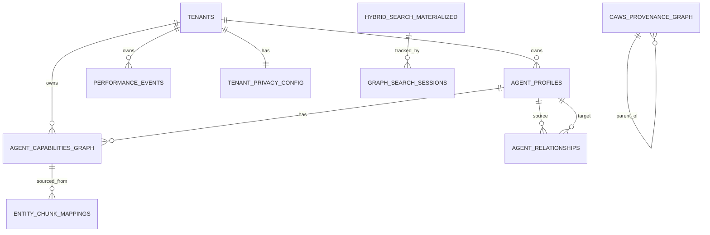

# V2 Database Schema Documentation

**Author**: @darianrosebrook  
**Date**: 2025-10-12  
**Version**: 1.0  
**Database**: PostgreSQL 13+ with pgvector

---

## Overview

V2's database implements a hybrid vector-graph architecture designed for:

- **Semantic Discovery**: Vector embeddings enable similarity search across capabilities and governance
- **Relationship Intelligence**: Graph structure captures agent collaborations and capability overlaps
- **Multi-Tenant Isolation**: Row Level Security guarantees data separation
- **Cryptographic Provenance**: Hash chains ensure audit integrity

**Key Technologies**:

- PostgreSQL 13+
- pgvector extension (HNSW indexes)
- Row Level Security (RLS)
- JSONB for flexible metadata
- Recursive CTEs for graph queries

---

## Architecture Diagram

```
┌─────────────────────────────────────────────────────────────────┐
│                     V2 Hybrid Vector-Graph DB                    │
├─────────────────────────────────────────────────────────────────┤
│                                                                   │
│  ┌─────────────────┐     ┌──────────────────┐                   │
│  │  Multi-Tenancy  │────▶│   Agent Layer    │                   │
│  │                 │     │                  │                   │
│  │  • tenants      │     │ • agent_profiles │                   │
│  │  • privacy_cfg  │     │ • capabilities   │                   │
│  │  • access_log   │     │ • relationships  │                   │
│  └─────────────────┘     └──────────────────┘                   │
│           │                        │                             │
│           ▼                        ▼                             │
│  ┌─────────────────┐     ┌──────────────────┐                   │
│  │  Vector Search  │◀────│ Knowledge Graph  │                   │
│  │                 │     │                  │                   │
│  │  • HNSW indexes │     │ • capabilities   │                   │
│  │  • embeddings   │     │ • relationships  │                   │
│  │  • similarity   │     │ • traversal      │                   │
│  └─────────────────┘     └──────────────────┘                   │
│           │                        │                             │
│           └────────────┬───────────┘                             │
│                        ▼                                         │
│              ┌──────────────────┐                                │
│              │  CAWS Provenance │                                │
│              │                  │                                │
│              │  • hash_chains   │                                │
│              │  • signatures    │                                │
│              │  • constitutional│                                │
│              └──────────────────┘                                │
│                        │                                         │
│                        ▼                                         │
│              ┌──────────────────┐                                │
│              │  Hybrid Search   │                                │
│              │                  │                                │
│              │  • views         │                                │
│              │  • functions     │                                │
│              │  • analytics     │                                │
│              └──────────────────┘                                │
└─────────────────────────────────────────────────────────────────┘
```

---

## Entity-Relationship Diagram

### Core Entities



---

## Table Schemas

### 1. Multi-Tenancy Tables

#### `tenants`

**Purpose**: Central tenant management with isolation configuration

| Column             | Type            | Constraints                | Description                 |
| ------------------ | --------------- | -------------------------- | --------------------------- |
| id                 | VARCHAR(255)    | PK                         | Unique tenant identifier    |
| project_id         | VARCHAR(255)    | NOT NULL                   | Project grouping            |
| name               | VARCHAR(255)    | NOT NULL                   | Display name                |
| isolation_level    | isolation_level | NOT NULL, DEFAULT 'strict' | Isolation mode              |
| access_policies    | JSONB           | DEFAULT '[]'               | Access control rules        |
| sharing_rules      | JSONB           | DEFAULT '[]'               | Cross-tenant sharing config |
| data_retention     | JSONB           | NOT NULL                   | Retention policy config     |
| encryption_enabled | BOOLEAN         | DEFAULT false              | Enable encryption           |
| audit_logging      | BOOLEAN         | DEFAULT true               | Enable audit logs           |
| config             | JSONB           | DEFAULT '{}'               | Additional config           |
| created_at         | TIMESTAMPTZ     | NOT NULL, DEFAULT NOW()    | Creation timestamp          |
| updated_at         | TIMESTAMPTZ     | NOT NULL, DEFAULT NOW()    | Last update                 |

**Indexes**:

- `idx_tenants_project` on `project_id`
- `idx_tenants_isolation` on `isolation_level`

**Unique Constraints**:

- `unique_tenant_name` on `(project_id, name)`

**Row Count Estimate**: ~100-1,000 tenants

---

#### `tenant_privacy_config`

**Purpose**: Privacy-preserving parameters for federated learning

| Column                      | Type          | Constraints                      | Description               |
| --------------------------- | ------------- | -------------------------------- | ------------------------- |
| tenant_id                   | VARCHAR(255)  | PK, FK → tenants.id              | Tenant reference          |
| privacy_level               | privacy_level | NOT NULL, DEFAULT 'differential' | Privacy mode              |
| noise_magnitude             | DECIMAL(5,4)  | DEFAULT 0.01, >= 0.0             | DP noise parameter        |
| k_anonymity                 | INTEGER       | DEFAULT 5, >= 2                  | Minimum group size        |
| epsilon                     | DECIMAL(5,4)  | DEFAULT 1.0, > 0.0               | Privacy budget            |
| delta                       | DECIMAL(10,8) | DEFAULT 0.00001, >= 0.0          | Privacy parameter         |
| allow_cross_tenant_learning | BOOLEAN       | DEFAULT false                    | Enable federated learning |
| allowed_tenant_groups       | TEXT[]        | DEFAULT '{}'                     | Approved tenant groups    |
| updated_at                  | TIMESTAMPTZ   | NOT NULL, DEFAULT NOW()          | Last update               |

**Cascades**: ON DELETE CASCADE with tenants

**Row Count Estimate**: Same as tenants (~100-1,000)

---

#### `tenant_access_log`

**Purpose**: Audit trail of cross-tenant data access

| Column             | Type         | Constraints                    | Description         |
| ------------------ | ------------ | ------------------------------ | ------------------- |
| id                 | UUID         | PK, DEFAULT uuid_generate_v4() | Unique log entry ID |
| tenant_id          | VARCHAR(255) | NOT NULL, FK → tenants.id      | Accessed tenant     |
| accessor_tenant_id | VARCHAR(255) |                                | Accessing tenant    |
| access_type        | VARCHAR(50)  | NOT NULL, CHECK IN (...)       | Access type         |
| table_name         | VARCHAR(100) | NOT NULL                       | Accessed table      |
| query_hash         | VARCHAR(64)  |                                | SHA-256 of query    |
| row_count          | INTEGER      |                                | Rows accessed       |
| user_id            | VARCHAR(255) |                                | User identifier     |
| ip_address         | INET         |                                | IP address          |
| accessed_at        | TIMESTAMPTZ  | NOT NULL, DEFAULT NOW()        | Access timestamp    |

**Indexes**:

- `idx_tenant_access_log_tenant` on `tenant_id`
- `idx_tenant_access_log_accessed` on `accessed_at DESC`

**Retention**: Typically 90 days, configurable per tenant

---

### 2. Knowledge Graph Tables

#### `agent_capabilities_graph`

**Purpose**: Agent capabilities with vector embeddings for semantic search

| Column                | Type         | Constraints                      | Description              |
| --------------------- | ------------ | -------------------------------- | ------------------------ |
| id                    | UUID         | PK, DEFAULT uuid_generate_v4()   | Unique capability ID     |
| agent_id              | VARCHAR(255) | NOT NULL, FK → agent_profiles.id | Agent reference          |
| capability_type       | entity_type  | NOT NULL, DEFAULT 'CAPABILITY'   | Entity type              |
| capability_name       | VARCHAR(500) | NOT NULL                         | Original name            |
| canonical_name        | VARCHAR(500) | NOT NULL                         | Normalized name (auto)   |
| aliases               | TEXT[]       | DEFAULT '{}'                     | Alternative names        |
| confidence            | DECIMAL(3,2) | NOT NULL, 0.7-1.0                | Capability confidence    |
| extraction_confidence | DECIMAL(3,2) | NOT NULL, 0.0-1.0                | Extraction quality       |
| validation_status     | VARCHAR(20)  | DEFAULT 'unvalidated'            | Validation state         |
| embedding             | vector(768)  |                                  | 768-dim vector embedding |
| source_tasks          | UUID[]       | DEFAULT '{}'                     | Demonstrating tasks      |
| demonstration_count   | INTEGER      | DEFAULT 1, > 0                   | Times demonstrated       |
| success_rate          | DECIMAL(4,3) | DEFAULT 1.0, 0.0-1.0             | Success percentage       |
| search_vector         | tsvector     | GENERATED ALWAYS AS ...          | Full-text search         |
| first_observed        | TIMESTAMPTZ  | NOT NULL, DEFAULT NOW()          | First observation        |
| last_updated          | TIMESTAMPTZ  | NOT NULL, DEFAULT NOW()          | Last update              |
| last_demonstrated     | TIMESTAMPTZ  | NOT NULL, DEFAULT NOW()          | Last demonstration       |
| tenant_id             | VARCHAR(255) | NOT NULL, FK → tenants.id        | Tenant isolation         |
| metadata              | JSONB        | DEFAULT '{}'                     | Flexible metadata        |

**Indexes**:

- `idx_capabilities_agent` on `agent_id`
- `idx_capabilities_type` on `capability_type`
- `idx_capabilities_canonical` on `canonical_name`
- `idx_capabilities_confidence` on `confidence DESC`
- `idx_capabilities_search` GIN on `search_vector`
- `idx_capabilities_last_updated` on `last_updated DESC`
- `idx_capabilities_tenant` on `tenant_id`
- **`idx_capabilities_embedding` HNSW on `embedding` (m=16, ef_construction=64)**

**Unique Constraints**:

- `unique_agent_capability` on `(agent_id, canonical_name)`

**Triggers**:

- `set_capability_canonical_name` BEFORE INSERT/UPDATE
- `update_capabilities_last_updated` BEFORE UPDATE

**RLS**: Enabled, policies filter by tenant_id

**Row Count Estimate**: ~5,000-50,000 capabilities (avg 50 per agent)

---

#### `agent_relationships`

**Purpose**: Typed relationships between agents in the knowledge graph

| Column                       | Type              | Constraints                      | Description             |
| ---------------------------- | ----------------- | -------------------------------- | ----------------------- |
| id                           | UUID              | PK, DEFAULT uuid_generate_v4()   | Unique relationship ID  |
| source_agent_id              | VARCHAR(255)      | NOT NULL, FK → agent_profiles.id | Source agent            |
| target_agent_id              | VARCHAR(255)      | NOT NULL, FK → agent_profiles.id | Target agent            |
| type                         | relationship_type | NOT NULL                         | Relationship type       |
| is_directional               | BOOLEAN           | DEFAULT false                    | Directional flag        |
| confidence                   | DECIMAL(3,2)      | NOT NULL, 0.5-1.0                | Relationship confidence |
| strength                     | DECIMAL(3,2)      | NOT NULL, DEFAULT 1.0, 0.0-1.0   | Relationship strength   |
| cooccurrence_count           | INTEGER           | DEFAULT 1, > 0                   | Co-occurrence count     |
| supporting_tasks             | UUID[]            | DEFAULT '{}'                     | Evidence tasks          |
| extraction_context           | TEXT              |                                  | Extraction context      |
| mutual_information           | DECIMAL(10,6)     |                                  | Statistical measure     |
| pointwise_mutual_information | DECIMAL(10,6)     |                                  | Statistical measure     |
| created_at                   | TIMESTAMPTZ       | NOT NULL, DEFAULT NOW()          | Creation timestamp      |
| updated_at                   | TIMESTAMPTZ       | NOT NULL, DEFAULT NOW()          | Last update             |
| last_observed                | TIMESTAMPTZ       | NOT NULL, DEFAULT NOW()          | Last observation        |
| metadata                     | JSONB             | DEFAULT '{}'                     | Flexible metadata       |

**Indexes**:

- `idx_relationships_source` on `source_agent_id`
- `idx_relationships_target` on `target_agent_id`
- `idx_relationships_type` on `type`
- `idx_relationships_confidence` on `confidence DESC`
- `idx_relationships_strength` on `strength DESC`
- `idx_relationships_created` on `created_at DESC`
- **`idx_relationships_source_type` on `(source_agent_id, type)` (composite)**
- **`idx_relationships_target_type` on `(target_agent_id, type)` (composite)**
- **`idx_relationships_bidirectional` on `(source_agent_id, target_agent_id, type)` (composite)**

**Unique Constraints**:

- `unique_relationship` on `(source_agent_id, target_agent_id, type)`

**Check Constraints**:

- `no_self_relationships` CHECK `source_agent_id != target_agent_id`
- `valid_confidence` CHECK `confidence >= 0.5`

**Triggers**:

- `update_relationships_last_updated` BEFORE UPDATE
- `prevent_duplicate_relationships_trigger` BEFORE INSERT/UPDATE

**Row Count Estimate**: ~10,000-100,000 relationships (avg 10-100 per agent)

---

#### `caws_provenance_graph`

**Purpose**: Cryptographically-secured provenance graph for CAWS governance

| Column                | Type         | Constraints                    | Description                |
| --------------------- | ------------ | ------------------------------ | -------------------------- |
| id                    | UUID         | PK, DEFAULT uuid_generate_v4() | Unique provenance node ID  |
| entity_type           | VARCHAR(50)  | NOT NULL, CHECK IN (...)       | Entity type                |
| entity_id             | VARCHAR(255) | NOT NULL                       | Entity identifier          |
| parent_entity_id      | UUID         | FK → caws_provenance_graph.id  | Parent node (hash chain)   |
| hash_chain            | VARCHAR(128) | NOT NULL, LENGTH = 64          | SHA-256 hash               |
| signature             | VARCHAR(255) | NOT NULL, LENGTH > 0           | ed25519 signature          |
| constitutional_refs   | TEXT[]       | DEFAULT '{}'                   | CAWS clause references     |
| spec_hash             | VARCHAR(128) |                                | Working spec hash          |
| embedding             | vector(768)  |                                | 768-dim semantic embedding |
| description           | TEXT         |                                | Textual description        |
| evidence_completeness | DECIMAL(3,2) | 0.0-1.0                        | CAWS score                 |
| budget_adherence      | DECIMAL(3,2) | 0.0-1.0                        | CAWS score                 |
| gate_integrity        | DECIMAL(3,2) | 0.0-1.0                        | CAWS score                 |
| provenance_clarity    | DECIMAL(3,2) | 0.0-1.0                        | CAWS score                 |
| created_at            | TIMESTAMPTZ  | NOT NULL, DEFAULT NOW()        | Creation timestamp         |
| metadata              | JSONB        | DEFAULT '{}'                   | Flexible metadata          |

**Indexes**:

- `idx_provenance_entity_type` on `entity_type`
- `idx_provenance_entity_id` on `entity_id`
- `idx_provenance_parent` on `parent_entity_id`
- `idx_provenance_created` on `created_at DESC`
- `idx_provenance_constitutional` GIN on `constitutional_refs`
- **`idx_provenance_embedding` HNSW on `embedding` (m=16, ef_construction=64)**

**Unique Constraints**:

- `unique_entity` on `(entity_type, entity_id)`

**Check Constraints**:

- `non_empty_hash` CHECK `length(hash_chain) = 64`
- `non_empty_signature` CHECK `length(signature) > 0`

**Cascades**: ON DELETE RESTRICT for parent_entity_id (prevent chain breaks)

**Row Count Estimate**: ~50,000-500,000 provenance nodes (comprehensive audit trail)

---

#### `entity_chunk_mappings`

**Purpose**: Provenance mapping from capabilities to source data chunks

| Column                | Type         | Constraints                                | Description              |
| --------------------- | ------------ | ------------------------------------------ | ------------------------ |
| id                    | UUID         | PK, DEFAULT uuid_generate_v4()             | Unique mapping ID        |
| entity_id             | UUID         | NOT NULL, FK → agent_capabilities_graph.id | Capability reference     |
| chunk_id              | UUID         | NOT NULL                                   | Source chunk ID          |
| chunk_type            | VARCHAR(50)  | NOT NULL, CHECK IN (...)                   | Chunk type               |
| mention_text          | TEXT         | NOT NULL                                   | How entity was mentioned |
| mention_context       | TEXT         |                                            | Surrounding context      |
| start_position        | INTEGER      |                                            | Start position in chunk  |
| end_position          | INTEGER      |                                            | End position in chunk    |
| extraction_method     | VARCHAR(50)  | NOT NULL, CHECK IN (...)                   | Extraction method        |
| extraction_confidence | DECIMAL(3,2) | NOT NULL, 0.0-1.0                          | Extraction confidence    |
| created_at            | TIMESTAMPTZ  | NOT NULL, DEFAULT NOW()                    | Creation timestamp       |

**Indexes**:

- `idx_entity_chunks_entity` on `entity_id`
- `idx_entity_chunks_chunk` on `chunk_id`
- `idx_entity_chunks_type` on `chunk_type`
- `idx_entity_chunks_method` on `extraction_method`

**Unique Constraints**:

- `unique_entity_chunk_mention` on `(entity_id, chunk_id, mention_text)`

**Check Constraints**:

- `valid_position_range` CHECK valid start/end positions

**Cascades**: ON DELETE CASCADE with entity_id

**Row Count Estimate**: ~10,000-100,000 mappings (multiple mentions per capability)

---

### 3. Hybrid Search Infrastructure

#### `hybrid_search_materialized` (Materialized View)

**Purpose**: Pre-aggregated search index combining all entity types with HNSW index

**Source Query**:

```sql
SELECT
    'agent_capability' as entity_type,
    id,
    agent_id as parent_id,
    capability_name as name,
    canonical_name,
    embedding,
    confidence,
    tenant_id,
    metadata,
    last_updated as updated_at
FROM agent_capabilities_graph
WHERE embedding IS NOT NULL
UNION ALL
SELECT
    'caws_provenance' as entity_type,
    id,
    parent_entity_id as parent_id,
    entity_id as name,
    entity_id as canonical_name,
    embedding,
    GREATEST(...) as confidence,
    NULL as tenant_id,
    metadata,
    created_at as updated_at
FROM caws_provenance_graph
WHERE embedding IS NOT NULL
UNION ALL
-- ... agent_profiles
```

**Indexes**:

- `idx_hybrid_search_type` on `entity_type`
- `idx_hybrid_search_tenant` on `tenant_id`
- **`idx_hybrid_search_embedding` HNSW on `embedding` WHERE `embedding IS NOT NULL`**

**Refresh Strategy**: CONCURRENTLY every 30 minutes via cron

**Row Count Estimate**: ~5,000-60,000 searchable entities

---

#### `graph_search_sessions`

**Purpose**: Performance tracking and analytics for search queries

| Column                  | Type          | Constraints                    | Description           |
| ----------------------- | ------------- | ------------------------------ | --------------------- |
| id                      | UUID          | PK, DEFAULT uuid_generate_v4() | Session ID            |
| query_text              | TEXT          |                                | Query text            |
| query_hash              | VARCHAR(64)   | NOT NULL                       | SHA-256 of query      |
| search_type             | VARCHAR(20)   | NOT NULL, CHECK IN (...)       | Search type           |
| max_results             | INTEGER       | DEFAULT 10                     | Result limit          |
| max_hops                | INTEGER       | DEFAULT 2                      | Graph hop limit       |
| min_confidence          | DECIMAL(3,2)  | DEFAULT 0.5                    | Confidence threshold  |
| entity_type_filters     | VARCHAR(50)[] |                                | Entity type filters   |
| result_count            | INTEGER       | NOT NULL, DEFAULT 0            | Results returned      |
| execution_time_ms       | INTEGER       | NOT NULL                       | Execution time        |
| vector_search_time_ms   | INTEGER       |                                | Vector component time |
| graph_traversal_time_ms | INTEGER       |                                | Graph component time  |
| nodes_visited           | INTEGER       | DEFAULT 0                      | Graph nodes visited   |
| edges_traversed         | INTEGER       | DEFAULT 0                      | Graph edges traversed |
| max_hops_reached        | INTEGER       | DEFAULT 0                      | Max hops reached      |
| tenant_id               | VARCHAR(255)  |                                | Tenant context        |
| user_id                 | VARCHAR(100)  |                                | User identifier       |
| session_id              | VARCHAR(100)  |                                | Session identifier    |
| created_at              | TIMESTAMPTZ   | NOT NULL, DEFAULT NOW()        | Query timestamp       |
| metadata                | JSONB         | DEFAULT '{}'                   | Additional metadata   |

**Indexes**:

- `idx_search_sessions_query_hash` on `query_hash`
- `idx_search_sessions_tenant` on `tenant_id`
- `idx_search_sessions_created` on `created_at DESC`
- `idx_search_sessions_type` on `search_type`
- `idx_search_sessions_execution_time` on `execution_time_ms`

**Retention**: 30 days typical, longer for analytics

**Row Count Estimate**: ~100,000-1M sessions (high query volume)

---

## Custom Types (ENUMs)

### `entity_type`

**Values**:

- `CAPABILITY` - Agent capabilities
- `AGENT` - Agent entities
- `TASK` - Task entities
- `VERDICT` - CAWS verdicts
- `TECHNOLOGY` - Technology/tool entities
- `CONCEPT` - Abstract concepts
- `WAIVER` - CAWS waivers
- `GATE` - Quality gates

### `relationship_type`

**Values**:

- `COLLABORATES_WITH` - Agents that work together
- `SIMILAR_TO` - Similar capabilities or approaches
- `DERIVED_FROM` - Agent forked/improved from another
- `VALIDATES` - Agent validates another's work
- `DEPENDS_ON` - Agent requires another's output
- `COMPETES_WITH` - Agents with overlapping capabilities
- `INFLUENCES` - One agent's performance affects another
- `REPLACES` - Agent supersedes another
- `ENHANCES` - Agent enhances another's capabilities

### `isolation_level`

**Values**:

- `strict` - No data sharing between tenants
- `shared` - Explicit sharing rules apply
- `federated` - Cross-tenant learning with privacy preservation

### `privacy_level`

**Values**:

- `basic` - Basic anonymization
- `differential` - Differential privacy with noise
- `secure` - Secure multi-party computation

### `retention_policy`

**Values**:

- `delete` - Delete after retention period
- `archive` - Move to cold storage
- `retain` - Keep indefinitely

---

## Views

### `agent_capability_summary`

**Purpose**: Per-agent capability statistics

**Columns**:

- `agent_id`: Agent identifier
- `capability_count`: Total capabilities
- `avg_confidence`: Average confidence
- `avg_success_rate`: Average success rate
- `last_activity`: Last demonstration timestamp

### `agent_relationship_summary`

**Purpose**: Per-agent relationship statistics by type

**Columns**:

- `source_agent_id`: Source agent
- `type`: Relationship type
- `relationship_count`: Count of relationships
- `avg_confidence`: Average confidence
- `avg_strength`: Average strength

### `agent_connectivity`

**Purpose**: Agent network connectivity metrics

**Columns**:

- `agent_id`: Agent identifier
- `outbound_relationships`: Outgoing relationships
- `inbound_relationships`: Incoming relationships
- `total_relationships`: Total connectivity

### `caws_provenance_chains`

**Purpose**: Recursive view of provenance chains with depth

**Columns**:

- `id`: Node ID
- `entity_type`: Entity type
- `entity_id`: Entity identifier
- `parent_entity_id`: Parent node
- `hash_chain`: Hash value
- `constitutional_refs`: Constitutional references
- `created_at`: Creation timestamp
- `depth`: Depth in chain
- `path`: Array of node IDs in path

### Analytics Views

- `slow_search_queries`: Queries exceeding 200ms average
- `popular_search_queries`: Top 100 most frequent queries
- `search_performance_by_type`: Performance metrics by search type
- `tenant_statistics`: Per-tenant data statistics
- `cross_tenant_access_summary`: Cross-tenant access patterns

---

## Functions

### Vector Search Functions

#### `find_similar_capabilities(target_embedding, tenant_id, max_results, min_confidence)`

**Purpose**: Find semantically similar capabilities

**Returns**: `TABLE(capability_id, capability_name, agent_id, similarity_score, confidence)`

**Performance**: <100ms P95

---

#### `find_similar_caws_verdicts(target_embedding, verdict_type, max_results)`

**Purpose**: Find similar CAWS precedents

**Returns**: `TABLE(verdict_id, entity_id, entity_type, similarity_score, constitutional_refs, created_at)`

**Performance**: <100ms P95

---

### Graph Traversal Functions

#### `traverse_agent_relationships(start_agent_id, max_hops, min_confidence, relationship_types)`

**Purpose**: Multi-hop graph traversal following relationships

**Returns**: `TABLE(agent_id, agent_name, hop_distance, relationship_path, cumulative_confidence, path)`

**Performance**:

- 1-hop: <30ms
- 2-hop: <200ms
- 3-hop: <400ms

---

#### `find_agent_path(source_agent_id, target_agent_id, max_hops)`

**Purpose**: Find shortest path between two agents

**Returns**: `TABLE(path_length, relationship_path, agent_path, total_confidence)`

**Performance**: <200ms for up to 5 hops

---

### Hybrid Search Functions

#### `hybrid_search(query_embedding, query_text, max_results, include_graph_hops, entity_types, tenant_id, min_confidence)`

**Purpose**: Combined vector similarity and graph traversal search

**Returns**: `TABLE(entity_id, entity_type, name, relevance_score, source, hop_distance, parent_id)`

**Performance**: <250ms P95

---

### Utility Functions

#### `normalize_entity_name(input_name)`

**Purpose**: Normalize entity names for canonical naming

**Returns**: `TEXT` (lowercased, trimmed, single spaces)

---

#### `compute_provenance_hash(parent_hash, entity_type, entity_id, metadata)`

**Purpose**: Compute SHA-256 hash for provenance chain

**Returns**: `VARCHAR(128)` (64-char hex)

---

#### `add_dp_noise(value, tenant_id)`

**Purpose**: Apply differential privacy noise to aggregates

**Returns**: `DECIMAL` (value + Laplace noise)

---

#### `check_k_anonymity(group_size, tenant_id)`

**Purpose**: Validate k-anonymity compliance

**Returns**: `BOOLEAN`

---

#### `refresh_hybrid_search_index()`

**Purpose**: Refresh materialized view for hybrid search

**Returns**: `void`

**Usage**: Call via cron every 30 minutes

---

#### `compute_agent_centrality()`

**Purpose**: Compute agent centrality metrics

**Returns**: `TABLE(agent_id, degree_centrality, betweenness_estimate, connection_count)`

---

## Triggers

### `set_canonical_name`

**Table**: `agent_capabilities_graph`  
**Event**: BEFORE INSERT OR UPDATE  
**Function**: `set_canonical_name()`  
**Purpose**: Automatically normalize capability names

---

### `update_last_updated_column`

**Tables**: `agent_capabilities_graph`, `agent_relationships`  
**Event**: BEFORE UPDATE  
**Function**: `update_last_updated_column()`  
**Purpose**: Automatically update `last_updated` timestamps

---

### `prevent_duplicate_relationships`

**Table**: `agent_relationships`  
**Event**: BEFORE INSERT OR UPDATE  
**Function**: `prevent_duplicate_relationships()`  
**Purpose**: Prevent duplicate bidirectional relationships

---

## Row Level Security Policies

### `tenant_strict_isolation` (agent_profiles)

**Type**: USING  
**Condition**: `tenant_id = current_setting('app.current_tenant')` AND isolation_level = 'strict'  
**Effect**: Only see own tenant's data in strict mode

---

### `tenant_shared_access` (agent_profiles)

**Type**: USING  
**Condition**: `tenant_id = current_setting('app.current_tenant')` OR (shared AND allowed)  
**Effect**: Access own data plus explicitly shared data

---

### `tenant_federated_access` (performance_events)

**Type**: USING  
**Condition**: `tenant_id = current_setting('app.current_tenant')` OR both federated  
**Effect**: Cross-tenant aggregation for federated tenants

---

### Additional Policies

All tenant-scoped tables have similar policies:

- `tenant_benchmark_isolation` on `benchmark_datasets`
- `tenant_capability_isolation` on `agent_capabilities_graph`
- `tenant_anomaly_isolation` on `performance_anomalies`
- `tenant_rl_batch_isolation` on `rl_training_batches`

---

## Index Strategy

### Vector Indexes (HNSW)

**Tables**: `agent_capabilities_graph`, `caws_provenance_graph`, `hybrid_search_materialized`

**Configuration**:

- `m = 16`: Connections per layer
- `ef_construction = 64`: Build-time accuracy
- Runtime `ef_search`: Configurable per query (default 40)

**Trade-offs**:

- Higher `m` = better recall, more memory
- Higher `ef_construction` = better index quality, slower build
- Higher `ef_search` = better query accuracy, slower queries

---

### Graph Indexes (Composite)

**Purpose**: Optimize graph traversal queries

**Examples**:

- `(source_agent_id, type)`: Find relationships by type from agent
- `(target_agent_id, type)`: Find relationships by type to agent
- `(source_agent_id, target_agent_id, type)`: Check specific relationship

---

### Time-Series Indexes (Partial)

**Purpose**: Optimize queries on recent data

**Example**:

```sql
CREATE INDEX idx_events_recent
ON performance_events(timestamp DESC)
WHERE timestamp > NOW() - INTERVAL '7 days';
```

**Benefit**: Smaller index, faster queries on hot data

---

### Full-Text Indexes (GIN)

**Purpose**: Fast text search and array containment

**Examples**:

- `search_vector` on `agent_capabilities_graph`: Full-text search
- `constitutional_refs` on `caws_provenance_graph`: Array containment

---

## Storage Estimates

### Per-Table Storage (1 year, 1000 agents)

| Table                      | Rows    | Avg Row Size | Total Size | Index Size | Total      |
| -------------------------- | ------- | ------------ | ---------- | ---------- | ---------- |
| `agent_profiles`           | 1,000   | 2 KB         | 2 MB       | 1 MB       | 3 MB       |
| `agent_capabilities_graph` | 50,000  | 4 KB         | 200 MB     | 600 MB     | 800 MB     |
| `agent_relationships`      | 100,000 | 500 B        | 50 MB      | 100 MB     | 150 MB     |
| `caws_provenance_graph`    | 500,000 | 2 KB         | 1 GB       | 2 GB       | 3 GB       |
| `entity_chunk_mappings`    | 100,000 | 1 KB         | 100 MB     | 50 MB      | 150 MB     |
| `performance_events`       | 10M     | 2 KB         | 20 GB      | 10 GB      | 30 GB      |
| `benchmark_datasets`       | 50,000  | 500 KB       | 25 GB      | 5 GB       | 30 GB      |
| `graph_search_sessions`    | 1M      | 500 B        | 500 MB     | 200 MB     | 700 MB     |
| **Total**                  |         |              | **~47 GB** | **~18 GB** | **~65 GB** |

**Note**: Vector indexes (HNSW) are ~2.8x the size of vector data

---

## Performance Tuning

### PostgreSQL Configuration

```ini
# Memory
shared_buffers = 16GB          # 25% of RAM
effective_cache_size = 48GB    # 75% of RAM
work_mem = 256MB               # Per-operation memory
maintenance_work_mem = 2GB     # For index creation

# Parallelism
max_parallel_workers_per_gather = 4
max_parallel_workers = 8

# Autovacuum
autovacuum = on
autovacuum_max_workers = 4

# Connection pooling
max_connections = 200
```

### Query Optimization

```sql
-- Set vector search accuracy
SET hnsw.ef_search = 40; -- Default, good balance

-- Enable query parallelism
SET max_parallel_workers_per_gather = 4;

-- Use prepared statements
PREPARE capability_search (vector(768), INTEGER) AS
    SELECT * FROM agent_capabilities_graph
    ORDER BY embedding <=> $1
    LIMIT $2;

EXECUTE capability_search('[...]', 10);
```

---

## Maintenance Procedures

### Daily

```sql
-- Refresh materialized views
REFRESH MATERIALIZED VIEW CONCURRENTLY hybrid_search_materialized;

-- Analyze statistics
ANALYZE agent_capabilities_graph;
ANALYZE agent_relationships;
```

### Weekly

```sql
-- Vacuum and analyze all tables
VACUUM ANALYZE;

-- Reindex if needed
REINDEX INDEX CONCURRENTLY idx_capabilities_embedding;
```

### Monthly

```sql
-- Full vacuum
VACUUM FULL;

-- Rebuild indexes
REINDEX DATABASE v2_db;

-- Archive old data
DELETE FROM tenant_access_log WHERE accessed_at < NOW() - INTERVAL '90 days';
```

---

## Backup and Recovery

### Backup Strategy

```bash
# Daily full backup
pg_dump -h $DB_HOST -U $DB_USER -d $DB_NAME -F c -f backup_$(date +%Y%m%d).dump

# Continuous WAL archiving
archive_command = 'cp %p /mnt/wal_archive/%f'
```

### Point-in-Time Recovery

```bash
# Restore to specific timestamp
pg_restore -h $DB_HOST -U $DB_USER -d $DB_NAME -c backup.dump
# Then use PITR if needed
```

---

## Security Considerations

### Row Level Security (RLS)

**Always use tenant context**:

```typescript
await client.query(`SET LOCAL app.current_tenant = $1`, [tenantId]);
```

**Never bypass RLS** with application-level filtering

### Encryption

- **At Rest**: PostgreSQL encryption or disk encryption
- **In Transit**: SSL/TLS for connections
- **Tenant-Level**: Optional tenant-specific encryption

### Audit Logging

All tenant access logged to `tenant_access_log` for compliance

---

## Migration Rollback

See `MIGRATION-PLAN.md` for detailed rollback procedures.

**Quick Rollback**:

1. Disable RLS: `ALTER TABLE ... DISABLE ROW LEVEL SECURITY;`
2. Drop new tables: `DROP TABLE ... CASCADE;`
3. Restore from backup if needed

---

## Appendix A: Full Schema DDL

See migration files:

- `006_create_knowledge_graph_schema.sql`
- `007_add_multi_tenant_isolation.sql`
- `008_create_hybrid_search_views.sql`

---

## Appendix B: Query Examples

See `QUERY-PATTERNS.md` for comprehensive query examples.

---

**Document Version**: 1.0  
**Last Updated**: 2025-10-12  
**Next Review**: After migration completion

