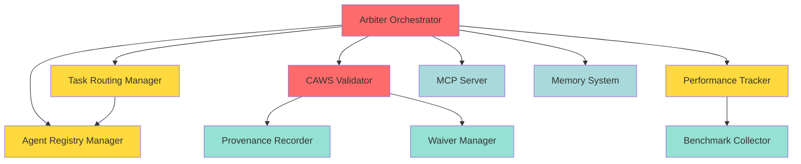

# Arbiter V2 - CAWS Working Specifications Summary

**Author**: @darianrosebrook  
**Created**: 2025-10-10  
**Status**: Specifications Complete - Ready for Implementation

---

## Overview

This document provides an overview of the five core CAWS working specifications created for the Agent Agency V2 Arbiter architecture. These specs define the modular components that together form the intelligent orchestration layer with CAWS constitutional authority.

---

## Component Specifications

### 1. Agent Registry Manager (ARBITER-001)

**Risk Tier**: 2  
**Purpose**: Agent catalog and capability tracking  
**Location**: `agent-registry-manager/.caws/working-spec.yaml`

**Key Responsibilities**:

- Maintain agent catalog with capability profiles
- Track agent performance history and current load
- Provide capability-based agent queries
- Update running average performance metrics

**Budget**: 20 files, 800 LOC  
**Performance Targets**:

- Registry query: <50ms P95
- Agent registration: <100ms P95
- Performance update: <30ms P95
- Concurrent queries: 2000/sec

**Critical Invariants**:

- Agent profiles immutable except for performance metrics
- Performance history updates are atomic
- Registry queries never block registration operations
- All capability changes are versioned and auditable

---

### 2. Task Routing Manager (ARBITER-002)

**Risk Tier**: 2  
**Purpose**: Intelligent agent selection with multi-armed bandit  
**Location**: `task-routing-manager/.caws/working-spec.yaml`

**Key Responsibilities**:

- Implement multi-armed bandit routing algorithm
- Balance exploration vs exploitation with epsilon-greedy strategy
- Calculate UCB scores for agent selection
- Match task capabilities to agent specializations
- Log routing decisions with rationale

**Budget**: 20 files, 800 LOC  
**Performance Targets**:

- Routing decision: <100ms P95
- UCB calculation: <10ms P95
- Capability matching: <50ms P95
- Routing throughput: 1000/sec

**Critical Invariants**:

- Routing decisions are deterministic given same bandit state
- Exploration rate decreases monotonically over time
- All routing decisions logged for provenance
- UCB scores always computed with valid statistics

---

### 3. CAWS Validator (ARBITER-003)

**Risk Tier**: 1 (Critical)  
**Purpose**: Constitutional authority and quality gate enforcement  
**Location**: `caws-validator/.caws/working-spec.yaml`

**Key Responsibilities**:

- Enforce CAWS budgets (max_files, max_loc)
- Execute quality gates based on risk tier
- Manage waiver creation and approval workflow
- Record immutable provenance with cryptographic hashing
- Generate compliance verdicts with remediation guidance

**Budget**: 25 files, 1000 LOC  
**Performance Targets**:

- Validation execution: <200ms P95
- Budget check: <50ms P95
- Quality gate execution: <500ms P95
- Provenance recording: <100ms P95

**Critical Invariants**:

- All validation results immutably recorded in provenance
- Budget violations cannot merge without approved waiver
- Quality gate execution is idempotent and deterministic
- Provenance chain maintains cryptographic integrity
- Waiver approvals require human authorization

**Quality Gate Requirements by Tier**:

- **Tier 1**: Coverage ≥90%, Mutation ≥70%, Manual review required
- **Tier 2**: Coverage ≥80%, Mutation ≥50%, Contracts required
- **Tier 3**: Coverage ≥70%, Mutation ≥30%, Optional contracts

---

### 4. Performance Tracker (ARBITER-004)

**Risk Tier**: 2  
**Purpose**: Benchmark data collection for RL training  
**Location**: `performance-tracker/.caws/working-spec.yaml`

**Key Responsibilities**:

- Collect routing decision telemetry
- Track task execution metrics (latency, success, quality)
- Record evaluation outcomes with rubric scores
- Implement async buffering and batch writes
- Validate privacy and anonymize sensitive data
- Apply retention policies (hot: 7d, warm: 30d, cold: 90d)

**Budget**: 25 files, 1000 LOC  
**Performance Targets**:

- Collection overhead: <50ms P95
- Batch write: <200ms P95
- Data query: <500ms P95
- Compression ratio: 60% target

**Critical Invariants**:

- All data passes privacy validation before storage
- Data collection never blocks routing decisions
- Benchmark data points immutable once stored
- Timestamps are millisecond-precision and monotonic
- Storage capacity monitored with alerts at 80%

**Data Volume**:

- 10,000 data points/day
- 50 concurrent collectors
- 100GB storage capacity

---

### 5. Arbiter Orchestrator (ARBITER-005)

**Risk Tier**: 1 (Critical)  
**Purpose**: Main integration and constitutional authority runtime  
**Location**: `arbiter-orchestrator/.caws/working-spec.yaml`

**Key Responsibilities**:

- Initialize and coordinate all subsystems
- Manage task queue and assignments
- Coordinate routing, validation, and tracking workflows
- Monitor system health and trigger recovery
- Handle task timeouts and failures
- Ensure CAWS enforcement at all checkpoints

**Budget**: 40 files, 1500 LOC  
**Performance Targets**:

- Task routing: <200ms P95
- Validation execution: <500ms P95
- Task completion: <30s P95
- Concurrent tasks: 100

**Critical Invariants**:

- All tasks receive routing decision within timeout
- CAWS validation runs before task completion acknowledgment
- Performance tracking data collected for all completed tasks
- Agent registry queries never block task routing
- Health monitoring detects failures within 30 seconds
- Task state transitions are atomic and isolated

**Integration Points**:

- Agent Registry Manager (component queries)
- Task Routing Manager (routing decisions)
- CAWS Validator (enforcement checkpoints)
- Performance Tracker (data collection)
- MCP Server (external tool access)
- Memory System (context management)

---

## Component Dependencies



**Legend**:

- Red: Risk Tier 1 (Critical)
- Yellow: Risk Tier 2 (Standard)
- Green: Sub-components
- Blue: External dependencies

---

## Implementation Roadmap Alignment

These specs align with the implementation roadmap defined in `docs/1-core-orchestration/implementation-roadmap.md`:

### Phase 1: Foundation (Weeks 1-4)

| Week   | Component(s)                        | Spec ID(s)  |
| ------ | ----------------------------------- | ----------- |
| Week 1 | Core Arbiter Infrastructure         | ARBITER-005 |
| Week 2 | Multi-Armed Bandit Routing          | ARBITER-002 |
| Week 3 | CAWS Constitutional Authority       | ARBITER-003 |
| Week 4 | Performance Tracking Infrastructure | ARBITER-004 |

### Phase 2: Advanced Features (Weeks 5-8)

| Week   | Component(s)                       | Spec ID(s)               |
| ------ | ---------------------------------- | ------------------------ |
| Week 5 | Capability-Based Routing           | ARBITER-002 (extension)  |
| Week 6 | Load Balancing & Health Monitoring | ARBITER-005 (extension)  |
| Week 7 | Cross-Agent Learning               | ARBITER-001, ARBITER-004 |
| Week 8 | Conflict Resolution & Debate       | ARBITER-005 (extension)  |

---

## Data Migration Strategy

### Migration Order

Components with database migrations should be deployed in this order:

1. **ARBITER-001**: Agent Registry tables (migration_001)
2. **ARBITER-003**: Provenance tables (migration_002)
3. **ARBITER-004**: Benchmark tables with TimescaleDB (migration_003)
4. **ARBITER-005**: Orchestrator state tables (migration_004)

All migrations are designed for **zero-downtime deployment** with rollback capability.

---

## Quality Assurance Requirements

### Test Coverage by Component

| Component            | Unit Coverage | Integration Tests     | E2E Tests               |
| -------------------- | ------------- | --------------------- | ----------------------- |
| Agent Registry       | ≥80%          | Registry operations   | Full agent lifecycle    |
| Task Routing         | ≥80%          | Routing accuracy      | End-to-end task flow    |
| CAWS Validator       | ≥90%          | Enforcement pipeline  | CAWS compliance         |
| Performance Tracker  | ≥80%          | Data collection       | Data quality validation |
| Arbiter Orchestrator | ≥85%          | Component integration | Complete workflow       |

### Performance Testing

All components must meet P95 latency targets under concurrent load:

- Run load tests with 100 concurrent tasks
- Validate latency budgets hold under sustained load
- Measure throughput and identify bottlenecks

---

## Security Considerations

### Tier 1 Components (Critical)

**ARBITER-003 (CAWS Validator)** and **ARBITER-005 (Arbiter Orchestrator)** are Tier 1:

- Require manual code review before deployment
- Must maintain 100% CAWS compliance
- Provenance chain integrity is critical
- Waiver approval process must be secure

### Tier 2 Components (Standard)

**ARBITER-001**, **ARBITER-002**, **ARBITER-004** are Tier 2:

- Automated deployment allowed after quality gates pass
- Must prevent data leakage (registry, routing decisions, telemetry)
- Agent identity verification required
- Privacy scanning mandatory for all collected data

---

## Observability Strategy

### Key Metrics to Monitor

**System Health**:

- `orchestrator_availability_sla`: Target 99.9%
- `health_check_success_rate`: Target 99%
- `task_completion_rate`: Track success/failure ratio

**Performance**:

- `routing_decision_latency_p95`: Target <200ms
- `validation_execution_latency_p95`: Target <500ms
- `data_collection_overhead_p95`: Target <50ms

**Quality**:

- `caws_compliance_rate`: Target 100%
- `routing_accuracy_rate`: Target ≥85%
- `data_validation_pass_rate`: Target ≥95%

### Distributed Tracing

Implement end-to-end traces for:

- Task lifecycle (submission → routing → execution → validation → completion)
- CAWS enforcement flow
- Performance data collection pipeline
- Health monitoring and recovery workflows

---

## Risk Mitigation Summary

### High-Priority Risks

| Risk                      | Component(s) | Mitigation                                        |
| ------------------------- | ------------ | ------------------------------------------------- |
| Orchestrator failure      | ARBITER-005  | Health monitoring, automated recovery, redundancy |
| CAWS enforcement bypass   | ARBITER-003  | Immutable checkpoints, cryptographic provenance   |
| Storage capacity exceeded | ARBITER-004  | Retention policies, compression, monitoring       |
| Routing algorithm stuck   | ARBITER-002  | Epsilon-greedy with decay, performance tracking   |
| Registry corruption       | ARBITER-001  | Backup, validation, recovery procedures           |

---

## Next Steps

### For Implementation Teams

1. **Review specs**: Ensure all acceptance criteria are clear
2. **Validate contracts**: Review TypeScript interfaces and OpenAPI specs
3. **Set up migrations**: Prepare database schemas in dependency order
4. **Create test plans**: Map acceptance criteria to test cases
5. **Define performance benchmarks**: Set up load testing infrastructure

### For Architecture Review

1. Validate component boundaries and interfaces
2. Review risk tiers and mitigation strategies
3. Confirm performance budgets are achievable
4. Assess integration complexity and dependencies

### For CAWS Validation

Each spec has been validated with `caws validate` and passes all checks. Before implementation:

```bash
# Validate individual component specs
cd agent-registry-manager && caws validate
cd task-routing-manager && caws validate
cd caws-validator && caws validate
cd performance-tracker && caws validate
cd arbiter-orchestrator && caws validate
```

---

## References

- **Architecture Documentation**: `docs/1-core-orchestration/arbiter-architecture.md`
- **Implementation Roadmap**: `docs/1-core-orchestration/implementation-roadmap.md`
- **Theory Background**: `docs/1-core-orchestration/theory.md`
- **API Contracts**: `docs/api/arbiter-routing.api.yaml`, `docs/api/caws-integration.api.yaml`

---

**These specifications represent the complete foundation for the V2 Arbiter architecture. Each component is designed to be independently implementable while integrating seamlessly into the larger orchestration system.**
