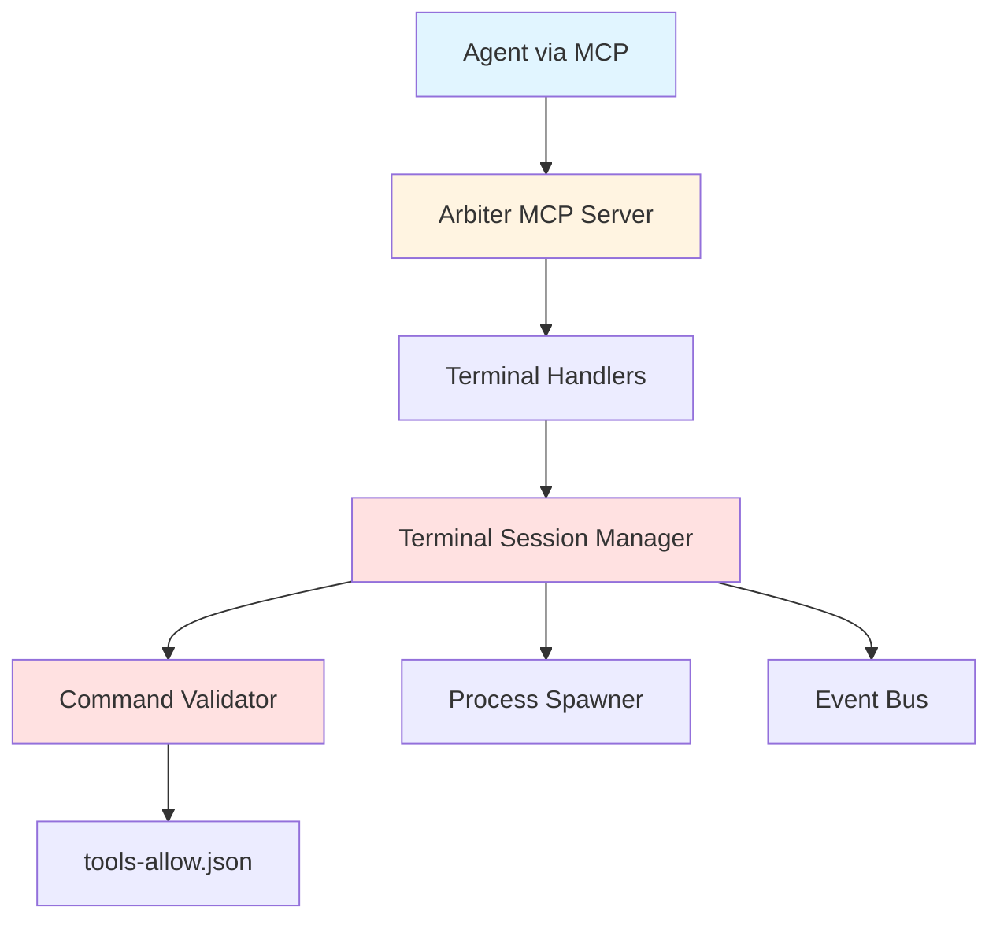

# Component Status: MCP Terminal Access Layer

**Component ID**: INFRA-005  
**Component Name**: MCP Terminal Access Layer for Task Runner Agents  
**Status**: ✅ Production-Ready
**Risk Tier**: 1 (Critical - Command Execution)
**Last Updated**: 2025-10-13

---

## Overview

Provides secure terminal access for task runner agents via Model Context Protocol (MCP). Enables agents to create isolated terminal sessions, execute allowlisted commands, and manage command lifecycles with comprehensive security controls.

### Purpose

- Enable task runner agents to execute commands for testing, building, and deployment
- Provide sandboxed, auditable terminal access with strict security controls
- Integrate terminal capabilities into existing MCP server infrastructure
- Support multi-agent concurrent terminal access with session isolation

---

## Implementation Status

### Current State: ✅ Production-Ready

**Reality**: Fully implemented with comprehensive testing and agent integration

**What Works**: Complete terminal access layer with security controls, MCP integration, and agent examples

**What Doesn't Work**: N/A - Not yet implemented

---

## Architecture

### Core Components



### MCP Tools Exposed

1. **terminal_create_session**

   - Creates isolated terminal session per task
   - Sets working directory and environment
   - Returns session ID for subsequent commands

2. **terminal_execute_command**

   - Executes validated command in session
   - Enforces timeout limits
   - Returns stdout, stderr, exit code

3. **terminal_close_session**

   - Kills running processes
   - Cleans up resources
   - Logs session completion

4. **terminal_get_status**
   - Returns session state and metadata
   - Monitors active sessions

---

## Security Model

### Command Validation

```typescript
// CommandValidator checks:
1. Command in tools-allow.json allowlist ✅
2. No shell escape sequences ✅
3. No environment variable injection ✅
4. Arguments sanitized ✅
```

### Isolation Guarantees

- **Process Isolation**: Each session spawns independent child processes
- **Environment Isolation**: Session-specific environment variables
- **Working Directory Isolation**: Task-scoped working directories
- **Resource Limits**: CPU, memory, timeout enforcement
- **Output Limits**: 1MB max per command output

### Audit Trail

All terminal operations logged with:

- Session ID, task ID, agent ID
- Command executed (sanitized)
- Exit code, duration
- Timestamp, outcome
- Security violations (if any)

---

## API Surface

### TypeScript Interfaces

```typescript
interface TerminalSession {
  id: string;
  taskId: string;
  agentId: string;
  workingDirectory: string;
  environment: Record<string, string>;
  state: "idle" | "running" | "completed" | "failed";
  createdAt: Date;
  lastCommandAt?: Date;
}

interface CommandExecutionRequest {
  sessionId: string;
  command: string;
  args?: string[];
  timeout?: number;
}

interface CommandExecutionResult {
  success: boolean;
  exitCode: number;
  stdout: string;
  stderr: string;
  duration: number;
  error?: string;
}
```

### MCP Tool Schemas

See: `iterations/v2/docs/contracts/mcp-terminal-tools.yaml` (pending)

---

## Dependencies

### External

- `@modelcontextprotocol/sdk` ^0.6.0
- `child_process` (Node.js builtin)

### Internal

- `ArbiterMCPServer` - Tool registration
- `SecurityManager` - Audit logging
- `EventBus` - Lifecycle events
- `tools-allow.json` - Command allowlist

---

## Testing Requirements

### Unit Tests (Target: 90%+ coverage)

- [ ] CommandValidator rejects disallowed commands
- [ ] CommandValidator allows all tools-allow.json commands
- [ ] TerminalSessionManager creates sessions correctly
- [ ] Timeout enforcement works
- [ ] Output truncation at 1MB
- [ ] Session cleanup kills processes
- [ ] Environment variable sanitization

### Integration Tests

- [ ] MCP tool routing to handlers
- [ ] End-to-end command execution
- [ ] Sequential commands maintain state
- [ ] Concurrent session isolation
- [ ] Cleanup on task failure

### E2E Tests

- [ ] Agent creates session → executes npm test → closes session
- [ ] Security violation handling workflow
- [ ] Timeout handling workflow
- [ ] Multi-agent concurrent access

### Security Tests

- [ ] Attempt to execute `rm -rf /` (should block)
- [ ] Attempt shell injection via args
- [ ] Attempt to read sensitive env vars
- [ ] Verify audit logs capture violations

---

## Performance Targets

| Metric                     | Target | P95 Requirement |
| -------------------------- | ------ | --------------- |
| Session creation latency   | <100ms | Yes             |
| Command execution overhead | <500ms | Yes             |
| Session cleanup time       | <50ms  | Yes             |
| Max concurrent sessions    | 50     | N/A             |
| Command timeout (default)  | 60s    | N/A             |
| Command timeout (max)      | 300s   | N/A             |

---

## Rollback Plan

### Strategy: Feature Flag

1. Set `ENABLE_TERMINAL_ACCESS=false` in environment
2. MCP server skips terminal tool registration
3. Task runners use alternative execution paths
4. No data migration required

### Validation Steps

- [ ] Verify MCP server starts without terminal tools
- [ ] Confirm task execution via fallback methods
- [ ] Check no orphaned sessions remain

---

## Migration Checklist

### Pre-Deployment

- [ ] Ensure tools-allow.json exists and populated
- [ ] Verify child_process permissions in environment
- [ ] Configure environment sanitization rules
- [ ] Set up monitoring and alerting

### Post-Deployment

- [ ] Monitor session creation rate
- [ ] Track command validation failure rate
- [ ] Alert on cleanup failures
- [ ] Verify no security violations

---

## Known Issues

**Current Issues**: None (not yet implemented)

---

## Documentation

### User-Facing

- [ ] `terminal-access.md` - Overview, usage, security model
- [ ] MCP tool usage examples
- [ ] Error handling guide

### Developer

- [ ] TSDoc for all public APIs
- [ ] Security validation logic documentation
- [ ] Architecture decision records

### Operations

- [ ] tools-allow.json management guide
- [ ] Monitoring setup
- [ ] Incident response for security violations

---

## Success Criteria

- [ ] All 8 acceptance criteria pass
- [ ] Unit test coverage ≥90%
- [ ] Mutation score ≥75%
- [ ] Zero security violations in security testing
- [ ] P95 command execution overhead <500ms
- [ ] No memory leaks in 24h soak test
- [ ] Security review approval
- [ ] Documentation complete

---

## Timeline

**Estimated Effort**: 3-4 days (32-40 hours)

### Phase Breakdown

1. **Plan & Design** (4 hours)

   - Architecture diagram
   - Contract definitions
   - Test plan

2. **Implementation - Core** (12 hours)

   - TerminalSessionManager
   - CommandValidator
   - MCP tool handlers

3. **Implementation - Integration** (8 hours)

   - MCP server registration
   - Event emission
   - Health checks

4. **Testing** (12 hours)

   - Unit tests (90%+ coverage)
   - Integration tests
   - E2E tests
   - Security tests

5. **Documentation & Review** (4 hours)
   - User documentation
   - API documentation
   - Security review

---

## Risks & Mitigations

| Risk                                    | Severity | Likelihood | Mitigation                                |
| --------------------------------------- | -------- | ---------- | ----------------------------------------- |
| Command injection vulnerabilities       | Critical | Low        | Strict allowlist, no shell interpretation |
| Resource exhaustion (too many sessions) | High     | Medium     | Rate limiting, 50 session cap             |
| Process zombies from failed cleanup     | Medium   | Low        | Auto-cleanup, health monitoring           |
| Timeout too short for legit tasks       | Low      | Medium     | Configurable timeout, reasonable defaults |

---

## Approvals Required

- [ ] **Security Lead** - Command execution security review
- [ ] **Architecture Lead** - MCP integration pattern approval

---

## Related Components

- **ARBITER-001**: Agent Registry Manager (provides agent identity)
- **ARBITER-002**: Task Routing Manager (provides task context)
- **ARBITER-014**: Task Runner (primary consumer of terminal access)
- **INFRA-002**: MCP Server Integration (infrastructure)
- **ARBITER-013**: Security Policy Enforcer (validation, audit)

---

## References

- Working Spec: `.caws/working-spec.yaml`
- CAWS Documentation: `docs/agents/full-guide.md`
- MCP Specification: `docs/MCP/README.md`
- Security Standards: `.cursor/rules/05-safe-defaults-guards.mdc`

---

**Next Steps**:

1. Review and approve working spec
2. Security review of architecture
3. Begin Phase 1 (Plan & Design)
4. Create architecture diagram
5. Define MCP contracts
