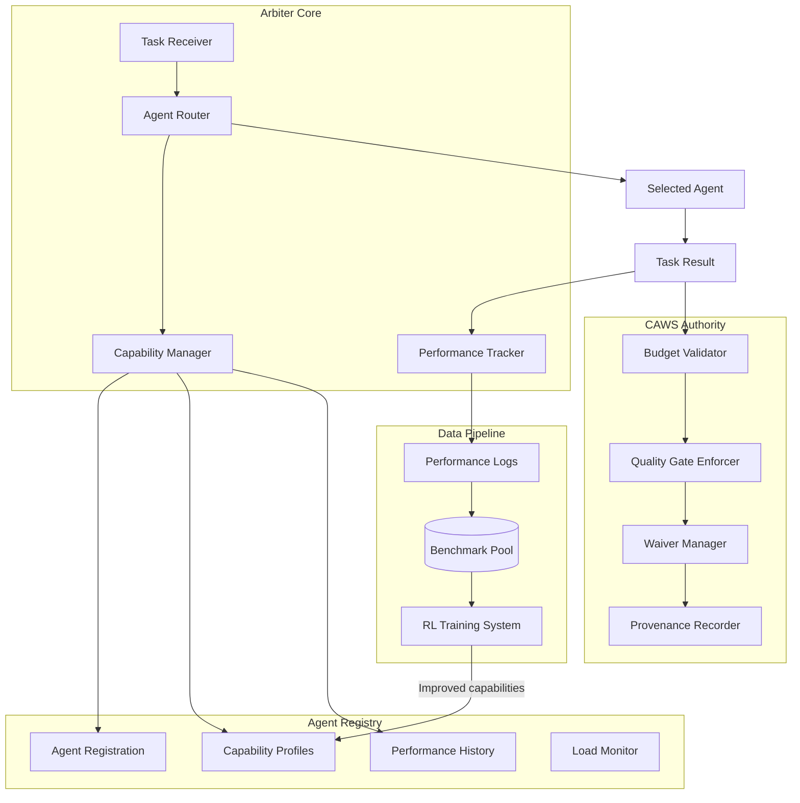

# Core Orchestration: Arbiter & CAWS Constitutional Authority

## Overview

The Core Orchestration layer implements the arbiter system—a CAWS-enforcing orchestrator that routes tasks intelligently, tracks performance continuously, and serves as the constitutional authority for all AI-assisted development work.

**Key Innovation**: The arbiter doesn't just coordinate agents; it systematically generates training data through performance tracking, creating the foundation for the RL training pipeline.

---

## Core Responsibilities

### 1. CAWS Constitutional Authority

The arbiter enforces CAWS policies as executable contracts:

- **Budget Validation**: No task exceeds `max_files` or `max_loc` limits
- **Quality Gate Enforcement**: Tests, lints, coverage requirements must pass
- **Waiver Management**: Validates exception requests against policy
- **Provenance Tracking**: Immutable audit trail of all decisions

### 2. Intelligent Task Routing

Multi-armed bandit approach to agent selection:

- **Capability-Based Routing**: Match tasks to agent strengths
- **Performance History**: Prefer agents with proven success
- **Load Balancing**: Distribute work across available agents
- **Fallback Strategies**: Handle agent failures gracefully

### 3. Performance Tracking for RL

Every orchestration decision generates training data:

- **Routing Decisions**: Which agent was chosen and why
- **Execution Metrics**: Success/failure, quality scores, latency
- **Evaluation Outcomes**: CAWS gate results, rubric scores
- **Agent Feedback**: Tool usage patterns, thinking efficiency

### 4. Cross-Agent Learning

Share knowledge across the agent ecosystem:

- **Best Practice Propagation**: Distribute successful patterns
- **Failure Mode Analysis**: Learn from mistakes
- **Capability Evolution**: Track skill development over time
- **Collaborative Intelligence**: Collective improvement

---

## Architecture Overview



---

## Key Features

### Memory-Aware Agent Management

- **Capability Profiling**: Track agent skills, performance patterns, evolution
- **Historical Analysis**: Leverage past experiences for better assignments
- **Adaptive Routing**: Dynamically adjust based on agent learning
- **Performance Prediction**: Estimate success probability for task-agent combinations

### Intelligent Task Coordination

- **Context-Aware Routing**: Use memory and context for optimal assignment
- **Multi-Armed Bandit**: Balance exploration vs exploitation in agent selection
- **Priority Management**: Handle urgent tasks with intelligent queuing
- **Dependency Resolution**: Manage complex task dependencies

### System Health & Monitoring

- **Real-Time Metrics**: Track system performance and agent health
- **Predictive Monitoring**: Identify issues before they impact performance
- **Automated Recovery**: Self-healing for common failure scenarios
- **Performance Analytics**: Insights into system efficiency

---

## Integration with RL Training

The orchestrator is designed from the ground up to feed the RL training pipeline:

### What Gets Tracked

Every task execution generates:

```typescript
interface OrchestrationDataPoint {
  // Context
  taskId: string;
  taskType: string;
  complexity: "trivial" | "standard" | "complex";

  // Decision
  selectedAgent: string;
  routingReason: string;
  alternativesConsidered: string[];

  // Outcome
  success: boolean;
  qualityScore: number;
  cawsCompliant: boolean;

  // Performance
  latencyMs: number;
  tokensUsed: number;
  toolCallCount: number;

  // For RL
  turnLevelData: TurnData[];
  minimalDiffMetrics: DiffMetrics;
  evaluationScores: RubricScores;
}
```

### When It's Used

- **Immediate**: Multi-armed bandit updates routing probabilities
- **Daily**: Aggregate statistics for monitoring
- **Weekly**: Batch export for RL training
- **Monthly**: Long-term capability evolution analysis

---

## Documents in This Section

- **capabilities-requirements.md** - Comprehensive capability requirements derived from POC learnings
- **theory.md** - Comprehensive arbiter stack requirements and research
- **arbiter-architecture.md** - Concrete implementation architecture
- **intelligent-routing.md** - Task routing algorithms and strategies
- **performance-tracking.md** - Data collection for RL training
- **implementation-roadmap.md** - Development timeline and milestones

---

## Success Criteria

**Routing Effectiveness**:

- ✅ Task-agent match accuracy: ≥85%
- ✅ CAWS compliance rate: 100%
- ✅ Average task latency: ≤30s

**Data Collection**:

- ✅ Performance tracking coverage: ≥95%
- ✅ Data quality validation: ≥95% clean data
- ✅ Privacy compliance: 0 violations

**RL Integration**:

- ✅ Data pipeline operational
- ✅ RL trainer consuming benchmark data
- ✅ Improved agents deployed back to arbiter

---

**The arbiter orchestrator is the foundation of V2's self-improvement capability—every decision it makes becomes an opportunity to learn and improve.**
