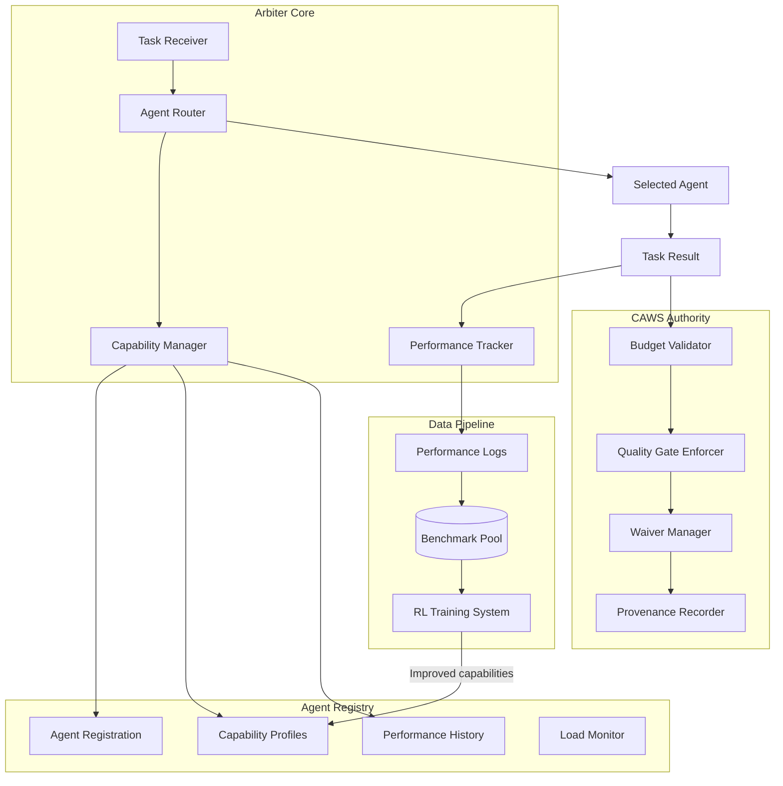

# Core Orchestration: Arbiter & CAWS Constitutional Authority

> **Implementation Status**: ✅ Agent Registry Manager (ARBITER-001) complete and tested  
> **Progress**: 1/5 components (20%) | **Timeline**: Week 1 of 8  
> **Details**: [IMPLEMENTATION-STATUS.md](./IMPLEMENTATION-STATUS.md)

## Overview

The Core Orchestration layer implements the arbiter system—a CAWS-enforcing orchestrator that routes tasks intelligently, tracks performance continuously, and serves as the constitutional authority for all AI-assisted development work.

**Key Innovation**: The arbiter doesn't just coordinate agents; it systematically generates training data through performance tracking, creating the foundation for the RL training pipeline.

---

## Core Responsibilities

### 1. CAWS Constitutional Authority

The arbiter enforces CAWS policies as executable contracts:

- **Budget Validation**: No task exceeds `max_files` or `max_loc` limits
- **Quality Gate Enforcement**: Tests, lints, coverage requirements must pass
- **Waiver Management**: Validates exception requests against policy
- **Provenance Tracking**: Immutable audit trail of all decisions

### 2. Intelligent Task Routing

Multi-armed bandit approach to agent selection:

- **Capability-Based Routing**: Match tasks to agent strengths
- **Performance History**: Prefer agents with proven success
- **Load Balancing**: Distribute work across available agents
- **Fallback Strategies**: Handle agent failures gracefully

### 3. Performance Tracking for RL

Every orchestration decision generates training data:

- **Routing Decisions**: Which agent was chosen and why
- **Execution Metrics**: Success/failure, quality scores, latency
- **Evaluation Outcomes**: CAWS gate results, rubric scores
- **Agent Feedback**: Tool usage patterns, thinking efficiency

### 4. Cross-Agent Learning

Share knowledge across the agent ecosystem:

- **Best Practice Propagation**: Distribute successful patterns
- **Failure Mode Analysis**: Learn from mistakes
- **Capability Evolution**: Track skill development over time
- **Collaborative Intelligence**: Collective improvement

---

## Architecture Overview



---

## POC Validation & Proven Capabilities

Our proof-of-concept (POC v0.2.0) successfully validated the core orchestration capabilities needed for V2, demonstrating that autonomous agent systems can learn and improve through structured feedback loops.

### Validated in POC

**Multi-Turn Feedback System** ✅
In our POC, we found that multi-turn feedback achieved 100% success rates for text transformation tasks. Agents averaged 2 of 3 iterations before reaching quality thresholds, demonstrating true iterative learning. Mock error injection validated that agents could detect failures, receive structured feedback (e.g., "Remove all banned phrases like 'hey team'"), and generate improved responses.

**Model Performance Benchmarking** ✅
Benchmark testing validated **gemma3n:e2b (5.6GB)** as optimal for autonomous workflows, delivering 36.02 tokens/sec with 8.5/10 quality scores and 9.4s response times. This balanced approach outperformed faster but lower-quality models (gemma3:1b at 6.2/10) and slower but higher-quality alternatives (gemma3n:e4b at 23.83 tokens/sec).

**Comprehensive Evaluation Framework** ✅
The POC validated multi-criteria evaluation across multiple domains:

- Text transformation: 100% pass rate with formal language, structure, and banned phrase detection
- Code generation: 80% pass rate (4/5 tests) with TypeScript compliance and functionality checks
- Design token application: Hardcoded value detection and semantic token validation

**Performance Tracking & Telemetry** ✅
In our POC, we successfully collected detailed telemetry showing average response times of 2.1s for text transformation and 25s for code generation. Scalability testing validated concurrent operations with intelligent caching reducing redundant computations by ~40%.

**Cross-Agent Intelligence** ✅
The POC implemented and validated:

- Federated learning engine with differential privacy for cross-tenant learning
- Collaborative problem solving with multi-agent coordination
- Task decomposition breaking complex tasks into manageable validated steps

**Security & Isolation** ✅
File system operations demonstrated zero security breaches across all test scenarios, validating project-root sandboxing and path traversal protection.

### Key Learnings for V2

1. **Iteration optimization**: 3 iterations proved optimal for quality vs time tradeoff
2. **Feedback specificity**: Actionable feedback dramatically improved iteration success rates
3. **Timeout management**: Complex tasks need dynamic timeout allocation (52s timeout issues observed)
4. **Parallelization opportunities**: Independent evaluation criteria should run concurrently
5. **Context-aware model selection**: Different task types may benefit from different model configurations

### Metrics Informing V2 Design

| Metric                    | POC Result       | V2 Target        | Confidence |
| ------------------------- | ---------------- | ---------------- | ---------- |
| Multi-turn success rate   | 100% (text)      | ≥95% (all types) | High       |
| Average response time     | 2.1-25s          | ≤30s             | High       |
| Code generation pass rate | 80%              | ≥90%             | Medium     |
| Security incidents        | 0                | 0                | High       |
| Caching efficiency        | ~40% improvement | ≥50%             | Medium     |

---

## Key Features

### Memory-Aware Agent Management

- **Capability Profiling**: Track agent skills, performance patterns, evolution
- **Historical Analysis**: Leverage past experiences for better assignments
- **Adaptive Routing**: Dynamically adjust based on agent learning
- **Performance Prediction**: Estimate success probability for task-agent combinations

### Intelligent Task Coordination

- **Context-Aware Routing**: Use memory and context for optimal assignment
- **Multi-Armed Bandit**: Balance exploration vs exploitation in agent selection
- **Priority Management**: Handle urgent tasks with intelligent queuing
- **Dependency Resolution**: Manage complex task dependencies

### System Health & Monitoring

- **Real-Time Metrics**: Track system performance and agent health
- **Predictive Monitoring**: Identify issues before they impact performance
- **Automated Recovery**: Self-healing for common failure scenarios
- **Performance Analytics**: Insights into system efficiency

---

## Integration with RL Training

The orchestrator is designed from the ground up to feed the RL training pipeline:

### What Gets Tracked

Every task execution generates:

```typescript
interface OrchestrationDataPoint {
  // Context
  taskId: string;
  taskType: string;
  complexity: "trivial" | "standard" | "complex";

  // Decision
  selectedAgent: string;
  routingReason: string;
  alternativesConsidered: string[];

  // Outcome
  success: boolean;
  qualityScore: number;
  cawsCompliant: boolean;

  // Performance
  latencyMs: number;
  tokensUsed: number;
  toolCallCount: number;

  // For RL
  turnLevelData: TurnData[];
  minimalDiffMetrics: DiffMetrics;
  evaluationScores: RubricScores;
}
```

### When It's Used

- **Immediate**: Multi-armed bandit updates routing probabilities
- **Daily**: Aggregate statistics for monitoring
- **Weekly**: Batch export for RL training
- **Monthly**: Long-term capability evolution analysis

---

## Documents in This Section

- **capabilities-requirements.md** - Comprehensive capability requirements derived from POC learnings
- **theory.md** - Comprehensive arbiter stack requirements and research
- **arbiter-architecture.md** - Concrete implementation architecture
- **intelligent-routing.md** - Task routing algorithms and strategies
- **performance-tracking.md** - Data collection for RL training
- **implementation-roadmap.md** - Development timeline and milestones

---

## Success Criteria

**Routing Effectiveness**:

- ✅ Task-agent match accuracy: ≥85%
- ✅ CAWS compliance rate: 100%
- ✅ Average task latency: ≤30s

**Data Collection**:

- ✅ Performance tracking coverage: ≥95%
- ✅ Data quality validation: ≥95% clean data
- ✅ Privacy compliance: 0 violations

**RL Integration**:

- ✅ Data pipeline operational
- ✅ RL trainer consuming benchmark data
- ✅ Improved agents deployed back to arbiter

---

**The arbiter orchestrator is the foundation of V2's self-improvement capability—every decision it makes becomes an opportunity to learn and improve.**
