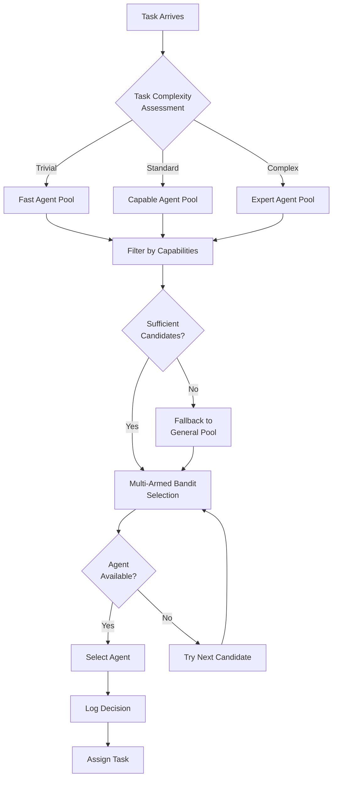

# Intelligent Routing: Multi-Armed Bandit & Capability Matching

**Author**: @darianrosebrook

---

## Executive Summary

Intelligent routing is the core decision-making component of the arbiter orchestrator. It uses multi-armed bandit algorithms, capability matching, and performance history to route tasks to the optimal agent while continuously learning which routing strategies work best.

**Key Innovation**: Every routing decision is both an immediate optimization (pick the best agent now) and a learning opportunity (gather data for future improvements).

---

## Routing Strategies

### 1. Multi-Armed Bandit (Primary Strategy)

**Purpose**: Balance exploration (try different agents) vs exploitation (use proven agents)

**Algorithm**: Epsilon-Greedy with Upper Confidence Bound (UCB)

```typescript
interface BanditState {
  // Per agent-task pair
  agentTaskPairs: Map<
    string,
    {
      attempts: number;
      successes: number;
      avgQuality: number;
      avgLatency: number;
    }
  >;

  // Global state
  totalAttempts: number;
  explorationRate: number;
  decayFactor: number;
}

class MultiArmedBanditRouter {
  async selectAgent(
    candidates: AgentProfile[],
    task: Task,
    state: BanditState
  ): Promise<RoutingDecision> {
    // Compute exploration probability (decreases over time)
    const epsilon =
      state.explorationRate * Math.pow(state.decayFactor, state.totalAttempts);

    if (Math.random() < epsilon) {
      // EXPLORE: Try underutilized agent
      return this.explore(candidates, task, state);
    } else {
      // EXPLOIT: Use best performing agent
      return this.exploit(candidates, task, state);
    }
  }

  private exploit(
    candidates: AgentProfile[],
    task: Task,
    state: BanditState
  ): RoutingDecision {
    // Upper Confidence Bound scoring
    const scored = candidates.map((agent) => {
      const pairKey = `${agent.id}:${task.type}`;
      const history = state.agentTaskPairs.get(pairKey) ?? {
        attempts: 0,
        successes: 0,
        avgQuality: 0.5,
        avgLatency: 0,
      };

      // UCB formula: mean + confidence interval
      const successRate =
        history.attempts > 0 ? history.successes / history.attempts : 0.5;

      const confidenceBonus = Math.sqrt(
        (2 * Math.log(state.totalAttempts + 1)) / (history.attempts + 1)
      );

      const ucbScore = successRate + confidenceBonus;

      return {
        agent,
        score: ucbScore,
        successRate,
        confidenceBonus,
        reason: `UCB: ${ucbScore.toFixed(3)} (success: ${(
          successRate * 100
        ).toFixed(1)}%, bonus: ${confidenceBonus.toFixed(3)})`,
      };
    });

    // Sort by score and select best
    scored.sort((a, b) => b.score - a.score);
    const selected = scored[0];

    return {
      selectedAgent: selected.agent.id,
      strategy: "multi-armed-bandit-exploit",
      confidence: selected.successRate,
      alternativesConsidered: scored.slice(1, 4),
      rationale: selected.reason,
    };
  }

  private explore(
    candidates: AgentProfile[],
    task: Task,
    state: BanditState
  ): RoutingDecision {
    // Select least-tried agent for this task type
    const sorted = candidates
      .map((agent) => {
        const pairKey = `${agent.id}:${task.type}`;
        const history = state.agentTaskPairs.get(pairKey);
        return {
          agent,
          attempts: history?.attempts ?? 0,
        };
      })
      .sort((a, b) => a.attempts - b.attempts);

    const selected = sorted[0];

    return {
      selectedAgent: selected.agent.id,
      strategy: "multi-armed-bandit-explore",
      confidence: 0.5, // Unknown, exploring
      alternativesConsidered: sorted.slice(1, 4).map((s) => ({
        agentId: s.agent.id,
        score: s.attempts,
        reason: `Attempted ${s.attempts} times`,
      })),
      rationale: `Exploration: Agent attempted only ${selected.attempts} times for ${task.type} tasks`,
    };
  }
}
```

### 2. Capability-Based Routing (Fallback)

**Purpose**: Direct matching when agent capabilities are explicit

```typescript
class CapabilityMatcher {
  async matchAgentToTask(
    task: Task,
    agents: AgentProfile[]
  ): Promise<AgentProfile[]> {
    return agents
      .filter((agent) => this.hasRequiredCapabilities(agent, task))
      .map((agent) => ({
        agent,
        matchScore: this.computeMatchScore(agent, task),
      }))
      .sort((a, b) => b.matchScore - a.matchScore)
      .map((m) => m.agent);
  }

  private computeMatchScore(agent: AgentProfile, task: Task): number {
    let score = 0;

    // Task type match
    if (agent.capabilities.taskTypes.includes(task.type)) {
      score += 0.4;
    }

    // Language match
    const languageMatches = task.requirements.filter((req) =>
      agent.capabilities.languages.includes(req)
    ).length;
    score += (languageMatches / task.requirements.length) * 0.3;

    // Specialization match
    const specializationMatches = task.requirements.filter((req) =>
      agent.capabilities.specializations.includes(req)
    ).length;
    score += (specializationMatches / task.requirements.length) * 0.3;

    return score;
  }
}
```

### 3. Load-Based Routing (Performance Optimization)

**Purpose**: Distribute workload evenly

```typescript
class LoadBalancer {
  async selectLeastLoaded(candidates: AgentProfile[]): Promise<AgentProfile> {
    return candidates
      .map((agent) => ({
        agent,
        load:
          agent.currentLoad.activeTasks + agent.currentLoad.queuedTasks * 0.5,
      }))
      .sort((a, b) => a.load - b.load)[0].agent;
  }

  async shouldRejectTask(agent: AgentProfile): Promise<boolean> {
    const maxConcurrent = 10; // Configuration
    return agent.currentLoad.activeTasks >= maxConcurrent;
  }
}
```

---

## Routing Decision Framework

### Decision Process



### Implementation

```typescript
class IntelligentRouter {
  async route(task: Task): Promise<RoutingDecision> {
    // Step 1: Assess complexity
    const complexity = await this.complexityAssessor.assess(task);

    // Step 2: Get candidate pool
    const pool = await this.getAgentPool(complexity, task.type);

    // Step 3: Filter by capabilities
    const capable = await this.capabilityMatcher.match(task, pool);

    if (capable.length === 0) {
      // Fallback to general pool
      capable.push(...(await this.getGeneralPool()));
    }

    // Step 4: Multi-armed bandit selection
    const selected = await this.multiArmedBandit.select(capable, task);

    // Step 5: Check availability
    if (await this.loadBalancer.shouldRejectTask(selected.agent)) {
      // Try next best candidate
      return this.route(task); // Recursive with updated state
    }

    // Step 6: Log decision
    await this.performanceTracker.logRoutingDecision({
      taskId: task.id,
      selectedAgent: selected.agent.id,
      strategy: selected.strategy,
      confidence: selected.confidence,
      alternativesConsidered: selected.alternatives,
      rationale: selected.rationale,
    });

    return selected;
  }
}
```

---

## Continuous Learning from Routing

### Feedback Loop

After each task completes:

```typescript
class RoutingLearner {
  async processTaskOutcome(
    task: Task,
    routing: RoutingDecision,
    outcome: TaskResult
  ): Promise<void> {
    // Update bandit state
    await this.updateBanditStatistics(routing.selectedAgent, task.type, {
      success: outcome.success,
      quality: outcome.qualityScore,
      latency: outcome.latencyMs,
    });

    // If routing failed, learn why
    if (!outcome.success) {
      await this.analyzeRoutingFailure(routing, outcome);
    }

    // If routing succeeded exceptionally, reinforce
    if (outcome.qualityScore > 0.9) {
      await this.reinforceSuccessPattern(routing, outcome);
    }

    // Update agent capabilities if new strengths discovered
    if (this.discoveredNewCapability(routing, outcome)) {
      await this.updateAgentCapabilities(routing.selectedAgent, outcome);
    }
  }
}
```

---

## Success Criteria

**Routing Accuracy**:

- ✅ Task-agent match accuracy: ≥85%
- ✅ First-choice success rate: ≥80%
- ✅ Fallback rate: ≤10%

**Learning Effectiveness**:

- ✅ Routing quality improves over time
- ✅ Exploration rate decreases appropriately
- ✅ Agent capability profiles stay current

**Performance**:

- ✅ Routing decision latency: <100ms
- ✅ Tracking overhead: <50ms
- ✅ Memory footprint: <500MB

---

**Intelligent routing ensures every task goes to the right agent while generating the data needed to make even better routing decisions in the future.**
