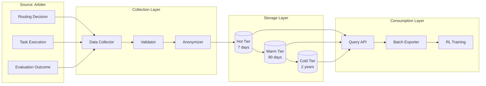

# Benchmark Data Pools: The RL Training Foundation

## Overview

The Benchmark Data infrastructure is the critical bridge between arbiter orchestration and RL training. It collects, validates, anonymizes, and manages performance data from every task execution, creating a high-quality training dataset for continuous agent improvement.

**Core Function**: Transform operational data from the arbiter into RL-ready training examples.

---

## Purpose & Value

### Why Benchmark Data Matters

**For the Arbiter**:

- Enables multi-armed bandit routing decisions
- Tracks agent capability evolution
- Identifies performance trends
- Supports load balancing

**For RL Training**:

- Provides supervised learning examples (task → correct output)
- Supplies turn-level rewards for RL optimization
- Enables curriculum learning (progressive difficulty)
- Supports failure mode analysis

**For System Improvement**:

- Measures actual vs expected performance
- Identifies training priorities
- Validates model updates
- Demonstrates ROI

---

## Data Collection Pipeline



---

## Data Schema

See `data-schema.md` for complete type definitions.

**Core Data Point**:

```typescript
interface BenchmarkDataPoint {
  // Identity
  id: string;
  timestamp: Date;

  // Context
  task: TaskContext;
  routing: RoutingContext;

  // Performance
  execution: ExecutionMetrics;
  evaluation: EvaluationMetrics;

  // For RL
  rlLabels: RLTrainingLabels;

  // Provenance
  tenantId: string; // anonymized
  cawsCompliant: boolean;
}
```

---

## Data Quality Standards

### Validation Gates

Before data enters the pool:

1. **Completeness**: All required fields present
2. **Type Safety**: Schema validation passes
3. **Privacy**: No PII in anonymized fields
4. **Bounds**: Metrics within valid ranges (e.g., quality 0-1)
5. **Consistency**: Cross-field validation (e.g., success = true → qualityScore > 0)

### Quality Thresholds

For RL training consumption:

| Training Phase      | Min Quality Score | Min Data Points | Max Age (days) |
| ------------------- | ----------------- | --------------- | -------------- |
| SFT Warmup          | 0.8               | 1,000           | 90             |
| Turn-Level RL       | 0.7               | 5,000           | 60             |
| GRPO Training       | 0.7               | 10,000          | 90             |
| Curriculum Learning | 0.6               | 20,000          | 180            |

---

## Privacy & Anonymization

### Anonymization Strategy

```typescript
const anonymizationRules = {
  // Always anonymize
  tenantId: "hash-with-salt",
  userIds: "remove",
  filePaths: "generalize", // /path/to/user-file.ts → /[PATH]/[FILE].ts

  // Optionally anonymize
  variableNames: "keep-structure", // userName → var1
  functionNames: "keep-structure", // calculateTotal → func1

  // Never anonymize
  taskType: "keep",
  complexity: "keep",
  performanceMetrics: "keep",
  rubricScores: "keep",
};
```

### Differential Privacy

For cross-tenant learning:

```typescript
class DifferentialPrivacyNoise {
  addNoise(reward: number, sensitivity: number = 0.1): number {
    // Laplace noise for differential privacy
    const noise = this.laplaceSample(sensitivity);
    return Math.max(0, Math.min(1, reward + noise));
  }

  private laplaceSample(scale: number): number {
    const u = Math.random() - 0.5;
    return -scale * Math.sign(u) * Math.log(1 - 2 * Math.abs(u));
  }
}
```

---

## Data Access Patterns

### For Arbiter (Read)

```typescript
// Fast queries for routing decisions
const agentStats = await benchmarkPool.getAgentStatistics(agentId, {
  taskType: "code-editing",
  timeRange: "last-7-days",
});

// Returns recent performance for quick routing
```

### For RL Training (Batch Read)

```typescript
// Large batch exports for training
const trainingBatch = await benchmarkPool.exportBatch({
  minDataPoints: 5000,
  qualityThreshold: 0.7,
  taskTypes: ["code-editing", "research"],
  includeFailures: true, // Learn from failures too
  anonymize: true,
});
```

### For Analytics (Aggregate Read)

```typescript
// System-wide statistics
const stats = await benchmarkPool.getSystemStatistics({
  timeRange: "last-30-days",
  aggregateBy: "task-type",
});
```

---

## Storage Management

### Data Retention

- **Hot Tier** (7 days): Full data, fast access, in-memory + SSD
- **Warm Tier** (90 days): Full data, moderate access, SSD
- **Cold Tier** (2 years): Aggregates only, slow access, compressed storage
- **Delete**: After 2 years

### Storage Estimates

Assuming 500 tasks/day:

| Tier | Duration | Data Points | Storage Size       |
| ---- | -------- | ----------- | ------------------ |
| Hot  | 7 days   | 3,500       | ~350MB             |
| Warm | 90 days  | 45,000      | ~4.5GB             |
| Cold | 2 years  | 365,000     | ~10GB (compressed) |

**Total**: ~15GB for 2 years of data

---

## Documents in This Section

- **README.md** - This overview
- **data-schema.md** - Complete type definitions and schema
- **collection-strategy.md** - What/when/how to collect data
- **quality-gates.md** - Data validation and quality requirements

---

## Success Criteria

**Data Quality**:

- ≥95% clean data (passes validation)
- 0 privacy violations
- ≥98% schema compliance

**Data Volume**:

- ≥500 data points per week
- ≥5 task type categories
- 100% agent coverage

**RL Integration**:

- ≥1 successful batch export per week
- Data pipeline operational
- Quality-validated data for training

---

**The benchmark data pool is the memory of the system—capturing every decision and outcome to enable continuous learning and improvement.**
