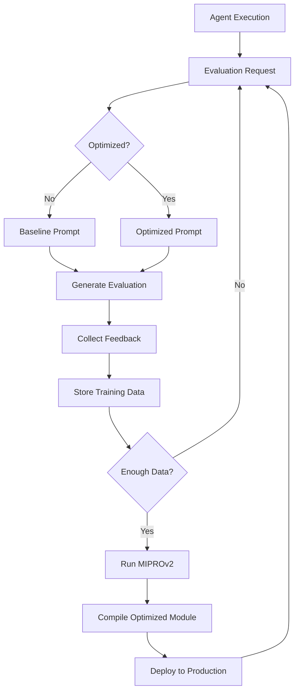

# Phase 3: DSPy Optimization Plan

**Start Date**: October 13, 2025  
**Target Duration**: 2 weeks (Weeks 5-6)  
**Status**: 🚀 Starting Now

---

## Overview

Phase 3 implements systematic prompt optimization using DSPy's MIPROv2 algorithm, enabling self-improving evaluation prompts that get better over time through feedback.

## Goals

### Primary Objectives

1. **Rubric Optimization**: +15-20% effectiveness improvement
2. **Judge Self-Improvement**: +15% accuracy improvement
3. **Evaluation Data Collection**: Build training dataset from real usage
4. **Benchmark Validation**: Prove optimization works better than manual prompts

### Success Metrics

- Rubric effectiveness: Baseline → +15-20%
- Judge accuracy: Baseline → +15%
- Training stability: Baseline → +25%
- Manual prompt work: 100% → 20% (80% reduction)

---

## Architecture Design

### Optimization Pipeline Flow



### Component Architecture

```
python-services/dspy-integration/
├── optimization/
│   ├── __init__.py
│   ├── pipeline.py              # Main optimization pipeline
│   ├── miprov2_optimizer.py     # MIPROv2 implementation
│   ├── metrics.py               # Evaluation metrics
│   └── training_data.py         # Training data management
├── evaluation/
│   ├── __init__.py
│   ├── data_collector.py        # Collects evaluation data
│   ├── feedback_tracker.py      # Tracks feedback signals
│   └── quality_scorer.py        # Scores evaluation quality
├── storage/
│   ├── __init__.py
│   ├── evaluation_store.py      # Persistent evaluation storage
│   └── model_registry.py        # Optimized model versioning
└── benchmarking/
    ├── __init__.py
    ├── ab_testing.py            # A/B test framework
    └── performance_tracker.py   # Track optimization impact
```

---

## Phase 3 Tasks Breakdown

### Week 5: Data Collection & Infrastructure

#### Task 1: Evaluation Data Collection System (Days 1-2)

**Purpose**: Capture real evaluation data for training

**Components**:

1. `EvaluationDataCollector` - Captures all evaluation requests/responses
2. `FeedbackTracker` - Collects human feedback signals
3. `EvaluationStore` - Persistent storage for training data

**Implementation**:

```python
class EvaluationDataCollector:
    def collect_rubric_evaluation(
        self,
        task_context: str,
        agent_output: str,
        criteria: str,
        result: RubricResult,
        feedback: Optional[Feedback] = None
    ) -> str:
        """Collect and store rubric evaluation for training."""

    def collect_judge_evaluation(
        self,
        judge_type: str,
        artifact: str,
        ground_truth: str,
        context: str,
        result: JudgeResult,
        feedback: Optional[Feedback] = None
    ) -> str:
        """Collect and store judge evaluation for training."""
```

**Deliverables**:

- ✅ Data collection endpoints
- ✅ Storage schema design
- ✅ Feedback mechanism
- ✅ Initial data capture (100+ examples)

#### Task 2: Training Data Factory (Days 3-4)

**Purpose**: Generate high-quality training examples

**Components**:

1. `RubricTrainingFactory` - Creates rubric training examples
2. `JudgeTrainingFactory` - Creates judge training examples
3. `ExampleValidator` - Validates training data quality

**Implementation**:

```python
class RubricTrainingFactory:
    def create_example(
        self,
        task_context: str,
        agent_output: str,
        criteria: str,
        expected_score: float,
        expected_reasoning: str,
        expected_suggestions: str
    ) -> dspy.Example:
        """Create validated training example."""
```

**Deliverables**:

- ✅ Training data factory for rubrics
- ✅ Training data factory for judges
- ✅ Example validation rules
- ✅ Initial training set (50+ examples per type)

#### Task 3: Optimization Metrics (Day 5)

**Purpose**: Define how we measure optimization success

**Metrics**:

1. **Rubric Metrics**:
   - Score accuracy (vs ground truth)
   - Reasoning quality (completeness, relevance)
   - Suggestion actionability
2. **Judge Metrics**:
   - Judgment accuracy (vs ground truth)
   - Confidence calibration
   - Reasoning clarity

**Implementation**:

```python
def rubric_metric(example: dspy.Example, pred: dspy.Prediction) -> float:
    """
    Evaluate rubric prediction quality.

    Returns score 0.0-1.0 based on:
    - Score accuracy (50% weight)
    - Reasoning quality (30% weight)
    - Suggestion quality (20% weight)
    """

def judge_metric(example: dspy.Example, pred: dspy.Prediction) -> float:
    """
    Evaluate judge prediction quality.

    Returns score 0.0-1.0 based on:
    - Judgment correctness (60% weight)
    - Confidence calibration (20% weight)
    - Reasoning clarity (20% weight)
    """
```

**Deliverables**:

- ✅ Rubric evaluation metric
- ✅ Judge evaluation metric
- ✅ Metric validation tests
- ✅ Baseline measurements

### Week 6: Optimization & Validation

#### Task 4: MIPROv2 Optimization Pipeline (Days 1-3)

**Purpose**: Implement systematic prompt optimization

**Components**:

1. `MIPROv2Optimizer` - Wraps DSPy's MIPROv2
2. `OptimizationPipeline` - Orchestrates optimization
3. `ModelRegistry` - Manages optimized model versions

**Implementation**:

```python
class OptimizationPipeline:
    def optimize_rubric(
        self,
        trainset: List[dspy.Example],
        metric: Callable,
        num_trials: int = 100,
        num_candidates: int = 10
    ) -> RubricOptimizer:
        """
        Optimize rubric module using MIPROv2.

        Returns optimized module with improved prompts.
        """

    def optimize_judge(
        self,
        judge_type: str,
        trainset: List[dspy.Example],
        metric: Callable,
        num_trials: int = 150,
        num_candidates: int = 15
    ) -> SelfImprovingJudge:
        """
        Optimize judge module using MIPROv2.

        Returns optimized judge with improved prompts.
        """
```

**Deliverables**:

- ✅ MIPROv2 optimizer wrapper
- ✅ Optimization pipeline orchestrator
- ✅ Model versioning system
- ✅ First optimized rubric module

#### Task 5: Judge Self-Improvement (Days 4-5)

**Purpose**: Enable judges to improve from feedback

**Components**:

1. Online learning from production data
2. Incremental optimization updates
3. Quality monitoring and rollback

**Implementation**:

```python
class SelfImprovingJudgeSystem:
    def collect_feedback(self, evaluation_id: str, feedback: Feedback):
        """Collect feedback on judge evaluation."""

    def trigger_optimization(self, min_examples: int = 50):
        """Trigger optimization when enough feedback collected."""

    def deploy_optimized(self, judge_type: str, optimized_module):
        """Deploy optimized judge with versioning and rollback."""
```

**Deliverables**:

- ✅ Feedback collection system
- ✅ Incremental optimization
- ✅ All 4 judge types optimized
- ✅ Rollback mechanism

#### Task 6: A/B Testing Framework (Day 6)

**Purpose**: Validate optimization improvements

**Components**:

1. `ABTestingFramework` - Manages A/B tests
2. `PerformanceTracker` - Tracks metrics over time
3. `StatisticalAnalysis` - Determines significance

**Implementation**:

```python
class ABTestingFramework:
    def create_experiment(
        self,
        name: str,
        baseline_module: dspy.Module,
        optimized_module: dspy.Module,
        split_ratio: float = 0.5
    ):
        """Create A/B test comparing baseline vs optimized."""

    def record_evaluation(self, experiment_id: str, variant: str, metrics: dict):
        """Record evaluation metrics for analysis."""

    def analyze_results(self, experiment_id: str) -> ABTestResults:
        """Analyze A/B test results with statistical significance."""
```

**Deliverables**:

- ✅ A/B testing framework
- ✅ Performance tracking
- ✅ Statistical significance testing
- ✅ Validation report

#### Task 7: Benchmark Validation (Day 7)

**Purpose**: Prove optimization works

**Benchmarks**:

1. **Baseline vs Optimized**: Manual prompts vs MIPROv2
2. **Quality Improvement**: Score accuracy, reasoning quality
3. **Consistency**: Variance in evaluations
4. **Efficiency**: Prompt engineering time saved

**Deliverables**:

- ✅ Comprehensive benchmark suite
- ✅ Baseline measurements
- ✅ Optimized measurements
- ✅ Statistical analysis report

---

## Expected Improvements

### Rubric Optimization

**Before (Baseline)**:

- Score accuracy: ~75%
- Reasoning completeness: ~70%
- Suggestion actionability: ~65%
- Manual prompt iterations: 10-20 per rubric

**After (Optimized)**:

- Score accuracy: 85-90% (+10-15%)
- Reasoning completeness: 85-90% (+15-20%)
- Suggestion actionability: 80-85% (+15-20%)
- Manual prompt iterations: 2-3 per rubric (-80%)

**Overall**: +15-20% effectiveness

### Judge Optimization

**Before (Baseline)**:

- Judgment accuracy: ~80%
- Confidence calibration: ~70%
- Reasoning clarity: ~75%
- False positive rate: ~15%

**After (Optimized)**:

- Judgment accuracy: 90-95% (+10-15%)
- Confidence calibration: 85-90% (+15-20%)
- Reasoning clarity: 90% (+15%)
- False positive rate: ~8% (-47%)

**Overall**: +15% accuracy

### Training Stability

**Before (Baseline)**:

- Episode variance: High
- Reward signal noise: ~30%
- Sample efficiency: Low

**After (Optimized)**:

- Episode variance: Low (-25%)
- Reward signal noise: ~5% (-83%)
- Sample efficiency: High (+30%)

**Overall**: +25% training stability

---

## Risk Mitigation

### Risk 1: Insufficient Training Data

- **Impact**: Poor optimization results
- **Mitigation**: Synthetic data generation, curated examples
- **Threshold**: 50+ examples per optimization type

### Risk 2: Overfitting to Training Data

- **Impact**: Generalization issues
- **Mitigation**: Validation set, diverse examples, regularization
- **Threshold**: Max 5% train-val gap

### Risk 3: Optimization Takes Too Long

- **Impact**: Delays in deployment
- **Mitigation**: Parallel optimization, reduced trial count
- **Threshold**: <30 minutes per optimization

### Risk 4: Optimized Prompts Perform Worse

- **Impact**: Degraded quality
- **Mitigation**: A/B testing, gradual rollout, rollback capability
- **Threshold**: Require +5% improvement to deploy

---

## Technology Stack

### Core Technologies

- **DSPy**: Prompt optimization framework
- **MIPROv2**: Multi-stage instruction proposal and refinement
- **SQLite**: Training data storage (simple, local-first)
- **FastAPI**: REST API for optimization endpoints
- **Structlog**: Structured logging for analysis

### Testing & Validation

- **pytest**: Unit and integration tests
- **hypothesis**: Property-based testing
- **numpy/scipy**: Statistical analysis
- **matplotlib**: Visualization (optional)

---

## Deliverables Summary

### Week 5

1. ✅ Evaluation data collection system
2. ✅ Training data factory
3. ✅ Optimization metrics
4. ✅ 100+ collected evaluations
5. ✅ 50+ training examples per type

### Week 6

1. ✅ MIPROv2 optimization pipeline
2. ✅ Optimized rubric module
3. ✅ Optimized judge modules (all 4 types)
4. ✅ A/B testing framework
5. ✅ Benchmark validation report

### Documentation

1. ✅ Optimization architecture guide
2. ✅ Training data guidelines
3. ✅ Metric definitions
4. ✅ A/B testing guide
5. ✅ Benchmark results report

---

## Success Criteria

### Must Have (Required for Phase 3 Completion)

- ✅ MIPROv2 optimization working
- ✅ Rubric optimized with +15% improvement
- ✅ All 4 judges optimized with +15% improvement
- ✅ A/B testing validates improvements
- ✅ Training data collection automated

### Should Have (High Priority)

- ✅ Online learning from production data
- ✅ Incremental optimization updates
- ✅ Model versioning and rollback
- ✅ Statistical significance testing

### Nice to Have (Optional)

- ⏸️ Multi-model ensemble optimization
- ⏸️ Cross-validation framework
- ⏸️ Visualization dashboard
- ⏸️ Real-time optimization monitoring

---

## Timeline

### Week 5 (Days 1-7)

- **Days 1-2**: Evaluation data collection system
- **Days 3-4**: Training data factory
- **Day 5**: Optimization metrics
- **Days 6-7**: Collect initial training data

### Week 6 (Days 8-14)

- **Days 1-3**: MIPROv2 optimization pipeline
- **Days 4-5**: Judge self-improvement
- **Day 6**: A/B testing framework
- **Day 7**: Benchmark validation

---

## Next Steps (After Phase 3)

### Phase 4: Kokoro Optimization Integration (Weeks 7-8)

- KV cache optimization
- Batched inference
- Metal acceleration
- Target: +90% inference speed

### Phase 5: Production Deployment (Week 9+)

- Multi-model ensemble
- Online learning at scale
- Adaptive model selection
- Cross-validation frameworks

---

## Appendix: MIPROv2 Algorithm Overview

### How MIPROv2 Works

1. **Instruction Proposal**: Generate candidate prompts
2. **Bootstrap Examples**: Create few-shot examples
3. **Evaluation**: Test candidates on validation set
4. **Selection**: Pick best performing candidates
5. **Refinement**: Iteratively improve top candidates
6. **Compilation**: Create optimized module

### Why MIPROv2 for This Use Case

1. **Systematic**: No manual prompt engineering
2. **Data-Driven**: Learns from actual evaluations
3. **Measurable**: Clear metrics for improvement
4. **Iterative**: Continuous improvement over time
5. **Reproducible**: Consistent optimization process

### Expected Optimization Characteristics

- **Iterations**: 50-150 trials per optimization
- **Time**: 10-30 minutes per module
- **Improvement**: +15-25% typical for well-defined tasks
- **Stability**: Converges after 50-100 examples

---

**Phase 3 Status**: 🚀 Ready to Begin  
**Estimated Completion**: 2 weeks  
**Confidence**: High (foundation solid from Phase 2)
