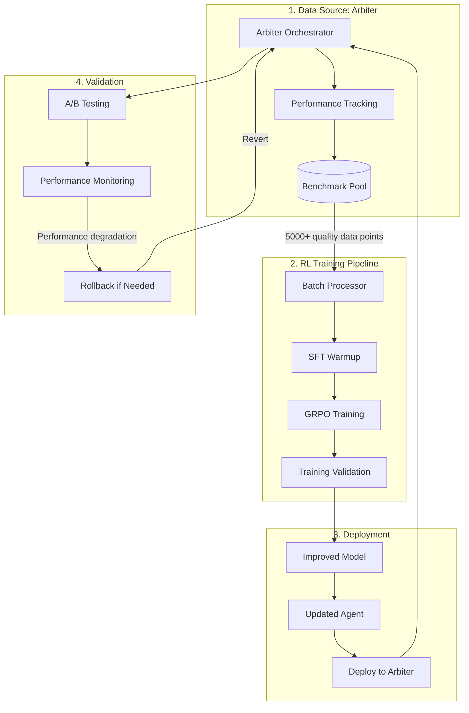

# Agent RL Training: Continuous Improvement through Reinforcement Learning

## Overview

The Agent RL Training system uses benchmark data collected from arbiter orchestration to continuously improve agent capabilities through reinforcement learning. This closes the feedback loop—better agents lead to better performance, which generates better training data, which creates even better agents.

**Core Innovation**: RL training is not a separate offline process—it's an integral part of the system that consumes operational data and deploys improvements back to production.

---

## Purpose & Integration

### The Feedback Loop

### Prerequisites

**Before RL Training Begins**:

- ✅ Arbiter operational and collecting data
- ✅ ≥5,000 quality benchmark data points
- ✅ Data validation gates passing (≥95% clean data)
- ✅ Privacy compliance verified
- ✅ Task type diversity (≥5 categories)

**Why These Prerequisites Matter**:

- **Insufficient data** → Training won't converge
- **Poor quality data** → Agents learn bad behaviors
- **Privacy violations** → Can't use cross-tenant learning
- **Low diversity** → Agents overfit to specific tasks

---

## RL Training Components

### 1. Extended Thinking Budgets

**From**: `technical-architecture.md` Section 1.1

**Purpose**: Optimize thinking token allocation dynamically

**Impact**: -40% token waste, prevents infinite loops

### 2. Minimal-Diff Evaluation

**From**: `technical-architecture.md` Section 1.2

**Purpose**: Prevent reward hacking through AST analysis

**Impact**: -70% unnecessary code changes

### 3. Turn-Level RL Training

**From**: `technical-architecture.md` Section 1.3

**Purpose**: Improve multi-turn conversations with intermediate rewards

**Impact**: +300% tool adoption rate

### 4. Model-Based Judges

**From**: `technical-architecture.md` Section 1.4

**Purpose**: Intelligent evaluation for subjective criteria

**Impact**: +5% evaluation accuracy

### 5. Tool Learning Framework

**From**: `technical-architecture.md` Section 1.5

**Purpose**: Teach small models to use tools effectively

**Impact**: 3-5x improvement in tool usage

### 6. Rubric Engineering (Will Brown)

**From**: `comprehensive-improvement-summary.md`

**Purpose**: Systematic reward design with explicit weights

**Impact**: +25% training effectiveness

### 7. DSPy Integration

**From**: `dspy-integration-evaluation.md`

**Purpose**: Self-improving prompts through systematic optimization

**Impact**: -80% prompt engineering overhead, +15% judge accuracy

### 8. Hierarchical Reasoning (HRM)

**From**: `hierarchical-reasoning-integration.md`

**Purpose**: Selective integration of outer loop refinement

**Impact**: +5% thinking efficiency, +15% memory generalization

---

## Training Pipeline

### Phase 1: Data Preparation

**Input**: Raw benchmark data from arbiter

**Process**:

1. Batch export from benchmark pool (5,000-10,000 points)
2. Quality validation (remove invalid data)
3. Anonymization (privacy compliance)
4. Balancing (ensure task type diversity)
5. Format conversion (RL trainer compatible)

**Output**: Clean, balanced, privacy-compliant training batch

### Phase 2: Supervised Fine-Tuning (SFT) Warmup

**Input**: High-quality examples (quality score ≥0.8)

**Process**:

1. Extract successful task completions
2. Format as input-output pairs
3. Train on correct tool usage patterns
4. Validate format learning

**Output**: Model with basic tool competence

### Phase 3: RL Fine-Tuning (GRPO)

**Input**: SFT-warmed model + diverse training batch

**Process**:

1. Generate trajectories from benchmark data
2. Compute turn-level rewards
3. Group trajectories by outcome
4. Calculate advantages using GRPO
5. Update policy network
6. Validate on held-out data

**Output**: Model optimized for multi-turn tasks

### Phase 4: Deployment & Validation

**Input**: Trained model

**Process**:

1. A/B test against current agents (10% traffic)
2. Monitor performance metrics
3. Validate improvements (≥10% quality increase)
4. Gradual rollout (10% → 50% → 100%)
5. Update arbiter agent registry

**Output**: Improved agent deployed to production

---

## Documents in This Section

- **README.md** - This overview
- **implementation-roadmap.md** - 12-week detailed development plan
- **technical-architecture.md** - Complete technical specifications
- **comprehensive-improvement-summary.md** - Podcast + Will Brown synthesis
- **rl-enhancement-evaluation.md** - Will Brown framework analysis
- **v2-agentic-rl-roadmap.md** - Detailed feature breakdown
- **dspy-integration-evaluation.md** - DSPy integration analysis
- **hierarchical-reasoning-integration.md** - HRM integration evaluation
- **final-v2-summary.md** - Complete executive summary

---

## Success Metrics

### Training Quality

- ✅ Training convergence rate: ≥90%
- ✅ Validation performance: ≥10% improvement over baseline
- ✅ No catastrophic forgetting
- ✅ Deployment success rate: ≥95%

### Agent Improvement

- ✅ Task completion rate: +25% (from 70% to 87.5%)
- ✅ Tool adoption rate: +300% (from 10% to 40%)
- ✅ Thinking efficiency: -40% token waste
- ✅ Reward hacking incidents: -70%

### System Integration

- ✅ Arbiter recognizes improved capabilities
- ✅ Routing preferences update automatically
- ✅ Performance monitoring shows improvement
- ✅ No degradation in other metrics

---

## Risk Mitigation

### Training Risks

| Risk                        | Mitigation                                | Monitoring                    |
| --------------------------- | ----------------------------------------- | ----------------------------- |
| **Training instability**    | GRPO algorithm, gradient clipping         | Convergence metrics           |
| **Catastrophic forgetting** | Regularization, validation on broad tasks | Performance on all task types |
| **Reward hacking**          | Minimal-diff analysis, model judges       | Scaffolding detection         |
| **Data quality issues**     | Quality gates, validation pipeline        | Clean data percentage         |

### Deployment Risks

| Risk                       | Mitigation                             | Monitoring                    |
| -------------------------- | -------------------------------------- | ----------------------------- |
| **Performance regression** | A/B testing, gradual rollout           | Real-time performance metrics |
| **Breaking changes**       | Validation suite, compatibility checks | Integration test pass rate    |
| **Rollback complexity**    | Feature flags, version management      | Deployment success rate       |

---

## Timeline

**Prerequisite**: Arbiter operational and collecting data (Weeks 1-8)

**Phase 1**: SFT Warmup (Weeks 8-10)

- After 5,000+ quality data points collected
- Train on successful examples
- Validate tool usage improvements

**Phase 2**: RL Training (Weeks 10-14)

- After 10,000+ data points with diversity
- GRPO training on trajectories
- Multi-turn optimization

**Phase 3**: Deployment (Weeks 14-16)

- A/B testing and validation
- Gradual production rollout
- Monitoring and iteration

**Phase 4**: Continuous Learning (Ongoing)

- Weekly training updates
- Continuous agent improvement
- System-wide optimization

---

**RL training transforms benchmark data into agent improvements—completing the self-improvement feedback loop that makes V2 a continuously evolving system.**
