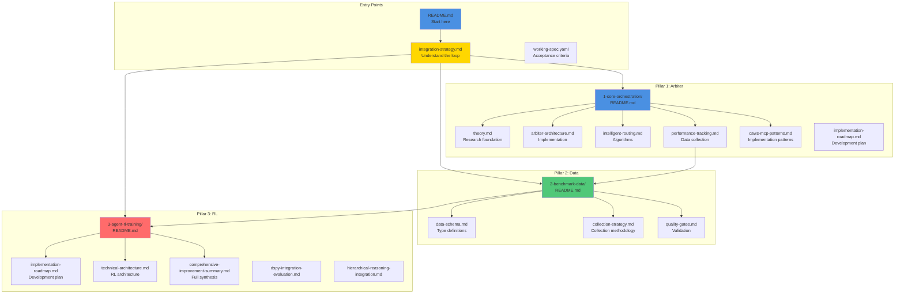

# V2 Documentation Structure

**Generated**: October 9, 2025

---

## Complete File Tree

```
iterations/v2/
├── .caws/
│   └── working-spec.yaml                         # Unified V2 spec (all 3 pillars)
│
├── docs/
│   ├── README.md                                 # Executive overview & vision
│   ├── integration-strategy.md                  # Arbiter → Data → RL feedback loop
│   ├── summary.md                                # Quick reference
│   │
│   ├── 1-core-orchestration/                   # PILLAR 1: Arbiter
│   │   ├── README.md                            # Orchestration overview
│   │   ├── theory.md                            # Comprehensive research (1,188 lines)
│   │   ├── arbiter-architecture.md              # CAWS constitutional authority
│   │   ├── intelligent-routing.md               # Multi-armed bandit algorithms
│   │   ├── performance-tracking.md              # Data collection for RL
│   │   ├── caws-mcp-patterns.md                 # CAWS MCP architecture patterns
│   │   └── implementation-roadmap.md            # Development plan (Weeks 1-8)
│   │
│   ├── 2-benchmark-data/                        # PILLAR 2: Data Infrastructure
│   │   ├── README.md                            # Data pool overview
│   │   ├── data-schema.md                       # Complete type definitions
│   │   ├── collection-strategy.md               # What/when/how to collect
│   │   └── quality-gates.md                     # Data validation requirements
│   │
│   ├── 3-agent-rl-training/                     # PILLAR 3: RL Training
│   │   ├── README.md                            # RL training overview
│   │   ├── implementation-roadmap.md            # Development plan (Weeks 8-18)
│   │   ├── technical-architecture.md            # Complete RL architecture
│   │   ├── comprehensive-improvement-summary.md # Podcast + Will Brown synthesis
│   │   ├── rl-enhancement-evaluation.md         # Will Brown framework
│   │   ├── v2-agentic-rl-roadmap.md            # Detailed features
│   │   ├── dspy-integration-evaluation.md       # DSPy integration
│   │   ├── hierarchical-reasoning-integration.md # HRM integration
│   │   └── final-v2-summary.md                  # Executive summary
│   │
│   └── api/                                      # API Contracts
│       ├── arbiter-routing.yaml                 # Orchestrator API
│       ├── benchmark-data.yaml                  # Data collection API
│       └── v2-rl-training.yaml                  # RL training API
│
├── src/                                          # Implementation (future)
│   ├── orchestrator/                            # Arbiter implementation
│   ├── benchmark/                               # Data collection
│   ├── rl/                                      # RL training
│   ├── thinking/                                # Thinking budgets
│   └── evaluation/                              # Enhanced evaluation
│
└── REORGANIZATION_COMPLETE.md                    # This reorganization summary
```

---

## Document Count

**Total**: 26 files

**By Category**:

- Core Docs: 3 (README, integration-strategy, summary)
- Orchestration: 7 docs
- Benchmark Data: 4 docs
- RL Training: 9 docs
- API Specs: 3 specs

**By Type**:

- Markdown: 23 files
- YAML: 3 files

---

## Integration Map



---

## Reading Paths

### For Executives/Product

1. `README.md` - Vision and overview
2. `integration-strategy.md` - The feedback loop
3. `3-agent-rl-training/final-v2-summary.md` - Impact and metrics

### For Architects

1. `README.md` - System overview
2. `integration-strategy.md` - Component integration
3. `1-core-orchestration/caws-mcp-patterns.md` - Implementation patterns
4. `1-core-orchestration/arbiter-architecture.md` - Arbiter design
5. `2-benchmark-data/data-schema.md` - Data structures
6. `3-agent-rl-training/technical-architecture.md` - RL architecture

### For Developers

1. `1-core-orchestration/README.md` - Start with orchestration
2. `1-core-orchestration/caws-mcp-patterns.md` - Implementation patterns to follow
3. `1-core-orchestration/implementation-roadmap.md` - What to build first
4. `2-benchmark-data/collection-strategy.md` - How to collect data
5. `3-agent-rl-training/implementation-roadmap.md` - RL development plan

### For Data Scientists

1. `2-benchmark-data/README.md` - Data infrastructure
2. `2-benchmark-data/data-schema.md` - Schema details
3. `3-agent-rl-training/rl-enhancement-evaluation.md` - Will Brown framework
4. `3-agent-rl-training/dspy-integration-evaluation.md` - DSPy integration

### For Researchers

1. `1-core-orchestration/theory.md` - Comprehensive arbiter research (1,188 lines)
2. `3-agent-rl-training/comprehensive-improvement-summary.md` - Full synthesis
3. `3-agent-rl-training/hierarchical-reasoning-integration.md` - HRM analysis

---

## API Quick Reference

### Arbiter Routing API

**File**: `api/arbiter-routing.yaml`

**Key Endpoints**:

- `POST /arbiter/route` - Route task to agent
- `GET /arbiter/agents` - List registered agents
- `GET /arbiter/agents/{id}/performance` - Agent metrics

### Benchmark Data API

**File**: `api/benchmark-data.yaml`

**Key Endpoints**:

- `POST /benchmark/collect` - Collect data point
- `POST /benchmark/query` - Query data
- `POST /benchmark/export/rl-batch` - Export for RL training
- `GET /benchmark/statistics` - Aggregate stats

### RL Training API

**File**: `api/v2-rl-training.yaml`

**Key Endpoints**:

- See RL training documentation for details

---

## Key Concepts

**Multi-Armed Bandit**: Algorithm that balances trying new agents (exploration) vs using proven agents (exploitation)

**CAWS Constitutional Authority**: Arbiter enforces CAWS policies that no worker model can bypass

**Benchmark Data Point**: Complete record of task execution (routing + execution + evaluation) used for RL training

**Turn-Level RL**: Reinforcement learning on multi-turn conversations with intermediate rewards per action

**Minimal-Diff**: AST-based analysis that penalizes unnecessary code changes to prevent reward hacking

**Self-Improvement Loop**: Arbiter → Data → RL → Improved Agents → Better Arbiter Decisions

---

## Success Definition

V2 is successful when:

1. Arbiter routes ≥85% of tasks to optimal agents
2. Benchmark pool collects ≥95% quality data
3. RL training produces ≥10% agent improvements
4. Improved agents deploy without regressions
5. System demonstrates continuous improvement over 90 days
6. All three pillars working in integrated harmony

---

_This quick reference provides navigation through V2's comprehensive documentation—start with README.md and follow the paths that match your role._
