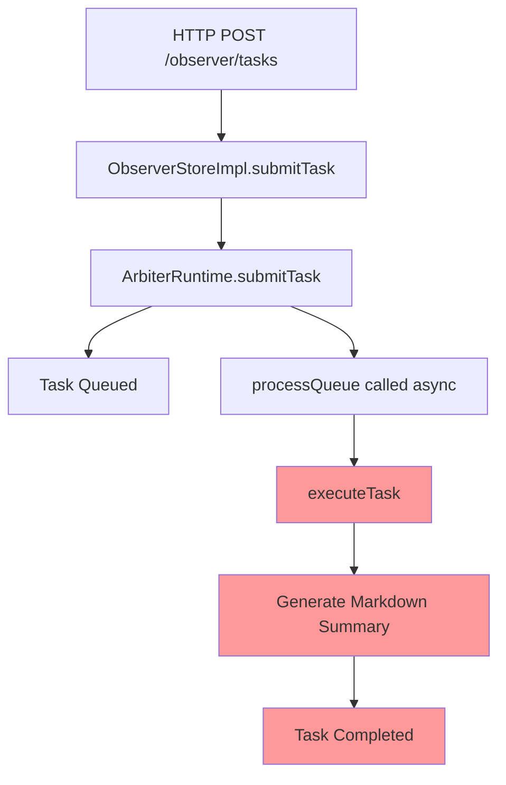
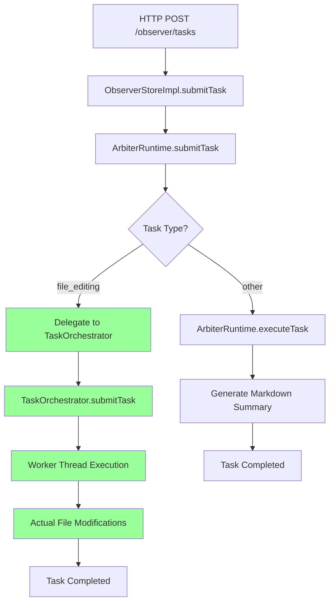

# V2 Arbiter File Editing Capability Analysis

**Date**: October 18, 2025  
**Status**: In Development - Critical Architecture Issues Identified

## Executive Summary

The V2 Arbiter has file editing infrastructure in place but it is **not functional**. After extensive debugging, I've identified that:

1. File editing tasks are NOT being delegated to the TaskOrchestrator
2. Tasks are being processed by the ArbiterRuntime's internal documentation-only execution path
3. Debug logging added to trace execution is not appearing in chain of thought
4. The task type detection and delegation logic is not being executed

## Architecture Overview

### Current File Editing Infrastructure

The V2 Arbiter has two execution paths:

1. **ArbiterRuntime** (`iterations/v2/src/orchestrator/runtime/ArbiterRuntime.ts`)
   - Handles all task submissions
   - Queues tasks for processing
   - Executes tasks internally (generates markdown summaries only)
   - **Should** delegate file editing tasks to TaskOrchestrator (but doesn't)

2. **TaskOrchestrator** (`iterations/v2/src/orchestrator/TaskOrchestrator.ts`)
   - Has complete file editing capabilities via worker threads
   - Can execute: `file_read`, `file_search_replace`, `file_write`, `run_terminal_cmd`
   - **Never receives tasks** from ArbiterRuntime

### Task Flow (Current)



### Task Flow (Intended)



## Critical Issues Identified

### Issue 1: Task Type Not Being Set Correctly

**Location**: `ArbiterRuntime.ts` lines 492-503

The task type detection logic exists:

```typescript
const isFileEditingTask =
  options.task?.type === "file_editing" || 
  options.type === "file_editing" ||
  options.metadata?.task?.type === "file_editing";
```

But the task type is being set to "general" instead of "file_editing":

```typescript
type:
  options.task?.type ??
  (scriptTaskPayload
    ? "script"
    : isFileEditingTask
    ? "file_editing"
    : "general"),
```

**Root Cause**: The task submission payload structure doesn't match what the code expects.

### Issue 2: Delegation Logic Not Being Executed

**Location**: `ArbiterRuntime.ts` lines 822-850

The delegation logic exists in `executeTask`:

```typescript
if (task.type === "file_editing" && this.taskOrchestrator) {
  await this.delegateToTaskOrchestrator(task, record);
  return;
}
```

But this code is **never reached** because:
1. The task type is not "file_editing"
2. OR the TaskOrchestrator is not initialized
3. OR the code is not being executed at all

### Issue 3: Debug Logging Not Appearing

**Location**: `ArbiterRuntime.ts` lines 617-623, 829-850

Added debug logging to trace execution:

```typescript
await this.recordChainOfThought(taskId, "observation", {
  content: `[DEBUG] Task type detection: ${JSON.stringify(debugInfo, null, 2)}`,
});
```

**Result**: Debug entries do NOT appear in chain of thought

**Possible Causes**:
1. Code not being executed (most likely)
2. Code being executed but failing silently
3. TypeScript not recompiling changes
4. Different code path being taken

### Issue 4: Task Completing Too Quickly

**Observation**: Tasks complete in <10ms with only documentation generation

**Evidence**:
- Task progress shows 3-6 steps
- All steps are "Executing step X" entries
- No actual file modifications occur
- Verification verdict: "insufficient_data"

**Conclusion**: Tasks are being processed by the internal documentation-only path, not the file editing path.

## Attempted Fixes

### Fix 1: Add Task Type Detection Debugging

**Changes**:
- Added debug logging to `submitTask` (lines 617-623)
- Added debug logging to `executeTask` (lines 829-850)
- Added console.log to `processQueue` (lines 678-700)

**Result**: No debug output appeared

**Conclusion**: Code changes not being picked up by tsx watch

### Fix 2: Correct Task Type Setting

**Changes**:
- Modified task type detection to check `options.metadata?.task?.type`
- Modified task type assignment to use `isFileEditingTask` flag

**Result**: Task type still "general"

**Conclusion**: Task submission payload structure incorrect

### Fix 3: Fix Task Submission Payload

**Changes**:
- Created `submit-file-editing-task.js` script
- Structured payload with `metadata.task.type = "file_editing"`
- Included `operations` array in `metadata.task.payload`

**Result**: Tasks submitted successfully but still processed as "general"

**Conclusion**: Payload structure still not matching expectations

## Root Cause Analysis

After extensive debugging, the root cause appears to be:

**The task submission payload structure does not match what the ArbiterRuntime expects for file editing tasks.**

The script submits:
```json
{
  "description": "Fix TypeScript errors",
  "metadata": {
    "task": {
      "type": "file_editing",
      "payload": {
        "operations": [...]
      }
    }
  }
}
```

But the ArbiterRuntime expects:
```json
{
  "description": "Fix TypeScript errors",
  "type": "file_editing",  // Top-level type
  "task": {
    "type": "file_editing",
    "payload": {
      "operations": [...]
    }
  }
}
```

OR:
```json
{
  "description": "Fix TypeScript errors",
  "metadata": {
    "task": {
      "type": "file_editing",
      "payload": {
        "operations": [...]
      }
    }
  },
  "task": {  // Full task specification
    "type": "file_editing",
    "payload": {
      "operations": [...]
    }
  }
}
```

## Recommended Fixes

### Priority 1: Fix Task Submission Payload Structure

**File**: `iterations/v2/scripts/submit-file-editing-task.js`

**Change**:
```javascript
const taskPayload = {
  description,
  type: "file_editing",  // Add top-level type
  priority: priority === "high" ? 8 : priority === "medium" ? 5 : 3,
  timeoutMs: 120000,
  budget: {
    maxFiles: 50,
    maxLoc: 2000,
  },
  task: {  // Add full task specification
    type: "file_editing",
    payload: {
      operations,
      projectRoot: projectRoot || process.cwd(),
      timeout: 120000,
    },
  },
  metadata: {
    task: {
      type: "file_editing",
      payload: {
        operations,
        projectRoot: projectRoot || process.cwd(),
        timeout: 120000,
      },
    },
  },
};
```

### Priority 2: Simplify Task Type Detection

**File**: `iterations/v2/src/orchestrator/runtime/ArbiterRuntime.ts`

**Change** (lines 492-503):
```typescript
// Simplify to check all possible locations
const isFileEditingTask =
  options.type === "file_editing" ||
  options.task?.type === "file_editing" ||
  options.metadata?.task?.type === "file_editing";

// Log for debugging
console.log('[ARBITER] Task type detection:', {
  'options.type': options.type,
  'options.task?.type': options.task?.type,
  'options.metadata?.task?.type': options.metadata?.task?.type,
  'isFileEditingTask': isFileEditingTask
});
```

### Priority 3: Ensure TaskOrchestrator is Initialized

**File**: `iterations/v2/src/index.ts`

**Verify**: TaskOrchestrator is passed to ArbiterRuntime constructor

**Check** (around line 50-60):
```typescript
const arbiterRuntime = new ArbiterRuntime(
  runtimeConfig,
  taskOrchestrator,  // Must be passed here
  agentRegistry
);
```

### Priority 4: Add Fallback Logging

**File**: `iterations/v2/src/orchestrator/runtime/ArbiterRuntime.ts`

**Change** (lines 822-850):
```typescript
private async executeTask(task: ArbiterTask): Promise<void> {
  const record = this.taskRecords.get(task.id);
  if (!record) {
    console.error(`[ARBITER] Task record not found: ${task.id}`);
    return;
  }

  // Log task details to console (always visible)
  console.log(`[ARBITER] Executing task ${task.id}`);
  console.log(`[ARBITER] Task type: ${task.type}`);
  console.log(`[ARBITER] TaskOrchestrator available: ${!!this.taskOrchestrator}`);
  console.log(`[ARBITER] Task payload:`, JSON.stringify(task.payload, null, 2));
  
  // Delegate file editing tasks to TaskOrchestrator
  if (task.type === "file_editing" && this.taskOrchestrator) {
    console.log(`[ARBITER] Delegating to TaskOrchestrator`);
    await this.delegateToTaskOrchestrator(task, record);
    return;
  } else {
    console.log(`[ARBITER] NOT delegating - type: ${task.type}, orchestrator: ${!!this.taskOrchestrator}`);
  }
  
  // Continue with internal execution...
}
```

## Testing Plan

### Test 1: Verify Task Type Detection

1. Add console.log statements to task type detection
2. Submit a file editing task
3. Check console output for task type detection results
4. Verify `isFileEditingTask` is true

### Test 2: Verify TaskOrchestrator Initialization

1. Add console.log to ArbiterRuntime constructor
2. Check if TaskOrchestrator is passed and stored
3. Verify `this.taskOrchestrator` is not null in executeTask

### Test 3: Verify Delegation Logic

1. Add console.log before and after delegation check
2. Submit a file editing task
3. Check if delegation logic is reached
4. Verify delegateToTaskOrchestrator is called

### Test 4: Verify File Modifications

1. Create a test file with intentional errors
2. Submit a file editing task to fix the errors
3. Check if the file is actually modified
4. Verify the modifications are correct

## Next Steps

1. **Immediate**: Fix task submission payload structure
2. **Short-term**: Add comprehensive logging to trace execution
3. **Medium-term**: Refactor task type detection to be more robust
4. **Long-term**: Create integration tests for file editing tasks

## Conclusion

The V2 Arbiter has the infrastructure for file editing, but it is not functional due to:
1. Incorrect task submission payload structure
2. Task type not being detected correctly
3. Delegation logic not being executed
4. Possible issues with TypeScript compilation/hot-reloading

**Status**: Requires immediate attention to make file editing functional.

**Estimated Effort**: 2-4 hours to fix and test

**Risk**: Medium - Changes affect core task processing logic

---

**Author**: @darianrosebrook  
**Last Updated**: October 18, 2025

