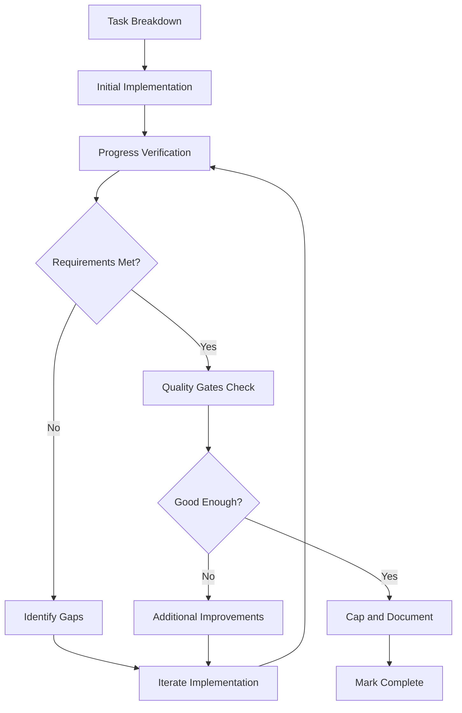

# Iteration Methodology Guide

> **Document Type**: Methodology & Process Document  
> **Status**: Describes development methodology and process guidelines  
> **Implementation Status**: See [COMPONENT_STATUS_INDEX.md](../../COMPONENT_STATUS_INDEX.md) for actual completion  
> **Current Reality**: 68% complete - Some processes described here may not be fully implemented

## Overview

This guide provides practical instructions for implementing the **iteration loop** - the systematic approach to task completion and quality assurance in Agent Agency development.

## Quick Reference

### Iteration Loop Flowchart



### Decision Checklist

Use this checklist at each iteration point:

#### Functional Completeness ✅

- [ ] All acceptance criteria addressed?
- [ ] Core user flows working end-to-end?
- [ ] Integration points functioning correctly?

#### Quality Standards ✅

- [ ] Tests passing at required coverage levels?
- [ ] Linting and type checking clean?
- [ ] Performance within acceptable bounds?

#### Code Quality ✅

- [ ] SOLID principles followed?
- [ ] No critical technical debt introduced?
- [ ] Documentation updated and accurate?

#### Risk Assessment ✅

- [ ] Security vulnerabilities addressed?
- [ ] Scalability concerns mitigated?
- [ ] Maintenance burden acceptable?

## Phase-by-Phase Guide

### Phase 1: Task Breakdown and Planning

**Goal**: Create clear, verifiable milestones

#### Steps:

1. **Read the CAWS spec** - Understand acceptance criteria
2. **Break down into subtasks** - Each should be independently verifiable
3. **Define success metrics** - What "done" looks like for each subtask
4. **Estimate effort** - Rough time estimates for planning

#### Example:

```
Task: Implement User Authentication
├── Subtask 1: Password hashing (2 hours)
├── Subtask 2: JWT token generation (3 hours)
├── Subtask 3: Login endpoint (4 hours)
├── Subtask 4: Middleware validation (2 hours)
└── Subtask 5: Error handling (2 hours)
```

### Phase 2: Initial Implementation

**Goal**: Working code that addresses core requirements

#### Steps:

1. **Implement core functionality first**
2. **Write basic tests** - Ensure core paths work
3. **Manual testing** - Verify end-to-end flows
4. **Address critical bugs** - Don't proceed with known blockers

#### Focus Areas:

- Correctness over optimization
- Basic integration points
- Error handling for common cases

### Phase 3: Progress Verification Loop

**Goal**: Systematic gap analysis and improvement

#### For Each Iteration:

1. **Run verification checklist** (see above)
2. **Execute tests** - Unit, integration, manual
3. **Check acceptance criteria** - Mark completed items
4. **Identify specific gaps** - Be specific about what's missing

#### Gap Analysis Template:

```
VERIFICATION RESULTS - Iteration #2

COMPLETED:
- User registration endpoint working
- Password validation implemented
- Basic error responses

GAPS IDENTIFIED:
- Password reset flow missing
- Email confirmation not implemented
- Rate limiting not added

NEXT ITERATION PLAN:
1. Implement password reset (2 hours)
2. Add email confirmation (3 hours)
3. Add rate limiting (1 hour)
```

### Phase 4: Quality Gates Check

**Goal**: Automated verification before manual review

#### Automated Gates:

```bash
# Run all quality checks
npm run lint          # Code style
npm run typecheck     # Type safety
npm test             # Unit tests
npm run test:coverage # Coverage thresholds
npm run test:security # Security scanning
```

#### Manual Gates:

- [ ] Code review completed
- [ ] Documentation updated
- [ ] Performance acceptable
- [ ] Security review passed

### Phase 5: Good Enough Determination

**Goal**: Decide whether to ship or iterate further

#### Good Enough Criteria:

**Must Have** (Blockers):

- [ ] Core functionality works
- [ ] No critical bugs
- [ ] Tests pass
- [ ] Security issues resolved

**Should Have** (Strong preference):

- [ ] Good performance
- [ ] Clean code
- [ ] Comprehensive tests
- [ ] Documentation complete

**Nice to Have** (Enhancements):

- [ ] Advanced features
- [ ] Performance optimizations
- [ ] Additional test coverage

#### Decision Framework:

```typescript
function shouldShip(feature: Feature): boolean {
  const mustHaveScore = calculateMustHaveScore(feature);
  const shouldHaveScore = calculateShouldHaveScore(feature);
  const timePressure = checkTimePressure();
  const businessValue = assessBusinessValue(feature);

  // Ship if must-haves are complete and either:
  // 1. Should-haves are mostly complete, or
  // 2. Time pressure is high, or
  // 3. Business value is delivered

  return (
    mustHaveScore >= 0.9 &&
    (shouldHaveScore >= 0.7 || timePressure || businessValue >= 0.8)
  );
}
```

### Phase 6: Capping and Documentation

**Goal**: Prepare for production and knowledge transfer

#### Completion Checklist:

- [ ] Update CAWS spec status
- [ ] Document known limitations
- [ ] Create improvement backlog items
- [ ] Update architecture diagrams
- [ ] Add troubleshooting guides

#### Documentation Template:

```
COMPLETION SUMMARY

Component: User Authentication Service
Status: PRODUCTION READY

Core Features:
User registration and login
Password reset flow
JWT token management
Basic rate limiting

Known Limitations:
⚠️ Email confirmation requires SMTP setup
⚠️ Advanced rate limiting could be enhanced
⚠️ Password policies are basic

Future Improvements:
Add OAuth integration (Medium priority)
Implement advanced security monitoring (Low priority)
Add biometric authentication (Future consideration)

Testing Coverage: 92%
Performance SLA: Met (P95 < 500ms)
Security Review: Passed
```

## Common Iteration Scenarios

### Scenario 1: Feature Mostly Works, Minor Issues

**Symptoms:**

- Core functionality working
- Tests mostly passing
- A few edge cases failing
- Performance acceptable

**Decision:** Often ship with known issues documented

**Action Plan:**

1. Document edge cases as known limitations
2. Create bug tickets for fixes
3. Ensure core user flows work perfectly

### Scenario 2: Performance Issues

**Symptoms:**

- Functionality complete
- Tests passing
- Response times too slow
- Memory usage high

**Decision:** Depends on severity

**Action Plan:**

1. Assess if performance meets minimum SLAs
2. If not, optimize critical paths
3. Document performance limitations
4. Create optimization tickets for future

### Scenario 3: Scope Creep Risk

**Symptoms:**

- Original requirements met
- New "nice-to-have" features suggested
- Timeline slipping
- Complexity increasing

**Decision:** Cap at current scope

**Action Plan:**

1. Evaluate business value of additions
2. Defer enhancements to future iterations
3. Document as separate feature requests
4. Ship current implementation

### Scenario 4: Quality vs. Timeline Tension

**Symptoms:**

- Code works but quality concerns
- Tests incomplete
- Documentation missing
- Deadline approaching

**Decision:** Balance based on risk

**Action Plan:**

1. Prioritize critical quality issues
2. Add basic documentation
3. Create technical debt tickets
4. Ship with quality improvement plan

## Tools and Commands

### Verification Commands

```bash
# Quick verification
npm run verify        # All quality checks
npm run test:quick    # Fast test run
npm run lint:check    # Code quality check

# Detailed analysis
npm run test:coverage # Coverage report
npm run perf:test     # Performance benchmarks
npm run security:scan # Security analysis
```

### Documentation Commands

```bash
# Update specs
caws validate --update-status

# Generate docs
npm run docs:generate
npm run api:docs

# Architecture diagrams
npm run diagrams:update
```

### Iteration Tracking

```bash
# Create iteration record
npm run iteration:log -- --component=user-auth --iteration=3

# Update progress
npm run progress:update -- --task=ARBITER-001 --status=complete

# Generate reports
npm run reports:iteration
npm run reports:quality
```

## Best Practices

### Know When to Stop

**Ship When:**

- Core requirements satisfied
- Critical user flows working
- Quality gates passed
- No blocking security issues
- Business value delivered

**Don't Ship When:**

- Core functionality broken
- Critical security vulnerabilities
- Data corruption risks
- System stability issues

### Handling Perfectionism

**Signs of Over-Engineering:**

- Gold-plating features
- Optimizing before measuring
- Adding features not requested
- Complex solutions for simple problems

**Countermeasures:**

- Regular time-boxing
- Feature flag for enhancements
- Separate improvement backlog
- Focus on user value

### Team Communication

**Iteration Updates:**

```
Iteration #2 Complete - User Authentication

Progress: 80% complete (4/5 subtasks done)
Status: On track, minor gaps identified
⚠️ Blockers: None
Next: Password reset implementation

Timeline: 2 days remaining
Risk: Low
```

**Completion Announcements:**

```
User Authentication - COMPLETE

All acceptance criteria met
Tests passing (92% coverage)
Performance SLAs achieved
Security review passed

Future Enhancements:
- OAuth integration (Q1 2026)
- Advanced rate limiting (Q2 2026)
- Biometric auth (Future)

Ready for production deployment.
```

## Troubleshooting

### Common Issues

**Issue**: Iteration loop feels endless
**Solution**: Set strict time limits, focus on high-impact items first

**Issue**: Quality keeps getting deprioritized
**Solution**: Make quality checks non-negotiable, automate where possible

**Issue**: Scope keeps expanding
**Solution**: Use MoSCoW method, defer nice-to-haves explicitly

**Issue**: Team disagrees on "good enough"
**Solution**: Define clear criteria upfront, involve stakeholders

### Getting Help

- **Architecture Questions**: Refer to theory.md
- **Quality Standards**: Check CAWS specifications
- **Technical Issues**: Review implementation guides
- **Process Questions**: Consult team leads

---

## Related Documents

- [Theory Document](./theory.md) - Academic background and principles
- [CAWS Specifications](../../specs/) - Detailed requirements
- [Quality Gates](./quality-gates.md) - Automated verification
- [Development Workflow](./development-workflow.md) - Process integration

---

**Last Updated**: October 10, 2025
**Version**: 1.0
**Authors**: @darianrosebrook
