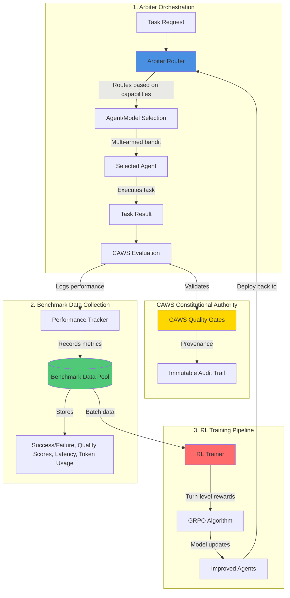

# V2 Integration Strategy: Arbiter ↔ Benchmark Data ↔ RL Training

## Executive Summary

Agent Agency V2 represents a paradigm shift from static orchestration to a **self-improving multi-agent system**. The key innovation is that the arbiter orchestrator doesn't just coordinate agents—it systematically generates the training data needed to continuously improve those agents through reinforcement learning.

**The Three Pillars**:

1. **Arbiter Orchestration** - CAWS-enforcing orchestrator with intelligent task routing
2. **Benchmark Data Pools** - Performance metrics from every arbiter decision
3. **RL Training** - Continuous agent improvement using benchmark data

**The Core Insight**: Every routing decision, every evaluation, every success/failure becomes a training example.

## Current Implementation Status

**Overall Integration**: 60% Complete

- **Arbiter → Data Flow**: 🟢 Operational (routing + tracking working)
- **Data → RL Flow**: 🟡 Partial (export pipeline incomplete)
- **RL → Arbiter Flow**: 🟡 Partial (deployment pipeline needs work)
- **Full Feedback Loop**: 🟡 60% complete

**For Details**: See [COMPONENT_STATUS_INDEX.md](../COMPONENT_STATUS_INDEX.md)

---

## System Architecture: The Feedback Loop



---

## Data Flow: From Orchestration to Improvement

### Stage 1: Arbiter Makes Routing Decision

**Input**: Task arrives with context, complexity, requirements

**Process**:

```typescript
// Arbiter receives task
const task = {
  id: "TASK-001",
  type: "code-editing",
  complexity: "standard",
  requirements: ["TypeScript", "AST analysis"],
};

// Selects agent based on capability tracking
const agent = await arbiter.selectAgent(task, {
  strategy: "multi-armed-bandit",
  historicalPerformance: true,
  currentLoad: true,
});

// Logs routing decision
await benchmarkCollector.logRoutingDecision({
  taskId: task.id,
  selectedAgent: agent.id,
  routingReason: "Best success rate for AST tasks (85%)",
  alternativesConsidered: [agent2, agent3],
});
```

**Output**: Agent assignment with rationale

### Stage 2: Agent Execution & Evaluation

**Process**:

```typescript
// Agent executes task
const result = await agent.execute(task);

// CAWS evaluation
const evaluation = await cawsEvaluator.evaluate(result, {
  qualityGates: ["tests-pass", "lint-clean", "minimal-diff"],
  rubricScores: true,
  minimalDiffAnalysis: true,
});

// Performance tracking
await benchmarkCollector.logExecution({
  taskId: task.id,
  agentId: agent.id,
  success: evaluation.passed,
  qualityScore: evaluation.overallScore,
  latencyMs: result.executionTime,
  tokensUsed: result.tokenCount,
  evaluationScores: evaluation.rubricScores,
  minimalDiffMetrics: evaluation.diffAnalysis,
});
```

**Output**: Benchmark data point ready for RL training

### Stage 3: RL Training Consumption

**Process**:

```typescript
// RL trainer queries benchmark data
const trainingBatch = await benchmarkPool.getBatch({
  minDataPoints: 1000,
  taskTypes: ["code-editing", "research"],
  timeRange: "last-30-days",
  qualityThreshold: 0.7,
});

// Computes turn-level rewards
const trajectories = await rlTrainer.convertToTrajectories(trainingBatch);
const rewards = await rlTrainer.computeTurnLevelRewards(trajectories);

// Updates agent policies
const modelUpdate = await grpoTrainer.train(trajectories, rewards);

// Deploys improved agents back to arbiter
await arbiter.updateAgentCapabilities(modelUpdate);
```

**Output**: Improved agents with better task-handling capabilities

---

## Timeline: Phased Rollout

### Phase 1: Arbiter & Performance Tracking (Weeks 1-8)

**Objective**: Deploy intelligent orchestrator with comprehensive data collection

**Deliverables**:

- CAWS constitutional authority arbiter
- Multi-armed bandit task routing
- Capability tracking for all agents
- Performance data collection pipeline
- Memory-aware orchestration

**Data Collection Starts**: Day 1

- Every routing decision logged
- Every evaluation outcome captured
- Building benchmark data pool

**Success Metrics**:

- 100% task routing coverage with logged rationale
- Performance data for ≥90% of agent executions
- Capability profiles for all registered agents

### Phase 2: Benchmark Data Infrastructure (Weeks 4-10)

**Objective**: Production-ready data storage with RL-ready formatting

**Deliverables**:

- Data schema optimized for RL consumption
- Quality validation gates
- Privacy-preserving anonymization
- Data pipeline with batch export

**Parallel to Phase 1**: Starts after initial data collection

**Success Metrics**:

- ≥10,000 benchmark data points collected
- Data quality validation passing (≥95% clean data)
- Anonymization ensuring tenant privacy

### Phase 3: RL Training Pipeline (Weeks 8-16)

**Objective**: Train agents using accumulated benchmark data

**Deliverables**:

- Turn-level RL trainer
- Rubric engineering framework
- Minimal-diff evaluator integration
- DSPy prompt optimization

**Prerequisites**: ≥5,000 quality benchmark data points

**Success Metrics**:

- RL training converges (≥90% stability)
- Agent improvements measurable (≥10% quality increase)
- Model updates deployable without breaking changes

### Phase 4: Closed-Loop Integration (Weeks 14-20)

**Objective**: Continuous learning system operational

**Deliverables**:

- RL-improved agents deployed to arbiter
- Automated training pipeline
- Performance validation framework
- Continuous monitoring

**Success Metrics**:

- Agents show continuous improvement over time
- Arbiter routing preferences adapt to agent capabilities
- System demonstrates self-improvement

---

## Integration Points

### Arbiter ← Benchmark Data

**Direction**: Arbiter writes to benchmark data pool

**Interface**:

```typescript
interface BenchmarkCollector {
  logRoutingDecision(decision: RoutingDecision): Promise<void>;
  logExecution(execution: ExecutionMetrics): Promise<void>;
  logEvaluation(evaluation: EvaluationOutcome): Promise<void>;
}
```

**Frequency**: Every task execution (real-time)

**Data Volume**: ~100-1000 data points per day (depending on usage)

### Benchmark Data ← RL Training

**Direction**: RL reads from benchmark data pool

**Interface**:

```typescript
interface BenchmarkPool {
  getBatch(criteria: BatchCriteria): Promise<BenchmarkDataPoint[]>;
  getStatistics(timeRange: TimeRange): Promise<DataStatistics>;
  validateQuality(dataPoints: BenchmarkDataPoint[]): Promise<ValidationResult>;
}
```

**Frequency**: Batch processing (daily/weekly)

**Data Volume**: 1000-10000 data points per training run

### RL Training → Arbiter

**Direction**: RL deploys improved agents back to arbiter

**Interface**:

```typescript
interface AgentRegistry {
  updateAgentCapabilities(update: CapabilityUpdate): Promise<void>;
  deployImprovedAgent(agent: Agent, modelUpdate: ModelUpdate): Promise<void>;
  validateAgentPerformance(agent: Agent): Promise<ValidationResult>;
}
```

**Frequency**: After successful RL training (weekly/bi-weekly)

**Impact**: Arbiter routing preferences update based on new capabilities

---

## Success Metrics by Pillar

### Arbiter Orchestration Metrics

**Routing Effectiveness**:

- Task-agent match accuracy: ≥85%
- Average task completion time: ≤30s
- CAWS compliance rate: 100%

**Performance Tracking**:

- Data collection coverage: ≥95%
- Routing decision logging: 100%
- Evaluation outcome capture: ≥90%

### Benchmark Data Pool Metrics

**Data Quality**:

- Clean data percentage: ≥95%
- Schema validation pass rate: ≥98%
- Privacy violations: 0

**Data Volume**:

- Data points per week: ≥500
- Task type diversity: ≥5 categories
- Agent coverage: 100% of registered agents

### RL Training Metrics

**Training Performance**:

- Convergence rate: ≥90%
- Training stability: ≥95% runs successful
- Model update deployment success: ≥95%

**Agent Improvement**:

- Quality score increase: ≥10% per training cycle
- Task completion rate improvement: ≥5% per month
- Tool adoption rate: ≥300% (from baseline)

---

## Risk Mitigation

### Technical Risks

| Risk                           | Mitigation                                             | Monitoring                        |
| ------------------------------ | ------------------------------------------------------ | --------------------------------- |
| **Insufficient training data** | Start collecting immediately, lower training threshold | Daily data volume checks          |
| **Data quality issues**        | Validation gates, quality scoring                      | Automated quality reports         |
| **RL training instability**    | Feature flags, fallback to rule-based routing          | Training convergence metrics      |
| **Performance degradation**    | A/B testing before deployment, rollback capability     | Continuous performance monitoring |

### Operational Risks

| Risk                    | Mitigation                              | Monitoring               |
| ----------------------- | --------------------------------------- | ------------------------ |
| **Privacy violations**  | Strict anonymization, tenant isolation  | Automated privacy scans  |
| **System complexity**   | Modular design, clear interfaces        | Architecture reviews     |
| **Deployment failures** | Blue-green deployments, gradual rollout | Deployment success rates |

---

## Conclusion: The Self-Improving System

V2's innovation is not just better orchestration or better RL training—it's the **tight integration** that creates a self-improving feedback loop:

1. **Arbiter makes intelligent routing decisions** based on current agent capabilities
2. **Every decision generates training data** capturing what works and what doesn't
3. **RL training uses this data** to improve agent capabilities
4. **Improved agents are deployed back** to the arbiter
5. **Arbiter learns the new capabilities** and routes accordingly
6. **Cycle repeats continuously**

This transforms Agent Agency from a static tool into an **evolving intelligence** that gets better with every task it handles.

**Next Steps**: Implement Phase 1 (Arbiter & Performance Tracking) to begin data collection immediately.
