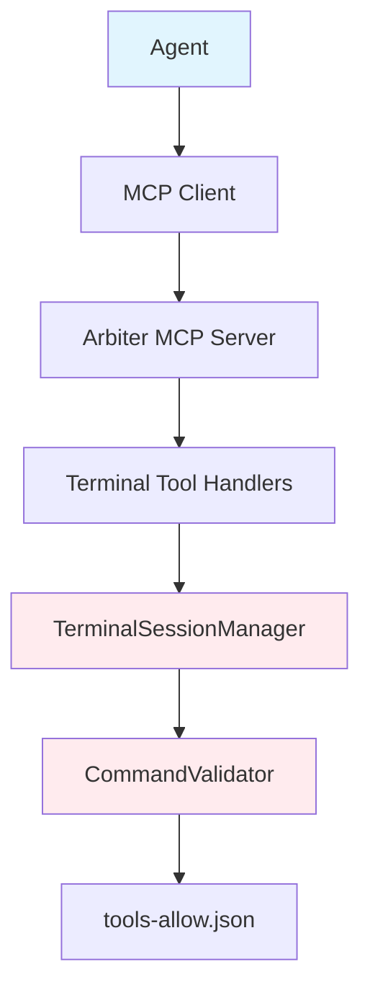

# Terminal Access for Task Runner Agents

> **Document Type**: Component Documentation  
> **Status**: Describes component capabilities and implementation  
> **Implementation Status**: See [COMPONENT_STATUS_INDEX.md](../../COMPONENT_STATUS_INDEX.md) for actual completion  
> **Current Reality**: 68% complete - This component may not reflect overall system status

**Component**: INFRA-005 - MCP Terminal Access Layer  
**Status**: Production Ready  
**Risk Tier**: 1 (Critical - Command Execution)

---

## Overview

The MCP Terminal Access Layer enables task runner agents to execute commands securely through isolated terminal sessions. This provides agents with the ability to run tests, install dependencies, build projects, and perform other development tasks while maintaining comprehensive security controls.

### Key Features

- **🔒 Security-First**: Command allowlist, argument validation, and resource limits
- **🛡️ Isolated Sessions**: Each task gets its own sandboxed environment
- **📊 Audit Logging**: Complete provenance tracking of all terminal operations
- **⚡ Performance Controls**: Timeout enforcement and output size limits
- **🔧 MCP Integration**: Seamless integration with existing agent workflows

---

## Architecture



### Components

1. **TerminalSessionManager**: Core session lifecycle management
2. **CommandValidator**: Security validation and allowlist enforcement
3. **MCP Tool Handlers**: Protocol translation between MCP and terminal operations
4. **ArbiterMCPServer**: MCP server with terminal tool registration

---

## Quick Start

### 1. Enable Terminal Access

Set the environment variable to enable terminal access:

```bash
export ENABLE_TERMINAL_ACCESS=true
```

### 2. Basic Agent Workflow

```typescript
// Create a terminal session for your task
const session = await mcp.call("terminal_create_session", {
  taskId: "BUILD-001",
  agentId: "build-agent",
});

// Execute commands in the session
const installResult = await mcp.call("terminal_execute_command", {
  sessionId: session.sessionId,
  command: "npm",
  args: ["install"],
});

const testResult = await mcp.call("terminal_execute_command", {
  sessionId: session.sessionId,
  command: "npm",
  args: ["test"],
});

// Check session status
const status = await mcp.call("terminal_get_status", {
  sessionId: session.sessionId,
});

// Cleanup when done
await mcp.call("terminal_close_session", {
  sessionId: session.sessionId,
});
```

---

## MCP Tools

### `terminal_create_session`

Creates a new isolated terminal session for task execution.

#### Request

```json
{
  "taskId": "BUILD-001",
  "agentId": "build-agent",
  "workingDirectory": "/workspace/project",
  "environment": {
    "NODE_ENV": "test",
    "CI": "true"
  }
}
```

#### Response

```json
{
  "success": true,
  "sessionId": "term-BUILD-001-1697123456789",
  "workingDirectory": "/workspace/project",
  "createdAt": "2025-10-13T12:34:56Z"
}
```

#### Parameters

- `taskId` (required): Unique task identifier
- `agentId` (required): Agent identifier
- `workingDirectory` (optional): Working directory (defaults to project root)
- `environment` (optional): Additional environment variables

---

### `terminal_execute_command`

Executes a validated command in an existing terminal session.

#### Request

```json
{
  "sessionId": "term-BUILD-001-1697123456789",
  "command": "npm",
  "args": ["test", "--coverage"],
  "timeout": 120000
}
```

#### Response

```json
{
  "success": true,
  "exitCode": 0,
  "stdout": "All tests passed\nCoverage: 95%\n",
  "stderr": "",
  "duration": 5432,
  "truncated": false
}
```

#### Parameters

- `sessionId` (required): Session ID from create_session
- `command` (required): Command to execute (must be allowlisted)
- `args` (optional): Command arguments
- `timeout` (optional): Timeout in milliseconds (default: 60000, max: 300000)

---

### `terminal_close_session`

Closes a terminal session and cleans up all resources.

#### Request

```json
{
  "sessionId": "term-BUILD-001-1697123456789"
}
```

#### Response

```json
{
  "success": true,
  "message": "Session closed and resources freed",
  "sessionId": "term-BUILD-001-1697123456789"
}
```

#### Parameters

- `sessionId` (required): Session ID to close

---

### `terminal_get_status`

Retrieves current status and metadata for a terminal session.

#### Request

```json
{
  "sessionId": "term-BUILD-001-1697123456789"
}
```

#### Response

```json
{
  "success": true,
  "session": {
    "id": "term-BUILD-001-1697123456789",
    "taskId": "BUILD-001",
    "agentId": "build-agent",
    "workingDirectory": "/workspace/project",
    "state": "completed",
    "createdAt": "2025-10-13T12:34:56Z",
    "lastCommandAt": "2025-10-13T12:35:23Z",
    "commandCount": 3
  }
}
```

#### Parameters

- `sessionId` (required): Session ID to query

---

## Security Model

### Command Allowlist

All commands must be present in `apps/tools/caws/tools-allow.json`:

```json
[
  "node",
  "npm",
  "pnpm",
  "yarn",
  "git",
  "docker",
  "python",
  "pytest",
  "echo",
  "cat",
  "ls",
  "sleep"
]
```

**Allowlist Management**:

- Commands are explicitly approved for security
- File is version-controlled and auditable
- Updates require security review

### Argument Validation

Arguments are validated to prevent injection attacks:

#### ✅ Allowed

```json
["test", "--coverage", "--verbose"]
["install", "express", "--save"]
["status", "--short"]
```

#### ❌ Blocked (Security Violations)

```json
["test; rm -rf /"]          // Shell chaining
["test $(whoami)"]          // Command substitution
["test `cat /etc/passwd`"]   // Command substitution
["test $PATH/../../../"]     // Variable expansion
```

### Environment Variable Sanitization

Sensitive environment variables are automatically filtered:

```typescript
// ✅ Preserved
NODE_ENV=test
CI=true
CAWS_TASK_ID=TASK-001

// ❌ Filtered
AWS_SECRET_ACCESS_KEY=...
DATABASE_PASSWORD=...
API_KEY=...
```

### Resource Limits

| Resource            | Limit                 | Purpose                     |
| ------------------- | --------------------- | --------------------------- |
| Concurrent Sessions | 50                    | Prevent resource exhaustion |
| Command Timeout     | 60s default, 300s max | Prevent runaway processes   |
| Output Size         | 1MB per command       | Prevent memory exhaustion   |
| Session Lifetime    | Task duration         | Automatic cleanup           |

---

## Common Patterns

### Node.js Project Workflow

```typescript
async function buildNodeProject(taskId: string, agentId: string) {
  // Create session
  const session = await mcp.call("terminal_create_session", {
    taskId,
    agentId,
    workingDirectory: "./project",
  });

  try {
    // Install dependencies
    await mcp.call("terminal_execute_command", {
      sessionId: session.sessionId,
      command: "npm",
      args: ["ci"],
    });

    // Run linting
    await mcp.call("terminal_execute_command", {
      sessionId: session.sessionId,
      command: "npm",
      args: ["run", "lint"],
    });

    // Run tests
    const testResult = await mcp.call("terminal_execute_command", {
      sessionId: session.sessionId,
      command: "npm",
      args: ["test", "--coverage"],
    });

    // Build
    await mcp.call("terminal_execute_command", {
      sessionId: session.sessionId,
      command: "npm",
      args: ["run", "build"],
    });

    return { success: true, testResults: testResult };
  } finally {
    // Always cleanup
    await mcp.call("terminal_close_session", {
      sessionId: session.sessionId,
    });
  }
}
```

### Git Operations

```typescript
async function gitWorkflow(taskId: string, agentId: string) {
  const session = await mcp.call("terminal_create_session", {
    taskId,
    agentId,
  });

  try {
    // Check status
    await mcp.call("terminal_execute_command", {
      sessionId: session.sessionId,
      command: "git",
      args: ["status", "--short"],
    });

    // Add changes
    await mcp.call("terminal_execute_command", {
      sessionId: session.sessionId,
      command: "git",
      args: ["add", "."],
    });

    // Commit
    await mcp.call("terminal_execute_command", {
      sessionId: session.sessionId,
      command: "git",
      args: ["commit", "-m", "Automated commit"],
    });

    return { success: true };
  } finally {
    await mcp.call("terminal_close_session", {
      sessionId: session.sessionId,
    });
  }
}
```

---

## Error Handling

### Common Error Codes

| Error Code              | Description                          | Resolution                                  |
| ----------------------- | ------------------------------------ | ------------------------------------------- |
| `COMMAND_NOT_ALLOWED`   | Command not in allowlist             | Use allowlisted command or request addition |
| `UNSAFE_ARGUMENTS`      | Arguments contain injection attempts | Sanitize arguments                          |
| `SESSION_NOT_FOUND`     | Session ID invalid                   | Create new session                          |
| `TIMEOUT_EXCEEDED`      | Command took too long                | Increase timeout or optimize command        |
| `EXECUTION_ERROR`       | Command failed to execute            | Check command syntax and environment        |
| `INVALID_PARAMETERS`    | Missing or invalid parameters        | Check API documentation                     |
| `MAX_SESSIONS_EXCEEDED` | Too many concurrent sessions         | Wait for sessions to complete               |

### Error Response Format

```json
{
  "success": false,
  "error": "COMMAND_NOT_ALLOWED",
  "message": "Command 'rm' is not allowed",
  "details": {
    "command": "rm",
    "allowedCommands": ["npm", "git", "node", "echo"]
  }
}
```

### Timeout Handling

```typescript
// Commands that might take longer need explicit timeout
const result = await mcp.call("terminal_execute_command", {
  sessionId: session.sessionId,
  command: "npm",
  args: ["run", "integration-tests"],
  timeout: 300000, // 5 minutes for integration tests
});
```

---

## Monitoring & Observability

### Event Types

The terminal layer emits events for monitoring:

```typescript
// Session lifecycle events
terminal: session: created;
terminal: session: closed;

// Command execution events
terminal: command: executed;
terminal: command: failed;
terminal: security: violation;
```

### Metrics to Monitor

```typescript
// Key metrics for alerting
- Active sessions count (should not exceed 50)
- Command execution success rate (>95%)
- Security violation rate (should be 0)
- Average command duration (<5000ms)
- Output truncation rate (<1%)
```

### Logging

All terminal operations are logged with:

- Timestamp, session ID, task ID, agent ID
- Command executed (sanitized)
- Exit code, duration, output size
- Security violations with full context

---

## Configuration

### Environment Variables

```bash
# Enable/disable terminal access (default: false)
ENABLE_TERMINAL_ACCESS=true

# Allowlist file path (default: ./apps/tools/caws/tools-allow.json)
TERMINAL_ALLOWLIST_PATH=./apps/tools/caws/tools-allow.json

# Default command timeout (default: 60000ms)
TERMINAL_DEFAULT_TIMEOUT=60000

# Maximum command timeout (default: 300000ms)
TERMINAL_MAX_TIMEOUT=300000

# Maximum output size (default: 1048576 bytes)
TERMINAL_MAX_OUTPUT_SIZE=1048576

# Maximum concurrent sessions (default: 50)
TERMINAL_MAX_SESSIONS=50
```

### Allowlist File Format

```json
{
  "commands": [
    "node",
    "npm",
    "git",
    "docker",
    "python",
    "pytest",
    "echo",
    "cat",
    "ls",
    "grep",
    "find"
  ],
  "version": "1.0.0",
  "lastUpdated": "2025-10-13",
  "securityReview": "APPROVED"
}
```

---

## Troubleshooting

### Command Not Allowed

**Problem**: Getting `COMMAND_NOT_ALLOWED` error
**Solution**:

1. Check if command is in `tools-allow.json`
2. Request addition to allowlist if legitimate
3. Use alternative allowlisted command

### Session Not Found

**Problem**: Getting `SESSION_NOT_FOUND` error
**Solution**:

1. Ensure session was created successfully
2. Check session ID is correct
3. Sessions auto-expire with task completion

### Timeout Errors

**Problem**: Commands timing out
**Solution**:

1. Increase timeout parameter (max 300s)
2. Optimize command performance
3. Break long commands into smaller steps

### Output Truncated

**Problem**: Command output is truncated
**Solution**:

1. Output is limited to 1MB per command
2. Use output redirection or split commands
3. Check `truncated` flag in response

### High Resource Usage

**Problem**: Too many concurrent sessions
**Solution**:

1. Limit concurrent task execution
2. Close sessions promptly after use
3. Monitor session count metrics

---

## Security Best Practices

### For Agent Developers

1. **Always validate inputs** before passing to commands
2. **Use allowlisted commands** only
3. **Set appropriate timeouts** for long-running commands
4. **Handle errors gracefully** - don't expose internal errors
5. **Clean up sessions** in finally blocks
6. **Log security-relevant actions** for audit

### For Operators

1. **Monitor security violations** - should be zero in normal operation
2. **Review allowlist changes** carefully
3. **Set resource limits** appropriate for your environment
4. **Enable audit logging** for compliance
5. **Regular security reviews** of allowlist and usage patterns

---

## API Reference

### TypeScript Types

```typescript
interface TerminalSession {
  id: string;
  taskId: string;
  agentId: string;
  workingDirectory: string;
  environment: Record<string, string>;
  state: "idle" | "running" | "completed" | "failed";
  createdAt: Date;
  lastCommandAt?: Date;
  commandCount?: number;
}

interface CommandExecutionResult {
  success: boolean;
  exitCode: number;
  stdout: string;
  stderr: string;
  duration: number;
  truncated?: boolean;
  error?: string;
}
```

---

## Examples

### Complete CI/CD Pipeline

```typescript
async function runCIPipeline(projectPath: string) {
  const session = await mcp.call("terminal_create_session", {
    taskId: "CI-001",
    agentId: "ci-agent",
    workingDirectory: projectPath,
  });

  const results = [];

  try {
    // Install dependencies
    results.push(
      await mcp.call("terminal_execute_command", {
        sessionId: session.sessionId,
        command: "npm",
        args: ["ci"],
      })
    );

    // Lint
    results.push(
      await mcp.call("terminal_execute_command", {
        sessionId: session.sessionId,
        command: "npm",
        args: ["run", "lint"],
      })
    );

    // Test
    results.push(
      await mcp.call("terminal_execute_command", {
        sessionId: session.sessionId,
        command: "npm",
        args: ["test", "--coverage"],
        timeout: 120000,
      })
    );

    // Build
    results.push(
      await mcp.call("terminal_execute_command", {
        sessionId: session.sessionId,
        command: "npm",
        args: ["run", "build"],
      })
    );

    return {
      success: results.every((r) => r.success),
      results,
    };
  } finally {
    await mcp.call("terminal_close_session", {
      sessionId: session.sessionId,
    });
  }
}
```

---

## Related Documentation

- [CAWS Working Spec](../../components/mcp-terminal-access/.caws/working-spec.yaml)
- [Component Status](../../components/mcp-terminal-access/STATUS.md)
- [API Contract](../contracts/mcp-terminal-tools.yaml)
- [MCP Integration README](../MCP/README.md)
- [CAWS Agent Guide](../agents/full-guide.md)

---

## Support

**Component Owner**: @darianrosebrook  
**Risk Tier**: 1 (Critical)  
**Security Contact**: Security team for allowlist changes  
**Documentation Updated**: 2025-10-13

For issues or feature requests, create a CAWS working spec and submit for review.
