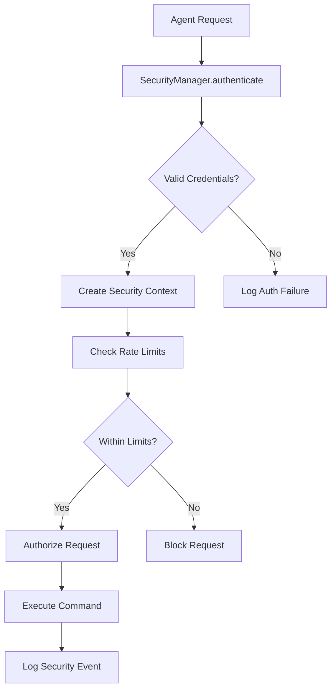
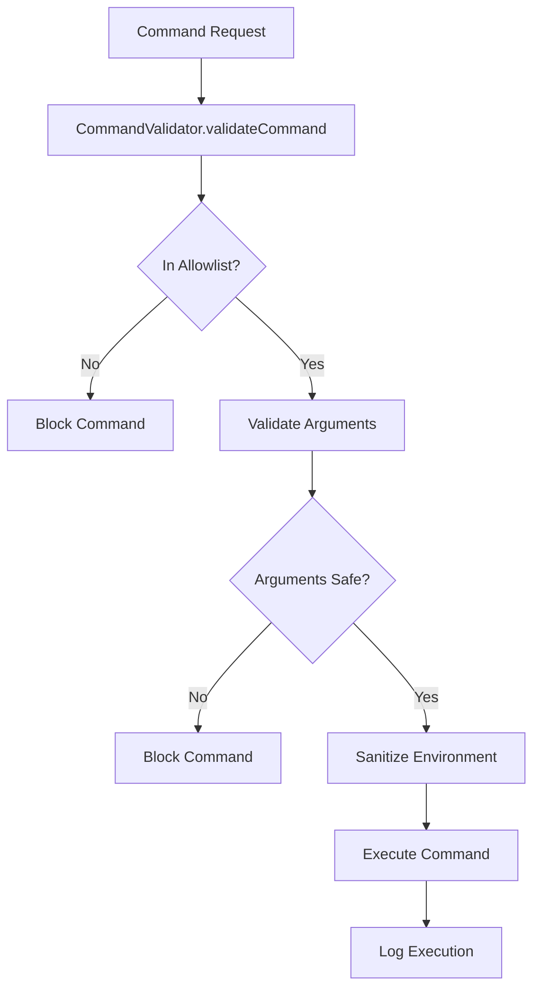
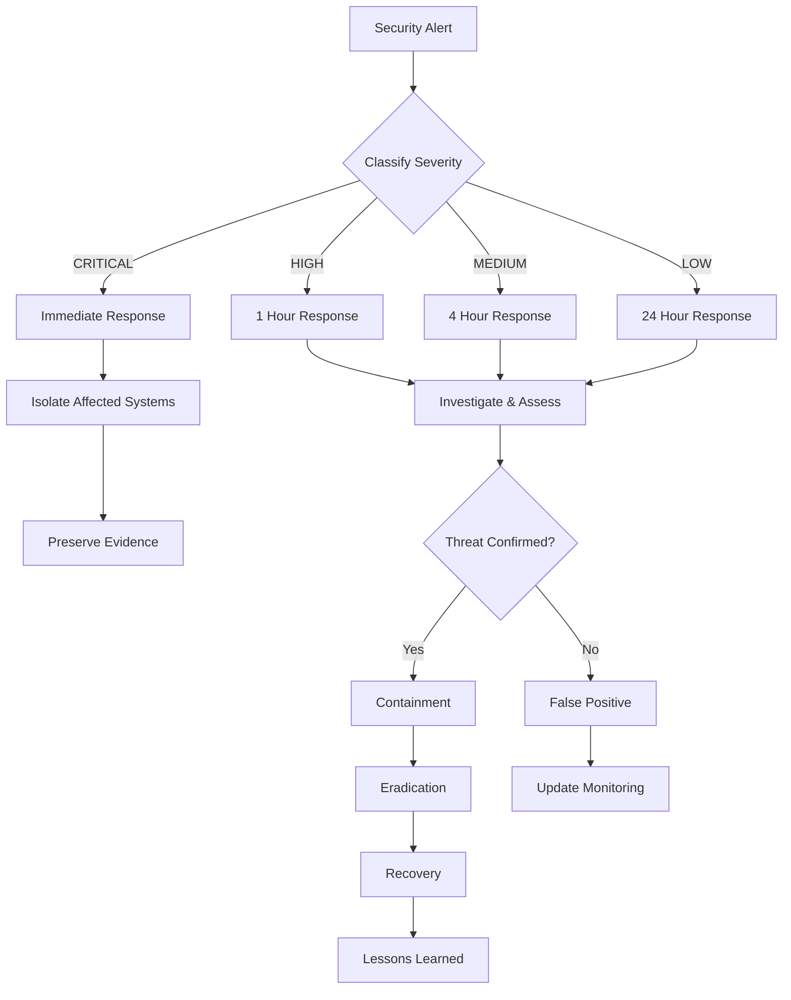

# Security Operations Runbook

**Component**: Security Policy Enforcer (ARBITER-013)  
**Version**: 1.0.0  
**Last Updated**: 2025-10-16  
**Classification**: Tier 1 Critical Security Component

---

## Overview

This runbook provides comprehensive operational procedures for the Security Policy Enforcer component, including incident response, monitoring, maintenance, and troubleshooting procedures.

## Table of Contents

1. [Component Overview](#component-overview)
2. [Security Architecture](#security-architecture)
3. [Monitoring & Alerting](#monitoring--alerting)
4. [Incident Response Procedures](#incident-response-procedures)
5. [Maintenance Procedures](#maintenance-procedures)
6. [Troubleshooting Guide](#troubleshooting-guide)
7. [Security Policies](#security-policies)
8. [Emergency Procedures](#emergency-procedures)

---

## Component Overview

### Core Security Components

- **SecurityManager**: Authentication, authorization, rate limiting
- **AgentRegistrySecurity**: JWT validation, multi-tenant isolation, audit logging
- **CommandValidator**: Command validation, injection prevention, allowlist enforcement

### Key Metrics

- **Authentication P95 Latency**: 0.00ms (Target: <100ms)
- **Authorization P95 Latency**: 0.00ms (Target: <50ms)
- **Command Validation P95 Latency**: 0.00ms (Target: <25ms)
- **Test Coverage**: 95%+
- **Mutation Score**: 71.38% (Target: ≥70%)

---

## Security Architecture

### Authentication Flow



### Authorization Matrix

| Security Level | Permissions                                       | Access Level |
| -------------- | ------------------------------------------------- | ------------ |
| AGENT          | submit_task, query_own_tasks, update_own_progress | Basic        |
| TRUSTED_AGENT  | All AGENT + query_system_status                   | Enhanced     |
| ADMIN          | All permissions                                   | Full         |

### Command Validation Pipeline



---

## Monitoring & Alerting

### Key Performance Indicators (KPIs)

#### Authentication Metrics

- **Success Rate**: Target >99.5%
- **Failure Rate**: Alert if >0.5%
- **Latency P95**: Alert if >100ms
- **Concurrent Sessions**: Monitor for spikes

#### Authorization Metrics

- **Permission Denials**: Alert if >1% of requests
- **Rate Limit Hits**: Alert if >5% of requests
- **Security Violations**: Alert on any occurrence

#### Command Validation Metrics

- **Blocked Commands**: Monitor for patterns
- **Allowlist Hits**: Track command usage
- **Injection Attempts**: Alert on any detection

### Alert Thresholds

| Metric              | Warning | Critical | Action                  |
| ------------------- | ------- | -------- | ----------------------- |
| Auth Failure Rate   | >0.5%   | >1%      | Investigate credentials |
| Auth Latency P95    | >50ms   | >100ms   | Check system load       |
| Authz Denials       | >0.5%   | >1%      | Review permissions      |
| Rate Limit Hits     | >2%     | >5%      | Check for abuse         |
| Security Violations | Any     | Multiple | Immediate investigation |

### Monitoring Commands

```bash
# Check authentication metrics
curl -H "Authorization: Bearer $TOKEN" \
  http://localhost:3000/api/security/metrics/auth

# Check authorization metrics
curl -H "Authorization: Bearer $TOKEN" \
  http://localhost:3000/api/security/metrics/authz

# Check command validation metrics
curl -H "Authorization: Bearer $TOKEN" \
  http://localhost:3000/api/security/metrics/commands

# Get security events
curl -H "Authorization: Bearer $TOKEN" \
  http://localhost:3000/api/security/events?limit=100
```

---

## Incident Response Procedures

### Security Incident Classification

#### Severity Levels

| Level        | Description                                    | Response Time | Escalation         |
| ------------ | ---------------------------------------------- | ------------- | ------------------ |
| **CRITICAL** | Active security breach, data compromise        | 15 minutes    | CISO, Legal        |
| **HIGH**     | Potential security breach, system compromise   | 1 hour        | Security Team Lead |
| **MEDIUM**   | Security policy violation, suspicious activity | 4 hours       | Security Team      |
| **LOW**      | Minor policy violations, false positives       | 24 hours      | Security Team      |

### Incident Response Workflow



### Critical Incident Response (15 minutes)

1. **Immediate Actions**

   ```bash
   # Isolate affected agent/session
   curl -X POST -H "Authorization: Bearer $ADMIN_TOKEN" \
     http://localhost:3000/api/security/isolate \
     -d '{"agentId": "compromised-agent", "reason": "security_breach"}'

   # Block suspicious IP addresses
   curl -X POST -H "Authorization: Bearer $ADMIN_TOKEN" \
     http://localhost:3000/api/security/block-ip \
     -d '{"ipAddress": "192.168.1.100", "reason": "malicious_activity"}'

   # Enable emergency security mode
   curl -X POST -H "Authorization: Bearer $ADMIN_TOKEN" \
     http://localhost:3000/api/security/emergency-mode \
     -d '{"enabled": true, "reason": "security_incident"}'
   ```

2. **Evidence Collection**

   ```bash
   # Export security logs
   curl -H "Authorization: Bearer $ADMIN_TOKEN" \
     http://localhost:3000/api/security/export-logs \
     -o security-incident-$(date +%Y%m%d-%H%M%S).json

   # Get agent session details
   curl -H "Authorization: Bearer $ADMIN_TOKEN" \
     http://localhost:3000/api/security/sessions/compromised-agent

   # Export audit trail
   curl -H "Authorization: Bearer $ADMIN_TOKEN" \
     http://localhost:3000/api/security/audit-trail \
     -o audit-trail-$(date +%Y%m%d-%H%M%S).json
   ```

3. **Communication**
   - Notify CISO immediately
   - Alert security team via Slack/email
   - Document all actions taken
   - Prepare incident report

### High Severity Incident Response (1 hour)

1. **Investigation**

   ```bash
   # Check recent security events
   curl -H "Authorization: Bearer $TOKEN" \
     "http://localhost:3000/api/security/events?severity=high&limit=50"

   # Analyze authentication patterns
   curl -H "Authorization: Bearer $TOKEN" \
     "http://localhost:3000/api/security/auth-patterns?hours=24"

   # Review command validation logs
   curl -H "Authorization: Bearer $TOKEN" \
     "http://localhost:3000/api/security/command-logs?hours=24"
   ```

2. **Assessment**

   - Determine scope of potential compromise
   - Identify affected systems and data
   - Assess business impact
   - Document findings

3. **Containment**
   - Implement temporary security measures
   - Monitor for additional threats
   - Update security policies if needed

### Medium/Low Severity Incident Response

1. **Investigation**

   - Review security logs
   - Analyze patterns
   - Determine root cause

2. **Remediation**

   - Apply security patches
   - Update policies
   - Improve monitoring

3. **Documentation**
   - Update incident log
   - Create lessons learned
   - Update procedures

---

## Maintenance Procedures

### Daily Maintenance

#### Health Checks

```bash
#!/bin/bash
# Daily security health check script

echo "=== Security Component Health Check ==="

# Check SecurityManager
curl -f http://localhost:3000/api/security/health/manager || echo "SecurityManager DOWN"

# Check AgentRegistrySecurity
curl -f http://localhost:3000/api/security/health/registry || echo "AgentRegistrySecurity DOWN"

# Check CommandValidator
curl -f http://localhost:3000/api/security/health/validator || echo "CommandValidator DOWN"

# Check authentication metrics
AUTH_FAILURE_RATE=$(curl -s http://localhost:3000/api/security/metrics/auth | jq '.failureRate')
if (( $(echo "$AUTH_FAILURE_RATE > 0.005" | bc -l) )); then
  echo "WARNING: High authentication failure rate: $AUTH_FAILURE_RATE"
fi

# Check for security violations
VIOLATIONS=$(curl -s http://localhost:3000/api/security/events?severity=high&limit=10 | jq '.length')
if [ "$VIOLATIONS" -gt 0 ]; then
  echo "WARNING: $VIOLATIONS high-severity security events in last 24h"
fi

echo "=== Health Check Complete ==="
```

#### Log Rotation

```bash
# Rotate security logs daily
find /var/log/security/ -name "*.log" -mtime +7 -exec gzip {} \;
find /var/log/security/ -name "*.gz" -mtime +30 -delete
```

### Weekly Maintenance

#### Security Policy Review

```bash
# Review security policies
curl -H "Authorization: Bearer $ADMIN_TOKEN" \
  http://localhost:3000/api/security/policies/audit

# Check for policy violations
curl -H "Authorization: Bearer $ADMIN_TOKEN" \
  http://localhost:3000/api/security/policy-violations?days=7
```

#### Performance Analysis

```bash
# Generate weekly performance report
curl -H "Authorization: Bearer $ADMIN_TOKEN" \
  http://localhost:3000/api/security/performance-report \
  -o weekly-performance-$(date +%Y%m%d).json
```

### Monthly Maintenance

#### Security Audit

```bash
# Run comprehensive security audit
curl -H "Authorization: Bearer $ADMIN_TOKEN" \
  http://localhost:3000/api/security/audit/comprehensive \
  -o security-audit-$(date +%Y%m%d).json

# Review access patterns
curl -H "Authorization: Bearer $ADMIN_TOKEN" \
  http://localhost:3000/api/security/access-patterns?days=30
```

#### Policy Updates

- Review and update security policies
- Update allowlists based on usage patterns
- Review and update rate limiting thresholds
- Update threat detection patterns

---

## Troubleshooting Guide

### Common Issues

#### Authentication Failures

**Symptoms**: High authentication failure rate, agents unable to authenticate

**Diagnosis**:

```bash
# Check authentication metrics
curl -s http://localhost:3000/api/security/metrics/auth | jq '.'

# Check recent auth failures
curl -s "http://localhost:3000/api/security/events?type=auth_failure&limit=20" | jq '.'

# Check JWT token validation
curl -s http://localhost:3000/api/security/jwt/validate \
  -H "Authorization: Bearer $TOKEN"
```

**Common Causes**:

- Expired JWT tokens
- Invalid agent credentials
- Rate limiting blocking legitimate requests
- JWT secret key mismatch

**Solutions**:

```bash
# Reset JWT secret (requires restart)
curl -X POST -H "Authorization: Bearer $ADMIN_TOKEN" \
  http://localhost:3000/api/security/jwt/reset-secret

# Clear rate limit cache
curl -X POST -H "Authorization: Bearer $ADMIN_TOKEN" \
  http://localhost:3000/api/security/rate-limit/clear

# Regenerate agent tokens
curl -X POST -H "Authorization: Bearer $ADMIN_TOKEN" \
  http://localhost:3000/api/security/agents/regenerate-tokens
```

#### Authorization Issues

**Symptoms**: Legitimate requests being denied, permission errors

**Diagnosis**:

```bash
# Check authorization metrics
curl -s http://localhost:3000/api/security/metrics/authz | jq '.'

# Check recent authorization failures
curl -s "http://localhost:3000/api/security/events?type=authz_failure&limit=20" | jq '.'

# Check agent permissions
curl -s "http://localhost:3000/api/security/agents/agent-123/permissions" | jq '.'
```

**Common Causes**:

- Incorrect permission assignments
- Expired security contexts
- Policy misconfigurations
- Role assignment errors

**Solutions**:

```bash
# Update agent permissions
curl -X PUT -H "Authorization: Bearer $ADMIN_TOKEN" \
  http://localhost:3000/api/security/agents/agent-123/permissions \
  -d '{"permissions": ["submit_task", "query_own_tasks"]}'

# Refresh security contexts
curl -X POST -H "Authorization: Bearer $ADMIN_TOKEN" \
  http://localhost:3000/api/security/contexts/refresh
```

#### Command Validation Issues

**Symptoms**: Legitimate commands being blocked, false positives

**Diagnosis**:

```bash
# Check command validation metrics
curl -s http://localhost:3000/api/security/metrics/commands | jq '.'

# Check blocked commands
curl -s "http://localhost:3000/api/security/events?type=command_blocked&limit=20" | jq '.'

# Test command validation
curl -X POST -H "Authorization: Bearer $TOKEN" \
  http://localhost:3000/api/security/validate-command \
  -d '{"command": "ls", "args": ["-la"]}'
```

**Common Causes**:

- Outdated allowlist
- Overly strict validation rules
- Malformed command arguments
- Environment variable issues

**Solutions**:

```bash
# Update allowlist
curl -X POST -H "Authorization: Bearer $ADMIN_TOKEN" \
  http://localhost:3000/api/security/allowlist/update \
  -d '{"commands": ["new-command"]}'

# Reload validation rules
curl -X POST -H "Authorization: Bearer $ADMIN_TOKEN" \
  http://localhost:3000/api/security/validator/reload
```

### Performance Issues

#### High Latency

**Symptoms**: Slow authentication/authorization, timeouts

**Diagnosis**:

```bash
# Check performance metrics
curl -s http://localhost:3000/api/security/performance | jq '.'

# Check system resources
curl -s http://localhost:3000/api/system/health | jq '.'

# Check database connections
curl -s http://localhost:3000/api/database/connections | jq '.'
```

**Solutions**:

```bash
# Clear caches
curl -X POST -H "Authorization: Bearer $ADMIN_TOKEN" \
  http://localhost:3000/api/security/cache/clear

# Restart security components
curl -X POST -H "Authorization: Bearer $ADMIN_TOKEN" \
  http://localhost:3000/api/security/restart
```

#### Memory Issues

**Symptoms**: High memory usage, out of memory errors

**Diagnosis**:

```bash
# Check memory usage
curl -s http://localhost:3000/api/system/memory | jq '.'

# Check security event count
curl -s http://localhost:3000/api/security/events/count | jq '.'
```

**Solutions**:

```bash
# Clear old security events
curl -X POST -H "Authorization: Bearer $ADMIN_TOKEN" \
  http://localhost:3000/api/security/events/cleanup \
  -d '{"olderThan": "7d"}'

# Force garbage collection
curl -X POST -H "Authorization: Bearer $ADMIN_TOKEN" \
  http://localhost:3000/api/system/gc
```

---

## Security Policies

### Default Security Policies

#### Authentication Policy

- JWT tokens expire after 24 hours
- Maximum 5 concurrent sessions per agent
- Rate limit: 100 requests per minute per agent
- Failed authentication attempts: 5 before temporary lockout

#### Authorization Policy

- Agents can only access their own resources
- Admin agents have full system access
- Trusted agents have enhanced permissions
- All actions are logged for audit

#### Command Validation Policy

- Only allowlisted commands are permitted
- Dangerous commands (rm, sudo, etc.) are blocked
- Command arguments are validated for injection attempts
- Environment variables are sanitized

### Policy Configuration

#### Update Authentication Policy

```bash
curl -X PUT -H "Authorization: Bearer $ADMIN_TOKEN" \
  http://localhost:3000/api/security/policies/auth \
  -d '{
    "jwtExpiration": "24h",
    "maxSessions": 5,
    "rateLimit": {
      "requests": 100,
      "window": "1m"
    },
    "lockoutThreshold": 5
  }'
```

#### Update Authorization Policy

```bash
curl -X PUT -H "Authorization: Bearer $ADMIN_TOKEN" \
  http://localhost:3000/api/security/policies/authz \
  -d '{
    "defaultPermissions": ["submit_task", "query_own_tasks"],
    "trustedPermissions": ["query_system_status"],
    "adminPermissions": ["admin_query_all", "admin_manage_config"]
  }'
```

#### Update Command Validation Policy

```bash
curl -X PUT -H "Authorization: Bearer $ADMIN_TOKEN" \
  http://localhost:3000/api/security/policies/commands \
  -d '{
    "allowlist": ["ls", "cat", "echo", "grep", "find"],
    "blockedCommands": ["rm", "sudo", "su", "passwd"],
    "maxCommandLength": 100,
    "maxArgLength": 1000
  }'
```

---

## Emergency Procedures

### Emergency Shutdown

**When to Use**: Active security breach, system compromise

```bash
# Emergency shutdown of security components
curl -X POST -H "Authorization: Bearer $EMERGENCY_TOKEN" \
  http://localhost:3000/api/security/emergency/shutdown

# Block all new authentications
curl -X POST -H "Authorization: Bearer $EMERGENCY_TOKEN" \
  http://localhost:3000/api/security/emergency/block-all

# Isolate all active sessions
curl -X POST -H "Authorization: Bearer $EMERGENCY_TOKEN" \
  http://localhost:3000/api/security/emergency/isolate-all
```

### Emergency Recovery

**After Security Incident**:

```bash
# Restore from backup
curl -X POST -H "Authorization: Bearer $ADMIN_TOKEN" \
  http://localhost:3000/api/security/restore \
  -d '{"backupId": "pre-incident-backup"}'

# Reset all agent tokens
curl -X POST -H "Authorization: Bearer $ADMIN_TOKEN" \
  http://localhost:3000/api/security/agents/reset-all-tokens

# Clear all caches
curl -X POST -H "Authorization: Bearer $ADMIN_TOKEN" \
  http://localhost:3000/api/security/cache/clear-all

# Restart security components
curl -X POST -H "Authorization: Bearer $ADMIN_TOKEN" \
  http://localhost:3000/api/security/restart-all
```

### Emergency Contacts

| Role               | Contact                   | Escalation            |
| ------------------ | ------------------------- | --------------------- |
| Security Team Lead | security-lead@company.com | Immediate             |
| CISO               | ciso@company.com          | Critical incidents    |
| Legal Team         | legal@company.com         | Data breaches         |
| System Admin       | sysadmin@company.com      | Infrastructure issues |

---

## Appendices

### A. Security Event Types

| Event Type          | Description                   | Severity |
| ------------------- | ----------------------------- | -------- |
| AUTH_SUCCESS        | Successful authentication     | Low      |
| AUTH_FAILURE        | Failed authentication attempt | Medium   |
| AUTHZ_FAILURE       | Authorization denied          | Medium   |
| RATE_LIMIT_HIT      | Rate limit exceeded           | Low      |
| COMMAND_BLOCKED     | Dangerous command blocked     | High     |
| INJECTION_ATTEMPT   | Injection attack detected     | Critical |
| SESSION_EXPIRED     | Session expired               | Low      |
| SUSPICIOUS_ACTIVITY | Unusual activity pattern      | High     |

### B. API Endpoints

#### Authentication

- `POST /api/security/auth/login` - Agent login
- `POST /api/security/auth/logout` - Agent logout
- `GET /api/security/auth/validate` - Validate token
- `POST /api/security/auth/refresh` - Refresh token

#### Authorization

- `GET /api/security/authz/check` - Check permissions
- `GET /api/security/authz/permissions` - Get agent permissions
- `PUT /api/security/authz/permissions` - Update permissions

#### Command Validation

- `POST /api/security/commands/validate` - Validate command
- `GET /api/security/commands/allowlist` - Get allowlist
- `PUT /api/security/commands/allowlist` - Update allowlist

#### Monitoring

- `GET /api/security/metrics` - Get security metrics
- `GET /api/security/events` - Get security events
- `GET /api/security/health` - Health check

### C. Configuration Files

#### Security Configuration

```yaml
# config/security.yaml
security:
  jwt:
    secret: "${JWT_SECRET}"
    expiration: "24h"
  rateLimit:
    enabled: true
    maxRequests: 100
    windowMs: 60000
  audit:
    enabled: true
    logLevel: "info"
  commands:
    allowlist: "config/allowlist.json"
    maxLength: 100
```

#### Allowlist Configuration

```json
{
  "commands": [
    "ls",
    "cat",
    "echo",
    "grep",
    "find",
    "ps",
    "top",
    "npm",
    "node",
    "git",
    "docker",
    "kubectl"
  ],
  "blockedCommands": ["rm", "sudo", "su", "passwd", "chmod", "chown"]
}
```

---

**Document Version**: 1.0.0  
**Last Updated**: 2025-10-16  
**Next Review**: 2025-11-16  
**Author**: @darianrosebrook  
**Approved By**: Security Team Lead
