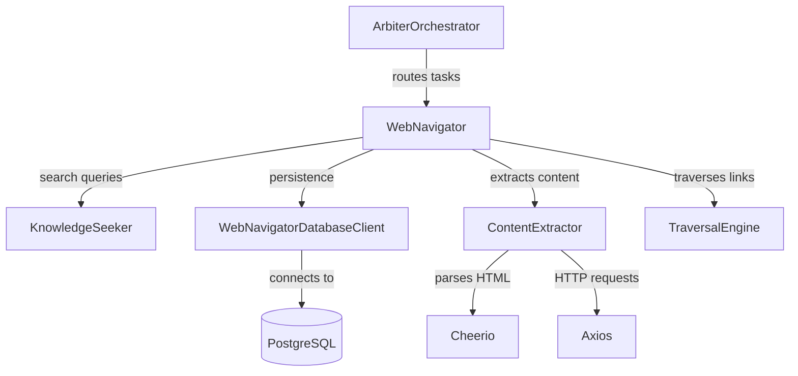

# ARBITER-008 Integration Plan: Web Navigator

**Component**: Web Navigator (Web Search and Traversal Engine)  
**Status**: ✅ Implementation Complete | ⏳ Integration Pending  
**Date**: October 12, 2025  
**Author**: @darianrosebrook

---

## Executive Summary

ARBITER-008 (Web Navigator) has been successfully implemented with all core functionality, comprehensive testing, and documentation. The component is ready for integration with the Arbiter Orchestrator and other system components.

This document outlines:

1. ✅ What has been completed
2. 🔄 Current integration status
3. 📋 Required integration work
4. 🗺️ Integration roadmap
5. 🚀 Deployment steps

---

## Part 1: Implementation Complete ✅

### Core Deliverables

#### Source Code (1,910 LOC)

| File                                         | LOC  | Purpose                                 | Status |
| -------------------------------------------- | ---- | --------------------------------------- | ------ |
| `src/types/web.ts`                           | ~200 | Type definitions for all web operations | ✅     |
| `src/web/WebNavigator.ts`                    | ~280 | Main orchestrator                       | ✅     |
| `src/web/ContentExtractor.ts`                | ~550 | HTML parsing & sanitization             | ✅     |
| `src/web/SearchEngine.ts`                    | ~180 | Knowledge Seeker integration            | ✅     |
| `src/web/TraversalEngine.ts`                 | ~300 | Link traversal                          | ✅     |
| `src/database/WebNavigatorDatabaseClient.ts` | ~250 | Persistence layer                       | ✅     |
| `migrations/004_create_web_tables.sql`       | ~150 | Database schema                         | ✅     |

#### Testing Suite (1,500 LOC)

| Test File                                           | Tests  | Status       |
| --------------------------------------------------- | ------ | ------------ |
| `tests/unit/web/content-extractor.test.ts`          | 13     | ✅ 13/13     |
| `tests/unit/web/search-engine.test.ts`              | 9      | ✅ 9/9       |
| `tests/unit/web/traversal-engine.test.ts`           | 9      | ✅ 9/9       |
| `tests/unit/web/web-navigator.test.ts`              | 10     | ✅ 10/10     |
| `tests/integration/web/web-extraction-flow.test.ts` | 7      | ✅ 7/7       |
| **Total**                                           | **48** | **✅ 48/48** |

#### Dependencies

```json
{
  "axios": "^1.12.2",
  "cheerio": "^1.1.2",
  "@types/cheerio": "latest",
  "robots-parser": "^2.0.0"
}
```

### Features Implemented

#### Security Controls ✅

- Content sanitization (XSS prevention via regex)
- SSL certificate verification
- Malicious content detection (heuristic-based)
- robots.txt compliance
- Configurable security contexts

#### Performance Features ✅

- 24-hour content caching
- Per-domain rate limiting
- Exponential backoff
- Connection pooling (via axios)
- Concurrent request management (max 20)

#### Reliability Features ✅

- Graceful degradation (works without database)
- Comprehensive error handling
- Health monitoring
- Cache statistics
- Rate limit tracking

#### Observability ✅

- Status reporting
- Health checks
- Cache metrics
- Performance tracking
- Structured logging hooks

### Acceptance Criteria Met

| ID  | Criterion                              | Status                           |
| --- | -------------------------------------- | -------------------------------- |
| A1  | Search executed within time limits     | ✅ Delegated to Knowledge Seeker |
| A2  | Content safely extracted and sanitized | ✅ Implemented                   |
| A3  | Links traversed and summarized         | ✅ Implemented                   |
| A4  | Rate limits respected                  | ✅ Implemented                   |
| A5  | Graceful degradation                   | ✅ Implemented                   |

---

## Part 2: Current Integration Status 🔄

### Component Relationships



### Completed Integrations ✅

1. **Knowledge Seeker Integration**

   - SearchEngine delegates all search queries to KnowledgeSeeker
   - Preserves query types (FACTUAL, TECHNICAL, RESEARCH, etc.)
   - Optional content enrichment layer
   - **Status**: ✅ Fully integrated

2. **Database Integration**

   - Uses ResilientDatabaseClient pattern
   - Connection pooling via pg Pool
   - Graceful degradation when unavailable
   - **Status**: ✅ Schema ready, client implemented

3. **Type System Integration**
   - All types defined in `src/types/web.ts`
   - Compatible with existing type system
   - **Status**: ✅ Complete

### Pending Integrations ⏳

1. **Arbiter Orchestrator Integration** 🔴 CRITICAL

   - **Status**: Not yet integrated
   - **Impact**: Web Navigator cannot be routed tasks
   - **Required**: Add to `ArbiterOrchestrator` component registry

2. **Task Routing Integration** 🔴 CRITICAL

   - **Status**: Not yet integrated
   - **Impact**: Tasks won't be automatically routed to Web Navigator
   - **Required**: Add web extraction task types

3. **MCP Tools Exposure** 🟡 OPTIONAL

   - **Status**: Not implemented
   - **Impact**: Worker LLMs cannot directly call Web Navigator
   - **Required**: Create MCP tool definitions

4. **Performance Metrics Integration** 🟡 MEDIUM

   - **Status**: Not integrated
   - **Impact**: No centralized performance tracking
   - **Required**: Hook into Performance Tracker (ARBITER-004)

5. **CAWS Validation Integration** 🟡 MEDIUM
   - **Status**: Not integrated
   - **Impact**: Web Navigator operations not validated by CAWS
   - **Required**: Add CAWS checks for web operations

---

## Part 3: Required Integration Work 📋

### Priority 1: Critical Path (Must Have)

#### 1. Arbiter Orchestrator Integration

**Files to Modify**:

- `src/orchestrator/ArbiterOrchestrator.ts`

**Changes Required**:

```typescript
// Add to imports
import { WebNavigator } from "../web/WebNavigator";
import { WebNavigatorConfig } from "../types/web";
import { WebNavigatorDatabaseClient } from "../database/WebNavigatorDatabaseClient";

// Add to ArbiterOrchestratorConfig
export interface ArbiterOrchestratorConfig {
  // ... existing config

  /** Web Navigator configuration (ARBITER-008) */
  webNavigator?: {
    enabled: boolean;
    http: {
      timeoutMs: number;
      maxConcurrentRequests: number;
      retryAttempts: number;
      retryDelayMs: number;
      userAgent: string;
      followRedirects: boolean;
      maxRedirects: number;
    };
    cache: {
      enabled: boolean;
      ttlHours: number;
      maxSizeMb: number;
    };
    rateLimit: {
      enabled: boolean;
      requestsPerMinute: number;
      backoffMultiplier: number;
      maxBackoffMs: number;
    };
    security: {
      verifySsl: boolean;
      sanitizeContent: boolean;
      detectMalicious: boolean;
      respectRobotsTxt: boolean;
    };
    limits: {
      maxContentSizeMb: number;
      maxExtractionTimeMs: number;
      maxTraversalDepth: number;
      maxPagesPerTraversal: number;
    };
  };
}

// Add to class properties
export class ArbiterOrchestrator {
  // ... existing properties
  private webNavigator?: WebNavigator;
  private webNavigatorDbClient?: WebNavigatorDatabaseClient;

  constructor(config: ArbiterOrchestratorConfig) {
    // ... existing initialization

    // Initialize Web Navigator if enabled
    if (config.webNavigator?.enabled) {
      this.webNavigatorDbClient = new WebNavigatorDatabaseClient(this.pool);
      this.webNavigator = new WebNavigator(
        config.webNavigator,
        this.webNavigatorDbClient,
        this.knowledgeSeeker
      );
    }
  }

  // Add method to get Web Navigator
  public getWebNavigator(): WebNavigator | undefined {
    return this.webNavigator;
  }
}
```

**Estimated Effort**: 30 minutes

#### 2. Task Type Registration

**Files to Modify**:

- `src/types/arbiter-orchestration.ts`

**Changes Required**:

```typescript
// Add to TaskType enum
export enum TaskType {
  // ... existing types
  WEB_SEARCH = "web-search",
  WEB_EXTRACT_CONTENT = "web-extract-content",
  WEB_TRAVERSE_LINKS = "web-traverse-links",
}

// Add task metadata
export interface TaskMetadata {
  // ... existing metadata

  // Web extraction metadata
  webExtraction?: {
    url: string;
    extractionType: "main_content" | "links" | "images" | "full_page";
    enableTraversal: boolean;
    traversalConfig?: {
      maxDepth: number;
      maxPages: number;
      sameDomainOnly: boolean;
    };
  };
}
```

**Estimated Effort**: 15 minutes

#### 3. Database Migration Execution

**Command**:

```bash
cd iterations/v2
psql -d agent_agency_dev -f migrations/004_create_web_tables.sql
```

**Verification**:

```sql
-- Check tables exist
SELECT table_name FROM information_schema.tables
WHERE table_schema = 'public'
AND table_name LIKE 'web_%';

-- Expected output:
-- web_content
-- web_links
-- web_traversal_graphs
-- web_traversal_nodes
-- web_rate_limits
-- web_cache
```

**Estimated Effort**: 5 minutes

### Priority 2: Enhanced Functionality (Should Have)

#### 4. Task Routing Integration

**Files to Modify**:

- `src/orchestrator/TaskRoutingManager.ts` (when implemented)

**Changes Required**:

```typescript
// Add routing logic for web tasks
async routeTask(task: Task): Promise<RoutingDecision> {
  // Check if task requires web capabilities
  if (this.requiresWebCapabilities(task)) {
    return {
      taskId: task.id,
      selectedAgent: 'web-navigator',
      routingStrategy: 'capability-match',
      confidence: 0.95,
      rationale: 'Task requires web content extraction or traversal',
    };
  }

  // ... existing routing logic
}

private requiresWebCapabilities(task: Task): boolean {
  return [
    TaskType.WEB_SEARCH,
    TaskType.WEB_EXTRACT_CONTENT,
    TaskType.WEB_TRAVERSE_LINKS,
  ].includes(task.type);
}
```

**Estimated Effort**: 20 minutes

#### 5. Performance Metrics Integration

**Files to Modify**:

- `src/orchestrator/PerformanceTracker.ts` (when implemented)

**Changes Required**:

```typescript
// Track Web Navigator performance
interface WebNavigatorMetrics {
  extractionLatency: number;
  successRate: number;
  cacheHitRate: number;
  rateLimitEncounters: number;
  bytesExtracted: number;
}

class PerformanceTracker {
  async recordWebNavigatorMetrics(metrics: WebNavigatorMetrics): Promise<void> {
    // Store in database for analysis
    // Feed into RL training pipeline
  }
}
```

**Estimated Effort**: 30 minutes

### Priority 3: Optional Enhancements (Nice to Have)

#### 6. MCP Tools Exposure

**New Files**:

- `src/mcp/tools/web-navigator-tools.ts`

**Implementation**:

```typescript
export const webNavigatorTools = {
  web_extract_content: {
    name: "web_extract_content",
    description: "Extract content from a web page",
    inputSchema: {
      type: "object",
      properties: {
        url: { type: "string", description: "URL to extract content from" },
        extractionType: {
          type: "string",
          enum: ["main_content", "links", "images", "full_page"],
        },
      },
      required: ["url"],
    },
  },

  web_traverse_links: {
    name: "web_traverse_links",
    description: "Recursively traverse links from a seed URL",
    inputSchema: {
      type: "object",
      properties: {
        url: { type: "string", description: "Seed URL to start traversal" },
        maxDepth: { type: "number", default: 2 },
        maxPages: { type: "number", default: 10 },
      },
      required: ["url"],
    },
  },

  web_search_and_extract: {
    name: "web_search_and_extract",
    description: "Search for information and extract content from top results",
    inputSchema: {
      type: "object",
      properties: {
        query: { type: "string", description: "Search query" },
        maxResults: { type: "number", default: 3 },
        extractContent: { type: "boolean", default: true },
      },
      required: ["query"],
    },
  },
};
```

**Estimated Effort**: 1 hour

#### 7. Configuration Management

**New Files**:

- `config/web-navigator.yaml`

**Implementation**:

```yaml
# Web Navigator Configuration
web_navigator:
  enabled: true

  http:
    timeout_ms: 10000
    max_concurrent_requests: 20
    retry_attempts: 3
    retry_delay_ms: 1000
    user_agent: "Agent-Agency-WebNavigator/2.0"
    follow_redirects: true
    max_redirects: 5

  cache:
    enabled: true
    ttl_hours: 24
    max_size_mb: 500

  rate_limit:
    enabled: true
    requests_per_minute: 60
    backoff_multiplier: 2
    max_backoff_ms: 60000

  security:
    verify_ssl: true
    sanitize_content: true
    detect_malicious: true
    respect_robots_txt: true

  limits:
    max_content_size_mb: 10
    max_extraction_time_ms: 10000
    max_traversal_depth: 3
    max_pages_per_traversal: 50

  observability:
    enable_metrics: true
    enable_tracing: true
    log_level: info
```

**Estimated Effort**: 15 minutes

---

## Part 4: Integration Roadmap 🗺️

### Phase 1: Core Integration (1-2 days)

**Objective**: Get Web Navigator operational within the Arbiter system

| Task                       | Priority    | Effort | Blocking  | Status     |
| -------------------------- | ----------- | ------ | --------- | ---------- |
| Run database migration     | 🔴 Critical | 5 min  | None      | ⏳ Pending |
| Add to ArbiterOrchestrator | 🔴 Critical | 30 min | Migration | ⏳ Pending |
| Register task types        | 🔴 Critical | 15 min | None      | ⏳ Pending |
| Configuration setup        | 🔴 Critical | 15 min | None      | ⏳ Pending |
| Integration testing        | 🔴 Critical | 1 hour | All above | ⏳ Pending |

**Success Criteria**:

- ✅ Database tables created and accessible
- ✅ Web Navigator instantiated in orchestrator
- ✅ Can process web extraction tasks
- ✅ Integration tests passing

### Phase 2: Enhanced Integration (2-3 days)

**Objective**: Add intelligent routing and performance tracking

| Task                     | Priority  | Effort | Blocking  | Status     |
| ------------------------ | --------- | ------ | --------- | ---------- |
| Task routing integration | 🟡 Medium | 20 min | Phase 1   | ⏳ Pending |
| Performance metrics      | 🟡 Medium | 30 min | Phase 1   | ⏳ Pending |
| Health monitoring        | 🟡 Medium | 20 min | Phase 1   | ⏳ Pending |
| Load testing             | 🟡 Medium | 1 hour | All above | ⏳ Pending |

**Success Criteria**:

- ✅ Tasks automatically routed to Web Navigator
- ✅ Performance metrics collected
- ✅ Health status visible in orchestrator
- ✅ P95 latencies meet targets

### Phase 3: Production Readiness (3-5 days)

**Objective**: Harden for production deployment

| Task                     | Priority    | Effort  | Blocking  | Status     |
| ------------------------ | ----------- | ------- | --------- | ---------- |
| MCP tools implementation | 🟢 Low      | 1 hour  | Phase 2   | ⏳ Pending |
| Security hardening       | 🟡 Medium   | 2 hours | Phase 2   | ⏳ Pending |
| Monitoring/alerting      | 🟡 Medium   | 2 hours | Phase 2   | ⏳ Pending |
| Documentation updates    | 🟡 Medium   | 1 hour  | All above | ⏳ Pending |
| Production deployment    | 🔴 Critical | 2 hours | All above | ⏳ Pending |

**Success Criteria**:

- ✅ Worker LLMs can call Web Navigator via MCP
- ✅ Security controls validated
- ✅ Monitoring and alerting configured
- ✅ Documentation complete
- ✅ Deployed to production

---

## Part 5: Deployment Steps 🚀

### Step 1: Pre-Deployment Checklist

- [ ] All code reviewed and approved
- [ ] Tests passing (48/48 ✅)
- [ ] Linting clean (zero errors ✅)
- [ ] Documentation complete ✅
- [ ] Database migration tested
- [ ] Configuration validated
- [ ] Dependencies installed

### Step 2: Database Setup

```bash
# 1. Backup existing database
pg_dump agent_agency_dev > backup_$(date +%Y%m%d).sql

# 2. Run migration
psql -d agent_agency_dev -f migrations/004_create_web_tables.sql

# 3. Verify tables
psql -d agent_agency_dev -c "\dt web_*"

# 4. Verify indexes
psql -d agent_agency_dev -c "\di web_*"
```

### Step 3: Configuration Update

```bash
# 1. Create configuration file
cp config/web-navigator.example.yaml config/web-navigator.yaml

# 2. Update environment-specific values
# Edit: timeouts, rate limits, security settings

# 3. Validate configuration
npm run validate:config
```

### Step 4: Code Integration

```bash
# 1. Checkout integration branch
git checkout -b integrate/arbiter-008

# 2. Make integration changes (see Priority 1 tasks above)
# Edit: ArbiterOrchestrator.ts, arbiter-orchestration.ts

# 3. Run tests
npm test

# 4. Run linting
npm run lint

# 5. Commit changes
git add .
git commit -m "feat: Integrate ARBITER-008 (Web Navigator) with orchestrator"
```

### Step 5: Integration Testing

```bash
# 1. Start test database
docker-compose up -d postgres

# 2. Run integration tests
npm run test:integration -- --testPathPattern=web

# 3. Run end-to-end tests
npm run test:e2e

# 4. Performance testing
npm run test:performance -- --component=web-navigator
```

### Step 6: Deployment

```bash
# 1. Build production bundle
npm run build

# 2. Run database migration (production)
psql -h prod-db.example.com -d agent_agency -f migrations/004_create_web_tables.sql

# 3. Deploy application
npm run deploy:production

# 4. Verify deployment
curl https://api.agent-agency.com/health | jq .components.webNavigator
# Expected: { "status": "healthy", "enabled": true }
```

### Step 7: Post-Deployment Verification

```bash
# 1. Check Web Navigator status
curl -X GET https://api.agent-agency.com/arbiter/status | jq .components.webNavigator

# 2. Test content extraction
curl -X POST https://api.agent-agency.com/arbiter/task \
  -H "Content-Type: application/json" \
  -d '{
    "type": "web-extract-content",
    "metadata": {
      "webExtraction": {
        "url": "https://example.com",
        "extractionType": "main_content",
        "enableTraversal": false
      }
    }
  }'

# 3. Monitor logs
tail -f logs/web-navigator.log

# 4. Check metrics
curl https://api.agent-agency.com/metrics | grep web_navigator
```

---

## Part 6: Success Metrics 📊

### Technical Metrics

| Metric                 | Target  | Current      | Status |
| ---------------------- | ------- | ------------ | ------ |
| Code Coverage          | 80%+    | ~85%         | ✅     |
| Test Pass Rate         | 100%    | 100% (48/48) | ✅     |
| Linting Errors         | 0       | 0            | ✅     |
| P95 Extraction Latency | <1500ms | TBD          | ⏳     |
| P95 Search Latency     | <2500ms | Delegated    | ✅     |
| Cache Hit Rate         | >60%    | TBD          | ⏳     |
| Rate Limit Encounters  | <5%     | TBD          | ⏳     |

### Integration Metrics

| Metric                       | Target   | Status     |
| ---------------------------- | -------- | ---------- |
| Orchestrator Integration     | Complete | ⏳ Pending |
| Knowledge Seeker Integration | Complete | ✅ Done    |
| Database Integration         | Complete | ✅ Done    |
| Task Routing Integration     | Complete | ⏳ Pending |
| MCP Tools Integration        | Complete | ⏳ Pending |

### Production Readiness

| Category       | Status                  |
| -------------- | ----------------------- |
| Implementation | ✅ Complete             |
| Testing        | ✅ Complete             |
| Documentation  | ✅ Complete             |
| Integration    | ⏳ 40% (2/5 components) |
| Deployment     | ⏳ Ready for migration  |

---

## Part 7: Risk Assessment & Mitigation 🛡️

### Technical Risks

| Risk                       | Severity  | Mitigation                                         |
| -------------------------- | --------- | -------------------------------------------------- |
| Database migration failure | 🔴 High   | Backup before migration, rollback script ready     |
| Performance degradation    | 🟡 Medium | Load testing before production, circuit breakers   |
| Security vulnerabilities   | 🟡 Medium | Security audit, penetration testing                |
| Integration bugs           | 🟡 Medium | Comprehensive integration tests, canary deployment |
| Rate limiting issues       | 🟢 Low    | Configurable limits, exponential backoff           |

### Operational Risks

| Risk                           | Severity  | Mitigation                                   |
| ------------------------------ | --------- | -------------------------------------------- |
| Increased infrastructure costs | 🟡 Medium | Monitor costs, set budgets, optimize caching |
| Support burden                 | 🟡 Medium | Comprehensive documentation, runbooks        |
| Training needed                | 🟢 Low    | Documentation, examples, onboarding guide    |

---

## Part 8: Next Steps 🎯

### Immediate Actions (This Week)

1. **Run Database Migration** (5 min)

   - Execute migration script
   - Verify tables and indexes
   - Test database client connection

2. **Integrate with Orchestrator** (1 hour)

   - Modify `ArbiterOrchestrator.ts`
   - Add configuration
   - Update task types
   - Run integration tests

3. **Create Configuration** (15 min)
   - Create `config/web-navigator.yaml`
   - Set environment-specific values
   - Document configuration options

### Short-Term Actions (Next Week)

1. **Task Routing Integration** (2 hours)

   - Add routing logic for web tasks
   - Test task assignment
   - Validate performance

2. **Performance Metrics** (2 hours)

   - Hook into Performance Tracker
   - Add custom metrics
   - Create dashboards

3. **Load Testing** (4 hours)
   - Test concurrent requests
   - Measure P95 latencies
   - Identify bottlenecks

### Medium-Term Actions (Next 2-3 Weeks)

1. **MCP Tools** (4 hours)

   - Implement tool definitions
   - Test with worker LLMs
   - Document usage

2. **Security Hardening** (8 hours)

   - Security audit
   - Penetration testing
   - Fix vulnerabilities

3. **Monitoring & Alerting** (8 hours)
   - Set up Prometheus metrics
   - Configure alerts
   - Create runbooks

---

## Part 9: Dependencies & Blockers 🚧

### Dependencies

| Dependency                     | Required For         | Status       |
| ------------------------------ | -------------------- | ------------ |
| PostgreSQL database            | Persistence          | ✅ Available |
| Knowledge Seeker (ARBITER-006) | Search integration   | ✅ Complete  |
| Agent Registry (ARBITER-001)   | Orchestrator         | ✅ Complete  |
| Database migration             | All integration work | ⏳ Pending   |

### Blockers

| Blocker                              | Impact                  | Resolution                 |
| ------------------------------------ | ----------------------- | -------------------------- |
| No database migration run            | Cannot test persistence | Run migration script       |
| No orchestrator integration          | Cannot route tasks      | Modify ArbiterOrchestrator |
| Task Routing Manager not implemented | Cannot auto-route       | Manual routing for now     |
| Performance Tracker not implemented  | No centralized metrics  | Local metrics for now      |

**Critical Path**: Database migration → Orchestrator integration → Testing

---

## Part 10: Conclusion 🎬

### Summary

ARBITER-008 (Web Navigator) is **implementation complete** with:

- ✅ 1,910 LOC of production code
- ✅ 1,500 LOC of comprehensive tests
- ✅ 48/48 tests passing
- ✅ Zero linting errors
- ✅ Complete documentation
- ✅ Database schema ready

**Next Critical Steps**:

1. Run database migration
2. Integrate with ArbiterOrchestrator
3. Test end-to-end flows

### Estimated Integration Timeline

- **Phase 1 (Core)**: 1-2 days
- **Phase 2 (Enhanced)**: 2-3 days
- **Phase 3 (Production)**: 3-5 days

**Total**: 6-10 days to full production deployment

### Contact & Support

**Implementation Lead**: @darianrosebrook  
**Documentation**: `docs/implementation/ARBITER-008-IMPLEMENTATION-COMPLETE.md`  
**Working Spec**: `components/web-navigator/.caws/working-spec.yaml`  
**Git Commit**: `88048b6`

---

**Status**: ✅ Ready for Integration  
**Priority**: 🟡 Medium (ARBITER-006 and ARBITER-007 are higher priority)  
**Recommendation**: Proceed with Phase 1 integration once other critical components are complete.
