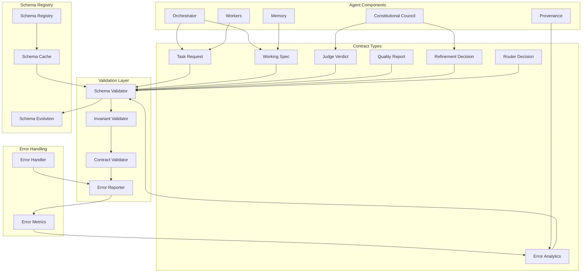

# Agent Agency Contracts

**Shared Interoperability Contracts and JSON Schema Validation for Agent Agency V3**

The Agent Agency Contracts crate provides a comprehensive set of strongly typed data contracts and JSON Schema-backed validators that ensure safe, deterministic data exchange across all components of the Agent Agency V3 system. These contracts define the boundaries between workers, orchestration, constitutional council, and provenance components.

## Overview

This foundational contracts platform combines multiple critical capabilities:

- **Type-Safe Contracts**: Strongly typed data structures for all inter-component communication
- **JSON Schema Validation**: Runtime validation ensuring data integrity and contract compliance
- **Deterministic Error Handling**: Comprehensive error types with structured error information
- **CAWS Invariants**: Built-in CAWS compliance checking and invariant validation
- **Versioned Contracts**: Backward-compatible contract evolution with version management
- **Schema Registry**: Centralized schema management and validation services

## Key Features

### 📋 **Comprehensive Contract Types**
- **Task Contracts**: Task requests, responses, and execution specifications
- **Working Specifications**: CAWS-validated working specs with constraints and acceptance criteria
- **Judge Contracts**: Constitutional council verdicts and evidence structures
- **Quality Contracts**: Quality reports, test results, and performance metrics
- **Execution Artifacts**: Code changes, test results, coverage data, and provenance
- **Refinement Decisions**: Council-driven refinement directives and scope adjustments
- **Router Decisions**: Worker assignment and orchestration routing decisions

### ✅ **JSON Schema Validation**
- **Runtime Validation**: Automatic validation of all contract instances
- **Schema Compliance**: Ensures all data conforms to predefined JSON schemas
- **Error Reporting**: Detailed validation errors with specific violation locations
- **Schema Evolution**: Version-controlled schema updates with backward compatibility
- **Cross-Language**: Schema definitions usable across different programming languages

### 🔒 **CAWS Invariants**
- **Invariant Checking**: Automatic CAWS invariant validation for all contracts
- **Violation Detection**: Comprehensive violation detection with severity classification
- **Compliance Scoring**: Quantitative compliance assessment and reporting
- **Remediation Guidance**: Actionable remediation steps for invariant violations
- **Audit Trail**: Complete audit trail of invariant checks and violations

### 🚀 **Deterministic Error Handling**
- **Structured Errors**: Hierarchical error types with context and metadata
- **Error Propagation**: Consistent error propagation across component boundaries
- **Recovery Guidance**: Error types include recovery suggestions and next steps
- **Error Correlation**: Unique error IDs for tracking and correlation across components
- **Error Metrics**: Built-in error metrics and observability

### 📈 **Performance & Observability**
- **Validation Performance**: Sub-millisecond validation for typical contract sizes
- **Memory Efficient**: Minimal memory overhead for contract validation
- **Concurrent Safe**: Thread-safe validation and contract handling
- **Metrics Integration**: Built-in performance metrics and observability hooks
- **Health Monitoring**: Contract validation health checks and status reporting

## Architecture



### Contract Hierarchy

The contracts follow a hierarchical structure:

1. **Base Contracts**: Fundamental types shared across all components
2. **Domain Contracts**: Specific to particular domains (orchestration, evaluation, etc.)
3. **Integration Contracts**: Define interfaces between major components
4. **Validation Contracts**: Define validation rules and constraint checking
5. **Audit Contracts**: Define audit trails and provenance tracking

## Quick Start

### 1. Add to Dependencies

```toml
[dependencies]
agent-agency-contracts = { path = "../agent-agency-contracts" }
serde = { version = "1.0", features = ["derive"] }
serde_json = "1.0"
schemars = "0.8"
```

### 2. Create and Validate a Task Request

```rust
use agent_agency_contracts::*;

// Create a task request
let task_request = TaskRequest {
    id: "task-123".to_string(),
    title: "Implement user authentication".to_string(),
    description: "Implement JWT-based user authentication with refresh tokens".to_string(),
    task_type: "feature".to_string(),
    priority: TaskPriority::High,
    risk_tier: RiskTier::Standard,
    constraints: TaskConstraints {
        max_execution_time_seconds: Some(3600),
        max_cost: Some(100.0),
        required_capabilities: vec!["authentication".to_string(), "security".to_string()],
        environment_requirements: Some(Environment::Production),
        data_sensitivity: Some(DataSensitivity::High),
        compliance_requirements: Some(vec!["gdpr".to_string(), "security".to_string()]),
    },
    context: RequestTaskContext {
        user_id: "user-456".to_string(),
        session_id: "session-789".to_string(),
        workspace_id: "workspace-101".to_string(),
        environment: Environment::Development,
        permissions: vec!["task.create".to_string(), "workspace.write".to_string()],
        metadata: std::collections::HashMap::new(),
    },
    metadata: TaskMetadata {
        created_at: chrono::Utc::now(),
        updated_at: chrono::Utc::now(),
        tags: vec!["authentication".to_string(), "security".to_string()],
        custom_fields: std::collections::HashMap::new(),
    },
};

// Validate the task request
match validate_task_request_value(&serde_json::to_value(&task_request)?) {
    Ok(_) => println!("Task request is valid"),
    Err(validation_errors) => {
        println!("Task request validation failed:");
        for error in validation_errors {
            println!("  - {}", error.message);
        }
    }
}
```

### 3. Create and Validate a Working Specification

```rust
use agent_agency_contracts::*;

// Create a comprehensive working specification
let working_spec = WorkingSpec {
    version: "1.0".to_string(),
    id: "FEAT-001".to_string(),
    title: "Implement JWT Authentication".to_string(),
    description: "Implement secure JWT-based authentication with refresh token rotation".to_string(),
    goals: vec![
        "Provide secure user authentication".to_string(),
        "Implement token refresh mechanism".to_string(),
        "Ensure GDPR compliance".to_string(),
    ],
    risk_tier: 2,
    constraints: WorkingSpecConstraints {
        max_execution_time_seconds: Some(7200),
        max_cost: Some(150.0),
        required_capabilities: vec!["rust".to_string(), "jwt".to_string(), "security".to_string()],
        change_budget: Some(ChangeBudget {
            max_files: 15,
            max_loc: 800,
            max_complexity: 25,
        }),
        data_impact: Some(DataImpact::Medium),
        compliance_requirements: vec!["gdpr".to_string(), "security-audit".to_string()],
    },
    acceptance_criteria: vec![
        AcceptanceCriterion {
            description: "Given a valid username/password, when user logs in, then JWT token is issued".to_string(),
            status: None,
            evidence: None,
        },
        AcceptanceCriterion {
            description: "Given an expired token, when refresh requested, then new token issued".to_string(),
            status: None,
            evidence: None,
        },
    ],
    test_plan: TestPlan {
        unit_tests: vec![UnitTestSpec {
            description: "Test JWT token generation".to_string(),
            test_cases: vec!["valid_credentials".to_string(), "invalid_credentials".to_string()],
            coverage_target: 90,
        }],
        integration_tests: vec![IntegrationTestSpec {
            description: "Test authentication flow".to_string(),
            scenarios: vec!["login_flow".to_string(), "refresh_flow".to_string()],
            dependencies: vec!["database".to_string(), "jwt_library".to_string()],
        }],
        e2e_scenarios: vec![E2eScenario {
            description: "End-to-end authentication".to_string(),
            steps: vec!["register".to_string(), "login".to_string(), "access_protected".to_string()],
            expected_outcome: "successful_access".to_string(),
        }],
        performance_requirements: Some(PerformanceRequirements {
            response_time_ms: 100,
            throughput_req: 1000,
            concurrent_users: 100,
        }),
    },
    rollback_plan: RollbackPlan {
        strategy: RollbackStrategy::Automated,
        checkpoints: vec!["backup_database".to_string(), "backup_code".to_string()],
        automated_steps: vec!["rollback_migration".to_string(), "restore_backup".to_string()],
        manual_steps: vec![],
        validation_steps: vec!["verify_auth_still_works".to_string()],
    },
    context: WorkingSpecContext {
        workspace_root: "/app".to_string(),
        git_branch: "feature/jwt-auth".to_string(),
        recent_changes: vec![],
        dependencies: std::collections::HashMap::from([
            ("jsonwebtoken".to_string(), "8.0".to_string()),
            ("bcrypt".to_string(), "0.13".to_string()),
        ]),
        environment: Environment::Development,
        metadata: std::collections::HashMap::new(),
    },
    non_functional_requirements: Some(NonFunctionalRequirements {
        performance: Some(PerformanceRequirements {
            response_time_ms: 100,
            throughput_req: 1000,
            concurrent_users: 100,
        }),
        scalability: Some(ScalabilityRequirements {
            max_users: 10000,
            growth_rate: "10%_monthly".to_string(),
            peak_load: "2x_average".to_string(),
        }),
        security: vec!["jwt_rotation".to_string(), "password_hashing".to_string()],
        reliability: vec!["99.9%_uptime".to_string(), "auto_failover".to_string()],
        maintainability: vec!["code_coverage_80%".to_string(), "documentation_complete".to_string()],
    }),
    milestones: vec![
        Milestone {
            id: "milestone-1".to_string(),
            title: "JWT Token Generation".to_string(),
            description: "Implement basic JWT token creation and validation".to_string(),
            acceptance_criteria: vec!["tokens_generated".to_string()],
            dependencies: vec![],
            estimated_effort_hours: 8,
        },
    ],
    change_budget: Some(ChangeBudget {
        max_files: 15,
        max_loc: 800,
        max_complexity: 25,
    }),
    metadata: WorkingSpecMetadata {
        author: "security-team".to_string(),
        reviewers: vec!["architect".to_string(), "security-lead".to_string()],
        priority: MoSCoWPriority::Must,
        tags: vec!["authentication".to_string(), "security".to_string(), "jwt".to_string()],
        custom_fields: std::collections::HashMap::new(),
    },
};

// Validate the working specification
match validate_working_spec_value(&serde_json::to_value(&working_spec)?) {
    Ok(_) => println!("Working specification is valid"),
    Err(validation_errors) => {
        println!("Working specification validation failed:");
        for error in validation_errors {
            println!("  - {}", error.message);
        }
    }
}
```

### 4. Create and Validate a Judge Verdict

```rust
use agent_agency_contracts::*;

// Create a constitutional judge verdict
let judge_verdict = JudgeVerdictContract {
    judge_type: JudgeType::Constitutional,
    task_id: "task-123".to_string(),
    working_spec_id: "FEAT-001".to_string(),
    decision: JudgeDecision::Approved,
    confidence_score: 0.95,
    rationale: "Implementation follows security best practices and GDPR compliance guidelines. JWT rotation and proper password hashing ensure data protection.".to_string(),
    evidence: vec![
        JudgeEvidenceItem {
            evidence_type: JudgeEvidenceType::CodeReview,
            content: "Reviewed authentication implementation for security vulnerabilities".to_string(),
            credibility_score: 0.9,
            source: "security-audit".to_string(),
            timestamp: chrono::Utc::now(),
        },
    ],
    violations: vec![],
    recommendations: vec![
        "Consider implementing rate limiting for authentication endpoints".to_string(),
        "Add comprehensive logging for security events".to_string(),
    ],
    metadata: std::collections::HashMap::from([
        ("judge_version".to_string(), "1.0.0".to_string()),
        ("evaluation_time_ms".to_string(), "150".to_string()),
    ]),
};

// Validate the judge verdict
match validate_judge_verdict_value(&serde_json::to_value(&judge_verdict)?) {
    Ok(_) => println!("Judge verdict is valid"),
    Err(validation_errors) => {
        println!("Judge verdict validation failed:");
        for error in validation_errors {
            println!("  - {}", error.message);
        }
    }
}
```

### 5. Run CAWS Invariants

```rust
use agent_agency_contracts::*;

// Define CAWS invariants to check
let invariants = vec![
    CAWSInvariant {
        id: "change-budget-enforcement".to_string(),
        category: InvariantCategory::Budget,
        severity: Severity::Error,
        title: "Change Budget Enforcement".to_string(),
        description: "Ensure changes stay within allocated budget limits".to_string(),
        condition: "diff_stats.lines_added + diff_stats.lines_removed <= budget.max_loc".to_string(),
        remediation: Some("Reduce the scope of changes or request budget increase".to_string()),
        applicable_tiers: vec![1, 2, 3],
        enabled: true,
    },
    CAWSInvariant {
        id: "test-coverage-requirement".to_string(),
        category: InvariantCategory::Quality,
        severity: Severity::Warning,
        title: "Test Coverage Requirement".to_string(),
        description: "Ensure adequate test coverage for changes".to_string(),
        condition: "test_results.coverage_percentage >= 80.0".to_string(),
        remediation: Some("Add more tests to increase coverage".to_string()),
        applicable_tiers: vec![1, 2],
        enabled: true,
    },
];

// Create validation context
let validation_context = serde_json::json!({
    "diff_stats": {
        "lines_added": 245,
        "lines_removed": 23,
        "files_changed": 8
    },
    "budget": {
        "max_loc": 800
    },
    "test_results": {
        "coverage_percentage": 87.5
    }
});

// Run CAWS invariants
let invariant_results = run_caws_invariants(&invariants, &validation_context, 2)?;

println!("CAWS Invariant Results:");
println!("  Overall Status: {:?}", invariant_results.overall_status);
println!("  Compliance Score: {:.1}%", invariant_results.compliance_score);
println!("  Total Violations: {}", invariant_results.violations.len());

for violation in &invariant_results.violations {
    println!("  Violation [{}]: {}", violation.severity, violation.message);
    if let Some(location) = &violation.location {
        println!("    Location: {}:{}:{}", location.file, location.line, location.column);
    }
    if let Some(remediation) = &violation.remediation {
        println!("    Remediation: {}", remediation);
    }
}
```

### 6. Handle Contract Errors

```rust
use agent_agency_contracts::*;

// Demonstrate error handling
fn process_task_request(request_json: &str) -> Result<TaskRequest, ContractError> {
    // Parse JSON
    let request_value: serde_json::Value = serde_json::from_str(request_json)?;

    // Validate against schema
    validate_task_request_value(&request_value)?;

    // Deserialize to typed structure
    let task_request: TaskRequest = serde_json::from_value(request_value)?;

    // Additional business logic validation
    if task_request.risk_tier < 1 || task_request.risk_tier > 3 {
        return Err(ContractError::Validation(ValidationIssue {
            field: "risk_tier".to_string(),
            message: "Risk tier must be between 1 and 3".to_string(),
            violation_type: ContractKind::Constraint,
            severity: Severity::Error,
            remediation: Some("Set risk_tier to 1 (critical), 2 (standard), or 3 (low)".to_string()),
        }));
    }

    Ok(task_request)
}

// Example usage with error handling
let invalid_request = r#"{"id": "task-123", "risk_tier": 5}"#;

match process_task_request(invalid_request) {
    Ok(request) => println!("Successfully processed request: {}", request.id),
    Err(ContractError::Validation(issue)) => {
        println!("Validation error in field '{}': {}", issue.field, issue.message);
        if let Some(remediation) = issue.remediation {
            println!("Suggested fix: {}", remediation);
        }
    }
    Err(e) => println!("Other error: {:?}", e),
}
```

## Contract Types

### Core Contract Categories

#### Task Contracts
- **TaskRequest**: Defines task execution requirements and constraints
- **TaskResponse**: Provides task execution results and status
- **TaskConstraints**: Specifies execution limits and requirements

#### Working Specification Contracts
- **WorkingSpec**: Comprehensive CAWS-validated specification
- **AcceptanceCriterion**: Given-When-Then acceptance criteria
- **TestPlan**: Detailed testing strategy and requirements
- **RollbackPlan**: Recovery and rollback procedures

#### Judge Contracts
- **JudgeVerdictContract**: Constitutional council decisions
- **FinalVerdictContract**: Aggregated council verdicts
- **RefinementDecision**: Council-driven refinement directives

#### Quality Contracts
- **QualityReport**: Comprehensive quality assessment
- **GateResult**: Individual quality gate results
- **Recommendation**: Quality improvement suggestions

#### Execution Artifacts
- **ExecutionArtifacts**: Complete execution evidence and artifacts
- **TestArtifacts**: Test results and coverage data
- **CodeChanges**: Detailed code modification records

### Contract Validation

All contracts support comprehensive validation:

```rust
use agent_agency_contracts::*;

// Example: Validate all contract types
async fn validate_all_contracts() -> Result<(), Box<dyn std::error::Error>> {
    // Task request validation
    let task_request = create_task_request();
    validate_task_request_value(&serde_json::to_value(&task_request)?)?;

    // Working spec validation
    let working_spec = create_working_spec();
    validate_working_spec_value(&serde_json::to_value(&working_spec)?)?;

    // Judge verdict validation
    let judge_verdict = create_judge_verdict();
    validate_judge_verdict_value(&serde_json::to_value(&judge_verdict)?)?;

    // Quality report validation
    let quality_report = create_quality_report();
    validate_quality_report_value(&serde_json::to_value(&quality_report)?)?;

    // Execution artifacts validation
    let execution_artifacts = create_execution_artifacts();
    validate_execution_artifacts_value(&serde_json::to_value(&execution_artifacts)?)?;

    println!("All contracts validated successfully");
    Ok(())
}
```

## Schema Registry

### Schema Management

```rust
use agent_agency_contracts::*;

// Access schema sources
let task_request_schema = task_request_schema_source();
let working_spec_schema = working_spec_schema_source();
let judge_verdict_schema = judge_verdict_schema_source();

// Use schemas for validation
let validator = jsonschema::validator_for(&serde_json::from_str(task_request_schema)?)?;

// Validate data against schema
let task_data = serde_json::json!({"id": "task-123", "title": "Test task"});
match validator.validate(&task_data) {
    Ok(_) => println!("Schema validation passed"),
    Err(errors) => {
        for error in errors {
            println!("Schema validation error: {}", error);
        }
    }
}
```

### Schema Evolution

The contracts support backward-compatible schema evolution:

```rust
// Schema versioning example
#[derive(Debug, Clone, Serialize, Deserialize, JsonSchema)]
#[serde(rename_all = "snake_case")]
pub struct TaskRequestV1 {
    pub id: String,
    pub title: String,
    pub description: String,
    pub priority: TaskPriority,
}

#[derive(Debug, Clone, Serialize, Deserialize, JsonSchema)]
#[serde(rename_all = "snake_case")]
pub struct TaskRequestV2 {
    pub id: String,
    pub title: String,
    pub description: String,
    pub priority: TaskPriority,
    #[serde(default)]
    pub tags: Vec<String>, // New field with default
}
```

## CAWS Invariants

### Invariant Definition

```rust
use agent_agency_contracts::*;

// Define comprehensive CAWS invariants
let caws_invariants = vec![
    CAWSInvariant {
        id: "security-review-required".to_string(),
        category: InvariantCategory::Security,
        severity: Severity::Error,
        title: "Security Review Required".to_string(),
        description: "High-risk changes require security review".to_string(),
        condition: r#"
            risk_tier == 1 ||
            (risk_tier == 2 && (
                contains(tags, "security") ||
                contains(tags, "authentication") ||
                contains(tags, "authorization")
            ))
        "#.to_string(),
        remediation: Some("Submit security review request or reduce risk tier".to_string()),
        applicable_tiers: vec![1, 2],
        enabled: true,
    },

    CAWSInvariant {
        id: "test-coverage-maintained".to_string(),
        category: InvariantCategory::Quality,
        severity: Severity::Warning,
        title: "Test Coverage Maintained".to_string(),
        description: "Ensure test coverage doesn't decrease".to_string(),
        condition: "test_results.coverage_percentage >= baseline_coverage".to_string(),
        remediation: Some("Add tests to maintain or improve coverage".to_string()),
        applicable_tiers: vec![1, 2, 3],
        enabled: true,
    },

    CAWSInvariant {
        id: "performance-regression-check".to_string(),
        category: InvariantCategory::Performance,
        severity: Severity::Warning,
        title: "Performance Regression Check".to_string(),
        description: "Detect performance regressions in critical paths".to_string(),
        condition: "performance_metrics.p95_response_time_ms <= baseline_p95".to_string(),
        remediation: Some("Optimize performance or document acceptable regression".to_string()),
        applicable_tiers: vec![1, 2],
        enabled: true,
    },
];
```

### Invariant Evaluation

```rust
use agent_agency_contracts::*;

// Evaluate invariants against execution context
let execution_context = serde_json::json!({
    "risk_tier": 2,
    "tags": ["authentication", "security"],
    "test_results": {
        "coverage_percentage": 85.0
    },
    "baseline_coverage": 82.0,
    "performance_metrics": {
        "p95_response_time_ms": 120
    },
    "baseline_p95": 100
});

let invariant_results = run_caws_invariants(&caws_invariants, &execution_context, 2)?;

println!("Invariant Evaluation Results:");
println!("  Status: {:?}", invariant_results.overall_status);
println!("  Compliance Score: {:.1}%", invariant_results.compliance_score);

for violation in &invariant_results.violations {
    println!("  🚨 [{}] {} - {}", violation.severity, violation.title, violation.description);
    if let Some(remediation) = &violation.remediation {
        println!("     💡 {}", remediation);
    }
}
```

## Error Handling

### Contract Error Types

```rust
use agent_agency_contracts::*;

/// Comprehensive error handling example
fn process_contract_with_error_handling(
    contract_json: &str,
    contract_type: &str
) -> Result<(), ContractError> {
    // Parse JSON with error context
    let contract_value: serde_json::Value = serde_json::from_str(contract_json)
        .map_err(|e| ContractError::Validation(ValidationIssue {
            field: "json".to_string(),
            message: format!("Invalid JSON: {}", e),
            violation_type: ContractKind::Format,
            severity: Severity::Error,
            remediation: Some("Ensure valid JSON format".to_string()),
        }))?;

    // Validate based on contract type
    match contract_type {
        "task_request" => validate_task_request_value(&contract_value)?,
        "working_spec" => validate_working_spec_value(&contract_value)?,
        "judge_verdict" => validate_judge_verdict_value(&contract_value)?,
        _ => return Err(ContractError::Validation(ValidationIssue {
            field: "contract_type".to_string(),
            message: format!("Unknown contract type: {}", contract_type),
            violation_type: ContractKind::Type,
            severity: Severity::Error,
            remediation: Some("Use valid contract type: task_request, working_spec, judge_verdict".to_string()),
        })),
    }

    Ok(())
}
```

### Error Propagation

```rust
use agent_agency_contracts::*;

// Error propagation through component boundaries
async fn orchestrator_task_execution(
    task_request: TaskRequest,
) -> Result<TaskResponse, ContractError> {
    // Validate task request
    validate_task_request_value(&serde_json::to_value(&task_request)?)?;

    // Execute task (this might involve multiple components)
    let execution_result = self.execute_task_components(task_request.clone())
        .await
        .map_err(|e| ContractError::Execution(format!("Task execution failed: {}", e)))?;

    // Validate execution artifacts
    validate_execution_artifacts_value(&serde_json::to_value(&execution_result.artifacts)?)?;

    // Create response
    let response = TaskResponse {
        task_id: task_request.id,
        status: TaskStatus::Completed,
        result: Some(execution_result),
        error: None,
        execution_metadata: TaskExecutionMetadata {
            started_at: chrono::Utc::now(),
            completed_at: chrono::Utc::now(),
            duration_ms: 1000,
            worker_id: "worker-123".to_string(),
        },
    };

    // Validate response
    validate_task_response_value(&serde_json::to_value(&response)?)?;

    Ok(response)
}
```

## Performance Characteristics

### Validation Performance

- **Schema Validation**: Sub-millisecond for typical contract sizes (< 10KB)
- **Invariant Checking**: < 5ms for comprehensive invariant suites
- **JSON Parsing**: Efficient serde-based parsing with minimal overhead
- **Memory Usage**: Low memory footprint with streaming validation
- **Concurrent Validation**: Thread-safe validation supporting high concurrency

### Scalability Metrics

- **Throughput**: 1000+ validations per second on typical hardware
- **Latency**: P95 < 10ms for complex contract validation
- **Resource Usage**: Minimal CPU and memory overhead
- **Horizontal Scaling**: Stateless validation scales horizontally
- **Caching**: Built-in schema caching for improved performance

### Contract Size Guidelines

- **Small Contracts**: < 1KB (task requests, simple verdicts)
- **Medium Contracts**: 1-10KB (working specs, quality reports)
- **Large Contracts**: 10-100KB (execution artifacts, comprehensive reports)
- **Maximum Size**: 1MB limit for individual contracts

## Integration Examples

### With Agent Orchestrator

```rust
use agent_orchestration::*;
use agent_agency_contracts::*;

// Orchestrator using contracts for task management
pub struct ContractAwareOrchestrator {
    orchestrator: AgentOrchestrator,
}

impl ContractAwareOrchestrator {
    pub async fn execute_task_with_contracts(
        &self,
        task_request_json: &str,
    ) -> Result<TaskResponse, OrchestrationError> {
        // Parse and validate task request
        let task_request: TaskRequest = self.parse_and_validate_request(task_request_json).await?;

        // Create working specification
        let working_spec = self.create_working_spec_from_request(&task_request).await?;

        // Validate working spec
        validate_working_spec_value(&serde_json::to_value(&working_spec)?)?;

        // Execute task with contracts
        let execution_result = self.orchestrator.execute_with_spec(working_spec).await?;

        // Create and validate response
        let response = self.create_validated_response(&task_request, execution_result).await?;

        Ok(response)
    }

    async fn parse_and_validate_request(
        &self,
        request_json: &str,
    ) -> Result<TaskRequest, OrchestrationError> {
        let request_value: serde_json::Value = serde_json::from_str(request_json)?;
        validate_task_request_value(&request_value)?;

        let task_request: TaskRequest = serde_json::from_value(request_value)?;
        Ok(task_request)
    }

    async fn create_working_spec_from_request(
        &self,
        request: &TaskRequest,
    ) -> Result<WorkingSpec, OrchestrationError> {
        // Create working spec from request
        let working_spec = WorkingSpec {
            version: "1.0".to_string(),
            id: format!("WS-{}", request.id),
            title: request.title.clone(),
            description: request.description.clone(),
            goals: vec![request.description.clone()],
            risk_tier: request.risk_tier as u32,
            constraints: WorkingSpecConstraints {
                max_execution_time_seconds: request.constraints.max_execution_time_seconds,
                max_cost: request.constraints.max_cost.map(|c| c as u32),
                required_capabilities: request.constraints.required_capabilities.clone(),
                // ... other mappings
            },
            acceptance_criteria: vec![], // Would be generated based on requirements
            test_plan: TestPlan::default(),
            rollback_plan: RollbackPlan::default(),
            context: WorkingSpecContext {
                workspace_root: "/app".to_string(),
                git_branch: "main".to_string(),
                recent_changes: vec![],
                dependencies: std::collections::HashMap::new(),
                environment: request.context.environment,
                metadata: std::collections::HashMap::new(),
            },
            // ... other fields
        };

        Ok(working_spec)
    }
}
```

### With Constitutional Council

```rust
use agent_constitutional_council::*;
use agent_agency_contracts::*;

// Council using contracts for decision making
pub struct ContractAwareCouncil {
    council: ConstitutionalCouncil,
}

impl ContractAwareCouncil {
    pub async fn evaluate_with_contracts(
        &self,
        working_spec: WorkingSpec,
    ) -> Result<FinalVerdictContract, CouncilError> {
        // Validate working spec
        validate_working_spec_value(&serde_json::to_value(&working_spec)?)?;

        // Get judge verdicts
        let judge_verdicts = self.council.evaluate_working_spec(working_spec.clone()).await?;

        // Validate judge verdicts
        for verdict in &judge_verdicts {
            validate_judge_verdict_value(&serde_json::to_value(verdict)?)?;
        }

        // Create final verdict contract
        let final_verdict = self.aggregate_verdicts_to_contract(judge_verdicts).await?;

        // Validate final verdict
        validate_final_verdict_value(&serde_json::to_value(&final_verdict)?)?;

        Ok(final_verdict)
    }

    async fn aggregate_verdicts_to_contract(
        &self,
        judge_verdicts: Vec<JudgeVerdictContract>,
    ) -> Result<FinalVerdictContract, CouncilError> {
        // Aggregate verdicts into final decision
        let decision = self.determine_overall_decision(&judge_verdicts);
        let confidence = self.calculate_overall_confidence(&judge_verdicts);

        let final_verdict = FinalVerdictContract {
            decision,
            votes: judge_verdicts.into_iter()
                .map(|jv| VoteEntry {
                    judge_type: jv.judge_type,
                    verdict: VoteVerdict::from(jv.decision),
                    confidence: jv.confidence_score,
                    rationale: jv.rationale,
                })
                .collect(),
            dissent: self.generate_dissent_summary(&judge_verdicts),
            remediation: vec![], // Would be generated based on verdicts
            constitutional_refs: vec![], // Would reference relevant rules
            verification_summary: VerificationSummary::default(),
        };

        Ok(final_verdict)
    }
}
```

## Best Practices

### Contract Design

1. **Version Contracts**: Always include version fields for compatibility
2. **Use JSON Schema**: Define schemas for all contract types
3. **Validate Early**: Validate contracts as soon as they're created
4. **Handle Evolution**: Plan for backward-compatible contract changes
5. **Document Contracts**: Provide comprehensive contract documentation

### Validation Strategy

1. **Comprehensive Validation**: Validate all contracts against schemas
2. **Invariant Checking**: Run CAWS invariants for compliance
3. **Error Context**: Provide detailed error messages with remediation
4. **Performance Monitoring**: Track validation performance and latency
5. **Security Validation**: Include security checks in validation

### Error Handling

1. **Structured Errors**: Use ContractError types with detailed context
2. **Error Propagation**: Propagate errors with appropriate context
3. **Recovery Guidance**: Include recovery suggestions in errors
4. **Logging**: Log errors with correlation IDs for tracking
5. **Metrics**: Track error rates and types for monitoring

### Integration Patterns

1. **Contract-First**: Design integrations around contracts
2. **Validation Boundaries**: Validate at component boundaries
3. **Type Safety**: Leverage Rust's type system for safety
4. **Async Contracts**: Design contracts for asynchronous operations
5. **Observability**: Include observability hooks in contracts

## Troubleshooting

### Common Issues

**Schema Validation Failures**
- Check JSON format and required fields
- Verify schema versions and compatibility
- Review validation error messages for specific issues
- Update schemas if contract changes are intentional

**Invariant Violations**
- Review CAWS invariant definitions and conditions
- Check execution context data for completeness
- Verify risk tier applicability for invariants
- Update invariants if requirements have changed

**Contract Deserialization Errors**
- Validate JSON structure against contract definitions
- Check for missing or extra fields
- Verify data types and formats
- Review serde attributes for correct mapping

**Performance Issues**
- Monitor validation latency and throughput
- Check for large contracts exceeding size limits
- Review caching effectiveness for schemas
- Consider parallel validation for large batches

**Version Compatibility Issues**
- Check contract version fields for compatibility
- Review schema evolution and migration strategies
- Update components to handle new contract versions
- Maintain backward compatibility where possible

## Contributing

1. Follow the CAWS workflow for any changes
2. Include comprehensive tests for new contract types and validation
3. Update JSON schemas when modifying contract structures
4. Run contract validation benchmarks for performance improvements

## License

Licensed under the same terms as the Agent Agency project.

## Related Components

- **agent-orchestration**: Uses contracts for task coordination and execution
- **agent-constitutional-council**: Uses contracts for judge verdicts and decisions
- **agent-memory**: Stores contract instances and execution history
- **system-quality-security**: Validates contracts for security compliance
- **data-infrastructure**: Persists contract data and execution artifacts