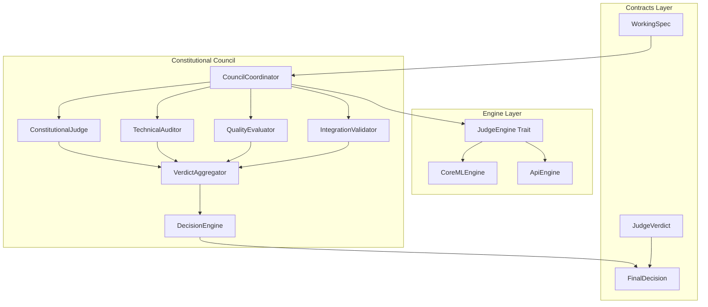

# Agent Constitutional Council

**Hybrid constitutional governance system for autonomous AI agents**

The Agent Constitutional Council implements a sophisticated governance framework that combines deterministic CAWS invariant checking with LLM-based analysis for gray-zone decisions. It provides real-time oversight and decision-making through four specialized AI judges that ensure ethical, technical, and operational compliance.

## Overview

The Constitutional Council operates as a hybrid governance system:

- **Deterministic CAWS Gates**: Hard-coded invariant checks for clear violations
- **LLM-Based Analysis**: Intelligent reasoning for complex, gray-zone decisions
- **Four Specialized Judges**: Constitutional, Technical, Quality, and Integration oversight
- **Engine Agnostic**: Generic over JudgeEngine trait with CoreML, API, and other backends
- **Structured IO**: JSON schema-validated verdicts and prompts with performance constraints

## Key Features

### 🏛️ **Hybrid Constitutionalism**
- **Deterministic Gates**: Hard-coded CAWS invariant violations (scope, naming, quality)
- **LLM Reasoning**: Intelligent analysis for complex decisions requiring context
- **Hybrid Pattern**: All judges implement both deterministic and LLM-based reasoning
- **Confidence Scoring**: Clear confidence levels for all verdicts

### 👥 **Four Constitutional Judges**
- **Constitutional Judge**: Ethical compliance, safety, and alignment with CAWS principles
- **Technical Auditor**: Code quality, performance, correctness, and technical standards
- **Quality Evaluator**: Testing coverage, reliability, maintainability, and quality metrics
- **Integration Validator**: System integration, API contracts, and cross-component compatibility

### ⚡ **Performance & Scalability**
- **Token Limits**: Configurable token budgets for LLM operations
- **Response Caching**: Intelligent caching of similar verdicts
- **SLA Enforcement**: Configurable timeouts and performance guarantees
- **Concurrent Processing**: Parallel judge deliberations with coordination

### 📊 **Observability & Metrics**
- **Council Metrics**: Decision latency, consensus rates, judge performance
- **Audit Trails**: Complete provenance of all governance decisions
- **Health Monitoring**: Judge health checks and automatic recovery
- **Performance Analytics**: Decision quality and system effectiveness tracking

## Architecture



### Component Architecture

- **CouncilCoordinator**: Main orchestration component generic over engine type
- **Judge Types**: Four specialized judges implementing hybrid reasoning
- **VerdictAggregator**: Consensus building from multiple judge verdicts
- **DecisionEngine**: Final decision synthesis with confidence scoring
- **Engine Abstraction**: Clean separation via JudgeEngine trait

## Quick Start

### 1. Add to Dependencies

```toml
[dependencies]
agent-constitutional-council = { path = "../agent-constitutional-council" }
engine-coreml = { path = "../engine-coreml" }
```

### 2. Initialize Council

```rust
use std::sync::Arc;
use agent_constitutional_council::{CouncilCoordinator, Judges};
use engine_coreml::CoreMLEngine;
use agent_agency_contracts::EngineCaps;

#[tokio::main]
async fn main() -> Result<(), Box<dyn std::error::Error>> {
    // Initialize CoreML engine
    let engine_caps = EngineCaps {
        max_batch_size: 4,
        max_sequence_length: 2048,
        supported_models: vec!["fastvit-t8".to_string()],
    };

    let engine = Arc::new(CoreMLEngine::new("path/to/model", engine_caps).await?);

    // Create the four constitutional judges
    let judges = Judges::new(engine.clone());

    // Initialize council coordinator
    let mut council = CouncilCoordinator::new(engine, judges);

    Ok(())
}
```

### 3. Evaluate Working Specifications

```rust
use agent_agency_contracts::WorkingSpec;
use agent_constitutional_council::ReviewContext;

// Create a working spec for evaluation
let working_spec = WorkingSpec {
    id: "FEAT-001".to_string(),
    title: "Add user authentication flow".to_string(),
    risk_tier: agent_agency_contracts::RiskTier::Tier1,
    mode: agent_agency_contracts::SpecMode::Feature,
    // ... other fields
};

// Create review context
let context = ReviewContext {
    working_spec,
    context: std::collections::HashMap::new(),
    priority: agent_constitutional_council::ReviewPriority::High,
};

// Evaluate through constitutional council
let decision = council.evaluate(&context).await?;

println!("Council Decision: {:?}", decision.label);
println!("Confidence: {:.2}", decision.score);
println!("Rationale: {}", decision.rationale);
```

### 4. Monitor Council Performance

```rust
// Get council metrics
let metrics = council.get_metrics().await?;

println!("Total Reviews: {}", metrics.total_reviews);
println!("Average Decision Time: {:.2}ms", metrics.avg_decision_time_ms);
println!("Consensus Rate: {:.2}%", metrics.consensus_rate * 100.0);

// Check judge health
for judge_health in metrics.judge_health {
    println!("{}: {}", judge_health.judge_type, judge_health.status);
}
```

## Configuration

### Council Configuration

```rust
use agent_constitutional_council::CouncilConfig;

let config = CouncilConfig {
    // Judge-specific configurations
    constitutional_config: ConstitutionalConfig {
        ethical_focus: true,
        safety_checks: true,
        alignment_verification: true,
    },

    technical_config: TechnicalConfig {
        code_quality_checks: true,
        performance_analysis: true,
        security_scanning: true,
    },

    quality_config: QualityConfig {
        test_coverage_threshold: 0.8,
        mutation_score_threshold: 0.7,
        maintainability_checks: true,
    },

    integration_config: IntegrationConfig {
        api_contract_validation: true,
        cross_component_checks: true,
        deployment_readiness: true,
    },

    // Global settings
    consensus_strategy: ConsensusStrategy::Majority,
    decision_timeout_ms: 30000,
    cache_enabled: true,
    max_cache_size: 1000,
};
```

### Engine Configuration

```rust
use agent_agency_contracts::EngineCaps;

// CoreML engine configuration
let engine_caps = EngineCaps {
    max_batch_size: 4,
    max_sequence_length: 2048,
    supported_models: vec!["fastvit-t8".to_string()],
    quantization: Some(Quantization::F16),
    compute_units: ComputeUnits::All,
};
```

## Judge Types

### Constitutional Judge
**Focus**: Ethical compliance, safety, and CAWS principle alignment

**Capabilities**:
- Ethical impact assessment
- Safety violation detection
- Constitutional principle verification
- Risk level evaluation

### Technical Auditor
**Focus**: Code quality, performance, and technical correctness

**Capabilities**:
- Code quality analysis
- Performance bottleneck detection
- Security vulnerability scanning
- Architecture compliance checking

### Quality Evaluator
**Focus**: Testing, reliability, and maintainability

**Capabilities**:
- Test coverage analysis
- Mutation testing evaluation
- Code maintainability assessment
- Reliability metric evaluation

### Integration Validator
**Focus**: System integration and cross-component compatibility

**Capabilities**:
- API contract validation
- Cross-component dependency checking
- Deployment readiness assessment
- Integration testing evaluation

## Decision Making Process

### 1. Invariant Checking
- **Deterministic CAWS Gates**: Hard-coded rule violations
- **Scope Compliance**: Working spec boundaries
- **Naming Conventions**: Banned patterns detection
- **Quality Gates**: Minimum quality thresholds

### 2. Judge Deliberations
- **Parallel Processing**: All four judges deliberate simultaneously
- **Context-Aware Analysis**: Working spec and additional context provided
- **Structured Prompts**: JSON schema-validated prompts and responses
- **Token Management**: Efficient token usage with caching

### 3. Consensus Building
- **Verdict Aggregation**: Weighted combination of judge verdicts
- **Consensus Strategies**: Majority, unanimous, or veto-based decisions
- **Confidence Scoring**: Overall confidence based on judge agreement
- **Conflict Resolution**: Structured resolution for conflicting verdicts

### 4. Final Decision
- **Decision Synthesis**: Final verdict with comprehensive rationale
- **Action Recommendations**: Specific remediation steps when needed
- **Audit Trail**: Complete provenance of decision-making process

## Performance Characteristics

### Latency Targets
- **Decision Time**: P95 < 30 seconds for complex evaluations
- **Simple Checks**: P95 < 5 seconds for basic invariant violations
- **Cache Hit Rate**: > 80% for similar working specs
- **Concurrent Reviews**: Support for 10+ simultaneous evaluations

### Scalability Metrics
- **Judge Throughput**: 100+ deliberations per minute per judge
- **Memory Usage**: < 2GB per council instance
- **CPU Utilization**: Efficient parallel processing across cores
- **Storage Requirements**: Minimal persistence for audit trails

## Integration Examples

### With Agent Orchestration

```rust
use agent_orchestration::AgentOrchestrator;

// Integration with agent orchestration
pub struct GovernedOrchestrator {
    orchestrator: AgentOrchestrator,
    council: CouncilCoordinator<CoreMLEngine>,
}

impl GovernedOrchestrator {
    pub async fn execute_with_governance(&mut self, task: Task) -> Result<TaskResult, Error> {
        // Create working spec for task
        let working_spec = self.create_working_spec(&task);

        // Constitutional review
        let context = ReviewContext {
            working_spec,
            context: self.build_task_context(&task),
            priority: ReviewPriority::High,
        };

        let decision = self.council.evaluate(&context).await?;

        // Only proceed if approved
        if decision.label == VerdictLabel::Approved {
            self.orchestrator.execute_task(task).await
        } else {
            Err(GovernanceError::Rejected(decision.rationale))
        }
    }
}
```

### With CI/CD Pipeline

```rust
use ci_cd_pipeline::Pipeline;

// CI/CD integration for automated governance
pub struct GovernedPipeline {
    pipeline: Pipeline,
    council: CouncilCoordinator<CoreMLEngine>,
}

impl GovernedPipeline {
    pub async fn run_with_governance(&mut self, pr: PullRequest) -> Result<BuildResult, Error> {
        // Extract working spec from PR
        let working_spec = self.extract_working_spec(&pr)?;

        // Constitutional review
        let decision = self.council.evaluate(&ReviewContext {
            working_spec,
            context: self.build_pr_context(&pr),
            priority: ReviewPriority::High,
        }).await?;

        // Gate deployment on council approval
        if decision.label == VerdictLabel::Approved {
            self.pipeline.run_build(&pr).await
        } else {
            // Block deployment with detailed rationale
            self.block_deployment(&decision).await?;
            Err(CiCdError::GovernanceBlock(decision.rationale))
        }
    }
}
```

## Best Practices

### Configuration
1. **Judge Selection**: Configure judges based on domain requirements
2. **Consensus Strategy**: Choose appropriate consensus for risk tolerance
3. **Performance Tuning**: Adjust timeouts and caching based on workload
4. **Model Selection**: Use appropriate models for judge capabilities

### Operation
1. **Monitoring**: Regularly review council metrics and performance
2. **Model Updates**: Keep judge models updated with latest capabilities
3. **Audit Review**: Periodically review decision audit trails
4. **Feedback Loop**: Use decision outcomes to improve judge performance

### Governance
1. **Override Protocols**: Document clear override procedures for edge cases
2. **Appeal Process**: Establish appeal mechanisms for contested decisions
3. **Training Data**: Continuously improve judges with decision feedback
4. **Compliance**: Ensure governance meets regulatory requirements

## Troubleshooting

### Common Issues

**Slow Council Decisions**
- Check engine performance and model loading
- Review token limits and caching configuration
- Monitor judge parallelization and resource usage

**Inconsistent Verdicts**
- Verify judge configurations are consistent
- Check for prompt template variations
- Review consensus strategy and weighting

**High Memory Usage**
- Monitor cache size and eviction policies
- Check for memory leaks in engine implementations
- Review concurrent evaluation limits

**Engine Failures**
- Verify engine initialization and model loading
- Check engine capability configurations
- Monitor engine health and automatic recovery

## Monitoring & Observability

### Council Metrics

The council exposes comprehensive metrics:

- `council_reviews_total` - Total number of reviews conducted
- `council_decision_time` - Time taken for decisions (histogram)
- `council_consensus_rate` - Rate of consensus among judges
- `judge_deliberation_time` - Individual judge performance
- `council_cache_hit_rate` - Cache effectiveness
- `council_error_rate` - Error rates by type

### Health Checks

```rust
// Council health assessment
let health = council.health_check().await?;

for judge_health in health.judge_health {
    match judge_health.status {
        JudgeStatus::Healthy => println!("✅ {} is healthy", judge_health.judge_type),
        JudgeStatus::Degraded => warn!("⚠️ {} is degraded: {}", judge_health.judge_type, judge_health.message),
        JudgeStatus::Unhealthy => error!("🚫 {} is unhealthy: {}", judge_health.judge_type, judge_health.message),
    }
}
```

## Contributing

1. Follow the CAWS workflow for any changes
2. Include comprehensive tests for new judge capabilities
3. Update documentation for configuration changes
4. Run performance benchmarks for optimization changes

## License

Licensed under the same terms as the Agent Agency project.

## Related Components

- **engine-coreml**: CoreML inference engine for judge deliberations
- **agent-orchestration**: Orchestration layer that integrates council governance
- **agent-agency-contracts**: Shared contracts and types for council operations
- **system-observability**: Monitoring and metrics for council performance
