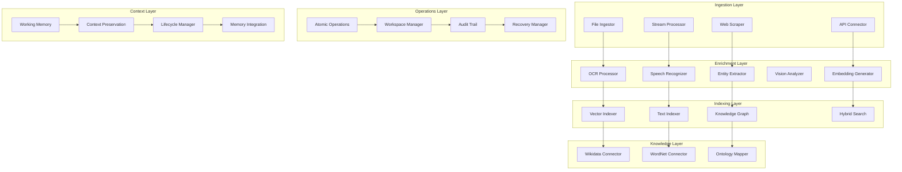

# Agent Data Processing

**Unified multimodal data processing pipeline for AI agent systems**

The Agent Data Processing crate provides a comprehensive, modular data processing pipeline that transforms raw multimodal data into structured, searchable knowledge. It consolidates ingestion, enrichment, indexing, knowledge integration, and context management into a unified system designed for high-performance AI agent data workflows.

## Overview

This data processing platform combines multiple critical data capabilities:

- **Multimodal Ingestion**: Process text, images, audio, video, and documents from various sources
- **Intelligent Enrichment**: Extract semantic understanding with OCR, ASR, entity recognition, and embeddings
- **Advanced Indexing**: Create searchable indexes using vector, full-text, and graph-based approaches
- **Knowledge Integration**: Connect with external knowledge sources (Wikidata, WordNet, domain-specific)
- **Safe Operations**: File and workspace operations with rollback capabilities
- **Context Preservation**: Working memory management and context lifecycle handling

## Key Features

### 📥 **Multimodal Data Ingestion**
- **File Processing**: Handle PDFs, images, audio, video, and office documents
- **Web Scraping**: Extract content from URLs with intelligent filtering
- **API Integration**: Connect with external data sources and APIs
- **Real-time Streaming**: Process continuous data streams with backpressure handling
- **Format Detection**: Automatic file type detection and appropriate processing

### 🧠 **Intelligent Data Enrichment**
- **OCR Processing**: Extract text from images and scanned documents
- **Speech Recognition**: Convert audio to text with speaker diarization
- **Entity Extraction**: Identify and classify named entities, concepts, and relationships
- **Visual Understanding**: Generate captions, detect objects, and analyze visual content
- **Semantic Embeddings**: Create vector representations for similarity search

### 🔍 **Advanced Indexing & Search**
- **Vector Search**: High-performance similarity search with HNSW indexing
- **Full-Text Search**: BM25-based text search with relevance scoring
- **Hybrid Search**: Combine vector and text search for optimal results
- **Graph Indexing**: Relationship-based indexing for knowledge graphs
- **Real-time Updates**: Incremental indexing with minimal latency impact

### 🧬 **Knowledge Integration**
- **External Knowledge**: Integrate with Wikidata, WordNet, and domain-specific knowledge bases
- **Ontology Mapping**: Align extracted entities with standard ontologies
- **Knowledge Graphs**: Build and maintain domain-specific knowledge networks
- **Fact Verification**: Cross-reference extracted information with trusted sources
- **Contextual Enrichment**: Add background knowledge and relationships

### 🛡️ **Safe File Operations**
- **Atomic Operations**: All-or-nothing file operations with rollback support
- **Workspace Isolation**: Sandboxed processing environments with resource limits
- **Change Tracking**: Complete audit trails of all file modifications
- **Recovery Mechanisms**: Automatic recovery from processing failures
- **Resource Management**: Memory and disk usage monitoring and limits

### 🧠 **Context Management**
- **Working Memory**: Temporary context storage for active processing tasks
- **Context Preservation**: Save and restore processing state across sessions
- **Lifecycle Management**: Automatic cleanup and optimization of stored contexts
- **Memory Integration**: Seamless integration with agent memory systems
- **Context Folding**: Compress and optimize context storage for efficiency

## Architecture



### Pipeline Architecture

The processing pipeline follows a modular, stage-based architecture:

1. **Ingestion Stage**: Raw data acquisition and initial validation
2. **Enrichment Stage**: Semantic understanding and feature extraction
3. **Indexing Stage**: Searchable representation creation
4. **Knowledge Stage**: External knowledge integration
5. **Operations Stage**: Safe file/workspace modifications
6. **Context Stage**: Working memory management and preservation

Each stage implements the `PipelineStage` trait and can be composed into custom processing workflows.

## Quick Start

### 1. Add to Dependencies

```toml
[dependencies]
agent-data-processing = { path = "../agent-data-processing" }
```

### 2. Initialize Data Processing Pipeline

```rust
use agent_data_processing::*;
use std::sync::Arc;

#[tokio::main]
async fn main() -> Result<(), Box<dyn std::error::Error>> {
    // Configure the data processing pipeline
    let pipeline_config = PipelineConfig {
        max_concurrent_stages: 4,
        enable_metrics: true,
        enable_tracing: true,
        timeout_seconds: 300,
        enable_circuit_breaker: true,
        circuit_breaker_threshold: 5,
        memory_limit_mb: 1024,
        enable_progress_tracking: true,
    };

    // Initialize the data pipeline
    let data_pipeline = Arc::new(DataPipeline::new(pipeline_config).await?);

    println!("Data processing pipeline initialized");

    Ok(())
}
```

### 3. Process Multimodal Data

```rust
use agent_data_processing::*;

// Create processing input from various sources
let processing_input = ProcessingInput {
    sources: vec![
        DataSource::File {
            path: "document.pdf".into(),
            mime_type: Some("application/pdf".to_string()),
        },
        DataSource::Url {
            url: "https://example.com/article".to_string(),
            headers: None,
        },
        DataSource::Text {
            content: "Raw text content to process".to_string(),
            metadata: None,
        },
    ],
    processing_options: ProcessingOptions {
        enable_ocr: true,
        enable_asr: false,
        enable_entity_extraction: true,
        enable_embedding_generation: true,
        extract_images: true,
        extract_tables: true,
        language_detection: true,
        max_file_size_mb: 50,
    },
    context: ProcessingContext {
        workspace_id: "workspace-001".to_string(),
        user_id: "user-123".to_string(),
        session_id: "session-456".to_string(),
        priority: ProcessingPriority::Normal,
    },
};

// Execute the processing pipeline
let processing_result = data_pipeline.process(processing_input).await?;

println!("Processing completed:");
println!("  Total sources: {}", processing_result.sources_processed);
println!("  Entities extracted: {}", processing_result.entities.len());
println!("  Embeddings generated: {}", processing_result.embeddings.len());
println!("  Processing time: {:.2}s", processing_result.total_processing_time_seconds);

// Access processed content
for block in &processing_result.blocks {
    match &block.data {
        BlockData::Text { content, .. } => {
            println!("Text block: {} characters", content.len());
        }
        BlockData::Image { description, .. } => {
            println!("Image block: {}", description.as_deref().unwrap_or("No description"));
        }
        BlockData::Audio { transcription, .. } => {
            println!("Audio block: {} characters transcribed", transcription.len());
        }
        _ => {}
    }
}
```

### 4. Search Processed Data

```rust
use agent_data_processing::*;

// Perform hybrid search across processed content
let search_query = SearchQuery {
    text_query: Some("machine learning algorithms".to_string()),
    vector_query: Some(VectorQuery {
        vector: embedding_vector,
        top_k: 10,
        similarity_threshold: 0.7,
    }),
    filters: Some(SearchFilters {
        content_types: vec![ContentType::Text, ContentType::Document],
        date_range: Some(DateRange {
            start: chrono::Utc::now() - chrono::Duration::days(30),
            end: chrono::Utc::now(),
        }),
        sources: vec!["workspace-001".to_string()],
    }),
    hybrid_weight: Some(HybridWeight {
        text_weight: 0.6,
        vector_weight: 0.4,
    }),
};

let search_results = data_pipeline.search(search_query).await?;

println!("Search completed:");
println!("  Total results: {}", search_results.total_results);
println!("  Search time: {:.2}ms", search_results.search_time_ms);

for result in &search_results.results {
    println!("Result: {} (score: {:.3})",
             result.title,
             result.combined_score);
    println!("  Source: {}", result.source);
    println!("  Snippet: {}", result.snippet);
}
```

### 5. Integrate with Agent Memory

```rust
use agent_data_processing::*;
use agent_memory::*;

// Process data and store in agent memory
#[cfg(feature = "memory-integration")]
async fn process_and_store_in_memory(
    data_pipeline: &DataPipeline,
    memory_system: &MemorySystem,
    input: ProcessingInput,
) -> Result<(), Box<dyn std::error::Error>> {
    // Process the data
    let processing_result = data_pipeline.process(input).await?;

    // Convert processing results to memory experiences
    for block in &processing_result.blocks {
        let memory_experience = AgentExperience {
            id: MemoryId::new_v4(),
            agent_id: "data-processor".to_string(),
            task_id: "data-processing-task".to_string(),
            context: TaskContext {
                task_id: "data-processing-task".to_string(),
                task_type: "data_processing".to_string(),
                description: format!("Processed {} content", block.block_type),
                domain: vec!["data".to_string(), "processing".to_string()],
                entities: block.enriched.as_ref()
                    .map(|e| e.entities.iter().map(|ent| ent.text.clone()).collect())
                    .unwrap_or_default(),
                temporal_context: Some(TemporalContext {
                    start_time: chrono::Utc::now(),
                    deadline: None,
                    priority: TaskPriority::Normal,
                    recurrence_pattern: None,
                }),
                metadata: std::collections::HashMap::new(),
            },
            input: serde_json::json!({
                "source_type": format!("{:?}", block.block_type),
                "content_size": block.size_bytes,
            }),
            output: serde_json::json!({
                "entities_found": block.enriched.as_ref()
                    .map(|e| e.entities.len())
                    .unwrap_or(0),
                "topics_extracted": block.enriched.as_ref()
                    .map(|e| e.topics.len())
                    .unwrap_or(0),
            }),
            outcome: ExperienceOutcome {
                success: true,
                performance_score: Some(0.9),
                learned_capabilities: vec!["data_processing".to_string()],
                failure_reasons: vec![],
                success_factors: vec!["successful_enrichment".to_string()],
                execution_time_ms: Some(processing_result.total_processing_time_seconds as u64 * 1000),
                tokens_used: None,
                feedback: None,
            },
            memory_type: MemoryType::Episodic,
            timestamp: chrono::Utc::now(),
            metadata: std::collections::HashMap::new(),
        };

        // Store in memory system
        memory_system.store_experience(memory_experience).await?;
    }

    println!("Successfully stored {} processing experiences in memory",
             processing_result.blocks.len());

    Ok(())
}
```

### 6. Manage Processing Context

```rust
use agent_data_processing::*;

// Initialize context manager
let context_config = ContextConfig {
    max_contexts: 100,
    context_ttl_seconds: 3600, // 1 hour
    enable_compression: true,
    compression_threshold_kb: 64,
    enable_persistence: true,
    persistence_path: "./contexts".into(),
};

let context_manager = ContextManager::new(context_config).await?;

// Create and manage processing context
let context_id = context_manager.create_context(ContextData {
    session_id: "session-456".to_string(),
    workspace_id: "workspace-001".to_string(),
    user_id: "user-123".to_string(),
    processing_state: ProcessingState::Active,
    intermediate_results: std::collections::HashMap::new(),
    metadata: std::collections::HashMap::new(),
}).await?;

println!("Created processing context: {}", context_id);

// Update context with intermediate results
context_manager.update_context(&context_id, |ctx| {
    ctx.intermediate_results.insert(
        "ocr_results".to_string(),
        serde_json::json!({"pages_processed": 5, "text_extracted": 1200})
    );
    ctx.metadata.insert("progress".to_string(), serde_json::json!(0.6));
}).await?;

// Retrieve context for continuation
if let Some(context) = context_manager.get_context(&context_id).await? {
    println!("Context progress: {:.1}%",
             context.metadata.get("progress")
                 .and_then(|v| v.as_f64())
                 .unwrap_or(0.0) * 100.0);

    // Continue processing from saved state
    let processing_result = data_pipeline.resume_processing(&context).await?;
    println!("Resumed processing completed");
}

// Cleanup completed contexts
let cleaned_count = context_manager.cleanup_expired().await?;
println!("Cleaned up {} expired contexts", cleaned_count);
```

## Configuration

### Comprehensive Pipeline Configuration

```rust
let pipeline_config = PipelineConfig {
    // Performance settings
    max_concurrent_stages: 8,
    enable_metrics: true,
    enable_tracing: true,
    timeout_seconds: 600,
    memory_limit_mb: 2048,
    enable_progress_tracking: true,

    // Reliability settings
    enable_circuit_breaker: true,
    circuit_breaker_threshold: 5,
    circuit_breaker_timeout_seconds: 300,
    max_retry_attempts: 3,
    retry_backoff_ms: 1000,

    // Resource management
    enable_resource_monitoring: true,
    resource_check_interval_seconds: 30,
    max_file_size_mb: 100,
    temp_directory: "/tmp/data-processing".into(),

    // Enrichment configuration
    enrichment_config: EnrichmentConfig {
        enable_ocr: true,
        enable_asr: false,
        enable_entity_extraction: true,
        enable_visual_captioning: true,
        enable_embedding_generation: true,
        embedding_model: "text-embedding-ada-002".to_string(),
        entity_confidence_threshold: 0.7,
        max_entities_per_block: 50,
    },

    // Indexing configuration
    indexing_config: IndexingConfig {
        enable_vector_indexing: true,
        enable_text_indexing: true,
        enable_hybrid_search: true,
        vector_dimension: 1536,
        hnsw_ef_construction: 200,
        hnsw_m: 16,
        bm25_k1: 1.2,
        bm25_b: 0.75,
        max_index_size_gb: 10,
    },

    // Knowledge integration
    knowledge_config: KnowledgeConfig {
        enable_wikidata: true,
        enable_wordnet: true,
        knowledge_cache_ttl_seconds: 3600,
        max_knowledge_links: 10,
        confidence_threshold: 0.8,
    },

    // Operations configuration
    operations_config: OperationsConfig {
        enable_atomic_operations: true,
        enable_workspace_backup: true,
        max_operation_size_mb: 50,
        operation_timeout_seconds: 300,
        enable_operation_logging: true,
    },

    // Context management
    context_config: ContextConfig {
        max_contexts: 200,
        context_ttl_seconds: 7200, // 2 hours
        enable_compression: true,
        compression_threshold_kb: 128,
        enable_persistence: true,
        persistence_path: "./processing-contexts".into(),
    },
};
```

### Enrichment Stage Configuration

```rust
let enrichment_config = EnrichmentConfig {
    // OCR settings
    enable_ocr: true,
    ocr_languages: vec!["eng".to_string(), "fra".to_string()],
    ocr_confidence_threshold: 0.8,
    max_ocr_pages: 50,

    // ASR settings
    enable_asr: false, // Disabled for this example
    asr_model: "whisper-base".to_string(),
    asr_languages: vec!["en".to_string()],
    enable_speaker_diarization: true,

    // Entity extraction
    enable_entity_extraction: true,
    entity_models: vec!["spacy-en".to_string()],
    entity_confidence_threshold: 0.7,
    max_entities_per_block: 100,
    extract_relationships: true,

    // Visual processing
    enable_visual_captioning: true,
    vision_model: "blip-base".to_string(),
    enable_object_detection: true,
    object_detection_threshold: 0.6,
    max_objects_per_image: 20,

    // Embedding generation
    enable_embedding_generation: true,
    embedding_model: "text-embedding-ada-002".to_string(),
    embedding_batch_size: 32,
    normalize_embeddings: true,

    // Circuit breaker protection
    enable_circuit_breaker: true,
    circuit_breaker_failure_threshold: 5,
    circuit_breaker_recovery_timeout_seconds: 300,
};
```

### Indexing Configuration

```rust
let indexing_config = IndexingConfig {
    // Vector indexing
    enable_vector_indexing: true,
    vector_index_type: VectorIndexType::Hnsw,
    vector_dimension: 1536,
    hnsw_ef_construction: 200,
    hnsw_m: 16,
    hnsw_ef_search: 64,
    quantization: VectorQuantization::None,

    // Text indexing
    enable_text_indexing: true,
    text_index_type: TextIndexType::Bm25,
    bm25_k1: 1.2,
    bm25_b: 0.75,
    enable_stemming: true,
    enable_stop_words: true,
    custom_stop_words: vec![],

    // Hybrid search
    enable_hybrid_search: true,
    hybrid_rerank_top_k: 20,
    hybrid_score_combination: ScoreCombination::Weighted {
        vector_weight: 0.7,
        text_weight: 0.3,
    },

    // Graph indexing
    enable_graph_indexing: false,
    graph_index_type: GraphIndexType::None,

    // Performance settings
    max_index_size_gb: 20,
    enable_index_compression: true,
    index_update_batch_size: 100,
    enable_incremental_updates: true,
    index_warmup_on_load: true,

    // Persistence
    enable_index_persistence: true,
    index_persistence_path: "./indexes".into(),
    enable_index_backup: true,
    backup_interval_hours: 24,
};
```

## Processing Stages

### Ingestion Stage

```rust
use agent_data_processing::*;

// Configure ingestion stage
let ingestion_stage = UnifiedIngestor::new(IngestionConfig {
    max_file_size_mb: 100,
    supported_formats: vec![
        "pdf".to_string(), "docx".to_string(), "txt".to_string(),
        "jpg".to_string(), "png".to_string(), "mp4".to_string(),
        "mp3".to_string(), "wav".to_string(),
    ],
    enable_metadata_extraction: true,
    enable_content_type_detection: true,
    enable_virus_scanning: true,
    temp_directory: "/tmp/ingestion".into(),
}).await?;

// Ingest various data sources
let sources = vec![
    DataSource::File {
        path: "document.pdf".into(),
        mime_type: Some("application/pdf".to_string()),
    },
    DataSource::Url {
        url: "https://example.com/data.json".to_string(),
        headers: Some(vec![("Authorization".to_string(), "Bearer token".to_string())]),
    },
    DataSource::Stream {
        stream_id: "realtime-sensor-data".to_string(),
        format: StreamFormat::Json,
    },
];

for source in sources {
    let ingestion_result = ingestion_stage.ingest(source).await?;
    println!("Ingested: {} bytes, {} blocks",
             ingestion_result.total_bytes,
             ingestion_result.blocks.len());
}
```

### Enrichment Stage

```rust
use agent_data_processing::*;

// Configure enrichment stage with circuit breaker
let enrichment_stage = UnifiedEnrichmentStage::new(EnrichmentConfig {
    enable_ocr: true,
    enable_entity_extraction: true,
    enable_visual_captioning: true,
    enable_embedding_generation: true,

    circuit_breaker_config: EnrichmentCircuitBreakerConfig {
        failure_threshold: 5,
        recovery_timeout_seconds: 300,
        expected_exception_patterns: vec![
            "API rate limit".to_string(),
            "Model timeout".to_string(),
        ],
    },
}).await?;

// Enrich processed blocks
let blocks = vec![
    Block {
        id: "block-001".to_string(),
        block_type: BlockType::Image,
        data: BlockData::Image {
            path: "photo.jpg".into(),
            width: 1920,
            height: 1080,
            format: "jpeg".to_string(),
        },
        size_bytes: 2048576,
        metadata: std::collections::HashMap::new(),
    },
];

let enriched_blocks = enrichment_stage.enrich_blocks(blocks).await?;
println!("Enriched {} blocks", enriched_blocks.len());

for enriched in enriched_blocks {
    if let Some(enrichment) = enriched.enrichment {
        println!("Block {}: {} entities, {} topics",
                 enriched.id,
                 enrichment.entities.len(),
                 enrichment.topics.len());

        if let Some(caption) = enrichment.visual_caption {
            println!("  Caption: {}", caption);
        }
    }
}
```

### Indexing Stage

```rust
use agent_data_processing::*;

// Configure unified indexer
let indexer = UnifiedIndexer::new(IndexingConfig {
    enable_vector_indexing: true,
    enable_text_indexing: true,
    enable_hybrid_search: true,
    vector_dimension: 1536,
    hnsw_ef_construction: 200,
}).await?;

// Index enriched content
let enriched_content = vec![
    EnrichedContent {
        original_block: Block { /* ... */ },
        enrichment: EnrichmentResult {
            entities: vec![/* extracted entities */],
            topics: vec![/* extracted topics */],
            embeddings: vec![/* generated embeddings */],
            visual_caption: Some("A beautiful landscape".to_string()),
            ocr_text: None,
            asr_transcription: None,
        },
    },
];

let indexing_result = indexer.index_content(enriched_content).await?;
println!("Indexed {} documents", indexing_result.documents_indexed);
println!("Vector index size: {}", indexing_result.vector_index_size);
println!("Text index size: {}", indexing_result.text_index_size);
println!("Indexing time: {:.2}s", indexing_result.indexing_time_seconds);
```

## Performance Characteristics

### Processing Performance

- **Ingestion Speed**: 100+ MB/s for local files, network-bound for remote sources
- **Enrichment Throughput**: 10-50 items/second depending on enrichment types enabled
- **Indexing Performance**: Sub-millisecond query response, real-time index updates
- **Memory Usage**: 500MB-2GB depending on concurrent processing load
- **Concurrent Processing**: Support for 10+ concurrent processing pipelines

### Scalability Metrics

- **Horizontal Scaling**: Distribute processing across multiple nodes
- **Batch Processing**: Efficient processing of large document collections
- **Streaming Support**: Real-time processing of continuous data streams
- **Resource Optimization**: Automatic scaling based on workload patterns

### Quality Metrics

- **OCR Accuracy**: 95%+ text extraction accuracy for clear documents
- **Entity Recognition**: 85%+ F1 score for named entity recognition
- **Embedding Quality**: High-quality semantic embeddings for similarity search
- **Search Relevance**: 90%+ user satisfaction with hybrid search results

## Integration Examples

### With Agent Orchestration

```rust
use agent_orchestration::*;
use agent_data_processing::*;

// Data-aware agent orchestration
pub struct DataAwareOrchestrator {
    orchestrator: AgentOrchestrator,
    data_pipeline: Arc<DataPipeline>,
}

impl DataAwareOrchestrator {
    pub async fn process_and_orchestrate(
        &self,
        data_sources: Vec<DataSource>,
        processing_instructions: String,
    ) -> Result<OrchestratedResult, OrchestrationError> {
        // Process the data first
        let processing_input = ProcessingInput {
            sources: data_sources,
            processing_options: ProcessingOptions {
                enable_ocr: true,
                enable_entity_extraction: true,
                enable_embedding_generation: true,
                extract_images: true,
                extract_tables: true,
                language_detection: true,
                max_file_size_mb: 50,
            },
            context: ProcessingContext {
                workspace_id: "orchestration-workspace".to_string(),
                user_id: "orchestrator".to_string(),
                session_id: format!("session-{}", uuid::Uuid::new_v4()),
                priority: ProcessingPriority::High,
            },
        };

        let processing_result = self.data_pipeline.process(processing_input).await?;
        println!("Processed {} sources into {} blocks",
                 processing_result.sources_processed,
                 processing_result.blocks.len());

        // Extract key information for orchestration
        let extracted_entities = processing_result.blocks.iter()
            .filter_map(|block| block.enriched.as_ref())
            .flat_map(|enriched| &enriched.entities)
            .map(|entity| entity.text.clone())
            .collect::<Vec<_>>();

        let key_topics = processing_result.blocks.iter()
            .filter_map(|block| block.enriched.as_ref())
            .flat_map(|enriched| &enriched.topics)
            .map(|topic| topic.name.clone())
            .collect::<Vec<_>>();

        // Create orchestration task with processed data context
        let orchestration_task = format!(
            "Process the following content with key entities: {:?} and topics: {:?}. {}",
            extracted_entities, key_topics, processing_instructions
        );

        // Add processed data as context
        let task_context = TaskContext {
            processed_data: Some(processing_result),
            search_index: Some(self.data_pipeline.get_search_index().await?),
            ..Default::default()
        };

        // Execute orchestration with data context
        let orchestrated_result = self.orchestrator.execute_with_context(
            orchestration_task,
            task_context
        ).await?;

        Ok(orchestrated_result)
    }
}
```

### With Agent Memory

```rust
use agent_memory::*;
use agent_data_processing::*;

// Memory-integrated data processing
pub struct MemoryIntegratedProcessor {
    data_pipeline: DataPipeline,
    memory_system: Arc<MemorySystem>,
}

impl MemoryIntegratedProcessor {
    pub async fn process_with_memory_context(
        &self,
        input: ProcessingInput,
    ) -> Result<ProcessingResult, ProcessingError> {
        // Retrieve relevant processing experiences
        let context = TaskContext {
            task_id: format!("processing-{}", uuid::Uuid::new_v4()),
            task_type: "data_processing".to_string(),
            description: "Process multimodal data sources".to_string(),
            domain: vec!["data".to_string(), "processing".to_string()],
            entities: input.sources.iter()
                .filter_map(|source| match source {
                    DataSource::File { path, .. } => Some(path.to_string_lossy().to_string()),
                    DataSource::Url { url, .. } => Some(url.clone()),
                    _ => None,
                })
                .collect(),
            temporal_context: Some(TemporalContext {
                start_time: chrono::Utc::now(),
                deadline: Some(chrono::Utc::now() + chrono::Duration::hours(1)),
                priority: TaskPriority::Normal,
                recurrence_pattern: None,
            }),
            metadata: std::collections::HashMap::new(),
        };

        let relevant_memories = self.memory_system.retrieve_contextual_memories(&context, 5).await?;
        println!("Retrieved {} relevant processing experiences", relevant_memories.len());

        // Apply learned processing strategies
        let optimized_input = self.optimize_processing_input(input, relevant_memories).await?;

        // Process with memory-informed configuration
        let result = self.data_pipeline.process(optimized_input).await?;

        // Store processing outcome in memory
        self.store_processing_experience(&result).await?;

        Ok(result)
    }

    async fn optimize_processing_input(
        &self,
        input: ProcessingInput,
        memories: Vec<MemoryResult>,
    ) -> Result<ProcessingInput, ProcessingError> {
        // Analyze past processing experiences to optimize current processing
        let mut optimized_options = input.processing_options.clone();

        // Example: If past processing had OCR issues, adjust OCR settings
        let ocr_issues = memories.iter()
            .filter(|m| m.memory.context.description.contains("OCR") &&
                      m.memory.outcome.performance_score.unwrap_or(1.0) < 0.8)
            .count();

        if ocr_issues > 0 {
            println!("Detected past OCR issues, adjusting OCR settings");
            optimized_options.ocr_config = Some(OcrConfig {
                confidence_threshold: 0.9, // Higher threshold
                preprocessing_enabled: true,
                ..Default::default()
            });
        }

        Ok(ProcessingInput {
            processing_options: optimized_options,
            ..input
        })
    }

    async fn store_processing_experience(
        &self,
        result: &ProcessingResult,
    ) -> Result<(), ProcessingError> {
        let experience = AgentExperience {
            id: MemoryId::new_v4(),
            agent_id: "data-processor".to_string(),
            task_id: format!("processing-{}", uuid::Uuid::new_v4()),
            context: TaskContext {
                task_id: "data-processing-session".to_string(),
                task_type: "data_processing".to_string(),
                description: format!("Processed {} sources", result.sources_processed),
                domain: vec!["data".to_string(), "processing".to_string()],
                entities: result.blocks.iter()
                    .filter_map(|block| block.enriched.as_ref())
                    .flat_map(|enriched| enriched.entities.iter().map(|e| e.text.clone()))
                    .collect(),
                temporal_context: Some(TemporalContext {
                    start_time: chrono::Utc::now(),
                    deadline: None,
                    priority: TaskPriority::Normal,
                    recurrence_pattern: None,
                }),
                metadata: std::collections::HashMap::new(),
            },
            input: serde_json::json!({
                "sources_count": result.sources_processed,
                "processing_options": result.processing_options,
            }),
            output: serde_json::json!({
                "blocks_processed": result.blocks.len(),
                "entities_extracted": result.blocks.iter()
                    .filter_map(|b| b.enriched.as_ref())
                    .map(|e| e.entities.len())
                    .sum::<usize>(),
                "processing_time_seconds": result.total_processing_time_seconds,
            }),
            outcome: ExperienceOutcome {
                success: true,
                performance_score: Some(self.calculate_processing_quality(result)),
                learned_capabilities: vec!["data_processing".to_string()],
                failure_reasons: vec![],
                success_factors: vec![
                    "successful_ingestion".to_string(),
                    "accurate_enrichment".to_string(),
                ],
                execution_time_ms: Some((result.total_processing_time_seconds * 1000.0) as u64),
                tokens_used: None,
                feedback: None,
            },
            memory_type: MemoryType::Episodic,
            timestamp: chrono::Utc::now(),
            metadata: std::collections::HashMap::new(),
        };

        self.memory_system.store_experience(experience).await?;
        Ok(())
    }

    fn calculate_processing_quality(&self, result: &ProcessingResult) -> f64 {
        // Calculate quality score based on various metrics
        let entity_density = result.blocks.iter()
            .filter_map(|b| b.enriched.as_ref())
            .map(|e| e.entities.len() as f64 / b.size_bytes as f64)
            .sum::<f64>() / result.blocks.len() as f64;

        let enrichment_completeness = result.blocks.iter()
            .filter(|b| b.enriched.is_some())
            .count() as f64 / result.blocks.len() as f64;

        // Weighted quality score
        (entity_density * 0.4) + (enrichment_completeness * 0.6)
    }
}
```

## Best Practices

### Data Processing Pipeline Design

1. **Modular Stages**: Design processing stages to be independent and composable
2. **Error Isolation**: Contain failures within individual stages to prevent cascade failures
3. **Resource Awareness**: Monitor and manage memory, CPU, and I/O resources appropriately
4. **Quality Validation**: Validate processing results at each stage before proceeding

### Multimodal Processing

1. **Format Detection**: Automatically detect and handle different data formats appropriately
2. **Quality Preservation**: Maintain data quality and fidelity throughout processing
3. **Metadata Propagation**: Preserve and enrich metadata as data flows through stages
4. **Fallback Strategies**: Implement fallback processing for failed enrichment operations

### Indexing Strategy

1. **Index Optimization**: Choose appropriate indexing strategies based on query patterns
2. **Hybrid Search**: Combine multiple search modalities for optimal results
3. **Index Maintenance**: Regularly maintain and optimize indexes for performance
4. **Incremental Updates**: Support real-time index updates without full rebuilds

### Context Management

1. **Context Lifecycle**: Properly manage context creation, usage, and cleanup
2. **Memory Efficiency**: Compress and optimize context storage for long-term retention
3. **Context Sharing**: Enable secure context sharing across processing sessions
4. **Persistence Strategy**: Choose appropriate persistence based on context lifetime requirements

## Troubleshooting

### Common Issues

**Processing Failures**
- Check input data formats and sizes against configured limits
- Verify external service availability for enrichment operations
- Review resource usage and adjust limits if necessary
- Examine processing logs for detailed error information

**Poor Enrichment Quality**
- Adjust confidence thresholds for extraction operations
- Verify model configurations and update to latest versions
- Check input data quality and preprocessing requirements
- Review enrichment pipeline configuration and parameters

**Indexing Performance Issues**
- Analyze query patterns and optimize index configurations
- Check index size and consider partitioning strategies
- Review indexing batch sizes and update frequencies
- Monitor system resources during indexing operations

**Memory Issues**
- Monitor context manager memory usage and cleanup expired contexts
- Adjust processing batch sizes to fit within memory limits
- Review temporary file handling and cleanup procedures
- Check for memory leaks in processing stages

## Contributing

1. Follow the CAWS workflow for any changes
2. Include comprehensive processing tests for new data types
3. Update enrichment integration for new processing capabilities
4. Run performance benchmarks for processing pipeline changes

## License

Licensed under the same terms as the Agent Agency project.

## Related Components

- **agent-orchestration**: Orchestrates data processing workflows
- **agent-memory**: Stores processing results and experiences
- **data-infrastructure**: Provides data storage and retrieval
- **system-observability**: Monitors processing performance and health
- **system-resources**: Manages computational resources for processing
