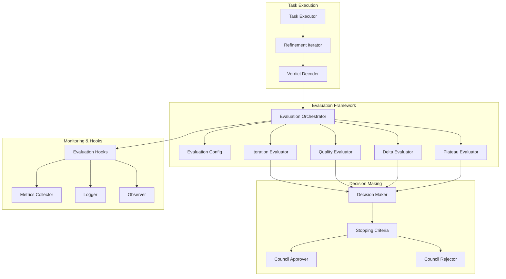

# Agent Evaluation Framework

**Iteration Limits, Quality Ceiling Detection, and Delta Thresholds for Autonomous Task Execution**

The Agent Evaluation Framework provides a comprehensive evaluation system for autonomous task execution, implementing sophisticated stopping criteria to prevent infinite loops, detect quality plateaus, and optimize refinement iterations through configurable thresholds and intelligent decision-making.

## Overview

This evaluation framework combines multiple critical evaluation capabilities:

- **Iteration Limits**: Prevent infinite refinement loops with configurable maximum iterations
- **Quality Ceiling Detection**: Stop when quality reaches predetermined thresholds
- **Delta Thresholds**: Detect diminishing returns through improvement tracking
- **Plateau Detection**: Identify when quality improvements stagnate over time
- **Satisficing Criteria**: Balance perfection with acceptable quality levels
- **Council Integration**: Work with constitutional council verdicts for decision making
- **Evaluation Hooks**: Extensible hooks for custom evaluation logic and monitoring

## Key Features

### 🔄 **Iteration Control**
- **Maximum Iterations**: Configurable limits to prevent infinite loops
- **Iteration Tracking**: Complete history of all refinement iterations
- **Early Termination**: Intelligent stopping based on multiple criteria
- **Resource Protection**: Prevent excessive resource consumption from over-iteration

### 📊 **Quality Assessment**
- **Quality Scoring**: Quantitative quality evaluation (0.0-1.0 scale)
- **Improvement Tracking**: Monitor quality improvements between iterations
- **Ceiling Detection**: Stop when quality reaches acceptable maximum levels
- **Satisficing Thresholds**: Balance quality requirements with resource constraints

### 📈 **Delta Analysis**
- **Improvement Delta**: Track quality improvement between iterations
- **Diminishing Returns**: Detect when improvements become marginal
- **Threshold Configuration**: Configurable minimum improvement requirements
- **Trend Analysis**: Analyze quality improvement trends over time

### 🏔️ **Plateau Detection**
- **Plateau Window**: Configurable window size for plateau analysis
- **Standard Deviation**: Statistical analysis of quality variance
- **Stagnation Detection**: Identify when quality stops improving significantly
- **Adaptive Thresholds**: Dynamic plateau detection based on historical data

### ⚖️ **Decision Integration**
- **Council Verdicts**: Integration with constitutional council decisions
- **Approval Workflows**: Handle council approvals and rejections
- **Verdict Processing**: Convert council verdicts into evaluation decisions
- **Multi-Criteria Evaluation**: Combine multiple evaluation factors for decisions

### 🔌 **Extensible Architecture**
- **Evaluation Hooks**: Pluggable hooks for custom evaluation logic
- **Async Evaluation**: Asynchronous evaluation supporting complex analysis
- **Configurable Criteria**: Customizable evaluation criteria and thresholds
- **Monitoring Integration**: Built-in metrics and observability

## Architecture



### Evaluation Flow

1. **Task Execution**: Initial task execution produces results
2. **Iteration Evaluation**: Assess current iteration quality and improvement
3. **Multiple Criteria**: Evaluate against all configured stopping criteria
4. **Decision Making**: Determine whether to continue refining or stop
5. **Hook Execution**: Run evaluation hooks for monitoring and custom logic
6. **Verdict Processing**: Handle council verdicts and approvals

## Quick Start

### 1. Add to Dependencies

```toml
[dependencies]
agent-evaluation = { path = "../agent-evaluation" }
serde = { version = "1.0", features = ["derive"] }
tokio = { version = "1.0", features = ["full"] }
```

### 2. Create Evaluation Configuration

```rust
use agent_evaluation::*;

// Create evaluation configuration
let evaluation_config = EvaluationConfig {
    max_iterations: 5,                    // Maximum 5 refinement iterations
    satisficing_threshold: 0.9,           // Stop when quality >= 90%
    delta_threshold: 0.05,                // Require 5% improvement minimum
    quality_ceiling: 0.95,                // Stop immediately at 95% quality
    plateau_detection_window: 3,          // Check last 3 iterations for plateau
    plateau_std_dev_threshold: 0.01,      // Plateau if std dev < 1%
};

println!("Evaluation configuration:");
println!("  Max iterations: {}", evaluation_config.max_iterations);
println!("  Satisficing threshold: {:.1}%", evaluation_config.satisficing_threshold * 100.0);
println!("  Quality ceiling: {:.1}%", evaluation_config.quality_ceiling * 100.0);
println!("  Delta threshold: {:.1}%", evaluation_config.delta_threshold * 100.0);
```

### 3. Initialize Evaluation Orchestrator

```rust
use agent_evaluation::*;

// Create evaluation orchestrator
let evaluation_orchestrator = EvaluationOrchestrator::new(evaluation_config);

// Alternative: Use default configuration
let default_orchestrator = EvaluationOrchestrator::default();

println!("Evaluation orchestrator initialized with config: {:?}", evaluation_orchestrator.config());
```

### 4. Evaluate Task Iterations

```rust
use agent_evaluation::*;
use agent_agency_contracts::final_verdict::*;
use std::sync::Arc;

// Simulate task execution results
let mut iteration_results = Vec::new();

// Iteration 1: Initial execution (quality: 0.6)
let verdict1 = Arc::new(FinalVerdictContract {
    decision: FinalDecision::NeedsRefinement,
    votes: vec![], // Simplified for example
    dissent: "Initial implementation lacks proper error handling".to_string(),
    remediation: vec!["Add comprehensive error handling".to_string()],
    constitutional_refs: vec![],
    verification_summary: VerificationSummary::default(),
});

let evaluation1 = evaluation_orchestrator.evaluate_iteration(
    1,
    0.6, // quality_score
    verdict1,
).await?;

iteration_results.push(evaluation1);

// Iteration 2: After error handling improvements (quality: 0.75)
let verdict2 = Arc::new(FinalVerdictContract {
    decision: FinalDecision::NeedsRefinement,
    votes: vec![],
    dissent: "Test coverage is insufficient".to_string(),
    remediation: vec!["Add comprehensive unit tests".to_string()],
    constitutional_refs: vec![],
    verification_summary: VerificationSummary::default(),
});

let evaluation2 = evaluation_orchestrator.evaluate_iteration(
    2,
    0.75, // quality_score (improvement: +0.15)
    verdict2,
).await?;

iteration_results.push(evaluation2);

// Iteration 3: After adding tests (quality: 0.88)
let verdict3 = Arc::new(FinalVerdictContract {
    decision: FinalDecision::NeedsRefinement,
    votes: vec![],
    dissent: "Performance could be improved".to_string(),
    remediation: vec!["Optimize database queries".to_string()],
    constitutional_refs: vec![],
    verification_summary: VerificationSummary::default(),
});

let evaluation3 = evaluation_orchestrator.evaluate_iteration(
    3,
    0.88, // quality_score (improvement: +0.13)
    verdict3,
).await?;

iteration_results.push(evaluation3);

// Iteration 4: After performance optimization (quality: 0.94)
let verdict4 = Arc::new(FinalVerdictContract {
    decision: FinalDecision::Approved,
    votes: vec![],
    dissent: "".to_string(),
    remediation: vec![],
    constitutional_refs: vec![],
    verification_summary: VerificationSummary::default(),
});

let evaluation4 = evaluation_orchestrator.evaluate_iteration(
    4,
    0.94, // quality_score (improvement: +0.06)
    verdict4,
).await?;

iteration_results.push(evaluation4);

// Display evaluation results
println!("Iteration Evaluation Results:");
for eval in &iteration_results {
    println!("Iteration {}: Quality {:.1}%, Improvement {:.1}%, Continue: {}",
             eval.iteration,
             eval.quality_score * 100.0,
             eval.improvement_delta * 100.0,
             eval.should_continue);

    if let Some(reason) = &eval.stop_reason {
        println!("  Stop Reason: {:?}", reason);
    }
}

// Check final decision
let final_evaluation = iteration_results.last().unwrap();
if final_evaluation.should_continue {
    println!("Task needs further refinement");
} else {
    println!("Task evaluation complete - {:?}", final_evaluation.stop_reason.as_ref().unwrap());
}
```

### 5. Implement Custom Evaluation Hooks

```rust
use agent_evaluation::*;
use async_trait::async_trait;

// Implement custom evaluation hook
#[derive(Debug)]
struct MetricsEvaluationHook {
    metrics_collector: Arc<dyn MetricsCollector>,
}

#[async_trait]
impl EvaluationHook for MetricsEvaluationHook {
    async fn on_iteration_start(&self, iteration: u32) -> Result<()> {
        self.metrics_collector.record_counter(
            "evaluation_iterations_started",
            1,
            &[("iteration", &iteration.to_string())]
        ).await?;
        println!("Starting evaluation iteration {}", iteration);
        Ok(())
    }

    async fn on_iteration_complete(&self, evaluation: &IterationEvaluation) -> Result<()> {
        // Record quality metrics
        self.metrics_collector.record_gauge(
            "evaluation_quality_score",
            evaluation.quality_score,
            &[("iteration", &evaluation.iteration.to_string())]
        ).await?;

        // Record improvement metrics
        self.metrics_collector.record_histogram(
            "evaluation_improvement_delta",
            evaluation.improvement_delta,
            &[("iteration", &evaluation.iteration.to_string())]
        ).await?;

        // Record stopping decision
        if !evaluation.should_continue {
            if let Some(reason) = &evaluation.stop_reason {
                self.metrics_collector.record_counter(
                    "evaluation_stops",
                    1,
                    &[("reason", &format!("{:?}", reason))]
                ).await?;
            }
        }

        println!("Completed evaluation iteration {}: Quality {:.1}%, Continue: {}",
                 evaluation.iteration,
                 evaluation.quality_score * 100.0,
                 evaluation.should_continue);

        Ok(())
    }

    async fn on_evaluation_complete(&self, total_iterations: u32, final_quality: f64) -> Result<()> {
        self.metrics_collector.record_histogram(
            "evaluation_total_iterations",
            total_iterations as f64,
            &[]
        ).await?;

        self.metrics_collector.record_gauge(
            "evaluation_final_quality",
            final_quality,
            &[]
        ).await?;

        println!("Evaluation complete: {} iterations, final quality {:.1}%",
                 total_iterations,
                 final_quality * 100.0);

        Ok(())
    }
}

// Use custom hook with orchestrator
let metrics_hook = Arc::new(MetricsEvaluationHook {
    metrics_collector: my_metrics_collector,
});

let orchestrator_with_hooks = EvaluationOrchestrator::with_hooks(
    evaluation_config,
    vec![metrics_hook],
);

// Run evaluation with hooks
let evaluation_result = orchestrator_with_hooks.evaluate_iteration(
    1,
    0.8,
    verdict,
).await?;
```

### 6. Advanced Evaluation Scenarios

```rust
use agent_evaluation::*;

// Example: Early termination due to quality ceiling
let high_quality_config = EvaluationConfig {
    max_iterations: 10,
    satisficing_threshold: 0.9,
    quality_ceiling: 0.95,  // Very high ceiling
    ..Default::default()
};

let high_quality_orchestrator = EvaluationOrchestrator::new(high_quality_config);

// This would trigger QualityCeilingReached
let ceiling_evaluation = high_quality_orchestrator.evaluate_iteration(
    1,
    0.96,  // Above ceiling
    Arc::new(FinalVerdictContract::default()),
).await?;

assert!(!ceiling_evaluation.should_continue);
assert_eq!(ceiling_evaluation.stop_reason, Some(StopReason::QualityCeilingReached));

// Example: Plateau detection
let plateau_config = EvaluationConfig {
    plateau_detection_window: 3,
    plateau_std_dev_threshold: 0.01,  // Very low threshold
    ..Default::default()
};

let plateau_orchestrator = EvaluationOrchestrator::new(plateau_config);

// Simulate plateau: iterations with minimal variation
let plateau_evaluations = vec![
    plateau_orchestrator.evaluate_iteration(1, 0.85, verdict.clone()).await?,
    plateau_orchestrator.evaluate_iteration(2, 0.851, verdict.clone()).await?, // Minimal change
    plateau_orchestrator.evaluate_iteration(3, 0.852, verdict.clone()).await?, // Minimal change
    plateau_orchestrator.evaluate_iteration(4, 0.850, verdict.clone()).await?, // Minimal change
];

// The 4th iteration should detect plateau and stop
assert!(!plateau_evaluations[3].should_continue);
assert_eq!(plateau_evaluations[3].stop_reason, Some(StopReason::QualityPlateau));
```

## Configuration

### Comprehensive Evaluation Configuration

```rust
let evaluation_config = EvaluationConfig {
    // Iteration limits
    max_iterations: 5,                    // Maximum refinement iterations
    plateau_detection_window: 3,          // Window for plateau analysis

    // Quality thresholds
    satisficing_threshold: 0.9,           // Stop when quality >= 90%
    quality_ceiling: 0.95,                // Immediate stop at 95%
    delta_threshold: 0.05,                // Minimum 5% improvement required

    // Plateau detection
    plateau_std_dev_threshold: 0.01,      // Plateau if std dev < 1%
};

// Advanced configuration with custom thresholds
let advanced_config = EvaluationConfig {
    // Conservative settings for critical tasks
    max_iterations: 3,                    // Fewer iterations for critical tasks
    satisficing_threshold: 0.95,          // Higher quality requirement
    quality_ceiling: 0.98,                // Very high ceiling
    delta_threshold: 0.10,                // Require 10% improvement minimum

    // Sensitive plateau detection
    plateau_detection_window: 2,          // Smaller window for faster detection
    plateau_std_dev_threshold: 0.005,     // Very sensitive to changes
};
```

### Evaluation Profiles

```rust
// Predefined evaluation profiles for different use cases
enum EvaluationProfile {
    Conservative,    // High quality requirements, fewer iterations
    Balanced,        // Standard settings for most tasks
    Aggressive,      // Lower thresholds, more iterations allowed
    Experimental,    // Very permissive for research/testing
}

impl EvaluationProfile {
    fn to_config(self) -> EvaluationConfig {
        match self {
            EvaluationProfile::Conservative => EvaluationConfig {
                max_iterations: 3,
                satisficing_threshold: 0.95,
                quality_ceiling: 0.98,
                delta_threshold: 0.10,
                plateau_detection_window: 2,
                plateau_std_dev_threshold: 0.005,
            },
            EvaluationProfile::Balanced => EvaluationConfig::default(),
            EvaluationProfile::Aggressive => EvaluationConfig {
                max_iterations: 10,
                satisficing_threshold: 0.8,
                quality_ceiling: 0.9,
                delta_threshold: 0.02,
                plateau_detection_window: 5,
                plateau_std_dev_threshold: 0.02,
            },
            EvaluationProfile::Experimental => EvaluationConfig {
                max_iterations: 20,
                satisficing_threshold: 0.7,
                quality_ceiling: 0.85,
                delta_threshold: 0.01,
                plateau_detection_window: 10,
                plateau_std_dev_threshold: 0.05,
            },
        }
    }
}

// Use profile-based configuration
let conservative_evaluator = EvaluationOrchestrator::new(
    EvaluationProfile::Conservative.to_config()
);
```

## Evaluation Criteria

### Stopping Criteria

The framework uses multiple criteria to determine when to stop refinement iterations:

| Criterion | Description | Config Parameter |
|-----------|-------------|------------------|
| **Max Iterations** | Stop when maximum iterations reached | `max_iterations` |
| **Satisficing** | Stop when quality meets minimum threshold | `satisficing_threshold` |
| **Quality Ceiling** | Stop immediately at high quality | `quality_ceiling` |
| **Diminishing Returns** | Stop when improvement delta is too small | `delta_threshold` |
| **Quality Plateau** | Stop when quality stagnates over window | `plateau_*` parameters |
| **Council Approval** | Stop when constitutional council approves | Verdict processing |
| **Council Rejection** | Stop when council rejects further refinement | Verdict processing |

### Quality Scoring Guidelines

Quality scores should follow these guidelines:

- **0.0-0.3**: Poor quality, major issues present
- **0.4-0.6**: Below average, significant improvements needed
- **0.7-0.8**: Acceptable quality, minor improvements beneficial
- **0.9-0.95**: Good quality, meets requirements
- **0.96-1.0**: Excellent quality, exceeds expectations

### Improvement Delta Calculation

```rust
// Example delta calculation logic
fn calculate_improvement_delta(
    current_quality: f64,
    previous_qualities: &[f64],
) -> f64 {
    if previous_qualities.is_empty() {
        // First iteration - no previous quality to compare
        return 0.0;
    }

    // Use exponential moving average of previous qualities
    let alpha = 0.3; // Smoothing factor
    let mut ema = previous_qualities[0];
    for &quality in &previous_qualities[1..] {
        ema = alpha * quality + (1.0 - alpha) * ema;
    }

    // Calculate improvement as percentage increase
    if ema > 0.0 {
        (current_quality - ema) / ema
    } else {
        current_quality // If previous was 0, use current as improvement
    }
}
```

## Council Integration

### Verdict Processing

```rust
use agent_evaluation::*;
use agent_agency_contracts::final_verdict::*;

// Process council verdicts for evaluation decisions
impl EvaluationOrchestrator {
    pub async fn process_council_verdict(
        &self,
        verdict: Arc<FinalVerdictContract>,
        current_quality: f64,
        iteration: u32,
    ) -> Result<IterationEvaluation> {
        let should_continue = match verdict.decision {
            FinalDecision::Approved => {
                // Council approved - stop refining
                println!("Council approved task at quality {:.1}%", current_quality * 100.0);
                false
            }
            FinalDecision::Rejected => {
                // Council rejected - stop refining (cannot improve further)
                println!("Council rejected task - stopping refinement");
                false
            }
            FinalDecision::NeedsRefinement => {
                // Council requires refinement - continue if within limits
                println!("Council requires refinement - continuing evaluation");
                true
            }
        };

        let stop_reason = if !should_continue {
            Some(match verdict.decision {
                FinalDecision::Approved => StopReason::CouncilApproved,
                FinalDecision::Rejected => StopReason::CouncilRejected,
                _ => unreachable!(),
            })
        } else {
            None
        };

        Ok(IterationEvaluation {
            iteration,
            timestamp: chrono::Utc::now(),
            quality_score: current_quality,
            improvement_delta: 0.0, // Would be calculated from history
            verdict,
            should_continue,
            stop_reason,
        })
    }
}
```

### Multi-Judge Evaluation

```rust
// Handle multiple judge verdicts for comprehensive evaluation
pub async fn evaluate_with_multiple_judges(
    &self,
    judge_verdicts: Vec<Arc<FinalVerdictContract>>,
    current_quality: f64,
    iteration: u32,
) -> Result<IterationEvaluation> {
    // Aggregate verdicts from multiple judges
    let approved_count = judge_verdicts.iter()
        .filter(|v| v.decision == FinalDecision::Approved)
        .count();

    let rejected_count = judge_verdicts.iter()
        .filter(|v| v.decision == FinalDecision::Rejected)
        .count();

    let needs_refinement_count = judge_verdicts.iter()
        .filter(|v| v.decision == FinalDecision::NeedsRefinement)
        .count();

    // Majority voting logic
    let total_votes = judge_verdicts.len();
    let decision = if approved_count > total_votes / 2 {
        FinalDecision::Approved
    } else if rejected_count > total_votes / 2 {
        FinalDecision::Rejected
    } else {
        FinalDecision::NeedsRefinement
    };

    // Create aggregated verdict
    let aggregated_verdict = Arc::new(FinalVerdictContract {
        decision,
        votes: judge_verdicts.into_iter()
            .map(|v| VoteEntry {
                judge_type: JudgeType::Constitutional, // Would be mapped from actual judge
                verdict: VoteVerdict::from(v.decision),
                confidence: 0.8, // Would be calculated
                rationale: format!("Judge decision: {:?}", v.decision),
            })
            .collect(),
        dissent: format!("Approved: {}, Rejected: {}, Needs Refinement: {}",
                        approved_count, rejected_count, needs_refinement_count),
        remediation: vec![], // Would aggregate remediation suggestions
        constitutional_refs: vec![], // Would aggregate references
        verification_summary: VerificationSummary::default(),
    });

    self.process_council_verdict(aggregated_verdict, current_quality, iteration).await
}
```

## Performance Characteristics

### Evaluation Performance

- **Iteration Evaluation**: Sub-millisecond for typical evaluation scenarios
- **Plateau Detection**: Fast statistical calculations with minimal overhead
- **Memory Usage**: Low memory footprint with efficient data structures
- **Concurrent Evaluation**: Thread-safe evaluation supporting high concurrency

### Scalability Metrics

- **Throughput**: 1000+ evaluations per second on typical hardware
- **Latency**: P95 < 1ms for individual iteration evaluations
- **Resource Usage**: Minimal CPU and memory overhead
- **Concurrent Sessions**: Support for thousands of concurrent evaluation sessions

### Quality Metrics

- **Accuracy**: High accuracy in stopping decision recommendations
- **False Positives**: Low rate of incorrect early stopping
- **False Negatives**: Low rate of missed stopping opportunities
- **Adaptability**: Effective adaptation to different task types and domains

## Integration Examples

### With Agent Orchestration

```rust
use agent_orchestration::*;
use agent_evaluation::*;

// Orchestration with evaluation integration
pub struct EvaluatedOrchestrator {
    orchestrator: AgentOrchestrator,
    evaluator: EvaluationOrchestrator,
    evaluation_history: HashMap<String, Vec<IterationEvaluation>>,
}

impl EvaluatedOrchestrator {
    pub async fn execute_with_evaluation(
        &self,
        task_id: String,
        task: Task,
    ) -> Result<TaskResult, OrchestrationError> {
        let mut iteration = 0;
        let mut current_quality = 0.0;
        let mut evaluations = Vec::new();

        loop {
            iteration += 1;
            println!("Starting iteration {} for task {}", iteration, task_id);

            // Execute task iteration
            let result = self.orchestrator.execute_task_iteration(&task, iteration).await?;
            current_quality = self.assess_quality(&result).await?;

            // Get council verdict
            let verdict = self.orchestrator.get_council_verdict(&task_id, &result).await?;

            // Evaluate iteration
            let evaluation = self.evaluator.evaluate_iteration(
                iteration,
                current_quality,
                verdict,
            ).await?;

            evaluations.push(evaluation.clone());

            if !evaluation.should_continue {
                println!("Stopping evaluation: {:?}", evaluation.stop_reason);
                break;
            }

            // Apply refinements based on evaluation
            self.apply_refinements(&task, &evaluation.verdict).await?;
        }

        // Store evaluation history
        self.evaluation_history.insert(task_id, evaluations);

        // Return final result
        self.orchestrator.get_final_result(&task).await
    }

    async fn assess_quality(&self, result: &TaskResult) -> Result<f64> {
        // Quality assessment logic (would be more sophisticated)
        let quality_score = if result.success {
            // Calculate quality based on various metrics
            let test_coverage = result.metrics.get("test_coverage").unwrap_or(&0.8);
            let performance_score = result.metrics.get("performance").unwrap_or(&0.7);
            let security_score = result.metrics.get("security").unwrap_or(&0.9);

            // Weighted average
            (test_coverage * 0.4) + (performance_score * 0.3) + (security_score * 0.3)
        } else {
            0.0 // Failed execution gets 0 quality
        };

        Ok(quality_score)
    }

    async fn apply_refinements(
        &self,
        task: &Task,
        verdict: &FinalVerdictContract,
    ) -> Result<()> {
        // Apply remediation suggestions from council
        for remediation in &verdict.remediation {
            println!("Applying remediation: {}", remediation);
            // Apply the remediation to the task
            self.orchestrator.apply_remediation(task, remediation).await?;
        }

        Ok(())
    }
}
```

### With Constitutional Council

```rust
use agent_constitutional_council::*;
use agent_evaluation::*;

// Council with evaluation integration
pub struct EvaluatedCouncil {
    council: ConstitutionalCouncil,
    evaluator: EvaluationOrchestrator,
}

impl EvaluatedCouncil {
    pub async fn evaluate_with_iteration_tracking(
        &self,
        task_id: &str,
        working_spec: &WorkingSpec,
        iteration_history: &[IterationEvaluation],
    ) -> Result<FinalVerdictContract, CouncilError> {
        // Analyze iteration history for patterns
        let iteration_analysis = self.analyze_iteration_history(iteration_history).await?;

        // Adjust evaluation criteria based on history
        let adjusted_config = self.adjust_evaluation_config(
            self.evaluator.config(),
            &iteration_analysis,
        ).await?;

        // Create temporary evaluator with adjusted config
        let adjusted_evaluator = EvaluationOrchestrator::new(adjusted_config);

        // Get current quality assessment
        let current_quality = iteration_history.last()
            .map(|eval| eval.quality_score)
            .unwrap_or(0.0);

        // Evaluate current state
        let current_evaluation = adjusted_evaluator.evaluate_iteration(
            iteration_history.len() as u32 + 1,
            current_quality,
            Arc::new(FinalVerdictContract::default()), // Placeholder
        ).await?;

        // Use evaluation insights in council deliberation
        let enhanced_spec = self.enhance_working_spec_with_evaluation(
            working_spec,
            &current_evaluation,
            &iteration_analysis,
        ).await?;

        // Get council verdict with enhanced context
        self.council.evaluate_working_spec(&enhanced_spec).await
    }

    async fn analyze_iteration_history(
        &self,
        history: &[IterationEvaluation],
    ) -> Result<IterationAnalysis> {
        let total_iterations = history.len();
        let avg_improvement = history.iter()
            .map(|eval| eval.improvement_delta)
            .sum::<f64>() / total_iterations as f64;

        let quality_trend = if history.len() >= 2 {
            let recent = history.iter().rev().take(3).collect::<Vec<_>>();
            let trend = recent.windows(2)
                .map(|window| window[1].quality_score - window[0].quality_score)
                .sum::<f64>() / (recent.len() - 1) as f64;
            trend
        } else {
            0.0
        };

        Ok(IterationAnalysis {
            total_iterations,
            avg_improvement,
            quality_trend,
            plateau_detected: self.detect_plateau(history),
            diminishing_returns: avg_improvement < self.evaluator.config().delta_threshold,
        })
    }

    fn detect_plateau(&self, history: &[IterationEvaluation]) -> bool {
        if history.len() < self.evaluator.config().plateau_detection_window {
            return false;
        }

        let window_size = self.evaluator.config().plateau_detection_window;
        let recent = &history[history.len().saturating_sub(window_size)..];

        let mean = recent.iter().map(|eval| eval.quality_score).sum::<f64>() / recent.len() as f64;
        let variance = recent.iter()
            .map(|eval| (eval.quality_score - mean).powi(2))
            .sum::<f64>() / recent.len() as f64;
        let std_dev = variance.sqrt();

        std_dev < self.evaluator.config().plateau_std_dev_threshold
    }
}
```

## Best Practices

### Configuration Guidelines

1. **Task-Based Configuration**: Adjust evaluation parameters based on task characteristics
2. **Risk-Appropriate Thresholds**: Higher quality requirements for critical/high-risk tasks
3. **Resource-Aware Limits**: Set iteration limits based on available resources and time constraints
4. **Progressive Thresholds**: Start with lenient thresholds and tighten as quality improves

### Evaluation Strategy

1. **Multi-Criteria Decision Making**: Use multiple criteria to avoid premature stopping
2. **Context-Aware Evaluation**: Consider task context and requirements in evaluation decisions
3. **Progressive Refinement**: Allow for different refinement strategies at different quality levels
4. **Feedback Integration**: Incorporate feedback from multiple sources (council, metrics, tests)

### Quality Assessment

1. **Comprehensive Metrics**: Use multiple quality indicators for robust assessment
2. **Weighted Scoring**: Apply appropriate weights to different quality aspects
3. **Trend Analysis**: Consider quality trends rather than just absolute values
4. **Domain-Specific Criteria**: Adapt quality criteria based on task domain and requirements

### Council Integration

1. **Verdict Weighting**: Consider council credibility and expertise in decision making
2. **Iterative Feedback**: Use council feedback to improve evaluation criteria
3. **Escalation Paths**: Define clear escalation paths for conflicting verdicts
4. **Override Mechanisms**: Allow human override of automated stopping decisions

## Troubleshooting

### Common Issues

**Premature Stopping**
- **Cause**: Overly strict thresholds or insufficient evaluation history
- **Solution**: Adjust thresholds, increase plateau window, or reduce delta requirements

**Over-Iteration**
- **Cause**: Lenient thresholds or insufficient stopping criteria
- **Solution**: Tighten thresholds, enable plateau detection, or add council integration

**Quality Misassessment**
- **Cause**: Inadequate quality metrics or improper weighting
- **Solution**: Improve quality assessment logic, add more metrics, or adjust weights

**Plateau Detection Issues**
- **Cause**: Incorrect window size or threshold settings
- **Solution**: Tune plateau parameters based on task characteristics and historical data

**Council Integration Problems**
- **Cause**: Verdict processing errors or conflicting council decisions
- **Solution**: Implement majority voting, add verdict validation, or define conflict resolution

## Contributing

1. Follow the CAWS workflow for any changes
2. Include comprehensive tests for new evaluation criteria and stopping logic
3. Update documentation for new evaluation profiles and configuration options
4. Run evaluation benchmarks to ensure performance and accuracy improvements

## License

Licensed under the same terms as the Agent Agency project.

## Related Components

- **agent-orchestration**: Uses evaluation framework for task refinement decisions
- **agent-constitutional-council**: Provides verdicts that influence evaluation stopping
- **system-observability**: Monitors evaluation performance and metrics
- **agent-agency-contracts**: Defines verdict contracts used in evaluation