# Agent MCP Integration

**Model Context Protocol (MCP) server for CAWS tool discovery, modular extension, and seamless integration with external tools and services**

The Agent MCP Integration crate provides a complete MCP server implementation for Agent Agency V3, enabling dynamic tool discovery, CAWS-compliant tool integration, and robust communication protocols for extending agent capabilities with external tools and services.

## Overview

This MCP implementation combines multiple critical capabilities:

- **MCP Server**: Full-featured JSON-RPC 2.0 server with HTTP/WebSocket support
- **Tool Discovery**: Automatic discovery and registration of CAWS-compliant tools
- **CAWS Integration**: Seamless integration with CAWS workflow and compliance checking
- **Tool Registry**: Centralized management and orchestration of available tools
- **Security & Reliability**: Authentication, rate limiting, and circuit breaker protection
- **Extensibility**: Plugin architecture for custom tool types and integrations

## Key Features

### **MCP Server Implementation**
- **JSON-RPC 2.0**: Full compliance with MCP specification
- **Multiple Transports**: HTTP REST API and WebSocket real-time communication
- **Authentication**: API key-based authentication with configurable security
- **Rate Limiting**: Configurable request rate limits with burst handling
- **Compression**: Optional gzip compression for bandwidth optimization

### **Tool Registration System**
- **Programmatic Registration**: Tools are registered via factory functions (`create_file_editing_tools`, `create_coreml_ingestion_tools`)
- **CAWS Compliance**: All tools validated against CAWS standards during registration
- **Dynamic Registration**: Tools can be registered at runtime without server restart
- **Dependency Management**: Tool dependencies managed through programmatic configuration
- **Health Checking**: Automatic health validation for registered tools
- **Future**: Manifest-based discovery planned for external tool integration

### **CAWS Integration & Compliance**
- **CAWS Compliance Checking**: Validate tools against CAWS standards and invariants
- **Workflow Integration**: Seamlessly integrate with CAWS working specifications
- **Quality Assurance**: Automated testing and validation of tool behavior
- **Provenance Tracking**: Track tool usage and performance for continuous improvement
- **Invariant Enforcement**: Ensure tools respect CAWS safety and reliability constraints

### **Tool Registry & Orchestration**
- **Centralized Registry**: Single source of truth for all registered tools
- **Categorization**: Organize tools by type, capability, and domain
- **Version Management**: Handle tool versioning and backward compatibility
- **Load Balancing**: Distribute tool execution across multiple instances
- **Monitoring**: Comprehensive metrics and health monitoring for all tools

### **Security & Reliability**
- **Circuit Breaker Protection**: Prevent cascading failures from tool outages
- **Request Validation**: Comprehensive input validation and sanitization
- **Audit Logging**: Complete audit trail of all tool interactions
- **Resource Limits**: Configurable CPU, memory, and execution time limits
- **Error Isolation**: Contain tool failures to prevent system-wide impacts

### **Extensible Architecture**
- **Plugin System**: Custom tool types and integrations via plugin architecture
- **Event System**: Publish-subscribe model for tool lifecycle events
- **Custom Protocols**: Support for domain-specific communication protocols
- **Integration APIs**: Well-defined APIs for third-party tool integration
- **Migration Support**: Tools for migrating legacy tools to MCP compliance

## Architecture

```mermaid
graph TD
    subgraph "External Clients"
        CLI[CLI Tools]
        WEB[Web Applications]
        AGENTS[Other Agents]
        IDE[IDE Extensions]
    end

    subgraph "Agent MCP Server"
        SERVER[MCP Server]
        AUTH[Authentication]
        RATE[Rate Limiting]
        CB[Circuit Breaker]
    end

    subgraph "Tool Discovery"
        DISCOVERY[Tool Discovery]
        VALIDATOR[Manifest Validator]
        HEALTH[Health Checker]
        RELOADER[Hot Reloader]
    end

    subgraph "Tool Registry"
        REGISTRY[Tool Registry]
        CATALOG[Tool Catalog]
        VERSION[Version Manager]
        BALANCER[Load Balancer]
    end

    subgraph "CAWS Integration"
        CAWS_INTEGRATION[CAWS Integration]
        COMPLIANCE[Compliance Checker]
        WORKFLOW[Workflow Bridge]
        QUALITY[Quality Assurance]
    end

    subgraph "Tool Ecosystem"
        CODE_TOOLS[Code Generation Tools]
        ANALYSIS_TOOLS[Analysis Tools]
        TEST_TOOLS[Testing Tools]
        DOC_TOOLS[Documentation Tools]
        BUILD_TOOLS[Build Tools]
        DEPLOY_TOOLS[Deployment Tools]
        MONITOR_TOOLS[Monitoring Tools]
        CUSTOM_TOOLS[Custom Tools]
    end

    CLI --> SERVER
    WEB --> SERVER
    AGENTS --> SERVER
    IDE --> SERVER

    SERVER --> AUTH
    SERVER --> RATE
    SERVER --> CB

    SERVER --> DISCOVERY
    DISCOVERY --> VALIDATOR
    DISCOVERY --> HEALTH
    DISCOVERY --> RELOADER

    SERVER --> REGISTRY
    REGISTRY --> CATALOG
    REGISTRY --> VERSION
    REGISTRY --> BALANCER

    SERVER --> CAWS_INTEGRATION
    CAWS_INTEGRATION --> COMPLIANCE
    CAWS_INTEGRATION --> WORKFLOW
    CAWS_INTEGRATION --> QUALITY

    REGISTRY --> CODE_TOOLS
    REGISTRY --> ANALYSIS_TOOLS
    REGISTRY --> TEST_TOOLS
    REGISTRY --> DOC_TOOLS
    REGISTRY --> BUILD_TOOLS
    REGISTRY --> DEPLOY_TOOLS
    REGISTRY --> MONITOR_TOOLS
    REGISTRY --> CUSTOM_TOOLS
```



### Server Architecture

The MCP server follows a modular architecture with clear separation of concerns:

1. **Transport Layer**: Handles HTTP/WebSocket communication and protocol parsing
2. **Security Layer**: Authentication, authorization, rate limiting, and input validation
3. **Discovery Layer**: Tool discovery, manifest validation, and health monitoring
4. **Registry Layer**: Tool cataloging, versioning, and orchestration
5. **Integration Layer**: CAWS compliance, workflow bridging, and quality assurance
6. **Execution Layer**: Tool execution, monitoring, and result processing

## Quick Start

### 1. Add to Dependencies

```toml
[dependencies]
agent-mcp = { path = "../agent-mcp" }
serde = { version = "1.0", features = ["derive"] }
serde_json = "1.0"
tokio = { version = "1.0", features = ["full"] }
```

### 2. Initialize MCP Server

```rust
use agent_mcp::*;
use std::sync::Arc;

#[tokio::main]
async fn main() -> Result<(), Box<dyn std::error::Error>> {
    // Configure the MCP server
    let mcp_config = MCPConfig {
        server: ServerConfig {
            server_name: "Agent MCP Server".to_string(),
            version: env!("CARGO_PKG_VERSION").to_string(),
            host: "127.0.0.1".to_string(),
            port: 3000,
            enable_tls: false,
            enable_http: true,
            enable_websocket: true,
            max_connections: 1000,
            connection_timeout_ms: 30000,
            enable_compression: true,
            log_level: "info".to_string(),
            auth_api_key: Some("your-secret-api-key".to_string()),
            requests_per_minute: Some(1000),
        },
        tool_discovery: ToolDiscoveryConfig {
            enable_auto_discovery: true,
            discovery_paths: vec!["./tools".to_string(), "/opt/agent-tools".to_string()],
            manifest_patterns: vec!["*.json".to_string(), "*.yaml".to_string()],
            discovery_interval_seconds: 300,
            enable_health_checking: true,
            max_discovery_depth: 3,
        },
        caws_integration: CawsIntegrationConfig {
            enable_caws_compliance: true,
            caws_spec_path: "./caws".to_string(),
            compliance_check_interval_seconds: 60,
            enable_workflow_bridge: true,
            quality_assurance_enabled: true,
        },
        tool_registry: ToolRegistryConfig {
            enable_caching: true,
            cache_ttl_seconds: 3600,
            max_registry_size: 10000,
            enable_version_pinning: true,
            load_balancing_strategy: LoadBalancingStrategy::RoundRobin,
        },
        performance: PerformanceConfig {
            max_concurrent_requests: 100,
            request_timeout_ms: 30000,
            enable_metrics: true,
            metrics_retention_hours: 24,
            enable_tracing: true,
        },
    };

    // Initialize components
    let tool_discovery = Arc::new(ToolDiscovery::new(&mcp_config.tool_discovery).await?);
    let tool_registry = Arc::new(ToolRegistry::new(&mcp_config.tool_registry).await?);
    let caws_integration = Arc::new(CawsIntegration::new(&mcp_config.caws_integration).await?);

    // Start the MCP server
    let mut mcp_server = MCPServer::new(
        mcp_config.server.clone(),
        tool_discovery.clone(),
        tool_registry.clone(),
        caws_integration.clone(),
    ).await?;

    println!("MCP Server starting on {}:{}", mcp_config.server.host, mcp_config.server.port);
    mcp_server.start().await?;

    Ok(())
}
```

### 3. Register Tools

```rust
use agent_mcp::*;
use uuid::Uuid;

// Create a tool definition
let tool = MCPTool {
    id: Uuid::new_v4(),
    name: "code_formatter".to_string(),
    description: "Formats code according to project standards".to_string(),
    version: "1.0.0".to_string(),
    author: "Agent Agency Team".to_string(),
    tool_type: ToolType::CodeGeneration,
    capabilities: vec![
        ToolCapability::CodeFormatting,
        ToolCapability::SyntaxValidation,
    ],
    parameters: ToolParameters {
        required: vec![
            ToolParameter {
                name: "code".to_string(),
                param_type: ParameterType::String,
                description: "The code to format".to_string(),
                required: true,
                default_value: None,
                validation: Some(ParameterValidation {
                    min_length: Some(1),
                    max_length: Some(100000),
                    pattern: None,
                    allowed_values: None,
                }),
            },
            ToolParameter {
                name: "language".to_string(),
                param_type: ParameterType::String,
                description: "Programming language".to_string(),
                required: true,
                default_value: None,
                validation: Some(ParameterValidation {
                    allowed_values: Some(vec![
                        "rust".to_string(),
                        "python".to_string(),
                        "javascript".to_string(),
                        "typescript".to_string(),
                    ]),
                    ..Default::default()
                }),
            },
        ],
        optional: vec![
            ToolParameter {
                name: "style".to_string(),
                param_type: ParameterType::String,
                description: "Formatting style preset".to_string(),
                required: false,
                default_value: Some("default".to_string()),
                validation: None,
            },
        ],
    },
    output_schema: serde_json::json!({
        "type": "object",
        "properties": {
            "formatted_code": {
                "type": "string",
                "description": "The formatted code"
            },
            "changes_made": {
                "type": "integer",
                "description": "Number of formatting changes applied"
            }
        },
        "required": ["formatted_code", "changes_made"]
    }),
    endpoint: "http://localhost:3001/format".to_string(),
    manifest: ToolManifest {
        schema_version: "1.0".to_string(),
        tool_definition: serde_json::Value::Null,
        dependencies: vec![],
        compatibility: ToolCompatibility {
            min_mcp_version: "1.0".to_string(),
            max_mcp_version: "2.0".to_string(),
            supported_platforms: vec!["linux".to_string(), "macos".to_string(), "windows".to_string()],
            required_capabilities: vec![],
        },
        metadata: std::collections::HashMap::new(),
    },
    caws_compliance: CawsComplianceStatus::Compliant,
    registration_time: chrono::Utc::now(),
    last_updated: chrono::Utc::now(),
    usage_count: 0,
    metadata: std::collections::HashMap::new(),
};

// Register the tool
tool_registry.register_tool(tool).await?;
println!("Tool registered successfully");
```

### 4. Execute Tools via MCP

```rust
use agent_mcp::*;
use serde_json::json;

// Execute a tool via MCP
let execution_request = ToolExecutionRequest {
    tool_id: tool_id,
    parameters: json!({
        "code": "fn main(){println!(\"hello\")}",
        "language": "rust"
    }),
    execution_context: ExecutionContext {
        user_id: "user123".to_string(),
        session_id: "session456".to_string(),
        workspace_id: "workspace789".to_string(),
        request_id: Uuid::new_v4().to_string(),
        timeout_ms: Some(10000),
        priority: ExecutionPriority::Normal,
        metadata: std::collections::HashMap::new(),
    },
};

let execution_result = mcp_server.execute_tool(execution_request).await?;

match execution_result {
    ToolExecutionResult::Success { result, execution_time_ms, .. } => {
        println!("Tool executed successfully in {}ms", execution_time_ms);
        println!("Formatted code: {}", result["formatted_code"]);
        println!("Changes made: {}", result["changes_made"]);
    }
    ToolExecutionResult::Error { error, .. } => {
        println!("Tool execution failed: {}", error);
    }
}
```

### 5. Integrate with CAWS Workflow

```rust
use agent_mcp::*;
use caws_runtime_validator::integration::McpCawsIntegration;

// Create CAWS integration
let caws_integration = McpCawsIntegration::new(caws_config).await?;

// Check tool compliance with CAWS standards
let compliance_result = caws_integration.check_tool_compliance(&tool).await?;

match compliance_result {
    CawsComplianceResult::Compliant => {
        println!("Tool is CAWS compliant");
    }
    CawsComplianceResult::NonCompliant { violations } => {
        println!("Tool has CAWS violations:");
        for violation in violations {
            println!("  - {}", violation.description);
        }
    }
}

// Integrate with CAWS working specification
let working_spec = caws_integration.create_working_spec_for_tool(&tool).await?;
println!("Created CAWS working spec: {}", working_spec.id);
```

## Configuration

### Comprehensive MCP Configuration

```rust
let mcp_config = MCPConfig {
    server: ServerConfig {
        server_name: "Production MCP Server".to_string(),
        version: "1.0.0".to_string(),
        host: "0.0.0.0".to_string(),
        port: 8080,
        enable_tls: true,
        tls_cert_path: Some("/etc/ssl/certs/mcp.crt".to_string()),
        tls_key_path: Some("/etc/ssl/private/mcp.key".to_string()),
        enable_http: true,
        enable_websocket: true,
        max_connections: 10000,
        connection_timeout_ms: 60000,
        enable_compression: true,
        log_level: "warn".to_string(),
        auth_api_key: Some(std::env::var("MCP_API_KEY")?),
        requests_per_minute: Some(5000),
        enable_cors: true,
        cors_origins: vec!["https://app.agentagency.com".to_string()],
    },

    tool_discovery: ToolDiscoveryConfig {
        enable_auto_discovery: true,
        discovery_paths: vec![
            "/opt/agent-tools".to_string(),
            "/usr/local/lib/agent-tools".to_string(),
            "./tools".to_string(),
        ],
        manifest_patterns: vec![
            "tool.json".to_string(),
            "manifest.json".to_string(),
            "*.tool.yaml".to_string(),
        ],
        discovery_interval_seconds: 600, // 10 minutes
        enable_health_checking: true,
        health_check_timeout_ms: 5000,
        max_discovery_depth: 5,
        exclude_patterns: vec![
            "node_modules/**".to_string(),
            ".git/**".to_string(),
        ],
        enable_dependency_resolution: true,
        cache_discovery_results: true,
    },

    caws_integration: CawsIntegrationConfig {
        enable_caws_compliance: true,
        caws_spec_path: "/etc/caws/specs".to_string(),
        compliance_check_interval_seconds: 300,
        enable_workflow_bridge: true,
        workflow_bridge_endpoint: "http://caws-workflow:8080".to_string(),
        quality_assurance_enabled: true,
        qa_check_interval_seconds: 1800,
        enable_provenance_tracking: true,
        provenance_retention_days: 90,
    },

    tool_registry: ToolRegistryConfig {
        enable_caching: true,
        cache_ttl_seconds: 7200, // 2 hours
        max_registry_size: 50000,
        enable_version_pinning: true,
        version_pinning_strategy: VersionPinningStrategy::LatestStable,
        load_balancing_strategy: LoadBalancingStrategy::LeastLoaded,
        enable_health_monitoring: true,
        health_check_interval_seconds: 60,
        enable_metrics_collection: true,
        metrics_retention_hours: 168, // 1 week
    },

    performance: PerformanceConfig {
        max_concurrent_requests: 500,
        request_timeout_ms: 60000,
        enable_metrics: true,
        metrics_endpoint: Some("http://metrics-collector:9090".to_string()),
        enable_tracing: true,
        tracing_endpoint: Some("http://tracing-collector:9411".to_string()),
        enable_profiling: false,
        profiling_sample_rate: 0.01,
        enable_connection_pooling: true,
        connection_pool_size: 100,
        enable_request_buffering: true,
        buffer_size_kb: 1024,
    },
};
```

### Tool Manifest Format

```json
{
  "schema_version": "1.0",
  "tool_definition": {
    "name": "code_formatter",
    "description": "Formats code according to project standards",
    "version": "1.0.0",
    "author": "Agent Agency Team",
    "tool_type": "CodeGeneration",
    "capabilities": ["CodeFormatting", "SyntaxValidation"],
    "parameters": {
      "required": [
        {
          "name": "code",
          "type": "string",
          "description": "The code to format",
          "validation": {
            "min_length": 1,
            "max_length": 100000
          }
        }
      ],
      "optional": [
        {
          "name": "style",
          "type": "string",
          "description": "Formatting style preset",
          "default": "default"
        }
      ]
    },
    "output_schema": {
      "type": "object",
      "properties": {
        "formatted_code": {"type": "string"},
        "changes_made": {"type": "integer"}
      },
      "required": ["formatted_code", "changes_made"]
    }
  },
  "dependencies": [
    {
      "name": "rustfmt",
      "version": ">=1.4.0",
      "optional": false
    }
  ],
  "compatibility": {
    "min_mcp_version": "1.0",
    "max_mcp_version": "2.0",
    "supported_platforms": ["linux", "macos", "windows"],
    "required_capabilities": []
  },
  "metadata": {
    "category": "development",
    "tags": ["code", "formatting", "quality"],
    "documentation_url": "https://docs.agentagency.com/tools/code_formatter"
  }
}
```

## Tool Types and Capabilities

### Tool Categories

| Tool Type | Description | Common Capabilities |
|-----------|-------------|-------------------|
| **CodeGeneration** | Generate code from specifications | CodeFormatting, CodeCompletion, Refactoring |
| **CodeAnalysis** | Analyze code quality and patterns | StaticAnalysis, ComplexityAnalysis, SecurityScanning |
| **Testing** | Test execution and validation | UnitTesting, IntegrationTesting, PerformanceTesting |
| **Documentation** | Generate and manage documentation | DocGeneration, APIReference, CodeComments |
| **Build** | Compile and build artifacts | DependencyResolution, Compilation, Packaging |
| **Deployment** | Deploy applications and services | Containerization, Orchestration, Monitoring |
| **Monitoring** | System and application monitoring | MetricsCollection, Alerting, LogAnalysis |
| **Utility** | General-purpose utilities | FileProcessing, DataTransformation, APIIntegration |

### Tool Capabilities

- **CodeFormatting**: Format code according to standards
- **SyntaxValidation**: Check syntax correctness
- **StaticAnalysis**: Analyze code without execution
- **SecurityScanning**: Identify security vulnerabilities
- **UnitTesting**: Execute unit tests
- **IntegrationTesting**: Test component interactions
- **PerformanceTesting**: Measure system performance
- **DocGeneration**: Generate documentation
- **DependencyResolution**: Manage package dependencies
- **Containerization**: Create container images
- **MetricsCollection**: Gather system metrics
- **LogAnalysis**: Parse and analyze logs

## Tool Discovery and Registration

### Automatic Tool Discovery

```rust
use agent_mcp::*;

// Configure tool discovery
let discovery_config = ToolDiscoveryConfig {
    enable_auto_discovery: true,
    discovery_paths: vec![
        "/opt/agent-tools".to_string(),
        "/usr/local/lib/tools".to_string(),
        "./custom-tools".to_string(),
    ],
    manifest_patterns: vec![
        "tool.json".to_string(),
        "manifest.yaml".to_string(),
        "*.tool.toml".to_string(),
    ],
    discovery_interval_seconds: 300,
    enable_health_checking: true,
    health_check_timeout_ms: 10000,
    max_discovery_depth: 3,
    exclude_patterns: vec![
        "node_modules/**".to_string(),
        ".git/**".to_string(),
        "target/**".to_string(),
    ],
    enable_dependency_resolution: true,
    cache_discovery_results: true,
    discovery_timeout_seconds: 60,
};

// Initialize tool discovery
let tool_discovery = ToolDiscovery::new(&discovery_config).await?;

// Start automatic discovery
tool_discovery.start_discovery_loop().await?;

// Manually trigger discovery
let discovered_tools = tool_discovery.discover_tools().await?;
println!("Discovered {} tools", discovered_tools.len());

// Register discovered tools
for tool in discovered_tools {
    tool_registry.register_tool(tool).await?;
}
```

### Manual Tool Registration

```rust
use agent_mcp::*;

// Create tool manifest
let manifest = ToolManifest {
    schema_version: "1.0".to_string(),
    tool_definition: serde_json::json!({
        "name": "security_scanner",
        "description": "Scans code for security vulnerabilities",
        "version": "2.1.0",
        "tool_type": "CodeAnalysis",
        "capabilities": ["SecurityScanning", "VulnerabilityAssessment"]
    }),
    dependencies: vec![
        ToolDependency {
            name: "security-db".to_string(),
            version_constraint: ">=2023.01".to_string(),
            optional: false,
        },
    ],
    compatibility: ToolCompatibility {
        min_mcp_version: "1.0".to_string(),
        max_mcp_version: "2.0".to_string(),
        supported_platforms: vec!["linux".to_string(), "macos".to_string()],
        required_capabilities: vec!["network_access".to_string()],
    },
    metadata: std::collections::HashMap::from([
        ("category".to_string(), serde_json::json!("security")),
        ("tags".to_string(), serde_json::json!(["security", "analysis", "vulnerability"])),
    ]),
};

// Register tool
let registration_result = tool_registry.register_tool_from_manifest(manifest).await?;

match registration_result {
    ToolRegistrationResult::Success { tool_id } => {
        println!("Tool registered with ID: {}", tool_id);
    }
    ToolRegistrationResult::ValidationError { errors } => {
        println!("Tool validation failed:");
        for error in errors {
            println!("  - {}", error);
        }
    }
}
```

## CAWS Integration and Compliance

### CAWS Compliance Checking

```rust
use agent_mcp::*;
use caws_runtime_validator::integration::McpCawsIntegration;

// Initialize CAWS integration
let caws_config = CawsIntegrationConfig {
    enable_caws_compliance: true,
    caws_spec_path: "./caws".to_string(),
    compliance_check_interval_seconds: 60,
    enable_workflow_bridge: true,
    workflow_bridge_endpoint: "http://caws-workflow:8080".to_string(),
    quality_assurance_enabled: true,
    qa_check_interval_seconds: 1800,
    enable_provenance_tracking: true,
    provenance_retention_days: 90,
};

let caws_integration = McpCawsIntegration::new(caws_config).await?;

// Check tool compliance
let tool = /* MCPTool instance */;
let compliance_result = caws_integration.check_tool_compliance(&tool).await?;

match compliance_result {
    CawsComplianceResult::Compliant => {
        println!("✅ Tool is fully CAWS compliant");
    }
    CawsComplianceResult::Warnings { warnings } => {
        println!("⚠️ Tool compliant with warnings:");
        for warning in warnings {
            println!("  - {}", warning.message);
        }
    }
    CawsComplianceResult::NonCompliant { violations } => {
        println!("❌ Tool has CAWS violations:");
        for violation in violations {
            println!("  - {} (Severity: {:?})", violation.description, violation.severity);
            println!("    Remediation: {}", violation.remediation);
        }
    }
}
```

### CAWS Workflow Integration

```rust
use agent_mcp::*;
use caws_runtime_validator::integration::*;

// Create working specification for tool
let working_spec = caws_integration.create_working_spec_for_tool(&tool).await?;
println!("Created CAWS working spec: {}", working_spec.id);

// Execute tool within CAWS workflow
let workflow_request = WorkflowExecutionRequest {
    working_spec_id: working_spec.id.clone(),
    tool_parameters: json!({
        "input_file": "source.rs",
        "output_format": "html"
    }),
    execution_context: ExecutionContext {
        user_id: "user123".to_string(),
        session_id: "session456".to_string(),
        workspace_id: "workspace789".to_string(),
        request_id: Uuid::new_v4().to_string(),
        timeout_ms: Some(30000),
        priority: ExecutionPriority::High,
        metadata: std::collections::HashMap::new(),
    },
};

let workflow_result = caws_integration.execute_tool_in_workflow(workflow_request).await?;

match workflow_result {
    WorkflowExecutionResult::Success { result, execution_stats } => {
        println!("Workflow executed successfully");
        println!("Execution time: {}ms", execution_stats.execution_time_ms);
        println!("Result: {}", result);
    }
    WorkflowExecutionResult::Failure { error, retryable } => {
        println!("Workflow failed: {} (Retryable: {})", error, retryable);
    }
}
```

## Performance Characteristics

### Server Performance

- **Concurrent Connections**: Support for 10,000+ simultaneous connections
- **Request Throughput**: 5,000+ requests per minute with rate limiting
- **Latency**: Sub-10ms for local tool execution, sub-100ms for network calls
- **Memory Usage**: 50-200MB base memory, scales with registered tools
- **CPU Usage**: Efficient async processing with minimal overhead

### Tool Execution Performance

- **Local Tools**: Sub-millisecond execution for in-process tools
- **Network Tools**: 10-500ms depending on network latency and tool complexity
- **Batch Processing**: Efficient parallel execution for multiple tool calls
- **Caching**: Significant performance improvements with prompt/result caching
- **Circuit Breaker**: Fast failure detection and recovery

### Scalability Metrics

- **Horizontal Scaling**: Distribute tool registry across multiple nodes
- **Load Balancing**: Intelligent distribution of tool execution load
- **Auto-scaling**: Dynamic scaling based on request patterns
- **Resource Pooling**: Connection pooling for external tool endpoints
- **Caching Efficiency**: High cache hit rates reduce computational load

## Integration Examples

### With Agent Orchestration

```rust
use agent_orchestration::*;
use agent_mcp::*;

// MCP-aware agent orchestration
pub struct MCPAwareOrchestrator {
    orchestrator: AgentOrchestrator,
    mcp_client: MCPClient,
}

impl MCPAwareOrchestrator {
    pub async fn orchestrate_with_mcp_tools(
        &self,
        task: String,
        required_tools: Vec<String>,
    ) -> Result<OrchestratedResult, OrchestrationError> {
        // Discover available tools via MCP
        let available_tools = self.mcp_client.discover_tools().await?;
        
        // Filter tools by requirements
        let suitable_tools: Vec<_> = available_tools.into_iter()
            .filter(|tool| required_tools.contains(&tool.name))
            .collect();

        println!("Found {} suitable MCP tools", suitable_tools.len());

        // Create enhanced task description with tool information
        let enhanced_task = format!(
            "{}\n\nAvailable MCP Tools:\n{}",
            task,
            suitable_tools.iter()
                .map(|tool| format!("- {}: {}", tool.name, tool.description))
                .collect::<Vec<_>>()
                .join("\n")
        );

        // Execute orchestration with MCP tool awareness
        let result = self.orchestrator.execute_task_with_tools(
            enhanced_task,
            suitable_tools
        ).await?;

        Ok(result)
    }

    pub async fn execute_mcp_tool_in_workflow(
        &self,
        tool_name: &str,
        parameters: serde_json::Value,
    ) -> Result<serde_json::Value, OrchestrationError> {
        // Execute tool via MCP protocol
        let execution_request = ToolExecutionRequest {
            tool_id: self.mcp_client.get_tool_id_by_name(tool_name).await?,
            parameters,
            execution_context: ExecutionContext {
                user_id: "orchestrator".to_string(),
                session_id: Uuid::new_v4().to_string(),
                workspace_id: "orchestration-workspace".to_string(),
                request_id: Uuid::new_v4().to_string(),
                timeout_ms: Some(30000),
                priority: ExecutionPriority::Normal,
                metadata: std::collections::HashMap::new(),
            },
        };

        let result = self.mcp_client.execute_tool(execution_request).await?;
        
        match result {
            ToolExecutionResult::Success { result, .. } => Ok(result),
            ToolExecutionResult::Error { error, .. } => {
                Err(OrchestrationError::ToolExecutionFailed(error))
            }
        }
    }
}
```

### With System Observability

```rust
use system_observability::*;
use agent_mcp::*;

// Observable MCP operations
pub struct ObservableMCPClient {
    mcp_client: MCPClient,
    telemetry_service: Arc<TelemetryService>,
}

impl ObservableMCPClient {
    pub async fn execute_tool_with_observability(
        &self,
        request: ToolExecutionRequest,
    ) -> Result<ToolExecutionResult, MCPError> {
        let start_time = std::time::Instant::now();
        
        // Record execution start
        system_observability::metrics::record_counter(
            "mcp_tool_executions_total",
            1,
            &[("tool_type", &request.tool_id.to_string())]
        );

        let result = self.mcp_client.execute_tool(request.clone()).await;
        
        let execution_time = start_time.elapsed().as_millis() as f64;
        
        // Record execution metrics
        system_observability::metrics::record_histogram(
            "mcp_tool_execution_duration_ms",
            execution_time,
            &[("tool_type", &request.tool_id.to_string())]
        );

        match &result {
            Ok(ToolExecutionResult::Success { .. }) => {
                system_observability::metrics::record_counter(
                    "mcp_tool_executions_success",
                    1,
                    &[("tool_type", &request.tool_id.to_string())]
                );
            }
            Ok(ToolExecutionResult::Error { .. }) | Err(_) => {
                system_observability::metrics::record_counter(
                    "mcp_tool_executions_error",
                    1,
                    &[("tool_type", &request.tool_id.to_string())]
                );
            }
        }

        // Log structured execution details
        tracing::info!(
            tool_id = %request.tool_id,
            execution_time_ms = execution_time,
            success = matches!(result, Ok(ToolExecutionResult::Success { .. })),
            "MCP tool execution completed"
        );

        result
    }
}
```

## Best Practices

### Server Configuration

1. **Security First**: Always enable TLS in production with proper certificate management
2. **Rate Limiting**: Configure appropriate rate limits based on expected load
3. **Authentication**: Use strong API keys and consider OAuth integration
4. **Monitoring**: Enable comprehensive metrics and tracing for production monitoring
5. **Resource Limits**: Set appropriate connection and memory limits

### Tool Development

1. **Manifest Accuracy**: Ensure tool manifests accurately describe capabilities and parameters
2. **Error Handling**: Implement robust error handling with meaningful error messages
3. **Versioning**: Use semantic versioning for tool updates
4. **Documentation**: Provide comprehensive documentation for tool usage
5. **Testing**: Thoroughly test tools under various conditions and edge cases

### CAWS Integration

1. **Compliance Checking**: Regularly validate tools against CAWS standards
2. **Workflow Integration**: Leverage CAWS workflows for complex tool orchestration
3. **Provenance Tracking**: Maintain detailed provenance for tool executions
4. **Quality Assurance**: Implement automated testing for tool reliability
5. **Performance Monitoring**: Track tool performance and optimize bottlenecks

### Operational Excellence

1. **Health Monitoring**: Implement health checks for all tools and endpoints
2. **Circuit Breakers**: Use circuit breakers to prevent cascade failures
3. **Logging**: Implement structured logging for debugging and monitoring
4. **Backup Strategies**: Plan for tool failures and implement fallback mechanisms
5. **Updates**: Plan for tool updates with backward compatibility considerations

## Troubleshooting

### Common Issues

**Tool Discovery Failures**
- Check discovery paths and manifest patterns
- Verify file permissions on tool directories
- Review manifest validation errors
- Check network connectivity for remote tool discovery

**Tool Execution Errors**
- Validate tool parameters against parameter schema
- Check tool endpoint availability and connectivity
- Review tool logs for execution errors
- Verify authentication and authorization

**CAWS Compliance Issues**
- Review CAWS specification compliance requirements
- Check for missing required fields or incorrect formats
- Validate against current CAWS standards
- Update tools to meet new compliance requirements

**Performance Problems**
- Monitor resource usage (CPU, memory, network)
- Check for bottlenecks in tool execution
- Review caching effectiveness and configuration
- Consider load balancing and horizontal scaling

**Connection Issues**
- Verify server configuration and port availability
- Check TLS certificate validity and configuration
- Review firewall and network security settings
- Monitor connection pool usage and limits

## Contributing

1. Follow the CAWS workflow for any changes
2. Include comprehensive tests for new tool types and MCP features
3. Update documentation for API changes and new integration patterns
4. Run performance benchmarks for server and tool execution improvements

## License

Licensed under the same terms as the Agent Agency project.

## Related Components

- **agent-orchestration**: Orchestrates MCP tool usage in agent workflows
- **agent-constitutional-council**: Uses MCP for specialized judge tools
- **system-observability**: Monitors MCP server and tool performance
- **system-configuration**: Manages MCP server configuration
- **caws-runtime-validator**: Validates MCP tool CAWS compliance
