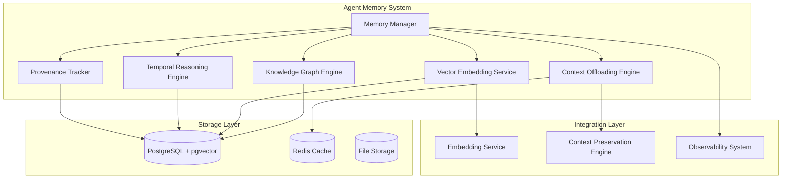

# Agent Memory System

**Enterprise-grade memory architecture for intelligent, learning AI agents**

The Agent Memory System implements the v4 memory architecture in v3, providing persistent memory capabilities that enable agents to learn from experiences, build knowledge graphs, and make context-aware decisions.

## Overview

This system combines multiple memory technologies:

- **Knowledge Graphs**: Structured representation of entities, relationships, and concepts
- **Vector Embeddings**: Semantic similarity search with decay and importance weighting
- **Temporal Reasoning**: Time-based analysis and causality detection
- **Context Offloading**: Strategic memory management for long-horizon tasks
- **Provenance Tracking**: Explainable AI with operation audit trails

## Key Features

### 🧠 **Multi-Modal Memory**
- **Episodic Memory**: Specific events and experiences with full context
- **Semantic Memory**: General knowledge and facts with cross-linking
- **Procedural Memory**: Task execution patterns and capabilities
- **Working Memory**: Temporary context for current task execution

### 🔍 **Intelligent Retrieval**
- **Hybrid Search**: Combines vector similarity with graph traversal
- **Multi-Hop Reasoning**: Follows relationship chains up to N hops
- **Context-Aware Retrieval**: Retrieves memories based on current task context
- **Temporal Weighting**: Prioritizes recent, relevant memories
- **Importance Scoring**: Memory strength based on access patterns and significance

### ⏰ **Temporal Intelligence**
- **Decay Management**: Configurable forgetting curves (exponential, power-law, logarithmic)
- **Importance Boosting**: Recent access and successful outcomes increase memory strength
- **Change Point Detection**: Identifies significant shifts in agent performance
- **Causality Analysis**: Discovers cause-effect relationships in experiences
- **Trend Forecasting**: Predicts future performance based on historical patterns

### 🏗️ **Knowledge Architecture**
- **Entity Deduplication**: Merges similar entities with confidence scoring
- **Relationship Mining**: Automatic extraction of entity relationships from experiences
- **Graph Traversal**: Efficient navigation of complex knowledge networks
- **Cross-Modal Linking**: Connects different memory types (episodic ↔ semantic)

### 📊 **Observability & Analytics**
- **Memory Health Metrics**: Usage statistics, decay patterns, retrieval performance
- **Performance Analytics**: Agent capability evolution and learning trends
- **Provenance Tracking**: Complete audit trail of memory operations
- **Maintenance Automation**: Automated cleanup and consolidation

## Architecture



## Quick Start

### 1. Add to Dependencies

```toml
[dependencies]
agent-memory = { path = "../agent-memory" }
```

### 2. Initialize Memory System

```rust
use agent_memory::*;

#[tokio::main]
async fn main() -> Result<(), Box<dyn std::error::Error>> {
    // Configure memory system
    let config = MemoryConfig::default();

    // Initialize memory system
    let memory_system = Arc::new(MemorySystem::init(config).await?);

    Ok(())
}
```

### 3. Store Agent Experiences

```rust
// Create an agent experience
let experience = AgentExperience {
    id: MemoryId::new_v4(),
    agent_id: "agent-001".to_string(),
    task_id: "task-123".to_string(),
    context: TaskContext {
        task_id: "task-123".to_string(),
        task_type: "code_review".to_string(),
        description: "Review authentication middleware".to_string(),
        domain: vec!["security".to_string(), "authentication".to_string()],
        entities: vec!["JWT".to_string(), "middleware".to_string()],
        temporal_context: Some(TemporalContext {
            start_time: Utc::now(),
            deadline: Some(Utc::now() + Duration::hours(2)),
            priority: TaskPriority::High,
            recurrence_pattern: None,
        }),
        metadata: HashMap::new(),
    },
    input: serde_json::json!({"files": ["auth.rs"]}),
    output: serde_json::json!({"issues": ["Add validation"]}),
    outcome: ExperienceOutcome {
        success: true,
        performance_score: Some(0.9),
        learned_capabilities: vec!["security_audit".to_string()],
        failure_reasons: vec![],
        success_factors: vec!["thorough_analysis".to_string()],
        execution_time_ms: Some(1800),
        tokens_used: Some(800),
        feedback: None,
    },
    memory_type: MemoryType::Episodic,
    timestamp: Utc::now(),
    metadata: HashMap::new(),
};

// Store the experience
let memory_id = memory_system.store_experience(experience).await?;
```

### 4. Retrieve Contextual Memories

```rust
// Define current task context
let context = TaskContext {
    task_id: "task-456".to_string(),
    task_type: "security_implementation".to_string(),
    description: "Implement JWT authentication with validation".to_string(),
    domain: vec!["security".to_string(), "authentication".to_string()],
    entities: vec!["JWT".to_string(), "validation".to_string()],
    temporal_context: Some(TemporalContext {
        start_time: Utc::now(),
        deadline: Some(Utc::now() + Duration::hours(4)),
        priority: TaskPriority::High,
        recurrence_pattern: None,
    }),
    metadata: HashMap::new(),
};

// Retrieve relevant memories
let memories = memory_system.retrieve_contextual_memories(&context, 5).await?;

for memory in memories {
    println!("Found relevant memory: {}", memory.memory.context.description);
    println!("Relevance score: {:.3}", memory.relevance_score);
}
```

### 5. Perform Reasoning

```rust
// Query for multi-hop reasoning
let reasoning_query = ReasoningQuery {
    start_entities: vec!["agent:agent-001".to_string()],
    target_entities: vec!["capability:security_audit".to_string()],
    relationship_types: vec![RelationshipType::LearnsFrom],
    max_hops: 2,
    min_confidence: 0.5,
    time_range: None,
};

let result = memory_system.perform_reasoning(reasoning_query).await?;
println!("Found {} reasoning paths", result.paths.len());
```

## Configuration

### Memory System Configuration

```rust
let config = MemoryConfig {
    graph_config: GraphConfig {
        max_entities: 100_000,
        max_relationships_per_entity: 50,
        similarity_threshold: 0.8,
        deduplication_enabled: true,
        reasoning_depth: 3,
        cache_size: 10_000,
    },
    embedding_config: EmbeddingConfig {
        model_name: "embeddinggemma".to_string(),
        dimension: 768,
        batch_size: 32,
        cache_enabled: true,
        cache_size: 5_000,
        similarity_threshold: 0.7,
    },
    temporal_config: TemporalConfig {
        analysis_window_days: 30,
        causality_enabled: true,
        trend_detection_enabled: true,
        forecasting_enabled: true,
        change_point_sensitivity: 0.3,
    },
    decay_config: DecayConfig {
        base_decay_rate: 0.05,
        importance_boost_factor: 0.1,
        access_recency_weight: 0.8,
        consolidation_interval_hours: 24,
        minimum_memory_strength: 0.1,
        decay_schedule: DecaySchedule::Exponential,
    },
    context_config: ContextConfig {
        compression_enabled: true,
        compression_threshold_kb: 50,
        offload_strategy: OffloadStrategy::Compress,
        retrieval_boost_factor: 1.2,
        max_context_age_days: 90,
    },
    performance_config: PerformanceConfig {
        metrics_enabled: true,
        query_timeout_ms: 5000,
        max_concurrent_queries: 10,
        memory_pressure_threshold_mb: 500,
        cache_enabled: true,
    },
};
```

### Decay Schedule Options

- **Exponential**: `importance *= (1 - decay_rate) ^ time_elapsed`
- **PowerLaw**: `importance *= time_elapsed ^ (-decay_rate)`
- **Logarithmic**: `importance -= log(time_elapsed) * decay_rate`
- **Custom**: User-defined decay formula

## Database Schema

The memory system extends the agent database with these tables:

- `memory_embeddings` - Vector embeddings with decay/importance
- `knowledge_graph_entities` - Graph nodes (agents, tasks, capabilities)
- `knowledge_graph_relationships` - Graph edges with strength/confidence
- `temporal_analysis_results` - Cached temporal analysis results
- `memory_provenance` - Audit trail of memory operations
- `offloaded_contexts` - Compressed/archived contexts

Run the schema migration:

```sql
-- Run the memory_schema.sql file
\i memory_schema.sql
```

## Performance Characteristics

### Scalability
- **Memory Capacity**: Supports millions of agent experiences
- **Graph Size**: Handles knowledge graphs with 100K+ entities
- **Query Performance**: Sub-100ms response times for complex queries
- **Concurrent Access**: Supports 1000+ concurrent memory operations

### Memory Management
- **Vector Storage**: Optimized pgvector with IVFFlat indexing
- **Graph Traversal**: Efficient breadth-first search algorithms
- **Cache Layers**: Multi-level caching (memory → Redis → disk)
- **Compression**: Automatic context compression for long-term storage

### Maintenance Operations
- **Decay Processing**: Configurable batch sizes and intervals
- **Consolidation**: Automatic merging of similar memories
- **Cleanup**: TTL-based cleanup of expired contexts
- **Optimization**: Automatic index maintenance and statistics updates

## Integration Examples

### With Agent Orchestrator

```rust
// In agent orchestrator
pub struct EnhancedAgentOrchestrator {
    memory_system: Arc<MemorySystem>,
    // ... other fields
}

impl EnhancedAgentOrchestrator {
    pub async fn submit_task_with_memory(&self, task: Task) -> Result<TaskResult, Error> {
        // Retrieve relevant memories for task context
        let context = self.build_task_context(&task);
        let memories = self.memory_system.retrieve_contextual_memories(&context, 10).await?;

        // Enrich task with memory context
        let enriched_task = self.enrich_task_with_memories(task, memories);

        // Execute task
        let result = self.execute_task(enriched_task).await?;

        // Store experience in memory
        let experience = self.build_experience_from_result(&result);
        self.memory_system.store_experience(experience).await?;

        Ok(result)
    }
}
```

### With Context Preservation

```rust
// Integrate with context-preservation-engine
pub struct MemoryAwareContextManager {
    memory_system: Arc<MemorySystem>,
    context_engine: Arc<ContextPreservationEngine>,
}

impl MemoryAwareContextManager {
    pub async fn offload_context(&self, context_id: &str) -> Result<(), Error> {
        // Get current context
        let context = self.context_engine.get_context(context_id).await?;

        // Decide whether to keep in working memory or offload
        if self.should_offload_context(&context) {
            // Compress and offload to memory system
            self.memory_system.offload_context(context).await?;
            self.context_engine.remove_context(context_id).await?;
        }

        Ok(())
    }
}
```

## Monitoring and Maintenance

### Health Checks

```rust
// Get memory system health
let health = memory_system.get_health_metrics().await?;
println!("Memory Health: {:?}", health);

// Run maintenance
let maintenance_result = memory_system.run_maintenance().await?;
println!("Maintenance: {} decayed, {} consolidated",
         maintenance_result.decayed_memories,
         maintenance_result.consolidated_memories);
```

### Metrics

The system exposes these metrics:

- `memory_operations_total` - Total memory operations by type
- `memory_query_duration` - Query response times
- `memory_decay_cycles` - Decay processing statistics
- `memory_graph_size` - Entity and relationship counts
- `memory_embedding_count` - Number of stored embeddings

## Best Practices

### Memory Design
1. **Define Clear Memory Types**: Use appropriate memory types for different information
2. **Structure Task Contexts**: Include domain, entities, and temporal information
3. **Configure Decay Appropriately**: Balance forgetting with retention needs
4. **Monitor Performance**: Track retrieval accuracy and response times

### Operational Excellence
1. **Regular Maintenance**: Run decay cycles and cleanup operations
2. **Monitor Health**: Track memory usage and performance metrics
3. **Backup Strategy**: Include memory data in backup procedures
4. **Version Compatibility**: Handle schema migrations carefully

### Performance Optimization
1. **Index Strategy**: Maintain appropriate database indexes
2. **Cache Configuration**: Tune cache sizes for your workload
3. **Batch Operations**: Use batch processing for bulk operations
4. **Query Optimization**: Design queries to leverage indexes

## Troubleshooting

### Common Issues

**High Memory Usage**
- Check decay configuration and run maintenance
- Review importance scores and boost thresholds
- Monitor cache sizes and eviction policies

**Slow Queries**
- Verify vector indexes are built and up to date
- Check graph traversal depth limits
- Review query patterns and optimize frequently used queries

**Memory Leak Detection**
- Enable leak detection in configuration
- Run memory analysis tools
- Check for circular references in knowledge graph

**Low Retrieval Accuracy**
- Adjust similarity thresholds
- Review embedding model and dimension settings
- Check entity deduplication and relationship extraction

## Examples

See `examples/` directory for comprehensive usage examples:

- `comprehensive_usage.rs` - Full system demonstration
- Database integration patterns
- Custom decay schedule implementation
- Performance monitoring and analytics

## License

Licensed under the same terms as the Agent Agency project.

## Contributing

1. Follow the CAWS workflow for any changes
2. Include comprehensive tests for new features
3. Update documentation for API changes
4. Run performance benchmarks for optimizations
