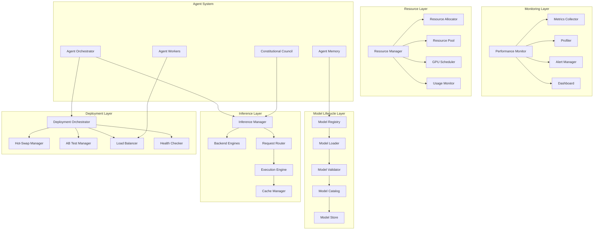

# Agent Model Management

**Unified Model Lifecycle, Inference, and Deployment Management for AI Agent Systems**

The Agent Model Management crate provides a comprehensive, enterprise-grade platform for managing the complete lifecycle of AI models in autonomous agent systems. It consolidates model loading, inference execution, hot-swapping, deployment orchestration, performance monitoring, and load balancing into a unified, scalable solution.

## Overview

This model management platform combines multiple critical AI infrastructure capabilities:

- **Model Lifecycle Management**: Complete model versioning, loading, and lifecycle orchestration
- **Multi-Backend Inference**: Backend-agnostic inference execution with automatic routing
- **Hot-Swapping & Deployment**: Seamless model replacement with A/B testing and canary deployments
- **Performance Monitoring**: Real-time metrics, latency tracking, and performance optimization
- **Intelligent Load Balancing**: Request routing based on model capabilities, load, and performance
- **Resource Management**: Automatic resource allocation and optimization for model execution
- **Model Registry**: Centralized model cataloging, metadata management, and discovery

## Key Features

### 🧠 **Model Lifecycle Management**
- **Version Control**: Semantic versioning and model lineage tracking
- **Model Registry**: Centralized catalog of all available models with metadata
- **Lifecycle States**: Track models through development, staging, production, and retirement
- **Dependency Management**: Handle model dependencies and compatibility requirements
- **Model Validation**: Automatic validation of model integrity and compatibility

### ⚡ **Multi-Backend Inference**
- **Backend Agnostic**: Support for multiple inference backends (CoreML, ONNX, PyTorch, TensorFlow)
- **Automatic Routing**: Intelligent backend selection based on model type and requirements
- **Fallback Mechanisms**: Graceful fallback to alternative backends when primary fails
- **Resource Optimization**: Backend selection based on available hardware and performance
- **Concurrent Execution**: Parallel inference across multiple backends and instances

### 🔄 **Hot-Swapping & Deployment**
- **Zero-Downtime Updates**: Seamless model replacement without service interruption
- **A/B Testing**: Simultaneous testing of multiple model versions with traffic splitting
- **Canary Deployments**: Gradual rollout with automatic rollback on performance degradation
- **Version Pinning**: Pin specific model versions for stable, reproducible deployments
- **Rollback Support**: Instant rollback to previous model versions

### 📊 **Performance Monitoring**
- **Real-time Metrics**: Latency, throughput, error rates, and resource utilization
- **Model Performance**: Per-model performance tracking and optimization recommendations
- **Hardware Utilization**: Monitor CPU, GPU, memory usage across inference backends
- **SLA Tracking**: Service Level Agreement monitoring and alerting
- **Performance Profiling**: Detailed profiling of inference pipelines and bottlenecks

### ⚖️ **Intelligent Load Balancing**
- **Request Routing**: Smart routing based on model capabilities, current load, and performance
- **Auto-scaling**: Dynamic scaling of model instances based on demand patterns
- **Health Checking**: Continuous health monitoring with automatic failover
- **Traffic Shaping**: Request prioritization and rate limiting based on model characteristics
- **Geographic Distribution**: Multi-region deployment with latency-based routing

### 🔧 **Resource Management**
- **Dynamic Allocation**: Automatic resource allocation based on model requirements
- **Resource Pooling**: Efficient sharing of computational resources across models
- **Memory Management**: Intelligent memory allocation and garbage collection
- **GPU Scheduling**: Optimized GPU utilization across multiple concurrent models
- **Resource Quotas**: Configurable resource limits and usage tracking

### 📋 **Model Registry & Discovery**
- **Centralized Catalog**: Single source of truth for all model metadata and capabilities
- **Search & Discovery**: Advanced search and filtering capabilities for model selection
- **Metadata Management**: Rich metadata including performance characteristics, requirements, and usage
- **Access Control**: Role-based access control for model management operations
- **Audit Logging**: Complete audit trail of model registration, updates, and usage

## Architecture



### Core Components

1. **Model Registry**: Manages model metadata, versions, and lifecycle states
2. **Inference Manager**: Orchestrates inference execution across multiple backends
3. **Deployment Orchestrator**: Handles model deployment, hot-swapping, and traffic management
4. **Performance Monitor**: Tracks and analyzes system and model performance
5. **Resource Manager**: Manages computational resources and allocation
6. **Load Balancer**: Intelligently distributes inference requests

## Quick Start

### 1. Add to Dependencies

```toml
[dependencies]
agent-model-management = { path = "../agent-model-management" }
tokio = { version = "1.0", features = ["full"] }
serde = { version = "1.0", features = ["derive"] }
serde_json = "1.0"
```

### 2. Initialize Model Manager

```rust
use agent_model_management::*;
use std::sync::Arc;

#[tokio::main]
async fn main() -> Result<(), Box<dyn std::error::Error>> {
    // Initialize the model manager
    let model_manager = Arc::new(ModelManager::new().await?);

    // Configure model registry
    let registry_config = ModelRegistryConfig {
        storage_path: "/models".into(),
        enable_versioning: true,
        max_versions_per_model: 10,
        enable_compression: true,
        cache_size_mb: 1024,
    };

    model_manager.configure_registry(registry_config).await?;

    // Configure inference backends
    let inference_config = InferenceConfig {
        enable_coreml: true,
        enable_pytorch: true,
        enable_tensorflow: false,
        max_concurrent_requests: 100,
        request_timeout_seconds: 30,
        enable_caching: true,
        cache_ttl_seconds: 300,
    };

    model_manager.configure_inference(inference_config).await?;

    // Configure deployment
    let deployment_config = DeploymentConfig {
        enable_hot_swapping: true,
        enable_ab_testing: true,
        max_models_per_backend: 5,
        deployment_timeout_seconds: 60,
        enable_rollback: true,
        health_check_interval_seconds: 30,
    };

    model_manager.configure_deployment(deployment_config).await?;

    println!("Model management system initialized");

    Ok(())
}
```

### 3. Register and Load Models

```rust
use agent_model_management::*;

// Define model metadata
let model_metadata = ModelMetadata {
    id: "mistral-7b-instruct".to_string(),
    name: "Mistral 7B Instruct".to_string(),
    version: "1.0.0".to_string(),
    model_type: ModelType::LargeLanguageModel,
    framework: ModelFramework::CoreML,
    capabilities: vec![
        ModelCapability::TextGeneration,
        ModelCapability::QuestionAnswering,
        ModelCapability::CodeGeneration,
    ],
    parameters: ModelParameters {
        input_modalities: vec![Modality::Text],
        output_modalities: vec![Modality::Text],
        max_sequence_length: 4096,
        vocabulary_size: 32000,
        num_parameters: 7_000_000_000,
    },
    resource_requirements: ResourceRequirements {
        min_memory_mb: 14336, // 14GB
        preferred_memory_mb: 16384, // 16GB
        cpu_cores: Some(4.0),
        gpu_memory_mb: Some(8192), // 8GB
    },
    performance_targets: PerformanceTargets {
        target_latency_ms: 100,
        target_throughput_rps: 10.0,
        max_error_rate: 0.01,
    },
    tags: vec!["instruction-tuned".to_string(), "code-generation".to_string()],
    created_at: chrono::Utc::now(),
    updated_at: chrono::Utc::now(),
    status: ModelStatus::Available,
};

// Register the model
model_manager.register_model(model_metadata.clone()).await?;
println!("Model registered: {}", model_metadata.id);

// Configure the model
let model_config = ModelConfig {
    model_type: "mistral".to_string(),
    parameters: std::collections::HashMap::from([
        ("temperature".to_string(), serde_json::json!(0.7)),
        ("max_tokens".to_string(), serde_json::json!(1024)),
        ("top_p".to_string(), serde_json::json!(0.9)),
    ]),
    resource_requirements: model_metadata.resource_requirements.clone(),
    performance_targets: model_metadata.performance_targets.clone(),
};

// Load the model for inference
let model_handle = model_manager.load_model(&model_metadata.id, model_config).await?;
println!("Model loaded with handle: {}", model_handle.model_id);
```

### 4. Execute Inference

```rust
use agent_model_management::*;

// Prepare inference input
let inference_input = InferenceInput {
    model_id: model_handle.model_id.clone(),
    input_type: InputType::Text,
    data: InferenceData::Text {
        text: "Explain the concept of machine learning in simple terms.".to_string(),
        encoding: TextEncoding::UTF8,
    },
    parameters: InferenceParameters {
        temperature: Some(0.7),
        max_tokens: Some(512),
        top_p: Some(0.9),
        stop_sequences: Some(vec!["\n\n".to_string()]),
        repetition_penalty: Some(1.1),
    },
    context: InferenceContext {
        user_id: "user-123".to_string(),
        session_id: "session-456".to_string(),
        request_id: "req-789".to_string(),
        priority: InferencePriority::Normal,
        timeout_ms: Some(30000),
    },
};

// Execute inference
let inference_result = model_manager.execute_inference(&model_handle, inference_input).await?;

match inference_result {
    InferenceOutput::Text { text, metadata } => {
        println!("Generated text: {}", text);
        println!("Tokens used: {}", metadata.tokens_used);
        println!("Generation time: {}ms", metadata.generation_time_ms);
    }
    _ => println!("Other output type received"),
}

// Batch inference
let batch_inputs = vec![
    InferenceInput {
        model_id: model_handle.model_id.clone(),
        input_type: InputType::Text,
        data: InferenceData::Text {
            text: "What is the capital of France?".to_string(),
            encoding: TextEncoding::UTF8,
        },
        parameters: InferenceParameters::default(),
        context: InferenceContext {
            user_id: "user-123".to_string(),
            session_id: "session-456".to_string(),
            request_id: "batch-req-1".to_string(),
            priority: InferencePriority::Normal,
            timeout_ms: Some(10000),
        },
    },
    // ... more inputs
];

let batch_results = model_manager.execute_batch_inference(&model_handle, batch_inputs).await?;
println!("Batch inference completed: {} results", batch_results.len());
```

### 5. Hot-Swap Models

```rust
use agent_model_management::*;

// Prepare new model version
let new_model_metadata = ModelMetadata {
    id: "mistral-7b-instruct".to_string(),
    name: "Mistral 7B Instruct".to_string(),
    version: "1.1.0".to_string(), // New version
    // ... other fields same as before
    updated_at: chrono::Utc::now(),
    status: ModelStatus::Available,
};

// Register new version
model_manager.register_model(new_model_metadata.clone()).await?;

// Configure hot-swap
let hot_swap_config = HotSwapConfig {
    source_model_id: "mistral-7b-instruct:v1.0.0".to_string(),
    target_model_id: "mistral-7b-instruct:v1.1.0".to_string(),
    strategy: HotSwapStrategy::Canary {
        initial_traffic_percent: 10,
        ramp_up_steps: 5,
        ramp_up_interval_seconds: 60,
        success_criteria: SuccessCriteria {
            min_success_rate: 0.95,
            max_latency_increase_percent: 10.0,
            min_requests: 100,
        },
        rollback_on_failure: true,
    },
    monitoring_duration_seconds: 300,
};

// Execute hot-swap
let hot_swap_handle = model_manager.initiate_hot_swap(hot_swap_config).await?;
println!("Hot-swap initiated: {}", hot_swap_handle.swap_id);

// Monitor hot-swap progress
tokio::spawn(async move {
    loop {
        tokio::time::sleep(tokio::time::Duration::from_secs(30)).await;

        let status = model_manager.get_hot_swap_status(&hot_swap_handle.swap_id).await?;
        println!("Hot-swap progress: {}%", status.progress_percent);

        match status.phase {
            HotSwapPhase::Completed => {
                println!("Hot-swap completed successfully");
                break;
            }
            HotSwapPhase::Failed => {
                println!("Hot-swap failed: {:?}", status.error_message);
                break;
            }
            _ => continue,
        }
    }
});
```

### 6. A/B Testing

```rust
use agent_model_management::*;

// Set up A/B test
let ab_test_config = ABTestConfig {
    test_id: "mistral-comparison".to_string(),
    model_a: ModelVariant {
        model_id: "mistral-7b-instruct:v1.0.0".to_string(),
        traffic_percentage: 50,
        metadata: std::collections::HashMap::from([
            ("variant".to_string(), "baseline".to_string()),
        ]),
    },
    model_b: ModelVariant {
        model_id: "mistral-7b-instruct:v1.1.0".to_string(),
        traffic_percentage: 50,
        metadata: std::collections::HashMap::from([
            ("variant".to_string(), "improved".to_string()),
        ]),
    },
    test_duration_seconds: 3600, // 1 hour
    success_metrics: vec![
        TestMetric::Latency {
            target_ms: 100,
            tolerance_percent: 5.0,
        },
        TestMetric::Quality {
            min_score: 0.85,
            metric_name: "relevance".to_string(),
        },
    ],
    target_sample_size: 1000,
    enable_real_time_monitoring: true,
};

// Start A/B test
let ab_test_handle = model_manager.start_ab_test(ab_test_config).await?;
println!("A/B test started: {}", ab_test_handle.test_id);

// Monitor A/B test
let test_results = model_manager.get_ab_test_results(&ab_test_handle.test_id).await?;
println!("A/B Test Results:");
println!("  Model A performance: {:.2}", test_results.variant_a_score);
println!("  Model B performance: {:.2}", test_results.variant_b_score);
println!("  Confidence level: {:.1}%", test_results.confidence_level * 100.0);
println!("  Winner: {:?}", test_results.winner);

// Complete A/B test and promote winner
if let Some(winner) = test_results.winner {
    model_manager.complete_ab_test(&ab_test_handle.test_id, &winner).await?;
    println!("A/B test completed - {} promoted to production", winner);
}
```

### 7. Monitor Performance

```rust
use agent_model_management::*;

// Get performance metrics
let performance_report = model_manager.get_performance_report(
    &model_handle.model_id,
    chrono::Duration::hours(1),
).await?;

println!("Performance Report for {}", model_handle.model_id);
println!("  Average latency: {:.1}ms", performance_report.avg_latency_ms);
println!("  P95 latency: {:.1}ms", performance_report.p95_latency_ms);
println!("  Throughput: {:.1} RPS", performance_report.throughput_rps);
println!("  Error rate: {:.2}%", performance_report.error_rate * 100.0);
println!("  Resource utilization:");
println!("    CPU: {:.1}%", performance_report.resource_utilization.cpu_percent);
println!("    Memory: {:.1}%", performance_report.resource_utilization.memory_percent);
println!("    GPU: {:.1}%", performance_report.resource_utilization.gpu_percent);

// Get model-specific metrics
let model_metrics = model_manager.get_model_metrics(&model_handle.model_id).await?;
println!("Model-specific metrics:");
for (metric_name, value) in &model_metrics.custom_metrics {
    println!("  {}: {:.3}", metric_name, value);
}

// Set up performance alerts
let alert_config = PerformanceAlertConfig {
    model_id: model_handle.model_id.clone(),
    alerts: vec![
        PerformanceAlert {
            alert_type: AlertType::LatencyThreshold {
                threshold_ms: 200,
                window_seconds: 60,
            },
            severity: AlertSeverity::Warning,
            cooldown_seconds: 300,
        },
        PerformanceAlert {
            alert_type: AlertType::ErrorRateThreshold {
                threshold_percent: 5.0,
                window_seconds: 300,
            },
            severity: AlertSeverity::Critical,
            cooldown_seconds: 600,
        },
    ],
};

model_manager.configure_performance_alerts(alert_config).await?;
println!("Performance alerts configured");
```

## Configuration

### Comprehensive Model Management Configuration

```rust
let model_management_config = ModelManagementConfig {
    // Model registry configuration
    registry: ModelRegistryConfig {
        storage_path: "/opt/agent/models".into(),
        enable_versioning: true,
        max_versions_per_model: 10,
        enable_compression: true,
        cache_size_mb: 2048,
        enable_metadata_validation: true,
        backup_interval_hours: 24,
        retention_policy_days: 365,
    },

    // Inference configuration
    inference: InferenceConfig {
        enable_coreml: true,
        enable_pytorch: true,
        enable_tensorflow: false,
        enable_onnx: true,
        max_concurrent_requests: 100,
        request_timeout_seconds: 60,
        enable_caching: true,
        cache_ttl_seconds: 600,
        enable_batch_processing: true,
        max_batch_size: 32,
        enable_model_preloading: true,
        preloaded_models: vec!["mistral-7b-instruct".to_string()],
    },

    // Deployment configuration
    deployment: DeploymentConfig {
        enable_hot_swapping: true,
        enable_ab_testing: true,
        enable_canary_deployments: true,
        max_models_per_backend: 5,
        deployment_timeout_seconds: 120,
        enable_rollback: true,
        health_check_interval_seconds: 30,
        load_balancing_strategy: LoadBalancingStrategy::LeastLoaded,
        traffic_distribution_mode: TrafficDistributionMode::Weighted,
        enable_geo_distribution: false,
    },

    // Performance monitoring configuration
    monitoring: PerformanceMonitoringConfig {
        enable_real_time_metrics: true,
        metrics_retention_hours: 168,
        enable_performance_profiling: true,
        profiling_sample_rate: 0.1,
        enable_anomaly_detection: true,
        alert_evaluation_interval_seconds: 60,
        enable_predictive_scaling: true,
        scaling_evaluation_interval_seconds: 300,
    },

    // Resource management configuration
    resources: ResourceManagementConfig {
        enable_dynamic_allocation: true,
        enable_resource_pooling: true,
        memory_overcommit_ratio: 1.2,
        cpu_overcommit_ratio: 1.5,
        gpu_overcommit_ratio: 1.1,
        enable_resource_quotas: true,
        quota_enforcement_policy: QuotaEnforcementPolicy::SoftLimit,
        resource_monitoring_interval_seconds: 30,
        enable_resource_predictive_allocation: true,
    },

    // Load balancing configuration
    load_balancing: LoadBalancingConfig {
        algorithm: LoadBalancingAlgorithm::WeightedRoundRobin,
        health_check_interval_seconds: 10,
        unhealthy_threshold: 3,
        healthy_threshold: 2,
        enable_session_stickiness: false,
        max_connections_per_instance: 1000,
        connection_timeout_seconds: 30,
        enable_circuit_breaker: true,
        circuit_breaker_failure_threshold: 5,
        circuit_breaker_recovery_timeout_seconds: 60,
    },
};
```

### Model-Specific Configuration

```rust
// Example configuration for different model types
let llm_config = ModelConfig {
    model_type: "llm".to_string(),
    parameters: std::collections::HashMap::from([
        ("temperature".to_string(), serde_json::json!(0.7)),
        ("max_tokens".to_string(), serde_json::json!(2048)),
        ("top_p".to_string(), serde_json::json!(0.9)),
        ("frequency_penalty".to_string(), serde_json::json!(0.0)),
        ("presence_penalty".to_string(), serde_json::json!(0.0)),
        ("stop_sequences".to_string(), serde_json::json!(["\n\nHuman:", "\n\nAssistant:"])),
    ]),
    resource_requirements: ResourceRequirements {
        min_memory_mb: 8192,
        preferred_memory_mb: 16384,
        cpu_cores: Some(4.0),
        gpu_memory_mb: Some(4096),
    },
    performance_targets: PerformanceTargets {
        target_latency_ms: 200,
        target_throughput_rps: 5.0,
        max_error_rate: 0.01,
    },
};

let vision_config = ModelConfig {
    model_type: "vision".to_string(),
    parameters: std::collections::HashMap::from([
        ("image_size".to_string(), serde_json::json!(224)),
        ("num_classes".to_string(), serde_json::json!(1000)),
        ("confidence_threshold".to_string(), serde_json::json!(0.5)),
        ("max_detections".to_string(), serde_json::json!(10)),
    ]),
    resource_requirements: ResourceRequirements {
        min_memory_mb: 2048,
        preferred_memory_mb: 4096,
        cpu_cores: Some(2.0),
        gpu_memory_mb: Some(1024),
    },
    performance_targets: PerformanceTargets {
        target_latency_ms: 50,
        target_throughput_rps: 20.0,
        max_error_rate: 0.05,
    },
};
```

## Inference Backends

### Supported Backend Types

| Backend | Description | Best For |
|---------|-------------|----------|
| **CoreML** | Apple's machine learning framework | macOS/iOS, optimized for Apple Silicon |
| **PyTorch** | Facebook's deep learning framework | Research, flexibility, custom models |
| **TensorFlow** | Google's ML framework | Production, scale, enterprise |
| **ONNX** | Open Neural Network Exchange | Cross-platform, interoperability |
| **GGML** | Efficient inference library | Local inference, resource-constrained |

### Backend Selection Logic

```rust
// Automatic backend selection based on model and hardware
impl InferenceManager {
    pub async fn select_optimal_backend(
        &self,
        model_type: &ModelType,
        resource_requirements: &ResourceRequirements,
        available_hardware: &HardwareCapabilities,
    ) -> Result<BackendType, InferenceError> {
        // Check hardware capabilities
        if available_hardware.has_apple_silicon && resource_requirements.gpu_memory_mb.is_some() {
            if self.is_model_supported_by_coreml(model_type).await? {
                return Ok(BackendType::CoreML);
            }
        }

        // Check for CUDA GPUs
        if available_hardware.has_cuda_gpu {
            if resource_requirements.gpu_memory_mb.unwrap_or(0) <= available_hardware.gpu_memory_mb {
                return Ok(BackendType::PyTorchCUDA);
            }
        }

        // Check for Vulkan/Metal support
        if available_hardware.has_metal || available_hardware.has_vulkan {
            if self.is_model_supported_by_accelerated_backend(model_type).await? {
                return Ok(BackendType::PyTorchMetal);
            }
        }

        // Fallback to CPU
        Ok(BackendType::PyTorchCPU)
    }
}
```

## Performance Characteristics

### Inference Performance

- **CoreML Backend**: 2-10x faster on Apple Silicon compared to CPU inference
- **GPU Acceleration**: 5-20x speedup depending on model size and hardware
- **Batch Processing**: 1.5-3x throughput improvement for batched requests
- **Caching**: 10-100x speedup for cached inference requests
- **Memory Usage**: 1-8GB depending on model size and quantization

### Deployment Performance

- **Hot-Swapping**: < 5 seconds for model replacement with zero downtime
- **A/B Testing**: Sub-millisecond routing decisions with minimal overhead
- **Load Balancing**: < 1ms request routing with health checking
- **Auto-scaling**: 10-60 seconds for scaling operations based on load
- **Resource Allocation**: < 100ms for dynamic resource allocation

### Monitoring Overhead

- **Metrics Collection**: < 1ms per request for basic metrics
- **Performance Profiling**: 1-5% overhead when profiling is enabled
- **Health Checking**: < 10ms for comprehensive health assessments
- **Alert Evaluation**: Sub-millisecond for threshold-based alerting
- **Dashboard Updates**: < 100ms for real-time dashboard data

### Scalability Metrics

- **Concurrent Models**: Support for 10-50 models depending on hardware
- **Concurrent Requests**: 100-1000+ requests per second based on model complexity
- **Model Size**: Support for models from 100MB to 100GB+
- **Horizontal Scaling**: Linear scaling across multiple nodes
- **Geographic Distribution**: Global distribution with < 50ms latency routing

## Integration Examples

### With Agent Orchestrator

```rust
use agent_orchestration::*;
use agent_model_management::*;

// Orchestrator with intelligent model management
pub struct IntelligentOrchestrator {
    orchestrator: AgentOrchestrator,
    model_manager: Arc<ModelManager>,
    performance_monitor: Arc<PerformanceMonitor>,
}

impl IntelligentOrchestrator {
    pub async fn execute_with_optimal_model(
        &self,
        task: Task,
    ) -> Result<TaskResult, OrchestrationError> {
        // Analyze task requirements
        let task_requirements = self.analyze_task_requirements(&task).await?;

        // Find optimal model for the task
        let optimal_model = self.model_manager.find_optimal_model(&task_requirements).await?;

        // Check model performance and load
        let model_status = self.model_manager.get_model_status(&optimal_model.id).await?;
        let performance_metrics = self.performance_monitor.get_model_performance(&optimal_model.id).await?;

        // Decide whether to use this model or fallback
        if self.should_use_model(&model_status, &performance_metrics).await? {
            // Load and use the optimal model
            let model_handle = self.model_manager.load_model(&optimal_model.id, ModelConfig::default()).await?;

            // Execute task with the model
            let result = self.execute_task_with_model(&task, &model_handle).await?;
            Ok(result)
        } else {
            // Use fallback orchestration
            let result = self.orchestrator.execute_task(task).await?;
            Ok(result)
        }
    }

    async fn analyze_task_requirements(&self, task: &Task) -> Result<TaskRequirements, OrchestrationError> {
        // Analyze task to determine model requirements
        let requirements = TaskRequirements {
            modalities: self.extract_required_modalities(task)?,
            performance_targets: PerformanceTargets {
                target_latency_ms: self.estimate_required_latency(task),
                target_throughput_rps: 1.0, // Single task
                max_error_rate: 0.05,
            },
            resource_requirements: self.estimate_resource_requirements(task).await?,
            capabilities: self.extract_required_capabilities(task)?,
        };

        Ok(requirements)
    }

    async fn should_use_model(
        &self,
        status: &ModelStatus,
        metrics: &PerformanceMetrics,
    ) -> Result<bool, OrchestrationError> {
        // Check if model is healthy and performing well
        let is_healthy = matches!(status.health, ModelHealth::Healthy);
        let meets_latency_target = metrics.avg_latency_ms < 200.0;
        let meets_error_rate_target = metrics.error_rate < 0.05;

        Ok(is_healthy && meets_latency_target && meets_error_rate_target)
    }
}
```

### With Constitutional Council

```rust
use agent_constitutional_council::*;
use agent_model_management::*;

// Council with model-assisted decision making
pub struct ModelAssistedCouncil {
    council: ConstitutionalCouncil,
    model_manager: Arc<ModelManager>,
    judge_model_handle: ModelHandle,
}

impl ModelAssistedCouncil {
    pub async fn evaluate_with_model_assistance(
        &self,
        working_spec: &WorkingSpec,
    ) -> Result<FinalVerdictContract, CouncilError> {
        // Prepare evaluation prompt for the model
        let evaluation_prompt = self.prepare_evaluation_prompt(working_spec).await?;

        // Execute inference for initial analysis
        let inference_input = InferenceInput {
            model_id: self.judge_model_handle.model_id.clone(),
            input_type: InputType::Text,
            data: InferenceData::Text {
                text: evaluation_prompt,
                encoding: TextEncoding::UTF8,
            },
            parameters: InferenceParameters {
                temperature: Some(0.1), // Low temperature for consistent analysis
                max_tokens: Some(1024),
                top_p: Some(0.9),
                stop_sequences: None,
                repetition_penalty: Some(1.1),
            },
            context: InferenceContext {
                user_id: "constitutional-council".to_string(),
                session_id: format!("evaluation-{}", working_spec.id),
                request_id: format!("eval-req-{}", working_spec.id),
                priority: InferencePriority::High,
                timeout_ms: Some(30000),
            },
        };

        let inference_result = self.model_manager.execute_inference(&self.judge_model_handle, inference_input).await?;

        // Parse model output for evaluation insights
        let evaluation_insights = self.parse_evaluation_insights(&inference_result).await?;

        // Use insights to enhance council evaluation
        let enhanced_spec = self.enhance_spec_with_insights(working_spec, &evaluation_insights).await?;

        // Proceed with council evaluation
        self.council.evaluate_working_spec(&enhanced_spec).await
    }

    async fn prepare_evaluation_prompt(&self, working_spec: &WorkingSpec) -> Result<String, CouncilError> {
        let prompt = format!(
            "Analyze the following working specification for compliance with CAWS principles:\n\n\
            Title: {}\n\
            Description: {}\n\
            Risk Tier: {}\n\
            Goals: {}\n\n\
            Please evaluate:\n\
            1. Technical soundness\n\
            2. Security implications\n\
            3. Performance considerations\n\
            4. Compliance with best practices\n\
            5. Potential risks and mitigation strategies\n\n\
            Provide a structured analysis with recommendations.",
            working_spec.title,
            working_spec.description,
            working_spec.risk_tier,
            working_spec.goals.join(", ")
        );

        Ok(prompt)
    }

    async fn parse_evaluation_insights(
        &self,
        inference_result: &InferenceOutput,
    ) -> Result<EvaluationInsights, CouncilError> {
        // Parse model output to extract structured insights
        match inference_result {
            InferenceOutput::Text { text, .. } => {
                // Parse the text for structured insights
                let insights = EvaluationInsights {
                    technical_score: self.extract_score(text, "technical soundness")?,
                    security_score: self.extract_score(text, "security implications")?,
                    performance_score: self.extract_score(text, "performance considerations")?,
                    compliance_score: self.extract_score(text, "compliance")?,
                    risk_assessment: self.extract_risk_assessment(text)?,
                    recommendations: self.extract_recommendations(text)?,
                };
                Ok(insights)
            }
            _ => Err(CouncilError::InvalidModelOutput("Expected text output".to_string())),
        }
    }
}
```

## Best Practices

### Model Lifecycle Management

1. **Version Control**: Always use semantic versioning for model releases
2. **Comprehensive Testing**: Test models across different inputs and scenarios before deployment
3. **Gradual Rollout**: Use canary deployments for new model versions
4. **Monitoring**: Continuously monitor model performance and drift
5. **Documentation**: Maintain detailed documentation for model capabilities and limitations

### Inference Optimization

1. **Backend Selection**: Choose the optimal backend based on model type and hardware
2. **Resource Planning**: Plan resource requirements based on expected load
3. **Caching Strategy**: Implement intelligent caching for frequently used inferences
4. **Batch Processing**: Use batch processing for multiple similar requests
5. **Performance Profiling**: Regularly profile and optimize inference pipelines

### Deployment Strategy

1. **Zero Downtime**: Plan deployments to avoid service interruption
2. **Rollback Planning**: Always have rollback procedures for failed deployments
3. **A/B Testing**: Use A/B testing to validate new model versions
4. **Gradual Rollout**: Implement canary deployments for risk mitigation
5. **Monitoring**: Monitor deployment progress and automatically rollback on issues

### Resource Management

1. **Capacity Planning**: Plan resource capacity based on model requirements and load
2. **Dynamic Scaling**: Implement auto-scaling based on load and performance metrics
3. **Resource Pooling**: Share resources efficiently across multiple models
4. **Cost Optimization**: Optimize resource usage to control costs
5. **Resource Monitoring**: Monitor resource usage and plan for scaling needs

## Troubleshooting

### Common Issues

**Model Loading Failures**
- Check model file integrity and compatibility with selected backend
- Verify resource availability (memory, GPU) meets model requirements
- Review model configuration and parameter settings
- Check for backend-specific compatibility issues

**Inference Performance Issues**
- Monitor resource utilization and identify bottlenecks
- Check for model optimization opportunities (quantization, pruning)
- Review inference parameters (batch size, precision)
- Consider backend switching for better performance

**Hot-Swap Failures**
- Verify model compatibility with existing infrastructure
- Check resource availability for new model version
- Review traffic routing and load balancing configuration
- Monitor health checks during transition period

**Resource Exhaustion**
- Monitor memory, CPU, and GPU usage across all models
- Implement resource quotas and limits
- Optimize model loading and unloading strategies
- Consider horizontal scaling for increased capacity

**A/B Test Analysis Issues**
- Ensure sufficient sample size for statistical significance
- Verify test isolation and traffic distribution
- Check for external factors affecting results
- Review success criteria and measurement accuracy

## Contributing

1. Follow the CAWS workflow for any changes
2. Include comprehensive tests for new model types and backend integrations
3. Update documentation for new deployment strategies and monitoring features
4. Run performance benchmarks for model loading and inference improvements

## License

Licensed under the same terms as the Agent Agency project.

## Related Components

- **agent-orchestration**: Uses model management for task execution and routing
- **system-acceleration**: Provides hardware acceleration for model inference
- **agent-constitutional-council**: Uses models for governance and decision making
- **system-observability**: Monitors model performance and system health
- **engine-coreml**: CoreML inference engine integration