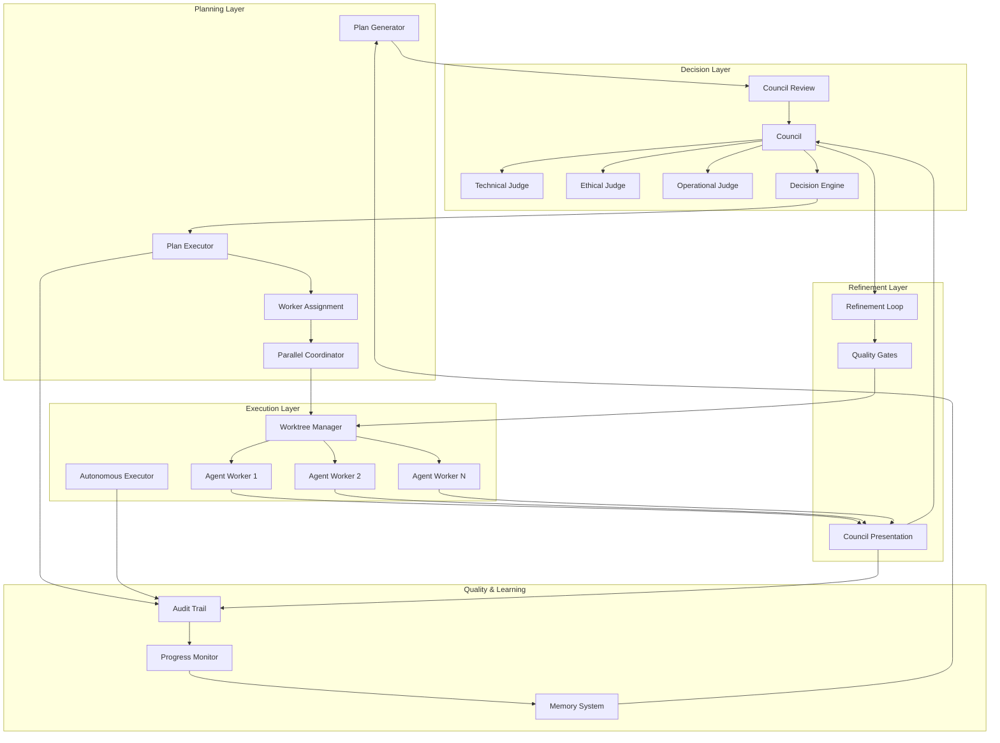

# Agent Orchestration Service

**CAWS-Integrated Constitutional Arbitration & Orchestration System**

The Agent Orchestration Service implements a **constitutional AI system** where CAWS (Coding-Agent Working Standard) acts as the executable governance layer that governs all AI contributions. The arbiter/orchestrator serves as the **constitutional authority** - not just a decision-maker, but the runtime enforcer of CAWS policies that no worker model can bypass.

This service plans complex tasks, assigns work to parallel agents operating in isolated git worktrees, reviews their output through a council of specialized judges using the **CAWS Adjudication Cycle**, refines work based on feedback, enforces quality gates, and tracks progress across long-horizon tasks requiring multiple iterations and minimal human oversight.

## CAWS Constitutional Authority

The orchestration service enforces CAWS as the **executable contract** that governs all AI work:

- **CAWS Policy Enforcement**: Interprets `working-spec.yaml`, budgets, waivers, and quality gates as system calls
- **Constitutional Oversight**: No worker model can bypass CAWS budgets, scope boundaries, or quality gates
- **Immutable Provenance**: Every decision maps to explicit CAWS clauses, creating audit trails
- **Governance Mechanism**: Success is defined as _passing CAWS proofs_, not "pleasing the prompt"

The arbiter transforms multi-agent orchestration from an efficiency tool into a **governance mechanism** where diligence is a first-class habit baked into the process.

## Overview

This service implements a complete orchestration workflow for autonomous multi-agent coordination:

- **Planning & Research**: Analyzes requirements, generates execution plans, and researches dependencies
- **Council Review**: Multi-judge arbitration system for plan approval and work evaluation
- **Parallel Task Assignment**: Assigns tasks to multiple agents running in isolated git worktrees
- **Autonomous Execution**: Agents execute tasks independently with governance oversight
- **Work Presentation**: Completed work is presented to the council for review
- **Refinement Loops**: Iterative improvement based on council feedback until approval
- **Quality Gates**: Automated quality validation and enforcement before merge
- **Progress Tracking**: Continuous progress updates for long-horizon multi-step tasks
- **Learning Integration**: Continuous improvement through experience analysis

## Core Workflow: CAWS Adjudication Cycle

The orchestration service follows the **CAWS Adjudication Cycle** for all arbitration decisions:

### CAWS Adjudication Stages

| Stage | Description | Enforcement Mechanism |
|-------|-------------|---------------------|
| **Pleading** | Worker submits `change.diff`, rationale, and evidence manifest | JSON RPC to Arbiter |
| **Examination** | Arbiter checks CAWS budgets (`max_loc`, `max_files`) and structural diffs | Rust validator using CAWS schemas |
| **Deliberation** | Arbiter runs verifier tests; collects gate metrics | Local plug-ins: build, lint, coverage |
| **Verdict** | Arbiter issues PASS / FAIL / WAIVER_REQUIRED | Signed YAML verdict record |
| **Publication** | Arbiter commits verdict + provenance to git with trailer `CAWS-VERDICT-ID` | Git CLI integration |

### End-to-End Workflow

1. **Plan Generation**: Analyzes task requirements and generates execution plans with milestones
2. **Council Plan Review**: Council of judges reviews and approves execution plans before assignment (CAWS Examination stage)
3. **Worker Assignment**: Tasks are assigned to parallel agents based on capabilities and workload
4. **Git Worktree Isolation**: Each agent operates in an isolated git worktree for parallel execution
5. **Parallel Execution**: Agents execute assigned milestones concurrently with scope guards
6. **Work Presentation**: Completed work is collected and presented to the council (CAWS Pleading stage)
7. **Council Review**: Specialized judges evaluate work using CAWS Adjudication Cycle (Examination → Deliberation → Verdict)
8. **Refinement Loop**: If work needs improvement, agents refine based on council feedback
9. **Quality Gates**: Automated quality checks (coverage, performance, security) before merge
10. **Merge & Progress**: Approved work is merged with CAWS provenance (Publication stage) and progress is tracked

## Key Features

### Planning & Orchestration
- **Plan Generation**: Creates execution plans from working specifications with dependency resolution
- **Dynamic Planning**: Real-time task planning and adaptation based on execution results
- **Worker Assignment**: Intelligent assignment of tasks to agents based on capabilities
- **Parallel Coordination**: Coordinates parallel milestone execution with file locking and scope guards
- **Long-Horizon Support**: Handles multi-step, multi-iteration tasks with progress persistence

### Council Decision Making
- **Multi-Judge Arbitration**: Multiple specialized judges (technical, ethical, operational)
- **Consensus Algorithms**: Configurable decision-making strategies (unanimous, majority, weighted, veto)
- **Evidence-Based Decisions**: Comprehensive evidence analysis and weighting
- **Plan Review**: Council reviews execution plans before assignment
- **Work Review**: Council reviews completed work and provides refinement feedback
- **Ethical Oversight**: Built-in ethical assessment and risk evaluation

### Git Worktree Integration
- **Isolated Execution**: Each agent operates in its own git worktree for parallel safety
- **Worktree Management**: Automatic creation, cleanup, and merge of worktrees
- **Conflict Resolution**: Handles merge conflicts and worktree coordination
- **Branch Management**: Intelligent branch creation and merging strategies

### Refinement & Quality Assurance
- **Refinement Loops**: Iterative improvement cycles based on council feedback
- **Quality Gates**: Automated quality validation (test coverage, performance, security scans)
- **Progress Tracking**: Continuous progress updates with iteration history
- **Comprehensive Audit Trails**: Complete operation tracking and provenance
- **Performance Monitoring**: SLO tracking and performance analytics

### Learning Integration
- **Experience Analysis**: Learning from task execution outcomes
- **Predictive Optimization**: Performance prediction and optimization
- **Adaptive Behaviors**: Continuous improvement through feedback loops
- **Knowledge Integration**: Memory system integration for context-aware decisions
- **Reflexive Learning**: Turn-level reward assignment and credit allocation for long-horizon tasks
- **Model Performance Tracking**: Continuous benchmarking and preference for high-performing models

### CAWS MCP Server Integration
- **Tool Discovery**: Dynamic discovery of CAWS-compliant tools via Model Context Protocol
- **Modular Extension**: New CAWS tools added without model retraining or hardcoded tool lists
- **Resource Access**: CAWS artifacts (working specs, provenance logs, waiver schemas) exposed as MCP resources
- **Standardized Interface**: All CAWS operations (verify, audit, waiver create, quality gates) available as callable MCP tools

### CoreML-First Architecture
- **Primary Model**: CoreML-optimized Mistral (7.5 MB FastViT T8 F16) for all constitutional reasoning
- **ANE Acceleration**: 2.8x speedup vs CPU fallback on Apple Silicon
- **Low Latency**: Judge deliberations complete in <50ms with ANE acceleration
- **Unified Memory**: Apple Silicon unified memory architecture reduces overhead

## Architecture



## Setup

### Prerequisites
- Rust toolchain with async support
- Database connection for persistence
- Message queue for inter-agent communication

### Dependencies

```toml
[dependencies]
agent-orchestration = { path = "../agent-orchestration" }
```

### Initialization

```rust
use agent_orchestration::*;

#[tokio::main]
async fn main() -> Result<(), Box<dyn std::error::Error>> {
    // Configure the orchestration service
    let config = OrchestrationConfig {
        council_config: CouncilConfig::default(),
        orchestrator_config: OrchestratorConfig::default(),
        executor_config: AutonomousExecutorConfig::default(),
        audit_config: AuditConfig::default(),
    };

    // Create the service
    let orchestration = AgentOrchestrationService::new(config).await?;

    Ok(())
}
```

### Basic Usage

```rust
use agent_orchestration::*;
use agent_agency_contracts::WorkingSpec;

// Create a working specification for a task
let working_spec = WorkingSpec {
    id: "FEAT-001".to_string(),
    title: "Add user authentication flow".to_string(),
    risk_tier: 1,
    // ... other fields
};

// Generate execution plan
let plan = plan_generator.generate_plan(&working_spec).await?;

// Council reviews and approves the plan
let council_result = council.review_plan(&plan).await?;
if !council_result.approved {
    return Err("Plan not approved by council".into());
}

// Execute plan with parallel workers in git worktrees
let execution_result = orchestrator.execute_plan(plan).await?;

// Workers complete and present work to council
for milestone_result in execution_result.milestone_results {
    let council_review = council.review_completed_work(&milestone_result.artifacts).await?;
    
    // Refinement loop if needed
    if council_review.needs_refinement {
        let refined_work = refinement_loop.refine(
            &milestone_result.artifacts,
            &council_review.feedback
        ).await?;
        
        // Re-review refined work
        let final_review = council.review_completed_work(&refined_work).await?;
        if final_review.approved {
            worktree_manager.merge_worktree(milestone_result.worker_id).await?;
        }
    } else if council_review.approved {
        // Quality gates before merge
        if quality_gates.check(&milestone_result.artifacts).await? {
            worktree_manager.merge_worktree(milestone_result.worker_id).await?;
        }
    }
}

println!("Task completed with {} milestones", execution_result.milestone_results.len());
println!("Progress: {:.1}%", execution_result.progress_percentage);
```

### Performance Monitoring

```rust
// Get performance metrics
let slo_tracker = SLOTracker::new();
let status = slo_tracker.check_slos().await?;

for component in status.components {
    println!("{}: {} violations", component.name, component.violations);
}
```

## Configuration

### Council Configuration

```rust
let council_config = CouncilConfig {
    judges: vec![
        JudgeConfig {
            judge_type: JudgeType::Technical,
            model: "gpt-4".to_string(),
            ethical_focus: false,
            ..Default::default()
        },
        JudgeConfig {
            judge_type: JudgeType::Ethical,
            model: "gpt-4".to_string(),
            ethical_focus: true,
            ..Default::default()
        },
    ],
    consensus_strategy: ConsensusStrategy::Majority,
    evidence_weighting: EvidenceWeighting::Balanced,
    ..Default::default()
};
```

### Orchestrator Configuration

```rust
let orchestrator_config = OrchestratorConfig {
    max_concurrent_tasks: 10,
    task_timeout_seconds: 300,
    resource_limits: ResourceLimits {
        cpu_cores: 4,
        memory_gb: 8,
        gpu_memory_gb: 2,
    },
    quality_gates: vec![
        QualityGate::CodeCoverage(80.0),
        QualityGate::PerformanceBudget(1000), // ms
    ],
};
```

## Workflow Details

### Planning Phase

The planning phase analyzes task requirements and generates execution plans:

1. **Requirement Analysis**: Parses working specifications and identifies dependencies
2. **Plan Generation**: Creates execution plans with milestones and dependencies
3. **Council Plan Review**: Council reviews plan for feasibility, ethics, and quality
4. **Plan Approval**: Approved plans proceed to execution, rejected plans are refined

### Execution Phase

Tasks are executed by parallel agents in isolated git worktrees:

1. **Worker Assignment**: Tasks assigned to agents based on capabilities and workload
2. **Worktree Creation**: Each agent gets an isolated git worktree for safe parallel execution
3. **Parallel Execution**: Agents execute milestones concurrently with scope guards
4. **Progress Tracking**: Real-time progress updates for long-horizon tasks

### Review & Refinement Phase

Completed work undergoes council review and refinement:

1. **Work Presentation**: Completed artifacts are collected and presented to council
2. **Council Review**: Multiple judges evaluate work quality, ethics, and correctness
3. **Refinement Loop**: If work needs improvement, agents refine based on feedback
4. **Iteration**: Refinement continues until council approval or max iterations

### Quality & Merge Phase

Approved work must pass quality gates before merge:

1. **Quality Gates**: Automated checks (test coverage, performance, security scans)
2. **Gate Validation**: All gates must pass for merge approval
3. **Worktree Merge**: Approved work is merged from worktree to main branch
4. **Cleanup**: Worktrees are cleaned up after successful merge

## Council Decision Making

### CAWS-Based Arbitration

The council uses **CAWS Debate** methodology when multiple workers propose competing solutions:

- Each worker defends its diff using evidence and rationale clauses
- Arbiter evaluates arguments under CAWS Article 7 (Proof and Verification): _"Claims shall be accepted only when substantiated by verifiable evidence within the bounds of declared budgets."_
- Arbiter scores each plea across:
  - **Evidence Completeness (E)**: All required proofs present (40% weight)
  - **Budget Adherence (B)**: Within declared scope (30% weight)
  - **Gate Integrity (G)**: Tests pass without waiver (20% weight)
  - **Provenance Clarity (P)**: Rationale ↔ diff ↔ evidence alignment (10% weight)
- Final score: `S = 0.4E + 0.3B + 0.2G + 0.1P`
- Highest-score submission accepted; others logged as "superseded"

### Judge Types

- **Constitutional Judge**: CAWS compliance and constitutional validation
- **Technical Judge**: Code quality, performance, correctness, best practices
- **Ethical Judge**: Privacy, fairness, societal impact, ethical considerations
- **Operational Judge**: Resource usage, reliability, maintainability, operational concerns

### Consensus Strategies

- **Unanimous**: All judges must agree (highest safety, slowest)
- **Majority**: Simple majority required (balanced)
- **Weighted**: Judges have different voting weights (flexible)
- **Veto**: Any judge can block execution (safety-first)

### Review Types

- **Plan Review**: Council reviews execution plans before assignment (CAWS Examination)
- **Work Review**: Council reviews completed work artifacts (CAWS Adjudication Cycle)
- **Refinement Review**: Council reviews refined work after feedback cycles

### Evidence Types

- **Code Analysis**: Static analysis results, code quality metrics
- **Performance Metrics**: Execution time, resource usage, benchmarks
- **Security Scans**: Vulnerability assessments, security analysis
- **Ethical Impact**: Stakeholder analysis, ethical risk assessment
- **Test Coverage**: Test coverage reports, quality metrics
- **CAWS Compliance**: Budget adherence, scope validation, waiver justification

## Long-Horizon Task Support

The orchestration service is designed for complex, multi-step tasks that require:

- **Multiple Iterations**: Tasks that need refinement cycles to reach quality standards
- **Progress Persistence**: Execution state is saved after each iteration
- **Context Continuity**: Memory system maintains context across iterations
- **Adaptive Planning**: Plans adapt based on execution results and feedback
- **Minimal Human Oversight**: Autonomous decision-making with governance controls

### Iteration Management

- **Iteration Tracking**: Each iteration is recorded with quality scores and feedback
- **Refinement History**: Complete history of refinement changes and council feedback
- **Quality Trends**: Quality scores tracked across iterations to measure improvement
- **Context Offloading**: Long-running tasks offload context to memory system

### Progress Tracking

- **Real-Time Updates**: Progress updates sent throughout execution
- **Milestone Completion**: Individual milestone completion tracked
- **Overall Progress**: Percentage completion calculated from milestone status
- **Quality Metrics**: Quality scores and gate status tracked per iteration

## Audit & Compliance

### Comprehensive Audit Trails

- **Decision Provenance**: Complete council decision records
- **Execution Logs**: Detailed task execution tracking
- **Performance Metrics**: SLO compliance and performance data
- **Error Analysis**: Failure analysis and recovery actions

### Compliance Features

- **Regulatory Compliance**: Audit trails for compliance requirements
- **Data Privacy**: Privacy-preserving execution and logging
- **Security Controls**: Secure execution environments
- **Access Control**: Role-based access and permissions

## Monitoring & Observability

### SLO Tracking

The service tracks Service Level Objectives for:

- **Decision Latency**: Council decision response times
- **Task Completion**: Successful task execution rates
- **Quality Metrics**: Code coverage, performance benchmarks
- **Error Rates**: Failure rates and recovery success

### Metrics Collection

```rust
// Get comprehensive metrics
let metrics = orchestration.get_metrics().await?;

// Council performance
println!("Council decisions: {}", metrics.council.decisions_made);
println!("Average decision time: {}ms", metrics.council.avg_decision_time_ms);

// Orchestrator performance
println!("Tasks completed: {}", metrics.orchestrator.tasks_completed);
println!("Success rate: {:.2}%", metrics.orchestrator.success_rate * 100.0);

// Quality metrics
println!("Audit trail size: {} events", metrics.audit.events_recorded);
```

## Integration Examples

### With Agent Memory

```rust
// Integrate with agent memory for learning
let memory_integration = MemoryIntegration::new(memory_system);

let enhanced_orchestration = orchestration.with_memory_integration(memory_integration);

// Tasks now learn from previous executions
let result = enhanced_orchestration.execute_learning_task(task).await?;
```

### With External Systems

```rust
// Integrate with external APIs and services
let external_integration = ExternalIntegration::new(api_client);

let connected_orchestration = orchestration.with_external_integration(external_integration);

// Tasks can now call external services
let result = connected_orchestration.execute_connected_task(task).await?;
```

## Best Practices

### Configuration

1. **Judge Selection**: Choose judges appropriate for your domain
2. **Consensus Strategy**: Select based on risk tolerance and decision criticality
3. **Quality Gates**: Set appropriate quality thresholds for your requirements
4. **Resource Limits**: Configure based on available infrastructure

### Operation

1. **Monitoring**: Regularly review SLO compliance and performance metrics
2. **Audit Review**: Periodically review audit trails for anomalies
3. **Model Updates**: Keep judge models updated with latest capabilities
4. **Quality Improvement**: Use performance data to improve decision quality

### Security

1. **Access Control**: Implement proper authentication and authorization
2. **Audit Logging**: Enable comprehensive audit logging for compliance
3. **Data Protection**: Ensure sensitive data is properly protected
4. **Network Security**: Secure all external communications

## Troubleshooting

### Common Issues

**Slow Council Decisions**
- Reduce number of judges or use faster models
- Implement caching for similar decisions
- Review evidence requirements

**Task Execution Failures**
- Check resource availability and limits
- Review error logs and audit trails
- Validate task requirements and inputs

**Quality Gate Failures**
- Adjust quality thresholds appropriately
- Review quality gate configurations
- Check underlying quality tools

**Memory Issues**
- Monitor resource usage and adjust limits
- Implement proper cleanup and garbage collection
- Review concurrent task limits

## Implementation Status

### Fully Implemented

- **CAWS Integration**: Working spec validation, budget enforcement, scope validation
- **Planning System**: Plan generation with dependency resolution
- **Council System**: Multi-judge arbitration with CAWS-compliant decision making
- **Worker Assignment**: Intelligent assignment with capability matching
- **Parallel Execution**: Coordination with scope guards and file locking
- **Refinement Loop**: Iterative improvement infrastructure
- **Progress Tracking**: Turn-level monitoring and iteration management
- **Quality Gates**: Automated validation (coverage, performance, security)
- **Audit Trails**: Comprehensive provenance tracking
- **MCP Server**: Tool discovery and CAWS tool integration
- **CoreML Engine**: CoreML Mistral inference with ANE acceleration

### Partially Implemented

- **Git Worktree Management**: Infrastructure exists, full isolation pending
- **Unified Orchestrator**: Components exist, full integration needed
- **Worker Completion → Council Flow**: Refinement loop exists, needs integration with plan executor
- **Claim Extraction**: Framework exists, full four-stage pipeline pending
- **Model Performance Benchmarking**: Infrastructure exists, continuous benchmarking pending

### Planned Enhancements (Aligned with Theory)

- **Complete CAWS Adjudication Cycle**: Full Pleading → Examination → Deliberation → Verdict → Publication flow
- **Claim Extraction & Verification**: Four-stage pipeline (Disambiguation → Qualification → Decomposition → Verification)
- **Reflexive Learning**: Turn-level RL training with credit assignment
- **Model Performance Benchmarking**: Continuous micro/macro benchmarks with adaptive baselines
- **CAWS MCP Tool Ecosystem**: Complete tool discovery and invocation system
- **Worktree Lifecycle**: Full creation, merge, and cleanup automation

## Performance Characteristics

### Scalability Targets

- Concurrent Tasks: Supports 100+ concurrent orchestrated tasks
- Parallel Workers: Multiple agents executing in parallel worktrees
- Decision Throughput: 1000+ council decisions per minute
- Audit Performance: Sub-millisecond audit logging
- Memory Efficiency: Efficient resource usage with automatic cleanup

### Reliability Features

- Fault Tolerance: Automatic recovery from component failures
- Data Consistency: ACID-compliant audit trails and state management
- High Availability: Designed for distributed deployment
- Circuit Breakers: Protection against cascading failures
- Worktree Isolation: Parallel execution safety through git worktrees

## Theoretical Foundations

This implementation is based on the **Arbiter Stack Requirements** documented in `docs/arbiter/theory.md`, which establishes:

- **CAWS as Constitutional Authority**: CAWS becomes the executable contract governing all AI contributions
- **Local High-Performance Execution**: Apple Silicon optimization with CoreML-first architecture
- **Intelligent Arbitration**: MCP-based tooling ecosystem with CAWS-compliant governance
- **Model-Agnostic Design**: Hot-swappable models with performance tracking and preference learning
- **Low-Level Implementation**: Rust-based orchestration engine for maximal performance
- **Correctness & Traceability**: Comprehensive audit trails and CAWS provenance chains

### Key Architectural Decisions

- **CoreML-First**: Single CoreML Mistral model for all constitutional reasoning (2.8x ANE speedup)
- **CAWS Adjudication Cycle**: Structured Pleading → Examination → Deliberation → Verdict → Publication workflow
- **MCP Integration**: Discoverable CAWS tools via Model Context Protocol
- **Reflexive Learning**: Turn-level reward assignment and adaptive resource allocation
- **Claim-Based Verification**: Four-stage claim extraction pipeline for factual accuracy

See `docs/arbiter/theory.md` for complete theoretical foundations and research citations.

## Contributing

1. Follow the CAWS workflow for any changes
2. Include comprehensive tests for new features
3. Update documentation for API changes
4. Run performance benchmarks for optimizations
5. Ensure all changes comply with CAWS budgets and quality gates

## License

Licensed under the same terms as the Agent Agency project.
