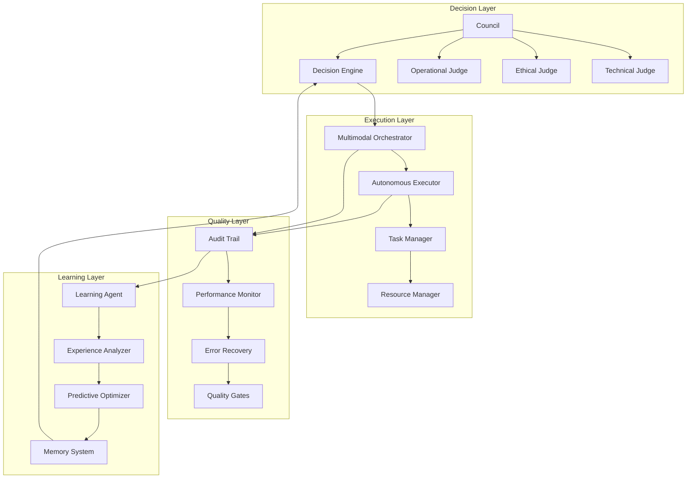

# Agent Orchestration Service

Consolidated orchestration and governance system for multi-agent coordination.

The Agent Orchestration Service provides unified task orchestration, decision-making, and governance functionality for coordinating multiple AI agents in complex workflows.

## Overview

This service combines task orchestration, decision-making, and governance into a single system:

- Council Decision Making: Multi-judge arbitration and consensus-based decisions
- Task Orchestration: Multimodal task execution and coordination
- Autonomous Execution: Self-directed task processing with governance
- Quality Assurance: Comprehensive audit trails and performance monitoring
- Risk Management: Ethical and technical risk assessment
- Learning Integration: Continuous improvement through experience analysis

## Key Features

### Council Decision Making
- Multi-Judge Arbitration: Multiple specialized judges (technical, ethical, operational)
- Consensus Algorithms: Configurable decision-making strategies
- Evidence-Based Decisions: Comprehensive evidence analysis and weighting
- Ethical Oversight: Built-in ethical assessment and risk evaluation

### Task Orchestration
- Multimodal Processing: Support for text, code, images, and complex data types
- Autonomous Execution: Self-directed task processing with governance controls
- Dynamic Planning: Real-time task planning and adaptation
- Resource Management: Intelligent resource allocation and optimization

### Quality Assurance
- Comprehensive Audit Trails: Complete operation tracking and provenance
- Performance Monitoring: SLO tracking and performance analytics
- Error Recovery: Intelligent error handling and recovery strategies
- Quality Gates: Automated quality validation and enforcement

### Learning Integration
- Experience Analysis: Learning from task execution outcomes
- Predictive Optimization: Performance prediction and optimization
- Adaptive Behaviors: Continuous improvement through feedback loops
- Knowledge Integration: Memory system integration for context-aware decisions

## Architecture



## Setup

### Prerequisites
- Rust toolchain with async support
- Database connection for persistence
- Message queue for inter-agent communication

### Dependencies

```toml
[dependencies]
agent-orchestration = { path = "../agent-orchestration" }
```

### Initialization

```rust
use agent_orchestration::*;

#[tokio::main]
async fn main() -> Result<(), Box<dyn std::error::Error>> {
    // Configure the orchestration service
    let config = OrchestrationConfig {
        council_config: CouncilConfig::default(),
        orchestrator_config: OrchestratorConfig::default(),
        executor_config: AutonomousExecutorConfig::default(),
        audit_config: AuditConfig::default(),
    };

    // Create the service
    let orchestration = AgentOrchestrationService::new(config).await?;

    Ok(())
}
```

### Basic Usage

```rust
// Define a task
let task = OrchestratedTask {
    id: "task-001".to_string(),
    description: "Analyze codebase for security vulnerabilities".to_string(),
    requirements: vec![
        "Perform static analysis".to_string(),
        "Check for common vulnerabilities".to_string(),
        "Generate security report".to_string(),
    ],
    priority: TaskPriority::High,
};

// Execute with governance
let result = orchestration.execute_orchestrated_task(task).await?;

println!("Task completed with council approval: {}", result.council_decision.approved);
println!("Audit trail ID: {:?}", result.audit_id);
```

### Performance Monitoring

```rust
// Get performance metrics
let slo_tracker = SLOTracker::new();
let status = slo_tracker.check_slos().await?;

for component in status.components {
    println!("{}: {} violations", component.name, component.violations);
}
```

## Configuration

### Council Configuration

```rust
let council_config = CouncilConfig {
    judges: vec![
        JudgeConfig {
            judge_type: JudgeType::Technical,
            model: "gpt-4".to_string(),
            ethical_focus: false,
            ..Default::default()
        },
        JudgeConfig {
            judge_type: JudgeType::Ethical,
            model: "gpt-4".to_string(),
            ethical_focus: true,
            ..Default::default()
        },
    ],
    consensus_strategy: ConsensusStrategy::Majority,
    evidence_weighting: EvidenceWeighting::Balanced,
    ..Default::default()
};
```

### Orchestrator Configuration

```rust
let orchestrator_config = OrchestratorConfig {
    max_concurrent_tasks: 10,
    task_timeout_seconds: 300,
    resource_limits: ResourceLimits {
        cpu_cores: 4,
        memory_gb: 8,
        gpu_memory_gb: 2,
    },
    quality_gates: vec![
        QualityGate::CodeCoverage(80.0),
        QualityGate::PerformanceBudget(1000), // ms
    ],
};
```

## Council Decision Making

### Judge Types

- **Technical Judge**: Code quality, performance, correctness
- **Ethical Judge**: Privacy, fairness, societal impact
- **Operational Judge**: Resource usage, reliability, maintainability

### Consensus Strategies

- **Unanimous**: All judges must agree
- **Majority**: Simple majority required
- **Weighted**: Judges have different voting weights
- **Veto**: Any judge can block execution

### Evidence Types

- **Code Analysis**: Static analysis results
- **Performance Metrics**: Execution time, resource usage
- **Security Scans**: Vulnerability assessments
- **Ethical Impact**: Stakeholder analysis

## Task Execution

### Multimodal Support

- **Text Processing**: Documentation, code analysis
- **Code Execution**: Testing, compilation, deployment
- **Image Processing**: Visual analysis, OCR
- **Data Analysis**: Statistical analysis, visualization

### Autonomous Features

- **Self-Directed Planning**: Automatic task decomposition
- **Dynamic Adaptation**: Real-time strategy adjustment
- **Resource Optimization**: Intelligent resource allocation
- **Failure Recovery**: Automatic error recovery and retry

## Audit & Compliance

### Comprehensive Audit Trails

- **Decision Provenance**: Complete council decision records
- **Execution Logs**: Detailed task execution tracking
- **Performance Metrics**: SLO compliance and performance data
- **Error Analysis**: Failure analysis and recovery actions

### Compliance Features

- **Regulatory Compliance**: Audit trails for compliance requirements
- **Data Privacy**: Privacy-preserving execution and logging
- **Security Controls**: Secure execution environments
- **Access Control**: Role-based access and permissions

## Monitoring & Observability

### SLO Tracking

The service tracks Service Level Objectives for:

- **Decision Latency**: Council decision response times
- **Task Completion**: Successful task execution rates
- **Quality Metrics**: Code coverage, performance benchmarks
- **Error Rates**: Failure rates and recovery success

### Metrics Collection

```rust
// Get comprehensive metrics
let metrics = orchestration.get_metrics().await?;

// Council performance
println!("Council decisions: {}", metrics.council.decisions_made);
println!("Average decision time: {}ms", metrics.council.avg_decision_time_ms);

// Orchestrator performance
println!("Tasks completed: {}", metrics.orchestrator.tasks_completed);
println!("Success rate: {:.2}%", metrics.orchestrator.success_rate * 100.0);

// Quality metrics
println!("Audit trail size: {} events", metrics.audit.events_recorded);
```

## Integration Examples

### With Agent Memory

```rust
// Integrate with agent memory for learning
let memory_integration = MemoryIntegration::new(memory_system);

let enhanced_orchestration = orchestration.with_memory_integration(memory_integration);

// Tasks now learn from previous executions
let result = enhanced_orchestration.execute_learning_task(task).await?;
```

### With External Systems

```rust
// Integrate with external APIs and services
let external_integration = ExternalIntegration::new(api_client);

let connected_orchestration = orchestration.with_external_integration(external_integration);

// Tasks can now call external services
let result = connected_orchestration.execute_connected_task(task).await?;
```

## Best Practices

### Configuration

1. **Judge Selection**: Choose judges appropriate for your domain
2. **Consensus Strategy**: Select based on risk tolerance and decision criticality
3. **Quality Gates**: Set appropriate quality thresholds for your requirements
4. **Resource Limits**: Configure based on available infrastructure

### Operation

1. **Monitoring**: Regularly review SLO compliance and performance metrics
2. **Audit Review**: Periodically review audit trails for anomalies
3. **Model Updates**: Keep judge models updated with latest capabilities
4. **Quality Improvement**: Use performance data to improve decision quality

### Security

1. **Access Control**: Implement proper authentication and authorization
2. **Audit Logging**: Enable comprehensive audit logging for compliance
3. **Data Protection**: Ensure sensitive data is properly protected
4. **Network Security**: Secure all external communications

## Troubleshooting

### Common Issues

**Slow Council Decisions**
- Reduce number of judges or use faster models
- Implement caching for similar decisions
- Review evidence requirements

**Task Execution Failures**
- Check resource availability and limits
- Review error logs and audit trails
- Validate task requirements and inputs

**Quality Gate Failures**
- Adjust quality thresholds appropriately
- Review quality gate configurations
- Check underlying quality tools

**Memory Issues**
- Monitor resource usage and adjust limits
- Implement proper cleanup and garbage collection
- Review concurrent task limits

## Performance Characteristics

### Scalability Targets

- Concurrent Tasks: Supports 100+ concurrent orchestrated tasks
- Decision Throughput: 1000+ council decisions per minute
- Audit Performance: Sub-millisecond audit logging
- Memory Efficiency: Efficient resource usage with automatic cleanup

### Reliability Features

- Fault Tolerance: Automatic recovery from component failures
- Data Consistency: ACID-compliant audit trails and state management
- High Availability: Designed for distributed deployment
- Circuit Breakers: Protection against cascading failures

## Contributing

1. Follow the CAWS workflow for any changes
2. Include comprehensive tests for new features
3. Update documentation for API changes
4. Run performance benchmarks for optimizations

## License

Licensed under the same terms as the Agent Agency project.
