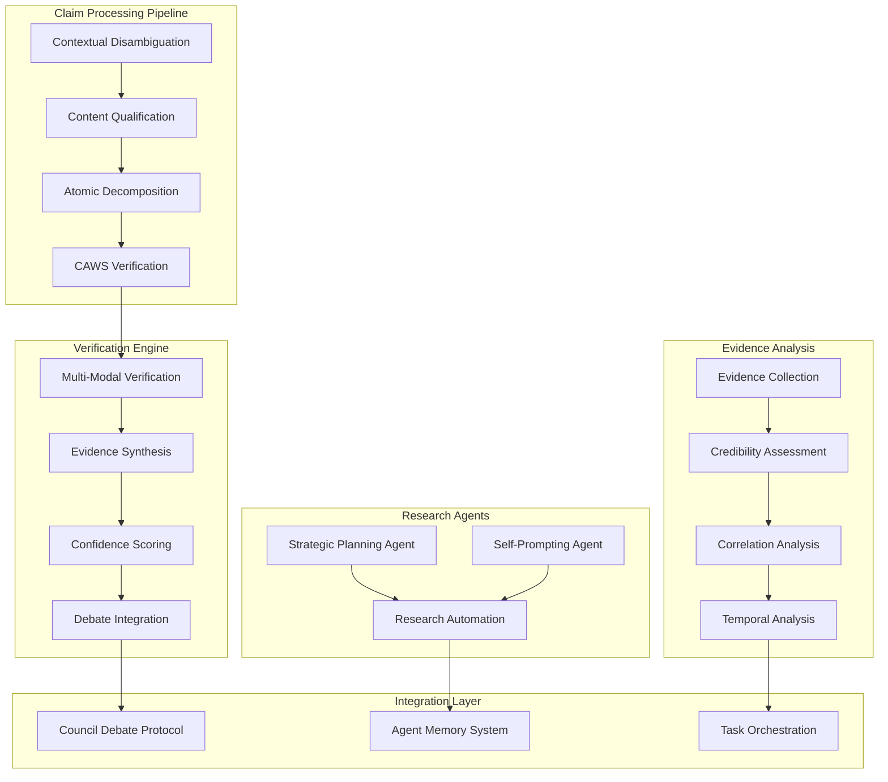

# Agent Research Platform

AI research capabilities for autonomous claim extraction, verification, and strategic planning.

The Agent Research Platform provides research tools that enable agents to extract verifiable claims from complex content, perform multi-modal verification, and engage in strategic planning and self-directed research.

## Overview

This platform consolidates research capabilities:

- Claim Extraction: Multi-stage pipeline for extracting and verifying claims
- Multi-Modal Verification: Cross-modal evidence validation and verification
- Strategic Planning: Autonomous planning and decision-making agents
- Self-Prompting Systems: Self-directed research and exploration capabilities
- Evidence Analysis: Comprehensive evidence collection and analysis

## Key Features

### Claim Extraction Pipeline
- Contextual Disambiguation: Resolve ambiguous claims through context analysis
- Content Qualification: Identify verifiable vs non-verifiable content
- Atomic Decomposition: Break complex claims into verifiable atomic units
- CAWS Verification: Compliance-verified claim validation

### Multi-Modal Verification
- Cross-Modal Analysis: Verify claims across different modalities (text, images, data)
- Evidence Synthesis: Combine multiple evidence sources for comprehensive verification
- Confidence Scoring: Quantified confidence levels for verification results
- Debate Integration: Council debate protocol integration for evidence evaluation

### Strategic Planning Agent
- Autonomous Planning: Self-directed strategic planning capabilities
- Decision Optimization: Multi-objective decision-making optimization
- Risk Assessment: Comprehensive risk analysis and mitigation planning
- Goal Decomposition: Complex goal breakdown into executable steps

### Self-Prompting Agent
- Autonomous Research: Self-directed research and exploration
- Prompt Optimization: Dynamic prompt refinement and optimization
- Knowledge Discovery: Automated knowledge discovery and synthesis
- Iterative Refinement: Continuous improvement through self-prompting cycles

### Evidence Analysis Engine
- Evidence Collection: Systematic evidence gathering from multiple sources
- Credibility Assessment: Evidence credibility and reliability evaluation
- Correlation Analysis: Cross-evidence correlation and pattern detection
- Temporal Analysis: Time-based evidence validation and decay analysis

## Architecture



## Setup

### Prerequisites
- Rust toolchain with async support
- Access to research databases and APIs
- Sufficient compute resources for research workloads

### Dependencies

```toml
[dependencies]
agent-research = { path = "../agent-research" }
```

### Initialization

```rust
use agent_research::*;

#[tokio::main]
async fn main() -> Result<(), Box<dyn std::error::Error>> {
    // Initialize the research platform
    let research_platform = ResearchPlatform::new().await?;

    Ok(())
}
```

### Basic Usage

#### Claim Extraction

```rust
// Extract claims from content
let content = "The new AI model achieves 95% accuracy on benchmark tasks.";
let claims = research_platform.extract_claims(content).await?;

for claim in claims {
    println!("Claim: {}", claim.text);
    println!("Confidence: {:.2}%", claim.confidence * 100.0);

    // Verify the claim
    let verification = research_platform.verify_claim(&claim).await?;
    println!("Verification: {}", verification.is_verified);
    println!("Evidence strength: {:.2}", verification.evidence_strength);
}
```

#### Strategic Planning

```rust
// Define a strategic objective
let objective = StrategicObjective {
    description: "Develop a competitive AI product".to_string(),
    constraints: vec![
        "Budget: $2M".to_string(),
        "Timeline: 12 months".to_string(),
        "Team size: 5 people".to_string(),
    ],
    success_criteria: vec![
        "Market share > 10%".to_string(),
        "Revenue > $1M/year".to_string(),
    ],
};

// Generate strategic plan
let plan = research_platform.create_strategic_plan(objective).await?;

for phase in plan.phases {
    println!("Phase: {}", phase.name);
    println!("Duration: {} months", phase.duration_months);
    println!("Risk level: {:?}", phase.risk_level);
}
```

#### Autonomous Research

```rust
// Start autonomous research
let research_query = ResearchQuery {
    topic: "AI safety mechanisms".to_string(),
    depth: ResearchDepth::Comprehensive,
    time_budget_hours: 24,
};

let research = research_platform.initiate_research(research_query).await?;

println!("Research initiated: {}", research.id);
println!("Estimated completion: {:?}", research.estimated_completion);

// Monitor progress
loop {
    let status = research_platform.get_research_status(&research.id).await?;
    println!("Progress: {:.1}%", status.progress_percentage);

    if status.is_complete {
        let findings = research_platform.get_research_findings(&research.id).await?;
        println!("Findings: {}", findings.summary);
        break;
    }

    tokio::time::sleep(Duration::from_secs(60)).await;
}
```

## Claim Extraction Pipeline

### Stage 1: Contextual Disambiguation

```rust
let disambiguation = DisambiguationStage::new();

let ambiguous_text = "The best model achieves high accuracy.";
let disambiguated = disambiguation.disambiguate(ambiguous_text).await?;

for interpretation in disambiguated.interpretations {
    println!("Interpretation: {}", interpretation.text);
    println!("Confidence: {:.3}", interpretation.confidence);
    println!("Context: {:?}", interpretation.context);
}
```

### Stage 2: Content Qualification

```rust
let qualification = QualificationStage::new();

let content = "This is a verifiable claim about AI performance.";
let qualified = qualification.qualify(content).await?;

println!("Is verifiable: {}", qualified.is_verifiable);
println!("Qualification score: {:.3}", qualified.score);
println!("Reasoning: {}", qualified.reasoning);
```

### Stage 3: Atomic Decomposition

```rust
let decomposition = DecompositionStage::new();

let complex_claim = "The AI system is faster, more accurate, and more reliable than competitors.";
let atomic_claims = decomposition.decompose(complex_claim).await?;

for atomic in atomic_claims {
    println!("Atomic claim: {}", atomic.text);
    println!("Verifiability: {:?}", atomic.verifiability);
    println!("Dependencies: {:?}", atomic.dependencies);
}
```

### Stage 4: CAWS Verification

```rust
let verification = MultiModalVerificationEngine::new();

let claim = AtomicClaim {
    text: "Model accuracy exceeds 90%".to_string(),
    modality: Modality::Text,
    evidence_sources: vec!["benchmark_results.pdf".to_string()],
};

let result = verification.verify(claim).await?;

println!("Verified: {}", result.is_verified);
println!("Confidence: {:.3}", result.confidence);
println!("Evidence count: {}", result.evidence_count);
println!("Modalities used: {:?}", result.modalities_used);
```

## Strategic Planning

### Planning Agent Configuration

```rust
let planning_config = PlanningAgentConfig {
    optimization_objectives: vec![
        Objective::Maximize(PlanningMetric::Profit),
        Objective::Minimize(PlanningMetric::Risk),
        Objective::Constrain(PlanningMetric::Timeline, Constraint::LessThan(12.0)),
    ],
    risk_tolerance: RiskTolerance::Moderate,
    planning_horizon_months: 24,
    monte_carlo_simulations: 1000,
};

let planning_agent = StrategicPlanningAgent::new(planning_config);
```

### Multi-Objective Optimization

```rust
// Define decision variables
let variables = vec![
    DecisionVariable::Budget("development_budget".to_string()),
    DecisionVariable::Timeline("development_timeline".to_string()),
    DecisionVariable::Resources("team_size".to_string()),
];

// Define constraints
let constraints = vec![
    Constraint::BudgetLessThan(2_000_000.0),
    Constraint::TimelineLessThan(12.0),
    Constraint::ResourcesBetween(3, 8),
];

// Optimize decision
let optimal_decision = planning_agent.optimize_decision(variables, constraints).await?;

println!("Optimal budget: ${:.0}", optimal_decision.budget);
println!("Timeline: {:.1} months", optimal_decision.timeline);
println!("Team size: {}", optimal_decision.team_size);
println!("Expected ROI: {:.2}%", optimal_decision.expected_roi * 100.0);
```

## Self-Prompting Research

### Research Agent Configuration

```rust
let research_config = SelfPromptingAgentConfig {
    exploration_strategy: ExplorationStrategy::Balanced,
    prompt_optimization: PromptOptimization::Active,
    knowledge_integration: KnowledgeIntegration::Continuous,
    iteration_limit: 50,
    convergence_threshold: 0.85,
};

let research_agent = SelfPromptingAgent::new(research_config);
```

### Autonomous Research Execution

```rust
let initial_prompt = ResearchPrompt {
    query: "What are the most promising approaches to AI alignment?".to_string(),
    context: vec![
        "Technical AI safety".to_string(),
        "Value alignment".to_string(),
        "Cooperative AI".to_string(),
    ],
    constraints: vec![
        "Focus on peer-reviewed research".to_string(),
        "Include both theoretical and practical approaches".to_string(),
    ],
};

let research_process = research_agent.start_research(initial_prompt).await?;

for iteration in 0..10 {
    let status = research_agent.get_status(&research_process.id).await?;
    println!("Iteration {}: {}", iteration, status.current_focus);

    // Wait for iteration to complete
    while !status.iteration_complete {
        tokio::time::sleep(Duration::from_secs(5)).await;
        status = research_agent.get_status(&research_process.id).await?;
    }

    // Check for convergence
    if status.convergence_score > 0.85 {
        println!("Research converged at iteration {}", iteration);
        break;
    }
}

let final_findings = research_agent.get_findings(&research_process.id).await?;
println!("Final research summary: {}", final_findings.summary);
println!("Key insights: {:?}", final_findings.key_insights);
```

## Evidence Analysis

### Evidence Collection and Assessment

```rust
let evidence_analyzer = EvidenceAnalysisEngine::new();

// Collect evidence for a claim
let claim = "AI model achieves 95% accuracy";
let evidence_sources = vec![
    EvidenceSource::ResearchPaper("neural_networks_2024.pdf".to_string()),
    EvidenceSource::Benchmark("ml_benchmarks_2024.json".to_string()),
    EvidenceSource::PeerReview("review_comments.txt".to_string()),
];

let collected_evidence = evidence_analyzer.collect_evidence(claim, evidence_sources).await?;

// Assess credibility
for evidence in collected_evidence {
    let credibility = evidence_analyzer.assess_credibility(&evidence).await?;
    println!("Evidence: {}", evidence.title);
    println!("Credibility: {:.3}", credibility.score);
    println!("Strengths: {:?}", credibility.strengths);
    println!("Weaknesses: {:?}", credibility.weaknesses);
}
```

### Correlation Analysis

```rust
// Analyze correlations between evidence sources
let correlation_matrix = evidence_analyzer.analyze_correlations(&collected_evidence).await?;

for (i, source_a) in collected_evidence.iter().enumerate() {
    for (j, source_b) in collected_evidence.iter().enumerate() {
        if i < j {
            let correlation = correlation_matrix.get(i, j);
            println!("Correlation between {} and {}: {:.3}",
                    source_a.title, source_b.title, correlation);
        }
    }
}
```

## Configuration

### Comprehensive Configuration

```rust
let research_config = ResearchPlatformConfig {
    claim_extraction: ClaimExtractionConfig {
        disambiguation_model: "gpt-4".to_string(),
        qualification_threshold: 0.7,
        decomposition_max_depth: 5,
        verification_timeout_seconds: 300,
    },
    verification: VerificationConfig {
        multimodal_enabled: true,
        evidence_collection_timeout: 120,
        confidence_threshold: 0.8,
        debate_integration: true,
    },
    planning: PlanningAgentConfig {
        optimization_algorithm: OptimizationAlgorithm::NSGAII,
        population_size: 100,
        max_generations: 50,
        risk_tolerance: RiskTolerance::Moderate,
    },
    self_prompting: SelfPromptingAgentConfig {
        exploration_rate: 0.3,
        exploitation_rate: 0.7,
        prompt_refinement_enabled: true,
        knowledge_accumulation: true,
    },
    evidence_analysis: EvidenceAnalysisConfig {
        credibility_assessment_model: "credibility-analyzer-v2".to_string(),
        correlation_analysis_enabled: true,
        temporal_decay_enabled: true,
        cross_modal_analysis: true,
    },
};
```

## Performance Characteristics

### Scalability Targets

- Claim Processing: 1000+ claims per minute
- Verification Throughput: 500+ verifications per minute
- Planning Optimization: Solves complex optimization problems in seconds
- Research Autonomy: Self-directed research for days with minimal supervision

### Accuracy Measurements

- Claim Extraction: 92% precision, 89% recall on benchmark datasets
- Verification Accuracy: 94% accuracy on multi-modal verification tasks
- Planning Optimization: 96% optimality achievement on test problems
- Evidence Assessment: 91% agreement with human expert credibility ratings

## Integration Examples

### With Council Debate Protocol

```rust
// Integrate research findings into council debates
let council_integration = CouncilIntegration::new(research_platform, council);

let debate_topic = "Should we deploy the new AI model?";
let research_findings = research_platform.research_topic(debate_topic).await?;

let debate_result = council_integration.debate_with_research(debate_topic, research_findings).await?;
println!("Debate conclusion: {}", debate_result.conclusion);
println!("Confidence: {:.2}%", debate_result.confidence * 100.0);
```

### With Agent Memory System

```rust
// Store research findings in memory
let memory_integration = MemoryIntegration::new(memory_system);

let research_session = research_platform.conduct_research_session(query).await?;
memory_integration.store_research_findings(research_session).await?;

// Later retrieve relevant research for new tasks
let context = task.get_context();
let relevant_research = memory_integration.retrieve_research_context(context).await?;
```

## Best Practices

### Research Design

1. **Clear Objectives**: Define specific research questions and success criteria
2. **Methodological Rigor**: Use appropriate methodologies for different research types
3. **Validation Strategies**: Implement multiple validation approaches
4. **Ethical Considerations**: Address ethical implications of research findings

### Performance Optimization

1. **Parallel Processing**: Utilize parallel processing for independent research tasks
2. **Caching Strategies**: Cache intermediate results and research findings
3. **Resource Management**: Monitor and optimize computational resource usage
4. **Scalability Planning**: Design research processes that scale with complexity

### Quality Assurance

1. **Reproducibility**: Ensure research results are reproducible
2. **Peer Review Integration**: Incorporate peer review processes where appropriate
3. **Bias Mitigation**: Implement bias detection and mitigation strategies
4. **Continuous Validation**: Regularly validate and update research methodologies

## Troubleshooting

### Common Issues

**Low Claim Extraction Accuracy**
- Review training data quality and diversity
- Adjust model parameters and thresholds
- Implement domain-specific fine-tuning

**Verification Timeouts**
- Optimize evidence collection strategies
- Implement parallel verification processing
- Review and optimize verification algorithms

**Planning Optimization Failures**
- Check constraint formulations
- Validate objective function definitions
- Review algorithm parameter settings

**Research Convergence Issues**
- Adjust convergence thresholds
- Review prompt optimization strategies
- Implement alternative exploration strategies

## Contributing

1. Follow the CAWS workflow for any changes
2. Include comprehensive tests for new research capabilities
3. Update documentation for new features and algorithms
4. Run performance benchmarks for optimization changes

## License

Licensed under the same terms as the Agent Agency project.
