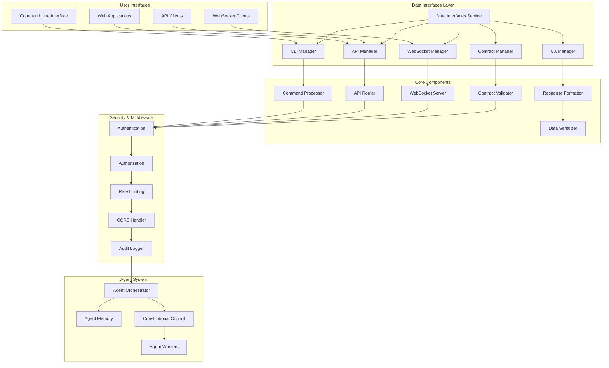

# Data Interfaces

**Unified Interface Layer & User Experience for Agent Agency V3**

The Data Interfaces crate provides a comprehensive, unified interface layer that consolidates command-line interfaces, web API endpoints, WebSocket connections, and user interaction patterns into a cohesive system for interacting with Agent Agency V3.

## Overview

This interface platform combines multiple critical interaction capabilities:

- **Command-Line Interface (CLI)**: Powerful command-line tools for system administration and interaction
- **REST API Endpoints**: Programmatic access to agent system functionality
- **WebSocket Support**: Real-time bidirectional communication channels
- **Interface Contracts**: Type-safe data contracts and validation schemas
- **User Experience (UX)**: Consistent interaction patterns and feedback mechanisms
- **Serialization & Validation**: Robust data serialization and input validation

## Key Features

### 🖥️ **Command-Line Interface (CLI)**
- **Interactive Mode**: Rich interactive command-line experience with auto-completion
- **Batch Operations**: Scriptable command execution for automation
- **Configuration Management**: CLI-based system configuration and administration
- **Monitoring Tools**: Real-time system monitoring and diagnostics
- **Multi-platform**: Cross-platform CLI support (Windows, macOS, Linux)

### 🌐 **REST API Endpoints**
- **OpenAPI Specification**: Well-documented REST API with OpenAPI/Swagger specs
- **Authentication**: JWT-based authentication with role-based access control
- **Rate Limiting**: Configurable rate limiting and request throttling
- **CORS Support**: Cross-origin resource sharing for web applications
- **Versioning**: API versioning support for backward compatibility

### 🔄 **WebSocket Communication**
- **Real-time Updates**: Bidirectional real-time communication for live data
- **Event Streaming**: Server-sent events and client-initiated requests
- **Connection Management**: Automatic reconnection and heartbeat monitoring
- **Message Routing**: Intelligent message routing and subscription management
- **Security**: WebSocket connection authentication and authorization

### 📋 **Interface Contracts**
- **Type Safety**: Compile-time type checking for all interfaces
- **Schema Validation**: JSON Schema validation for request/response contracts
- **Contract Evolution**: Backward-compatible contract versioning
- **Documentation**: Auto-generated API documentation from contracts
- **Testing**: Contract-based testing for interface reliability

### 🎨 **User Experience (UX)**
- **Consistent Patterns**: Unified interaction patterns across all interfaces
- **Feedback Mechanisms**: Rich feedback for user actions and system status
- **Error Handling**: User-friendly error messages and recovery guidance
- **Accessibility**: WCAG-compliant interface design and keyboard navigation
- **Localization**: Multi-language support for global users

### 🔒 **Security & Validation**
- **Input Validation**: Comprehensive input sanitization and validation
- **Authentication**: Multi-factor authentication support
- **Authorization**: Fine-grained permission and role management
- **Audit Logging**: Complete audit trails for security and compliance
- **Data Protection**: Encryption and secure data handling

## Architecture



### Interface Architecture

The Data Interfaces layer follows a modular architecture with clear separation of concerns:

1. **Interface Managers**: Handle specific interface types (CLI, API, WebSocket)
2. **Core Processors**: Process requests and generate responses
3. **Security Middleware**: Authentication, authorization, and security controls
4. **Data Layer**: Serialization, validation, and contract management
5. **UX Layer**: User experience formatting and feedback mechanisms

## Quick Start

### 1. Add to Dependencies

```toml
[dependencies]
data-interfaces = { path = "../data-interfaces" }
serde = { version = "1.0", features = ["derive"] }
serde_json = "1.0"
tokio = { version = "1.0", features = ["full"] }
clap = { version = "4.0", features = ["derive"] }
axum = "0.6"
tower = "0.4"
tower-http = { version = "0.4", features = ["cors", "auth"] }
```

### 2. Initialize Data Interfaces Service

```rust
use data_interfaces::*;
use std::sync::Arc;

#[tokio::main]
async fn main() -> Result<(), Box<dyn std::error::Error>> {
    // Configure the interface layer
    let interface_config = InterfaceConfig {
        cli_config: CliConfig {
            enable_interactive_mode: true,
            enable_auto_completion: true,
            command_timeout_seconds: 300,
            max_concurrent_commands: 10,
        },
        api_config: ApiConfig {
            host: "127.0.0.1".to_string(),
            port: 8080,
            enable_tls: false,
            enable_cors: true,
            rate_limit_requests_per_minute: 1000,
            max_request_size_kb: 1024,
        },
        websocket_config: WebSocketConfig {
            enable_heartbeat: true,
            heartbeat_interval_seconds: 30,
            max_connections: 1000,
            message_timeout_seconds: 60,
        },
        contract_config: ContractConfig {
            enable_validation: true,
            schema_path: "./schemas".to_string(),
            enable_contract_logging: true,
        },
        ux_config: UxConfig {
            enable_colored_output: true,
            enable_progress_bars: true,
            default_language: "en".to_string(),
            enable_accessibility_mode: false,
        },
    };

    // Initialize the data interfaces service
    let mut data_interfaces = DataInterfacesService::new().await?;
    data_interfaces.initialize(interface_config).await?;

    println!("Data Interfaces service initialized");

    // Start all interface services
    data_interfaces.start().await?;

    Ok(())
}
```

### 3. Using the CLI Interface

```rust
use data_interfaces::*;

// Create CLI interface
let cli_interface = CliInterface::new().await?;

// Initialize with configuration
let cli_config = CliConfig {
    enable_interactive_mode: true,
    enable_auto_completion: true,
    command_timeout_seconds: 300,
    max_concurrent_commands: 10,
};

cli_interface.initialize(cli_config).await?;

// Execute commands programmatically
let result = cli_interface.execute_command("agent status --detailed").await?;
println!("Command result: {}", result.output);

// Or start interactive mode
cli_interface.start_interactive_mode().await?;
```

### 4. Using the API Interface

```rust
use data_interfaces::*;
use reqwest::Client;

// Create API client
let api_client = Client::new();

// Configure API server
let api_config = ApiConfig {
    host: "127.0.0.1".to_string(),
    port: 8080,
    enable_tls: false,
    enable_cors: true,
    rate_limit_requests_per_minute: 1000,
    max_request_size_kb: 1024,
};

// Start API server (in another task)
tokio::spawn(async move {
    let mut api_server = ApiServer::new().await?;
    api_server.initialize(api_config).await?;
    api_server.start().await?;
});

// Make API requests
let response = api_client
    .get("http://127.0.0.1:8080/api/v1/agents/status")
    .header("Authorization", "Bearer your-jwt-token")
    .send()
    .await?;

let status: serde_json::Value = response.json().await?;
println!("Agent status: {:?}", status);
```

### 5. Using WebSocket Interface

```rust
use data_interfaces::*;
use tokio_tungstenite::{connect_async, tungstenite::protocol::Message};
use futures_util::{SinkExt, StreamExt};

// Connect to WebSocket
let (ws_stream, _) = connect_async("ws://127.0.0.1:8080/ws").await?;
let (mut write, mut read) = ws_stream.split();

// Send authentication
let auth_message = serde_json::json!({
    "type": "authenticate",
    "token": "your-jwt-token"
});

write.send(Message::Text(auth_message.to_string())).await?;

// Subscribe to agent events
let subscribe_message = serde_json::json!({
    "type": "subscribe",
    "channels": ["agent.status", "agent.tasks"]
});

write.send(Message::Text(subscribe_message.to_string())).await?;

// Listen for messages
while let Some(message) = read.next().await {
    match message? {
        Message::Text(text) => {
            let event: serde_json::Value = serde_json::from_str(&text)?;
            println!("Received event: {:?}", event);
        }
        Message::Close(_) => break,
        _ => {}
    }
}
```

### 6. Using Interface Contracts

```rust
use data_interfaces::*;

// Create interface contract
let contract = InterfaceContract {
    name: "agent_operations".to_string(),
    version: 1,
    description: "Agent operation endpoints".to_string(),
    endpoints: vec![
        "/api/v1/agents".to_string(),
        "/api/v1/agents/{id}".to_string(),
        "/api/v1/agents/{id}/tasks".to_string(),
    ],
    request_schemas: std::collections::HashMap::from([
        ("/api/v1/agents".to_string(), serde_json::json!({
            "type": "object",
            "properties": {
                "name": {"type": "string"},
                "type": {"type": "string", "enum": ["orchestrator", "worker", "specialist"]},
                "config": {"type": "object"}
            },
            "required": ["name", "type"]
        })),
    ]),
    response_schemas: std::collections::HashMap::from([
        ("/api/v1/agents".to_string(), serde_json::json!({
            "type": "array",
            "items": {
                "type": "object",
                "properties": {
                    "id": {"type": "string"},
                    "name": {"type": "string"},
                    "status": {"type": "string"},
                    "created_at": {"type": "string", "format": "date-time"}
                }
            }
        })),
    ]),
    metadata: std::collections::HashMap::new(),
};

// Validate contract
let validator = ContractValidator::new().await?;
let validation_result = validator.validate_contract(&contract).await?;

if validation_result.valid {
    println!("Contract is valid");
} else {
    println!("Contract validation errors:");
    for error in &validation_result.errors {
        println!("  - {}", error);
    }
}
```

## Configuration

### Comprehensive Interface Configuration

```rust
let interface_config = InterfaceConfig {
    cli_config: CliConfig {
        enable_interactive_mode: true,
        enable_auto_completion: true,
        enable_command_history: true,
        command_timeout_seconds: 300,
        max_concurrent_commands: 10,
        enable_colored_output: true,
        enable_progress_indicators: true,
        max_command_history: 1000,
        enable_script_execution: true,
        script_execution_timeout_seconds: 600,
    },

    api_config: ApiConfig {
        host: "0.0.0.0".to_string(),
        port: 8080,
        enable_tls: true,
        tls_cert_path: Some("/etc/ssl/certs/api.crt".to_string()),
        tls_key_path: Some("/etc/ssl/private/api.key".to_string()),
        enable_cors: true,
        cors_allowed_origins: vec![
            "https://app.agentagency.com".to_string(),
            "https://admin.agentagency.com".to_string(),
        ],
        rate_limit_requests_per_minute: 1000,
        rate_limit_burst_limit: 100,
        max_request_size_kb: 1024,
        max_response_size_kb: 10240,
        enable_request_logging: true,
        enable_metrics: true,
        api_version: "v1".to_string(),
    },

    websocket_config: WebSocketConfig {
        enable_heartbeat: true,
        heartbeat_interval_seconds: 30,
        heartbeat_timeout_seconds: 10,
        max_connections: 1000,
        max_connections_per_ip: 10,
        message_timeout_seconds: 60,
        max_message_size_kb: 512,
        enable_message_compression: true,
        enable_connection_pooling: true,
        connection_pool_size: 100,
        enable_metrics: true,
    },

    contract_config: ContractConfig {
        enable_validation: true,
        schema_path: "./schemas".to_string(),
        enable_contract_logging: true,
        enable_contract_caching: true,
        cache_ttl_seconds: 3600,
        enable_contract_versioning: true,
        max_contract_versions: 10,
        enable_contract_audit: true,
    },

    ux_config: UxConfig {
        enable_colored_output: true,
        enable_progress_bars: true,
        enable_interactive_prompts: true,
        default_language: "en".to_string(),
        supported_languages: vec![
            "en".to_string(),
            "es".to_string(),
            "fr".to_string(),
            "de".to_string(),
            "zh".to_string(),
        ],
        enable_accessibility_mode: false,
        enable_screen_reader_support: true,
        enable_keyboard_navigation: true,
        enable_high_contrast_mode: false,
        enable_reduced_motion: false,
    },
};
```

### CLI Configuration Options

```rust
let cli_config = CliConfig {
    // Interactive features
    enable_interactive_mode: true,
    enable_auto_completion: true,
    enable_command_history: true,
    enable_syntax_highlighting: true,

    // Performance settings
    command_timeout_seconds: 300,
    max_concurrent_commands: 10,
    max_command_history: 1000,

    // User experience
    enable_colored_output: true,
    enable_progress_indicators: true,
    enable_error_suggestions: true,
    enable_command_help: true,

    // Security
    enable_command_audit: true,
    enable_secure_input: true,

    // Scripting
    enable_script_execution: true,
    script_execution_timeout_seconds: 600,
    allowed_script_extensions: vec![
        "sh".to_string(),
        "bash".to_string(),
        "ps1".to_string(),
    ],
};
```

### API Configuration Options

```rust
let api_config = ApiConfig {
    // Server settings
    host: "0.0.0.0".to_string(),
    port: 8080,
    enable_tls: true,
    tls_cert_path: Some("/etc/ssl/certs/api.crt".to_string()),
    tls_key_path: Some("/etc/ssl/private/api.key".to_string()),

    // Security
    enable_cors: true,
    cors_allowed_origins: vec!["https://app.example.com".to_string()],
    enable_authentication: true,
    authentication_provider: AuthenticationProvider::JWT,
    enable_authorization: true,

    // Performance
    rate_limit_requests_per_minute: 1000,
    rate_limit_burst_limit: 100,
    max_request_size_kb: 1024,
    max_response_size_kb: 10240,
    enable_request_buffering: true,

    // Observability
    enable_request_logging: true,
    enable_metrics: true,
    metrics_endpoint: Some("/metrics".to_string()),
    enable_tracing: true,

    // API management
    api_version: "v1".to_string(),
    enable_api_documentation: true,
    documentation_path: "/docs".to_string(),
    enable_graphql: false,
};
```

### WebSocket Configuration Options

```rust
let websocket_config = WebSocketConfig {
    // Connection management
    enable_heartbeat: true,
    heartbeat_interval_seconds: 30,
    heartbeat_timeout_seconds: 10,
    max_connections: 1000,
    max_connections_per_ip: 10,

    // Message handling
    message_timeout_seconds: 60,
    max_message_size_kb: 512,
    enable_message_compression: true,
    enable_message_buffering: true,

    // Security
    enable_connection_authentication: true,
    enable_message_encryption: true,
    allowed_origins: vec!["https://app.example.com".to_string()],

    // Performance
    enable_connection_pooling: true,
    connection_pool_size: 100,
    enable_message_queueing: true,
    max_queue_size: 1000,

    // Observability
    enable_metrics: true,
    enable_connection_logging: true,
    enable_message_tracing: true,
};
```

## CLI Commands

### Agent Management Commands

```bash
# List all agents
agent list

# Get agent details
agent show <agent-id>

# Create new agent
agent create --name "Data Processor" --type worker --config-file config.json

# Update agent configuration
agent update <agent-id> --config-file new-config.json

# Delete agent
agent delete <agent-id>

# Start agent
agent start <agent-id>

# Stop agent
agent stop <agent-id>

# Restart agent
agent restart <agent-id>
```

### Task Management Commands

```bash
# List tasks
task list --agent <agent-id> --status running

# Create task
task create --agent <agent-id> --spec-file task-spec.json

# Monitor task
task monitor <task-id>

# Cancel task
task cancel <task-id>

# Get task logs
task logs <task-id> --follow --tail 100
```

### System Administration Commands

```bash
# System status
system status

# System health check
system health

# View system metrics
system metrics --duration 1h

# System configuration
system config show
system config update --key database.url --value "new-url"

# Backup system
system backup --destination /backups --compress

# Restore system
system restore --source /backups/backup.tar.gz
```

### Interactive Mode

```bash
# Start interactive CLI
agent interactive

# Within interactive mode
> help
> agent list
> task monitor task-123
> system status
> exit
```

## API Endpoints

### Agent Endpoints

```http
# List agents
GET /api/v1/agents

# Get agent details
GET /api/v1/agents/{id}

# Create agent
POST /api/v1/agents

# Update agent
PUT /api/v1/agents/{id}

# Delete agent
DELETE /api/v1/agents/{id}

# Agent status
GET /api/v1/agents/{id}/status

# Agent metrics
GET /api/v1/agents/{id}/metrics
```

### Task Endpoints

```http
# List tasks
GET /api/v1/tasks

# Get task details
GET /api/v1/tasks/{id}

# Create task
POST /api/v1/tasks

# Update task
PUT /api/v1/tasks/{id}

# Cancel task
POST /api/v1/tasks/{id}/cancel

# Task logs
GET /api/v1/tasks/{id}/logs
```

### System Endpoints

```http
# System status
GET /api/v1/system/status

# System health
GET /api/v1/system/health

# System metrics
GET /api/v1/system/metrics

# System configuration
GET /api/v1/system/config
PUT /api/v1/system/config
```

### WebSocket Events

```json
// Agent status updates
{
  "type": "agent.status",
  "agent_id": "agent-123",
  "status": "running",
  "timestamp": "2024-01-01T12:00:00Z"
}

// Task progress updates
{
  "type": "task.progress",
  "task_id": "task-456",
  "progress": 0.75,
  "status": "processing",
  "timestamp": "2024-01-01T12:00:00Z"
}

// System alerts
{
  "type": "system.alert",
  "level": "warning",
  "message": "High memory usage detected",
  "timestamp": "2024-01-01T12:00:00Z"
}
```

## Performance Characteristics

### CLI Performance

- **Command Execution**: Sub-second for most commands, up to 5 minutes for complex operations
- **Interactive Mode**: <100ms response time for auto-completion and suggestions
- **Concurrent Commands**: Support for 10+ concurrent command executions
- **Memory Usage**: 50-200MB depending on command complexity and history size

### API Performance

- **Request Latency**: P95 < 50ms for simple requests, < 200ms for complex operations
- **Throughput**: 1000+ requests per minute with rate limiting
- **Concurrent Connections**: Support for 1000+ concurrent API connections
- **Memory Usage**: 100-500MB depending on request volume and caching

### WebSocket Performance

- **Connection Latency**: < 10ms for message delivery
- **Message Throughput**: 10,000+ messages per second
- **Concurrent Connections**: Support for 1000+ concurrent WebSocket connections
- **Memory Usage**: 200-1000MB depending on connection count and message volume

### Scalability Metrics

- **Horizontal Scaling**: API and WebSocket services support horizontal scaling
- **Load Balancing**: Built-in support for load balancing across multiple instances
- **Resource Pooling**: Connection pooling for database and external service connections
- **Caching**: Intelligent caching for frequently accessed data and responses

## Integration Examples

### With Agent Orchestration

```rust
use agent_orchestration::*;
use data_interfaces::*;

// Orchestration with interface integration
pub struct InterfaceAwareOrchestrator {
    orchestrator: AgentOrchestrator,
    data_interfaces: Arc<DataInterfacesService>,
}

impl InterfaceAwareOrchestrator {
    pub async fn orchestrate_with_interfaces(
        &self,
        request: OrchestrationRequest,
    ) -> Result<OrchestrationResult, OrchestrationError> {
        // Log orchestration start via interfaces
        self.data_interfaces.log_event(InterfaceEvent::OrchestrationStarted {
            request_id: request.id.clone(),
            agent_count: request.agents.len(),
        }).await?;

        // Execute orchestration
        let result = self.orchestrator.execute(request).await?;

        // Update interfaces with results
        self.data_interfaces.update_agent_statuses(&result.agent_statuses).await?;
        self.data_interfaces.broadcast_task_completion(&result).await?;

        Ok(result)
    }

    pub async fn handle_cli_command(
        &self,
        command: String,
        args: Vec<String>,
    ) -> Result<String, InterfaceError> {
        match command.as_str() {
            "orchestrate" => {
                let request = self.parse_orchestration_args(args)?;
                let result = self.orchestrate_with_interfaces(request).await?;
                Ok(format!("Orchestration completed: {:?}", result.id))
            }
            "status" => {
                let status = self.orchestrator.get_status().await?;
                Ok(serde_json::to_string_pretty(&status)?)
            }
            _ => Err(InterfaceError::UnknownCommand(command)),
        }
    }
}
```

### With System Observability

```rust
use system_observability::*;
use data_interfaces::*;

// Observable interface operations
pub struct ObservableDataInterfaces {
    interfaces: DataInterfacesService,
    telemetry: Arc<TelemetryService>,
}

impl ObservableDataInterfaces {
    pub async fn execute_api_request_with_observability(
        &self,
        request: ApiRequest,
    ) -> Result<ApiResponse, InterfaceError> {
        let start_time = std::time::Instant::now();

        // Record request metrics
        system_observability::metrics::record_counter(
            "api_requests_total",
            1,
            &[("method", &request.method), ("endpoint", &request.path)]
        );

        let result = self.interfaces.execute_api_request(request.clone()).await;

        let duration = start_time.elapsed().as_millis() as f64;

        // Record response metrics
        system_observability::metrics::record_histogram(
            "api_request_duration_ms",
            duration,
            &[("method", &request.method), ("endpoint", &request.path)]
        );

        match &result {
            Ok(response) => {
                system_observability::metrics::record_counter(
                    "api_requests_success",
                    1,
                    &[("status_code", &response.status_code.to_string())]
                );
            }
            Err(_) => {
                system_observability::metrics::record_counter(
                    "api_requests_error",
                    1,
                    &[("method", &request.method), ("endpoint", &request.path)]
                );
            }
        }

        // Log structured request details
        tracing::info!(
            method = %request.method,
            path = %request.path,
            duration_ms = duration,
            success = result.is_ok(),
            "API request completed"
        );

        result
    }

    pub async fn handle_websocket_message_with_observability(
        &self,
        connection_id: &str,
        message: WebSocketMessage,
    ) -> Result<(), InterfaceError> {
        let start_time = std::time::Instant::now();

        let result = self.interfaces.handle_websocket_message(connection_id, message.clone()).await;

        let duration = start_time.elapsed().as_millis() as f64;

        // Record WebSocket metrics
        system_observability::metrics::record_histogram(
            "websocket_message_duration_ms",
            duration,
            &[("message_type", &message.message_type)]
        );

        match &result {
            Ok(_) => {
                system_observability::metrics::record_counter(
                    "websocket_messages_success",
                    1,
                    &[("message_type", &message.message_type)]
                );
            }
            Err(_) => {
                system_observability::metrics::record_counter(
                    "websocket_messages_error",
                    1,
                    &[("message_type", &message.message_type)]
                );
            }
        }

        result
    }
}
```

## Best Practices

### Interface Design

1. **Consistent Patterns**: Use consistent command structures and API response formats
2. **Progressive Enhancement**: Provide basic functionality that works without advanced features
3. **Error Recovery**: Implement graceful error handling with actionable error messages
4. **Documentation**: Maintain comprehensive documentation for all interfaces

### Security Implementation

1. **Defense in Depth**: Implement multiple layers of security controls
2. **Principle of Least Privilege**: Grant minimal required permissions
3. **Input Validation**: Validate all inputs at multiple layers
4. **Audit Logging**: Log all security-relevant events for analysis

### Performance Optimization

1. **Caching**: Implement intelligent caching for frequently accessed data
2. **Connection Pooling**: Use connection pools for database and external services
3. **Asynchronous Processing**: Leverage async/await for non-blocking operations
4. **Resource Management**: Monitor and manage system resources effectively

### User Experience

1. **Feedback Mechanisms**: Provide clear feedback for all user actions
2. **Progressive Disclosure**: Show information progressively based on user needs
3. **Accessibility**: Ensure interfaces work with assistive technologies
4. **Internationalization**: Support multiple languages and locales

## Troubleshooting

### Common Issues

**CLI Command Failures**
- Check command syntax and required arguments
- Verify user permissions and authentication
- Review command timeout settings
- Check system resources and concurrent command limits

**API Request Errors**
- Validate request format and required headers
- Check authentication tokens and permissions
- Review rate limiting and quota usage
- Verify API endpoint availability and network connectivity

**WebSocket Connection Issues**
- Check WebSocket URL and port configuration
- Verify authentication and authorization
- Review firewall and network security settings
- Check connection limits and resource availability

**Contract Validation Failures**
- Review contract schema definitions
- Check data format and required fields
- Validate schema versions and compatibility
- Review validation error messages for specific issues

**Performance Degradation**
- Monitor system resources (CPU, memory, disk, network)
- Check for resource leaks and connection pooling issues
- Review caching effectiveness and configuration
- Analyze query patterns and optimization opportunities

## Contributing

1. Follow the CAWS workflow for any changes
2. Include comprehensive tests for new interface components
3. Update documentation for API changes and new CLI commands
4. Run interface compatibility tests for breaking changes

## License

Licensed under the same terms as the Agent Agency project.

## Related Components

- **agent-orchestration**: Orchestrates agent workflows with interface integration
- **system-observability**: Monitors interface performance and health
- **system-configuration**: Manages interface configuration settings
- **agent-memory**: Stores interface interaction history and preferences
- **system-quality-security**: Provides security controls for interfaces
