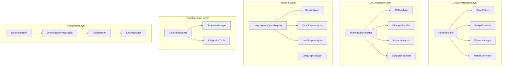

# Development Tools

**CAWS Runtime Validation and Development Workflow Tools for Agent Agency V3**

The Development Tools crate provides a comprehensive suite of development-time tools and runtime validation capabilities for the Agent Agency V3 system. It includes CAWS policy validation, minimal diff evaluation, code analysis, codemod functionality, and development workflow integration.

## Overview

This development toolkit combines multiple critical development capabilities:

- **CAWS Runtime Validation**: Real-time validation of CAWS invariants and policies
- **Minimal Diff Evaluation**: Intelligent analysis of code changes and their impact
- **Language Analysis**: Multi-language code analysis and quality assessment
- **Codemod Support**: Automated code transformation and refactoring tools
- **Template Management**: Project scaffolding and boilerplate generation
- **Integration Hooks**: Seamless integration with development workflows and CI/CD

## Key Features

### 🛡️ **CAWS Runtime Validation**
- **Policy Enforcement**: Real-time validation of CAWS policies and invariants
- **Violation Detection**: Comprehensive violation detection with severity classification
- **Budget Management**: Change budget tracking and enforcement
- **Waiver Management**: Structured waiver request and approval process
- **Compliance Scoring**: Quantitative compliance assessment and reporting

### 🔍 **Minimal Diff Evaluation**
- **AST Analysis**: Abstract syntax tree analysis for code understanding
- **Change Classification**: Intelligent categorization of code changes
- **Impact Analysis**: Assessment of change impact on system components
- **Risk Assessment**: Automated risk evaluation for code modifications
- **Dependency Tracking**: Analysis of change dependencies and cascading effects

### 📊 **Language Analysis & Quality**
- **Multi-Language Support**: Analysis support for Rust, TypeScript, JavaScript, and more
- **Code Quality Metrics**: Automated code quality assessment and scoring
- **Violation Detection**: Language-specific rule violation identification
- **Best Practice Enforcement**: Automated enforcement of coding standards
- **Performance Analysis**: Code performance pattern detection and optimization

### 🔄 **Codemod & Refactoring**
- **Automated Refactoring**: Safe, automated code transformation tools
- **Pattern Matching**: Sophisticated pattern matching for code identification
- **Transformation Pipelines**: Composable transformation pipelines for complex changes
- **Safety Validation**: Pre and post-transformation validation and testing
- **Rollback Support**: Safe rollback mechanisms for failed transformations

### 📝 **Template Management**
- **Project Scaffolding**: Automated project structure generation
- **Boilerplate Generation**: Standardized code boilerplate and configuration generation
- **Template Customization**: Flexible template customization and extension
- **Version Management**: Template versioning and update management
- **Integration Support**: IDE and editor integration for template usage

### 🔗 **Development Workflow Integration**
- **CI/CD Integration**: Seamless integration with continuous integration pipelines
- **IDE Integration**: Plugin support for popular development environments
- **Git Hooks**: Pre-commit and pre-push validation hooks
- **Workflow Automation**: Automated development workflow orchestration
- **Reporting & Analytics**: Development metrics and analytics collection

## Architecture



### Core Components

1. **CAWS Validator**: Core validation engine for CAWS policy enforcement
2. **Minimal Diff Evaluator**: Intelligent analysis of code changes and their impact
3. **Language Analyzers**: Multi-language code analysis and quality assessment
4. **CodeMod Runner**: Automated code transformation and refactoring tools
5. **Template Manager**: Project scaffolding and boilerplate generation
6. **Integration Tools**: Development workflow and CI/CD integration

## Quick Start

### 1. Add to Dependencies

```toml
[dependencies]
development-tools = { path = "../development-tools" }
serde = { version = "1.0", features = ["derive"] }
serde_json = "1.0"
tokio = { version = "1.0", features = ["full"] }
```

### 2. Initialize Development Tools

```rust
use development_tools::*;
use std::sync::Arc;

#[tokio::main]
async fn main() -> Result<(), Box<dyn std::error::Error>> {
    // Initialize CAWS validator
    let caws_validator = Arc::new(CawsValidator::new().await?);

    // Initialize minimal diff evaluator
    let diff_evaluator = Arc::new(MinimalDiffEvaluator::new().await?);

    // Initialize language analyzer registry
    let analyzer_registry = Arc::new(LanguageAnalyzerRegistry::new().await?);

    // Register language analyzers
    analyzer_registry.register_analyzer(Box::new(RustAnalyzer::new())).await?;
    analyzer_registry.register_analyzer(Box::new(TypeScriptAnalyzer::new())).await?;
    analyzer_registry.register_analyzer(Box::new(JavaScriptAnalyzer::new())).await?;

    // Initialize codemod runner
    let codemod_runner = Arc::new(CodeModRunner::new().await?);

    // Initialize template manager
    let template_manager = Arc::new(TemplateManager::new().await?);

    // Create development tools orchestrator
    let dev_tools = DevelopmentToolsOrchestrator::new(
        caws_validator,
        diff_evaluator,
        analyzer_registry,
        codemod_runner,
        template_manager,
    ).await?;

    println!("Development tools initialized");

    Ok(())
}
```

### 3. CAWS Validation

```rust
use development_tools::*;

// Create validation context
let validation_context = ValidationContext {
    task_id: "feature-user-auth".to_string(),
    risk_tier: "2".to_string(),
    working_spec: serde_json::json!({
        "id": "feature-user-auth",
        "title": "Implement User Authentication",
        "risk_tier": 2,
        "change_budget": {
            "max_files": 15,
            "max_loc": 800
        }
    }),
    diff_stats: DiffStats {
        files_changed: 8,
        lines_added: 245,
        lines_removed: 23,
        files_added: 2,
        files_deleted: 0,
    },
    test_results: Some(TestResults {
        total_tests: 45,
        passed_tests: 43,
        failed_tests: 2,
        coverage_percentage: 87.5,
    }),
    security_scan: Some(SecurityScanResults {
        vulnerabilities_found: 0,
        high_severity: 0,
        medium_severity: 0,
        low_severity: 0,
    }),
};

// Validate against CAWS policies
let validation_result = caws_validator.validate_context(&validation_context).await?;

println!("CAWS Validation Result:");
println!("  Passed: {}", validation_result.passed);
println!("  Compliance Score: {:.2}%", validation_result.compliance_score * 100.0);
println!("  Violations Found: {}", validation_result.violations.len());

for violation in &validation_result.violations {
    println!("  - [{}] {}: {}", violation.severity, violation.rule_id, violation.message);
    if let Some(remediation) = &violation.remediation {
        println!("    Remediation: {}", remediation);
    }
}
```

### 4. Minimal Diff Evaluation

```rust
use development_tools::*;

// Create diff evaluation context
let diff_context = DiffEvaluationContext {
    repository_path: "/path/to/agent-agency".to_string(),
    base_commit: "main".to_string(),
    head_commit: "feature/user-auth".to_string(),
    changed_files: vec![
        "src/auth/mod.rs".to_string(),
        "src/auth/jwt.rs".to_string(),
        "tests/auth/mod.rs".to_string(),
    ],
    working_spec: Some(serde_json::json!({
        "id": "feature-user-auth",
        "risk_tier": 2,
        "blast_radius": {
            "modules": ["auth"],
            "data_migration": false
        }
    })),
};

// Evaluate the diff
let evaluation_result = diff_evaluator.evaluate_diff(&diff_context).await?;

println!("Diff Evaluation Result:");
println!("  Risk Level: {:?}", evaluation_result.risk_level);
println!("  Impact Score: {:.2}/10", evaluation_result.impact_score);
println!("  Breaking Changes: {}", evaluation_result.breaking_changes);
println!("  Test Coverage: {:.1}%", evaluation_result.test_coverage * 100.0);

println!("Change Classifications:");
for classification in &evaluation_result.change_classifications {
    println!("  - {}: {} ({:?})",
             classification.file_path,
             classification.change_type,
             classification.risk_level);
}

println!("Impact Analysis:");
for impact in &evaluation_result.impact_analysis {
    println!("  - {}: {:?}", impact.component, impact.impact_type);
}
```

### 5. Language Analysis

```rust
use development_tools::*;

// Analyze Rust code
let rust_code = r#"
pub fn authenticate_user(username: &str, password: &str) -> Result<User, AuthError> {
    // TODO: Implement proper authentication
    if username.is_empty() || password.is_empty() {
        return Err(AuthError::InvalidCredentials);
    }
    // This is a security vulnerability - hardcoded credentials
    if username == "admin" && password == "password123" {
        Ok(User { id: 1, username: username.to_string() })
    } else {
        Err(AuthError::InvalidCredentials)
    }
}
"#;

// Analyze the code
let analysis_result = analyzer_registry.analyze_code("auth.rs", rust_code, ProgrammingLanguage::Rust).await?;

println!("Code Analysis Result:");
println!("  Language: {:?}", analysis_result.language);
println!("  Quality Score: {:.2}/10", analysis_result.quality_score);
println!("  Violations: {}", analysis_result.violations.len());
println!("  Warnings: {}", analysis_result.warnings.len());

for violation in &analysis_result.violations {
    println!("  Violation [{}]: {} at line {}",
             violation.severity,
             violation.message,
             violation.location.line.unwrap_or(0));
}

for warning in &analysis_result.warnings {
    println!("  Warning: {} at line {}",
             warning.message,
             warning.location.line.unwrap_or(0));
}
```

### 6. Codemod Execution

```rust
use development_tools::*;

// Define a codemod transformation
let codemod_spec = CodemodSpec {
    name: "update-auth-error-handling".to_string(),
    description: "Update authentication error handling to use new error types".to_string(),
    target_language: ProgrammingLanguage::Rust,
    patterns: vec![
        CodemodPattern {
            pattern_type: PatternType::FunctionCall,
            search_pattern: "AuthError::InvalidCredentials".to_string(),
            replace_pattern: "AuthError::AuthenticationFailed { reason: \"Invalid credentials\" }".to_string(),
            conditions: vec![
                Condition::FileContains("auth".to_string()),
            ],
        },
    ],
    safety_checks: vec![
        SafetyCheck::HasTests,
        SafetyCheck::CompilesAfterTransform,
    ],
    rollback_strategy: RollbackStrategy::GitRevert,
};

// Execute the codemod
let codemod_result = codemod_runner.run_codemod(&codemod_spec, "/path/to/project").await?;

println!("Codemod Execution Result:");
println!("  Files Modified: {}", codemod_result.files_modified.len());
println!("  Transformations Applied: {}", codemod_result.transformations_applied);
println!("  Safety Checks Passed: {}", codemod_result.safety_checks_passed);

for modified_file in &codemod_result.files_modified {
    println!("  - Modified: {}", modified_file);
}

if let Some(rollback_info) = &codemod_result.rollback_info {
    println!("  Rollback Commit: {}", rollback_info.commit_hash);
}
```

### 7. Template Management

```rust
use development_tools::*;

// Generate project template
let template_request = TemplateRequest {
    template_type: TemplateType::RustLibrary,
    project_name: "my-agent-tool".to_string(),
    description: "A custom agent tool for data processing".to_string(),
    features: vec![
        TemplateFeature::AsyncSupport,
        TemplateFeature::ErrorHandling,
        TemplateFeature::Logging,
        TemplateFeature::Testing,
    ],
    configuration: TemplateConfiguration {
        license: "MIT".to_string(),
        author: "Developer Name".to_string(),
        version: "0.1.0".to_string(),
        rust_edition: "2021".to_string(),
    },
};

// Generate the template
let generation_result = template_manager.generate_template(&template_request, "/output/path").await?;

println!("Template Generation Result:");
println!("  Template Type: {:?}", generation_result.template_type);
println!("  Files Created: {}", generation_result.files_created.len());
println!("  Directories Created: {}", generation_result.directories_created.len());

for file in &generation_result.files_created {
    println!("  - Created: {}", file);
}

// List available templates
let available_templates = template_manager.list_templates().await?;
println!("Available Templates:");
for template in available_templates {
    println!("  - {}: {}", template.name, template.description);
}
```

## Configuration

### Comprehensive Development Tools Configuration

```rust
let dev_tools_config = DevelopmentToolsConfig {
    // CAWS validation configuration
    caws_validation: CawsValidationConfig {
        enable_policy_validation: true,
        policy_update_interval_seconds: 300,
        enable_budget_tracking: true,
        budget_violation_threshold: 0.9,
        enable_waiver_system: true,
        waiver_expiry_days: 30,
        compliance_reporting: ComplianceReportingConfig {
            enable_reporting: true,
            report_interval_hours: 24,
            report_recipients: vec!["compliance@company.com".to_string()],
            report_format: ReportFormat::JSON,
        },
    },

    // Diff evaluation configuration
    diff_evaluation: DiffEvaluationConfig {
        enable_ast_analysis: true,
        enable_impact_analysis: true,
        enable_dependency_tracking: true,
        max_diff_size_kb: 1024,
        analysis_timeout_seconds: 60,
        enable_parallel_analysis: true,
        risk_thresholds: RiskThresholds {
            low_risk_max_files: 5,
            medium_risk_max_files: 15,
            high_risk_max_files: 50,
        },
    },

    // Language analysis configuration
    language_analysis: LanguageAnalysisConfig {
        enabled_languages: vec![
            ProgrammingLanguage::Rust,
            ProgrammingLanguage::TypeScript,
            ProgrammingLanguage::JavaScript,
            ProgrammingLanguage::Python,
        ],
        analysis_timeout_seconds: 30,
        enable_parallel_analysis: true,
        quality_thresholds: QualityThresholds {
            min_quality_score: 7.0,
            max_violations_per_file: 10,
            max_warnings_per_file: 20,
        },
        custom_rules: vec![
            CustomRule {
                language: ProgrammingLanguage::Rust,
                rule_id: "no-todo-comments".to_string(),
                pattern: "TODO|FIXME|XXX".to_string(),
                severity: ViolationSeverity::Warning,
                message: "TODO comments should be addressed".to_string(),
            },
        ],
    },

    // Codemod configuration
    codemod: CodemodConfig {
        enable_safety_checks: true,
        enable_backup_creation: true,
        max_files_per_transform: 100,
        transform_timeout_seconds: 300,
        enable_parallel_transforms: true,
        backup_retention_days: 7,
        safety_check_configs: SafetyCheckConfigs {
            require_tests: true,
            require_compilation: true,
            max_test_failures: 0,
            performance_regression_threshold: 0.05,
        },
    },

    // Template management configuration
    template_management: TemplateManagementConfig {
        template_directory: "/opt/dev-tools/templates".to_string(),
        enable_template_updates: true,
        update_check_interval_hours: 24,
        enable_custom_templates: true,
        custom_template_directory: "./custom-templates".to_string(),
        template_validation: TemplateValidationConfig {
            enable_validation: true,
            require_tests: true,
            require_documentation: true,
            check_compatibility: true,
        },
    },

    // Integration configuration
    integration: IntegrationConfig {
        ci_cd_integration: CiCdIntegrationConfig {
            enable_ci_integration: true,
            supported_platforms: vec![
                CiPlatform::GitHubActions,
                CiPlatform::GitLabCI,
                CiPlatform::Jenkins,
            ],
            webhook_url: Some("https://ci.company.com/webhook".to_string()),
            enable_status_reporting: true,
        },
        ide_integration: IdeIntegrationConfig {
            enable_vscode_extension: true,
            enable_intellij_plugin: true,
            enable_emacs_package: false,
            extension_update_check_hours: 24,
        },
        git_hooks: GitHooksConfig {
            enable_pre_commit_hooks: true,
            enable_pre_push_hooks: true,
            enable_commit_msg_hooks: true,
            hook_failure_behavior: HookFailureBehavior::Block,
        },
    },

    // Performance and monitoring
    performance: PerformanceConfig {
        enable_metrics_collection: true,
        metrics_retention_hours: 168,
        enable_performance_monitoring: true,
        slow_operation_threshold_ms: 1000,
        enable_caching: true,
        cache_ttl_seconds: 3600,
        max_concurrent_operations: 10,
    },
};
```

### CAWS Policy Configuration

```rust
let caws_policy = CawsPolicy {
    version: "1.0".to_string(),
    rules: vec![
        PolicyRule {
            id: "change-budget-enforcement".to_string(),
            category: RuleCategory::Budget,
            severity: ViolationSeverity::Error,
            title: "Change Budget Enforcement".to_string(),
            description: "Ensure changes stay within allocated budget limits".to_string(),
            condition: RuleCondition::Script("diff_stats.lines_added + diff_stats.lines_removed <= budget.max_loc".to_string()),
            remediation: Some("Reduce the scope of changes or request budget increase".to_string()),
            enabled: true,
        },
        PolicyRule {
            id: "test-coverage-requirement".to_string(),
            category: RuleCategory::Quality,
            severity: ViolationSeverity::Warning,
            title: "Test Coverage Requirement".to_string(),
            description: "Ensure adequate test coverage for changes".to_string(),
            condition: RuleCondition::Script("test_results.coverage_percentage >= 80.0".to_string()),
            remediation: Some("Add more tests to increase coverage".to_string()),
            enabled: true,
        },
        PolicyRule {
            id: "security-scan-clean".to_string(),
            category: RuleCategory::Security,
            severity: ViolationSeverity::Error,
            title: "Security Scan Clean".to_string(),
            description: "Ensure no security vulnerabilities are introduced".to_string(),
            condition: RuleCondition::Script("security_scan.vulnerabilities_found == 0".to_string()),
            remediation: Some("Fix identified security vulnerabilities".to_string()),
            enabled: true,
        },
        PolicyRule {
            id: "breaking-change-review".to_string(),
            category: RuleCategory::Compatibility,
            severity: ViolationSeverity::Warning,
            title: "Breaking Change Review".to_string(),
            description: "Review breaking changes for API compatibility".to_string(),
            condition: RuleCondition::Script("!diff_evaluation.breaking_changes".to_string()),
            remediation: Some("Document breaking changes and migration path".to_string()),
            enabled: true,
        },
    ],
    metadata: HashMap::from([
        ("author".to_string(), serde_json::json!("CAWS Team")),
        ("last_updated".to_string(), serde_json::json!("2024-01-01")),
        ("applicable_tiers".to_string(), serde_json::json!([1, 2, 3])),
    ]),
};
```

## Language Analysis Features

### Rust Analysis

```rust
let rust_analyzer = RustAnalyzer::new();

// Analyze Rust code for common issues
let rust_code = r#"
pub fn unsafe_function(data: &mut Vec<i32>) {
    // Direct mutable access without bounds checking
    data[0] = 42; // Potential panic
    // Using unwrap without proper error handling
    let config = std::env::var("CONFIG").unwrap(); // Potential panic
    // Dead code
    let unused_variable = 123;
}
"#;

let analysis = rust_analyzer.analyze_code("example.rs", rust_code).await?;
println!("Rust Analysis:");
println!("  Quality Score: {:.2}/10", analysis.quality_score);
println!("  Violations:");
for violation in &analysis.violations {
    println!("    - {}: {}", violation.rule_id, violation.message);
}
```

### TypeScript/JavaScript Analysis

```rust
let ts_analyzer = TypeScriptAnalyzer::new();

let ts_code = r#"
interface User {
    id: number;
    name: string;
    email?: string;
}

function createUser(data: any): User {
    // Type assertion without validation
    return data as User; // Unsafe type assertion
}

async function fetchUser(id: number): Promise<User> {
    const response = await fetch(`/api/users/${id}`);
    // No error handling for failed requests
    const user = await response.json();
    return user;
}

// Unused import
import { unusedFunction } from './utils';
"#;

let analysis = ts_analyzer.analyze_code("user-service.ts", ts_code).await?;
println!("TypeScript Analysis:");
println!("  Quality Score: {:.2}/10", analysis.quality_score);
println!("  Suggestions:");
for warning in &analysis.warnings {
    println!("    - {}", warning.message);
}
```

## Codemod Patterns

### Common Codemod Transformations

```rust
// Function renaming codemod
let rename_function_codemod = CodemodSpec {
    name: "rename-old-api-function".to_string(),
    description: "Rename deprecated API function to new name".to_string(),
    target_language: ProgrammingLanguage::Rust,
    patterns: vec![
        CodemodPattern {
            pattern_type: PatternType::FunctionCall,
            search_pattern: r"old_api_function\(".to_string(),
            replace_pattern: "new_api_function(".to_string(),
            conditions: vec![
                Condition::FileContains("api".to_string()),
                Condition::NotFileContains("test".to_string()),
            ],
        },
        CodemodPattern {
            pattern_type: PatternType::FunctionDefinition,
            search_pattern: r"pub fn old_api_function".to_string(),
            replace_pattern: "pub fn new_api_function".to_string(),
            conditions: vec![
                Condition::FileContains("mod.rs".to_string()),
            ],
        },
    ],
    safety_checks: vec![
        SafetyCheck::CompilesAfterTransform,
        SafetyCheck::TestsStillPass,
        SafetyCheck::NoBreakingChanges,
    ],
    rollback_strategy: RollbackStrategy::GitRevert,
};

// Error handling improvement codemod
let error_handling_codemod = CodemodSpec {
    name: "improve-error-handling".to_string(),
    description: "Replace unwrap() calls with proper error handling".to_string(),
    target_language: ProgrammingLanguage::Rust,
    patterns: vec![
        CodemodPattern {
            pattern_type: PatternType::MethodCall,
            search_pattern: r"\.unwrap\(\)".to_string(),
            replace_pattern: ".context(\"Operation failed\")?".to_string(),
            conditions: vec![
                Condition::NotFileContains("test".to_string()),
                Condition::NotFileContains("main.rs".to_string()), // Allow in main
            ],
        },
    ],
    safety_checks: vec![
        SafetyCheck::CompilesAfterTransform,
        SafetyCheck::ErrorTypesPreserved,
    ],
    rollback_strategy: RollbackStrategy::BackupFiles,
};
```

## Template System

### Template Definition

```rust
let rust_lib_template = TemplateDefinition {
    name: "rust-library".to_string(),
    description: "A standard Rust library template with testing and documentation".to_string(),
    language: ProgrammingLanguage::Rust,
    files: vec![
        TemplateFile {
            path: "Cargo.toml".to_string(),
            content: r#"[package]
name = "{{project_name}}"
version = "{{version}}"
edition = "{{rust_edition}}"
authors = ["{{author}}"]
description = "{{description}}"
license = "{{license}}"

[dependencies]
serde = { version = "1.0", features = ["derive"] }
anyhow = "1.0"
tokio = { version = "1.0", features = ["full"] }

[dev-dependencies]
tokio-test = "0.4"
"#.to_string(),
            template_vars: vec!["project_name", "version", "rust_edition", "author", "description", "license"],
        },
        TemplateFile {
            path: "src/lib.rs".to_string(),
            content: r#"//! {{project_name}}
//!
//! {{description}}
//!
//! @author {{author}}

pub mod error;
pub mod types;

use serde::{Deserialize, Serialize};

/// Main library struct
#[derive(Debug, Clone, Serialize, Deserialize)]
pub struct {{project_name}} {
    // Add fields here
}

/// Library error type
#[derive(thiserror::Error, Debug)]
pub enum Error {
    #[error("Invalid input: {0}")]
    InvalidInput(String),
}

impl {{project_name}} {
    /// Create a new instance
    pub fn new() -> Self {
        Self {}
    }
}
"#.to_string(),
            template_vars: vec!["project_name", "description", "author"],
        },
        TemplateFile {
            path: "src/error.rs".to_string(),
            content: r#"//! Error types for {{project_name}}

use thiserror::Error;

/// Main error type
#[derive(Error, Debug)]
pub enum Error {
    #[error("IO error: {0}")]
    Io(#[from] std::io::Error),

    #[error("Parse error: {0}")]
    Parse(String),

    #[error("Validation error: {0}")]
    Validation(String),
}

pub type Result<T> = std::result::Result<T, Error>;
"#.to_string(),
            template_vars: vec!["project_name"],
        },
        TemplateFile {
            path: "tests/integration_test.rs".to_string(),
            content: r#"//! Integration tests for {{project_name}}

use {{project_name}}::*;

#[tokio::test]
async fn test_basic_functionality() {
    let instance = {{project_name}}::new();
    // Add integration tests here
    assert!(true); // Placeholder
}
"#.to_string(),
            template_vars: vec!["project_name"],
        },
    ],
    directories: vec![
        "src".to_string(),
        "tests".to_string(),
        "examples".to_string(),
        "docs".to_string(),
    ],
    features: vec![
        TemplateFeature::AsyncSupport,
        TemplateFeature::ErrorHandling,
        TemplateFeature::Logging,
        TemplateFeature::Testing,
        TemplateFeature::Documentation,
    ],
    validation: TemplateValidation {
        check_compilation: true,
        run_tests: true,
        check_formatting: true,
        require_readme: true,
        require_license: true,
    },
};
```

## Development Workflow Integration

### CI/CD Integration

```rust
// CI/CD pipeline integration
let ci_integration = CiCdIntegration::new(ci_config).await?;

// Validate pull request
let pr_validation = ci_integration.validate_pull_request(&pr_context).await?;
if !pr_validation.passed {
    println!("PR validation failed:");
    for issue in &pr_validation.issues {
        println!("  - {}", issue.message);
    }
    return Err("PR validation failed".into());
}

// Generate compliance report
let compliance_report = ci_integration.generate_compliance_report(&validation_result).await?;
ci_integration.submit_report(&compliance_report).await?;
```

### IDE Integration

```rust
// VS Code extension integration
let vscode_integration = IdeIntegration::new(IdeType::VSCode).await?;

// Register validation command
vscode_integration.register_command(
    "caws.validate",
    |context| async move {
        let validation_result = caws_validator.validate_context(&context).await?;
        vscode_integration.display_results(&validation_result).await?;
        Ok(())
    }
).await?;

// Register codemod command
vscode_integration.register_command(
    "caws.codemod",
    |context| async move {
        let codemod_result = codemod_runner.run_codemod(&context.codemod_spec, &context.workspace_path).await?;
        vscode_integration.display_codemod_results(&codemod_result).await?;
        Ok(())
    }
).await?;
```

### Git Hooks Integration

```rust
// Pre-commit hook for validation
let pre_commit_hook = GitHook::new(HookType::PreCommit, |context| async move {
    // Run fast validations
    let validation_result = caws_validator.validate_context(&context).await?;
    if !validation_result.passed {
        eprintln!("CAWS validation failed:");
        for violation in &validation_result.violations {
            eprintln!("  - {}: {}", violation.severity, violation.message);
        }
        return Err("Validation failed".into());
    }

    // Run language analysis on changed files
    for changed_file in &context.changed_files {
        let analysis_result = analyzer_registry.analyze_file(changed_file).await?;
        if analysis_result.quality_score < 7.0 {
            eprintln!("Code quality too low for {}: {:.2}/10",
                     changed_file, analysis_result.quality_score);
            return Err("Code quality check failed".into());
        }
    }

    Ok(())
});

// Install hooks
git_hooks.install_hook(pre_commit_hook).await?;
```

## Performance Characteristics

### Validation Performance

- **CAWS Validation**: Sub-second for typical changes, up to 30 seconds for large diffs
- **Policy Checking**: <100ms for rule evaluation with caching
- **Budget Validation**: Instantaneous with pre-computed statistics
- **Waiver Processing**: <500ms including database operations

### Diff Evaluation Performance

- **AST Analysis**: 10-500ms depending on file size and complexity
- **Change Classification**: <50ms per file with parallel processing
- **Impact Analysis**: 100-1000ms for comprehensive dependency analysis
- **Risk Assessment**: <200ms with pre-trained models

### Language Analysis Performance

- **Single File Analysis**: 50-500ms depending on file size and language
- **Batch Analysis**: Parallel processing with 2-5x speedup
- **Incremental Analysis**: 10-50ms for cached results
- **Quality Scoring**: <100ms with rule-based evaluation

### Codemod Performance

- **Pattern Matching**: 10-100ms per file depending on complexity
- **Transformation**: 50-500ms per transformation with validation
- **Safety Checks**: 1-10 seconds including compilation and testing
- **Batch Operations**: Linear scaling with parallel execution

## Integration Examples

### With Agent Orchestration

```rust
use agent_orchestration::*;
use development_tools::*;

// Development-aware orchestration
pub struct DevelopmentAwareOrchestrator {
    orchestrator: AgentOrchestrator,
    caws_validator: Arc<CawsValidator>,
    diff_evaluator: Arc<MinimalDiffEvaluator>,
}

impl DevelopmentAwareOrchestrator {
    pub async fn orchestrate_with_development_tools(
        &self,
        task_request: TaskRequest,
    ) -> Result<OrchestratedResult, OrchestrationError> {
        // Pre-orchestration validation
        let validation_context = ValidationContext::from_task_request(&task_request);
        let validation_result = self.caws_validator.validate_context(&validation_context).await?;

        if !validation_result.passed {
            return Err(OrchestrationError::ValidationFailed(validation_result));
        }

        // Execute orchestration
        let result = self.orchestrator.execute_task(task_request).await?;

        // Post-orchestration diff evaluation
        let diff_context = DiffEvaluationContext::from_orchestration_result(&result);
        let diff_evaluation = self.diff_evaluator.evaluate_diff(&diff_context).await?;

        // Log development metrics
        self.log_development_metrics(&validation_result, &diff_evaluation).await?;

        Ok(result)
    }

    async fn log_development_metrics(
        &self,
        validation: &ValidationResult,
        diff_eval: &DiffEvaluationResult,
    ) -> Result<(), OrchestrationError> {
        // Log metrics to development dashboard
        println!("Development Metrics:");
        println!("  Compliance Score: {:.2}%", validation.compliance_score * 100.0);
        println!("  Risk Level: {:?}", diff_eval.risk_level);
        println!("  Impact Score: {:.2}/10", diff_eval.impact_score);
        println!("  Breaking Changes: {}", diff_eval.breaking_changes);

        Ok(())
    }
}
```

### With System Observability

```rust
use system_observability::*;
use development_tools::*;

// Observable development tools
pub struct ObservableDevelopmentTools {
    dev_tools: DevelopmentToolsOrchestrator,
    telemetry: Arc<TelemetryService>,
}

impl ObservableDevelopmentTools {
    pub async fn validate_with_observability(
        &self,
        validation_context: &ValidationContext,
    ) -> Result<ValidationResult, DevelopmentError> {
        let start_time = std::time::Instant::now();

        let result = self.dev_tools.validate(validation_context).await;

        let duration = start_time.elapsed().as_millis() as f64;

        // Record validation metrics
        system_observability::metrics::record_histogram(
            "caws_validation_duration_ms",
            duration,
            &[("passed", &result.is_ok().to_string())]
        );

        if let Ok(validation_result) = &result {
            system_observability::metrics::record_gauge(
                "caws_compliance_score",
                (validation_result.compliance_score * 100.0) as f64,
                &[("task_id", &validation_result.task_id)]
            );

            system_observability::metrics::record_counter(
                "caws_violations_total",
                validation_result.violations.len() as u64,
                &[("severity", "all")]
            );

            for violation in &validation_result.violations {
                system_observability::metrics::record_counter(
                    "caws_violations_total",
                    1,
                    &[("severity", &format!("{:?}", violation.severity))]
                );
            }
        }

        // Log structured validation details
        tracing::info!(
            task_id = %validation_context.task_id,
            duration_ms = duration,
            success = result.is_ok(),
            "CAWS validation completed"
        );

        result
    }

    pub async fn evaluate_diff_with_observability(
        &self,
        diff_context: &DiffEvaluationContext,
    ) -> Result<DiffEvaluationResult, DevelopmentError> {
        let start_time = std::time::Instant::now();

        let result = self.dev_tools.evaluate_diff(diff_context).await;

        let duration = start_time.elapsed().as_millis() as f64;

        // Record diff evaluation metrics
        system_observability::metrics::record_histogram(
            "diff_evaluation_duration_ms",
            duration,
            &[("success", &result.is_ok().to_string())]
        );

        if let Ok(eval_result) = &result {
            system_observability::metrics::record_gauge(
                "diff_impact_score",
                eval_result.impact_score as f64,
                &[("risk_level", &format!("{:?}", eval_result.risk_level))]
            );

            system_observability::metrics::record_counter(
                "diff_breaking_changes",
                eval_result.breaking_changes as u64,
                &[]
            );
        }

        result
    }
}
```

## Best Practices

### CAWS Validation

1. **Early Validation**: Run validation as early as possible in development workflow
2. **Incremental Checking**: Use incremental validation for faster feedback
3. **Clear Remediation**: Provide actionable remediation steps for violations
4. **Policy Evolution**: Regularly review and update policies based on feedback
5. **Compliance Tracking**: Track compliance trends over time

### Diff Evaluation

1. **Context Awareness**: Provide rich context for accurate impact assessment
2. **Dependency Analysis**: Include dependency information for comprehensive evaluation
3. **Risk Communication**: Clearly communicate risk levels and implications
4. **Progressive Disclosure**: Show summary first, details on demand
5. **Caching Strategy**: Cache evaluations for frequently analyzed changes

### Language Analysis

1. **Incremental Analysis**: Analyze only changed code for faster feedback
2. **Parallel Processing**: Use parallel analysis for large codebases
3. **Configurable Rules**: Allow teams to configure analysis rules
4. **Quality Gates**: Set quality gates based on project requirements
5. **Trend Monitoring**: Track code quality trends over time

### Codemod Development

1. **Safety First**: Always include comprehensive safety checks
2. **Incremental Changes**: Make small, incremental transformations
3. **Backup Strategy**: Implement reliable backup and rollback mechanisms
4. **Testing**: Thoroughly test codemods on representative code
5. **Documentation**: Document transformation patterns and limitations

### Template Management

1. **Version Control**: Keep templates versioned and backward compatible
2. **Validation**: Validate generated code against quality standards
3. **Customization**: Allow template customization for team preferences
4. **Updates**: Regularly update templates with new best practices
5. **Community**: Share successful templates across teams

## Troubleshooting

### Common Issues

**Validation Failures**
- Check policy configuration and ensure rules are up-to-date
- Verify validation context contains all required information
- Review violation messages for specific remediation steps
- Check for configuration or environment issues

**Diff Evaluation Errors**
- Ensure repository is clean and commits are accessible
- Verify diff context contains valid commit references
- Check for binary files or unsupported file types
- Review analysis timeout settings for large diffs

**Language Analysis Problems**
- Confirm language detection is working correctly
- Check for syntax errors preventing analysis
- Verify analyzer configurations are appropriate
- Review file encoding and size limits

**Codemod Failures**
- Test codemods on small, representative code samples first
- Verify pattern matching works as expected
- Check safety conditions are not too restrictive
- Review backup and rollback mechanisms

**Template Generation Issues**
- Verify template files exist and are accessible
- Check template variable substitution
- Review file permission and directory creation
- Validate generated code compiles and runs

## Contributing

1. Follow the CAWS workflow for any changes
2. Include comprehensive tests for new validation rules and analysis features
3. Update documentation for new policy rules and analysis capabilities
4. Run validation benchmarks for performance improvements

## License

Licensed under the same terms as the Agent Agency project.

## Related Components

- **agent-orchestration**: Uses development tools for workflow validation
- **system-observability**: Monitors development tool performance
- **system-configuration**: Manages development tool configurations
- **caws-runtime-validator**: Core CAWS validation engine
- **agent-memory**: Stores development insights and patterns
